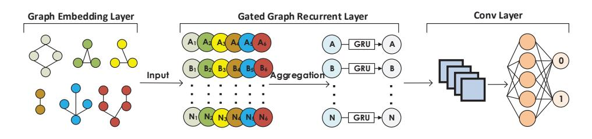
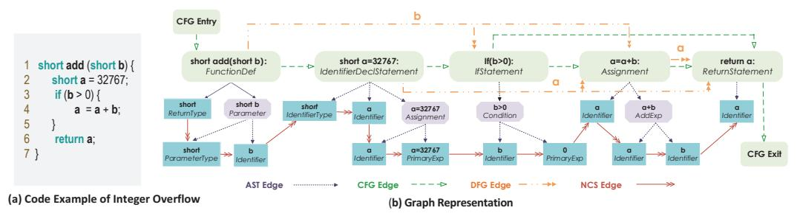

# *Devign*: Effective Vulnerability Identification by Learning Comprehensive Program Semantics via Graph Neural Networks

Yaqin Zhou Nanyang Technological University yaqinchou@gmail.com

Jingkai Siow 南洋理工大学 JINGKAI001@e.ntu.edu.sg

Shangqing Liu 南洋理工大学 shangqingliu666@gmail.com

Xiaoning Du 南洋理工大学 dxn0733@gmail.com

Yang Liu 南洋理工大学 yangliu@ntu.edu.sg

# Abstract

脆弱性の特定は、サイバーセキュリティのためにソフトウェアシステムを攻撃から守るうえで極めて重要です。特に、修正を効率化するために、ソースコードの中から脆弱な関数を特定することが重要です。しかし、これは困難で手間のかかる作業であり、専門的なセキュリティ知識も必要です。さまざまなコード表現グラフからの脆弱性の手動定義パターンに関する研究と、最近のグラフニューラルネットワークの進歩に着想を得て、私たちは*Devign*という、豊富なコードの意味的表現上で学習することでグラフレベルの分類を行う、汎用的なグラフニューラルネットワークに基づいたモデルを提案します。これには、グラフレベルの分類のために、学習された豊かなノード表現から有用な特徴を効率的に抽出する新しい*Conv*モジュールが含まれています。このモデルは、従来の研究で用いられてきた合成コードではなく、実際のソースコードの複雑性と多様性を取り入れた、4つの大規模なオープンソースCプロジェクトから構築した手動でラベル付けされたデータセット上で学習されます。これらのデータセットに対する広範な評価の結果、*Devign*は最先端手法より平均10.51%高い精度と8.68%のF1スコアを達成し、さらに*Conv*モジュールによって平均4.66%の精度と6.37%のF1スコアの向上を実現しました。

# 1 Introduction

最近、ソフトウェアの脆弱性の数が急速に増加しています。これはCVE（共通脆弱性識別子）を通じて公に報告されている場合もあれば、独自のコード内で内部的に発見される場合もあります。特に、オープンソースライブラリの普及は、脆弱性の増加に寄与するだけでなく、その影響を広げる要因にもなっています。これらの脆弱性の多くは安全でないコードによって引き起こされており、悪用されることでソフトウェアシステムへの攻撃や、経済的・社会的に大きな損害が生じる可能性があります。

脆弱性の特定は、セキュリティにおいて重要でありながらも困難な課題です。静的解析[\[1](#page-8-0), [2\]](#page-8-1)、動的解析[\[3](#page-8-2)[–5](#page-8-3)]、およびシンボリック実行などの従来の手法に加え、機械学習を補完的なアプローチとして応用することでも多くの進展が見られています。これら初期の手法[\[6](#page-8-4)[–8\]](#page-9-0)では、人間の専門家が手作業で作成した特徴やパターンを機械学習アルゴリズムの入力として脆弱性を検出します。しかし、脆弱性の根本的な原因は多様であり

脆弱性の種類[\[9\]](#page-9-1)やライブラリごとに、すべてのライブラリ内の脆弱性を手作業で作成した特徴量で特徴付けることは非現実的です。

既存の手法の使いやすさを向上させ、人間の専門家による特徴抽出の膨大な作業を避けるために、近年の研究では、ディープニューラルネットワークを用いたより自動的な脆弱性識別手法の可能性が探究されています。しかし、これらの研究にはいずれも、実際のソースコードに存在する多様で複雑な脆弱性を特徴付けるための十分なプログラム意味論を学習する上で大きな制約があります。まず、学習手法の観点から言えば、ソースコードを自然言語と同様に単なる平坦なシーケンスとして扱うか、あるいは部分的な情報だけで表現しています。しかし、ソースコードは実際には自然言語よりもはるかに構造的かつ論理的であり、抽象構文木（AST）、データフロー、制御フローなど、異なる側面で表現されます。さらに、脆弱性はしばしば非常に微妙な欠陥であり、意味論の複数の側面から包括的に調査する必要があります。したがって、これまでの研究の設計上の欠点が、さまざまな脆弱性を網羅する可能性を制限しています。次に、学習データの観点からは、[\[11](#page-9-4)] の一部のデータは静的解析ツールによってラベル付けされており、実際には脆弱性でないにもかかわらず高い割合で誤検出が導入されています。また、[\[10\]](#page-9-2) のような別の部分では、「good」や「bad」などの記述を含む単純な人工コードが用いられており、これは実コードの複雑さには到底及ばないものです [\[13](#page-9-5)]。

この目的のために、私たちは事実に基づく脆弱性データのための複合的なプログラミング表現を備えた新しいグラフニューラルネットワークベースのモデルを提案します。これにより、多様な脆弱性の特徴を捉えるために、古典的なプログラムコードのセマンティクス全体をエンコードすることが可能となります。主なイノベーションは、ゲート付きリカレントユニットからグラフの異種ノード特徴を入力として受け取る新しい *Conv* モジュールです。*Conv* モジュールは、グラフレベルの分類のために、従来の畳み込み層と全結合層を活用しながら、階層的により粗い特徴を選択します。さらに、ソースコードに対する複合的なプログラミング埋め込みの可能性と、脆弱性特定という困難な課題に対する提案モデルの有効性を検証するために、Cプログラミング言語で記述された4つの人気かつ多様なライブラリから手動でラベル付けしたデータセットを作成しました。このモデルを *Devign*（Deep Vulnerability Identification via Graph Neural Networks）と名付けました。

- 複合コード表現では、ASTをバックボーンとして、プログラムの制御依存性とデータ依存性を異なるレベルで明示的にエンコードし、それぞれの表現に対応する種類の接続を示す異種エッジの結合グラフに統合します。従来の研究では考慮されていなかったこの包括的な表現により、できるだけ幅広い種類やパターンの脆弱性を捉えることが可能となり、グラフニューラルネットワークを通じてより優れたノード表現の学習が可能になります。
- 私たちは、グラフレベルの分類のために *Conv* モジュールを備えたゲート付きグラフニューラルネットワークモデルを提案します。*Conv* モジュールはノード特徴量から階層的に学習し、グラフレベルの分類タスクのためにより高次の表現を捉えます。
- 私たちは *Devign* を実装し、4つの代表的なCライブラリから収集した *手作業* でラベル付けされたデータセット（*約600人時*かかりました）によってその有効性を評価しました。私たちは、二つのデータセットと詳細情報を[こちらで公開しています（\(https://sites.google.com/view/devign\)](https://sites.google.com/view/devign))。結果として、*Devign* はベースライン手法より平均で10.51%高い精度と8.68%高いF1スコアを達成しました。また、*Conv*モジュールは平均で4.66%の精度と6.37%のF1スコア向上をもたらしました。さらに、4つのプロジェクトから収集した最新の40件のCVEに*Devign*を適用し、74.11%の精度を得ており、新たな脆弱性を発見できる実用性を示しています。

## 2 The *Devign* Model

コードプロパティグラフを用いて手動で作成された脆弱性パターンは、すべての構文および依存関係のセマンティクスを統合しており、ソフトウェアの脆弱性検出において最も効果的な手法の1つであることが証明されています[\[14\]](#page-9-6)。この発想に触発されて、私たちはコードプロパティグラフ上で上述のプロセスを自動化し、グラフニューラルネットワークを利用して脆弱なパターンを学習する*Devign*を設計しました[\[15\]](#page-9-7)。*Devign*のアーキテクチャはFigure [1,](#page-2-0) に示されており、3つの連続したコンポーネントから構成されています。1) *Graph Embedding Layer of Composite Code Semantics*は、関数の生のソースコードを包括的なプログラムセマンティクスを持つ統合グラフ構造へとエンコードします。2) *Gated Graph Recurrent Layers*は、グラフ内の隣接ノードの情報を集約・伝播することでノードの特徴を学習します。3) *Convモジュール*は、グラフレベルの予測のために意味のあるノード表現を抽出します。

Figure 1: *Devign* のアーキテクチャ

#### 2.1 Problem Formulation

ほとんどの機械学習やパターンベースの手法は、ソースファイルまたはアプリケーションという粗い粒度レベルで脆弱性を予測します。つまり、ソースファイルまたはアプリケーションが潜在的に脆弱であるかどうかを予測します。ここでは、脆弱性分析の全体的な流れの中で最も細かい粒度である*関数レベル*で脆弱なコードを分析します。脆弱な関数の識別をバイナリ分類問題として定式化します。すなわち、生のソースコード内の関数が脆弱かどうかを判断することを学習します。データのサンプルを ((ci , yi)|ci ∈ C, yi ∈ Y), i ∈ {1, 2, . . . , n} と定義します。ここで、C はコード中の関数の集合、Y = {0, 1} n はラベル集合で、1 が脆弱、0 がそれ以外を表し、n はインスタンス数です。ci は関数なので、多重辺グラフ gi(V, X, A) ∈ G としてエンコードされていると仮定します（埋め込みの詳細はセクション [2.2](#page-2-1) を参照）。m を V 内のノード数とし、X ∈ R m×d は初期ノード特徴行列で、V の各頂点 vj は d 次元の実数値ベクトル xj ∈ R d で表されます。A ∈ {0, 1} k×m×m は隣接行列で、k は辺の種類の総数です。A 内の要素 e p s,t が 1 の場合、ノード vs と vt は種類 p のエッジで接続されていること、0 の場合は接続されていないことを示します。*Devign* の目標は、G から Y への写像、すなわち f : G 7→ Y を学習し、関数が脆弱かどうかを予測することです。予測関数 f は以下の損失関数を最小化することで学習できます。

$$
\min \sum_{i=1}^{n} \mathcal{L}(f(g_i(V, X, A), y_i|c_i)) + \lambda \omega(f) \tag{1}
$$

ここで、L(·) は交差エントロピー損失関数、ω(·) は正則化項、λ は調整可能な重みです。

#### 2.2 Graph Embedding Layer of Composite Code Semantics

図[1](#page-2-0)に示されているように、グラフ埋め込み層EMBは、関数コードciをモデルへの入力としてグラフデータ構造にマッピングするものです。

$$
g_i(V, X, A) = EMB(c_i), \forall i = \{1, ..., n\}
$$
（2）

このセクションでは、特徴学習のためにコードを複合グラフに埋め込む際、なぜ古典的なコード表現を活用するのか、またどのようにそれを行うのかという動機と手法について説明します。

#### 2.2.1 Classical Code Graph Representation and Vulnerability Identification

プログラム解析においては、プログラムの背後にあるより深いセマンティクスを表現するために、様々な表現方法が利用されます。従来の概念には、AST（抽象構文木）、制御フローグラフ、およびデータフローグラフなどが含まれ、これらはソースコード中の異なるトークン間の構文的・意味的な関係を捉えます。メモリリークのような脆弱性の大部分は、複合的なコードセマンティクスを総合的に考慮しなければ発見が難しいほど微妙なものです[\[14\]](#page-9-6)。たとえば、ASTだけでは安全でない引数のみを特定できると報告されています[\[14\]](#page-9-6)。ASTと制御フローグラフを組み合わせることで、さらにリソースリークや一部のuse-after-free脆弱性という二種類の脆弱性にも対応できるようになります。さらにこれら三つのコードグラフを統合することで、実行時特性に依存する競合状態や、プログラムの意図された設計に関する詳細がなければモデル化が困難な設計上の誤りという、追加の外部情報を必要とする二種類を除き、ほとんどの脆弱性タイプを記述することが可能となります。

手動で脆弱性テンプレートをグラフトラバーサルとして作成しましたが、これは重要な洞察を示し、AST、制御フローグラフ、データフローグラフの特性を統合したデータ構造を通じて、より広範な脆弱性パターンを学習することが可能であることを証明しました。古典的な3つのコード構造に加えて、私たちはソースコードの自然なシーケンスも考慮しています。というのも、最近の深層学習に基づく脆弱性検出の進展がその有効性を示しているためです。これは独自のフラットな構造により、コードトークン間の関係を「人間が読みやすい」形で捉えることができるため、古典的な表現を補完することができます。

Figure 2: 整数オーバーフローを含むコードスニペットのグラフ表現

## 2.2.2 Graph Embedding of Code

次に、各コード表現の種類と、さまざまな部分グラフをどのように一つの統合グラフにまとめるかについて簡単に紹介します。整数オーバーフローのコード例（Figure [2\(](#page-3-0)a））およびそのグラフ表現（Figure [2\(](#page-3-0)b））に従って説明します。

抽象構文木（AST）は、ソースコードの順序付けられた木構造の表現です。通常、これはコードパーサーによってプログラムの基本的な構造を理解し、構文的なエラーを検査するために最初に使用される表現です。そのため、多くの他のコード表現を生成する基礎となり、本論文で使用される他の三つのコード表現のノード集合はすべてASTのノード集合に含まれます。ルートノードから始まり、コードはコードブロック、文、宣言、式などへと分解され、最終的には葉ノードとなる主要なトークンへと分割されます。主要なASTノードはFigure [2.](#page-3-0) に示されています。すべての枠はASTノードであり、最初の行に特定のコードが示され、ノードタイプが注記されています。青い枠はASTの葉ノードを示し、紫の矢印は子ノードと親ノードの*AST*関係を表しています。

Control Flow Graph (CFG)  
CFGは、プログラムの実行中にたどりうるすべての経路を記述します。経路の選択肢は、たとえば*if*、*for*、*switch*ステートメントのような条件文によって決まります。CFGでは、ノードが文や条件を表し、それらは制御の移動を示す有向エッジで接続されています。*CFG*のエッジは、図[2.](#page-3-0)で緑色の破線矢印として強調表示されています。特に、フローはエントリから始まり、出口で終了し、*if*ステートメントで2つの異なる経路が分岐します。

Data Flow Graph (DFG) DFGは、CFG全体にわたる変数の使用状況を追跡します。データフローは変数志向であり、いかなるデータフローも特定の変数へのアクセスまたは変更を伴います。DFGのエッジは、同じ変数に対する後続のアクセスや修正を表します。これは、図 [2](#page-3-0) でオレンジ色の二重矢印で示されており、関与する変数がエッジ上に注釈されています。例えば、パラメータ b は *if* 条件式と代入文の両方で使用されています。

Natural Code Sequence (NCS)  
ソースコードの自然な順序をエンコードするために、*NCS* エッジを使用してAST内の隣接するコードトークンを接続します。このようなエンコーディングの主な利点は、ソースコードの順序によって反映されるプログラミングロジックを保持できることです。*NCS* エッジは図 [2,](#page-3-0) で赤い矢印で示されており、ASTの全ての葉ノードを接続します。

したがって、関数 ci は、4種類のサブグラフ（または4種類のエッジ）を持ち、同じノード集合 V = V ast を共有する合同グラフ g で表すことができます。図 [\(2\)](#page-3-0) に示すように、すべてのノード v ∈ V には「*Code*」と「*Type*」の2つの属性があります。*Code* にはノード v が表すソースコードが含まれており、v の type は型属性を示します。初期ノード表現 xv にはこれら2つの属性が反映されます。したがって、*Code* はプロジェクト全体のソースコードファイルから構築したコードコーパスを用いた事前学習済みの word2vec モデルでエンコードし、*Type* はラベルエンコーディングを用いてエンコードします。これら2つのエンコーディングを結合して初期ノード表現 xv とします。

### 2.3 Gated Graph Recurrent Layers

グラフニューラルネットワークの主要なアイデアは、隣接ノードの集約を通じてローカルな近傍からノード表現を埋め込むことです。近傍情報の集約手法の違いに基づき、グラフ畳み込みネットワーク、GraphSAGE、ゲート付きグラフリカレントネットワークやそのバリエーションがあります。私たちはノード埋め込みを学習するためにゲート付きグラフリカレントネットワークを選択しました。これは他の2つよりもより深い構造を扱うことができ、意味情報とグラフ構造の両方を持つ我々のデータにより適しているためです。

与えられた埋め込みグラフ gi(V, X, A) に対して、各ノード vj ∈ V について、ノード状態ベクトル h (1) j ∈ R z , z ≥ d を初期アノテーションを用いて初期化します。これは xj を最初の次元にコピーし、アノテーションサイズよりも大きな隠れ状態を許すために余分な0を埋め込みます。すなわち、h 1 j = [x ⊤ j , 0] ⊤ となります。T を近傍集約のための総タイムステップ数とします。グラフ全体に情報を伝播させるために、各タイムステップ t ≤ T で、すべてのノードはエッジの種類と方向に依存したエッジを介して互いに情報をやりとりします（これはAのp番目の隣接行列 Ap で記述され、定義から隣接行列の数がエッジタイプ数と等しいことが分かります）。

$$
a_{j,p}^{(t-1)} = A_p^{\top} \left( W_p \left[ h_1^{(t-1)\top}, \dots, h_m^{(t-1)\top} \right] + b \right)
$$
（3）

ここで、Wp ∈ R z×z は学習する重みであり、b はバイアスです。特に、ノード vj の新しい状態 aj,p は、エッジタイプ p の隣接行列 Ap で定義されたすべての隣接ノードの情報を集約することで計算されます。残りのステップはゲーティッドリカレントユニット（GRU）であり、すべてのタイプからの情報とノード v、前のタイムステップを取り入れて、現在のノードの隠れ状態 h (t) i,v を得ます。

$$
h_j^{(t)} = GRU(h_j^{(t-1)}, AGG(\{a_{j,p}^{(t-1)}\}_{p=1}^k))
$$
\n(4)

ここで、AGG(·)は集約関数を表しており、異なるエッジタイプからの情報を集約して次のタイムステップのノード埋め込み h (t) を計算するために、{MEAN, MAX, SUM, CONCAT} のいずれかの関数を用いることができます。実装ではSUM関数を使用しています。上記の伝播手続きはTタイムステップにわたって繰り返され、最後のタイムステップにおける状態ベクトル H (T) i = {h (T) j } m j=1 が、ノード集合 V に対する最終的なノード表現行列となります。

#### 2.4 The Conv Layer

ゲート付きグラフ再帰層から生成されたノード特徴は、ノード予測、リンク予測、グラフレベルの予測など、任意の予測層への入力として利用できます。そして、モデル全体をエンドツーエンドで学習することができます。本研究の課題では、関数 ci が脆弱かどうかを判定するために、グラフレベルの分類タスクを実行する必要があります。グラフ分類の標準的なアプローチは、これらすべての生成されたノード埋め込みをグローバルに集約することです。たとえば、線形重み付きの総和によりすべての埋め込みを単純に足し合わせる方法があり[\[15\],](#page-9-7) [19\]](#page-9-12) 、これは式[\(5\)](#page-4-0) に示されています。

$$
\tilde{y}_i = Sigmoid\bigg(\sum MLP([H_i^{(T)}, x_i])\bigg) \tag{5}
$$

ここでシグモイド関数は分類に使用され、MLPはH (T) iとxiの連結をR mベクトルにマッピングする多層パーセプトロン（MLP）を指します。このようなアプローチは、グラフ全体にわたる効果的な分類を妨げます[\[20,](#page-9-13) [21\]](#page-9-14)。

したがって、*Conv*モジュールは、現在のグラフレベルのタスクに関連するノードおよび特徴量のセットを選択するように設計されています。先行研究[\[21\]](#page-9-14)では、グラフ畳み込み層の後にSortPooling層を用いて、固定順序を持たないグラフ上でノード特徴量を一貫した順序にソートし、その後に従来のニューラルネットワークを追加して、グラフに符号化された豊富な情報を特徴づける有用な特徴量を抽出するために訓練できることが提案されています。本研究の問題では、それぞれのコード表現グラフが隣接行列で符号化された独自のノードの事前定義順序と接続を持ち、ノード特徴量は異なるチャンネルのノード特徴量をソートする必要があるグラフ畳み込みネットワークではなく、ゲート付きリカレントグラフ層を通じて学習されます。したがって、グラフレベルのタスクに関連する特徴量をより効果的に予測するために、1次元畳み込みおよび全結合ニューラルネットワークを直接適用します[1](#page-4-1)。σ(·)をmax pooling付きの1次元畳み込み層として定義します。

$$
\sigma(\cdot) = MAXPOOL(Relu(CONV(\cdot)))\tag{6}
$$

l を適用された畳み込み層の数とすると、*Conv* モジュールは次のように表すことができます。

$$
Z_i^{(1)} = \sigma([H_i^{(T)}, x_i]), \dots, Z_i^{(l)} = \sigma(Z_i^{(l-1)})
$$
\n(7)

$$
Y_i^{(1)} = \sigma(H_i^{(T)}), \dots, Y_i^{(l)} = \sigma(Y_i^{(l-1)})
$$
\n(8)

$$
\tilde{y}_i = Sigmoid\big(AVG(MLP(Z_i^{(l)}) \odot MLP(Y_i^{(l)}))\big) \tag{9}
$$

まず、連結された [H (T) i , xi] に対して従来の1次元畳み込み層を、最終ノード特徴 H (T) i に対して全結合層をそれぞれ適用します。その後、2つの出力に対して要素ごとの積を行い、得られたベクトルを平均集約し、最後に予測を行います。

1また、AST順にソートされたノードに対してLSTMやBiLSTM（アテンション機構の有無を含む）も試しましたが、全体的には畳み込みネットワークが最も良い結果を示しました。

(There is no prose in your provided Markdown paragraph; it is a table consisting only of headers and numerical data. Therefore, there is no text to translate to Japanese. The table itself remains unchanged.)

Table 1: データセットの概要

# 3 Evaluation

私たちは、最先端の脆弱性発見手法と比較して*Devign*の利点を評価し、次の問いを理解することを目的としています。

Q1 私たちの*Devign*は、他の学習ベースの脆弱性識別手法とどのように比較されるのでしょうか？Q2 私たちの*Conv*モジュールを搭載した*Devign*は、グラフレベル分類タスクにおいて、式[\(5\)](#page-4-0)のフラットな総和を用いた*Ggrn*と比べてどうでしょうか？

Q3 *Devign*は、各種のコード表現（例えば、1種類の情報のみを持つ単一エッジグラフ）から学習することができますか？また、複合グラフ（例えば、すべての種類のコード表現を含む）を用いた*Devign*モデルは、それぞれの単一エッジグラフと比べてどのような違いがありますか？

Q4 実際のシナリオで脆弱な関数の割合が非常に低いという極端に不均衡なデータセットの場合、*Devign*は一部の静的解析ツールと比べてより良い性能を発揮できるのでしょうか？

Q5 *Devign*は、CVEを通じて公に報告された最新の脆弱性に対してどのような性能を示しますか？

## 3.1 Data Preparation

高品質な脆弱な関数のデータセットを取得するのは、専門知識が求められるため決して容易ではありません。[\[12\]](#page-9-3) は脆弱な関数のデータセットを公開していますが、ラベルは統計的解析器によって生成されており、正確性に欠けています。[\[22](#page-9-15)] で使用されている他の潜在的なデータセットも入手できません。本研究では、産業パートナーの支援のもと、セキュリティチームを編成し、ゼロからデータの収集とラベリングを行いました。生の関数の収集に加えて、各関数のグラフ表現およびグラフ内の各ノードの初期表現を生成する必要があります。詳細な手順については、以下で説明します。

Raw Data Gathering  
*Devign* の脆弱性パターン学習能力を評価するために、私たちは開発者の間で人気があり、機能も多様な4つの大規模C言語オープンソースプロジェクト（Linux Kernel、QEMU、Wireshark、FFmpeg）から手動でラベル付けされた関数を収集し、評価を行いました。

データラベリングの質を確保するために、まずはセキュリティ関連のコミットを収集し、それらを脆弱性修正コミットまたは非脆弱性修正コミットとしてラベル付けしました。その後、ラベル付けされたコミットから直接、脆弱または非脆弱な関数を抽出しました。脆弱性修正コミット（VFC）は、潜在的な脆弱性を修正するコミットであり、これらのコミットによる修正前のソースコードから脆弱な関数を抽出することができます。一方、非脆弱性修正コミット（non-VFC）は、脆弱性を修正しないコミットであり、同様に修正前のソースコードから非脆弱な関数を抽出できます。コミットの収集には、[\[23](#page-9-16)]で提案された手法を採用しました。これは以下の2つのステップで構成されています。1）*コミットのフィルタリング*。脆弱性関連のコミットはごく一部しか存在しないため、メッセージがDoSやインジェクションなどのセキュリティ関連キーワードに一致しない、セキュリティとは無関係なコミットを除外します。残りのコミットは、セキュリティ関連である可能性が高いため、手動でラベル付けします。2）*手動ラベリング*。4人の専門セキュリティ研究者のチームが、合計*600人時*をかけて2ラウンドのデータラベリングとクロス検証を実施しました。

コミットが適用される前に、これらの変更された関数のソースコードを抽出し、それに応じてラベルを割り当てます。

グラフ生成  
私たちは、コードプロパティグラフに基づくC/C++用のオープンソースのコード解析プラットフォームであるJoern [\[14\]](#page-9-6) を利用して、データセット内のすべての関数についてASTとCFGを抽出します。Joern内部のコンパイルエラーや例外が発生するため、一部の関数についてのみASTとCFGを取得することができます。ASTやCFGが取得できなかった関数や、ASTやCFGに明らかなエラーがある関数は除外しています。元のDFGのエッジは関与する変数によってラベル付けされており、これによってエッジの種類が非常に多くなり、組み込まれたグラフも複雑になってしまうため、DFGの代わりに他の3つの関係、*LastRead (DFG\_R)*、*LastWrite (DFG\_W)*、

以下の表は、さまざまなモデルやメソッドが、Linux Kernel、QEMU、Wireshark、FFmpeg、それらを組み合わせたデータセットでの性能（ACC、F1スコア）を示しています。また、それぞれの最大差や平均差も記載されています。各メソッドについて、AST（抽象構文木）、CFG（制御フローグラフ）、NCS（ノード特徴）、DFG（データフローグラフの種類別）、Composite（複合特徴）など、異なる特徴表現を用いた結果が比較されています。全体的に、DevignやGgrnといったグラフベースのモデルが高い性能を示しており、特にComposite特徴を用いた場合に良好な結果が得られています。また、最大・平均の差分値からは、データセット間での性能一貫性も確認できます。

Table 2: 分類精度とF1スコア（パーセンテージで示す）：最も右側の2つの列は、複合的なコード表現を用いた*Devign*モデル、すなわち*Devign*（Composite）と比較した場合の精度およびF1スコアの最大および平均相対差を示しています。

および *ComputedFrom (DFG\_C)* [\[24\]](#page-9-17) によって、グラフ埋め込みのためにより適応的にします。*DFG\_R* は、変数の各出現における直前の読み取りを表します。各出現はASTの葉ノードから直接認識できます。*DFG\_W* は、変数の各出現における直前の書き込みを表します。同様に、これらのアノテーションも葉ノードの変数に付与します。*DFG\_C* は変数のソースを決定します。代入文において、左辺（lhs）の変数が右辺（rhs）の式によって新しい値に代入されます。DFG\_C は、lhs変数と各rhs変数との関係を捉えます。

さらに、計算効率のため、ノードサイズが500を超える関数は除外しました。これは全体の15%に相当します。データセットの統計情報を表[1.](#page-5-0)にまとめました。

## 3.2 Baseline Methods

パフォーマンス比較では、*Devign* を最先端の機械学習ベースの脆弱性予測手法や、分類のために線形重み付き加算を使用したゲーティッドグラフリカレントネットワーク（*Ggrn*）と比較します。

Metrics + Xgboost [\[22\]](#page-9-15): Joernを使用して、各関数について合計4つの複雑度メトリクスと11の脆弱性メトリクスを収集し、分類にはXgboostを利用します。ここでは、提案されたビニングおよびランキング手法は学習ベースではなく、脆弱性の可能性をランク付けするためのヒューリスティックであったため使用しませんでした。最適なパラメータはBayes Optimization [\[25\]](#page-10-0) を用いて探索します。

3層BiLSTM [\[10](#page-9-2)]: これはソースコードを自然言語として扱い、トークナイズされたコードを初期埋め込みとしてWord2vecで学習したベクトルを使用して双方向LSTMに入力します。ここでは最良の性能を得るために3層の双方向LSTMを実装しました。

3層BiLSTM + Att: これは、アテンション機構 [\[26\]](#page-10-1) を組み込んだ [\[10\]](#page-9-2) の改良版です。

CNN [\[11\]](#page-9-4): [\[10\]](#page-9-2)と同様に、ソースコードを自然言語として扱い、単語の集合（Bag of Words）を使用してコードトークンの初期埋め込みを取得し、それらをCNNに入力して学習させます。

## 3.3 Performance Evaluation

埋め込み層では、初期ノード表現のためのword2vecの次元数は100です。ゲート付きグラフリカレント層では、隠れ状態の次元数を200、タイムステップ数を6に設定しています。*Devign*の*Conv*パラメータについては、最初の畳み込み層にReLU活性化関数を持つ(1, 3)フィルタを適用し、その後に(1, 3)フィルタと(1, 2)ストライドの最大プーリング層を配置しています。2番目の畳み込み層には(1, 1)フィルタと、(2, 2)フィルタおよび(1, 2)ストライドの最大プーリング層を使用します。学習率0.0001、バッチサイズ128のAdamオプティマイザと、過学習を防ぐためのL2正則化を使用します。各データセットをランダムにシャッフルし、75%

| Method                      | Cppcheck ACC | F1   | Flawfinder ACC | F1   | CXXX ACC            | F1 ACC | F1    | ACC   | 3-layer BiLSTM 3-layer BiLSTM + Att F1 | ACC   | CNN F1         | ACC   | Devign (Composite) F1 |
|-----------------------------|-----------------|------|-------------------|------|------------------------|-----------|-------|-------|-------------------------------------------|-------|-------------------|-------|--------------------------|
| Linux                       | 75.11           | 0    |                   |      | 78.46 12.57 19.44 5.07 | 18.25     | 13.12 | 8.79  | 16.16                                     |       | 29.03 15.38 69.41 |       | 24.64                    |
| QEMU                        | 89.21           | 0    | 86.24             | 7.61 | 33.64 9.29             | 29.07     | 15.54 | 78.43 | 10.50                                     |       | 75.88 18.80 89.27 |       | 41.12                    |
| Wireshark 89.19 10.17 89.92 |                 |      |                   | 9.46 | 33.26 3.95             | 91.39     | 10.75 | 84.90 | 28.35                                     | 86.09 | 8.69              | 89.37 | 42.05                    |
| FFmpeg                      | 87.72           | 0    |                   |      | 80.34 12.86 36.04 2.45 | 11.17     | 18.71 | 8.98  | 16.48                                     |       | 70.07 31.25 69.06 |       | 34.92                    |
| Combined 85.41              |                 | 2.27 |                   |      | 85.65 10.41 29.57 4.01 | 9.65      | 16.59 | 15.58 | 16.24                                     |       | 72.47 17.94 75.56 |       | 27.25                    |

この表は、さまざまなソフトウェアプロジェクトで異なるバグ検出手法の性能を比較したものです。各手法について、Accuracy（ACC）やF1スコアが示されています。また、CNNやBiLSTMなどの機械学習モデルの結果も含まれています。これにより、各手法がプロジェクトごとにどの程度有効かを評価することができます。

表3：不均衡な設定下での分類精度およびF1スコア（パーセンタイル）

トレーニングにはこのうちの75％を、残りの25％を検証用に使用します。私たちのモデルはNvidia Graphics Tesla M40およびP40上でトレーニングされ、アーリーストッピングには100エポックのパティエンスを設定しています。

結果の分析  
我々はパフォーマンスを測定するために*accuracy*と*F1スコア*を使用します。表[3.3](#page-7-0)は、すべての実験結果をまとめたものです。まず、Q1、すなわち*Devign*と他の学習ベース手法との比較結果について分析します。ベースライン手法、複合コード表現を用いた*Ggrn*および*Devign*の結果から、*Ggrn*と*Devign*の両方がすべてのデータセットでベースライン手法を大きく上回っていることが分かります。特に、すべてのベースライン手法と比較して、*Devign*による相対的なaccuracyの向上は平均で10.51%、QEMUデータセットでは少なくとも8.54%の向上が見られます。*Devign*（複合型）は、F1スコアの点でも4つのベースライン手法より優れており、平均で8.68%の相対的な向上、各データセット（Linux Kernel、QEMU、Wirshark、FFmpeg、Combined）における最小の相対的向上率はそれぞれ2.31%、11.80%、6.65%、4.04%、4.61%となっています。Linuxはベストプラクティスに従ったコーディングスタイルが採用されているため、*Devign*によるF1スコア84.97は全データセットの中で最も高い値です。*したがって、*Devign*はグラフ内に包括的なセマンティクスを符号化することで、最先端の脆弱性検出手法よりも有意に優れた性能を発揮します。*

次に、*Devign* の *Ggrn* に対する性能向上（Q2）について調査します。まず、複合コード表現を用いたスコアを見ます。全てのデータセットにおいて、*Devign* は *Ggrn* よりも高い正解率（平均3.23%）を達成しており、最も正解率の差が大きいのは FFmpeg データセットで 5.12% となっています。 また、*Devign* は F1 値においても *Ggrn* より高い平均値（3.92%）を示し、QEMU データセットで最大6.82% の差を記録しています。さらに、単一のコード表現ごとのスコアを見た場合でも、一般的に *Devign* が *Ggrn* を大きく上回っているという同様の結論が得られました。具体的には、DFG\_W エッジで正解率が最大9.21%向上し、DFG\_C で F1 値が最大17.13%向上しました。*全体として、すべてのケースにおける Devign の平均正解率および F1 の向上幅は、Ggrn と比べてそれぞれ 4.66%、6.37% となっており、これは Conv モジュールがグラフレベルの予測のためにより関連するノードや特徴を抽出していることを示しています。*

次に、Q3の結果を確認し、*Devign*が異なるタイプのコード表現を学習できるかどうか、および複合グラフでの性能について答えます。驚くべきことに、単一エッジグラフから学習した結果は、*Ggrn*と*Devign*の両方で非常に有望であることがわかりました。*Ggrn*では、特定の種類のエッジにおいては、複合グラフよりもわずかに高い精度を示す場合があり、例えば、CFGグラフとNCSグラフの両方がFFmpegと結合データセットでより良い結果を得ています。*Devign*については、精度の観点ではLinuxデータセットを除き、複合グラフ表現はすべての単一エッジグラフよりも全体的に優れており、その向上幅は0.11%から3.75%の範囲となっています。F1スコアの観点からは、複合グラフによる単一エッジグラフに対する改善は平均で2.69%、すべてのテストにおいて0.4%から7.88%の範囲となっています。*まとめると、複合グラフは* Devign *が単一エッジグラフよりも優れた予測モデルを学習するのに役立ちます。*

Q4の実際の不均衡データセットにおける静的解析ツールとの比較について回答するために、大規模な産業規模の分析 [\[23](#page-9-16)] に従い、テストデータをランダムにサンプリングして、脆弱な関数が10%含まれる不均衡データセットを作成しました。広く知られているオープンソースの静的解析ツールであるCppcheck、Flawfinder、そして法的な理由により名称を伏せる商用ツールCXXXと比較を行いました。結果はTableに示されており、我々の手法は全ての静的解析ツールよりも有意に高いF1スコア（27.99高い）を達成しています。一方で、静的解析ツールは多くの脆弱な関数を見逃す傾向があり、偽陽性率も高くなっています。例えば、Cppcheckは4つの単一プロジェクトデータセットのうち3つで脆弱性を1つも検出できませんでした。

最後に、Q5の最新の公開された脆弱性について回答するために、各プロジェクトの最新の10件のCVEを収集し、*Devign*がゼロデイ脆弱性の特定に潜在的に適用できるかどうかを調査しました。40件のCVEのコミット修正に基づき、合計で112個の脆弱な関数を得ました。*これらの関数を訓練済みの* Devign *モデルに入力したところ、平均で74.11%の精度を達成しました。これは* Devign *が実際の応用で新しい脆弱性を発見する可能性を示しています。*

# 4 Related Work

ディープラーニングの成功は、研究者たちにソースコード上の脆弱性発見をより自動化するためのソリューションとして応用する動機を与えました[\[12,](#page-9-3) [10,](#page-9-2) [11](#page-9-4)]。最近の研究[\[10,](#page-9-2) [12,](#page-9-3) [11\]](#page-9-4)では、ソースコードを平坦な自然言語シーケンスとして扱い、脆弱性検出における自然言語処理技術の可能性を探っています。例えば、[\[12](#page-9-3), [10\]](#page-9-2)ではLSTM/BiLSTMニューラルネットワークに基づいたモデルを構築し、[\[11\]](#page-9-4)では代わりにCNNの使用を提案しています。

上述のモデルがコード内の論理や構造を表現する際の限界を克服するために、多くの研究が木構造やグラフ構造など、より構造的なニューラルネットワークを様々なタスクで試みてきました。例えば、[\[15\]](#page-9-7)では、ゲート付きグラフ再帰ネットワークを用いてプログラム検証のための論理式を生成することを提案し、[\[24\]](#page-9-17)では変数名の予測や変数の誤使用の予測を目的としています。[\[28\]](#page-10-3)では、バイナリコード類似性検出のためにGeminiを提案し、バイナリコード内の関数を属性付き制御フローグラフで表現し、グラフ埋め込み学習にはStructure2vec [\[19](#page-9-12)]を入力として使用しています。これらの研究とは異なり、本研究は脆弱性の識別を目的とし、多様な種類の脆弱性を表現できるように包括的なコード表現を取り入れました。また、本研究では[\[15\]](#page-9-7)のゲート付きグラフ再帰層を採用しており、ノードの意味（例：ノード注釈）と構造的特徴の両方を考慮していますが、これらはどちらも脆弱性識別において重要です。Structure2vecは主に構造的特徴の学習に焦点を当てています。変数予測のためにゲート付きグラフ再帰ネットワークを用いた[\[24\]](#page-9-17)と比べて、我々は制御フローグラフを合成グラフに明示的に組み込み、効率的なグラフレベル分類のために*Conv*モジュールを提案しています。

## 5 Conclusion and Future Work

私たちは、新しい脆弱性識別モデル *Devign* を紹介します。このモデルは、ソースコード関数を複数の構文的および意味的表現からなる結合グラフ構造にエンコードし、その複合グラフ表現を活用することで、脆弱なコードを効果的に発見するための学習を行います。これは、実際のオープンソースプロジェクトにおける機械学習ベースの脆弱関数検出で新しい最先端の結果を達成しました。今後の興味深い課題としては、プログラムスライシングの統合による大きな関数からの効率的な学習、学習済みモデルをプロジェクトをまたいで脆弱性検出に応用すること、人間が読める・説明可能な脆弱性評価の生成などが挙げられます。

## References

- [1] Z. Xu, B. Chen, M. Chandramohan, Y. Liu, and F. Song, "Spain: security patch analysis for binaries towards understanding the pain and pills," in *Proceedings of the 39th International Conference on Software Engineering*. IEEE Press, 2017, pp. 462–472.
- [2] M. Chandramohan, Y. Xue, Z. Xu, Y. Liu, C. Y. Cho, and H. B. K. Tan, "Bingo: Crossarchitecture cross-os binary search," in *Proceedings of the 2016 24th ACM SIGSOFT International Symposium on Foundations of Software Engineering*. ACM, 2016, pp. 678–689.
- [3] Y. Li, Y. Xue, H. Chen, X. Wu, C. Zhang, X. Xie, H. Wang, and Y. Liu, "Cerebro: contextaware adaptive fuzzing for effective vulnerability detection," in *Proceedings of the 2019 27th ACM Joint Meeting on European Software Engineering Conference and Symposium on the Foundations of Software Engineering*. ACM, 2019, pp. 533–544.
- [4] H. Chen, Y. Xue, Y. Li, B. Chen, X. Xie, X. Wu, and Y. Liu, "Hawkeye: Towards a desired directed grey-box fuzzer," in *Proceedings of the 2018 ACM SIGSAC Conference on Computer and Communications Security*. ACM, 2018, pp. 2095–2108.
- [5] Y. Li, B. Chen, M. Chandramohan, S.-W. Lin, Y. Liu, and A. Tiu, "Steelix: program-state based binary fuzzing," in *Proceedings of the 2017 11th Joint Meeting on Foundations of Software Engineering*. ACM, 2017, pp. 627–637.
- [6] S. Neuhaus, T. Zimmermann, C. Holler, and A. Zeller, "Predicting vulnerable software components," in *Proceedings of the 14th ACM Conference on Computer and Communications Security*, ser. CCS '07. New York, NY, USA: ACM, 2007, pp. 529–540. [Online]. Available: <http://doi.acm.org/10.1145/1315245.1315311>
- [7] V. H. Nguyen と L. M. S. Tran, "Predicting vulnerable software components with dependency graphs," in *Proceedings of the 6th International Workshop on Security Measurements and Metrics*, ser. MetriSec '10. New York, NY, USA: ACM, 2010, pp. 3:1–3:8. [Online]. Available:<http://doi.acm.org/10.1145/1853919.1853923>
- [8] Y. Shin, A. Meneely, L. Williams, and J. A. Osborne, "Evaluating complexity, code churn, and developer activity metrics as indicators of software vulnerabilities," *IEEE Trans. Softw. Eng.*, vol. 37, no. 6, pp. 772–787, Nov. 2011. [Online]. Available: <http://dx.doi.org/10.1109/TSE.2010.81>
- [9] "CWE List Version 3.1," ["https://cwe.mitre.org/data/index.html",]("https://cwe.mitre.org/data/index.html") 2018.
- [10] Z. Li、D. Zou、S. Xu、X. Ou、H. Jin、S. Wang、Z. Deng、Y. Zhong、「Vuldeepecker: 脆弱性検出のためのディープラーニングベースのシステム」、*25th Annual Network and Distributed System Security Symposium (NDSS 2018)*、2018年。
- [11] R. Russell、L. Kim、L. Hamilton、T. Lazovich、J. Harer、O. Ozdemir、P. Ellingwood、M. Mc-Conley、「深層表現学習を用いたソースコードの自動脆弱性検出」、*2018 17th IEEE International Conference on Machine Learning and Applications (ICMLA)*、IEEE、2018年、pp. 757–762。
- [12] H. K. Dam, T. Tran, T. Pham, S. W. Ng, J. Grundy, and A. Ghose, "Automatic feature learning for vulnerability prediction," *arXiv preprint arXiv:1708.02368*, 2017.
- [13] Julietテストスイート。[オンライン]。入手先：<https://samate.nist.gov/SRD/around.php>
- [14] F. Yamaguchi, N. Golde, D. Arp, and K. Rieck, "Modeling and discovering vulnerabilities with code property graphs," in *Proceedings of the 2014 IEEE Symposium on Security and Privacy*, ser. SP '14. Washington, DC, USA: IEEE Computer Society, 2014, pp. 590–604. [Online]. Available:<http://dx.doi.org/10.1109/SP.2014.44>
- [15] Y. Li, D. Tarlow, M. Brockschmidt, and R. Zemel, "Gated graph sequence neural networks," *arXiv preprint arXiv:1511.05493*, 2015.
- [16] M. Schlichtkrull, T. N. Kipf, P. Bloem, R. Van Den Berg, I. Titov, and M. Welling, "Modeling relational data with graph convolutional networks," in *European Semantic Web Conference*. Springer, 2018, pp. 593–607.
- [17] P. Velickovi ˇ c, G. Cucurull, A. Casanova, A. Romero, P. Lio, and Y. Bengio, ´ "Graph attention networks," *arXiv preprint arXiv:1710.10903*, 2017.
- [18] "Representation Learning on Networks," ["http://snap.stanford.edu/proj/embeddings-www/",]("http://snap.stanford.edu/proj/embeddings-www/") 2018.
- [19] H. Dai, B. Dai, and L. Song, "Discriminative embeddings of latent variable models for structured data," in *International conference on machine learning*, 2016, pp. 2702–2711.
- [20] Z. Ying, J. You, C. Morris, X. Ren, W. Hamilton, および J. Leskovec, 「微分可能なプーリングによる階層的グラフ表現学習」，*Advances in Neural Information Processing Systems*, 2018, pp. 4805–4815.
- [21] M. Zhang, Z. Cui, M. Neumann, and Y. Chen, "An end-to-end deep learning architecture for graph classification," in *Thirty-Second AAAI Conference on Artificial Intelligence*, 2018.
- [22] X. Du, B. Chen, Y. Li, J. Guo, Y. Zhou, Y. Liu, and Y. Jiang, "Leopard: プログラムメトリクスを用いた脆弱性評価のための脆弱なコードの特定," *arXiv preprint arXiv:1901.11479*, 2019.
- [23] Y. Zhou および A. Sharma による「コミットメッセージおよびバグ報告からのセキュリティ問題の自動識別」、*Proceedings of the 2017 11th Joint Meeting on Foundations of Software Engineering*、ESEC/FSE 2017シリーズ、ニューヨーク、NY、USA：ACM、2017年、pp. 914–919。[オンライン]。利用可能：<http://doi.acm.org/10.1145/3106237.3117771>
- [24] M. Allamanis、M. Brockschmidt、M. Khademi、「グラフを用いたプログラム表現の学習」、2017年11月。
- [25] J. Snoek、H. Larochelle、R. P. Adams、「機械学習アルゴリズムの実用的ベイズ最適化」、*Advances in neural information processing systems*、2012年、pp. 2951–2959。
- [26] Z. Yang、D. Yang、C. Dyer、X. He、A. Smola、E. Hovy、「文書分類のための階層型アテンションネットワーク」、*Proceedings of the 2016 Conference of the North American Chapter of the Association for Computational Linguistics: Human Language Technologies*、2016年、pp. 1480–1489。
- [27] L. Mou、G. Li、L. Zhang、T. Wang、Z. Jin、「プログラミング言語処理のための木構造上の畳み込みニューラルネットワーク。」*AAAI*, vol. 2, no. 3, 2016, p. 4.
- [28] X. Xu, C. Liu, Q. Feng, H. Yin, L. Song, and D. Song, "クロスプラットフォームのバイナリコード類似性検出のためのニューラルネットワークベースのグラフ埋め込み," in *Proceedings of the 2017 ACM SIGSAC Conference on Computer and Communications Security*. ACM, 2017, pp. 363–376.
