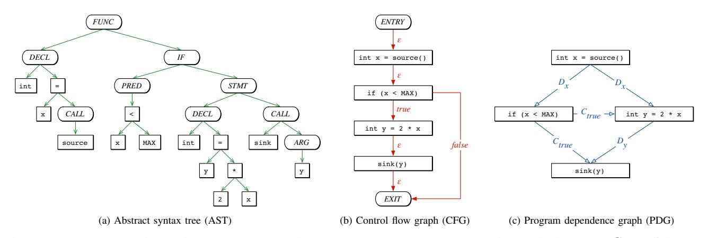
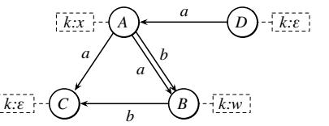
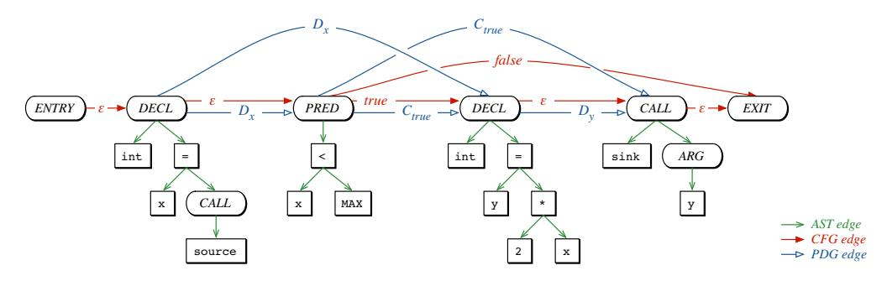

# Modeling and Discovering Vulnerabilities with Code Property Graphs

Fabian Yamaguchi∗、Nico Golde†、Daniel Arp∗、Konrad Rieck∗ ∗University of Gottingen, Germany ¨ †Qualcomm Research Germany

*Abstract*—現在発生しているセキュリティ侵害の大多数は、安全でないコードが直接の原因となっています。そのため、コンピュータシステムの保護は、ソフトウェア中の脆弱性を厳密に特定することに大きく依存しており、これは多大な専門知識を要する骨の折れるエラーが起きやすい作業です。残念ながら、たった一つの欠陥でもシステムのセキュリティを損なうのに十分であり、監査すべきコードの膨大な量が攻撃者に有利に働きます。本論文では、大量のソースコードから効果的に脆弱性を抽出する手法を紹介します。そのために、*code property graph*と呼ばれるソースコードの新しい表現方法を導入します。これは、クラシックなプログラム解析の概念、つまり抽象構文木、制御フローグラフ、プログラム依存グラフを統合したデータ構造です。この包括的な表現により、*graph traversals* を用いて一般的な脆弱性のテンプレートを洗練された方法でモデル化できます。たとえば、バッファオーバーフロー、整数オーバーフロー、フォーマット文字列の脆弱性、またはメモリ情報漏洩などを特定することができます。私たちは一般的なグラフデータベースを用いて本手法を実装し、Linuxカーネルのソースコード中にこれまで知られていなかった18件の脆弱性を特定できることを実証します。

#### *Keywords*—*Vulnerabilities; Static Analysis; Graph Databases*

# I. INTRODUCTION

コンピュータシステムのセキュリティは、基本的にその基盤となるソフトウェアの品質に依存しています。学術界や産業界で長年にわたる研究が行われているにもかかわらず、バッファの境界を考慮しないことや、入力データの検証が不十分であることなどが原因で、プログラムコードには定期的にセキュリティ脆弱性が現れます。その結果、ソフトウェアの脆弱性は現在でもセキュリティ侵害の主な原因のひとつとなっています。例えば、2013年にはユニバーサルプラグアンドプレイライブラリにおけるたった一つのバッファオーバーフローにより、2300万台以上のルーターがインターネットからの攻撃に対して脆弱な状態に置かれました [26]。同様に、現在も多くのユーザーが、Javaランタイム環境のさまざまな欠陥を悪用するWebベースのマルウェアの被害に遭っています [29]。

ソフトウェアの脆弱性の発見は、古典的でありながら困難なセキュリティ上の課題です。あるプログラムが別のプログラムの非自明な性質を特定できないため、ソフトウェアの脆弱性を発見する一般的な問題は決定不能です [33]。その結果、現在使われているセキュリティ欠陥の検出手法は、特定の種類の脆弱性に限定されているか、または煩雑で手作業による監査に頼っています。特に、オペレーティングシステムのカーネルのような大規模なソフトウェアプロジェクトを保護することは非常に困難な課題であり、たった一つの欠陥がコード全体のセキュリティを損なう可能性があります。バッファオーバーフローやフォーマット文字列脆弱性のようにソフトウェア分野で繰り返し発生している脆弱性の種類も長い間存在していますが、こうした脆弱性が特定のソフトウェアプロジェクト内で発生しているかを自動的に検出することは、いまだに高度な専門知識なしにはしばしば不可能です [16]。

この状況の結果として、セキュリティ研究は当初、安全でないライブラリ関数によって引き起こされる不具合[6]、バッファオーバーフロー[45]、整数オーバーフロー[40]、入力データの検証不足[18]など、特定の種類の脆弱性を静的に発見することに重点が置かれていました。ソフトウェアテストの概念に基づき、より幅広い脆弱性検出が動的プログラム解析によって実現されてきました。これには、シンプルなファズテスト[e.g., 38, 42]から、高度なテイントトラッキングやシンボリック実行[e.g., 2, 35]までが含まれます。これらの手法は様々な種類の不具合を発見できますが、実際の運用では効率的に動作させることが困難であり、実行時が極端に長くなったり、考慮すべき実行経路数が指数関数的に増加することにより、適切な結果を提供できないことがよくあります[16, 21]。その解決策として、最近のセキュリティ研究では、分析者自身に監査中の支援を行い、完全に置き換えるのではなく補助する手法の探求が始まっています。提案された方法は、専門家の知識を静的プログラム解析に付加することで監査プロセスを加速し、脆弱性の探索を効果的に導くことができます[e.g., 39, 43, 44]。

本論文では、この研究の方向性をさらに発展させ、大量のソースコードから脆弱性を抽出するための新しいアプローチを提案します。私たちのアプローチは、プログラム解析の古典的な概念と、グラフマイニング分野における最近の進展を組み合わせたものです。本手法の基盤となる重要な洞察は、多くの脆弱性がコードの構造、制御フロー、依存関係を同時に考慮することで初めて適切に発見できるという点です。この要件に対応するために、*code property graph* と呼ばれるソースコードの新しい表現を導入します。このグラフは、抽象構文木、制御フローグラフ、プログラム依存関係グラフの特性をひとつのデータ構造に統合しています。コードに対するこの包括的な視点により、*graph traversals* を用いて一般的な脆弱性のテンプレートを洗練された形でモデル化することが可能になります。データベースにおけるクエリのように、グラフトラバーサルはcode property graph上を通過しながら、コードの構造や制御フロー、各ノードに紐づくデータ依存関係を調査します。このように様々なコード特性へ同時にアクセスすることで、複数の種類の脆弱性に対して簡潔なテンプレートを作成することができ、大規模なコードの脆弱性監査を支援します。

私たちは、一般的なグラフデータベースを用いて本手法を実装し、バッファオーバーフロー、整数オーバーフロー、フォーマット文字列の脆弱性、メモリ情報漏洩など、よく知られた複数の脆弱性タイプに対するグラフトラバーサルの設計を通じて、その実用的な有効性を示します。ショーケースとして、よく精査されている大規模なコードベースであるLinuxカーネルのソースコードを分析します。私たちは、報告されているほとんどすべての脆弱性が

© 2014, Fabian Yamaguchi. IEEEのライセンスの下で。DOI 10.1109/SP.2014.44

2012年時点のLinuxカーネルは、そのコードプロパティグラフ内のトラバーサルを用いて記述することができます。オープンソースコミュニティによるカーネルのセキュリティ向上への多大な努力にもかかわらず、これらのトラバーサルにより、Linuxカーネルにおいて*これまで知られていなかった18件の脆弱性*を発見することができました。これによって、コードプロパティグラフの実践的な有用性が示されました。

まとめると、我々は脆弱性発見の課題に対して以下の貢献を行っています。

- *Code property graph.* ソースコードの新しい表現方法を紹介します。これは、抽象構文木、制御フローグラフ、プログラム依存グラフの特性を組み合わせて、1つのデータ構造に統合したものです。
- *脆弱性タイプのためのトラバーサル。* 一般的な脆弱性のタイプは、コードプロパティグラフのトラバーサルとして巧みにモデル化でき、効率的な検出テンプレートを導き出せることを示します。
- *効率的な実装。* コードプロパティグラフをグラフデータベースにインポートすることで、Linuxカーネルのような大規模なコードベースに対してもトラバーサルを効率的に実行できることを示します。

本論文の残りの構成は以下の通りです。Section II ではコード表現に関する背景情報を提供し、Section III では property graphs と graph traversals の概念について定義します。Section IV では新しい表現手法である code property graphs を紹介し、Section V ではそれが脆弱性の特定にどのように利用できるかを示します。Section VI では我々の手法の評価を行います。Section VII では関連研究について、Section VIII では本研究の限界についてそれぞれ議論します。Section IX で本論文をまとめます。

#### II. REPRESENTATIONS OF CODE

プログラム解析やコンパイラ設計の分野では、プログラムの性質を論じるために様々なコード表現が開発されてきました。これらの表現は主にコードの解析や最適化を目的に設計されていますが、本研究で取り組むように、コードの特徴づけにも適しています。特に、私たちは*抽象構文木*、*制御フローグラフ*、*プログラム依存グラフ*という3つの古典的な表現に注目し、これらを脆弱性発見手法の基盤としています。コード表現についての詳細な議論はAhoらの著書[1]に記載されています。

| void foo()        | 1 |
|-------------------|---|
| {                 | 2 |
| int x = source(); | 3 |
| if (x < MAX)      | 4 |
| {                 | 5 |
| int y = 2 * x;    | 6 |
| sink(y);          | 7 |
| }                 | 8 |
| }                 | 9 |
|                   |   |

Fig. 1: 代表的なコードサンプル（図2を参照）。

このセクションを通して異なる表現方法を示す簡単な例として、Figure 1 に示されているコードサンプルを取り上げます。

#### *A. Abstract Syntax Trees (AST)*

抽象構文木は、通常コンパイラのコードパーサが最初に生成する中間表現のひとつであり、多くの他のコード表現を生成する基盤となっています。これらの木は、文や式がどのように入れ子になってプログラムが構成されているかを正確に記述します。しかし、*構文木*とは異なり、抽象構文木はプログラムを表現するために選ばれた具体的な構文はもはや保持していません。例えば、C言語では、カンマで区切られた宣言リストと、2つの連続した宣言は、通常同じ抽象構文木を生成します。

抽象構文木は順序付きの木であり、内部ノードは *演算子*（例えば加算や代入）を表し、葉ノードは *オペランド*（例えば定数や識別子）に対応します。例として、図 2a は図 1 に示されたコードサンプルの抽象構文木を示しています。抽象構文木は単純なコード変換には適しており、意味的に類似したコードの特定にも利用されてきました [3, 43]。しかし、デッドコードや未初期化変数の検出といった、より高度なコード解析には適用できません。この欠点の理由は、このコード表現では制御フローやデータ依存性が明示的に表されていないためです。

# *B. Control Flow Graphs (CFG)*

制御フローグラフは、コードの文が実行される順序や、特定の実行経路が選ばれるために満たすべき条件を明示的に表現します。この目的のために、文や条件式はノードで表され、それらは制御の移動を示す有向枝で接続されます。これらの枝は抽象構文木の場合のように順序付けされている必要はありませんが、各枝には *true* または *false* のラベルを割り当てる必要があります。特に、文ノードは「-」というラベルの付いた1本の出力枝を持ち、条件式ノードは条件評価が *true* または *false* となる2本の出力枝を持ちます。制御フローグラフは、抽象構文木から2段階の手順で構築することができます。まず、構造化された制御文（例: *if*、*while*、*for*）を考慮して予備的な制御フローグラフを作成します。次に、*goto* や *break*、*continue* などの非構造化制御文も考慮し、予備的な制御フローグラフを修正します。図2bは、図1に示したコード例のためのCFGを表しています。

制御フローグラフは、セキュリティの文脈でさまざまな用途に利用されてきました。たとえば、既知の悪意のあるアプリケーションのバリアントを検出するためや、ファズテストツールの指針とするためなどです。また、逆アセンブラリングにおいてプログラムの理解を支援するための標準的なコード表現にもなっています。しかし、制御フローグラフはアプリケーションの制御フローを明らかにする一方で、データフローに関する情報は提供しません。特に脆弱性分析においては、制御フローグラフを使って攻撃者に影響されたデータを処理する文を特定することは容易ではありません。

## *C. Program Dependence Graphs (PDG)*

Ferrante ら [9] によって導入されたプログラム依存グラフは、もともとプログラムスライスを実行するために開発されました。

Fig. 2: 図1の例に対するコードの表現。プログラム依存グラフでは、制御依存関係とデータ依存関係がそれぞれCとDで示されている。

ing [41]、すなわち、特定の文における変数の値に影響を与えるプログラム内のすべての文や述語を特定することである。プログラム依存グラフは、文や述語間の依存関係を明示的に表現している。特に、このグラフは2種類の辺を使って構築される。一つは、ある変数が別の変数に与える影響を表すデータ依存の辺、もう一つは述語が変数の値に与える影響に対応する制御依存の辺である。プログラム依存グラフの辺は、各文が*定義*する変数と*使用*する変数の集合を特定し、各文や述語に対して*到達定義*を計算することで、制御フローグラフから求めることができる。これはコンパイラ設計における標準的な問題である [see 1]。

例として、Figure 2c には Figure 1 に示されたコードサンプルのプログラム依存グラフが示されています。ここで注意すべきなのは、制御依存のエッジは単なる制御フローのエッジではなく、特に、文の実行順序はこのグラフからはもはや判別できない一方で、文と述語間の依存関係は明確に見えるという点です。

#### III. PROPERTY GRAPHS AND TRAVERSALS

ここで提示されたそれぞれの表現は、ソースコードに対して固有の視点を提供しており、根底にあるプログラムの異なる側面を強調しています。これらの視点を統合して脆弱性発見のための共同表現を作成するために、私たちは*プロパティグラフ* [34]という概念を利用します。これは、多くのグラフデータベース（例：ArangoDB、Neo4J、OrientDB）において構造化データの基本的な表現です。形式的には、プロパティグラフは次のように定義されます。

定義 1. *プロパティグラフ* G = (V, E, λ, μ) とは、有向でエッジにラベル付きの属性付き多重グラフである。ここで、V はノードの集合、E ⊆ (V × V) は有向エッジの集合であり、λ : E → Σ は各エッジにアルファベット Σ からラベルを割り当てるエッジラベリング関数である。プロパティは、μ : (V ∪ E) × K → S という関数によってエッジやノードに割り当てることができる。ここで、K はプロパティキーの集合、S はプロパティ値の集合である。

Figure 3は、4つのノードを持つシンプルなプロパティグラフを示しています。プロパティグラフはマルチグラフであるため、2つのノードは複数のエッジで接続される場合があります。例えば、Figure 3のノードAとBがその例です。さらに、この例では、それぞれのノードにキーk ∈ Kを持つプロパティが割り当てられていますが、S = {x, w}の集合からプロパティ値を保持しているのはノードAとBのみです。

Fig. 3: プロパティグラフの例。ノードに割り当てられたプロパティは破線で示されています。

プロパティグラフから情報を抽出する主な手法は、いわゆる*グラフトラバーサル*、または単に*トラバーサル*と呼ばれるものであり、これはラベルやプロパティに応じてグラフのエッジに沿って移動するのに利用されます。形式的には、グラフのトラバーサルは次のように定義されます。

定義2. *トラバーサル*とは、性質グラフGにおいて、ノードの集合を別のノードの集合に写す関数T : P(V ) → P(V )のことを指す。ここで、PはVの冪集合である。

この一般的な定義により、複数のトラバーサルを連結して使うことができます。例えば、2つのグラフトラバーサル T0 と T1 は、関数合成 ◦ を用いることで T0 ◦ T1 のように連結できます。この連結に基づき、本論文で述べる他のすべてのトラバーサルの構成の基礎となる、いくつかの基本的なトラバーサルを定義できます。まず、単純なフィルタートラバーサルを定義します。

$$
\text{Filter}_p(X) = \{ v \in X : p(v) \}
$$

これは、集合X内の全てのノードのうち、ブール値述語p(v)（例えば、特定のプロパティを持っているかどうかを確認することによって）に一致するものを返します。

プロパティグラフのエッジに沿って移動するために、以下のフォワードトラバーサルを定義します。

$$
OUT(X) = \bigcup_{v \in X} \{u : (v, u) \in E\},
$$
  
\n
$$
OUT_l(X) = \bigcup_{v \in X} \{u : (v, u) \in E \text{ かつ } \lambda((v, u)) = l\},
$$
  
\n
$$
OUT_l^{k,s}(X) = \bigcup_{v \in X} \{u : (v, u) \in E \text{ かつ } \lambda((v, u)) = l\}
$$
  
\nそして  $\mu((v, u), k) = s\}$

これは、ノード集合 X から到達可能なノードを返します。詳しく言うと、トラバーサル OUT は X から到達可能なすべてのノードを返し、OUTl はラベル l のエッジを経由して到達可能なすべてのノードを返し、OUTk,s l はラベル l かつプロパティ k:s を持つエッジを経由して到達可能なすべてのノードを返します。同様に、グラフ内を逆方向に移動するためのトラバーサル IN、INl、および INk,s l も定義します。

$$
IN(X) = \bigcup_{u \in X} \{v : (v, u) \in E\},
$$
  
\n
$$
IN_l(X) = \bigcup_{u \in X} \{v : (v, u) \in E \text{ かつ } \lambda((v, u)) = l\},
$$
  
\n
$$
IN_l^{k,s}(X) = \bigcup_{u \in X} \{v : (v, u) \in E \text{ かつ } \lambda((v, u)) = l\}
$$
  
\nおよび  $\mu((v, u), k) = s\}.$

最後に、他のトラバーサルの出力を集約するために、2つのトラバーサルORとANDを次のように定義します。

$$
OR(\mathcal{T}_1, ..., \mathcal{T}_N)(X) = \mathcal{T}_1(X) \cup ... \cup \mathcal{T}_N(X)
$$
  
AND( $\mathcal{T}_1, ..., \mathcal{T}_N$ )(X) =  $\mathcal{T}_1(X) \cap ... \cap \mathcal{T}_N(X)$

やや技術的な定義ではあるものの、いくつかのグラフデータベースはこれら基本的なトラバーサルの効率的な実装を提供しています。特に、FILTER、OUT、IN といったトラバーサルは、*Gremlin* というグラフ言語の基本的な機能であり、Neo4J や InfiniteGraph のような一般的なデータベースでサポートされています。グラフトラバーサルの実装の詳細と、私たちのアプローチの評価については、Section VI で議論します。

#### IV. CODE PROPERTY GRAPHS

Section II で紹介されたそれぞれの表現は、基盤となるソフトウェアの特定の特性を捉えています。しかし、ほとんどの場合において、単一の表現だけでは脆弱性の種類を特徴づけるには不十分です。そこで、Section III で導入したプロパティグラフの概念を用いて、三つの表現を統合したデータ構造を作成します。具体的には、まず AST、CFG、PDG をプロパティグラフとしてモデル化し、その後、これらを一つのグラフにマージすることで、それぞれの表現が持つ利点を全て取り入れたものにします。

#### *A. Transforming the Abstract Syntax Tree*

唯一、ソースコードを言語構造体へ詳細に分解できる表現はASTです。したがって、私たちは結合表現の構築を、ASTをプロパティグラフ GA = (VA, EA, λA , μA) として表現することから始めます。ここで、ノード VA は木のノードであり、エッジ EA は対応する木のエッジであって、ラベリング関数 λA によりASTエッジとしてラベル付けされています。さらに、各ノードに μA を用いてプロパティ *code* を割り当て、そのプロパティ値がそのノードが表す演算子またはオペランドに対応するようにします。最後に、木構造の順序性を反映させるため、各ノードにプロパティ *order* も割り当てます。その結果、このグラフのプロパティキーは KA = {*code*, *order*} となり、プロパティ値の集合 SA はすべての演算子とオペランド、そして自然数から構成されます。

#### *B. Transforming the Control Flow Graph*

次のステップとして、CFG（制御フローグラフ）を結合表現に組み込む準備を行います。この目的のために、CFGをプロパティグラフ GC = (VC , EC , λC , ·) として表現します。ここで、ノード VC は単にAST内の文および述語に対応しており、つまりキー *code* に対して値 *STMT* または *PRED* を持つすべてのノード VA になります。さらに、エッジラベリング関数 λC を定義し、プロパティグラフ内のすべてのエッジに対して、集合 ΣC = {*true*, *false*, -} に属するラベルを割り当てます。

#### *C. Transforming the Program Dependence Graph*

PDGは、文や述語間のデータ依存関係および制御依存関係を表現します。このグラフのノードはCFGのノードと同一であり、異なるのは両グラフのエッジのみです。したがって、PDGは、新しいエッジ集合EPと対応するエッジラベル付与関数λP : Ep → ΣP（ここでΣP = {*C*, *D*}は制御依存とデータ依存を表す）を定義するだけで、性質グラフGP = (VC , EP , λP , μp)として表現できます。さらに、各データ依存には対応するシンボルを示すためにプロパティ*symbol*を、各制御依存には元の述語の状態が*true*か*false*かを示すためにプロパティ*condition*を割り当てます。

#### *D. Combining the Representations*

最後のステップとして、3つのプロパティグラフを結合し、*code property graph* と呼ばれる統合データ構造を作成します。このグラフを構築する際の重要なポイントは、3つのグラフのそれぞれにおいて、ソースコード内の各ステートメントや述語に対応するノードが存在しているということです。実際には、AST だけがこれら3つの表現の中で追加のノードを導入しています。そのため、ステートメントや述語のノードは表現同士を自然に接続し、ある表現から別の表現への橋渡しとなります。

定義3. *コードプロパティグラフ* とは、ソースコードのAST、CFG、およびPDGから構築されたプロパティグラフ G = (V, E, λ, μ) である。

- V = VA,
- E = EA ∪ EC ∪ EP ,
- λ = λA ∪ λC ∪ λP および
- μ = μA ∪ μE,

ここでは、記法を多少拡張して、ラベリング関数とプロパティ関数を組み合わせています。

Figure 1で示されたコードサンプルに対して、Figure 4にコードプロパティグラフの例が示されています。簡単のため、プロパティキーや値、ASTエッジに付けられたラベルは

図4：図1で示したコードサンプルのコードプロパティグラフ。

示されています。グラフのノードは主に図2aのASTと一致しています（無関係な*FUNC*ノードと*IF*ノードを除く）。変換後のCFGとPDGは色付きのエッジで示されています。

## V. TRAVERSALS FOR WELL-KNOWN TYPES OF VULNERABILITIES

コードプロパティグラフは、さまざまな種類のプログラミングパターンを表現することができますが、それをどのようにして脆弱性の発見に利用できるのかはすぐには明らかではありません。本節では、コードプロパティグラフが実際に多様なセキュリティ上の欠陥を特定するために活用でき、脆弱性記述のためのテンプレートを作成できることを示します。まずSection V-Bで、コードの純粋な構文的記述の限界を考察し、続くSection V-Cでは、制御フロー情報の追加によっても改善はわずかであることを示します。最後にSection V-Dでは、データフロー、制御フロー、および構文情報を組み合わせることで、多様な脆弱性の発見が可能になることを説明します。

## *A. Motivational Example*

まず最初に、Esser [7] によって発見されたSSH実装におけるバッファオーバーフローの最近の事例を取り上げます。これにより、多くのApple iOSアプリケーションが攻撃にさらされることになりました。Esserは、正規表現を用いてFigure 5に示された脆弱なコードを特定しました。

| []                                               | 1  |
|--------------------------------------------------|----|
| if (channelp) {                                  | 2  |
| /* シグナル名（SIGプレフィックスなし）を設定する */    | 3  |
| uint32_t namelen =                               | 4  |
| _libssh2_ntohu32(data+9+ sizeof("exit-signal")); | 5  |
| channelp->exit_signal =                          | 6  |
| LIBSSH2_ALLOC(session, namelen + 1);             | 7  |
| []                                               | 8  |
| memcpy(channelp->exit_signal,                    | 9  |
| data + 13 + sizeof("exit_signal"), namelen);     | 10 |
| channelp->exit_signal[namelen] = '\0';           | 11 |
| []                                               | 12 |
| }                                                | 13 |
| []                                               | 14 |
|                                                  |    |

Fig. 5: libssh2のコードの抜粋で、*libssh2 packet add*関数に存在する脆弱性を示している

脆弱な箇所（赤で示されています）は、6行目で*LIBSSH2 ALLOC*関数を使ってバッファ*exit signal*のメモリを割り当てています。割り当てるメモリの量は、変数*namelen*に1を足した値を引数として直接計算しています。しかし、この変数は攻撃者によって制御可能であり、もしこれが32ビット符号なし整数の最大値に設定された場合、加算がオーバーフローして0となり、割り当て関数には0が渡されてしまいます。その結果、ほんのわずかなパディングバイトしか割り当てられません。その後9行目で*namelen*バイトがサイズ不足のバッファにコピーされるため、バッファオーバーフローが発生します。

Esserは、次の正規表現を使用して6行目にある脆弱な文を発見することができました。

ALLOC[A-Z0-9\_]\*\s\*\([ˆ,]\*,[ˆ;]\*[\*+-][ˆ>][ˆ;]\*\)\s\*; .

残念ながら、この正規表現は割り当て呼び出し内の合計部分だけを記述しており、脆弱性のために必要な条件の一部にすぎません。さらに、正規表現はコードの入れ子構造をマッチすることができないため、記述自体が本質的に曖昧です。しかし、この定式化の最大の欠点は、攻撃者による*namelen*変数の制御を記述できていない点です。加えて、この変数が適切にサニタイズされていれば、脆弱性は存在しなかったでしょう。最後に、この変数の幅は脆弱性にとって非常に重要です。

この簡単な例は、脆弱性パターンの特徴付けに関与するコードのさまざまな特性についての洞察を与えてくれます。まとめると、以下の側面を考慮する必要があります。

- 1) *Sensitive operations.* 保護された機能への呼び出しや、バッファへのコピー、メモリの割り当てなど、セキュリティ上重要な操作は記述可能である必要があります。例が示すように、割り当ての中での算術演算のような入れ子になったコードも非常に重要であり、そのためASTへの完全なアクセスが必要となります。
- 2) *型の使用法.* 多くの脆弱性は、プログラムで使用されているデータ型に密接に関係しています。例えば、図5に示された脆弱性は、*namelen* が16ビットの整数だった場合、32ビットの整数である場合と比べて存在しなかったでしょう。この情報はAST内に存在します。
- 3) *Attacker control.* 分析者は、どのデータソースが攻撃者の制御下にあるかを表現できなければなりません。例に言及すると、*libssh2 ntohu32* によって返される変数は攻撃者の制御下にある可能性が非常に高いです。このルーチンはネットワークバイトオーダーからホストバイトオーダーに整数値を変換するため、その整数はほぼ確実に

ネットワークです。これをモデル化するためには、PDGによって表現されるデータ依存性が必要です。

4) *Sanitization.* 最後に、多くの脆弱性はプログラムが攻撃者が制御するデータの適切なサニタイズを欠いている場合にのみ発生します。たとえば、この例で変数*namelen*がメモリ確保の*前*に安全な範囲かどうかチェックされていれば、脆弱性は存在しなかったでしょう。そのため、CFGによって明示的に示される文の順序をモデル化することが重要です。

ここでは、コードプロパティグラフが提供するさまざまなビューが、脆弱性発見のための効果的なグラフトラバーサルの構築にどのように貢献するかを詳しく分析します。

## *B. Syntax-Only Vulnerability Descriptions*

コードプロパティグラフは、もともと抽象構文木に含まれていたすべての情報を明らかにします。この情報は、攻撃者が制御できるソース、機微な操作、およびサニタイザを記述するのに十分ですが、本節で示すように、文同士の相互作用を捉えることはできません。

まず、図5に示された脆弱な文について、その構文的な構造を説明します。この脆弱性の主な特徴は、合計処理が直接割り当て関数の引数として行われている点です。この単純な例だけでも、すでに二つの課題が存在します。第一に、関数が合計処理や関数呼び出しを含んでいるかどうかを判別する必要があります。第二に、コードの入れ子構造を把握する必要があります。

最初の問題は、関数のすべてのノードを取得し、その後、それらのノードの中に総和や呼び出しを表すものがあるかどうかをフィルタリングすることで対処できます。AST内ですべてのノードのうち、ある基準に合致するものを見つけるという問題は何度も出てきます。私たちはこの問題を一度で解決するために、ASTのルートからすべてのノードへとたどる再利用可能なトラバーサルTNODESを定義します。これにより、TNODESとFILTERを組み合わせるだけで、ASTが総和ノードや呼び出しノードを含むかどうかをすぐに判定できます。

$$
MATCH_p(V) = FILTER_p \circ TNODES(V)
$$

これは、すべての v ∈ V を根とするAST内のすべてのノードをたどり、それらのノードを述語 p に従ってフィルタします。コード内のすべてのメモリ割り当て関数の呼び出しをたどるには、V をすべての関数ノードの集合とし、p(v)がvがメモリ割り当て関数の呼び出しである場合にtrueとなるようにして、単にMATCHトラバーサルを実行するだけで実現できます。

第二の問題、すなわち関数呼び出しの引数の中に入れ子になった総和を特定することも、MATCHの走査を関数合成を使って単純に連結できるため、簡単に解決できるようになります。例えば、関数fのi番目の引数の中に総和があるかどうかを特定するには、次のような走査を使います。

$$
\mathrm{MATCH}_p \circ \mathrm{ARG}_f^i
$$

ここで、ARGi f は f という名前の関数への呼び出しに対して i 番目の引数を返す MATCH トラバーサルであり、p(v) は μ(v, *code*) = *Summation* の場合に真となり、そうでない場合は偽となります。

MATCHトラバーサルだけでは、文同士の相互作用を特徴づけるのには適していませんが、ほとんどの脆弱性タイプにおいて、センシティブな操作やサニタイザ、攻撃者が制御するソースを正確に記述する基礎となります。さらに、図5の例で示したように、単一の文を特徴づけるだけで、そのタイプの脆弱性の探索範囲を絞り込める場合も多く存在します。以下は、MATCHトラバーサルのみで同様に効果を発揮する脆弱性タイプの例です。

• *Insecure arguments.* 不適切な引数は、脆弱性の一般的な原因となります。たとえば、フォーマット文字列の脆弱性[see 12, 31, 36]は、攻撃者が制御するフォーマット文字列が*printf*や*sprintf*のような関数に渡された場合に発生し、複数のプラットフォームで任意のコード実行に悪用される可能性があります。フォーマット文字列の脆弱性が発生するための必要条件は、*printf*、*sprintf*、または*fprintf*のようなユーティリティ関数に渡されるフォーマット文字列が定数文字列でないことです。これは、MATCHトラバーサルを使用して次のように表現できます。

#### MATCHp ◦ ARG1 sprintf

ここで、p は v が定数文字列を表していない場合、すなわち μ(v, *code*) = *String* の場合に真となります。このトラバーサルは攻撃者の制御をモデル化していませんが、実際には定数でないフォーマット文字列を指定する理由がほとんどないため、十分に機能します。

• *整数オーバーフロー。* 割り当て関数の引数内で算術演算が行われる場合は、図5に示されている動機付けの例のように、メモリの破損につながる整数オーバーフローが発生しやすい典型的なケースです。これらは、次のような走査によって簡単に表現できます。

#### MATCHp ◦ ARG1 malloc

ここで p(v) は、v が算術演算である場合に真となります。たとえば、μ(v, code) = *Multiplication* です。

• *整数型の問題。* いくつかの脆弱性のタイプは、開発者が想定していなかった型変換が直接の原因となっています。特に、バッファオーバーフローは、暗黙の整数キャストによって誤って計算または検証されたバッファサイズが原因で発生することが多いです。例えば、*整数の切り捨て*は、代入の右辺にある整数が左辺よりも幅広い場合に発生します。これらのタイプの脆弱性を特定するには、前の二つの場合よりも少し複雑であり、代入の左部分木と右部分木を比較して脆弱なケースを特定する必要があります。このために、PAIRST2 T1 関数を定義します。例えば、全ての代入ノードなど、ノードの集合から開始し、PAIRSは2つの独立した走査T1とT2を行います。例えば、一方は代入の左部分木を走査し、もう一方は右部分木を走査し、この2つの走査の結果をペアに結合します。これらのペアは、その後、pという述語に基づいて、FILTER2と同様に定義されたPAIRFILTERp関数を使ってフィルタリングできます。これら2つの関数をMATCHと組み合わせることで、整数の切り捨てを簡単に検出できます。

> PAIRFILTERp1 ◦ PAIRST2 T1 ◦ MATCHp2

1正式な定義は付録IX-Aに記載されています。

2 PAIR および PAIRFILTER の正式な定義は付録 IX-C に記載されています。

ここで、p1は、2番目のノードが1番目のノードよりも広い型を持つ変数を示す場合に真となり、p2はそのノードが代入である場合に真となります。最後に、T1とT2は、それぞれ代入の左部分木および右部分木をたどります。

MATCHの走査のみに基づいて脆弱性を特徴づけようとするほとんどの試みは失敗に終わるが、なぜなら文同士を関連付けることができないためである。しかし、セクションIIIで導入したANDやORを用いて複数のMATCHの走査を組み合わせることで、潜在的に興味深いコードを絞り込むことが可能である。たとえば、*パーミッションチェックの欠落* [see 27, 44]は、セキュリティ上重要な操作と攻撃者が制御可能なソースが存在し、かつチェックが行われない場合にコードが脆弱となることで特徴づけられる。残念ながら、抽象構文木を用いた場合にできるのはこれが限度であり、この状況を捉えるために次の定義を示す。

Definition 4. *構文のみの脆弱性記述* S とは、2つ組 (M0,M1) であり、M0 と M1 はMATCHトラバーサルの集合である。ASTノードが構文のみの記述にマッチするのは、M0 内のすべてのMATCHトラバーサルに一致し、かつ M1 内のトラバーサルには一切一致しない場合である。

構文のみに基づく脆弱性の記述は、実際には効果的な場合が多いですが、攻撃者の制御や文同士の相互作用を表現することができないため、誤検知が多く発生する傾向があります。次のセクションでは、この問題に部分的に対処する制御フローに基づく記述について議論します。

#### *C. Control-Flow Vulnerability Descriptions*

コードプロパティグラフの制御フローエッジを使用することで、文の実行順序をモデル化できるため、より広範囲の脆弱性に対応できるようになります。特に、制御フローグラフ内のパスに対応する脆弱性は、以下のようにうまく記述することができます。

- *リソースリーク。* 多くの脆弱性は、リソースが割り当てられたにもかかわらず、すべてのエラーパスで適切に解放されない場合に存在します。一般的なケースでは、これによりシステムが利用不能になることがありますが、更なる脆弱性を引き起こすために悪用される場合もあります。
- *ロックの解放忘れ*。一般的な場合の並行性の問題は検出が難しいですが、単純な制御フロー解析を用いることで、エラーパスでロックが解放されていないケースを検出することができます。
- *Use-after-free 脆弱性。* すでに解放されたメモリ領域にコードがアクセスすることによるソフトウェアの欠陥は、任意のコード実行のために悪用されることがよくあります。これらの脆弱性は、一見無関係に見える複数の関数の複雑な相互作用によって発生することが多いものの、関数内では単純な制御フロー解析だけでこれらの脆弱性を特定できる場合もあります。

いずれの場合でも、脆弱性は制御フローグラフ内の特定の経路と関連付けることができます。たとえば、リソースリークは、メモリを確保する文（例：*malloc*の呼び出し）から、リソースを解放する文（例：*free*の呼び出し）を通らずに関数の終わりまで至る制御フローグラフ上の経路に結びついています。ただし、この経路が関連してくるのは、割り当て関数が確保されたメモリへのポインタを返す場合のみなので、制御フローグラフ上の経路には追加の制約を付与する必要があります。これらの観察結果を、以下の定義でまとめます。

定義5. *制御フロー脆弱性記述*とは、4つ組 (Ssrc, Send, Sdst, {(Si cnd, ti)}i=1...N ) で表される。ここで、Ssrc はソース文の構文のみの記述、Send は終了文の構文のみの記述、Sdst は宛先文の構文のみの記述、そして {(Si cnd, ti)}i=1...N は条件とその結果 ti ∈ {true, false} に対応する一連の構文のみの記述のリストである。ノード v が制御フロー脆弱性記述にマッチするのは、以下の条件が成立する場合である。

- v を根とする AST には、根ノード vsrc を持ち、Ssrc に一致する部分木が含まれています。
- vsrc から Send にマッチするノードまで、Sdst にマッチするノードを経由しない経路が、制御フローグラフ内に存在します。
- すべての 1 ≤ i ≤ N について、あるノードが記述 Si cnd に一致する場合、そのノードから始まるパス上のすべてのエッジには ti のラベルが付けられていなければなりません。

コントロールに基づく脆弱性は、深さ優先探索を用いたトラバーサルによって表現できます。これは、指定されたソースノードの集合から、宛先の説明に一致するノードを経由せず、条件の説明とそれに関連する結果に従うエンドノードまでのすべての経路を探索します。このトラバーサルの形式的な定義は、簡潔さのためここでは省略します。

残念ながら、制御フローや構文情報だけでは通常、脆弱性パターンを特定するには不十分です。というのも、特に次のセクションで述べるように、攻撃者に制御されたデータの流れを追跡することに関心があるからです。

#### *D. Taint-Style Vulnerability Descriptions*

最後に、構文、制御フロー、データフローの情報を組み合わせて脆弱性をモデル化します。構文のみや制御フローのみの脆弱性記述と比べて、データフローエッジを用いることで攻撃者の制御をモデル化する追加の能力が得られます。

各ステートメントノードには、そのノードに到達するすべての代入や変数定義からのデータフローエッジが含まれているため、これらのエッジをたどるだけで、あるステートメントで使用されている変数を生成したすべてのステートメントへ簡単にたどることができます。しかし、わずかな困難もあります。というのも、データフローエッジで接続されているのはステートメントノード同士だけなので、例えば関数呼び出しの引数からそのデータ生成元までたどりたい場合、まずその引数が含まれるステートメントへ移動しなければなりません。幸いなことに、これはAppendix IX-Bで正式に定義されているSTATEMENTトラバーサルを用いることで簡単に実現できます。ノードの集合に対する変数の生成元は、このトラバーサルを利用して計算できます。

$$
PRODUCERS_{\mathcal{N}} = \bigcup_{n \in \mathcal{N}} IN_{D}^{symbol,n} \circ \text{STATEMENT}
$$

ここで N は注目する識別子の集合であり、文で使用される変数のサブセットに解析を限定することを可能にします。便利のために、探索 SOURCES も定義しており、これは文で使用されている変数のいずれかに対してデータを生成するすべての文を表します。

SOURCESは貴重なトラバーサルであり、機密性の高い操作やデータソースに対する構文のみの記述と組み合わせることで、攻撃者が制御するデータが機密性の高い操作で使用されるケースを特定できます。例えば、Linuxカーネルにおけるバッファオーバーフローの一般的な例として、*get user*関数によって生成されたユーザー提供の整数が、*memcpy*操作におけるサイズフィールドとして直接使用されるケースがあります。このような脆弱性を特定するために、次のようなトラバーサルを定式化できます。

$$
MATCH_p \circ \text{SOURCES} \circ \text{ARG}^3_{memory}
$$

ここで p は、ノードが *get user* への呼び出しを表している場合に true を返す述語です。つまり、*memcpy* の第3引数を直接生成している *get user* へのすべての呼び出しへと辿ります。さらに、トラバーサル SOURCES は任意の回数連鎖させることができ、攻撃者が制御するソースから引数が間接的に生成されているケースも特定できます。

この定式化の弱点は、データサニタイズを考慮しておらず、データが有害でないことを確認するためにチェックされている場合でも、ケースが返されてしまうことです。サニタイザを考慮する方法としては、追加の構文のみの記述を導入するという可能性がありますが、これは文の順序を考慮しないため、チェックが正しく配置されているかどうかを検出することができません。私たちは、この欠点に対応するために、制御フローとデータフロー情報の組み合わせを用います。特に、SOURCESと同じ機能を提供し、さらにサニタイザ用の構文のみの記述を追加で指定できるようなトラバーサルを作成することを目指しています。

我々は、走査 UNSANITIZED3 を、SOURCES のドロップイン代替として定義します。これはさらに、記号 s に対する記号固有の構文のみのサニタイザ記述 Ss val を指定することで、適切にサニタイズされたすべてのケースを除外できるようにします。この走査は、次の2つの条件を満たす場合にのみ、攻撃者が制御するソースを返します。

- 制御フローグラフにおいて、ソース文からシンク文までの経路が存在し、その経路上のどのノードもサニタイザーの説明のいずれにも該当しない。
- ソースで定義され、シンクで使用される変数が、制御フローパスを通じてシンクに到達する、つまり、その経路上のいかなるノードによっても再定義されていない場合です。

構文のみの記述とUNSANITIZEDのトラバーサルを組み合わせることで、以下のようにテイントスタイルの脆弱性記述を定義します。

定義6. *テイントスタイルの脆弱性記述* とは、攻撃者が制御可能なソースの構文のみの記述 Ssrc、セキュリティ上重要なシンクの構文のみの記述 Sdst、およびサニタイザの構文のみの記述の集合 Ss san からなる3組（Ssrc, Sdst, Ss san）である。ノード v がテイントスタイルの記述にマッチするとは、v を根とするASTが Ssrc にマッチする根ノード vsource を持つ部分木と、Sdst にマッチする根ノード vsink を持つ別の部分木を含んでいる場合を指す。

- vsource から vsink までデータ依存エッジの経路が存在する、すなわち、ノードの列 (v0,...,vn) が存在し、v0 = vsource、vn = vsink、ei = (vi, vi+1) ∈ E かつ λ(ei) = D がすべての i = 0,...,n − 1 について成り立つ。
- これらの各データ依存エッジ ei = (vi, vi+1) について、制御フローグラフ上に vi から vi+1 へのパス (v0,...,vm) が存在し、すべての k、0 ≤ k ≤ m に対して、vk

μ(ei,*symbol*) を定義しておらず、vk はサニタイザの記述 Sμ((vi,vi+1),*symbol*) san と一致していません。

Taintスタイルの記述は、検証されたソース・シンクシステムで説明できる脆弱性のトラバーサルを定義するのに適しています［18参照］。このタイプの脆弱性の例としては、インジェクション脆弱性、バッファオーバーフロー、整数オーバーフロー、整数型の脆弱性、安全でない引数、権限チェックの漏れ、さらにはメモリの漏洩などが挙げられます。以下の例はこれを示しています。

• *バッファオーバーフローの脆弱性*。フローベースの記述を動機付けるために議論されたように、多くのバッファオーバーフローは、コピー操作に渡される長さフィールドの検証が不十分なことが原因で発生します。例えば、Linuxカーネルコードでは、多くのバッファオーバーフローが、*get user*関数によって読み取られたサイズフィールドが、検証されることなく*memcpy*や*copy from user*の第3引数として渡されることで発生します。この脆弱性パターンは、次のようなトラバーサルによって表現することができます。

$$
\text{ARG}^{1}_{get\_user} \circ \text{UNSANITIZED}_{\{\mathcal{T}_s\}} \circ \text{ARG}^{3}_{memory}
$$

このトラバーサルは、*get user* の最初の引数によって直接汚染されているにもかかわらず、トラバーサル Ts に一致するノード（例えば、追跡している変数 s を含む比較式と一致するマッチトラバーサル）で検証されていない *memcpy* のすべての第3引数を選択します。このタイプのトラバーサルは、UNSANITIZED トラバーサルを連鎖させることで、間接的に汚染された引数も簡単に含めるよう拡張できます。

• *コードインジェクションの脆弱性。* SQLインジェクションやコマンドインジェクションのような脆弱性は、汚染（taint）スタイルの説明を用いてうまく記述できます。例えば、攻撃者が任意のシェルコマンドを実行できる典型的なコマンドインジェクションの脆弱性は、次のようなトラバーサルで表現できます。

$$
ARG_{recv}^2 \circ \text{UNSANITIZED}_{\{\mathcal{T}_s\}} \circ \text{ARG}_{system}^1
$$

ここで Ts は、比較演算やセミコロンとの照合、また一般的な検証関数への呼び出しを対象とした走査処理です。この走査は、*recv* の第2引数が、セミコロンが含まれているかどうかを確認せずに *system* の第1引数に渡るすべてのケースを返します。

• *許可チェックの欠如。* ウェブアプリケーションおよびカーネルコードの両方で、操作を実行する前にユーザーの権限を確認する必要がよくありますが、これを怠ると権限の昇格を許してしまいます [see 27, 44]。この種の脆弱性は、次のように表現できます。

$$
\text{Match}_{p1} \circ \text{UNSANITIZED}_{\{\text{Match}_{p2}\}} \circ \text{MACH}_{p3}
$$

ここで、p1、p2、p3はそれぞれ攻撃者が制御するソース、ユーザーが十分な権限を持っていることを確認するチェック、セキュリティ上重要な操作を表す述語です。

Taintスタイルの記述を用いることで、攻撃者が制御するソースやセキュリティ上重要な操作、サニタイザー、型情報、さらにはデータフローや制御フローにおける文同士の相互作用まで表現できます。これにより、幅広い脆弱性を網羅する検索クエリを提供できるようになります。次のセクションでは、

3UNSANITIZEDの正式な定義は付録IX-Eに記載されています

我々の手法の評価を示し、本手法が対象としている脆弱性の種類が、今日のセキュリティ上重要なコードにとって実際に関連性が高いことを明らかにする。

#### VI. EVALUATION

私たちは、Linuxカーネルのソースコードという大規模なコードベースを対象に、手法の実際的な有効性を評価します。Linuxカーネルは、複数のソフトウェアベンダーやオープンソースコミュニティによって定期的に脆弱性監査が行われています。評価は2つのステップで実施します。まず、2012年に報告されたLinuxカーネルのすべての脆弱性のコードを見直し、グラフトラバーサルによってモデル化できる脆弱性タイプを特定することで、*カバレッジ分析*を行います（Section VI-B）。次に、よく見られる脆弱性に対してトラバーサルを作成し、それをLinuxカーネルのコードプロパティグラフに適用することで、私たちの手法の*脆弱性発見能力*を調査します（Section VI-C）。

#### *A. Implementation*

本評価のために、私たちは code property graphs4 のアイデアに基づいた静的コード解析システムを実装しました。本システムでは、まず堅牢な C/C++ パーサを用いて、与えられたコードベース内の各関数の AST を抽出します。次に、これらの AST を CFG および PDG に変換し、セクション IV で述べたように、3 つの表現すべてを結合して code property graph を構築します。さらに、コード内のグローバル変数や構造体宣言のノードも導入します。最後に、呼び出し元と呼び出し先の関係が可視化されている限り、すべての関数のグラフを相互に接続し、コードベース全体を 1 つの大規模な code property graph として表現します。

Linuxカーネルのソースコードの場合、私たちは5,200万個のノードと8,700万本のエッジを持つグラフを得ることになります。当然のことながら、このような大規模なグラフから情報を抽出する作業は、一般的なハードウェア上では決して簡単なものではありません。幸いなことに、非常に大きなプロパティグラフへの効率的なアクセスを可能にする専用のグラフデータベースを活用することができます（私たちは*Neo4J Version 1.9.5*を使用しています）。さらに、これらのグラフデータベースを利用することで、グラフの走査を高速化する高度なキャッシュアルゴリズムの恩恵を受けることも可能です。

プロトタイプ実装を用いた場合、約130万行のコードを持つLinuxカーネルバージョン3.10-rc1のインポートには、2.5 GHz Intel Core i5 CPUと8 GBのメインメモリを搭載したノートパソコンで合計110分かかります。生成されたデータベースは、ノードとエッジ用に14 GB、さらに効率的なインデックス作成のために別途14 GBのディスク容量を必要とします。

グラフ探索を実装する際、*Gremlin* は非常に適したグラフ言語であると私たちは考えています。その理由は、ユーザー定義の探索処理を連鎖させてデータベースに提供できるため、SQLデータベースにおけるストアドプロシージャと類似した仕組みを実現できるからです。これにより、第V節で示したさまざまな探索処理を、直接Gremlinコードに変換することが可能になります。さらに、Gremlinは互換レイヤーである *Blueprints* を介してデータベースとやり取りできる数少ない言語の一つであり、これによって作成したすべての探索処理を他のグラフデータベース実装でも修正せずに実行できるようになります。

本論文で示した脆弱性発見のためのトラバーサルをコールドデータベース上で実行すると、つまりデータベースの内容をハードディスクから読み込む必要がある場合、40秒未満で完了します。一度ノードとエッジがメインメモリにキャッシュされると、実行時間は30秒に短縮されます。このとき、実行時間の大部分は、大きな関数内でトラバーサルUNSANITIZEDを用いて実行可能なコントロールフロー経路を決定する処理に費やされます。

# *B. Coverage Analysis*

私たちはまず、MITRE組織が管理する中央脆弱性データベースを参照し、2012年にLinuxカーネルに割り当てられたすべてのCVE識別子を取得することから分析を始めます。合計で69の識別子を取得し、カーネルのソースコードに存在する88のユニークな脆弱性を対象としています。これらの脆弱性を異なるタイプに分類するため、各脆弱性に対するパッチを手動で調査し、報告された不具合の根本原因を特定します。この情報により、88の脆弱性を表Iに示す12の共通タイプに分類することができます。脆弱性の半数以上（88件中47件）は、メモリ情報漏洩、バッファオーバーフロー、リソースリークのいずれかに該当します。これらはいずれも、第V節で述べるようにグラフ探索によってうまく表現することができます。

本手法のカバレッジを評価するために、Linuxカーネルで発見された12種類の脆弱性タイプを記述するために必要なコード表現を分析します。特に、(a) ASTのみ、(b) ASTとPDGの組み合わせ、(c) ASTとCFGの組み合わせ、(d) AST、PDG、CFGの組み合わせ、のカバレッジを分析します。この分析結果はTable IIに示されています。

| 脆弱性の種類            | コード表現            |         |         |             |
|---------------------------|----------------------|---------|---------|-------------|
|                           | AST                  | AST+PDG | AST+CFG | AST+CFG+PDG |
| メモリ開示               |                      |         |         |             |
| バッファオーバーフロー   |                      | ( )  |         |             |
| リソースリーク           |                      |         |         |             |
| 設計ミス                 |                      |         |         |             |
| ヌルポインタ参照         |                      |         |         |             |
| 権限チェック漏れ         |                      |         |         |             |
| レースコンディション     |                      |         |         |             |
| 整数オーバーフロー       |                      |         |         |             |
| ゼロ除算                 |                      |         |         |             |
| 解放後使用               |                      |         | ( )  | ( )      |
| 整数型の問題             |                      |         |         |             |
| 安全でない引数           |                      |         |         |             |

TABLE II: 各種のコード表現が脆弱性タイプのモデリングにおいてどの程度カバーしているかを示します。

明らかに、ASTだけではセキュリティ上の欠陥を見つけるための情報はほとんど得られません。そのため、例えば誤った型キャストなど、一部の不適切な引数の形式だけがこの表現を使って発見できます。ASTとPDGの情報を組み合わせることで、コードをよりよく把握でき、さまざまな種類のバッファオーバーフローや、パーミッションチェックの欠落、ゼロによる除算といった問題を説明できるようになります。しかし、ASTとPDGの組み合わせは、例えばセキュリティチェックの場所を特定する必要がある場合など、文の順序が重要となるケースではあまり役に立ちません。また、ASTとCFGの組み合わせでも、多くの脆弱性を見逃してしまいます。

4http://mlsec.org/joern/

| Vulnerability types          | Description                                                                                                                       | #  |
|------------------------------|-----------------------------------------------------------------------------------------------------------------------------------|----|
| Memory Disclosure            | 構造体がユーザースペースにコピーされる際に、すべてのフィールドやパディングバイトが正しく初期化されていないため、メモリ情報が漏洩します。            | 21 |
| Buffer Overflows             | コピー操作に関係する長さフィールドのチェックが行われないため、バッファオーバーフローが発生します。                                         | 16 |
| Resource Leaks               | 関数がリソースを作成するものの、すべてのエラーパスでそれが破棄されません。                                                              | 10 |
| Design Errors                | プログラム設計が十分にセキュリティポリシーを実装していません。                                                                        | 10 |
| Null Pointer Dereference     | 攻撃者によって制御されるポインタが、nullかどうかの確認なしにデリファレンスされます。                                                    | 8  |
| Missing Permission Checks    | セキュリティ上機微な操作が、事前の権限チェックなしにアクセスできます。                                                                  | 6  |
| Race Conditions              | 並行して実行されているプロセスによって、さまざまなタイプの脆弱性が引き起こされます。                                                    | 6  |
| Integer Overflows            | コピー操作で関与する長さフィールドはチェックされていますが、そのチェックが不十分で整数オーバーフローが考慮されていません。                | 3  |
| Division by Zero             | 攻撃者が制御する値が割り算の分母として使用され、ゼロが許容されてしまいます。                                                            | 3  |
| Use After Free               | 割り当てられたメモリ領域が、割り当て解除されたあとに使用されています。                                                                 | 3  |
| Integer Type Vulnerabilities | コピー操作で使用される長さフィールドはチェックされていますが、そのチェックが不十分で、長さフィールドが符号付き整数であることが考慮されていません。 | 1  |
| Insecure Arguments           | 関数に引数を渡す際に、暗黙的で安全でない型変換が発生します。                                                                          | 1  |
| Total vulnerabilities        |                                                                                                                                   | 88 |

TABLE I: 2012年にLinuxカーネルで発見された脆弱性を脆弱性の種類ごとに分類したもの。

脆弱性の種類によっては、攻撃者が制御するデータのフローをモデル化する必要がありますが、リソースリークや一部のuse-after-free脆弱性については、CFGにエンコードされた文のフローから特定することができます。

3つの表現すべてをコードプロパティグラフで組み合わせることで、AST、CFG、PDGから得られる情報を活用し、12種類の脆弱性タイプのうち10種類をモデリングできるようになります。残る2つのタイプ、つまりレースコンディションと設計ミスは、最初が実行時の特性に依存し、後者はプログラムの意図された設計に関する詳細がなければモデル化が難しいため、グラフトラバーサルによる表現は困難です。さらに、ランタイム情報なしでは記述が難しい、ユースアフターフリー脆弱性の巧妙なケースも多く存在します。本手法の限界についてはSection VIIで議論しています。

# *C. Discovery of Vulnerabilities*

コードプロパティグラフ上でのグラフトラバーサルは、多くの脆弱性タイプを記述するのに適していますが、実際に有効であるかどうかはまだ示されていません。この目的のために、私たちはLinuxカーネルのコードプロパティグラフをトラバーサルによって探索し、さまざまな種類の脆弱性について本手法を実際に評価します。

まず、2012年によく見られた2つの主要な脆弱性タイプ、すなわち*バッファオーバーフロー*（境界チェックの欠如によるもの）と、不完全に初期化された構造体に起因する*メモリ漏えい*のためのトラバーサルを定義します。続いて、2012年には観測されなかった脆弱性タイプ、すなわち*メモリマッピングの脆弱性*と*ゼロバイト割り当て*のためのトラバーサルを構築します。これらはいずれもLinuxカーネル特有の脆弱性であり、従来のツールでは検出が困難です。まとめると、私たちの実験では以下のトラバーサルを使用しました。

- *バッファオーバーフロー。* 攻撃者が制御する長さフィールドに対するチェックが欠落していることによって発生するバッファオーバーフローのためのトラバーサルを構築します。このトラバーサルについては、Section VI-D で詳しく説明します。
- *メモリ開示。* 2012年にLinuxカーネルで発見されたセキュリティ上重大な脆弱性の多くは、適切に初期化されていない構造体がユーザ空間へコピーされることによって引き起こされました。これらの脆弱性は、攻撃者がカーネルメモリに保存されている機密オブジェクトを漏洩させるために悪用される可能性があります。特定するためには

これらの脆弱性に対処するために、構造体のローカル宣言から、*memset* を通らずにユーザ空間へのコピー操作に至るまで、taint風のトラバーサルを構築します。さらに、構造体の型を調べ、構文のみの記述を使用して、構造体のすべてのフィールドに値が代入されているかどうかを判定します。

- *メモリマッピング*。カーネルは、ユーザーが任意の物理メモリアドレスをユーザースペースにマッピングできないようにしなければならず、これによって機密情報の漏洩や任意のコード実行を防ぐ必要があります。これはカーネルに非常に特有な脆弱性タイプです。私たちは、こうした脆弱性を特定するために、シンタックスのみを使ったシンプルな脆弱性記述を定義し、この手法がプログラム固有のバグにも十分適応可能であることを示しています。
- *ゼロバイト割り当て。* 攻撃者が割り当て関数にゼロバイトの長さを持つフィールドを渡すことができる場合、多くの割り当て関数がメモリを確保せずにエラーコードを返すため、Linuxカーネルではクラッシュにつながることがよくあります。これは他のアロケータと比べて一般的ではなく、そのため特定のプログラムに固有の脆弱性となっています。これらのケースについては、テイントスタイルのトラバーサルによって対応しています。

全体として、4つのトラバーサルを実行することで、これまでに知られていなかった18件の脆弱性を特定しましたが、そのすべてがカーネル開発者によって対策されています。特に懸念すべき点は、合計18件のうち9件が昨年度よく見られた脆弱性タイプであったことです。これは、攻撃者が既存の脆弱性パターンをモデル化するだけで、トラバーサルによってコードベース内で同様の欠陥を効果的に発見できる可能性があることを示しています。Table IIIに我々の調査結果をまとめました。

ここから、グラフトラバーサルを用いた脆弱性発見プロセスを説明するためのケーススタディについて述べます。単純なトラバーサルによって、わずか11個の関数をレビューしただけで、これまで知られていなかった7件のバッファオーバーフロー脆弱性を特定できたことを示します。

# *D. Case Study: Buffer Overflow Identification*

以下では、長さフィールドに対する検証チェックが欠如していることによって引き起こされるバッファオーバーフローを特定するためのトラバーサルを示します。これらの種類の脆弱性は、テイントスタイルの記述を用いることで巧みに表現できるため、T0 ◦ UNSANITIZEDT s 1 ◦ T2 の形式のトラバーサルとして表現できます。この目的のために、私たちは単に定義すればよいのです。

| 種類                  | 場所                                      | 開発者からのフィードバック | 識別子         |
|----------------------|------------------------------------------|--------------------------|---------------|
| バッファオーバーフロー      | arch/um/kernel/exitcode.c                | 修正済み                 | CVE-2013-4512 |
| バッファオーバーフロー      | drivers/staging/ozwpan/ozcdev.c          | 修正済み                 | CVE-2013-4513 |
| バッファオーバーフロー      | drivers/s390/net/qeth_core_main.c        | 修正済み                 | CVE-2013-6381 |
| バッファオーバーフロー      | drivers/staging/wlags49_h2/wl_priv.c     | 修正済み                 | CVE-2013-4514 |
| バッファオーバーフロー      | drivers/scsi/megaraid/megaraid_mm.c      | 修正済み                 | -             |
| バッファオーバーフロー      | drivers/infiniband/hw/ipath/ipath_diag.c | 修正済み                 | -             |
| バッファオーバーフロー      | drivers/infiniband/hw/qib/qib_diag.c     | 修正済み                 | -             |
| メモリ情報漏洩              | drivers/staging/bcm/Bcmchar.c            | 修正済み                 | CVE-2013-4515 |
| メモリ情報漏洩              | drivers/staging/sb105x/sb_pci_mp.c       | 修正済み                 | CVE-2013-4516 |
| メモリマッピング            | drivers/video/au1200fb.c                 | 修正済み                 | CVE-2013-4511 |
| メモリマッピング            | drivers/video/au1100fb.c                 | 修正済み                 | CVE-2013-4511 |
| メモリマッピング            | drivers/uio/uio.c                        | 修正済み                 | CVE-2013-4511 |
| メモリマッピング            | drivers/staging//drv_interface.c         | 修正済み                 | -             |
| メモリマッピング            | drivers/gpu/drm/i810/i810_dma.c          | 修正作業中               | -             |
| ゼロバイト割り当て           | fs/xfs/xfs_ioctl.c                       | 修正済み                 | CVE-2013-6382 |
| ゼロバイト割り当て           | fs/xfs/xfs_ioctl32.c                     | 修正済み                 | CVE-2013-6382 |
| ゼロバイト割り当て           | drivers/net/wireless/libertas/debugfs.c  | 修正済み                 | CVE-2013-6378 |
| ゼロバイト割り当て           | drivers/scsi/aacraid/commctrl.c          | 修正済み                 | CVE-2013-6380 |

TABLE III: 私たちの4つのグラフトラバーサルを用いて発見されたゼロデイ脆弱性

攻撃者が制御するソースには、T0という適切なトラバーサルを、サニタイザにはTs1、そして最後に、セキュリティ上敏感なシンクにはT2を用います。まず、攻撃者が制御するソースについて説明しますが、これらは調査対象のアプリケーションに固有のものです。Linuxカーネルの場合、潜在的に有害な入力の代表的なソースとして、次の2つが考慮されます。

- *ユーザー/カーネル空間のインターフェース。* データは、さまざまなAPI関数を使ってユーザー空間からカーネル空間へコピーすることができます。例として、攻撃者によって制御されるデータで最初の引数を汚染する*copy from user*関数を考えます。これは、トラバーサルT 0 0 = ARG1 *copy from user* を使って捉えることができます。
- *システムコールハンドラのパラメータ。* 攻撃者は、対応するシステムコールを呼び出すことで、システムコールハンドラのパラメータを直接操作できます。ここでは、writeシステムコールの*count*パラメータを例として考え、トラバーサルT 1 0 = FUNC( *write*) ◦ PARAM*cnt* を使用します。ここでPARAMpおよびFUNCfは、それぞれ名前pのパラメータおよび名前に部分文字列fを含む関数内のノードに対して空でないものとします。

データシンクとしては、バッファにコピーされるデータ量を攻撃者が制御できる場合を特定するために、*copy from user* および *memcpy* 呼び出しに渡される長さフィールド（すなわち第三引数）に着目します。システムコールハンドラの場合、攻撃者が長さフィールドだけでなくコピーされるデータ自体も制御できることを確実にするため、*copy from user* への呼び出しのみを分析対象としてさらに絞り込みます。このようにして、シンクトラバーサルは T 0 2 = ARG3 *memcpy* および T 1 2 = ARG3 *copy from user* となります。

最後に、次のいずれかの条件が満たされていれば、長さフィールドが適切にサニタイズされているとみなすことで、誤検知の数を減らします。

- *宛先バッファの動的割り当て。* 宛先バッファは、長さフィールドを使ってバッファのサイズを指定することで動的に割り当てられます。したがって、バッファはデータを保持するのに十分な大きさになります。
- *関係式。* 長さフィールドは条件文の中で関係式に使用されます。例：x <

バッファサイズや、マクロ *min* への呼び出しなどに対してもチェックが行われます。ただし、このようなチェックは必ずしも正確であるとは限らず、このルールは誤検出（フォールスポジティブ）と見逃し（フォールスネガティブ）のトレードオフの実例となっています。

したがって、サニタイザートラバーサル T s 1 を T s 1 = OR(Vs 0 , Vs 1 ) と定義します。ここで、Vs 0 は最初の引数に s を含む割り当てにマッチするトラバーサルであり、Vs 1 は s を含む相対式や *min* への呼び出しにマッチするトラバーサルです。最終的なトラバーサルは次のように表されます。

OR(
$$
\mathcal{T}_0^0 \circ \text{UNSANITIZED}_{\mathcal{T}_1^s} \circ \text{OR}(\mathcal{T}_2^0, \mathcal{T}_2^1),
$$
 $\mathcal{T}_0^1 \circ \text{UNSANITIZED}_{\mathcal{T}_1^s} \circ \mathcal{T}_2^1$ )

このトラバーサルをLinuxソースコード全体で実行すると、表IVに示した十一個の関数が返されます。そのうち七つの関数がバッファオーバーフローの脆弱性となっています。例として、図6は脆弱な関数*qeth snmp command*を示しています。13行目では、攻撃者が制御可能なデータがローカル変数req lenの初期化に使われています。この変数は、28行目でコピー操作の長さフィールドとして、サニタイズが施されていないまま使用されています。したがって、攻撃者はバッファ*snmp*をオーバーフローさせ、任意のコードを実行できる可能性があります。

| Filename                                 | Function             |
|------------------------------------------|----------------------|
| arch/um/kernel/exitcode.c                | exitcode proc書き込み |
| security/smack/smackfs.c                 | smkルールリスト書き込み |
| drivers/staging/ozwpan/ozcdev.c          | oz cdev書き込み        |
| drivers/infiniband/hw/ipath/ipath_diag.c | ipath diagpkt書き込み  |
| drivers/infiniband/hw/qib/qib_diag.c     | qib diagpkt書き込み    |
| drivers/scsi/megaraid/megaraid_mm.c      | mimdからkiocへ         |
| drivers/scsi/megaraid.c                  | megadev ioctl        |
| drivers/char/xilinx_/xilinx_hwicap.c     | hwicap書き込み         |
| drivers/s390/net/qeth_core_main.c        | qeth snmpコマンド      |
| drivers/staging/wlags49_h2/wl_priv.c     | wvlan uil情報登録      |
| arch/ia64/sn/kernel/sn2/sn_hwperf.c      | sn hwperf ioctl      |

TABLE IV: 本節で説明したグラフ走査を使用してLinuxカーネルから抽出された11個の関数。脆弱性のあるものは網掛けで示している。

| int qeth_snmp_command(struct qeth_card *card, | 1  |
|-----------------------------------------------|----|
|                                               |    |
| char __user *udata) {                      | 2  |
|                                               | 3  |
| struct qeth_cmd_buffer *iob;                  | 4  |
| struct qeth_ipa_cmd *cmd;                     | 5  |
| struct qeth_snmp_ureq *ureq;                  | 6  |
| int req_len;                                  | 7  |
| struct qeth_arp_query_info qinfo = {0, };     | 8  |
| int rc = 0;                                   | 9  |
| // []                                         | 10 |
| /* 4バイト分（data_len構造体メンバー）をスキップして | 11 |
| req_lenを取得する */                              | 12 |
| if (copy_from_user(&req_len, udata            | 13 |
| + sizeof(int),sizeof(int)))                   | 14 |
| return -EFAULT;                               | 15 |
|                                               | 16 |
| ureq = memdup_user(udata, req_len +           | 17 |
| sizeof(struct qeth_snmp_ureq_hdr));           | 18 |
| if (IS_ERR(ureq)) {                           | 19 |
| QETH_CARD_TEXT(card, 2, "snmpnome");          | 20 |
| return PTR_ERR(ureq);                         | 21 |
| }                                             | 22 |
| // []                                         | 23 |
| iob = qeth_get_adapter_cmd(card,              | 24 |
| IPA_SETADP_SET_SNMP_CONTROL,                  | 25 |
| QETH_SNMP_SETADP_CMDLENGTH + req_len);        | 26 |
| // []                                         | 27 |
| memcpy(&cmd->data.setadapterparms.data.snmp,  | 28 |
| &ureq->cmd, req_len);                         | 29 |
| rc = qeth_send_ipa_snmp_cmd(card, iob,        | 30 |
| QETH_SETADP_BASE_LEN + req_len,               | 31 |
|                                               |    |
| qeth_snmp_command_cb, (void *)&qinfo);        | 32 |
| // []                                         | 33 |
| kfree(ureq);                                  | 34 |
| kfree(qinfo.udata);                           | 35 |
| return rc;                                    | 36 |
| }                                             | 37 |

Fig. 6: 本手法を用いて発見したLinuxカーネルドライバにおけるバッファオーバーフローの脆弱性。

#### VII. LIMITATIONS

Linuxカーネルにおける複数の未知の脆弱性の発見は、我々の手法の有効性を明確に示しています。しかしながら、考慮すべき制限も存在します。まず、我々の手法は純粋に静的であり、静的プログラム解析に内在する制約を克服できません。我々は制御フローおよびデータフローの追跡を実装していますが、例えば等価であっても異なる形式で記述された表現を特定する、といったコードの解釈は行っていません（これはシンボリック実行を用いることで可能です）。その結果、実行時の挙動によって引き起こされる脆弱性、例えば競合状態などは、コードプロパティグラフを用いた場合にはモデリングできません。

第二に、脆弱性の発見問題は一般の場合に解決不可能であるため [33]、私たちの手法はあくまで潜在的な脆弱なコードを特定できるだけです。特定の種類の脆弱性だけを対象とする手法とは異なり、私たちは脆弱性を網羅的に探索する汎用的な方法に注目しています。この方法は必ずしもセキュリティ上の欠陥の存在を保証するものではありませんが、非常に大規模なソフトウェアプロジェクトの中から潜在的な脆弱性を特定することが可能です。

第三に、現在の実装ではインタプロシージャル解析には対応していません。関数間の呼び出し関係に基づいてグラフデータベース内で関数をリンクしていますが、効果的なインタプロシージャルなトラバーサルを構築するには追加の課題があります。これは本手法固有の制約ではなく、制御フローグラフやプログラム依存グラフにはインタプロシージャルコントロールフローグラフやシステム依存グラフといったインタプロシージャルなバリアントが存在します [see 17]。今後は、インタプロシージャル解析にも対応できるように本研究を拡張する予定です。

#### VIII. RELATED WORK

ソースコード内の脆弱性パターンを検出する手法には長い歴史があり、Microsoft PREfast [23]、PScan [5]、RATS [4] などの実用的な脆弱性スキャナーは、このアイデアを取り入れることで、いくつかのよく知られた脆弱性を発見してきました。これらのツールは特に開発プロセス中に有用ですが、通常、コード中の複雑で微妙な脆弱性を見つけ出すことはできません。さらに、これらのツールを利用して、特定のコードベースの特徴に合わせて調整することはできません。この問題を解決するために、いくつかの研究者は専門家の知識を静的解析の手法に組み込むことを検討しています。例えば、Evans and Larochelle [8] は Splint について述べており、アナリストがアノテーションを付与することで、さまざまなアプリケーションにおけるバッファオーバーフローやフォーマットストリングの脆弱性を検出できるようにしています。さらに、Vanegue and Lahiri [39] は、Microsoft COM コンポーネントの脆弱性を特定するための拡張型静的チェッカー HAVOC-Lite を提案しています。私たちのアプローチもこれらと関連していますが、精度を多少犠牲にする代わりに、より広範囲の脆弱性を検出可能にしています。

セキュリティ研究の別の分野では、クエリ言語を用いてソースコード中の脆弱性[e.g., 22, 25]やその他の欠陥[e.g., 14, 15, 30]を発見する手法が研究されてきました。例えば、LivshitsとLam[24]は、クエリ言語PQLで記述された高水準なプログラムの記述から静的チェッカーを構築しています。彼らはこの後、静的テイント解析を利用して、Javaコード内のクロスサイトスクリプティングやSQLインジェクションの脆弱性を発見しています。同様に、Shankarら[36]も静的テイント解析を活用し、Cプログラムのフォーマット文字列脆弱性の特定を行っています。これらの手法は、特定の種類の脆弱性の検出に非常に効果的ですが、メモリ情報漏洩やリソースリークなど、より広範な脆弱性の種類に適用できることはまだ示されていません。さらに、静的テイント解析は、データフローに対する受動的な視点に本質的に制限されており、例えば式の評価ができないといった制約があります。

ファズテスト[10, 13, 42]や動的テイントトラッキング[例: 28, 40]といった動的アプローチが、静的プログラム解析の欠点を補うために提案されています。しかし、この方法では実行時に実際に引き起こされた脆弱性しか発見できず、通常とは異なる制御パスに存在するセキュリティ上の欠陥が見逃されることがよくあります。この問題を解決するために、いくつかの研究者はファズテストとシンボリック実行を組み合わせることで、解析を積極的に未踏のパスへ誘導する方法を提案しています。しかし、これらの手法は考慮すべきプログラムパスの数が指数関数的に増加するため、コストが高く、実際の運用も難しい場合が多いです。

最後に、直接的には脆弱性発見に関連していませんが、Reps [32] は、グラフ到達可能性問題を解くことによってプログラム解析を行うというアイデアを先駆的に提案しました。これにより、多くのデータフロー問題やプログラムスライシングがグラフをたどることで解決できることを示しました。さらに、バグ発見やプログラム理解を支援するために新しい表現を作成することが、Kinloch and Munro [19] によって検討されています。彼らは Combined C Graph (CCG) を提示しており、本質的にはシステム全体のプログラム依存グラフとなっています。同様に、Krinke and Snelting [20] は、構文情報や制御・データフロー情報も組み合わせたきめ細やかなシステム依存グラフを提示しており、これにより制約解決を用いて精度の高いプログラムスライスを算出可能としています。しかしながら、彼らは本研究で探求しているような、グラフ探索を用いてバグや脆弱性パターンを記述するという発想については踏み込んでいません。

#### IX. CONCLUSION

ソフトウェアに存在する脆弱性を発見するための実用的な手段を分析者に提供することは、コンピュータシステムの安全性を確保するうえで非常に重要です。本論文では、脆弱性を発見するために大量のコードを解析する手法を紹介しました。この手法は、ソースコードの新しい表現方法であるコードプロパティグラフに基づいており、グラフトラバーサルを使って一般的な脆弱性のパターンをモデリングすることを可能にします。この表現を利用することで、バッファオーバーフロー、フォーマットストリング脆弱性、メモリアドレスリークなど、多くのよく知られた種類の脆弱性に対して、シンプルで簡潔なトラバーサルを提示しました。さらに、私たちは大規模なコードベースであるLinuxカーネルをコードプロパティグラフで監査し、ベンダーによって確認・修正された合計18件のこれまで知られていなかった脆弱性をソースコード内で特定しました。

Code property graphsやgraph traversalsは、一般的な脆弱性の種類を見つけるのに適していますが、それ以上に重要なのは、特定のコードベースに固有の脆弱性を特定するために柔軟に調整できるという点です。トラバーサルを洗練させることで、アナリストは偽陽性率や偽陰性率を完全に制御することができ、分析の発見段階では曖昧なトラバーサルを策定し、よく理解されたタイプの脆弱性の事例を特定する際には非常に精密なトラバーサルを使うことが可能になります。

#### ACKNOWLEDGMENTS

著者らは、プロジェクトPROSEC（FKZ 01BY1145）におけるBMBFからの資金提供およびプロジェクトDEVIL（RI 2469/1-1）におけるDFGからの資金提供に感謝の意を表します。

#### REFERENCES

- [1] A. Aho, R. Sethi, and J. Ullman. *Compilers Principles, Techniques, and Tools*. Addison-Wesley, 1985.
- [2] T. Avgerinos, S. K. Cha, B. L. T. Hao, and D. Brumley. AEG: Automatic Exploit Generation. In *Proc. of Network and Distributed System Security Symposium (NDSS)*, 2011.
- [3] I. D. Baxter, A. Yahin, L. Moura, M. S. Anna, and L. Bier. 抽象構文木を用いたクローン検出。In *Proc. of International Conference on Software Maintenance (ICSM)*, 1998.
- [4] B. Chess と M. Gerschefske. Rough auditing tool for security. Google Code, http://code.google. com/p/rough-auditing-tool-for-security/, 2013年11月閲覧。
- [5] A. DeKok. Pscan: Cソースファイル用の限定的な問題スキャナー。http://deployingradius.com/pscan/、2013年2月にアクセス。
- [6] S. Eidemiller と E. Dalci. CWE-676: 潜在的に危険な関数の使用. MITRE Corporation., 2012.
- [7] S. Esser. Mountain Lion/iOSの脆弱性ガレージセール。SyScanカンファレンスでのプレゼンテーション、2013年。
- [8] D. Evans と D. Larochelle による「拡張可能な軽量静的解析を用いたセキュリティの向上」。*IEEE Software*, 19 (1):42–51, 2002年。
- [9] J. Ferrante、K. J. Ottenstein、J. D. Warren. The program dependence graph and its use in optimization. *ACM Transactions on Programming Languages and Systems*, 9:319–349, 1987年.
- [10] V. Ganesh、T. Leek、M. Rinard。「Taint-based directed whitebox fuzzing」。*Proc. of the International Conference on Software Engineering*, 2009年。
- [11] H. Gascon、F. Yamaguchi、D. Arp、K. Rieck。組み込みコールグラフを用いたAndroidマルウェアの構造的検出。*Proc. of ACM CCS Workshop on Artificial Intelligence and Security (AISEC)*、2013年11月。
- [12] gera and riq. フォーマット文字列攻撃の進歩について論じています。*Phrack Magazine*, 0x3b(0x07), 2002.
- [13] P. Godefroid、M. Y. Levin、D. Molnar による「SAGE: whitebox fuzzing for security testing」。*Communications of the ACM*, 55(3):40–44, 2012年。
- [14] S. F. Goldsmith, R. O'Callahan, and A. Aiken. プログラムトレース上でリレーショナルクエリを実行する研究です。*Proc. of ACM SIGPLAN International Conference on Object-Oriented Programming, Systems, Languages and Applications (OOPSLA)*, 2005 に掲載されました。
- [15] S. Hallem、B. Chelf、Y. Xie、およびD. Engler。システム固有の静的解析を構築するためのシステムと言語について述べています。*Proc. of ACM SIGPLAN International Conference on Programming Languages Design and Implementation (PLDI)*、2002年。
- [16] S. Heelan. 脆弱性検出システム：ロボットではなく、サイボーグ的発想を。*IEEE Security & Privacy*, 9(3):74–77, 2011.
- [17] S. Horwitz, T. Reps, and D. Binkley. インタープロシージャルスライシングを依存グラフを用いて実現したものです。*Proc. of ACM SIGPLAN International Conference on Programming Languages Design and Implementation (PLDI)*、35–46ページ、1988年。
- [18] N. Jovanovic, C. Kruegel, and E. Kirda. Pixy: Webアプリケーションの脆弱性を検出するための静的解析ツール。In *Proc. of IEEE Symposium on Security and Privacy*, pages 6–263, 2006.
- [19] D. A. KinlochとM. Munroによる「Understanding C programs using the combined C graph representation」。*International Conference on Software Maintenance (ICSM)*の会議録、1994年。
- [20] J. Krinke and G. Snelting. スライシングおよび制約解決の応用としての測定ソフトウェアの検証。*Information and Software Technology*, 40(11):661–675, 1998.
- [21] J. A. Kupsch and B. P. Miller. 手動による脆弱性評価と自動化された脆弱性評価の比較を事例として検討しています。*Proc. of Workshop on Managing Insider Security Threats (MIST)*、83–97ページ、2009年。
- [22] M. S. Lam, J. Whaley, V. B. Livshits, M. C. Martin, D. Avots, M. Carbin, and C. Unkel. コンテキスト感知型プログラム解析をデータベースクエリとして扱う手法について述べています。*Proc. of Symposium on principles of database systems*, 2005 に掲載されています。
- [23] J. R. Larus, T. Ball, M. Das, R. DeLine, M. Fahndrich, ¨

J. Pincus, S. K. Rajamani, and R. Venkatapathy. Righting software. *IEEE Software*, 21(3):92–100, 2004.

- [24] V. B. Livshits と M. S. Lam による、静的解析を用いた Java アプリケーションのセキュリティ脆弱性の発見に関する論文。*Proc. of USENIX Security Symposium*, 2005 年に掲載。
- [25] M. Martin、B. Livshits、M. S. Lam による論文。「pql: Program query language を用いてアプリケーションのエラーやセキュリティの欠陥を検出する」。*Proc. of ACM SIGPLAN International Conference on Object-Oriented Programming, Systems, Languages and Applications (OOPSLA)*, 2005 にて発表。
- [26] H. Moore. ユニバーサルプラグアンドプレイのセキュリティ上の欠陥：プラグを抜き、遊ばないでください。 テクニカルレポート, Rapid 7, 2013年.
- [27] D. Muthukumaran, T. Jaeger, and V. Ganapathy. 選択肢を活用して認可フックの配置を自動化する。In *Proc. of ACM conference on Computer and Communications Security*, 2012.
- [28] J. Newsome と D. Song. 一般的なソフトウェアに対するエクスプロイトの自動検出、分析、およびシグネチャ生成のための動的テイント解析。*Proc. of Network and Distributed System Security Symposium (NDSS)*, 2005.
- [29] J. W. Oh. 最近のJava悪用の傾向とマルウェア。Black Hat Las Vegas 2012での発表。
- [30] S. PaulとA. Prakashによる論文で、ソースコード検索のためのプログラムパターンを用いたフレームワークについて述べられています。これは、*IEEE Transactions on Software Engineering*誌の1994年の論文です。
- [31] C. Planet. フォーマット文字列への追悼。 *Phrack Magazine*, 0x43(0x09), 2010年。
- [32] T. Reps. グラフ到達可能性を利用したプログラム解析。 *Information and Software Technology*, 1998.
- [33] H. G. Rice. 再帰的に列挙可能な集合のクラスとそれらの決定問題について。*Transactions of the American Mathematical Society*, 74:358–366, 1953.
- [34] M. A. Rodriguez と P. Neubauer. グラフトラバーサルパターン。*Graph Data Management: Techniques and Applications*, 2011.
- [35] E. Schwartz、T. Avgerinos、D. Brumleyによる「動的テイント解析と前方シンボリック実行に関して知りたかったすべて（でも聞くのが怖かったかもしれないこと）」という論文が、2010年の*IEEE Symposium on Security and Privacy*の論文集（ページ317–331）に掲載されています。
- [36] U. Shankar、K. Talwar、J. S. Foster、D. Wagner。型修飾子を用いたフォーマット文字列の脆弱性検出について*Proc. of USENIX Security Symposium*にて、2001年、201–218ページに掲載。
- [37] S. Sparks, S. Embleton, R. Cunningham, and C. C. Zou. 自動脆弱性分析：進化的な入力作成のための制御フローの活用. In *Proc. of Annual Computer Security Applications Conference (ACSAC)*, pages 477–486. IEEE Computer Society, 2007.
- [38] M. Sutton, A. Greene, and P. Amini. *Fuzzing: Brute Force Vulnerability Discovery*. Addison-Wesley Longman, 2007.
- [39] J. Vanegue、L. Bloomberg、S. K. Lahiri。実用的なリアクティブセキュリティ監査に向けた拡張型静的チェッカーの活用について。*Proc. of IEEE Symposium on Security and Privacy*、2013年。
- [40] T. Wang、T. Wei、Z. Lin、W. Zou。IntScope：x86における整数オーバーフローの脆弱性を自動的に検出する

symbolic execution を用いたバイナリ解析。*Proc. of Network and Distributed System Security Symposium (NDSS)*, 2009 にて発表。

- [41] M. Weiser. Program slicing. *Proc. of International Conference on Software Engineering*, 1981.
- [42] M. Woo、S. K. Cha、S. Gottlieb、D. Brumleyによる「Scheduling blackbox mutational fuzzing」。2013年の*Proc. of ACM Conference on Computer and Communications Security (CCS)*にて発表。
- [43] F. Yamaguchi、M. Lottmann、および K. Rieck。抽象構文木を用いた一般化脆弱性外挿。*Proc. of Annual Computer Security Applications Conference (ACSAC)*、359–368ページ、2012年12月。
- [44] F. Yamaguchi, C. Wressnegger, H. Gascon, and K. Rieck. Chucky: 脆弱性発見のためにソースコード内の不足しているチェックを明らかにする。In *Proc. of ACM Conference on Computer and Communications Security (CCS)*, 2013.
- [45] M. Zitser、R. Lippmann、および T. Leek。オープンソースコードからの悪用可能なバッファオーバーフローを用いた静的解析ツールのテスト。*Proc. of ACM SIGSOFT International Symposium on Foundations of Software Engineering SIG-SOFT FSE*、97–106ページ、2004年。

# APPENDIX

# *A. The Traversal* TNODES

traversal TNODES は、集合 X 内のいずれかのノードを根とする AST のすべての子ノードを特定するために使用されます。この走査は形式的に次のように定義できます。

$$
\text{TNODES}(X) = \bigcup_{v \in X} \left( v \cup \left( \bigcup_{v_c \in \text{OUT}_{\mathcal{A}}(\{v\})} \text{TNODES}(\{v_c\}) \right) \right).
$$

再帰的な定義は、ASTのエッジ（Aとラベル付けされている）に適用される基本的な走査OUTlに完全に基づいており、木に含まれるノードは、そのノード自身と、その部分木に含まれるノードによって構成されることを単純に述べています。

# *B. The Traversals* STATEMENT *and* FUNCTION

ステートメントノードは、コードプロパティグラフが提供する3つの視点を結ぶ中心的な接続点です。その結果、任意のステートメントでないノードから、それを囲むステートメントノードへ移動する必要がしばしば生じます。この目的のために、セクションV-Dで使用されているように、集合X内の全てのノードに対してステートメントノードを特定するためのトラバーサルSTATEMENTを導入します。

$$
\texttt{STATEMENT}(X) = \bigcup_{v \in X} s(\{v\})
$$

どこ

$$
s(X) = \begin{cases} X_1, & \text{もし } \mu(X_1, code) = \text{Strut} \text{ の場合} \\ s(\text{IN}_{\mathcal{A}}(X)), & \text{それ以外の場合} \end{cases}
$$

そして、X1は集合Xの唯一のメンバーを表します。この探索は、ノードの型が*Stmt*に到達するまで、ASTの入力エッジをたどっていきます。同様の定義は、関数を囲む文に到達するための探索FUNCTIONにも与えることができ、これは親ノードをたどっていき、囲む関数ノードが見つかるまで続けるというものです。

#### *C.* PAIRS *and* PAIRFILTER

ASTの2つの部分木を比較することは、脆弱性を特定するためのトラバーサルを定式化する際によく発生する問題です。この目的のために、2つのトラバーサル T1 と T2 に対して、関数 PAIRST2 T1 を定義します。

$$
\mathrm{PAIRS}_{\mathcal{T}_1}^{\mathcal{T}_2}(X) = \bigcup_{v \in X} \{(\mathcal{T}_1(\{v\}), \mathcal{T}_2(\{v\})\}
$$

および対応する関数

$$
PAIRFILTER_p(X) = \{(v_1, v_2) : (v_1, v_2) \in X \text{ かつ } p(v_1, v_2)\}
$$

抽象構文木 (v1, v2) のすべての組み合わせについて、条件 p(v1, v2) が真であるものを取得する。

#### *D. Traversals for Type Information*

セクションIVで説明されているコードプロパティグラフは、次のようなトラバーサルを使うことで、抽象構文木から変数の型を特定することがすでに可能です。

$$
\text{Type}_s = \text{TypeNode} \circ \text{Filter}_{p_s} \circ \text{Twodes}
$$

ps(v) は、v がシンボル s の識別子やパラメータ宣言である場合に true となり、TYPENODE は識別子やパラメータ宣言の型ノードへと辿ります。しかし実際には、コードプロパティグラフに追加のグラフ構造を付加し、変数の定義や文で使用されているシンボルへの高速なアクセスを可能にしています。コントロールフローグラフからプログラム依存グラフを構築するには、すべての文が *使用* および *定義* するシンボルをすでに計算しておく必要があるため、この情報を *function symbol graph* で明示的に表現します。

関数シンボルグラフ GS = (VS, ES, λS, μS) は、VSが関数で使用される各シンボルごとに属性付きノードを含んでいるプロパティグラフです。関数 μS は、各ノードにそのシンボルに対応する *code* というプロパティを追加します。プロパティキーと値の集合は、それぞれASTの対応する集合の部分集合となっています。さらに、エッジ集合 ES には、各文からその文によって使用または定義されている各シンボルへのエッジが含まれており、エッジラベリング関数 λS : ES → ΣS により、それぞれDとUというラベルが付けられます。

関数シンボルグラフにより、私たちの作業で有用であると分かった以下のトラバーサルを定義することができます。

• DEFINES。DEFINES トラバーサル

$$
\mathsf{DEFINES}(V) = \mathsf{OUT}_{\mathcal{D}}(V)
$$

ノードを、そのノードが定義するすべてのシンボルのノードに変換します。

• 用途。このトラバーサルは、ノードをすべて使用されているシンボルに変換します

$$
USES(V) = OUT_{\mathcal{U}}(V)
$$

• TYPEs. トラバーサルTYPEsは、ASTノードを起点としてローカルシンボルsの型を特定するために使用できます。

$$
\text{Type}_s = \text{TypeNode} \circ \text{Filter}_{p_s} \circ \text{In}_{\mathcal{D}} \circ \text{Uses}
$$

ps(v) は、v がシンボル s の識別子またはパラメータ宣言ノードである場合に true となり、それ以外の場合は false となります。

これらのトラバーサルを備えることで、次のセクションで紹介されるUNSANITIZEDトラバーサルを表現するのが容易になります。

# *E. The Traversal* UNSANITIZED

最後に、私たちはトレーバーサルUNSANITIZEDMの正式な定義を示します。これは、汚染トラッキング型脆弱性記述の中核となるものです。このトレーバーサルは、制御フローの出力エッジに沿って深さ優先で進み、到達ノードである場合、または以下の3つの条件のいずれかが成立した場合に終了します：(1) ノードがMのいずれかのサニタイザ記述に一致する場合、(2) ノードが追跡中のシンボルに代入してそれを上書きする場合、または(3) ノードがすでに2回訪問されている場合です。

これらの終了条件を捉えるために、述語 ps M(v, V) を定義します。これは、任意の 0 ≤ i ≤ |M|−1 に対して Mi({v}) = ∅、すなわち v が Mi にマッチする場合、あるいは FILTER(μ(v,*code*)=s)◦DEFINES({v}) = ∅、すなわち v が記号 s に割り当てを行う場合に真となります。さらに、ノードが訪問された回数を記録するために多重集合 V を保持します。そのため、V(v)=2 の場合にも ps M(v, V) は真となります。

関数 u(v, d)s M を定義します。これは、コントロールフローグラフにおいて、ソースノード v からデスティネーションノード d までのすべてのパスのうち、M による検証を受けず、かつシンボル s の再定義が行われないものを表します。

$$
u(v, d)_{\mathcal{M}}^s = g(v, d, \emptyset, [])_{\mathcal{M}}^s
$$

ここで、g は再帰的に定義されています

$$
g(v,d,\mathcal{V},p)_{\mathcal{M}}^{s} = \begin{cases} \begin{cases} \{p:v\} & \text{もし } v = d の場合 \\ \emptyset & \text{もし } v \neq d かつ p \neq [] の場合 \\ \land p_{\mathcal{M}}^{s}(v) \\ h(v,d,\mathcal{V},p)_{\mathcal{M}}^{s} & それ以外の場合 \end{cases} \\ \text{そして } h(v,d,\mathcal{V},p)_{\mathcal{M}}^{s} = \bigcup_{v \in \mathcal{G}} (v_{c},d,\mathcal{V} \uplus v,p:v)_{\mathcal{M}}^{s} .\end{cases}
$$

vc∈OUTC({v})

この定義において、OUTC(v) は v から出る制御フローエッジによって接続されているノードを示し、V はノードが訪問された回数を記録するために使用される多重集合です。また、p はこれまでにたどった経路を表します。関数 u は、後者の2つの変数を単に空集合と空リストで初期化し、深さ優先探索を実装する再帰的な定義 g を参照しています。最後に、UPATH 関数は、文で使用されるすべての記号に対して u を計算することで定義できます。

$$
\text{UPATH}_{\mathcal{M}}(d) = \bigcup_{s \in \text{USES}(\{d\})} \bigcup_{\text{src} \in S(s,d)} u(\text{src}, d)^s_{\mathcal{M}}
$$

ここで S(s, d) = PRODUCERS{s}({d}) であり、最後に

$$
\text{UNSANITIZED}_{\mathcal{M}}(X) = \text{FIRST} \circ \bigcup_{d \in \text{STATEMENT}(X)} \text{UPATH}_{\mathcal{M}}(d)
$$

これは、集合Xのすべての要素についてUPATHを計算し、トラバーサルFIRSTを使って各パスの開始ノードを抽出します。

実際には、未サニタイズパスが*存在するかどうか*だけを判定できれば十分なことが多いため、本実装ではパスのいずれかが見つかった時点でUPATHの計算を終了します。さらに、UNSANITIZEDは曖昧なソース記述をSに渡すことでさらに最適化でき、これによってuが考慮するソース/シンクの組み合わせ数を減らせます。最後に、最大パス長まで深さ優先探索を行うことで、精度と必要な計算時間のトレードオフを図ることも可能です。
