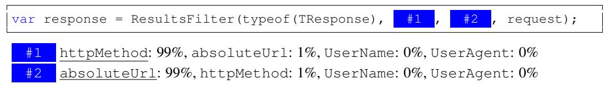

# LEARNING TO REPRESENT PROGRAMS WITH GRAPHS

Miltiadis Allamanis Microsoft Research Cambridge, イギリス miallama@microsoft.com Marc Brockschmidt Microsoft Research Cambridge, イギリス mabrocks@microsoft.com

Mahmoud Khademi<sup>∗</sup>

Simon Fraser University バーナビー、ブリティッシュコロンビア州、カナダ mkhademi@sfu.ca

### ABSTRACT

ソースコード（*すなわち*、形式言語）に関する学習課題は近年注目されていますが、ほとんどの研究は自然言語の手法を転用しようとし、コードが持つ既知のセマンティクスが提供する独自の機会を活かしていません。たとえば、同じ変数や関数を離れた場所で使うことによって生じる長距離の依存関係がしばしば考慮されていません。私たちは、コードの構文構造とセマンティクス構造の両方を表現するためにグラフを用い、プログラム構造上で推論を行うためにグラフベースの深層学習手法を利用することを提案します。

本研究では、ソースコードからグラフを構築する方法と、そのような大規模グラフに対してGated Graph Neural Networksの学習をスケールさせる方法を提示します。私たちは、変数の使用パターンからネットワークが変数名を予測するVARNAMINGタスクと、ネットワークが指定されたプログラム位置で使用すべき正しい変数を選択する推論を学習するVARMISUSEタスクの2つの課題で本手法を評価しました。より構造化されていないプログラム表現を用いた手法との比較により、既知の構造をモデル化することの利点が示され、私たちのモデルが意味のある名前を推測し、多くの場合VARMISUSEタスクを解決できることが示唆されます。さらに、私たちのテストでは、VARMISUSEによって成熟したオープンソースプロジェクトの中から多数のバグが特定されることがわかりました。

### 1 INTRODUCTION

大規模なソースコードリポジトリとスケーラブルな機械学習手法の出現は、「ビッグコード」という考え方、すなわち既存のソースコードから一般化することでソフトウェアエンジニアを支援する主に教師なしの手法の発展を自然に導いています [\(Allamanis et al., 2017\)](#page-8-0)。現在、既存のディープラーニングモデルはソースコードの浅いテキスト構造のみを捉えており、例えばトークン列として [\(Hindle](#page-9-0) [et al., 2012;](#page-9-0) [Raychev et al., 2014;](#page-9-1) [Allamanis et al., 2016\)](#page-8-1)、構文木として [\(Maddison & Tarlow, 2014;](#page-9-2) [Bielik et al., 2016\)](#page-9-3)、または変数の平坦な依存ネットワークとして [\(Raychev et al., 2015\)](#page-9-4) 扱われています。このようなモデルでは、ソースコードの豊かで明確に定義されたセマンティクスを活かす機会が失われています。本研究では、この課題を改善するために、ソースコード内の二つの追加的な情報源、すなわちデータフローおよび型階層を取り入れています。プログラムをグラフとして符号化し、エッジが構文的関係（「前後のトークン」など）だけでなくセマンティック関係（「変数が最後に使用／書き込まれた場所」、「仮引数streamへの引数呼び出し」など）も表現することで実現します。私たちの主な洞察は、これらのセマンティクスを機械学習モデルへの構造化入力として明示的に与えることで、必要な学習データ量やモデル容量、訓練手法の要件を緩和し、従来の技術水準を超えた課題を解決できるという点にあります。

私たちは、プログラムのより多くの意味構造を明らかにする利点を示すために、2つのタスクを検討します。まず、VARNAMINGタスク [\(Allamanis et al., 2014;](#page-8-2) [Raychev et al., 2015\)](#page-9-4) を考えます。このタスクでは、いくつかのソースコードが与えられたときに、「正しい」変数名をサブトークンの列として推論します。これは、変数がどのように使用されているか、*すなわち*、コードのさまざまな行について推論することをある程度理解する必要があります。

<sup>∗</sup>マイクロソフトリサーチ（英国ケンブリッジ）でのインターンとして行った研究です。

```
var clazz=classTypes["Root"].Single() as JsonCodeGenerator.ClassType;
Assert.NotNull(clazz);
var first=classTypes["RecClass"].Single() as JsonCodeGenerator.ClassType;
Assert.NotNull( clazz );
Assert.Equal("string", first.Properties["Name"].Name);
Assert.False(clazz.Properties["Name"].IsArray);
```
Figure 1: RavenDBというオープンソースのC#プロジェクトで検出されたバグの一部です。コードは少し簡略化されています。私たちのモデルは、ハイライト（黄色）の位置で使用されている変数が誤っていることを正しく検出しました。本来はfirstがその位置に置かれるべきでした。私たちはこの問題を報告し、[PR 4138](https://github.com/ravendb/ravendb/pull/4138)で修正されました。

第二に、私たちは変数誤用予測タスク（VARMISUSE）を導入します。このタスクでは、ネットワークがプログラムのある箇所でどの変数を使うべきかを推論します。タスクを説明するために、[Figure 1](#page-1-0) では、私たちのモデルが人気のオープンソースプロジェクトで検出したバグの少し簡略化したコード断片を示しています。具体的には、黄色でハイライトされた部分では、変数 clazz の代わりに変数 first が使われるべきでした。既存の静的解析手法ではこのような問題を検出できませんが、ソフトウェアエンジニアであれば経験からこのようなエラーを容易に特定することができます。

高い精度を達成するためには、プログラムのセマンティクス（意味）の表現を学習する必要があります。両方のタスクにおいて、変数の*意味的*な役割（*例えば*、「これはカウンタか？」「これはファイル名か？」）を学習する必要があります。さらに、VARMISUSEタスクでは、変数の使用のセマンティクス（*例えば*、「ここではファイル名が必要である」）を学習する必要があります。この「空欄要素補完」タスクは、Word2Vec [\(Mikolov et al., 2013\)](#page-9-5) や GLoVe [\(Pennington et al., 2014\)](#page-9-6) などの自然言語単語の分散表現を学習する手法に関連しています。しかし、私たちはデータフロー情報のような、より豊かな構造から学ぶことができます。本研究はプログラムの表現学習に向けた一歩であり、コード補完（「これが探している変数である」）やより高度なバグ検出（「このオブジェクトを使う前にロックすべきである」）など、他のさまざまなタスクにも有用であると期待しています。

要約すると、私たちの貢献は次の通りです。（i）VARMISUSEタスクを、機械学習によるソースコードのモデリングにおける課題として定義し、プログラムの（一部の）セマンティクスを学習する必要があるものとしています（*[section 3\)](#page-2-0) 参照）。（ii）コードのグラフ構造をモデリングし、これらのグラフ上でプログラム表現を学習することによって、VARNAMINGおよびVARMISUSEタスクを解決するためのディープラーニングモデルを提示します（*[section 4\)](#page-2-1) 参照）。（iii）実際のソースコード290万行からなる大規模データセット上で私たちのモデルを評価し、最良のモデルがVARNAMINGタスクで32.9%の精度、VARMISUSEタスクで85.5%の精度を達成し、より単純なベースラインを上回ることを示しています（*[section 5\)](#page-5-0) 参照）。（iv）成熟したオープンソースソフトウェアプロジェクトで発見されたバグをいくつか要約することで、VARMISUSEの実用的な関連性を示しています（*[subsection 5.3\)](#page-7-0) 参照）。グラフニューラルネットワークの実装（より単純なタスク用）は <https://github.com/Microsoft/gated-graph-neural-network-samples> で、データセットは <https://aka.ms/iclr18-prog-graphs-dataset> で公開されています。

# 2 RELATED WORK

私たちの研究は、ソースコードのアーティファクトに機械学習を活用するという近年の分野に基づいています。たとえば、Hindleら（2012）やBhoopchandら（2016）はコードをトークンの列としてモデル化し、一方でMaddison & Tarlow（2014）やRaychevら（2016）はコードの構文木構造をモデル化しています。コードの言語モデルに関するこれらすべての研究において、変数やメソッドの識別子を予測することが最も大きな課題の一つであるとされています。

私たちの研究に最も近いのは、[Allamanis et al.](#page-8-4) [\(2015\)](#page-8-4) によるものであり、彼らは変数名を予測するために、すべての使用箇所を利用して変数の分散表現を学習しています。しかし、彼らはデータフロー情報を利用しておらず、私たちの知る限り、それを利用しているモデルはありません。[Raychev et al.](#page-9-4) [\(2015\)](#page-9-4) および [Bichsel et al.](#page-9-8) [\(2016\)](#page-9-8) は、条件付き確率場を用いて変数、AST要素、型の間の様々な関係をモデル化し、変数名や型を予測したり（あるいはAndroidアプリの難読化解除のために）していますが、データのフロー自体は明示的には考慮していません。これらの研究では、すべての変数の使用箇所が事前に決定論的に既知であり（コードは完全で変更されることがないため）、[Allamanis et al.](#page-8-2) [\(2014;](#page-8-2) [2015\)](#page-8-4) における状況と同様です。

私たちの研究は、スケッチを用いたプログラム合成[\(Solar-Lezama, 2008\)](#page-9-9)や自動化されたコード移植[\(Barr et al., 2015\)](#page-8-5)に関する研究と遠い関係があります。しかし、これらの手法はギャップを埋めるために仕様（たとえば、入出力例やテストスイート）を必要とし、ビッグコードから得られた統計情報には依存していません。これらのアプローチは私たちの研究を補完するものと考えることができます。なぜなら、私たちは仕様を一切必要とせず、コードから得られた一般的な変数使用パターンを学習することによって、統計的にギャップを埋めることを学ぶからです。

グラフ上のニューラルネットワークは、さまざまなディープラーニング手法をグラフ構造の入力に適応させています。これらは、リンク予測や分類などの一連の応用で利用されてきました。また、NLPにおける意味役割付与にも利用されています。ソースコードとやや関連する研究としては、定理証明における前提選択のために数式のグラフベース表現を学習した研究があります。

## <span id="page-2-0"></span>3 THE VARMISUSE TASK

コード中の変数の誤用を検出するには、プログラムの意味論についての理解と推論が必要です。このタスクに成功するためには、プログラム要素の役割や機能を推測し、それらがどのように関連しているかを理解する必要があります。たとえば、Fig. [1,](#page-1-0)のようなプログラムが与えられた場合、課題はclazzのマークされた使用が間違いであり、代わりにfirstが使われるべきであることを自動的に検出することです。このタスクは標準的なコード補完に似ていますが、変数識別子のみを対象とし、ほぼ完成されたプログラムを扱うという点で、その範囲や目的が大きく異なります。

タスクの説明  
私たちはソースコードファイルを、トークンの列 t<sup>0</sup> . . . t<sup>N</sup> = T と見なします。この中には、いくつかのトークン tλ<sup>0</sup> , tλ<sup>1</sup> . . . が変数となっています。さらに、V<sup>t</sup> ⊂ V は、t の位置でスコープ内にある型が正しいすべての変数の集合を指します。つまり、コンパイラエラーを発生させずに t で使用できる変数です。私たちは、正しい変数の使用法を予測したいトークン tok<sup>λ</sup> を *スロット* と呼びます。各スロット tλ ごとに独立したタスクを定義します。すなわち、t<sup>0</sup> . . . tλ−<sup>1</sup> および tλ+1, . . . , t<sup>N</sup> が与えられたとき、Vt<sup>λ</sup> から t<sup>λ</sup> を正しく選択します。学習および評価上、正解は単にグラウンドトゥルースと一致するものですが、実際には複数の変数がメモリ上の同じ値を参照している場合など、いくつかの割り当てが正しいと考えられることに注意してください。

## <span id="page-2-1"></span>4 MODEL: PROGRAMS AS GRAPHS

このセクションでは、プログラムのソースコードを*プログラムグラフ*に変換し、それらの上で表現を学習する方法について説明します。これらのプログラムグラフは、プログラムのテキストだけでなく、標準的なコンパイラツールを使用して得られる意味的情報もエンコードします。

Gated Graph Neural Networks  
本研究は、Gated Graph Neural Networks [\(Li et al.,](#page-9-11) [2015\)](#page-9-11) (GGNN) に基づいており、ここでその概要を説明します。グラフ G = (V, E, X) は、ノード集合 V、ノードの特徴 X、および有向エッジ集合のリスト E = (E1, . . . , EK) から構成されます。ここで K はエッジタイプの数です。それぞれの v ∈ V に対して、ノードの特徴を表す実数値ベクトル x (v) ∈ R <sup>D</sup> を付与します（例えば、そのノードの文字列ラベルの埋め込みなど）。

私たちは、各ノード v に状態ベクトル h (v) を関連付けており、これはノードラベル x (v) から初期化されます。状態ベクトルと特徴ベクトルのサイズは通常同じですが、ノード特徴にパディングを加えることでより大きな状態ベクトルを使用することもできます。グラフ全体に情報を伝播させるために、タイプ k の「メッセージ」が各 v からその近傍ノードへ送信されます。それぞれのメッセージは現在の状態ベクトルから m (v) <sup>k</sup> = fk(h (v) ) として計算されます。ここで f<sup>k</sup> は任意の関数であり、私たちのケースでは線形層を選択しています。すべてのグラフ辺について同時にメッセージを計算することで、すべての状態を同時に更新することが可能です。特に、ノード v の新しい状態は、すべての受信メッセージを集約することで計算されます：m˜ (v) = g({m (u) k | u から v へのタイプ k の辺が存在する場合})。g は集約関数であり、要素ごとの総和として実装しています。集約メッセージ m˜ (v) とノード v の現在の状態ベクトル h (v) が与えられると、次のタイムステップでの状態 h <sup>0</sup>(v) は h <sup>0</sup>(v) = GRU(m˜ (v) , h (v) ) として計算されます。ここで GRU はゲート付きリカレントユニット（GRU）のリカレントセル関数です [\(Cho et al., 2014\)](#page-9-18)。

<span id="page-3-1"></span>


(a) 図[1,](#page-1-0) の2行目の簡略化された構文グラフであり、青い丸みを帯びたボックスは構文ノード、黒い長方形のボックスは構文トークン、青いエッジはChildエッジ、二重の黒いエッジはNextTokenエッジを表しています。

(b) (x <sup>1</sup>,y <sup>2</sup>) = Foo(); while (x <sup>3</sup> > 0) x <sup>4</sup> = x <sup>5</sup> + y 6（明確にするために添字が追加されています）のデータフローエッジで、赤の点線はLastUseエッジ、緑の破線はLastWriteエッジ、紫の一点鎖線はComputedFromエッジを表しています。

Figure 2: プログラム表現で使用されるグラフのエッジの例。

上記の方程式によって定義されるダイナミクスは、所定の回数のタイムステップにわたって繰り返されます。その後、最後のタイムステップで得られた状態ベクトルをノードの表現として使用します。

プログラムのソースコードをグラフとして表現し、さまざまなトークン間の構文的および意味的な関係をモデル化するために異なるエッジタイプを使用します。プログラムグラフの骨組みとなるのはプログラムの抽象構文木（AST）であり、これは*構文ノード*（プログラム言語の文法における非終端記号に対応）と*構文トークン*（終端記号に対応）から構成されます。構文ノードにはプログラムの文法からの非終端記号の名前をラベル付けし、構文トークンにはそれが表現する文字列をラベル付けします。ASTに従ってノードを接続するためにChildエッジを使用します。これは構文ノードの子として順序を誘導しないため、追加で各構文トークンをその後続のトークンに接続するNextTokenエッジも追加します。その例が図 [2a.](#page-3-1) に示されています。

プログラム内の制御とデータの流れを把握するために、変数に対応する構文トークンの異なる使用および更新を接続する追加のエッジを加えます。このようなトークン v に対して、DR(v) をその変数が最後に使用された可能性のある構文トークンの集合とします。この集合には複数のノードが含まれることがあり（例えば、変数が両方の分岐で使われた後の条件文の後など）、ループの場合のように、プログラムコードの後に現れる構文トークンが含まれることもあります。同様に、D<sup>W</sup> (v) をその変数が最後に書き込まれた構文トークンの集合とします。これらを用いて、v から DR(v)（または D<sup>W</sup> (v)）のすべての要素への LastRead（または LastWrite）エッジを追加します。さらに、代入 v = expr を観測した場合、expr に現れるすべての変数トークンに対して ComputedFrom エッジで v を接続します。このようなセマンティックエッジの例は Fig. [2b.](#page-3-1) に示されています。

同じ変数のすべての使用箇所を LastLexicalUse エッジで連鎖させることで、グラフを拡張します（データフローとは独立しており、*例えば*、if (...) { ... v ...} else { ... v ...} の場合、v の2つの出現をリンクします）。また、return トークンを ReturnsTo エッジでメソッド宣言に接続します（これにより、その名前や型への「ショートカット」が作成されます）。[Rice ら](#page-9-19) [\(2017\)](#page-9-19) に着想を得て、メソッド呼び出しにおける引数を、対応する形式引数に FormalArgName エッジで接続します。*つまり*、Foo(bar) という呼び出しと、Foo(InputStream stream) というメソッド宣言が観測された場合、bar トークンを stream トークンへ接続します。最後に、変数に対応するすべてのトークンを、その変数を使用している外側のガード式に GuardedBy および GuardedByNegation エッジで接続します。例えば、if (x > y) { ... x ...} else { ... y ...} の場合、x から（それぞれ y から）x > y に対応する AST ノードへ GuardedBy エッジ（それぞれ GuardedByNegation エッジ）を追加します。

最後に、すべての種類のエッジについて、それぞれの逆方向のエッジ（隣接行列を転置することで得られる）を導入します。これにより、エッジとエッジタイプの数が倍になります。逆方向のエッジは、GGNN全体で情報をより速く伝播させるのに役立ち、モデルの表現力を高めます。

<span id="page-3-0"></span><sup>1</sup>グラフ畳み込みネットワーク（GCN）[\(Kipf & Welling, 2016;](#page-9-13) [Schlichtkrull et al., 2017\)](#page-9-20)は、GGNNのより単純な代替となります。これは、状態更新の際にゲート付き再帰ユニットを使用せず、各GGNNレイヤーごとの伝播ステップ数を1に固定した場合のGGNNの特殊なケースに相当します。その代わりに、複数のレイヤーが使用されます。私たちの実験では、GCNはGGNNよりも一般化性能が低いことがわかりました。

変数型情報の活用  
静的型付け言語を想定しており、ソースコードはコンパイルが可能であるため、それぞれの変数には（既知の）型 τ (v) が割り当てられています。これを利用するために、既知の型には学習可能な埋め込み関数 r(τ ) を定義し、さらに未知または未表現の型すべてに対して「UNKTYPE」を定義します。また、多くのオブジェクト指向言語で利用できる豊富な型階層も活用します。これには、変数の型 τ (v) をそのスーパタイプの集合、すなわち τ ∗ (v) = {τ : τ (v) が型 τ を実装する} ∪ {τ (v)} にマッピングします。そして、変数 v の型表現 r ∗ (v) を {r(τ ) : τ ∈ τ ∗ (v)} の要素ごとの最大値として計算します。ここで最大値を選んだのは、部分順序関係（型ラティスのようなもの）を表現する自然なプーリング手法であるためです。τ ∗ (v) のすべての型を利用することで、共通のスーパタイプやインターフェースを実装する未見の型にも一般化することができます。例えば、List<K> には複数の具体的な型（例：List<int>, List<string>）がありますが、これらの型は共通のインターフェース（IList）を実装し、共通の特徴を持っています。学習時には、τ ∗ (v) から空ではない部分集合をランダムに選択し、ラティス内のすべての既知の型が学習されるようにします。これはドロップアウトのような仕組みとして機能し、型ラティス内のすべての型に対して良い表現を学習できるようになります。

初期ノード表現 ノードの初期状態を計算するために、トークンのテキスト表現とその型情報を組み合わせます。具体的には、トークンを表すノードの名前をキャメルケースやパスカルケースでサブトークンに分割します（例: classTypesはclassとtypesという2つのサブトークンに分割されます）。すべてのサブトークンの埋め込みを平均して、ノード名の埋め込みを取得します。最後に、前述の方法で計算した学習済みの型表現 r ∗ (v) とノード名表現を連結し、線形層に通すことで、グラフ内の各ノードの初期表現を得ます。

与えられたプログラムと既存の変数 v に対して、上で説明したようにプログラムグラフを構築し、対応するすべての変数トークンにおける変数名を特別な <SLOT> トークンで置き換えます。名前を予測する際には、まず上記のように学習可能なトークン埋め込みと型埋め込みを連結した初期ノードラベルを計算し、GGNN 伝播を8ステップ実行します[2](#page-4-0)。その後、すべての <SLOT> トークンの表現を平均化することで変数使用表現を算出します。この表現を1層のGRUの初期状態として用い、ターゲット名をサブトークンの列として予測します（*例：* 名前 inputStreamBuffer は [input, stream, buffer] という列として扱います）。この graph2seq アーキテクチャは最大尤度目的で学習します。[セクション5](#page-5-0) では、正確な名前の予測精度およびサブトークン予測の F1 スコアを報告します。

VARMISUSEをプログラムグラフでモデル化するには、グラフを修正する必要があります。まず、使用される変数を予測したいスロット t の*コンテキスト表現* c(t)を計算するために、t の位置に新しいノード v<SLOT> を挿入します。これはこの位置の「穴」に対応しており、スロットで選択される変数に依存しないすべての適用可能なエッジ（つまり、LastUse、LastWrite、LastLexicalUse、GuardedBy エッジ以外のすべて）を使って残りのグラフに接続します。次に、ターゲットスロットで各候補変数 v の*使用表現* u(t, v) を計算するために、Vt 内のすべての v について「候補」ノード vt,v を挿入し、その変数がこのスロットで使用された場合に追加されることになる LastUse、LastWrite、LastLexicalUse エッジを挿入してグラフに接続します。これらの各候補ノードはスコープ内でその変数を仮に配置した状態を表現しています。

初期ノード表現に、候補ノード vt,v に対して1に設定された追加のビットを連結し、8ステップの間GGNN伝播を実行します。[2](#page-4-0) その後、コンテキストおよび使用法の表現はノードの最終状態、つまり c(t) = h(v<SLOT>) および u(t, v) = h(vt,v) となります。最後に、その場所での正しい変数使用法は arg max<sup>v</sup> W[c(t), u(t, v)] によって計算されます。ここで W は、c(t) と u(t, v) の連結を利用する線形層です。私たちはマージン最大化目的で学習を行います。

#### 4.1 IMPLEMENTATION

大きく多様なグラフの集合に対してGGNNを使用するには、工夫が必要です。なぜなら、多様な形状が存在する場合、効率的なバッチ処理が難しいからです。重要な観察点として、大きなグラフは通常非常にスパースであるため、エッジを隣接リストとして表現することで、通常はメモリ消費を削減できるという利点があります。私たちの場合、これはスパーステンソルを使って簡単に実装できます。

<sup>2</sup>より少ないステップ数では十分な結果が得られず、また伝播ステップを増やしても大きな効果はありませんでした。

表現方法により、現代のGPUの並列処理能力を効率的に活用できる大きなバッチサイズが可能となります。第二の重要な洞察は、複数のグラフのバッチを、多くの非連結成分を持つ一つの大きなグラフとして表現することです。これにはノードの識別子を一意にするための適切な前処理が必要です。このバッチ構築処理はCPUにとってやや負荷が高いため、ミニバッチの準備を別スレッドで行うことが有用であると分かりました。私たちのTensorFlow [\(Abadi et al., 2016\)](#page-8-6) 実装では、平均2,228（中央値936）ノードと8,350（中央値3,274）エッジを持つグラフ、8回のGGNNアンローリング反復、全20種類のエッジタイプ（元の10種類のエッジタイプそれぞれに対する順方向・逆方向エッジ）、隠れ層のサイズ64を用い、単一のNVidia GeForce GTX Titan Xでトレーニング時に1秒あたり55グラフ、テスト時には1秒あたり219グラフまでスケールします。GGNNにおけるエッジのタイプ数は実行時間に比例して寄与します。例えば、アブレーション研究のために最も一般的な2種類のエッジタイプ（NextToken, Child）のみを用いたGGNNでは、同じハイパーパラメータでトレーニング時に105グラフ/秒、テスト時には419グラフ/秒に達します。私たちの（汎用的な）GGNN実装は、よりシンプルなデモンストレーションタスクを使用し、[https://github.com/Microsoft/](https://github.com/Microsoft/gated-graph-neural-network-samples) [gated-graph-neural-network-samples](https://github.com/Microsoft/gated-graph-neural-network-samples) で公開しています。

### <span id="page-5-0"></span>5 EVALUATION

VARMISUSEタスクのために、私たちはGitHub上のオープンソースC#プロジェクトからデータセットを収集しました。プロジェクトの選定には、GitHubでスター数が最も多い（フォークではない）プロジェクトを選びました。その後、Roslynを使用して完全に（容易に）コンパイルできないプロジェクトを除外しました。これは、コードの正確な型情報（外部ライブラリに含まれる型も含む）を抽出するためにコンパイルが必要だからです。最終的なデータセットには、多様な分野（コンパイラ、データベースなど）から29のプロジェクトが含まれており、約290万行の空でないコードが含まれています。完全な表はAppendix Dに示されています。

変数の誤用を検出するタスクのために、すべてのプロジェクトから変数使用箇所を選択し、変数宣言を除外し、少なくとも1つの型互換な代替変数がスコープ内に存在する箇所をフィルタリングしてデータを収集します。このタスクは、その場所にもともと存在していた正しい変数を推測することです。したがって、構造上、少なくとも1つの型が正しい代替変数が存在し、つまりそれを選んでも型チェック時にエラーは発生しません。テストデータセットでは、各スロットあたり平均して3.8個の型が正しい代替変数があります（中央値3、σ = 2.6）。

データセットから、2つのプロジェクトを開発セットとして選びました。残りのプロジェクトからは、UNSEENPROJTEST用に3つのプロジェクトを選択し、まったく未知の構造や型を持つプロジェクトでテストできるようにしました。残りの23プロジェクトは、トレーニング／バリデーション／テストセットに60-10-30の割合で分割し、ファイルごとに分けています（*つまり*、1つのソースファイルからの例は*すべて*同じセットに入っています）。このようにして得られたテストセットをSEENPROJTESTと呼びます。

Baselines For VARMISUSE, we consider two bidirectional RNN-based baselines. The local model (LOC) is a simple two-layer bidirectional GRU run over the tokens before and after the target location. For this baseline, c(t) is set to the slot representation computed by the RNN, and the usage context of each variable u(t, v) is the embedding of the name and type of the variable, computed in the same way as the initial node labels in the GGNN. This baseline allows us to evaluate how important the usage context information is for this task. The flat dataflow model (AVGBIRNN) is an extension to LOC, where the usage representation u(t, v) is computed using another two-layer bidirectional RNN run over the tokens before/after each usage, and then averaging over the computed representations at the variable token v. The local context, c(t), is identical to LOC. AVGBIRNN is a significantly stronger baseline that already takes some structural information into account, as the averaging over all variables usages helps with long-range dependencies. Both models pick the variable that maximizes c(t) <sup>T</sup> u(t, v).

VARMISUSEのためのベースラインとして、私たちは2つの双方向RNNベースのベースラインを考えます。ローカルモデル（LOC）は、ターゲット位置の前後のトークン上で動作する単純な2層の双方向GRUです。このベースラインでは、c(t)はRNNによって計算されたスロット表現に設定し、各変数の使用コンテキスト u(t, v) は、GGNNの初期ノードラベルと同様の方法で計算される変数名と型の埋め込みです。このベースラインにより、この課題において使用コンテキスト情報がどの程度重要かを評価できます。フラットデータフローモデル（AVGBIRNN）はLOCの拡張であり、各使用箇所の前後のトークン上で動作するもう1つの2層双方向RNNを用いてu(t, v)を計算し、変数トークンv上で計算された表現を平均化します。ローカルコンテキストc(t)はLOCと同一です。AVGBIRNNはすでに構造的な情報も考慮しているため、全ての変数使用箇所にわたって平均化することで長距離依存関係の扱いが向上し、より強力なベースラインとなっています。両モデルとも、c(t) <sup>T</sup> u(t, v) を最大化する変数を選択します。

VARNAMINGでは、LOCをAVGLBLに置き換えます。AVGLBLは各変数使用箇所の左4つと右4つのコンテキストトークンに対して対数バイリニアモデルを使用し、これらのコンテキスト表現の平均を取ります（これは[Allamanis et al.](#page-8-4) [\(2015\)](#page-8-4)のモデルに対応します）。また、VARNAMINGでAVGBIRNNもテストしており、これは本質的に対数バイリニアのコンテキストモデルを双方向RNNに置き換えたものです。

|              | SEENPROJTEST |        |          |       | UNSEENPROJTEST |        |          |       |
|--------------|--------------|--------|----------|-------|----------------|--------|----------|-------|
|              | LOC          | AVGLBL | AVGBIRNN | GGNN  | LOC            | AVGLBL | AVGBIRNN | GGNN  |
| VARMISUSE    |              |        |          |       |                |        |          |       |
| Accuracy (%) | 50.0         | —      | 73.7     | 85.5  | 28.9           | —      | 60.2     | 78.2  |
| PR AUC       | 0.788        | —      | 0.941    | 0.980 | 0.611          | —      | 0.895    | 0.958 |
| VARNAMING    |              |        |          |       |                |        |          |       |
| Accuracy (%) | —            | 36.1   | 42.9     | 53.6  | —              | 22.7   | 23.4     | 44.0  |
| F1 (%)       | —            | 44.0   | 50.1     | 65.8  | —              | 30.6   | 32.0     | 62.0  |

Table 1: モデルの評価。SEENPROJTESTは、トレーニングセットにファイルが含まれているプロジェクトを含むテストセットを指し、UNSEENPROJTESTは、トレーニングデータにファイルが含まれていないプロジェクトを指します。結果は2回の実行の平均です。

<span id="page-6-3"></span>

| Table 2: GGNNモデルのSEENPROJTESTにおける2つのタスクのアブレーションスタディ。 |  |  |  |  |
|-------------------------------------------------------------------------------|--|--|--|--|
|-------------------------------------------------------------------------------|--|--|--|--|

|                                                 | Accuracy (%) |           |  |  |
|-------------------------------------------------|--------------|-----------|--|--|
| Ablation Description                            | VARMISUSE    | VARNAMING |  |  |
| 標準モデル（表1で報告）                         | 85.5         | 53.6      |  |  |
| NextToken、Child、LastUse、LastWriteエッジのみ  | 80.6         | 31.2      |  |  |
| セマンティックエッジのみ（NextToken、Child以外すべて） | 78.4         | 52.9      |  |  |
| 構文エッジのみ（NextToken、Child）              | 55.3         | 34.3      |  |  |
| ノードラベル：サブトークンの代わりにトークン     | 85.6         | 34.5      |  |  |
| ノードラベル：無効                              | 84.3         | 31.8      |  |  |

## 5.1 QUANTITATIVE EVALUATION

[Table 1](#page-6-1) は両方のタスクに対するモデルの評価結果を示しています。[4](#page-6-2) LOCはほとんど情報を捉えられないため、比較的悪いパフォーマンスとなっています。多くの変数使用箇所から情報を捉えるAVGLBLやAVGBIRNNも、問題の豊かな構造を明示的にエンコードしていないため、依然としてGGNNには大きく劣っています。VARMISUSEでは、コードの構造や意味がこの設定ではるかに重要であるため、パフォーマンスの差はさらに大きくなっています。

新しいプロジェクトへの一般化  
異なるドメインを持つ多様なソースコードプロジェクトにわたって一般化することは、機械学習における重要な課題です。私たちは、学習セットにファイルが含まれていないプロジェクトから成るUNSEENPROJTESTセットを用いて評価を繰り返しました。[Table 1](#page-6-1) の右側は、SEENPROJTESTと比較してわずかに性能が低下しているものの、私たちのモデルが依然として良好な性能を達成していることを示しています。これは、UNSEENPROJTESTでは型ラティスがほとんど未知であるため、予想される結果です。

私たちは、訓練済みモデルを未知のプロジェクト（*すなわち*、ドメイン）に適用する際の主要な問題は、その型階層が不明であり、使用されている語彙（*例えば*、変数名、メソッド名、クラス名、*など*）が大きく異なる可能性があることだと考えています。

アブレーションスタディ  
我々のモデルのいくつかの設計選択が与える影響を調べるため、追加実験を実施し、その結果を[Table 2.](#page-6-3)に示している。まず、プログラムグラフで使用されるエッジを変更した。モデルを構文情報のみに制限すると、両タスクのパフォーマンスに大きな影響を及ぼすことが分かった。一方で、意味エッジのみに制限すると、主にVARMISUSEの性能に影響が出るようである。同様に、ComputedFrom、FormalArgName、ReturnsToエッジはVARMISUSEに対してはわずかな向上をもたらすが、VARNAMINGの性能は大きく改善される。ノードラベル表現に関する実験結果からも分かるように、構文ノードやトークン名はVARMISUSEにはほとんど影響しないが、VARNAMINGには大きな影響を及ぼす。

# 5.2 QUALITATIVE EVALUATION

[Figure 3](#page-7-1) は、サンプルテストスニペットに対してGGNNが行う予測を示しています。このスニペットは、ルートフォルダへと段階的に降下しながら、グローバルディレクティブファイルを再帰的に検索します。正しい変数の使用方法について論理的に考えるのは人間にとっても難しいですが、GGNNはその変数を正しく予測しています。

<span id="page-6-0"></span><sup>3</sup><http://roslyn.io>

<span id="page-6-2"></span><sup>4</sup> セクション [A](#page-10-0) では、さらにVARMISUSEタスクにおけるGGNNモデルのROC曲線および適合率-再現率曲線も示しています。

<span id="page-7-1"></span>

図3: ServiceStackプロジェクトのSEENPROJTESTセット内のスニペットにおけるスロットごとのVARMISUSE予測結果。追加の可視化は[Appendix B.](#page-10-1)で確認できる。下線が引かれているトークンが正しいトークンである。モデルは各スロットで複数の文字列変数から選択する必要があり、そのすべてが何らかのパスを表している。GGNNは、変数同士の複雑な相互作用について推論し、13個中11個のスロットで正しい変数の使用を正確に予測した。

```
public ArraySegment<byte> ReadBytes(int length){
   int size = Math.Min(length, _len - _pos);
   var buffer = EnsureTempBuffer( length );
   var used = Read(buffer, 0, size);
```
Figure 4: RavenDBオープンソースプロジェクトで発見されたバグ（黄色）。このコードは、不必要にバッファのサイズをlengthで確保していますが、（本モデルがここで正しい変数として予測する）sizeであるべきです。

2つ（スロット1と8）を除くすべての場所での使用例です。ソフトウェアエンジニアがコードを書いている際、彼女が誤って別の変数の代わりに1つの変数を誤用してしまうことは十分考えられます。すべての変数が文字列型変数であるため、型エラーは発生しません。図[3](#page-7-1)の確率が示唆するように、多くの潜在的な変数の誤用はモデルによって検出でき、ソフトウェアエンジニアにとって有益な警告となります。コメント付きの追加のサンプルは[付録B.](#page-10-1)に掲載されています。

さらに、[Appendix C](#page-14-0) では、GGNNの使用表現u(t, v)のコサイン類似度によって計算された、類似した表現を持つコードスニペットのペアのサンプルが示されています。読者は、ネットワークがセマンティックな類似性を持つ変数の使用例をまとめて学習していることに気付くでしょう。たとえば、変数を使用する前にnullチェックを行う場合、さまざまなコードセグメント間で類似した分散表現が得られます（[Appendix C](#page-14-0)のサンプル1）。

#### <span id="page-7-0"></span>5.3 DISCOVERED VARIABLE MISUSE BUGS

私たちは、自分たちのVARMISUSEモデルを用いて、RavenDB（ドキュメントデータベース）およびRoslyn（MicrosoftのC#コンパイラフレームワーク）におけるバグが存在する可能性が高い箇所を特定しました。そのために、両プロジェクトにおいてモデルが最も自信を持って変数の選択を実際の値と異なると判断した上位500箇所のサンプルを手作業でレビューし、各プロジェクトで3件のバグを発見しました。

Figs. [1,](#page-1-0)[4](#page-7-2)[,5](#page-8-7) はRavenDBで発見された問題を示しています。Fig. [1](#page-1-0) のバグは、おそらくコピー＆ペーストによって引き起こされたものであり、従来の手法では簡単には発見できません。コンパイラは *警告しません*

```
if (IsValidBackup(backupFilename) == false) {
 output("Error:"+ backupLocation +" doesn't look like a valid backup");
 throw new InvalidOperationException(
     backupLocation + " doesn't look like a valid backup");
```
Figure 5: RavenDBオープンソースプロジェクトで見つかったバグ（黄色）。backupFilename が IsValidBackup によって無効であると判定されているにもかかわらず、ユーザーには backupLocation が無効であると通知されている。

未使用の変数（最初の変数は使用されています）についてはほとんど誰も別のテストをテストするテストを書くことはありません。図[4](#page-7-2)は重大ではないものの、メモリ消費の増加につながる可能性がある問題を示しています。図[5](#page-8-7)は、情報が不十分なエラーメッセージから生じる別の問題を示しています。私たちは[Roslyn](http://roslyn.io)の開発者に対して追加で3件のバグを非公開で報告し、その間にこれらの問題は修正されました（cf. <https://github.com/dotnet/roslyn/pull/23437>）。報告されたバグの1つは、特定のRoslyn機能を使用した際にVisual Studioがクラッシュする原因となりうるものでした。

広く公開され、テストされたコードでこれらの問題が見つかることは、私たちのモデルがソフトウェア開発プロセスにおいて有用であり、従来のプログラム解析ツールを補完できることを示唆しています。たとえば、1つの利用シナリオとしては、VARMISUSEモデルが異常と判断した場所にコードレビューのプロセスを誘導したり、テストや高コストなコード解析の際にその指針として活用したりすることが考えられます。

### 6 DISCUSSION & CONCLUSIONS

ソースコードはプログラミング言語研究など他の分野ではよく理解され研究されていますが、ディープラーニングにおいては比較的新しい領域です。ソースコードは、テキストや知覚データと比べて新たな機会を提供します。というのも、ソースコードの（ローカルな）セマンティクスは明確に定義されており、よく知られた効率的なプログラム解析を用いて豊富な追加情報を抽出できるからです。一方で、こうした構造化された情報の豊かさを統合することは興味深い課題となります。私たちのVARMISUSEタスクは、より単純なコード補完のようなタスクを超えて、これらの機会を明らかにします。これは、ソースコードの「意味」を学習するという中核的課題の最初の代理指標とみなしています。このタスクは、型システムに含まれる標準的な情報を確率的に洗練する必要があるためです。

### REFERENCES

- <span id="page-8-6"></span>Martín Abadi、Ashish Agarwal、Paul Barham、Eugene Brevdo、Zhifeng Chen、Craig Citro、Greg S Corrado、Andy Davis、Jeffrey Dean、Matthieu Devin ほか。Tensorflow: 異種分散システム上での大規模機械学習。*arXiv preprint arXiv:1603.04467*, 2016年。
- <span id="page-8-2"></span>Miltiadis Allamanis、Earl T Barr、Christian Bird、Charles Sutton。自然なコーディング規約の学習。In *Foundations of Software Engineering (FSE)*, 2014.
- <span id="page-8-4"></span>Miltiadis Allamanis、Earl T Barr、Christian Bird、Charles Sutton。正確なメソッド名やクラス名を提案する手法について述べています。*Foundations of Software Engineering (FSE)*、2015年。
- <span id="page-8-1"></span>Miltiadis Allamanis、Hao Peng、Charles Sutton。ソースコードの極端な要約のための畳み込みアテンションネットワーク。*International Conference on Machine Learning (ICML)*, pp. 2091–2100, 2016。
- <span id="page-8-0"></span>Miltiadis Allamanis、Earl T Barr、Premkumar Devanbu、および Charles Sutton。「ビッグコードと自然性のための機械学習に関する調査」*arXiv preprint arXiv:1709.06182*, 2017年。
- <span id="page-8-5"></span>Earl T Barr、Mark Harman、Yue Jia、Alexandru Marginean、そしてJustyna Petkeによる「自動化されたソフトウェア移植」。*International Symposium on Software Testing and Analysis (ISSTA)*、2015年。
- <span id="page-8-8"></span>Al Bessey、Ken Block、Ben Chelf、Andy Chou、Bryan Fulton、Seth Hallem、Charles Henri-Gros、Asya Kamsky、Scott McPeak、および Dawson Engler。数十億行のコードの後：実世界でバグを発見するための静的解析の活用。*Communications of the ACM*, 53(2):66–75, 2010年。
- <span id="page-8-3"></span>Avishkar Bhoopchand、Tim Rocktäschel、Earl Barr、Sebastian Riedel。スパースポインタネットワークを用いたPythonコードサジェストの学習。*arXiv preprint arXiv:1611.08307*, 2016年。
- <span id="page-9-8"></span>Benjamin Bichsel、Veselin Raychev、Petar Tsankov、Martin Vechevによる、Androidアプリケーションの統計的難読化解除に関する研究です。*Conference on Computer and Communications Security (CCS)*、2016年。
- <span id="page-9-3"></span>Pavol Bielik、Veselin Raychev、Martin Vechev。PHOG：コードのための確率的モデル。*International Conference on Machine Learning (ICML)*、2016年。
- <span id="page-9-18"></span>Kyunghyun Cho、Bart van Merriënboer、Dzmitry Bahdanau、Yoshua Bengio。「ニューラル機械翻訳の特性について：エンコーダ・デコーダ手法」。*Syntax, Semantics and Structure in Statistical Translation*, 2014年。
- <span id="page-9-12"></span>Michaël Defferrard、Xavier Bresson、およびPierre Vandergheynstによる論文です。グラフ上での畳み込みニューラルネットワークに関し、高速で局所化されたスペクトルフィルタリング手法について述べられています。*Neural Information Processing Systems (NIPS)*、pp. 3844–3852、2016年に掲載されました。
- <span id="page-9-14"></span>Justin Gilmer、Samuel S. Schoenholz、Patrick F. Riley、Oriol Vinyals、およびGeorge E. Dahlによる論文です。量子化学のためのニューラルメッセージパッシングについて述べています。*arXiv preprint arXiv:1704.01212*, 2017年。
- <span id="page-9-10"></span>Marco Gori、Gabriele Monfardini、Franco Scarselliによる論文です。グラフ領域での学習のための新しいモデルについて述べられています。*IEEE International Joint Conference Neural Networks (IJCNN)* にて発表されました。IEEE、2005年。
- <span id="page-9-15"></span>Aditya Grover と Jure Leskovec。node2vec: ネットワークのためのスケーラブルな特徴学習。*International Conference on Knowledge Discovery and Data Mining (SIGKDD)* にて, pp. 855–864。ACM、2016年。
- <span id="page-9-0"></span>Abram Hindle、Earl T Barr、Zhendong Su、Mark Gabel、Premkumar Devanbuによる論文です。「ソフトウェアの自然さについて」。*International Conference on Software Engineering (ICSE)*、2012年。
- <span id="page-9-13"></span>Thomas N KipfとMax Welling。グラフ畳み込みネットワークを用いた半教師あり分類。*arXiv preprint arXiv:1609.02907*, 2016年。
- <span id="page-9-11"></span>Yujia Li、Daniel Tarlow、Marc Brockschmidt、Richard Zemelによる論文です。Gated Graph Sequence Neural Networksについて述べており、*International Conference on Learning Representations (ICLR)*、2015年で発表されました。
- <span id="page-9-2"></span>Chris J Maddison と Daniel Tarlow。自然なソースコードの構造化生成モデル。*International Conference on Machine Learning (ICML)*、2014年。
- <span id="page-9-16"></span>Diego Marcheggiani と Ivan Titov による論文です。意味役割付与のためにグラフ畳み込みネットワークを用いて文をエンコードしています。*ACL*, 2017 に掲載されました。
- <span id="page-9-5"></span>Tomas Mikolov、Ilya Sutskever、Kai Chen、Greg S Corrado、Jeff Deanによる論文です。「単語やフレーズの分散表現とそれらの合成性」について述べられています。2013年の*Neural Information Processing Systems (NIPS)*に掲載されました。
- <span id="page-9-6"></span>Jeffrey Pennington、Richard Socher、および Christopher D Manning。GloVe: 単語表現のためのグローバルベクトル。*EMNLP*、2014年。
- <span id="page-9-1"></span>Veselin Raychev、Martin Vechev、およびEran Yahav。統計的言語モデルを用いたコード補完。*Programming Languages Design and Implementation (PLDI)*、pp. 419–428、2014年。
- <span id="page-9-4"></span>Veselin Raychev、Martin Vechev、そしてAndreas Krauseによる「Big Codeからプログラムの特性を予測する」。*Principles of Programming Languages (POPL)*、2015年。
- <span id="page-9-7"></span>Veselin Raychev、Pavol Bielik、Martin Vechev。決定木を用いたコードのための確率モデル。In *Object-Oriented Programming, Systems, Languages, and Applications (OOPSLA)*, 2016.
- <span id="page-9-19"></span>Andrew Rice、Edward Aftandilian、Ciera Jaspan、Emily Johnston、Michael Pradel、Yulissa Arroyo-Paredes。引数選択の欠陥を検出する。*Proceedings of the ACM on Programming Languages*, 1(OOPSLA):104, 2017年。
- <span id="page-9-20"></span>Michael Schlichtkrull、Thomas N. Kipf、Peter Bloem、Rianne van den Berg、Ivan Titov、およびMax Welling。グラフ畳み込みネットワークを用いた関係データのモデリング。*arXiv preprint arXiv:1703.06103*, 2017年。
- <span id="page-9-9"></span>Armando Solar-Lezama. *Program synthesis by sketching*. カリフォルニア大学バークレー校、2008年。
- <span id="page-9-17"></span>Mingzhe Wang、Yihe Tang、Jian Wang、Jia Deng。定理証明のための前提選択をディープグラフ埋め込みで行いました。*Advances in Neural Information Processing Systems*、pp. 2783–2793、2017年。

<span id="page-10-2"></span>

Figure 6: VARMISUSEにおけるGGNNモデルのPrecision-Recall曲線とROC曲線。なお、y軸は50%から始まっています。

Table 3: VARMISUSEにおける、型が正しくスコープ内にある候補変数の数ごとのGGNNモデルの性能を示します。ここでは、サブトークンを使用した完全なGGNNモデルの性能を算出しています。

| # of candidates                | 2    | 3    | 4    | 5    | 6 or 7 | 8+   |
|--------------------------------|------|------|------|------|--------|------|
| Accuracy on SEENPROJTEST (%)   | 91.6 | 84.5 | 81.8 | 78.6 | 75.1   | 77.5 |
| Accuracy on UNSEENPROJTEST (%) | 85.7 | 77.1 | 75.7 | 69.0 | 71.5   | 62.4 |

### <span id="page-10-0"></span>A PERFORMANCE CURVES

[Figure 6](#page-10-2) は、GGNNモデルのROCおよび適合率-再現率曲線を示しています。読者がご覧の通り、偽陽性率を10%に設定した場合、SEENPROJTESTでは73%、未確認テストでは69%の真陽性率[5](#page-10-3)が得られます。これは、このモデルが高い精度設定で実用的に使用でき、許容できるパフォーマンスを示すことを示唆しています。

## <span id="page-10-1"></span>B VARMISUSE PREDICTION SAMPLES

以下に、SEENPROJTESTプロジェクトからのサンプルと、モデルの性能に関するコメントを示します。コードのコメントやフォーマットは、組版の都合上変更されている場合があります。正解の選択肢は下線付きで示されています。

### Sample 1


| #1 | 開始位置: 97%から、 |  | 終了位置: 3%まで |  |
|----|--------------------|--|--------------|--|
|----|--------------------|--|--------------|--|

#2 port：100%、開始時：0%、終了時：0%

#3 endingAt: 100%、startingFrom: 0%、port: 0%

#4 port: 100%、startingFrom: 0%、endingAt: 0%

- #5 ポート: 100%、開始時: 0%、終了時: 0%
- #6 port: 100%、開始時: 0%、終了時: 0%

. モデルはループ内のすべての変数を正確に予測します。

業界では10%の偽陽性率が広く受け入れられており、最大許容限度として30%が設定されています[\(Bessey](#page-8-8) [et al., 2010\)](#page-8-8)。

Sample 2


#3 path: 76%、name: 16%、DIR\_PATH: 8%

. 文字列変数が混乱することはなく、その意味的な役割が正しく推論されます。

サンプル3

```
[global::System.Diagnostics.DebuggerNonUserCodeAttribute]
public void MergeFrom(pb::CodedInputStream input) {
 uint tag;
 while ((tag = input.ReadTag()) != 0) {
   switch(tag) {
    default:
      input.SkipLastField();
      break;
    case 10: {
       #1 .AddEntriesFrom(input, _repeated_payload_codec);
      break;
    }
   }
 }
}
```
#1 ペイロード: 66%、payload\_: 44%

. モデルはしばしばエイリアス、すなわち同じメモリ上の場所を指す変数に混乱します。この例では、どちらの選択肢でも同じ動作になったでしょう。

Sample 4


#1 \_gate: 99%、\_observers: 1% #2 \_isDisposed: 90%、\_isStopped: 8%、HasObservers: 2%

. ReturnsToエッジは、そうでなければ予測が不可能だった変数を予測するのに役立ちます。

#### Sample 5

| /// <summary><br/>/// 例外について、すべての登録済みオブザーバーに通知します。<br/>/// </summary>                         |
|-------------------------------------------------------------------------------------------------------------------------|
| /// <param name="error"/> すべてのオブザーバーに送信する例外。<br>public override void OnError(Exception error)<br>{ |
| if (<br>#1<br>== null)<br>throw new ArgumentNullException(nameof(<br>#2<br>));                                          |
|                                                                                                                         |
| var os = default(IObserver <t>[]);</t>                                                                                  |
| lock (<br>#3<br>)                                                                                                       |
| {<br>CheckDisposed();                                                                                                   |
| if (!<br>#4<br>)<br>{                                                                                                   |
| os = _observers.Data;<br>_observers = ImmutableList <iobserver<t>&gt;.Empty;</iobserver<t>                              |
| #5<br>= true;                                                                                                           |
| #6<br>=<br>#7<br>;                                                                                                      |
| }<br>}                                                                                                                  |
| if (os != null)                                                                                                         |
| {<br>foreach (var o in os)                                                                                              |
| {                                                                                                                       |
| o.OnError(<br>#8<br>);                                                                                                  |
| }<br>}                                                                                                                  |
| }                                                                                                                       |
|                                                                                                                         |

| エラー: 93%、<br>_例外: 7%                                   |
|-----------------------------------------------------------|
| エラー: 98%、<br>_例外: 2%                                   |
| _ゲート: 100%、<br>_オブザーバー: 0%                         |
| _停止済み: 86%、<br>_破棄済み: 13%、<br>オブザーバーあり: 1%  |
| _停止済み: 91%、<br>_破棄済み: 9%、<br>オブザーバーあり: 0%   |
| _例外: 100%、<br>エラー: 0%                                 |
| エラー: 98%、<br>_例外: 2%                                   |
| _例外: 99%、<br>エラー: 1%                                   |
|                                                           |

. このモデルは、最後以外のすべてのスロットから正しい変数を予測します。最後のスロットについて推論するには、クラスファイル全体にわたるコードの手続き間の理解が必要です。

#4 Probe: 98%、AskedForDelete: 2%

#### Sample 6


#5 Response: 98%、Message: 2%。このモデルは、スロット #3 での使用例を除き、すべて正しく予測しています。このスニペットについて推論するには、コードの意図に関する追加のセマンティック情報が必要です。

## Sample 7



. モデルは、正しい文字列パラメータを選択する方法を知っています。なぜなら、モデルはそれらを正式なパラメータ名に一致させているからです。

#### Sample 8


. モデルにとって、特にスロット#2のような珍しい定数が含まれている場合、条件文について推論することは難しいです。

## <span id="page-14-0"></span>C NEAREST NEIGHBOR OF GGNN USAGE REPRESENTATIONS

ここでは、学習された表現 u(t, v) のコサイン類似度に基づいて、最も近い隣接ペアを示します。各スロット t は濃い青色で示され、v のすべての使用箇所は黄色（*例：* variableName）で示されます。これは良い例と悪い例を示す、手作業で選んだ例のセットです。それぞれのペアの後に簡単な説明が続きます。

#### Sample 1


```
if ( unobservableExceptionHanler != null)
      return false;
   unobservableExceptionHanler = handler;
}
...
```
. nullかどうかをチェックされるスロットは、同様の表現を持っています。

#### Sample 2

```
...
public IActorRef ResolveActorRef(ActorPath actorPath ){
 if(HasAddress( actorPath .Address))
   return _local.ResolveActorRef(RootGuardian, actorPath .ElementsWithUid);
 ...
...
```

```
...
ActorPath actorPath ;
if (TryParseCachedPath(path, out actorPath)) {
   if (HasAddress( actorPath .Address)){
      if ( actorPath .ToStringWithoutAddress().Equals("/"))
         return RootGuarding;
      ...
   }
   ...
}
...
```
. 類似のAPIプロトコルに従うスロットは、類似した表現を持ちます。なお、HasAddressという関数はローカル関数であり、testset内でのみ見られます。

#### Sample 3

```
...
foreach(var filter in configuration.Filters){
   GlobalJobFilter.Filters.Add( filter );
}
...
```

```
...
public void Count_ReturnsNumberOfElements(){
   _collection.Add( _filterInstance );
   Assert.Equal(1, _collection.Count);
}
...
```
コレクションのようなオブジェクトに要素を追加すると、同様の表現が得られます。

### <span id="page-15-0"></span>D DATASET

収集されたデータセットおよびその特性は[Table 4.](#page-15-1)に示されています。プロジェクトのセットとしての完全なデータセットおよびその解析済みJSONは、オンラインで公開される予定です。

<span id="page-15-1"></span>表4：私たちのデータセットに含まれるプロジェクト一覧。アルファベット順に並んでいます。kLOCはC#コードの空行を除いた行数を表します。Devと記載されたプロジェクトは開発セットとして使用されました。†が付いているプロジェクトはテスト専用のデータセットに含まれていました。それ以外のプロジェクトは学習・検証・テストセットに分割されました。データセット全体では約2.9MLOCが含まれています。

| Name              | Git SHA  | kLOCs | Slots | Vars  | Description                           |  |
|-------------------|----------|-------|-------|-------|---------------------------------------|--|
| Akka.NET          | 719335a1 | 240   | 51.3k | 51.2k | アクターベースの並列・分散フレームワーク             |  |
|                   |          |       |       |       | フレームワーク                             |  |
| AutoMapper        | 2ca7c2b5 | 46    | 3.7k  | 10.7k | オブジェクト間マッピングライブラリ                   |  |
| BenchmarkDotNet   | 1670ca34 | 28    | 5.1k  | 6.1k  | ベンチマーク取得ライブラリ                       |  |
| BotBuilder        | 190117c3 | 44    | 6.4k  | 8.7k  | ボット開発用SDK                                |  |
| choco             | 93985688 | 36    | 3.8k  | 5.2k  | Windows用パッケージマネージャー                    |  |
| commandline†      | 09677b16 | 11    | 1.1k  | 2.3k  | コマンドラインパーサー                            |  |
| CommonMark.NETDev | f3d54530 | 14    | 2.6k  | 1.4k  | Markdownパーサー                               |  |
| Dapper            | 931c700d | 18    | 3.3k  | 4.7k  | オブジェクトマッピングライブラリ                     |  |
| EntityFramework   | fa0b7ec8 | 263   | 33.4k | 39.3k | オブジェクト関係マッパー                           |  |
| Hangfire          | ffc4912f | 33    | 3.6k  | 6.1k  | バックグラウンドジョブ処理ライブラリ                    |  |
| Humanizer†        | cc11a77e | 27    | 2.4k  | 4.4k  | 文字列操作・整形ライブラリ                            |  |
| Lean†             | f574bfd7 | 190   | 26.4k | 28.3k | アルゴリズムトレーディングエンジン                        |  |
| Nancy             | 72e1f614 | 70    | 7.5k  | 15.7  | HTTPサービスフレームワーク                             |  |
| Newtonsoft.Json   | 6057d9b8 | 123   | 14.9k | 16.1k | JSON操作ライブラリ                                 |  |
| Ninject           | 7006297f | 13    | 0.7k  | 2.1k  | コードインジェクションライブラリ                         |  |
| NLog              | 643e326a | 75    | 8.3k  | 11.0k | ロギングライブラリ                                 |  |
| Opserver          | 51b032e7 | 24    | 3.7k  | 4.5k  | モニタリングシステム                                |  |
| OptiKey           | 7d35c718 | 34    | 6.1k  | 3.9k  | 支援技術用オンスクリーンキーボード                         |  |
| orleans           | e0d6a150 | 300   | 30.7k | 35.6k | 分散型仮想アクターモデル                             |  |
| Polly             | 0afdbc32 | 32    | 3.8k  | 9.1k  | レジリエンス＆一時的障害対応ライブラリ                        |  |
|                   |          |       |       |       | ライブラリ                                     |  |
| quartznet         | b33e6f86 | 49    | 9.6k  | 9.8k  | スケジューラー                                   |  |
| ravendbDev        | 55230922 | 647   | 78.0k | 82.7k | ドキュメントデータベース                                |  |
| RestSharp         | 70de357b | 20    | 4.0k  | 4.5k  | RESTおよびHTTP APIクライアントライブラリ                   |  |
| Rx.NET            | 2d146fe5 | 180   | 14.0k | 21.9k | リアクティブ言語拡張                                 |  |
| scriptcs          | f3cc8bcb | 18    | 2.7k  | 4.3k  | C#テキストエディタ                                |  |
| ServiceStack      | 6d59da75 | 231   | 38.0k | 46.2k | Webフレームワーク                                 |  |
| ShareX            | 718dd711 | 125   | 22.3k | 18.1k | 共有アプリケーション                                 |  |
| SignalR           | fa88089e | 53    | 6.5k  | 10.5k | プッシュ通知フレームワーク                              |  |
| Wox               | cdaf6272 | 13    | 2.0k  | 2.1k  | アプリケーションランチャー                              |  |

本研究のために、GPLライセンスのプロジェクトを除いた大部分のデータを公開しました。データは <https://aka.ms/iclr18-prog-graphs-dataset> で入手できます。一部のプロジェクトをデータから除外しているため、以下に公開データセットを用いて3回の実行で平均した結果を報告します。

|                | Accuracy (%) | PR AUC |
|----------------|--------------|--------|
| SEENPROJTEST   | 84.0         | 0.976  |
| UNSEENPROJTEST | 74.1         | 0.934  |
