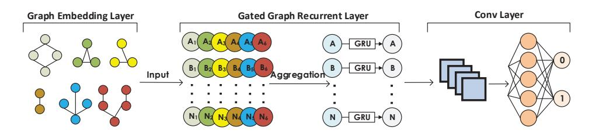
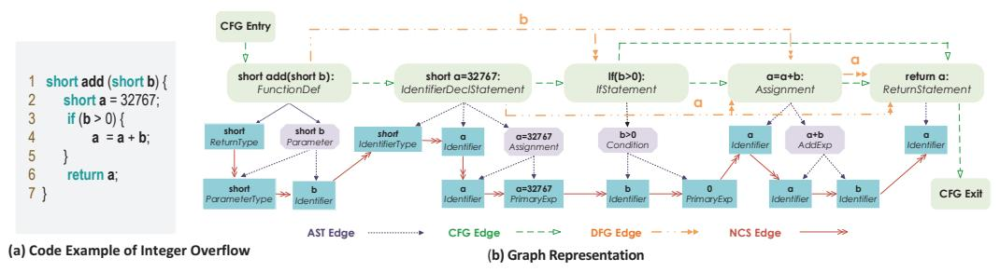

# *Devign*: Effective Vulnerability Identification by Learning Comprehensive Program Semantics via Graph Neural Networks

Yaqin Zhou Nanyang Technological University yaqinchou@gmail.com

Jingkai Siow Nanyang Technological University JINGKAI001@e.ntu.edu.sg

Shangqing Liu Nanyang Technological University shangqingliu666@gmail.com

Xiaoning Du Nanyang Technological University dxn0733@gmail.com

Yang Liu 南洋理工大学 yangliu@ntu.edu.sg

# Abstract

脆弱性の特定は、サイバーセキュリティのためにソフトウェアシステムを攻撃から守る上で極めて重要である。特に、ソースコード内の脆弱な関数を特定し修正作業を容易にすることが重要である。しかし、これは困難かつ煩雑なプロセスであり、また専門的なセキュリティの知識も要求される。本研究では、多様なコード表現グラフから定義された脆弱性パターンに関する手動作業の研究や、近年のグラフニューラルネットワークの進展に着想を得て、*Devign*という名称のモデルを提案する。本モデルは、豊富なコードのセマンティック表現を学習することで、グラフレベルの分類を行う汎用的なグラフニューラルネットワークベースモデルである。さらに、学習された豊富なノード表現からグラフレベル分類に有用な特徴を効率的に抽出する新規な*Conv*モジュールも備えている。本モデルは、これまでの研究で用いられた合成コードではなく、実際のソースコードが持つ高い複雑さと多様性を取り入れた4つの大規模オープンソースCプロジェクトに基づき手動でラベル付けしたデータセット上で学習されている。これらのデータセットに対する広範な評価の結果、*Devign*は最先端手法に対して平均10.51%の精度向上および8.68%のF1スコアの向上という有意な成果を示しており、*Conv*モジュールを用いることでさらに平均4.66%の精度向上および6.37%のF1スコア向上が見られた。

# 1 Introduction

ソフトウェアの脆弱性の数は、最近急速に増加している。これは、CVE（Common Vulnerabilities and Exposures）を通じて公に報告されている場合もあれば、独自コード内で内部的に発見される場合もある。特に、オープンソースライブラリの普及は、増加要因となるだけでなく、その影響を拡大させている。これらの脆弱性は、主に安全でないコードによって引き起こされ、ソフトウェアシステムに対する攻撃に悪用され、財政的・社会的に多大な損害をもたらす可能性がある。

脆弱性の特定は、セキュリティにおいて重要でありながら困難な問題である。静的解析[\[1](#page-8-0), [2\]](#page-8-1)、動的解析[\[3](#page-8-2)[–5](#page-8-3)]やシンボリック実行といった従来の手法に加えて、機械学習の応用による補完的な手法も近年進展している。初期のこれらの方法[\[6](#page-8-4)[–8\]](#page-9-0)では、人間の専門家によって手作業で設計された特徴やパターンが、機械学習アルゴリズムへの入力として利用され、脆弱性の検出が行われている。しかしながら、脆弱性の根本原因は多様である。

脆弱性の種類[\[9\]](#page-9-1)やライブラリによって異なるため、多数のライブラリに存在するすべての脆弱性を手作業で作成した特徴量のみで特徴付けるのは非現実的である。

既存の手法の使いやすさを向上させ、特徴抽出における専門家の膨大な労力を回避するため、近年の研究では深層ニューラルネットワークを用いたより自動化された脆弱性識別手法の可能性が検討されている[\[10](#page-9-2)[–12](#page-9-3)]。しかし、これら全ての研究は、実際のソースコードに見られる多様かつ複雑な脆弱性を特徴付けるための包括的なプログラムセマンティクスの学習に大きな限界がある。まず、学習手法の観点から見ると、ソースコードを自然言語と同様にフラットなシーケンスとして扱うか、あるいは部分的な情報のみで表現している。しかし、ソースコードは自然言語よりも構造的かつ論理的であり、抽象構文木（AST）、データフロー、制御フローなど、異なる側面での表現が存在する。さらに、脆弱性は時に微妙な欠陥であり、セマンティクスの複数の側面からの包括的な検討が求められる。そのため、以前の研究の設計に見られる欠点が、様々な脆弱性を網羅する能力に制約を与えている。次に、学習データの観点では、[\[11](#page-9-4)]のデータの一部は静的解析ツールによってラベル付けされており、実際には脆弱性でないものを多く含む高い割合の偽陽性が持ち込まれている。また、[\[10\]](#page-9-2)のように、コード内に"good"や"bad"といった文言を挿入して脆弱なコードとそうでないコードを区別するような単純な人工コードも存在し、これは実際のコードの複雑さからは程遠いものである[\[13](#page-9-5)]。

この目的のために、我々は事実に基づく脆弱性データのための合成的プログラミング表現を備えた新規のグラフニューラルネットワークベースのモデルを提案する。本手法により、さまざまな脆弱性特性を捉えるために古典的プログラミングコード意味論の完全なセットをエンコードできる。主要な革新点は、新たな*Conv*モジュールであり、これはグラフの異種ノード特徴をgated recurrent unitsから入力として受け取る点にある。*Conv*モジュールは、グラフレベルの分類のために従来の畳み込み層と全結合層を活用しながら、より粗い特徴を階層的に選択する。さらに、ソースコードに対する合成的プログラミング埋め込みの可能性および提案するグラフニューラルネットワークモデルが脆弱性特定という困難な課題に有用であることを証明するため、Cプログラミング言語による4つの有名かつ多様なライブラリーから手動でラベリングしたデータセットを編纂した。本モデルを*Devign*（Deep Vulnerability Identification via Graph Neural Networks）と命名する。

- 合成コード表現では、ASTをバックボーンとして利用し、異なるレベルでプログラムの制御およびデータ依存性を明示的にエンコードし、各タイプが対応する表現に関する接続を示す異種エッジの統合グラフへと組み込むのである。従来の研究で考慮されていなかったこの包括的な表現は、できる限り多様な種類およびパターンの脆弱性を捉えることを容易にし、グラフニューラルネットワークによるより優れたノード表現の学習を可能にするのである。
- 我々は、グラフレベルの分類のために*Conv*モジュールを備えたゲート付きグラフニューラルネットワークモデルを提案する。*Conv*モジュールはノード特徴量から階層的に学習し、グラフレベルの分類タスクにおけるより高次の表現を捉えるのである。
- *Devign*を実装し、その有効性を4つの主要なCライブラリから収集した*手動で*ラベル付けされたデータセット（約600人時のコスト）を用いて評価した。2つのデータセットを、詳細情報とともに公開している[\(https://sites.google.com/view/devign\)](https://sites.google.com/view/devign)。結果として、*Devign*は平均で10.51%高い精度と8.68%高いF1スコアをベースライン手法より達成した。同時に、*Conv*モジュールは平均で4.66%の精度向上と6.37%のF1向上をもたらした。*Devign*を4つのプロジェクトから収集した最新40件のCVEに適用したところ、74.11%の精度を得られ、新たな脆弱性発見への実用性が示された。

# 2 The *Devign* Model

コードプロパティグラフを用いて手動で作成された脆弱性パターンは、すべての構文および依存関係のセマンティクスを統合しており、ソフトウェアの脆弱性検出において最も効果的な手法の一つであることが証明されている[\[14\]](#page-9-6)。これに着想を得て、*Devign*を設計し、コードプロパティグラフ上で上述のプロセスを自動化し、グラフニューラルネットワークを用いて脆弱パターンを学習することを目指した[\[15\]](#page-9-7)。*Devign*のアーキテクチャは図[1,](#page-2-0)に示されており、以下3つの逐次的なコンポーネントを含む。1) *Graph Embedding Layer of Composite Code Semantics*は、関数の生ソースコードを包括的なプログラムセマンティクスを持つ統合的なグラフ構造へエンコードする。2) *Gated Graph Recurrent Layers*は、グラフ内の隣接ノードから情報を集約・伝播することでノードの特徴を学習する。3) *The Conv module*は、グラフレベルの予測に有用なノード表現を抽出する。

図1：*Devign*のアーキテクチャ

#### 2.1 Problem Formulation

ほとんどの機械学習またはパターンベースの手法は、ソースファイルやアプリケーションといった粗い粒度レベルで脆弱性を予測している。すなわち、ソースファイルまたはアプリケーションが潜在的に脆弱であるかどうかを判定するものである[\[7](#page-9-8), [14,](#page-9-6) [10,](#page-9-2) [12](#page-9-3)]。本研究では、脆弱なコードを*関数レベル*という、脆弱性分析全体の中で最も細かい粒度で分析する。脆弱な関数の特定を二値分類問題として形式化し、すなわち生のソースコード中の与えられた関数が脆弱かどうかを判定することを学習する。データのサンプルは ((ci , yi)|ci ∈ C, yi ∈ Y), i ∈ {1, 2, ... , n} と定義されるものとする。ここで C はコード中の関数の集合、Y = {0, 1} n はラベル集合であり、1は脆弱、0はそれ以外を示し、nはインスタンス数である。ciが関数であるので、それが多重エッジグラフgi(V, X, A) ∈ Gとして符号化されていると仮定する（埋め込みの詳細はSection [2.2](#page-2-1)を参照）。mをV中のノード総数とし、X ∈ R m×d は各頂点 vj ∈ V をd次元の実数ベクトル xj ∈ R d で表現した初期ノード特徴行列である。A ∈ {0, 1} k×m×m は隣接行列であり、kはエッジタイプの総数である。Aの要素 e p s,t が1であれば、ノード vs, vt がタイプpのエッジによって接続されていることを示し、0であれば接続されていないことを示す。*Devign*の目的は、GからYへの写像、すなわち f : G 7→ Y を学習し、関数が脆弱であるかどうかを予測することである。予測関数fは、以下の損失関数を最小化することによって学習可能である。

$$
\min \sum_{i=1}^{n} \mathcal{L}(f(g_i(V, X, A), y_i|c_i)) + \lambda \omega(f) \tag{1}
$$

ここで、L(·)はクロスエントロピー損失関数であり、ω(·)は正則化項、λは調整可能な重みである。

#### 2.2 Graph Embedding Layer of Composite Code Semantics

図[1](#page-2-0)に示すように、グラフ埋め込み層EMBは関数コードciをモデルへの入力であるグラフデータ構造へ写像するものである、すなわち、

$$
g_i(V, X, A) = EMB(c_i), \forall i = \{1, ..., n\}
$$
（2）

本節では、クラシックなコード表現を利用して、コードを特徴学習のための複合グラフに埋め込む理由と方法について説明する。

#### 2.2.1 Classical Code Graph Representation and Vulnerability Identification

プログラム解析においては、プログラムの様々な表現が利用され、テキストコードの背後にあるより深いセマンティクスを具現化する。古典的な概念としては、AST（抽象構文木）、制御フローグラフ、データフローグラフがあり、これらはソースコード内の異なるトークン間の構文的および意味的な関係を捉えるものである。メモリリークのような脆弱性の大半は、複合的なコード意味を同時に考慮しなければ発見があまりに困難である[\[14](#page-9-6)]。たとえば、ASTのみでは不適切な引数の検出にしか利用できないことが報告されている[\[14\]](#page-9-6)。ASTと制御フローグラフを組み合わせることで、リソースリークや一部のuse-after-free脆弱性といった、更に2種類の脆弱性への対応が可能となる。さらに三つのコードグラフを統合することで、追加の外部情報が必要な二つを除き、ほとんどの種類の脆弱性を記述することができる（すなわち、実行時プロパティに依存する競合状態や、プログラムの意図した設計に関する詳細なしにはモデル化が困難な設計エラー）。

[\[14](#page-9-6)]は、グラフトラバーサルの形で*手動で*脆弱性テンプレートを作成したが、これにより主要な洞察が伝えられ、抽象構文木（AST）、制御フローグラフ、データフローグラフの特性を統合した共通データ構造によって、より広範な脆弱性パターンを学習することの実現可能性が証明されたのである。これら三つの古典的なコード構造に加えて、近年のディープラーニングベースの脆弱性検出技術の進展がその有効性を示していることから、ソースコードの自然なシーケンスも考慮対象とする[\[10](#page-9-2), [11\]](#page-9-4)。この表現は、独自のフラットな構造を有し、コードトークン間の関係を「人間が読みやすい」形で捉えるため、古典的な表現を補完できるのである。

図2: 整数オーバーフローを含むコードスニペットのグラフ表現

## 2.2.2 Graph Embedding of Code

次に、各種コード表現のタイプと、さまざまなサブグラフをどのように1つの統合グラフへと表現するかについて簡単に紹介する。その際、Figure [2\(](#page-3-0)a)に示す整数オーバーフローのコード例と、それをFigure [2\(](#page-3-0)b)に示したグラフ表現に従う。

抽象構文木（AST）は、ソースコードの順序付き木構造表現である。通常、これはコードパーサーがプログラムの基本構造を理解し、構文エラーを検査するために用いる最初の表現である。したがって、多くの他のコード表現を生成するための基盤となり、AST V ast のノード集合は、本論文で用いる他の三つのコード表現の全ノードを包含している。ルートノードから始まり、コードはコードブロック、文、宣言、式などに分解され、最終的に葉ノードを構成する基本のトークンとなる。主要なASTノードは図[2.](#page-3-0)に示してある。すべてのボックスがASTノードであり、最初の行に特定のコードが記載され、ノードタイプが注記されている。青いボックスはASTの葉ノードであり、紫色の矢印は親子*AST*関係を示している。

制御フローグラフ (CFG)  
CFGは、プログラムの実行中にたどり得る全ての経路を記述するものである。経路の分岐は条件文、例えば*if*、*for*、*switch*文などによって決定される。CFGにおいて、ノードは文や条件を表し、制御の移動を示すために有向辺で接続されている。*CFG*の辺は、図[2.](#page-3-0)において緑色の破線矢印で強調されている。特に、フローはエントリから始まり、エグジットで終わり、*if*文の箇所で二つの異なる経路が導かれる。

データフローグラフ（DFG）は、CFG内における変数の使用状況を追跡するものである。データフローは変数指向であり、いかなるデータフローも特定の変数へのアクセスまたは変更を伴う。DFGのエッジは、同じ変数に対する後続のアクセスまたは変更を表している。これは図[2](#page-3-0)においてオレンジ色の二重矢印で示されており、関与する変数がエッジ上に注釈されている。例えば、パラメータbは*if*条件と代入文の両方で使用されている。

Natural Code Sequence (NCS)  
ソースコードの自然な順序をエンコードするために、*NCS*エッジを使用してAST内の隣接するコードトークンを接続する。こうしたエンコーディングの主な利点は、ソースコードの順序によって反映されるプログラミングロジックを保持することである。*NCS*エッジは図[2,](#page-3-0)の赤い矢印で示されており、ASTのすべての葉ノードを接続している。

したがって、関数 ci は、ノード集合 V = V ast を共有する4種類の部分グラフ（または4種類のエッジ）からなる結合グラフ g によって表現できる。図 [\(2\)](#page-3-0) に示すように、すべてのノード v ∈ V には2つの属性、すなわち *Code* と *Type* がある。*Code* はノード v に対応するソースコードを含み、v の型は type 属性を表す。初期ノード表現 xv はこれら2つの属性を反映する必要がある。そのため、*Code* はプロジェクト全体のソースコードファイルから構築したコードコーパスを用いて事前学習済みの word2vec モデルによってエンコードし、*Type* はラベルエンコーディングによってエンコードする。この2つのエンコーディングを連結することで、初期ノード表現 xv とする。

#### 2.3 Gated Graph Recurrent Layers

グラフニューラルネットワークの主要なアイデアは、近傍集約を通じてローカルな近傍からノード表現を埋め込むことである。近傍情報の集約手法の違いに基づき、グラフ畳み込みネットワーク [\[16\]](#page-9-9)、GraphSAGE [\[17\]](#page-9-10)、ゲート付きグラフ再帰型ネットワーク [\[15\]](#page-9-7) などおよびそれらの派生手法がある。我々はノード埋め込みの学習にゲート付きグラフ再帰型ネットワークを選択した。これは、他の2つよりも深く構造を掘り下げることができ、セマンティクスとグラフ構造の両方を持つ本研究のデータにより適しているためである [\[18\]](#page-9-11)。

与えられた埋め込みグラフgi(V, X, A)に対して、各ノードvj ∈ Vについて、ノード状態ベクトルh (1) j ∈ R z , z ≥ dを初期注釈を用いて初期化する。この際、xjを最初の次元にコピーし、隠れ状態が注釈サイズより大きい場合には余分な0をパディングする。すなわち、h 1 j = [x ⊤ j , 0] ⊤とする。Tを近傍集約のための総タイムステップ数とする。グラフ全体に情報を伝播させるため、各タイムステップt ≤ Tで、全ノードはエッジタイプおよび方向に依存するエッジを通じて互いに情報をやり取りする（これはAのp番目の隣接行列Apによって記述される。定義より、隣接行列の個数はエッジタイプ数と等しいことが分かる）。すなわち、

$$
a_{j,p}^{(t-1)} = A_p^{\top} \left( W_p \left[ h_1^{(t-1)\top}, \dots, h_m^{(t-1)\top} \right] + b \right)
$$
 (3)

ここで、Wp ∈ R z×z は学習すべき重みであり、b はバイアスである。特に、ノード vj の新たな状態 aj,p は、エッジ種別 p における隣接行列 Ap 上で定義されたすべての隣接ノードの情報を集約することで計算される。残りのステップは、ノード v および前の時刻の状態とともにすべての種別からの情報を取り入れるゲート付きリカレントユニット（GRU）であり、現在のノードの隠れ状態 h (t) i,v を得るものである。

$$
h_j^{(t)} = GRU(h_j^{(t-1)}, AGG(\{a_{j,p}^{(t-1)}\}_{p=1}^k))
$$
\n(4)

ここで、AGG(·)は集約関数を示し、これは異なるエッジタイプから情報を集約して次時刻のノード埋め込みh (t) を計算するための関数{MEAN, MAX, SUM, CONCAT}のいずれかである。実装ではSUM関数を用いる。上記の伝播手順はTタイムステップにわたり繰り返され、最終タイムステップにおける状態ベクトルH (T) i = {h (T) j } m j=1がノード集合Vの最終ノード表現行列となる。

#### 2.4 The Conv Layer

ゲーテッドグラフリカレントレイヤから生成されたノード特徴は、ノード、リンク、あるいはグラフレベルの予測層への入力として利用可能であり、その後、モデル全体をエンドツーエンドで学習させることができる。本課題では、関数 ci が脆弱であるか否かを判定するためのグラフレベルの分類タスクを実行する必要がある。グラフ分類の標準的なアプローチは、これらすべてのノード埋め込みをグローバルに集約することであり、例えば線形重み付き総和によってすべての埋め込みを単純に加算する方法がある[\[15,](#page-9-7) [19\]](#page-9-12)。これは式[\(5\)](#page-4-0)に示した通りである。

$$
\tilde{y}_i = Sigmoid\bigg(\sum MLP([H_i^{(T)}, x_i])\bigg) \tag{5}
$$

ここで、シグモイド関数は分類に使用され、MLPはH (T) iとxiの連結をR mベクトルに写像する多層パーセプトロン（MLP）を示す。この種のアプローチは、グラフ全体にわたる効果的な分類を妨げるものである[\[20,](#page-9-13) [21\]](#page-9-14)。

したがって、*Conv*モジュールは、現在のグラフレベルのタスクに関連するノードと特徴量の集合を選択するよう設計されている。先行研究[\[21\]](#page-9-14)では、固定された順序を持たないグラフに対して、ノード特徴量を一貫したノード順にソートするために、グラフ畳み込み層の後にSortPooling層を使用することが提案されている。これにより、従来のニューラルネットワークをその後に追加し、グラフに符号化された豊富な情報を特徴付ける有用な特徴量を抽出できるように学習させることが可能となる。我々の問題設定では、各コード表現グラフは隣接行列に符号化された独自の事前定義されたノードの順序と接続を持ち、ノード特徴量はグラフ畳み込みネットワークのように異なるチャンネルからノード特徴量をソートすることなく、ゲート付きリカレントグラフ層によって学習される。したがって、より効果的な予測のために、グラフレベルタスクに関連する特徴量を学習するために、1次元畳み込み層と全結合ニューラルネットワークを直接適用する[1](#page-4-1)。σ(・)を、マックスプーリングを備える1次元畳み込み層として定義する。

$$
\sigma(\cdot) = MAXPOOL(Relu(CONV(\cdot)))\tag{6}
$$

l を適用される畳み込み層の数とすると、*Conv*モジュールは次のように表現できる。

$$
Z_i^{(1)} = \sigma([H_i^{(T)}, x_i]), \dots, Z_i^{(l)} = \sigma(Z_i^{(l-1)})
$$
\n(7)

$$
Y_i^{(1)} = \sigma\big(H_i^{(T)}\big), \dots, Y_i^{(l)} = \sigma\big(Y_i^{(l-1)}\big) \tag{8}
$$

$$
\tilde{y}_i = Sigmoid\big(AVG(MLP(Z_i^{(l)}) \odot MLP(Y_i^{(l)}))\big) \tag{9}
$$

まず、結合[H (T) i , xi ]に対して従来の1次元畳み込み層を、最終ノード特徴量H (T) i に対して全結合層をそれぞれ適用し、続いて両出力に対して要素ごとの乗算を行い、その結果得られたベクトルに平均集約を施し、最後に予測を行う。

1また、LSTMsおよびBiLSTMs（アテンション機構の有無を含む）をAST順でソートされたノードに対して試したが、全体としては畳み込みネットワークの方が最も良い結果を示した。

| Project      | Sec. Rel. | Commits | VFCs  | Non-VFCs | Graphs | Vul Graphs | Non-Vul Graphs |
|--------------|-----------|---------|-------|----------|--------|------------|----------------|
| Linux Kernel | 12811     | 8647    | 4164  | 16583    | 11198  | 5385       |                |
| QEMU         | 11910     | 4932    | 6978  | 15645    | 6648   | 8997       |                |
| Wireshark    | 10004     | 3814    | 6190  | 20021    | 6386   | 13635      |                |
| FFmpeg       | 13962     | 5962    | 8000  | 6716     | 3420   | 3296       |                |
| Total        | 48687     | 23355   | 25332 | 58965    | 27652  | 31313      |                |

表1：データセットの概要

# 3 Evaluation

*Devign*の利点を、最先端の脆弱性発見手法のいくつかと比較評価し、次の問いを理解することを目的とする。

Q1 我々の*Devign*は、他の学習ベースの脆弱性識別手法と比較してどのような特徴があるか。Q2 我々の*Conv*モジュールを搭載した*Devign*は、グラフレベル分類タスクにおいて、式 [\(5\)](#page-4-0) の平坦な総和を用いた*Ggrn*と比較してどのような性能差があるか。

Q3 *Devign*は各種コード表現（例えば、単一種の情報を持つ単一エッジグラフ）から学習できるか。また、複合グラフ（例えば、全ての種類のコード表現）を用いた*Devign*モデルは、各単一エッジグラフと比較してどうであるか。

Q4 データセット内で脆弱な関数の割合が極端に低いという実際のシナリオにおいて、*Devign*は一部の静的解析ツールよりも優れた性能を発揮し得るか。

Q5 *Devign*は、CVEを通じて公に報告された最新の脆弱性に対してどのように機能するのか。

## 3.1 Data Preparation

有資格な専門知識が求められるため、脆弱な関数の高品質なデータセットを取得するのは決して容易ではない。[\[12\]](#page-9-3) において脆弱関数のデータセットが公開されているが、そのラベルは統計解析ツールによって生成されたものであり、正確ではない。[\[22](#page-9-15)] で使用された他の潜在的なデータセットも入手できない。本研究では、産業界のパートナーの支援を受け、セキュリティチームを組織してゼロからデータの収集およびラベリングを行った。関数群そのものの収集に加え、各関数のグラフ表現や、グラフ内の各ノードに対する初期表現も生成する必要がある。以下に詳細な手順を記述する。

Raw Data Gathering  
*Devign*の脆弱性パターン学習能力を検証するために、開発者に人気があり、機能が多様である4つの大規模C言語オープンソースプロジェクト、すなわちLinux Kernel、QEMU、Wireshark、FFmpegから手動でラベル付けされた関数を収集して評価を行う。

データラベリングの質を促進し、保証するために、まずセキュリティ関連のコミットを収集し、それらを脆弱性修正コミットまたは非脆弱性修正コミットとしてラベル付けし、その後ラベル付けされたコミットから直接、脆弱または非脆弱な関数を抽出した。脆弱性修正コミット（VFC）は、潜在的な脆弱性を修正するコミットであり、これらのコミットで修正が加えられる前のバージョンのソースコードから脆弱な関数を抽出することができる。非脆弱性修正コミット（non-VFC）は、いかなる脆弱性も修正しないコミットであり、同様に修正前のソースコードから非脆弱な関数を抽出することができる。[\[23](#page-9-16)]で提案された手法を採用してコミットを収集した。この手法は、以下の2つのステップから成る。1）*コミットのフィルタリング*。ごく一部のコミットのみが脆弱性に関連しているため、DoSやインジェクションなどのセキュリティ関連キーワードに一致しないメッセージを持つ、セキュリティ非関連のコミットを除外する。残りの、よりセキュリティ関連である可能性が高いものについて、手動でラベル付けを実施する。2）*手動によるラベリング*。4名のプロフェッショナルなセキュリティ研究者チームが、合計*600人時*をかけて、2回のデータラベリングと相互検証を行った。

変更された関数に基づいて、VFC または non-CFC の場合、コミットが適用される前のこれらの関数のソースコードを抽出し、それに応じてラベルを割り当てる。

グラフ生成  
我々は、コードプロパティグラフに基づくC/C++向けのオープンソースコード解析プラットフォームJoern [\[14\]](#page-9-6)を用いて、データセット内の全関数に対してASTおよびCFGを抽出する。Joern内部での一部コンパイルエラーや例外のため、全関数に対してASTとCFGを得ることはできず、一部の関数のみが対象となる。ASTおよびCFGが存在しない関数、またはASTやCFGに明らかなエラーがある関数は除外する。元のDFGエッジは関与する変数でラベル付けされており、これによりエッジタイプの数が著しく増加し、埋め込みグラフの複雑さも増すことから、DFGの代わりに三種類の関係、*LastRead (DFG\_R)*、*LastWrite (DFG\_W)*、で置き換える。

| Method               | Linux Kernel |       | QEMU  |       | Wireshark |       | FFmpeg |       | Combined |       | Max Diff |       | Avg Diff |       |
|----------------------|--------------|-------|-------|-------|-----------|-------|--------|-------|----------|-------|----------|-------|----------|-------|
|                      | ACC          | F1    | ACC   | F1    | ACC       | F1    | ACC    | F1    | ACC      | F1    | ACC      | F1    | ACC      | F1    |
| Metrics + Xgboost    | 67.17        | 79.14 | 59.49 | 61.27 | 70.39     | 61.31 | 67.17  | 63.76 | 61.36    | 63.76 | 14.84    | 11.80 | 10.30    | 8.71  |
| 3-layer BiLSTM       | 67.25        | 80.41 | 57.85 | 57.75 | 69.08     | 55.61 | 53.27  | 69.51 | 59.40    | 65.62 | 16.48    | 15.32 | 14.04    | 8.78  |
| 3-layer BiLSTM + Att | 75.63        | 82.66 | 65.79 | 59.92 | 74.50     | 58.52 | 61.71  | 66.01 | 69.57    | 68.65 | 8.54     | 13.15 | 5.97     | 7.41  |
| CNN                  | 70.72        | 79.55 | 60.47 | 59.29 | 70.48     | 58.15 | 53.42  | 66.58 | 63.36    | 60.13 | 16.16    | 13.78 | 11.72    | 9.82  |
| Ggrn (AST)           | 72.65        | 81.28 | 70.08 | 66.84 | 79.62     | 64.56 | 63.54  | 70.43 | 67.74    | 64.67 | 6.93     | 8.59  | 4.69     | 5.01  |
| Ggrn (CFG)           | 78.79        | 82.35 | 71.42 | 67.74 | 79.36     | 65.40 | 65.00  | 71.79 | 70.62    | 70.86 | 4.58     | 5.33  | 2.38     | 2.93  |
| Ggrn (NCS)           | 78.68        | 81.84 | 72.99 | 69.98 | 78.13     | 59.80 | 65.63  | 69.09 | 70.43    | 69.86 | 3.95     | 8.16  | 2.24     | 4.45  |
| Ggrn (DFG_C)         | 70.53        | 81.03 | 69.30 | 56.06 | 73.17     | 50.83 | 63.75  | 69.44 | 65.52    | 64.57 | 9.05     | 17.13 | 6.96     | 10.18 |
| Ggrn (DFG_R)         | 72.43        | 80.39 | 68.63 | 56.35 | 74.15     | 52.25 | 63.75  | 71.49 | 66.74    | 62.91 | 7.17     | 16.72 | 6.27     | 9.88  |
| Ggrn (DFG_W)         | 71.09        | 81.27 | 71.65 | 65.88 | 72.72     | 51.04 | 64.37  | 70.52 | 63.05    | 63.26 | 9.21     | 16.92 | 6.84     | 8.17  |
| Ggrn (Composite)     | 74.55        | 79.93 | 72.77 | 66.25 | 78.79     | 67.32 | 64.46  | 70.33 | 70.35    | 69.37 | 5.12     | 6.82  | 3.23     | 3.92  |
| Devign (AST)         | 80.24        | 84.57 | 71.31 | 65.19 | 79.04     | 64.37 | 65.63  | 71.83 | 69.21    | 69.99 | 3.95     | 7.88  | 2.33     | 3.37  |
| Devign (CFG)         | 80.03        | 82.91 | 74.22 | 70.73 | 79.62     | 66.05 | 66.89  | 70.22 | 71.32    | 71.27 | 2.69     | 3.33  | 1.00     | 2.33  |
| Devign (NCS)         | 79.58        | 81.41 | 72.32 | 68.98 | 79.75     | 65.88 | 67.29  | 68.89 | 70.82    | 68.45 | 2.29     | 4.81  | 1.46     | 3.84  |
| Devign (DFG_C)       | 78.81        | 83.87 | 72.30 | 70.62 | 79.95     | 66.47 | 65.83  | 70.12 | 69.88    | 70.21 | 3.75     | 3.43  | 2.06     | 2.30  |
| Devign (DFG_R)       | 78.25        | 80.33 | 73.77 | 70.60 | 80.66     | 66.17 | 66.46  | 72.12 | 71.49    | 70.92 | 3.12     | 4.64  | 1.29     | 2.53  |
| Devign (DFG_W)       | 78.70        | 84.21 | 72.54 | 71.08 | 80.59     | 66.68 | 67.50  | 70.86 | 71.41    | 71.14 | 2.08     | 2.69  | 1.27     | 1.77  |
| Devign (Composite)   | 79.58        | 84.97 | 74.33 | 73.07 | 81.32     | 67.96 | 69.58  | 73.55 | 72.26    | 73.26 | -        | -     | -        | -     |

表2：分類精度およびF1スコア（パーセント）：最も右側の2列は、*Devign*モデルの複合コード表現、すなわち*Devign*（Composite）と比較した場合の精度およびF1における最大および平均の相対的差異を示している。

また、*ComputedFrom（DFG_C）* [\[24\]](#page-9-17)は、グラフ埋め込みにより適応的にするためのものである。*DFG_R*は、各変数出現の直前のリード（read）を表す。各出現はASTのリーフノードから直接認識できる。*DFG_W*は、各変数出現の直前のライト（write）を表す。同様に、これらのアノテーションはリーフノードの変数に付与される。*DFG_C*は、変数のソースを決定する。代入文においては、左辺（lhs）の変数が右辺（rhs）の式によって新しい値を与えられる。DFG_Cはlhs変数と各rhs変数との関係を捉えるのである。

さらに、計算効率のため、ノードサイズが500を超える関数を削除した。これは全体の15%に相当する。データセットの統計情報を表[1.](#page-5-0)にまとめた。

## 3.2 Baseline Methods

パフォーマンス比較において、*Devign*を最先端の機械学習ベースの脆弱性予測手法および、線形加重和を用いて分類を行うゲート付きグラフリカレントネットワーク（*Ggrn*）と比較する。

Metrics + Xgboost [\[22\]](#page-9-15): Joernを用いて各関数ごとに合計4つの複雑性メトリクスと11の脆弱性メトリクスを収集し、分類にはXgboostを利用した。ここでは提案されたビンニングおよびランキング手法は使用していない。なぜなら、それは学習に基づくものではなく、脆弱性の可能性を評価するために設計されたヒューリスティックであるためである。最適なパラメータの探索にはBayes Optimization [\[25\]](#page-10-0)を用いた。

3層BiLSTM [\[10](#page-9-2)]：これは、ソースコードを自然言語として扱い、トークナイズされたコードを、Word2vecによって事前に学習された初期エンベディングとともに双方向LSTMに入力するものである。ここでは最高の性能を得るために、3層の双方向LSTMを実装した。

3-layer BiLSTM + Att: これは、Attentionメカニズム [\[26\]](#page-10-1) を導入した[\[10\]](#page-9-2) の改良版である。

CNN [\[11\]](#page-9-4): [\[10\]](#page-9-2)と同様に、ソースコードを自然言語として扱い、単語の集合を利用してコードトークンの初期埋め込みを取得し、その後それらをCNNに入力して学習させる。

## 3.3 Performance Evaluation

*Devign* の構成  
埋め込み層において、初期ノード表現のためのword2vecの次元は100である。ゲート付きグラフリカレント層では、隠れ状態の次元を200、タイムステップ数を6に設定する。*Devign* の *Conv* パラメータについては、最初の畳み込み層において(1, 3)フィルタとReLU活性化関数を適用し、その後に(1, 3)フィルタと(1, 2)ストライドのマックスプーリング層を続ける。第2の畳み込み層では(1, 1)フィルタを用い、(2, 2)フィルタと(1, 2)ストライドのマックスプーリング層を続けている。最適化手法としてはAdamオプティマイザを学習率0.0001およびバッチサイズ128で使用し、過学習を防ぐためにL2正則化を行う。各データセットをランダムにシャッフルし、75%を分割する。

| Method    | Cppcheck ACC | F1    | Flawfinder ACC | F1    | CXXX ACC | F1   | 3-layer BiLSTM ACC | F1    | 3-layer BiLSTM + Att ACC | F1    | CNN ACC | F1    | Devign (Composite) ACC | F1    |
|-----------|-----------------|-------|-------------------|-------|-------------|------|-----------------------|-------|-----------------------------|-------|------------|-------|---------------------------|-------|
| Linux     | 75.11           | 0     | 78.46             | 12.57 | 19.44       | 5.07 | 18.25                 | 13.12 | 8.79                        | 16.16 | 29.03      | 15.38 | 69.41                     | 24.64 |
| QEMU      | 89.21           | 0     | 86.24             | 7.61  | 33.64       | 9.29 | 29.07                 | 15.54 | 78.43                       | 10.50 | 75.88      | 18.80 | 89.27                     | 41.12 |
| Wireshark | 89.19           | 10.17 | 89.92             | 9.46  | 33.26       | 3.95 | 91.39                 | 10.75 | 84.90                       | 28.35 | 86.09      | 8.69  | 89.37                     | 42.05 |
| FFmpeg    | 87.72           | 0     | 80.34             | 12.86 | 36.04       | 2.45 | 11.17                 | 18.71 | 8.98                        | 16.48 | 70.07      | 31.25 | 69.06                     | 34.92 |
| Combined  | 85.41           | 2.27  | 85.65             | 10.41 | 29.57       | 4.01 | 9.65                  | 16.59 | 15.58                       | 16.24 | 72.47      | 17.94 | 75.56                     | 27.25 |

表3：不均衡な設定における分類精度およびF1スコア（パーセンタイル）

トレーニングには全体の75%、残りの25%はバリデーションに使用する。モデルの学習はNvidia Graphics Tesla M40およびP40上で実施し、アーリーストッピングには100エポックのパットランスを設定した。

結果分析  
我々は*accuracy*と*F1 score*を用いて性能を評価する。表[3.3](#page-7-0)にすべての実験結果をまとめてある。まず、Q1、すなわち*Devign*の他の学習ベース手法に対する性能に関する結果を分析する。ベースライン手法、*Ggrn*および*Devign*の複合コード表現の結果から、*Ggrn*と*Devign*の両方がすべてのデータセットでベースライン手法を大きく上回っていることが分かる。特に、すべてのベースライン手法と比較して*Devign*による相対的なaccuracy向上は平均で10.51%、QEMUデータセットでも最低8.54%である。さらに、*Devign*（Composite）はF1 scoreの面でも4つのベースライン手法を上回っており、すなわちF1 scoreの相対的な向上は平均8.68%、各データセット（Linux Kernel, QEMU, Wirshark, FFmpeg, Combined）における最小の相対的向上率はそれぞれ2.31%、11.80%、6.65%、4.04%、4.61%である。Linuxはコーディングスタイルのベストプラクティスに従っているため、*Devign*によるF1 score 84.97がすべてのデータセット中で最も高い。*したがって、*Devign*はグラフに包括的なセマンティクスを符号化することによって、最先端の脆弱性識別手法よりも明確に優れている。

次に、*Devign*が*Ggrn*に対してどれほどの性能向上を達成しているかに関するQ2の答えを調査する。まず、複合コード表現でのスコアを確認する。全てのデータセットにおいて、*Devign*は平均3.23%高い正確度を達成しており、最大の正確度の向上はFFmpegデータセットで5.12%である。また、*Devign*は平均3.92%高いF1値を獲得しており、最大のF1値の向上はQEMUデータセットで6.82%である。一方、各単一コード表現でのスコアを確認すると、一般的に*Devign*は*Ggrn*を大きく上回るという同様の結論が得られ、正確度の最大向上はDFG\_Wエッジで9.21%、F1値の最大向上はDFG\_Cで17.13%となっている。*全体として、*Devign*が*Ggrn*と比較して達成した平均正確度およびF1値の向上は4.66%、6.37%であり、これはConvモジュールがグラフレベルの予測のためにより多くの関連ノードと特徴量を抽出していることを示している。*

次に、Q3の結果を確認し、*Devign*が異なるタイプのコード表現を学習できるかどうか、および複合グラフ上での性能を評価する。驚くべきことに、単一エッジのグラフから得られた結果は、*Ggrn*と*Devign*の両方において非常に有望であることが分かった。*Ggrn*では、特定のエッジタイプにおける精度が複合グラフよりも若干高い場合すらあり、例えばCFGおよびNCSグラフはFFmpegおよびcombinedデータセットにおいてより良い結果を示した。*Devign*に関しては、精度の観点から見るとLinuxデータセットを除き、複合グラフ表現は単一エッジのグラフ表現に比べて全体的に優れており、その向上幅は0.11%から3.75%である。F1スコアに関しては、単一エッジのグラフに比べて複合グラフによる改善は平均で2.69%であり、すべてのテストにおける*Devign*で0.4%から7.88%の範囲となった。*まとめると、複合グラフは*Devign*が単一エッジグラフよりも優れた予測モデルを学習するのに役立つ。*

Q4の実際の不均衡なデータセットにおける静的解析器との比較について回答するために、大規模な産業規模の分析[\[23](#page-9-16)]に従い、テストデータをランダムにサンプリングして、脆弱な関数が10%含まれる不均衡なデータセットを作成した。よく知られているオープンソースの静的解析器Cppcheck、Flawfinder、そして法的な理由により名称を伏せている商用ツールCXXXと比較を行った。結果はTable に示してあり、本手法がすべての静的解析器に対してF1スコアで27.99高く大幅に上回っている。一方で、静的解析器はほとんどの脆弱な関数を見逃し、偽陽性が多い傾向がある。例えば、Cppcheckは4つの単一プロジェクトデータセットのうち3つで脆弱性を全く発見できなかった。

最後にQ5の最新で公開された脆弱性について回答するために、各プロジェクトの最新10件のCVEをそれぞれ収集し、*Devign*がゼロデイ脆弱性の特定に適用可能かどうかを検証した。40件のCVEのコミット修正に基づき、合計で112個の脆弱な関数を抽出した。これらの関数を訓練済みのDevignモデルに入力した結果、平均精度は74.11%であった。これは、Devignが実際のアプリケーションにおいて新たな脆弱性を発見する潜在能力を示している。

# 4 Related Work

ディープラーニングの成功は、研究者がソースコード上の脆弱性発見をより自動化するためのソリューションに適用することを促した。[12,](#page-9-3) [10,](#page-9-2) [11](#page-9-4)の最近の研究では、ソースコードをフラットな自然言語シーケンスとして扱い、脆弱性検出における自然言語処理技術の可能性を探求している。例えば、[12](#page-9-3), [10](#page-9-2)はLSTM/BiLSTMニューラルネットワーク上にモデルを構築したのに対し、[11](#page-9-4)は代わりにCNNsの利用を提案した。

上述のモデルがコードにおける論理や構造を表現することに関する制限を克服するため、より構造的なニューラルネットワーク、例えば木構造やグラフ構造を様々なタスクに対して探究する研究が数多く行われてきた。例えば、論理式の生成をプログラム検証のためにゲート付きグラフリカレントネットワークによって行うことが提案されており、変数名や変数の誤使用の予測を目的とした手法もある。また、バイナリコード類似性検出のためのGeminiが提案されており、バイナリコード内の関数を属性付き制御フローグラフで表現し、グラフ埋め込みの学習のためにStructure2vecを入力として利用している。これらの研究とは異なり、本研究では脆弱性の識別を目的とし、多様な種類の脆弱性を表現可能にするために包括的なコード表現を組み込んだ。また、本研究では、ノードのセマンティクス（例えばノードアノテーション）および構造的特徴の両方を考慮するためにゲート付きグラフリカレント層を採用しており、いずれも脆弱性識別には重要である。Structure2vecは主に構造的特徴の学習に重点を置いている。変数予測を目的としてゲート付きグラフリカレントネットワークを適用する先行研究と比較して、本研究では制御フローグラフを複合グラフに明示的に組み込み、効率的なグラフレベル分類のための*Conv*モジュールを提案している。

# 5 Conclusion and Future Work

我々は、複数の構文的および意味的表現からソースコード関数を統合グラフ構造へとエンコードし、その複合グラフ表現を活用して脆弱なコードの発見を効果的に学習できる新規の脆弱性識別モデル*Devign*を紹介する。このモデルは、実際のオープンソースプロジェクトにおける機械学習ベースの脆弱関数検出において新たな最先端を達成した。今後の興味深い課題としては、プログラムスライシングの統合による大規模関数からの効率的学習、獲得したモデルを用いたプロジェクト横断的な脆弱性検出、人間が読みやすいまたは説明可能な脆弱性評価の生成などが挙げられる。

# References

- [1] Z. Xu、B. Chen、M. Chandramohan、Y. Liu、F. Song、「Spain: security patch analysis for binaries towards understanding the pain and pills」、*Proceedings of the 39th International Conference on Software Engineering*、IEEE Press、2017年、pp. 462–472。
- [2] M. Chandramohan, Y. Xue, Z. Xu, Y. Liu, C. Y. Cho, and H. B. K. Tan, "Bingo: Crossarchitecture cross-os binary search," in *Proceedings of the 2016 24th ACM SIGSOFT International Symposium on Foundations of Software Engineering*. ACM, 2016, pp. 678–689.
- [3] Y. Li, Y. Xue, H. Chen, X. Wu, C. Zhang, X. Xie, H. Wang, and Y. Liu, "Cerebro: contextaware adaptive fuzzing for effective vulnerability detection," in *Proceedings of the 2019 27th ACM Joint Meeting on European Software Engineering Conference and Symposium on the Foundations of Software Engineering*. ACM, 2019, pp. 533–544.
- [4] H. Chen, Y. Xue, Y. Li, B. Chen, X. Xie, X. Wu, and Y. Liu, "Hawkeye: Towards a desired directed grey-box fuzzer," in *Proceedings of the 2018 ACM SIGSAC Conference on Computer and Communications Security*. ACM, 2018, pp. 2095–2108.
- [5] Y. Li, B. Chen, M. Chandramohan, S.-W. Lin, Y. Liu, and A. Tiu, "Steelix: program-state based binary fuzzing," in *Proceedings of the 2017 11th Joint Meeting on Foundations of Software Engineering*. ACM, 2017, pp. 627–637.
- [6] S. Neuhaus, T. Zimmermann, C. Holler, and A. Zeller, "Predicting vulnerable software components," in *Proceedings of the 14th ACM Conference on Computer and Communications Security*, ser. CCS '07. New York, NY, USA: ACM, 2007, pp. 529–540. [Online]. Available: <http://doi.acm.org/10.1145/1315245.1315311>
- [7] V. H. Nguyen and L. M. S. Tran, "Predicting vulnerable software components with dependency graphs," in *Proceedings of the 6th International Workshop on Security Measurements and Metrics*, ser. MetriSec '10. New York, NY, USA: ACM, 2010, pp. 3:1–3:8. [Online]. Available:<http://doi.acm.org/10.1145/1853919.1853923>
- [8] Y. Shin, A. Meneely, L. Williams, and J. A. Osborne, "複雑さ、コードチャーン、開発者活動メトリクスをソフトウェア脆弱性の指標として評価する," *IEEE Trans. Softw. Eng.*, vol. 37, no. 6, pp. 772–787, Nov. 2011. [Online]. Available: <http://dx.doi.org/10.1109/TSE.2010.81>
- [9] 「CWE List Version 3.1」, ["https://cwe.mitre.org/data/index.html",]("https://cwe.mitre.org/data/index.html") 2018年である。
- [10] Z. Li, D. Zou, S. Xu, X. Ou, H. Jin, S. Wang, Z. Deng, and Y. Zhong, "Vuldeepecker: A deep learning-based system for vulnerability detection," in *25th Annual Network and Distributed System Security Symposium (NDSS 2018)*, 2018.
- [11] R. Russell, L. Kim, L. Hamilton, T. Lazovich, J. Harer, O. Ozdemir, P. Ellingwood, and M. Mc-Conley, "Automated vulnerability detection in source code using deep representation learning," in *2018 17th IEEE International Conference on Machine Learning and Applications (ICMLA)*. IEEE, 2018, pp. 757–762.
- [12] H. K. Dam, T. Tran, T. Pham, S. W. Ng, J. Grundy, and A. Ghose, "Automatic feature learning for vulnerability prediction," *arXiv preprint arXiv:1708.02368*, 2017年である。
- [13] Julietテストスイート。 [オンライン]。利用可能:<https://samate.nist.gov/SRD/around.php>
- [14] F. Yamaguchi, N. Golde, D. Arp, and K. Rieck, "Modeling and discovering vulnerabilities with code property graphs," in *Proceedings of the 2014 IEEE Symposium on Security and Privacy*, ser. SP '14. Washington, DC, USA: IEEE Computer Society, 2014, pp. 590–604. [Online]. Available:<http://dx.doi.org/10.1109/SP.2014.44>
- [15] Y. Li, D. Tarlow, M. Brockschmidt, and R. Zemel, "Gated graph sequence neural networks," *arXiv preprint arXiv:1511.05493*, 2015。
- [16] M. Schlichtkrull, T. N. Kipf, P. Bloem, R. Van Den Berg, I. Titov, and M. Welling, "グラフ畳み込みネットワークによる関係データのモデリング," in *European Semantic Web Conference*. Springer, 2018, pp. 593–607.
- [17] P. Velickovi ˇ c, G. Cucurull, A. Casanova, A. Romero, P. Lio, and Y. Bengio, ´ "Graph attention networks," *arXiv preprint arXiv:1710.10903*, 2017.
- [18] 「ネットワーク上の表現学習」、["http://snap.stanford.edu/proj/embeddings-www/",]("http://snap.stanford.edu/proj/embeddings-www/") 2018年。
- [19] H. Dai、B. Dai、L. Song、「構造化データのための潜在変数モデルの判別埋め込み」、*International conference on machine learning*, 2016年、2702–2711頁。
- [20] Z. Ying, J. You, C. Morris, X. Ren, W. Hamilton, and J. Leskovec, "Hierarchical graph representation learning with differentiable pooling," in *Advances in Neural Information Processing Systems*, 2018, pp. 4805–4815.
- [21] M. Zhang, Z. Cui, M. Neumann, and Y. Chen, 「グラフ分類のためのエンドツーエンド深層学習アーキテクチャ」, *Thirty-Second AAAI Conference on Artificial Intelligence*, 2018年。
- [22] X. Du, B. Chen, Y. Li, J. Guo, Y. Zhou, Y. Liu, and Y. Jiang, "Leopard: Identifying vulnerable code for vulnerability assessment through program metrics," *arXiv preprint arXiv:1901.11479*, 2019.
- [23] Y. Zhou and A. Sharma, "Automated identification of security issues from commit messages and bug reports," in *Proceedings of the 2017 11th Joint Meeting on Foundations of Software Engineering*, ser. ESEC/FSE 2017. New York, NY, USA: ACM, 2017, pp. 914–919. [Online]. Available:<http://doi.acm.org/10.1145/3106237.3117771>
- [24] M. Allamanis、M. Brockschmidt、M. Khademi、「グラフでプログラムを表現することを学習する」、2017年11月。
- [25] J. Snoek、H. Larochelle、R. P. Adams, "Practical bayesian optimization of machine learning algorithms," in *Advances in neural information processing systems*, 2012, pp. 2951–2959.
- [26] Z. Yang, D. Yang, C. Dyer, X. He, A. Smola, and E. Hovy, "Hierarchical attention networks for document classification," in *Proceedings of the 2016 Conference of the North American Chapter of the Association for Computational Linguistics: Human Language Technologies*, 2016, pp. 1480–1489.
- [27] L. Mou、G. Li、L. Zhang、T. Wang、Z. Jin, "Convolutional neural networks over tree structures for programming language processing." in *AAAI*, vol. 2, no. 3, 2016, p. 4.
- [28] X. Xu, C. Liu, Q. Feng, H. Yin, L. Song, and D. Song, "Neural network-based graph embedding for cross-platform binary code similarity detection," in *Proceedings of the 2017 ACM SIGSAC Conference on Computer and Communications Security*. ACM, 2017, pp. 363–376.
