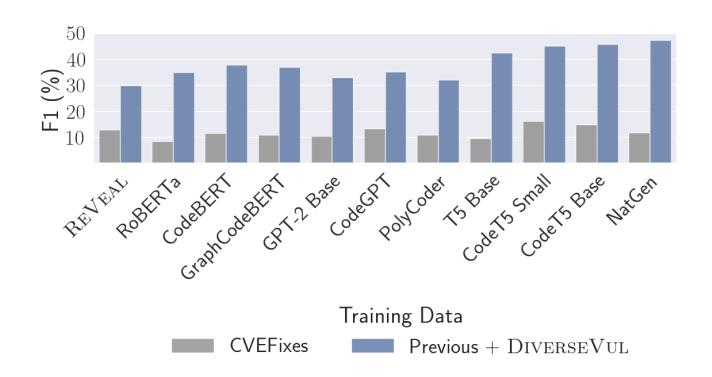
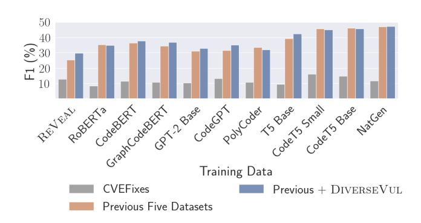
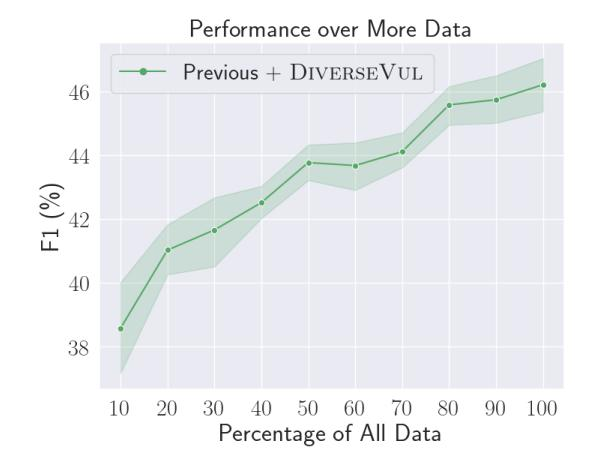
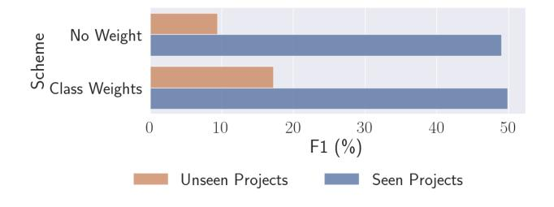

# DiverseVul: A New Vulnerable Source Code Dataset for Deep Learning Based Vulnerability Detection

Yizheng Chen University of Maryland yzchen@umd.edu

Zhoujie Ding UC Berkeley zhoujie.ding@berkeley.edu

Xinyun Chen Google Deepmind xinyunchen@google.com

Lamya Alowain King Abdulaziz City for Science and Technology lalowain@kacst.edu.sa

David Wagner UC Berkeley daw@cs.berkeley.edu

#### ABSTRACT

新たな脆弱なソースコードデータセットを提案し、公開する。データセットはセキュリティ問題のウェブサイトをクロールし、該当プロジェクトから脆弱性を修正するコミットおよびソースコードを抽出することでキュレートしている。本データセットには、150のCWEにまたがる18,945の脆弱な関数と、7,514件のコミットから抽出した330,492の非脆弱な関数が含まれている。本データセットは、これまでの全データセットを合わせたものよりも295多いプロジェクトをカバーしている。

新しいデータセットとこれまでのデータセットを組み合わせ、深層学習を用いたソフトウェア脆弱性検出における課題と有望な研究方向の分析を提示する。我々は4つのファミリーに属する11のモデルアーキテクチャを調査した。その結果、深層学習は依然として脆弱性検出には十分に対応できていないことがわかった。主な理由としては、高い偽陽性率、低いF1スコア、難易度の高いCWEの検出困難性が挙げられる。特に、深層学習ベースのモデルを実運用する際の一般化に関する重要な課題を示す。我々は、訓練データ量を増やすことが脆弱性検出における深層学習モデルの性能をさらに向上させるとは限らないが、未観測プロジェクトへの一般化能力の向上には有効である可能性を示した。

将来的な有望な研究方向性についても特定している。大規模言語モデル（LLMs）は、機械学習ベースの脆弱性検出において有望な研究方向であり、本研究の実験ではコード構造特徴を持つグラフニューラルネットワーク（GNNs）を上回る性能を示した。さらに、ソースコード特有の事前学習目的を開発することも、脆弱性検出性能を向上させるための有望な研究方向である。

### KEYWORDS

データセット、脆弱性検出、ディープラーニング、大規模言語モデル

#### ACM Reference Format:

Yizheng Chen、Zhoujie Ding、Lamya Alowain、Xinyun Chen、およびDavid Wagner。2023。DiverseVul: ディープラーニングベースの脆弱性検出のための新しい脆弱なソースコードデータセットである。In The 26th International

この作品は、[Creative Commons Attribution International](https://creativecommons.org/licenses/by/4.0/) [4.0 ライセンス](https://creativecommons.org/licenses/by/4.0/)の下でライセンスされている。

RAID '23, October 16–18, 2023, Hong Kong, China © 2023 Copyright held by the owner/author(s). ACM ISBN 979-8-4007-0765-0/23/10. <https://doi.org/10.1145/3607199.3607242>

Symposium on Research in Attacks, Intrusions and Defenses (RAID '23)、2023年10月16日～18日、香港、中国。ACM、ニューヨーク、ニューヨーク州、アメリカ、[15](#page-14-0)ページ。<https://doi.org/10.1145/3607199.3607242>

## 1 INTRODUCTION

ソフトウェアの脆弱性を検出することは、サイバー犯罪や経済的損失を防ぐために重要であるが、現時点でもこれは困難な問題である。従来の静的および動的な脆弱性検出手法には限界がある。画像や自然言語の応用における深層学習の著しい成功を鑑みれば、深層学習が脆弱性検出能力を向上させるかどうかを考えるのは自然である[\[4,](#page-13-0) [15,](#page-13-1) [18,](#page-13-2) [25,](#page-13-3) [33\]](#page-13-4)。しかし、本論文で示すように、深層学習が脆弱なソースコード検出において高い性能を発揮するためには、まだ多くの課題を克服する必要がある。

ディープラーニングを成功させるためには、脆弱なソースコードの大規模なデータセットが必要である。今回、C/C++向けの新しいオープンな脆弱性データセットであるDiverseVulを公開する。データセットをキュレートするために、セキュリティ問題のウェブサイトをクロールし、脆弱性レポートを収集し、各脆弱性に対応する脆弱性修正コミットを抽出し、対応するプロジェクトをクローンし、そこから脆弱・非脆弱なソースコードを抽出した。本データセットには、7,514件のコミットから抽出した18,945件の脆弱な関数と330,492件の非脆弱な関数が含まれており、150種類のCWEをカバーしている。これは、以前最大かつ最も多様とされたデータセットCVEFixes [\[2\]](#page-12-0)のC/C++データの2倍以上の規模となる。本データセットはより多様であり、これまでに公開された全てのデータセットを合わせたものよりも約50％多くのプロジェクトをカバーしている。DiverseVulデータセットは、コミュニティ向けに[https:](https://github.com/wagner-group/diversevul) [//github.com/wagner-group/diversevul.](https://github.com/wagner-group/diversevul)で公開している。

新しいデータセットによって、最先端のディープラーニング手法を研究し、有望な研究方向および機械学習ベースの脆弱性検出における課題について新たな洞察を得ることができた。特に、いくつかの問いについて検討している。より多くの訓練データは有効なのか、それともモデルはすでに飽和しているのか。モデルアーキテクチャは大きな違いをもたらすのか。コード構造特徴を利用する最先端モデルを使うほうが良いのか、それとも大規模言語モデルを使うほうが良いのか。大きなLLMは小さなLLMよりも優れているのか。脆弱性検出のためのディープラーニングをさらに改善するための最も有望な方向性は何か。

モデルアーキテクチャの効果を調査するために、4つの代表的なモデルファミリーから11種類の異なるディープラーニングアーキテクチャを用いて実験を行った。Graph Neural Networks (GNN) [\[13\]](#page-13-5)、RoBERTa [\[10,](#page-13-6) [11,](#page-13-7) [16\]](#page-13-8)、GPT-2 [\[17,](#page-13-9) [23,](#page-13-10) [30\]](#page-13-11)、およびT5 [\[3,](#page-12-1) [24,](#page-13-12) [29\]](#page-13-13)である。ディープラーニングに関する多くの研究

RAID '23、2023年10月16日〜18日、香港、中国

図1：本研究のいくつかの結果の概要である。CVEFixesデータセットのみで訓練した場合、ReVealは大規模言語モデルと同等の性能を示す。十分なデータ（Previous + DiverseVul）があれば、大規模言語モデル（例：Nat-Gen）は従来世代のモデル（例：Re-Veal、コード構造特徴を持つGNNモデル）よりも優れているが、これらの利点を得るには大規模なデータセットが必要である。大規模言語モデルは、従来世代のモデルよりも大規模なデータセットをより有効に活用できる（青色バーとグレーバーの比較）。このタスクに最適な大規模言語モデルであるCodeT5およびNatGenは、コード固有のタスクで事前学習されている。

脆弱性検出のために、コード構造特徴を用いたGNNが使用されてきた[\[4,](#page-13-0) [18,](#page-13-2) [33\]](#page-13-4)。また、Large Language Models（LLMs）が自然言語処理やコード理解の分野で最先端の成果を上げていることから、コード構造特徴を用いないにもかかわらず、これらを脆弱性検出へ応用することも検討する。本研究では、以下の三つのデータセットにおけるこれらモデルの性能を評価する：（1）CVEFixes[\[2\]](#page-12-0)―これはC/C++脆弱性のこれまでで最大の公開データセットである; （2）これまで公開されてきた全データセット（Devign[\[33\]](#page-13-4), ReVeal[\[4\]](#page-13-0), BigVul[\[9\]](#page-13-14), CrossVul[\[19\]](#page-13-15), CVEFixes[\[2\]](#page-12-0)）の組み合わせ（重複除去済み）; （3）これら既存データセットと新たに作成したDiverseVulを組み合わせたもの（詳細はTable [3\)](#page-6-0)に記載）。

我々の実験によれば、以前のデータセットCVEFixes [\[2\]](#page-12-0) で評価した場合、モデルアーキテクチャの影響は小さく、LLMはGNNとほぼ同等の性能を示す。特に、CVEFixesというこれまでに公開された最大のデータセットにおいて、ReVealモデル（GNN）はF1スコア12.8を達成し、LLMのF1スコアは8.5～16.3であった（図 [1\)](#page-1-0) 参照）。この結果から、アーキテクチャの違いがほとんど影響しないと結論したくなるかもしれない。しかし、より大きなデータセットで評価すると、この結論は逆転することが分かる。すなわち、LLMはGNNよりも著しく高い性能を示し得る。具体的には、これまでに公開された全てのデータセットとDiverseVulを組み合わせた場合、最高のLLMはF1スコア47.2を達成し、ReVealは29.8であった。

これらの実験は、脆弱性検出におけるディープラーニング手法を信頼性高く評価するには、大規模なデータセットが必要であることを示している。利用可能なトレーニングデータ量が増加するにつれて、異なるアーキテクチャ間の相対的な性能が大きく変動するからである。トレーニングデータ量を5倍に増やした場合（CVEFixesから全データセットまで）、最良モデルのF1スコアは10.5から48.9へと向上した。これらの結果は、LLMがGNNよりも大規模データセットを有効活用できることを示唆している。大規模データセットはReVealの性能をわずかにしか向上させないが、LLMの性能は大きく向上する。しかし、さらなるデータ収集による性能向上は頭打ちになっている可能性が実験から示唆される。先行データセット群に自らのデータセットを追加することで、11モデル中7モデルのテスト性能を向上させることができた。しかし、最も性能の高い3モデルについては、性能の向上は見られないか、向上しても小さい（詳細はSection [4.2\)](#page-5-0)を参照）。

残念ながら、最先端のディープラーニング技術は、脆弱性検出にはまだ対応できていない。最も優れたモデルであっても、F1スコアは47.2%、真陽性率は43.3%、偽陽性率は3.5%である。偽陽性率は、実用的な観点から見て依然として高すぎる。1つのプロジェクトが数万の関数を含む場合、この偽陽性率は数百件の偽陽性に相当し、これはほとんどの分析者が現実的に対応するには多すぎる量である[\[1\]](#page-12-2)。

課題にもかかわらず、Figure [1](#page-1-0)は、大規模言語モデル（LLM）が深層学習に基づく脆弱性検出において優れている可能性があることを示唆している。先行研究では、GNNとコード構造特徴量の組み合わせが脆弱性検出に有望であると考えられてきた[\[4,](#page-13-0) [18,](#page-13-2) [33\]](#page-13-4)。これは、ドメイン知識と深層学習を組み合わせているためである。対照的に、本研究の結果は、大規模言語モデル（RoBERTa、GPT-2、T5ファミリー）が、特に多くのデータで学習した場合、最先端のGNNを大きく上回ることを示している。特に、CodeT5モデル（CodeT5 Small、CodeT5 Base、NatGen）が最良である。

モデルの性能を左右する最も重要な要素はモデルサイズであるという一般的な考えに反し、本研究の結果によれば、最も重要な要素はLLMの訓練方法である可能性が高い。コード理解タスクによる事前学習は大きな改善効果をもたらすようである。たとえば、CodeT5 Smallは変数名や関数名を予測するために事前学習されており、コードに対して事前学習されていないが2倍のサイズを持つモデルよりも平均で8ポイント高いF1スコアを達成できる。意外なことに、自然言語に有効な事前学習タスクは脆弱性検知にはあまり効果がないことがわかった。むしろ、コード専用の事前学習タスクが必要であると考えられる。深層学習に基づく脆弱性検知を向上させるため、より優れたコード専用の事前学習タスクを開発することが有望な研究方向であると考える。

さらに、深層学習ベースのモデルを展開する際に重要な一般化の課題を特定した。モデルを展開するためには、学習データセットに含まれていない新しいソフトウェアプロジェクトから脆弱性を検出する必要がある。この状況では深層学習モデルの性能が非常に低下することが判明した。特に、過去の研究では、脆弱性単位でランダムにデータを訓練セットとテストセットに分割しており、各脆弱性がどのプロジェクトに現れるかを考慮していなかった。しかし実際には、新しいプロジェクトで脆弱性検出ツールを運用したい場合が多く、そのプロジェクトの脆弱性は学習セットに含まれないことになる。この状況における深層学習の性能を評価するために、「未確認プロジェクト」と呼ぶプロジェクト群を分離し、他のプロジェクト（「既知プロジェクト」）の脆弱性で学習し、未確認プロジェクトの脆弱性でテストを行った。すべてのモデルにおいて未確認プロジェクトでの性能は大きく低下し、例えば既知プロジェクトでのF1スコアが49%であったのに対し、未確認プロジェクトではわずか9.4%にまで低下した。その原因は明らかではないが、モデルが学習セットに現れる特定プロジェクト固有のパターンやコーディングイディオムに過剰適合している可能性がある。この一般化の失敗は、深層学習による脆弱性検出の展開にとって重要な障壁となることが予想される。

実際の検出において。本課題に対処する方法を今後の研究で探求していくことを期待する。本稿では、トレーニング損失にクラス重みを用いるという単純な介入策を提案しており、これはこの方向への小さな一歩ではあるが、依然として大きなギャップが残っており、さらなる研究が必要である。

最後に、本研究では自作データセットおよび既存データセットにおけるラベルノイズを定量化する。このラベルノイズは、機械学習ベースの脆弱性検出研究において重大な課題である。最先端の手法（Devign、ReVeal、BigVul、CrossVul、CVEFixesによって用いられている）に従い、脆弱性修正コミットから脆弱関数を抽出する際には、これらのコミットによって変更された関数に対して脆弱性ラベルを付与している。このラベリング手法のラベル精度を理解するために、データセットから無作為に50件の脆弱関数、並びにNVDからコミットを収集している3つのデータセット（BigVul、CrossVul、CVEFixes）の和集合からさらに50件の脆弱関数をサンプリングした。その後、脆弱性およびラベル付けされた脆弱関数を手動で解析した。その結果、DiverseVulにおける脆弱関数ラベルの正確性は60%であり、これはCVEFixes、BigVul、CrossVulの和集合よりも24%高いが、それでも多数のラベル誤りが含まれていることが判明した。主な課題は、複数の関数にまたがる脆弱性や、脆弱性修正コミットにおける非脆弱関数の変更である。本研究がラベルノイズ問題の理解に向けた第一歩となり、ラベルノイズの影響に関するより深い調査の必要性を明らかにすることを期待する。

本論文において、以下の貢献を行う。

- DiverseVulという新しいC/C++脆弱性ソースコードデータセットを公開する。本データセットは、これまでのC/C++向け最大のデータセットより60%大きく、また、過去のすべてのデータセットと比較して最も多様である。
- 4つの異なるモデルファミリーから11のモデルアーキテクチャを調査する。我々の結果は、大規模言語モデルが最先端のグラフニューラルネットワークよりも深層学習ベースの脆弱性検出において優れていることを示している。また、ソースコード特有の事前学習目的を開発することが有望な研究方向である。
- 脆弱性検出におけるディープラーニングの課題を特定する。特に、学習データセット外の未知のプロジェクトに対して一般化することの困難さを強調する。
- 脆弱性修正コミットに依存した先行データセットおよび本データセットにおけるラベルノイズを評価する。

## 2 RELATED WORK

本節では、これまでに公開されたC/C++の脆弱なソースコードデータセット、それらのラベリング手法、および脆弱性検出のためのディープラーニングに関する関連研究によるそれらの利用方法について分析する。

合成データセット：SATE IV Juliet [\[22\]](#page-13-16) および SARD [\[21\]](#page-13-17) は、以前の論文で一般的に使用された合成データセットである [\[15,](#page-13-1) [18,](#page-13-2) [25\]](#page-13-3)。SARD は Juliet v1.0 テストスイートを拡張したものであり、複数のプログラミング言語に対応したテストケースを含む。テストケースは非常に正確であり、さまざまな CWE を含んでいる。しかし、これらは既知の脆弱なパターンを用いて個別に構築されたものであり、静的および動的解析ツールの評価を目的として設計されている。現実世界のプロジェクトにおける脆弱性の複雑さを完全には捉えていない。VulDeePecker [\[15\]](#page-13-1) データセットは、2種類の CWE のみに焦点を当てている。CVE 情報を National Vulnerability Database (NVD) [\[20\]](#page-13-18) から取得し、19のプロジェクトから脆弱性を選定した。

また、これら2つのCWEからSARD [\[21\]](#page-13-17)のテストケースも組み合わせている。VulDeePeckerとSARDの両方は、半合成データセットである。

静的アナライザーラベル: Draper [\[25\]](#page-13-3) データセットは、Clang、Cppcheck、Flawfinderという三つの静的アナライザーによるアラートを用いてラベル付けを行った。一部のアラートカテゴリは脆弱であるとラベル付けされ、その他はいくつかのカテゴリが非脆弱へとマッピングされた。ラベル付けされたデータセットは関数単位である。ラベルの質は不明であるが、静的アナライザーのラベル精度は低い傾向にある。D2A [\[32\]](#page-13-19) は六つのオープンソースリポジトリに対して静的アナライザー（Infer）の出力に差分分析を用いた。githubリポジトリに対し数千組のバージョンペアを用意し、もし静的アナライザーがgitコミット前のバージョンでアラートを出し、コミット後では出さなければ、D2Aはそのコミットによって脆弱性が修正されたと判断する。それ以外のアラートについては、D2Aは脆弱性に関係しないものとしてラベル付けを行う。

手動ラベリング：Devign [\[33\]](#page-13-4) データセットは三人のセキュリティ研究者によってラベリングされた。最初に彼らは、四つのリポジトリから脆弱性を修正した可能性のあるコミットと脆弱性に関係しないコミットをキーワードで検索した。次に、最初のカテゴリについて、三人のセキュリティ研究者が多数決によってそれらのコミットを手動でレビューし、どの修正がセキュリティ脆弱性を修正しているかを判断した。各コミットにラベルが付与された後、Devignはコミット前の変更された関数をデータサンプルとして抽出し、そのコミットのラベルに従って脆弱または非脆弱としてラベル付けするのである。Devign の著者は二つのリポジトリ、FFMPeg と Qemu のデータを公開した。このデータセットは高品質なラベルを持つが、手作業によるラベリングは非常に高コストであり、約600人時を要した。

セキュリティ問題: いくつかの以前のデータセットは、脆弱性修正コミットを特定するためにセキュリティ問題をクロールして生成された。Re-Veal [\[4\]](#page-13-0) データセットは、Chromiumセキュリティ問題およびDebianセキュリティトラッカーの既知セキュリティ問題のパッチを用いてラベル付けされた。ReVealは、セキュリティパッチ（コミット）前に変更された関数を脆弱であるとみなし、パッチ後は非脆弱、変更されなかった全関数も非脆弱とみなす。これに対し、本研究のデータセットDiverseVulは、脆弱な関数が18K個あり、これはReVeal（表[3\)](#page-6-0)の11倍の規模である。

BigVul [\[9\]](#page-13-14)、CrossVul [\[19\]](#page-13-15)、および CVEfixes [\[2\]](#page-12-0) は、NVD [\[20\]](#page-13-18) 内の Common Vulnerabilities and Exposures (CVE) 記録から脆弱性修正コミットを収集している。特に、CVEfixes は 2022年8月27日までに公開されたすべてのCVEをカバーしている。CVEfixes と CrossVul のデータセットは複数のプログラミング言語に対応しており、本論文ではそれらのC/C++データを使用している。これら3つのデータセットは幅広いプロジェクトおよびCWEを網羅している。これに対し、本研究のデータセットは、より多くのプロジェクトとCWEを含み、脆弱性修正コミットの数も2倍となっている。

いくつかの他の脆弱なC/C++ソースコードデータセットは、脆弱な関数を提供していないため、本研究の実験には含めなかった。例えば、AOSP [\[5\]](#page-13-20) は、Android Open Source Project (AOSP) のセキュリティ・ブリテンからCVE修正コミットを収集しており、これにはAndroid OS、Linuxカーネル、システムオンチップ製造元の脆弱性へのパッチが含まれている。PatchDB [\[28\]](#page-13-21) はパッチ情報、すなわちコードdiffを提供しているが、そのパッチがどのプロジェクトあるいはgitリポジトリから来たのかを特定するのに十分な情報を提供しておらず、そのため、修正された関数の全コードを再構築することができない。

セキュリティ問題は、開発者による手動分析に基づいているため、脆弱性修正コミットの特定に効果的である。また、現実のプロジェクトにおける野生の脆弱性を代表するものである。したがって、本研究ではセキュリティ問題をクローリングすることで新たなデータセットであるDiverse-Vulも収集した。これまでのすべてのデータセットと比較して、DiverseVulは最も多様性が高く、最も多くのプロジェクトを網羅している。特に、DiverseVulには、これまでのいかなる現実世界のデータセットにも収集されていない295の新しいプロジェクトからの脆弱性が含まれている（Table [3\)](#page-6-0)。

脆弱なソースコード検出のためのDL：先行研究では、LSTM [\[15\]](#page-13-1)、CNNおよびRNN [\[25\]](#page-13-3)、双方向RNN [\[14\]](#page-13-22)、ならびにグラフニューラルネットワーク（GNN） [\[4,](#page-13-0) [18,](#page-13-2) [33\]](#page-13-4)を用いて脆弱なソースコードの検出を行ってきた。Thapaら [\[27\]](#page-13-23)の最近の論文は、二つのCWEをカバーするVulDeePecker [\[15\]](#page-13-1)データセット上で、大規模言語モデルがBiLSTMやBiGRUモデルよりも優れていることを示している。しかしながら、彼らはグラフニューラルネットワーク（GNN）との比較は行っていない。GNNはプログラムを、脆弱性検出に有用なドメイン知識を含むグラフとして表現する。ReVeal [\[4\]](#page-13-0)はコードプロパティグラフ [\[31\]](#page-13-24)から得られた特徴を使用し、VulChecker [\[18\]](#page-13-2)は新たな強化プログラム依存グラフを提案している。これらの論文は、ReVealやJulietのような比較的小規模なデータセットを使用していた。もしモデルをより大規模なデータセットで学習させた場合、コード構造特徴を持つGNNが依然として大規模言語モデルと比較して有効なのかは明確でない。

#### 3 DATA COLLECTION

我々の目的は、多様な実世界プロジェクトから高品質な脆弱性修正コミットを収集することである。我々は、セキュリティ問題からデータを収集することに注力する。なぜなら、これらは開発者およびセキュリティアナリストのコミュニティによる高品質なラベルが反映されているからである。まず29のセキュリティ問題関連のウェブサイトを特定し、その中から最も多くgitシステムのコミットがある2つのウェブサイトに絞り込んだ[1](#page-3-0)。これらのウェブサイトから、イシューのタイトル、本文、および関連するgitコミットURLをクロールする。開発者の議論には、脆弱性修正コミットと脆弱性導入コミットの両方が言及される場合があるため、2つのヒューリスティックを用いて脆弱性導入コミットを除外する。まず、「introduced」や「first included」というキーワードを含んだコメントに記載されている全てのコミットURLを除外する。次に、少なくとも10個の関数が変更された全てのコミットを手動で調査し、脆弱性を導入したものを除外する。残りのコミットをデータセットに保持する。

次に、git commitのURLを解析し、プロジェクトとコミットIDを抽出する。プロジェクトをクローンし、これらのプロジェクトからコミットを抽出する。コミット内のC/C++関連のコードファイルを特定する。その後、これらのコミットで変更されたすべての関数およびファイル内で変更されていない関数も抽出する。ReVeal [\[4\]](#page-13-0)と同様に、変更された関数のコミット前のバージョンを「脆弱」であるとラベル付けし、コミット後のバージョンを「非脆弱」とラベル付けする。関連するコードファイル内のすべての未変更関数は「非脆弱」とラベル付けする。先行研究と同様に、関数のMD5ハッシュ値によって関数を重複排除し、重複排除前にコードの正規化は行わない。関数を処理する際、一意なMD5の集合を管理する。脆弱な関数を非脆弱な関数よりも先にすべて処理する。ある関数のMD5がすでにこの集合に存在する場合、その関数はデータに再度含めない。合計で797プロジェクトから7,514件のコミットを収集し、これにより18,945件の脆弱な関数と330,492件の非脆弱な関数が得られ、150種類のCWEをカバーしている。表 [1](#page-3-1) は、DiverseVulで最も件数の多い上位10プロジェクトおよび上位10件のCWEを示す。

| Project     | # Commits | CWE |         | # Commits |
|-------------|-----------|-----|---------|-----------|
| linux       | 1,458     |     | CWE-787 | 2,896     |
| ImageMagick | 330       |     | CWE-125 | 1,869     |
| php-src     | 301       |     | CWE-119 | 1,633     |
| openssl     | 261       |     | CWE-20  | 1,315     |
| tensorflow  | 243       |     | CWE-703 | 1,228     |
| qemu        | 205       |     | CWE-416 | 1,005     |
| linux-2.6   | 179       |     | CWE-476 | 975       |
| vim         | 134       |     | CWE-190 | 783       |
| FFmpeg      | 134       |     | CWE-200 | 747       |
| tcpdump     | 112       |     | CWE-399 | 509       |
| (a)         |           |     |         | (b)       |

表1：DiverseVulにおける上位10件のプロジェクトおよびCWEと、それに対応する脆弱性修正コミット数である。

脆弱性修正コミットである。CWE-703「例外的条件の不適切な確認または処理」は、MITREトップ25 CWEのリストに含まれていない点に注意すること。

CVE番号が言及されているissueタイトルについては、National Vulnerability Database APIをクエリし、issueおよび対応するコミットに対するCWE情報を取得する。開発者によって脆弱性カテゴリが注記されているissueについては、それらをトップ25の人気のあるCWEに手動でマッピングする。我々のデータのおよそ85%は、150のCWEカテゴリにマッピング可能である。階層的なCWEについては、特に取り扱っていない。NVD Databaseからのクエリ結果によっては、1つのCVE番号が複数のCWEにマッピングされる場合がある。

#### 4 EXPERIMENTS

このセクションでは、新しいデータセットが深層学習ベースの脆弱性検出の性能をどのように向上させることができるかを検討する。また、4つのモデルファミリーから11のモデルアーキテクチャを調査する。さらに、これらの実験から得られた知見についても議論する。

## 4.1 Model Architectures

我々は4つのモデルファミリーを調査しており、そのうち3つのファミリーはトランスフォーマーベースの大規模言語モデル（LLM）である。それぞれのLLMファミリーには、異なる目的で事前学習されたさまざまなバリアントが存在する。表 [2](#page-4-0) は、すべてのモデルアーキテクチャのパラメータ数をまとめたものである。

4.1.1 グラフニューラルネットワーク。グラフニューラルネットワーク（GNN）ファミリーの中で、代表的な既存研究であるReVeal [\[4\]](#page-13-0) を再現することを選択した。

関数が与えられた場合、ReVealモデルは関数を表現するグラフを構築し、そのグラフの埋め込みベクトルを計算し、ベクトルを脆弱または非脆弱として分類する。具体的には、関数のグラフ表現はコードプロパティグラフ [\[31\]](#page-13-24)（CPG）である。CPGは抽象構文木（AST）、制御フローグラフ（CFG）、データフローグラフ（DFG）、およびプログラム依存グラフ（PDG）を組み合わせたものである。各ノードは対応するソースコードと型を持ち、各エッジは型を持つ。グラフの埋め込みは、グラフ内のノードの埋め込みの総和である。ノード埋め込みを学習するために、ReVealはGated Graph Neural Networks（GGNN） [\[13\]](#page-13-5) を利用する。

1 snyk.io および bugzilla.redhat.com である。

| Model Family | Model Architecture | パラメータ数 |
|--------------|--------------------|--------------|
| GNN          | REVEAL             | 1.28M        |
| RoBERTa      | RoBERTa            | 125M         |
|              | CodeBERT           | 125M         |
|              | GraphCodeBERT      | 125M         |
| GPT-2        | GPT-2 Base         | 117M         |
|              | CodeGPT            | 124M         |
|              | PolyCoder          | 160M         |
| T5           | T5 Base            | 220M         |
|              | CodeT5 Small       | 60M          |
|              | CodeT5 Base        | 220M         |
|              | NatGen             | 220M         |

表2：異なるモデルのパラメータ数である。

ノードの埋め込みを再帰的に更新するためである。ノードの初期埋め込みは、コードのWord2Vec埋め込みとカテゴリ型ベクトルの連結である。その後、GGNNの訓練手順はメッセージパッシング機構を用いて、グラフ内のノードの隣接関係に基づき各ノードの埋め込みを更新する。最終的に、GGNNの訓練後、ReVealは2つの全結合層を追加し、訓練セットのバランスを調整して最終的な分類器を学習する。ReVealモデルのパラメータ総数は1.28Mである。

4.1.2 RoBERTaファミリー  
RoBERTaファミリーから3つのモデルアーキテクチャを選択した：RoBERTa [\[16\]](#page-13-8)、CodeBERT [\[10\]](#page-13-6)、およびGraph-CodeBERT [\[11\]](#page-13-7)である。これらはいずれもTransformerエンコーダーを12層、768次元の隠れ状態、12個のアテンションヘッド、合計1億2500万のモデルパラメータを持っている。このファミリーの共通事前学習目的はマスク言語モデル化（MLM）である。MLMの事前学習過程では、入力トークン中の一定割合のトークンがランダムにマスクされ、事実上それらが除去される。そして訓練の目標は、欠損しているトークンを予測することにある。

RoBERTa [\[16\]](#page-13-8)はBERT [\[8\]](#page-13-25)の拡張版であり、重要なハイパーパラメータの変更を行っている。これには、次文予測の事前学習目的を削除することや、より大きなミニバッチと学習率をトレーニング中に使用することが含まれる。RoBERTaは、BookCorpus、English Wikipedia、CC-News、OpenWebText、およびStoriesという5つのデータセットの合合集合で事前学習された。

CodeBERT [\[10\]](#page-13-6)は、CodeSearchNet [\[12\]](#page-13-26)データセット（Go、Java、JavaScript、PHP、Python、Rubyの6つのプログラミング言語からなる230万の関数を含む）を用いて事前学習を行う。CodeBERTは、MLM事前学習および置換トークン検出の事前学習を実施する。事前学習中、各入力は自然言語による説明とソースコードのペアであり、テキスト部分はコードの意味を記述している。CodeBERTにおけるMLM事前学習では、自然言語部分とソースコード部分の両方からトークンがマスクされ、また置換トークン検出でも両部分に改変が加えられる。CodeBERTは、下流タスクである自然言語によるコード検索およびコードドキュメント生成においてRoBERTaよりも高い性能を示している。

GraphCodeBERT [\[11\]](#page-13-7) も CodeSearchNet [\[12\]](#page-13-26) の訓練データセットを利用している。入力の自然言語記述およびソースコード部分に加え、GraphCodeBERT の事前学習では、ソースコード内の変数間のデータフローを捉える第三の入力も構築している。MLM 事前学習に加えて、GraphCodeBERT は2つの新たな事前学習目的を提案している。それはエッジ予測とノードアラインメントである。エッジ予測タスクでは、ノード間にエッジが存在する場合に両ノードの埋め込み間のドット積を最大化する。ノードアラインメントタスクでは、変数がコードトークンを表す場合、コードトークンと変数トークンの埋め込み間のドット積を最大化する。ベンチマークデータセット上では、GraphCodeBERT は CodeBERT および RoBERTa をコードクローン検出、コード翻訳、コードリファインメントタスクにおいて上回っている。

CodeBERTおよびGraphCodeBERTの学習データセットには、C/C++で書かれたプログラムが含まれていない点に注意されたい。

4.1.3 GPT-2ファミリー  
GPT-2ファミリーから3つのモデルアーキテクチャを選択した：GPT-2 Base [\[23\]](#page-13-10)、CodeGPT [\[17\]](#page-13-9)、および PolyCoder [\[30\]](#page-13-11)である。これらは12層のTransformerデコーダ、768次元の隠れ埋め込み、12のアテンションヘッドを持つ。モデルのサイズは表[2,](#page-4-0)に示されており、117Mから160Mの範囲である。このファミリーの一般的な事前学習目的は因果言語モデリング、すなわち次トークン予測である。モデルが因果言語モデリングでどれだけよく事前学習されているかはパープレキシティによって測定される。パープレキシティ値が低いほど、より優れたモデルであることを示す。

GPT-2 [\[23\]](#page-13-10)は、未公開のWebTextデータセットで事前学習された。このデータセットは、Reddit上のウェブページリンクをスクレイピングすることで収集されたものである。

CodeGPT [\[17\]](#page-13-9)はGPT-2と同じ学習目的およびアーキテクチャを用いているが、異なる学習データを利用している。著者らは、CodeSearchNet [\[12\]](#page-13-26) からPythonおよびJavaのコードを学習データとして選択し、いくつかのバリエーションの事前学習済みCodeGPTモデルを公開している。本論文では、Javaコードで事前学習されたCodeGPTの適応版を使用している。CodeGPTモデルは、GPT-2の重みを初期値とし、CodeSearchNetのJavaコードを用いて次トークン予測タスクで事前学習されたものである。なお、学習データにはC/C++のプログラムは含まれていないことに留意されたい。

PolyCoder [\[30\]](#page-13-11)はGPT-2と同じモデルアーキテクチャおよび事前学習目的を用いるが、モデル自体はゼロから事前学習されている。著者らはGitHubから収集したデータを用いてモデルを事前学習した。このデータにはソースコードおよびコードファイル内の自然言語コメントが含まれている。合計147,095件のプロジェクトをクローンし、これらは12の人気プログラミング言語における、少なくとも50スターを獲得している最も人気のあるリポジトリである。学習データにはC/C++のリポジトリが24,000件以上含まれている。著者らは未公開リポジトリからコードを収集して評価用データセットを作成している。Cプログラミング言語において、PolyCoderはGPT-Neo、GPT-J、Codexと比較して最も低いパープレキシティ値を達成している。

4.1.4 T5ファミリー。T5ファミリーから4つのモデルアーキテクチャを選択した：T5 Base [\[24\]](#page-13-12)、CodeT5 Base、CodeT5 Small [\[29\]](#page-13-13)、およびNat-Gen [\[3\]](#page-12-1)である。すべてのモデルはエンコーダ－デコーダ型のTransformer層を持つ。CodeT5 Smallは、エンコーダ層が6、デコーダ層が6、隠れ状態の次元数が512、アテンションヘッドが8、パラメータ数が6000万である。他のモデルは、エンコーダ層が12、デコーダ層が12、隠れ状態の次元数が768、アテンションヘッドが12、パラメータ数が2億2000万である。

T5 [\[24\]](#page-13-12)は、マスク付き言語モデリング目的を用いてモデルの事前学習を行う。特に、T5の事前学習手法はトークンのスパンをランダムにマスクするものである。事前学習データセットはC4（Colossal Clean Crawled Corpus）である。著者らはC4データセットを処理することで編纂している。

RAID '23、2023年10月16日～18日、香港、中国 Yizheng Chen、Zhoujie Ding、Lamya Alowain、Xinyun Chen、およびDavid Wagner

Common Crawlデータセットを使用して、数百ギガバイトのクリーンな英語テキストを取得する。

CodeT5 [\[29\]](#page-13-13) は、T5と同じ基盤となるTransformerアーキテクチャを使用している。実験では、CodeT5 Base と CodeT5 small の2つのモデルサイズを検討した。CodeT5 Smallは最小のLLMであり、他のT5ベースモデルの3分の1のモデルサイズであり、RoBERTaやGPT-2ファミリーモデルの約半分のモデルサイズである。CodeT5は、CodeSearchNetデータに加え、GitHubから追加で収集したC/C#プロジェクトにも事前学習されている。マスク付きスパン予測の目的に加えて、CodeT5はトークンが識別子（変数名や関数名）かどうかの知識を活用し、2つの新たな事前学習タスクを設計した。新たな事前学習タスクは「マスクされた識別子予測」（全識別子をマスクする）と「識別子タグ付け」（トークンが識別子かどうかを予測する）である。

NatGen [\[3\]](#page-12-1) は、「naturalizing」事前学習と呼ばれる新しい事前学習目標を提案している。このnaturalizing事前学習は、奇妙な合成コードを受け取り、それを開発者が読みやすいコードに変換するというコード編集プロセスに類似している。著者らは、意味を保ったままのコード変換によって非自然なコードを生成している。これには、デッドコードの追加、whileループを変数初期化なしのforループに変更、変数名の変更、混乱を招くコード要素の挿入などが含まれる。その後、事前学習の目標としてモデルに元の開発者に親しみやすい形へとコードをナチュライズすることが求められる。NatGenモデルはCodeT5 Baseの重みから事前学習を開始し、そこから新しい事前学習目標を用いて学習プロセスを継続する。naturalizing事前学習目標で高い性能を発揮するには、モデルがコードを十分に理解する必要がある。CodeT5と比較して、NatGenはコード翻訳、テキストからコード生成、バグ修正など、様々な下流タスクにおいて性能を向上させている。

#### 4.2 Model Performance with More Data

4.2.1 データセットの設定。ディープラーニングモデルは、多くのデータで訓練された場合に良好な性能を示す。そのため、高品質な脆弱性ラベルを持つ実プロジェクト由来の非合成データセットを組み合わせて利用する。これにはDevign、ReVeal、BigVul、CrossVul、CVEFixesが含まれる。これらをDiverseVulと組み合わせ、重複するサンプルを除去してPrevious + DiverseVulデータセットを作成する。その詳細は表[3.](#page-6-0)に示す。

表[3](#page-6-0)は、過去5つのデータセットおよび本研究のデータセットであるDiverseVul、さらに統合済みデータセットの統計情報を示している。過去の全てのデータセットと比較して、DiverseVulはより多くのプロジェクト、CWE、脆弱な関数、及び脆弱性を修正するコミットを含んでいる。具体的には、DiverseVulには18,945個の脆弱な関数が含まれ、そのうち16,109個はCWE情報を有しており、この数は過去のどのデータセットの2倍以上である。CWE情報に紐づくデータが多いことで、モデル予測結果に対してより包括的な理解を与えることができる。表[3](#page-6-0)の最後の2行は、サンプルの重複を除去した後、統合済みデータセットにおいてDiverseVulが新たに提供したユニークなデータを示している。過去のデータセットと「過去+ DiverseVul」データセットを比較すると、DiverseVulには過去のどのデータセットにも存在しない295個の新しいプロジェクトが含まれていることが分かる。さらに、DiverseVulは10,845個のユニークな新規脆弱関数を提供している。

本実験では、Previous + DiverseVulデータセットからサンプルの80%をランダムに選択して訓練セットとし、10%を検証セット、10%をテストセットとする。また、過去の5つのデータセットのみを含むPreviousの訓練および検証セット、さらにCVEFixesデータのみを含む訓練および検証セットも構築する。これにより、異なるデータ量でモデルを訓練し、より多くのデータを追加することがモデルの性能向上にどれほど寄与するかを、Previous + DiverseVulの同一テストセットを用いて評価できる。

4.2.2 結果。表[2,](#page-4-0)の各モデルアーキテクチャについて、CVEFixes、Previous、Previous + Diverse-Vulの3つのトレーニングデータセットを使用して3つのモデルを訓練した。ReVealモデルはゼロから訓練し、大規模言語モデル（LLM）は事前学習済みモデルの重みから脆弱性検出タスク用にファインチューニングした。これにより合計33のモデルが得られる。本実験における詳細なトレーニング設定は、付録[A.](#page-13-27)に記載している。

表[4](#page-7-0)は、Previous + DiverseVulからの同一テストセットに対するモデルの性能を示している。以下に結果を要約する。

結果1：すべての利用可能なデータで学習した場合、大規模言語モデルは最先端のGNNベースReVealモデルを大きく上回る性能を示す。すべての利用可能なデータ（Previous + DiverseVul）で学習した場合、LLMはReVealモデルよりも著しく高い性能を発揮する：ReVealモデルのF1スコアは29.76であるのに対し、LLMは31.96から47.15のF1スコアを達成する。最大のLLMは、この大規模な訓練セットでReVealよりも著しく優れている。ReVealとLLMの比較は必ずしも公正とは言えない。なぜなら、ReVealはLLMよりも1～2桁パラメータ数が少ないからである。より大きなGNNがLLMと競合可能か否かは不明である。残念ながら、最も高性能なモデルであるNatGenですら、脆弱性検出の実運用にはまだ適していない。偽陽性率は3.47％、F1スコアは47.15％であり、この偽陽性率は依然として高すぎて実用的ではなく、F1スコアも低い。それにもかかわらず、大規模言語モデルは深層学習ベースの脆弱性検出において有望であると考える。

興味深いことに、LLMsはReVealを上回るために大量のトレーニングデータを必要とする。CVEFixesデータのみでトレーニングした場合、はるかに小規模なトレーニングセットとなり、LLMsがGNNベースのReVealモデルに対して明確な優位性を持つわけではなく、この設定においてはReVealの方が6つのLLMs（10のうち）よりも優れている。

結果2：3つの基本的なLLMモデルの中では、T5 Baseが脆弱性検出においてRoBERTaおよびGPT-2 Baseよりも優れている。RoBERTaはエンコーダのみを使用し、GPT-2はデコーダのみを使用し、T5はエンコーダ・デコーダのTransformer層を使用している。Previous + DiverseVulで訓練した場合、T5 BaseはRoBERTaおよびGPT-2 Baseよりもそれぞれ7.35%および9.3%高いテストF1スコアを示した。したがって、エンコーダ・デコーダアーキテクチャはデコーダのみまたはエンコーダのみのアーキテクチャよりも優位性を持つ可能性がある。

結果3：コードの事前学習は、自然言語の事前学習タスクのみを使用した場合、脆弱性予測において有意な改善をもたらさない。コードモデルであるCodeBERT、GraphCodeBERT、CodeGPT、PolyCoderは、対応するテキストモデルであるRoBERTaおよびGPT-2 Baseと比較して有意に優れているわけではない。具体的には、Previousデータセットで訓練した場合、CodeBERTおよびGraphCodeBERTはRoBERTaと同程度の性能を示す。Previous + DiverseVulデータセットで訓練した場合、CodeBERTおよびGraphCodeBERTはRoBERTaと比較してF1スコアが最大2.8%向上する。一方、Previousデータセットで訓練した場合、CodeGPTおよび

| Dataset               | # Projects | # CWEs     | # Functions    | # Vul Func    | # Vul Func with CWE Info | # Commits    |
|-----------------------|------------|------------|----------------|---------------|--------------------------|--------------|
| Devign                | 2∇         | N/A        | 26,037         | 11,888        | N/A                      | N/A          |
| REVEAL                | 2◊         | N/A        | 18,169         | 1,664         | N/A                      | N/A          |
| BigVul                | 348        | 91         | 264,919        | 11,823        | 8,783                    | 3,754        |
| CrossVul*             | 498        | 107        | 134,126        | 6,884         | 6,833                    | 3,009        |
| CVEFixes*             | 564        | 127        | 168,089        | 8,932         | 8,343                    | 3,614        |
| <b>DIVERSEVUL</b>     | <b>797</b> | <b>150</b> | <b>330,492</b> | <b>18,945</b> | <b>16,109</b>            | <b>7,514</b> |
| Previous†             | 638        | 140        | 343,400        | 30,532        | 14,159                   | 17,956       |
| Previous + DIVERSEVUL | <b>933</b> | <b>155</b> | 523,956        | 41,377        | 22,382                   | 21,949       |

†：Devign、ReVeal、BigVul、CrossVul、CVEfixesのサンプルを結合し、重複を除外することで、前述の五つのデータセットを集約している。  
∗：CVEfixesおよびCrossVulは多言語データセットである。本稿ではC/C++コードに関する数値を報告する。

▽: Devignの著者は2つのリポジトリ、すなわちFFMPegとQemuからデータを公開した。
^: ChromiumおよびDebianパッケージである。

表3: 前の5つのデータセット、DiverseVul、統合された前回のデータセット、および前回＋DiverseVulに関する統計である。

図2：CVEFixes、Previous、およびPrevious + DiverseVulで訓練されたモデルの性能を可視化している。DiverseVulをマージしたPreviousデータセットに追加することで、11モデル中7モデルのテスト性能が向上する。CodeT5モデルには効果が見られない。

PolyCoderはGPT-2より最大2.3%高いF1スコアを示すが、Previous + DiverseVulで学習した場合、PolyCoderはGPT-2よりも性能が劣る。われわれの発見は、MLMや次トークン予測技術を用いてコードで事前学習したモデルが、C/C++の脆弱性検出において大きな改善をもたらさないことを示唆している。CodeBERT、GraphCodeBERT、CodeGPTはC/C++で事前学習されていない一方で、PolyCoderは次トークン予測のためにC/C++コードで事前学習されているが、それでもC/C++の脆弱性検出には役立たない。

結果4：C/C++に特化した事前学習タスクは、脆弱性検出性能の向上に大きな違いをもたらす。2つのCodeT5モデルおよびNatGenモデルが最も高いF1スコアを示している。これらはC/C++におけるコード特化の事前学習タスクによって事前学習されている。CodeT5モデルは識別子認識型の事前学習タスク、すなわちマスクされた識別子予測と識別子タグ付けを用いている。NatGenはCodeT5の上に、デッドコードの除去や変数名の変更といった、追加のコード自然化事前学習を行っている。これらの事前学習タスクは、モデルに基本的なコード理解を学習させるものであり、脆弱性検出タスクにおけるファインチューニングモデルの性能を著しく向上させる。なお、GraphCodeBERTもデータフローを持つ変数ペアから大きなドット積値の埋め込みを学習するなどのコード特化の事前学習を行っている。しかし、C/C++データで訓練されていないため、このような事前学習タスクが脆弱性予測に有効かどうかは不明である。

結果5：コード特化型の事前学習タスクはモデルサイズよりも重要である。Table [4](#page-7-0) にある上位3つのモデル（CodeT5 Small、CodeT5 Base、NatGen）のうち、CodeT5 Smallモデルはわずか60Mパラメータしか持たず、RoBERTaモデルやGPT-2モデルの半分、他のT5モデルの3分の1以下のサイズである。しかし、CodeT5 Smallは最大のCodeT5 BaseやNatGenモデルと非常に似た性能を示し、他のすべてのモデルよりも良好な結果を出している。大きなモデルの方が性能が良いという通説に反し、コード特化型の事前学習タスクの方が脆弱性検出においてモデルサイズよりも重要であることが我々の結果から示された。

結果6：より多くのデータセットを収集することによる性能向上は飽和している可能性がある。図 [2](#page-6-1)は、DiverseVul + Previousデータでの学習が、Previousデータと比較して脆弱性検出性能の向上にどれほど寄与するかを可視化している。DiverseVulを訓練データセットに追加することで、Previousデータセットのみで学習した場合と比べて、7つのモデルのF1スコアが平均2.4%向上した。しかし、最も性能の高いCodeT5モデルには効果がなく、NatGenに対してもわずかな効果しかない。CVEFixesのみで学習した場合と比較して、統合Previousデータセットでの学習によりモデル性能が大きく向上することは確認できるが、異なるデータセットを収集しても、それ以上の改善につながらない可能性がある。

#### 4.3 Dataset Volume

4.3.1 データセット設定。脆弱性検出におけるモデル性能に対するデータ量の効果を測定したい。本実験を10回繰り返して行う。各試行では、Previous + DiverseVul をランダムに訓練・検証・テストセットに分割する。その後、訓練および検証セットをサブサンプリングすることで、異なるデータ量の影響をシミュレートする。具体的には、Previous + DiverseVul の訓練および検証データの全体から、ランダムに10%から90%をサンプリングする。その後、モデルを訓練する。

| モデル ファミリー | モデル アーキ | コードで事前学習 | C/C++で事前学習 | コード特化 事前学習タスク | 訓練セット       | Previous + DiverseVULでのテスト（%） |       |        |       |       |
|-----------------|---------------|---------------------|----------------------|--------------------------------|--------------------|-------------------------------|-------|--------|-------|-------|
|                 |               |                     |                      |                                |                    | 正確度                         | 適合率  | 再現率  | F1    | 偽陽性率   |
| GNN             | REVEAL        |                     |                      |                                | CVEFixes           | 82.12                         | 11.56 | 14.37  | 12.81 | 11.06 |
|                 |               |                     |                      |                                | Previous           | 86.30                         | 25.35 | 25.63  | 25.49 | 7.59  |
|                 |               |                     |                      |                                | Prev + DIVERSE VUL | 82.81                         | 23.75 | 39.83  | 29.76 | 12.87 |
|                 | RoBERTa       |                     |                      |                                | CVEFixes           | 91.71                         | 34.24 | 4.85   | 8.50  | 0.80  |
|                 |               |                     |                      |                                | Previous           | 90.98                         | 40.97 | 31.11  | 35.37 | 3.86  |
|                 |               |                     |                      |                                | Prev + DIVERSE VUL | 91.68                         | 46.02 | 28.22  | 34.98 | 2.85  |
| RoBERTa         | CodeBERT      | ✓                   |                      |                                | CVEFixes           | 91.62                         | 35.64 | 6.98   | 11.67 | 1.09  |
|                 |               |                     |                      |                                | Previous           | 91.07                         | 41.83 | 32.20  | 36.39 | 3.86  |
|                 |               |                     |                      |                                | Prev + DiverseVul  | 90.48                         | 39.25 | 36.54  | 37.85 | 4.87  |
|                 | GraphCodeBERT | ✓                   |                      | ✓                              | CVEFixes           | 91.76                         | 38.28 | 6.35   | 10.89 | 0.88  |
|                 |               |                     |                      |                                | Previous           | 91.65                         | 45.71 | 27.61  | 34.43 | 2.83  |
|                 |               |                     |                      |                                | Prev + DiverseVul  | 90.32                         | 38.18 | 35.51  | 36.79 | 4.96  |
|                 | GPT-2 Base    |                     |                      |                                | CVEFixes           | 91.45                         | 31.02 | 6.37   | 10.57 | 1.22  |
|                 |               |                     |                      |                                | Previous           | 91.80                         | 46.62 | 23.46  | 31.21 | 2.32  |
|                 |               |                     |                      |                                | Prev + DiverseVul  | 91.73                         | 46.18 | 25.71  | 33.03 | 2.58  |
| GPT-2           | CodeGPT       | ✓                   |                      |                                | CVEFixes           | 90.77                         | 26.22 | 8.98   | 13.38 | 2.18  |
|                 |               |                     |                      |                                | Previous           | 91.59                         | 44.51 | 24.48  | 31.58 | 2.63  |
|                 |               |                     |                      |                                | Prev + DiverseVul  | 91.36                         | 43.48 | 29.62  | 35.23 | 3.32  |
|                 | PolyCoder     | ✓                   | ✓                    |                                | CVEFixes           | 91.12                         | 26.56 | 6.78   | 10.81 | 1.62  |
|                 |               |                     |                      |                                | Previous           | 91.28                         | 42.44 | 27.66  | 33.49 | 3.23  |
|                 |               |                     |                      |                                | Prev + DiverseVul  | 91.97                         | 48.76 | 23.78  | 31.96 | 2.15  |
|                 | T5 Base       |                     |                      |                                | CVEFixes           | 91.57                         | 32.23 | 5.65   | 9.61  | 1.02  |
|                 |               |                     |                      |                                | Previous           | 92.15                         | 50.80 | 32.15  | 39.38 | 2.68  |
|                 |               |                     |                      |                                | Prev + DiverseVul  | 91.96                         | 49.14 | 37.17  | 42.33 | 3.32  |
| T5              | CodeT5 Small  | ✓                   | ✓                    | ✓                              | CVEFixes           | 90.89                         | 30.03 | 11.18  | 16.29 | 2.24  |
|                 |               |                     |                      |                                | Previous           | 91.98                         | 49.34 | 42.53  | 45.68 | 3.76  |
|                 |               |                     |                      |                                | Prev + DiverseVul  | 91.85                         | 48.41 | 42.22  | 45.10 | 3.88  |
|                 | CodeT5 Base   | ✓                   | ✓                    | ✓                              | CVEFixes           | 91.41                         | 34.76 | 9.39   | 14.79 | 1.52  |
|                 |               |                     |                      |                                | Previous           | 92.16                         | 50.68 | 42.46  | 46.20 | 3.56  |
|                 |               |                     |                      |                                | Prev + DiverseVul  | 92.11                         | 50.36 | 41.81  | 45.69 | 3.55  |
|                 | NatGen        | ✓                   | ✓                    | ✓                              | CVEFixes           | 91.64                         | 36.17 | 7.07   | 11.83 | 1.08  |
|                 |               |                     |                      |                                | Previous           | 92.30                         | 51.81 | 42.92  | 46.94 | 3.44  |
|                 |               |                     |                      |                                | Prev + DiverseVul  | 92.30                         | 51.81 | 43.25  | 47.15 | 3.47  |

Table 4: 同じテストセットでPrevious + DiverseVulのデータを用いてモデルの評価を行った。CVEFixesデータセットのみで学習した場合、異なるアーキテクチャ間でのモデル性能には大きな差は見られない。しかし、より大規模なデータセットで学習した場合、大規模言語モデルはGNNベースのReVealモデルを大きく上回る結果となった。その中でも、CodeT5 Small、CodeT5 Base、NatGenモデルが最も高いF1スコアを記録した。最高のF1スコアを示す行は太字で強調している。C/C++に特化した事前学習タスクによるモデルの事前学習は非常に効果的である。

モデルを作成し、サブサンプリングを行わずに同じ元のテストセットで評価する。

対応するデータセット設定からモデルをファインチューニングした場合のテストF1スコアの信頼区間である。

4.3.2 結果。100個のCodeT5 Smallモデルを、10回の実験から得られた異なるデータセット設定でファインチューニングした。それぞれの実験において、Previous + DiverseVulの最終テストセットでモデルを評価し、トレーニングおよびバリデーションデータの異なる割合を用いて10個のモデルを学習した。図[3](#page-9-0)は、その平均値と95%を示す。

結果7: 同じ分布からのトレーニングデータセットの量を増やすことは、脆弱性検出に役立つ。我々の結果は、同じ分布からのより大きなデータセットでトレーニングすることでテストパフォーマンスが向上することを示している。図[3](#page-9-0)は、トレーニングデータの量が増加するにつれてテストF1スコアが向上する傾向を示している。もし事前にテストデータの分布が分かっていれば

RAID '23、2023年10月16日〜18日、香港、中国

| Model Family | Model Arch    | Pretrain on Code | Pretrain on C/C++ | Code-specific Pretrain task | Training Set      | Test on Unseen Projects (%) Acc | Test on Unseen Projects (%) Prec | Test on Unseen Projects (%) Recall | Test on Unseen Projects (%) F1 | Test on Unseen Projects (%) FPR |
|--------------|---------------|------------------|-------------------|-----------------------------|-------------------|---------------------------------|----------------------------------|------------------------------------|--------------------------------|---------------------------------|
| GNN          | REVEAL        |                  |                   |                             | Previous          | 82.88                           | 5.06                             | 20.92                              | 8.15                           | 14.78                           |
| GNN          | REVEAL        |                  |                   |                             | Prev + DiverseVUL | 85.88                           | 5.67                             | 18.46                              | 8.67                           | 11.58                           |
| ROBERTa      | ROBERTa       |                  |                   |                             | Previous          | 94.69                           | 6.20                             | 3.23                               | 4.25                           | 1.85                            |
| ROBERTa      | ROBERTa       |                  |                   |                             | Prev + DiverseVUL | 95.59                           | 10.46                            | 2.78                               | 4.40                           | 0.90                            |
| ROBERTa      | CodeBERT      | ☑                |                   |                             | Previous          | 94.94                           | 9.53                             | 4.57                               | 6.17                           | 1.64                            |
| ROBERTa      | CodeBERT      | ☑                |                   |                             | Prev + DiverseVUL | 94.19                           | 13.34                            | 10.80                              | 11.94                          | 2.65                            |
| ROBERTa      | GraphCodeBERT | ☑                |                   | ☑                           | Previous          | 95.32                           | 4.64                             | 1.45                               | 2.21                           | 1.12                            |
| ROBERTa      | GraphCodeBERT | ☑                |                   | ☑                           | Prev + DiverseVUL | 94.74                           | 12.48                            | 7.35                               | 9.25                           | 1.95                            |
| GPT-2        | GPT-2 Base    |                  |                   |                             | Previous          | 94.92                           | 6.19                             | 2.78                               | 3.84                           | 1.60                            |
| GPT-2        | GPT-2 Base    |                  |                   |                             | Prev + DiverseVUL | 95.06                           | 9.82                             | 4.34                               | 6.02                           | 1.51                            |
| GPT-2        | CodeGPT       | ☑                |                   |                             | Previous          | 94.32                           | 5.98                             | 3.79                               | 4.64                           | 2.25                            |
| GPT-2        | CodeGPT       | ☑                |                   |                             | Prev + DiverseVUL | 94.47                           | 9.86                             | 6.35                               | 7.72                           | 2.19                            |
| GPT-2        | PolyCoder     | ☑                | ☑                 |                             | Previous          | 95.41                           | 8.54                             | 2.67                               | 4.07                           | 1.08                            |
| GPT-2        | PolyCoder     | ☑                | ☑                 |                             | Prev + DiverseVUL | 92.73                           | 10.25                            | 12.81                              | 11.39                          | 4.24                            |
| T5           | T5 Base       |                  |                   |                             | Previous          | 95.67                           | 20.21                            | 6.35                               | 9.66                           | 0.95                            |
| T5           | T5 Base       |                  |                   |                             | Prev + DiverseVUL | 96.16                           | 34.00                            | 5.68                               | 9.73                           | 0.42                            |
| T5           | CodeT5 Small  | ☑                | ☑                 | ☑                           | Previous          | 95.02                           | 12.21                            | 5.90                               | 7.96                           | 1.60                            |
| T5           | CodeT5 Small  | ☑                | ☑                 | ☑                           | Prev + DiverseVUL | 94.91                           | 13.35                            | 7.24                               | 9.39                           | 1.78                            |
| T5           | CodeT5 Base   | ☑                | ☑                 | ☑                           | Previous          | 96.21                           | 32.32                            | 3.56                               | 6.42                           | 0.28                            |
| T5           | CodeT5 Base   | ☑                | ☑                 | ☑                           | Prev + DiverseVUL | 95.56                           | 18.03                            | 6.12                               | 9.14                           | 1.05                            |
| T5           | NatGen        | ☑                | ☑                 | ☑                           | Previous          | 95.48                           | 17.86                            | 6.68                               | 9.72                           | 1.16                            |
| T5           | NatGen        | ☑                | ☑                 | ☑                           | Prev + DiverseVUL | 95.49                           | 17.38                            | 6.35                               | 9.30                           | 1.14                            |

Table 5: 我々はテスト用にランダムに95個のプロジェクトを未観測プロジェクトとして選択した。残りのプロジェクトは学習用として使用する。各モデルを観測済みプロジェクトで訓練し、未観測プロジェクトでテストする。F1スコアが最も高い行を太字で強調している。全体的に見ると、F1スコアはこれらのモデルが未観測プロジェクトに対して一般化性能が低いことを示している。Previousの学習セットにDiverseVulを追加することで、NatGenを除くすべてのモデルで一般化性能の向上が見られる。

デプロイ時において、その分布からさらに多くの訓練データを収集することは、脆弱性検出の性能をさらに向上させる可能性がある。

## 4.4 Generalization

4.4.1 データセットの設定。現実世界での展開シナリオにおいて、脆弱性検出モデルは、これまで学習していない新しい開発者プロジェクト内の脆弱なソースコードを予測する必要がある。そのため、モデルの未知プロジェクトに対する性能をテストしたいと考える。

マージされたPreviousデータセットからランダムに95個のユニークなプロジェクトを選択し、すべてのモデルを本実験で評価するための未観測プロジェクトのテストセットとする。その後、残りのプロジェクトは訓練セットおよび検証セットにおいて観測済みプロジェクトとして扱う。PreviousおよびPrevious + DiverseVulデータセットの両方について、観測済みプロジェクトのうち90%をランダムにサンプリングして訓練セットとし、残りの10%を検証セットとする。Previous + DiverseVulの訓練セットおよび検証セットは、Previousのそれらの上位集合である。

4.4.2 結果。我々はReVealをトレーニングし、各LLMをPreviousおよびPrevious + DiverseVulの既知プロジェクトのトレーニングセットでファインチューニングした。その結果、合計22モデルとなる。これらのモデルが十分にトレーニングされていることを確認しており、検証時の性能はトレーニング時の性能と同等である。表[5](#page-8-0)は、これらのモデルが未知プロジェクトで示したテスト性能を示している。

未知プロジェクトに対する全モデルのF1スコアは非常に低い。最良のモデルは、CodeBERT、PolyCoder、CodeT5 Small、Previous + DiverseVulで訓練されたCodeT5 Base、そしてPreviousで見たプロジェクトで訓練されたNatGenモデルである。Previousの訓練セットにDiverseVulを追加することは、NatGenを除く全モデルの汎化性能向上に寄与している。最近の同時期の研究[\[26\]](#page-13-28)でも、未知プロジェクトでのテスト時に大幅な性能低下が観測されている。我々の実験では、[\[26\]](#page-13-28)よりも数百件多くのプロジェクトを訓練セットに含めているが、それでもなお低い汎化性能が確認されている。

Result 8: 脆弱性検出タスクにおいて、ディープラーニングモデルが未知のテストプロジェクトに対して一般化することは大きな課題である。AI for Codeの一般的なユースケースとしては、GitHub CoPilotが挙げられる。これは、開発者がコードを書いている際にAIモデルがコードの完成方法を提案するというものである。ディープラーニング検出のためのAIがコーディングアシスタントでもある場合、潜在的な提案を行う必要がある。

RAID '23, 2023年10月16日～18日、香港、中国 Yizheng Chen、Zhoujie Ding、Lamya Alowain、Xinyun Chen、およびDavid Wagner

|              |                                      | 訓練：既知プロジェクト テスト：未知プロジェクト（%）           |       |        |       |      | 訓練：ランダムサンプル テスト：ランダムサンプル（%）        |       |        |       |       |
|--------------|--------------------------------------|----------------------------------------------------|-------|--------|-------|------|----------------------------------------------------|-------|--------|-------|-------|
| Model Arch   | Scheme                               | 正解率                                              | 適合率   | 再現率 | F1値  | 偽陽性率 | 正解率                                              | 適合率   | 再現率 | F1値  | 偽陽性率 |
| CodeBERT     | 重み付けなし                         | 94.19                                               | 13.34 | 10.8   | 11.94 | 2.65 | 90.48                                               | 39.25 | 36.54  | 37.85 | 4.87  |
|              | プロジェクトバランス                 | 95.09                                               | 11.6  | 5.23   | 7.21  | 1.51 | 90.7                                                | 34.43 | 18.97  | 24.46 | 3.11  |
|              | ソフトF1損失に重み付け               | 91.38                                               | 11.41 | 20.16  | 14.57 | 5.92 | 90.72                                               | 34.55 | 18.9   | 24.43 | 3.08  |
|              | クラス重み付け                       | 92.16                                               | 12.21 | 18.6   | 14.74 | 5.06 | 89.39                                               | 36.97 | 47.89  | 41.72 | 7.04  |
| PolyCoder    | 重み付けなし                         | 92.73                                               | 10.25 | 12.81  | 11.39 | 4.24 | 91.97                                               | 48.76 | 23.78  | 31.96 | 2.15  |
|              | プロジェクトバランス                 | 94.37                                               | 8.33  | 5.46   | 6.59  | 2.27 | 90.77                                               | 30.08 | 12.33  | 17.49 | 2.47  |
|              | ソフトF1損失に重み付け               | 93.17                                               | 11.24 | 12.69  | 11.92 | 3.79 | 89.88                                               | 36.07 | 35.72  | 35.9  | 5.46  |
|              | クラス重み付け                       | 89.76                                               | 9.84  | 22.16  | 13.63 | 7.68 | 86.48                                               | 29.19 | 49.36  | 36.68 | 10.32 |
| CodeT5 Small | 重み付けなし                         | 94.91                                               | 13.35 | 7.24   | 9.39  | 1.78 | 91.85                                               | 48.41 | 42.22  | 45.10 | 3.88  |
|              | プロジェクトバランスバッチサンプラー | 95.3                                                | 14.52 | 5.90   | 8.39  | 1.31 | 90.69                                               | 39.36 | 31.96  | 35.27 | 4.24  |
|              | ソフトF1損失に重み付け               | 96.34                                               | 48.18 | 5.90   | 10.52 | 0.24 | 91.31                                               | 44.69 | 39.78  | 42.09 | 4.24  |
|              | 交差エントロピー損失のクラス重み利用 | 93.87                                               | 16.95 | 17.48  | 17.21 | 3.24 | 89.57                                               | 39.80 | 61.33  | 48.28 | 7.99  |

表6: クロスエントロピー損失にクラス重みを使用することで、モデルが既知プロジェクトで学習され未知プロジェクトでテストされる場合の一般化性能が向上する。クラス重みを用いることで、CodeBERTの未知プロジェクトにおけるテストF1スコアは11.94%から14.74%に、PolyCoderは11.39%から13.63%に、CodeT5 Smallは9.39%から17.21%に向上した。さらに、トレーニングおよびテストサンプルが同一の分布から抽出される場合にも、クラス重みを使うことでテストF1スコアが改善される。最も高いF1スコアを記録した行を太字で強調表示している。

図3: 脆弱なソースコード検出のためのディープラーニングは、テストデータと同じ分布から収集されたより多くのデータによって恩恵を受ける。異なる量の脆弱なソースコードデータでCodeT5 Smallモデルをファインチューニングし、テストF1スコアを報告する。各データセット設定を10回ずつ実行する。線は平均を示し、領域は95%信頼区間を示す。この図は、より大きなトレーニングセットが、同じ分布からのテストデータにおける脆弱性検出のF1スコアを向上させることを示している。

開発者が新しいプロジェクト内で記述している脆弱な関数については、深層学習モデルが学習していない場合がある。あるいは、静的解析ツールを用いて異なるプロジェクト内の脆弱性を検出することも可能である。同様のユースケースとして、深層学習に基づく検出モデルは、開発後にこれまで見たことのない新しいプロジェクトを分析する必要がある。これら両方のユースケース

ディープラーニングモデルが新しいプロジェクトに対して強力な汎化性能を持つことが求められており、これはコミュニティが取り組むべき未解決の研究課題である。

#### 4.5 Weighting

このセクションでは、3つの単純な重み付け手法が未知のテストプロジェクトに対するモデルの汎化性能を向上させる可能性があるかどうかを検証する。重み付け手法は以下の通りである。

4.5.1 プロジェクトバランスバッチサンプラー。われわれの考えは、モデルが異なるプロジェクトに対して同等に良好な性能を発揮するようにすることである。そのため、トレーニングセット内のいかなるプロジェクトからも等確率でサンプルを抽出するバッチサンプラーを提案する。プロジェクトが選ばれた場合、そのプロジェクトに属するすべての関数からランダムにサンプリングする。

4.5.2 重み付きSoft F1損失  
最終的な性能指標としてF1スコアを重視するため、異なる損失関数を用いることで汎化性能の向上が図れるか検討したい。本手法では、訓練サンプルの正規化された予測確率（0から1の範囲）を用いて、真陽性、真陰性、偽陽性、偽陰性を浮動小数点数で算出する。次に、これらを用いて陽性ラベル（脆弱な関数）と陰性ラベル（非脆弱な関数）のそれぞれについてF1スコアを計算する。陽性ラベルに対する損失は1－陽性F1スコア、陰性ラベルに対する損失は1－陰性F1スコアである。最後に、データ内の非脆弱関数と脆弱関数の比率に比例して、最初の損失値により高い重みを与える。そして、最終的な訓練損失として、真のクラスラベルに応じた該当する損失値を選択する。

4.5.3 クロスエントロピー損失のクラス重み付け  
この方式では、依然としてクロスエントロピー損失を用いて訓練を行う。損失値を増加させるために重み付けを行う。

図4: 訓練損失関数にクラス重みを用いることで、CodeT5 Smallにおいて未観測プロジェクトに対する汎化性能が向上する。また、既知プロジェクトに対する性能もわずかに向上する。未観測プロジェクトにおけるテストF1スコアは依然としてかなり低い。

正のクラス（脆弱なクラス）は、非脆弱なサンプルと脆弱なサンプルの比率に比例する。我々は負のクラスにも同じ損失値を使用する。

4.5.4 結果。セクション[4.4.](#page-8-1)で述べたプロジェクト分割データセット設定に従う。Previous + DiverseVulデータセットの中から見たことのあるプロジェクトの訓練セットでCodeBERT、PolyCoder、CodeT5 Smallモデルをファインチューニングし、それらを95の未見プロジェクトでテストする。各モデルアーキテクチャごとに、ファインチューニングに四つの手法を用い、四つのモデルを作成する：重みなし、プロジェクトバランス型バッチサンプラー、重み付けソフトF1損失、クロスエントロピー損失に対するクラス重みである。さらに、各アーキテクチャごとに、これらの手法を使い、セクション[4.2.](#page-5-0)で説明されているランダムデータ分割による異なるデータ分割で、追加で四つのモデルをファインチューニングする。

結果9：クロスエントロピー損失にクラスウェイトを用いることで、モデルの未知プロジェクトへの汎化性能が向上するが、さらなる改善の余地は大きい。クラスウェイトは、トレーニングおよびテストサンプルが同一分布から抽出されている場合にもモデルの性能を向上させる。表[6](#page-9-1)は、異なる手法でファインチューニングしたモデルの評価結果を示している。既知／未知プロジェクト実験では、クラスウェイトの使用により、3つすべてのモデルアーキテクチャでF1スコアが向上する。プロジェクトバランスドバッチサンプラーは汎化には寄与しない。重み付きsoft F1損失は、CodeBERTおよびCodeT5 Smallにおいて汎化に効果があるが、既知プロジェクトでの性能は低下する。全体として、クラスウェイトが最良の手法であり、既知・未知プロジェクト双方で性能を向上させる。クラスウェイトを用いて学習したCodeT5 Smallは、未知プロジェクトにおいて最高のテストF1スコア（17.21％）を記録した。

図[4](#page-10-0)は、2つのCodeT5 Smallモデルについて、見たことのあるプロジェクトと見たことのないプロジェクトにおけるF1スコアの差を示している。一方のモデルは重み付けなしでファインチューニングを行い、もう一方は交差エントロピー損失にクラス重みを適用してファインチューニングを行ったものである。棒グラフから、クラス重みを用いることで、見たことのあるプロジェクトと見たことのないプロジェクトにおけるF1スコアの差が縮小し、見たことのあるプロジェクトでF1スコアがわずかに向上し、見たことのないプロジェクトでは大幅な向上が見られることが分かる。これは、クラス重みを用いることで、同一分布から抽出されたサンプルだけでなく、新たなプロジェクトという異なる分布からのサンプルに対してもモデルの性能が向上することを意味している。しかし、依然として見たことのあるプロジェクトで49.9%のF1スコア、見たことのないプロジェクトで17.21%のF1スコアという大きな差が存在する。汎化問題の今後の研究方向として、未知のプロジェクトでのモデル性能をさらに向上させる大きな可能性がある。

#### 4.6 Performance on CWEs

異なるCWEの学習難易度を理解するために、CodeT5 BaseモデルがPrevious + DiverseVulで学習された場合の予測性能を調査する対象として37のCWEを選定する。この37のCWEは、MITREによる上位25件のCWE [\[6\]](#page-13-29)に加え、DiverseVul内で上位25件以外で最も多い12件のCWEを含む。これら37のCWEに該当する脆弱な関数、およびPrevious + DiverseVulのテストセット（セクション[4.2.](#page-5-0)のランダム分割で得られる）中の全ての非脆弱な関数を選定する。

結果10: 一部のCWEは、トレーニングデータのサイズに関係なく他のものよりも学習しやすい。表[7](#page-11-0)は、CodeT5 Baseモデルによる37種類のCWEに対する予測性能を示している。トレーニングセットで最も多く存在した10個のCWEと、True Positive Rate (TPR)が最も高かった10個のCWEを太字で強調している。すべてのCWEでFalse Positive Rate (FPR)が同じであることに注意されたい。これはFPRが脆弱性のない関数のみに関連しているためである。特定のCWEのサンプル数がトレーニングセット内で多いからといって、サンプル数が少ないCWEよりもモデルがそれをうまく学習できるとは限らないことが観察された。さらに、トレーニングサンプルが非常に少ないCWEであってもモデルが十分に検出できるものがある。例えば、CWE-502、CWE-79、CWE-89はいずれもトレーニングデータの2%未満であるが、最も高いTPRを持つ。これは、一部のCWEは学習しやすく、大量のトレーニングデータを必要としない一方で、他のCWEはサンプル数が多くても学習が難しいことを示唆している。例えば、CWE-416はトレーニングサンプルの5.46%を占めていたが、そのTPRはわずか17.86%であった。

いくつかのCWEについては、十分なテストサンプルがなく、その結果、極めて低いTPR値となっている。「Test #」列は、テストセット内でそのCWEに属する脆弱な関数の数を示す。TPRが0%であるCWEのほとんどは、テストセット内のサンプル数が10未満である。

#### 5 LABEL ERROR ANALYSIS

我々のデータセットは可能な限り正確であるよう設計されているが、一部の関数は誤ってラベル付けされている可能性がある。脆弱な関数をラベル付けするために、Devign [\[33\]](#page-13-4)、ReVeal [\[4\]](#page-13-0)、BigVul [\[9\]](#page-13-14)、CrossVul [\[19\]](#page-13-15)、および CVEFixes [\[2\]](#page-12-0) で用いられている手法に従っている。この手法では、セキュリティ問題トラッカーに基づき、脆弱性を修正するコミットによって変更された関数を脆弱であるとみなす。我々のラベリング手法は最先端であり、効果的なスケーラビリティも有しているが、そのようなコミットによって変更されたすべての関数が脆弱であると保証できるわけではないため、一部のラベルは不正確である可能性がある。

このラベリング手法によるラベルノイズの量を定量化するため、DiverseVul、CVEFixes、BigVul、CrossVulデータセットのラベルの正確性を手動で評価する。既存のデータセットの中からCVEFixes、BigVul、CrossVulを選択したのは、これらが脆弱な関数を変更したコミットIDを提供しており、特定のプロジェクトバージョンにおいてその関数が本当に脆弱かどうかを確認できるためである。

Diverse-Vulから脆弱な関数をランダムに50個抽出し、過去3つのデータセット（CVEFixes ∪ BigVul ∪ CrossVul）の合計からも脆弱な関数を50個抽出する。その後、各脆弱な関数が正しいラベルを持っているか、誤ったラベルを持っているかを手動で分析する。この判断は、脆弱とラベリングされた関数のコードを、コミット前後で確認し、修正されたとされるコミット、CVE説明文、開発者などを調査して行う。

RAID '23、2023年10月16日〜18日、香港、中国

| CWE     | Train (%) | Test # | TPR (%) | FPR (%) |                                                                                |
|---------|-----------|--------|---------|---------|--------------------------------------------------------------------------------|
| CWE-119 | 15.16     | 313    | 39.30   | 3.55    | メモリバッファの範囲内での操作に対する不適切な制限である                                  |
| CWE-120 | 2.29      | 49     | 40.82   | 3.55    | 入力サイズの確認なしでのバッファコピー（いわゆるクラシックバッファオーバーフロー）である    |
| CWE-125 | 11.08     | 239    | 27.20   | 3.55    | 範囲外読み取りである                                                             |
| CWE-189 | 2.97      | 57     | 31.58   | 3.55    | 数値エラーである                                                                |
| CWE-190 | 4.77      | 100    | 21.00   | 3.55    | 整数オーバーフローまたはラップアラウンドである                                   |
| CWE-200 | 5.10      | 131    | 31.30   | 3.55    | 権限のないアクターへの機密情報の露出である                                      |
| CWE-20  | 10.76     | 224    | 32.59   | 3.55    | 入力値検証の不備である                                                          |
| CWE-22  | 1.13      | 20     | 25.00   | 3.55    | 限定ディレクトリへのパス名の不適切な制限（パストラバーサル）である                  |
| CWE-264 | 3.55      | 73     | 28.77   | 3.55    | 権限・特権・アクセス制御である                                                  |
| CWE-269 | 1.14      | 23     | 8.70    | 3.55    | 特権管理の不備である                                                            |
| CWE-276 | 0.19      | 3      | 0       | 3.55    | デフォルト権限の誤りである                                                      |
| CWE-284 | 3.35      | 77     | 25.97   | 3.55    | 不適切なアクセス制御である                                                      |
| CWE-287 | 0.58      | 10     | 10.00   | 3.55    | 認証の不備である                                                                |
| CWE-306 | 0.00      | 0      | N/A     | 3.55    | 重要な機能に対する認証の欠如である                                              |
| CWE-310 | 1.95      | 44     | 25.00   | 3.55    | 暗号に関する問題である                                                          |
| CWE-352 | 0.10      | 1      | 0       | 3.55    | クロスサイトリクエストフォージェリ（CSRF）である                                 |
| CWE-362 | 2.62      | 61     | 16.39   | 3.55    | 競合状態である                                                                  |
| CWE-369 | 1.26      | 31     | 29.03   | 3.55    | ゼロ除算である                                                                  |
| CWE-399 | 5.29      | 110    | 41.82   | 3.55    | リソース管理エラーである                                                        |
| CWE-400 | 2.38      | 34     | 5.88    | 3.55    | リソースの制御されていない消費である                                            |
| CWE-401 | 1.83      | 33     | 24.24   | 3.55    | 有効期間終了後のメモリ解放漏れである                                            |
| CWE-415 | 1.55      | 30     | 30.00   | 3.55    | ダブルフリーである                                                              |
| CWE-416 | 5.46      | 112    | 17.86   | 3.55    | 解放済みメモリの使用（Use After Free）である                                    |
| CWE-434 | 0.07      | 1      | 0       | 3.55    | 危険な種類のファイルの無制限アップロードである                                  |
| CWE-476 | 5.00      | 106    | 17.92   | 3.55    | NULLポインタ参照である                                                          |
| CWE-502 | 0.05      | 3      | 66.67   | 3.55    | 信頼されていないデータのデシリアライズである                                    |
| CWE-611 | 0.09      | 3      | 0       | 3.55    | XML外部実体参照の制限の不備である                                               |
| CWE-703 | 6.39      | 133    | 10.53   | 3.55    | 例外状態の不適切な確認または処理である                                          |
| CWE-77  | 0.18      | 6      | 16.67   | 3.55    | コマンドインジェクションである                                                  |
| CWE-78  | 0.38      | 7      | 0       | 3.55    | OSコマンドインジェクションである                                                |
| CWE-787 | 15.57     | 311    | 33.76   | 3.55    | 範囲外書き込みである                                                            |
| CWE-79  | 0.47      | 12     | 50.00   | 3.55    | クロスサイトスクリプティングである                                              |
| CWE-798 | 0.01      | 0      | N/A     | 3.55    | ハードコードされた認証情報の使用である                                          |
| CWE-862 | 0.26      | 6      | 16.67   | 3.55    | 権限付与の欠如である                                                            |
| CWE-89  | 0.31      | 9      | 33.33   | 3.55    | SQLインジェクションである                                                       |
| CWE-918 | 0.02      | 4      | 0       | 3.55    | サーバーサイドリクエストフォージェリ（SSRF）である                              |
| CWE-94  | 0.69      | 15     | 0       | 3.55    | コード生成の制御不備（コードインジェクション）である                             |

Table 7: CodeT5 Baseモデルの予測性能を、DiverseVulにおける上位25のCWEおよび最も人気のある12のCWEに対して評価した。トレーニングサンプルの割合が最も高い10件と、TPR数値が最も高い10件を太字で強調している。特定のCWEに対してトレーニングサンプルが多いことが、必ずしもモデルの予測性能の向上につながるわけではなく、また、いくつかのCWEは他より学習が難しい。TPRが0%となっているCWEの多くは、テストセット内のサンプル数が10未満である。

| Dataset                                | Correct Label | Wrong Label                                       |                      |            |
|----------------------------------------|---------------|---------------------------------------------------|----------------------|------------|
|                                        |               | 脆弱性が複数関数にまたがって拡散                 | 関連のある一貫性     | 無関係     |
| DIVERSEVul                             | 60%           | 10%                                               | 12%                  | 18%        |
| CVEFixes $\cup$ BigVul $\cup$ CrossVul | 36%           | 12%                                               | 12%                  | 40%        |
| CVEFixes                               | 51.7%         | 10.3%                                             | 17.3%                | 20.7%      |
| BigVul                                 | 25%           | 15.6%                                             | 9.4%                 | 50%        |
| CrossVul                               | 47.8%         | 13%                                               | 21.8%                | 17.4%      |

表8：4つのデータセットのラベル精度であり、脆弱な関数のランダムサンプルで評価したものである。

セキュリティ問題トラッカーでの議論である。我々は、脆弱性がその関数内に存在し、かつ複数の関数にまたがっていない場合に、その関数が正しく脆弱であるとラベル付けされていることを確認する。ラベルエラーには三つのカテゴリーがあることを観測した。1) 脆弱性が複数の関数にまたがっている場合、2) 関数自体は脆弱でないが、その関数を変更することが脆弱性修正に関連している場合（例：呼び出しパラメータを調整するため）、3) 関数が脆弱でなく、かつ脆弱性とも無関係な場合（例：脆弱性修正コミットが、非脆弱な関数内のスペースを変更したり、非脆弱な関数に無関係な機能変更を行った場合）である。

表[8](#page-11-1)は我々の分析結果を示している。DiverseVulにおける脆弱関数ラベルの正確性は60%であり、これは従来の三つのデータセット（CVEFixes ∪ BigVul ∪ CrossVul）より24ポイント高い数値である。これら三つのデータセットの中では、CVEFixesが最も正確であり、BigVulのラベルの正確性は非常に低く、わずか25%であった。我々は、BigVulに含まれるChromiumおよびAndroidプロジェクトからの多くのコミットが、実際には脆弱性修正とは無関係であることを確認した。また、無関係な関数の割合が四つのデータセットで17.4%から50%と、驚くほど高いことも判明した。これらの関数は脆弱性とは関係がないが、脆弱性修正コミットによって変更された結果、自動ラベリング処理により脆弱とラベル付けされている。

同時期の研究もラベルノイズを調査し、BigVulおよびDevignデータセットにおいて重大なラベルエラーが存在することを発見している[\[7\]](#page-13-30)。彼らの分類と比較して、本研究では関数を脆弱であるとラベル付けする基準がより厳格である。具体的には、脆弱な関数の呼び出し元については非脆弱とみなすが、彼らは脆弱とみなしている。また、ある関数が脆弱性の一部であるだけで、その関数単体のコードから脆弱性が認識できない場合、本研究では誤ったラベルと判断するが、彼らは正しいとみなしている。こうした分類基準の違いを考慮すると、BigVul（彼らと本研究で共通して用いられている唯一のデータセット）についての本研究の結果は、おおむね彼らの発見と一致している。

#### 6 LIMITATIONS

我々のデータセットおよび先行データセットにおけるラベルノイズは、テストセットに対する全モデルの性能測定に誤差をもたらす可能性がある。我々は、データセットを公開することによって、今後コミュニティがラベルノイズの影響を是正する手法を検討できるようになることを期待している。

振り返ってみると、自分たちのデータセットおよび過去のデータセットにおける重複排除手順は改善の余地があると言える。ラベルノイズ分析の一環として、DiverseVulラベルの4%、および（CVEFixes ∪ BigVul ∪ CrossVul）ラベルの6%が誤りであることを発見した。これは、コミットがいくつかの関数で空白文字のみを変更したにもかかわらず、ラベリングの際にこれがセキュリティ修正として扱われてしまったためである。したがって、重複排除の前にすべての関数内の空白文字を正規化することで、ラベルの精度がわずかに向上し、他にもいくつかの利点が得られる可能性がある。

汚染、すなわちテストデータが事前学習データに漏洩するリスクが存在する。というのも、LLMはテキストやコード上で事前学習されているため、テストセットに含まれるセキュリティ脆弱性に関連するブログ記事やコードパッチが含まれている可能性が考えられるからである。我々の多くのモデル（CodeBERT、GraphCodeBERT、PolyCoder、CodeT5 Small、CodeT5 Base、NatGen）はコードのみに事前学習されており、他のテキストやコードの変更には事前学習されていない。そのため、テストセットのコードに触れる可能性はあるが、どのコードが

脆弱である。これは、我々が測定できない方法で結果に影響を与える可能性がある。他のモデル（RoBERTa、GPT-2 Base、CodeGPT、T5 Base）はテキストで事前学習されているため、脆弱なソースコードを記述したブログ記事に触れた可能性がある。我々はそのような事例が非常に稀であると推測しているが、測定できないため、テストセットの汚染の可能性を完全に否定することはできない。いずれにせよ、後者のモデル（RoBERTa、GPT-2 Base、CodeGPT、T5 Base）は、本実験において比較的低いパフォーマンスを示した。

クローンされたコードがその後わずかに変更されることで（その結果、重複排除の取り組みを回避してしまう）、テストセットの汚染を引き起こすリスクも存在する。

#### 7 CONCLUSION

本論文は、ディープラーニングを用いたソフトウェア脆弱性検出のための新しいデータセットであるDiverseVulを提示する。 このデータセットは155種類のCWEと7,514件のコミットから抽出された18,945個の脆弱な関数および330,492個の脆弱でない関数を含み、従来最大かつ最も多様であったCVEFixesデータセットの2倍の規模と多様性を有している。 本研究ではこの新しいデータセットを活用し、様々なディープラーニングアーキテクチャによる脆弱性検出の有効性を調査した。 4つのモデルファミリー（Graph Neural Networks (GNN), RoBERTa, GPT-2, T5）に属する11の異なるディープラーニングアーキテクチャで実験を行った。 結果として、本論文で検証した学習データの多様性および規模の拡大は、特に大規模言語モデルにおいて脆弱性検出に有用であることが示唆されたが、さらに大規模なデータセットが効果的かどうかは明確ではない。 コード固有の事前学習タスクは、ディープラーニングベースの脆弱性検出における有望な研究方向であることが示される。 本研究の結果は、今後の研究において大きな課題、すなわち未知のプロジェクトへ一般化可能なディープラーニングモデルの改良が必要であることを強調している。 DiverseVulデータセットはコミュニティ向けに[https://github.com/wagner-group/diversevul.](https://github.com/wagner-group/diversevul)に公開している。

#### ACKNOWLEDGMENTS

Bryce Casajeには、コミットの手動ラベリング、自動テキストベースのラベリングなど、データセット構築に関する複数のアプローチを探求した貢献に感謝する。また、Kexin Peiには、大規模言語モデルのファインチューニングに関する助言に感謝する。匿名の査読者には、論文を大きく改善した多くの有益なコメントに感謝の意を表する。本研究は、NSFの助成金CNS-2154873、KACSTとUC Berkeley Center of Excellence for Secure Computingの共同プロジェクト、C3.AIのDigital Transformation Institute、およびCenter for AI Safety Compute Clusterの支援を受けたものである。本資料に記載された意見、発見、結論、または勧告は、著者自身のものであり、スポンサーの見解を必ずしも反映するものではない。

#### REFERENCES

- [1] Al Bessey, Ken Block, Ben Chelf, Andy Chou, Seth Hallem Bryan Fulton, Charles Henri-Gros, Asya Kamsky, Scott McPeak, and Dawson Engler. 2010. 数十億行のコードの後：静的解析を用いて実世界のバグを発見する。Commun. ACM 53, 2 (February 2010).
- [2] Guru Bhandari、Amara Naseer、および Leon Moonen。2021年。CVEfixes: オープンソースソフトウェアから脆弱性とその修正を自動収集するシステムである。In Proceedings of the 17th International Conference on Predictive Models and Data Analytics in Software Engineering. 30–39.
- [3] Saikat Chakraborty, Toufique Ahmed, Yangruibo Ding, Premkumar T Devanbu, and Baishakhi Ray. 2022. NatGen: 「自然化」による生成的事前学習である

ソースコードである。『第30回ACM共同欧州ソフトウェア工学会議およびソフトウェア工学の基礎に関するシンポジウム』論文集、18–30頁。

- [4] Saikat Chakraborty、Rahul Krishna、Yangruibo Ding、およびBaishakhi Ray. 2021. 深層学習に基づく脆弱性検出：到達点はどこか. IEEE Transactions on Software Engineering (2021).
- [5] Alexis Challande、Robin David、およびGuénaël Renault. 2022. 実世界の脆弱性に関するコミットレベルのデータセットを構築する。第十二回ACMデータおよびアプリケーションセキュリティ・プライバシー会議論文集。101–106。
- [6] The MITRE Corporation. 最終アクセス日は2023年3月28日である。2022 CWE トップ25 危険なソフトウェア脆弱性。 [https://cwe.mitre.org/top25/archive/](https://cwe.mitre.org/top25/archive/2022/2022_cwe_top25.html) [2022/2022\\_cwe\\_top25.html](https://cwe.mitre.org/top25/archive/2022/2022_cwe_top25.html)
- [7] Roland Croft, M Ali Babar, and Mehdi Kholoosi. 2023. ソフトウェア脆弱性データセットのデータ品質について述べている。In 2023 IEEE/ACM 45th International Conference on Software Engineering (ICSE).
- [8] Jacob Devlin, Ming-Wei Chang, Kenton Lee, and Kristina Toutanova. 2018. Bert: 言語理解のための双方向深層変換器の事前学習である。arXiv preprint arXiv:1810.04805 (2018).
- [9] Jiahao Fan, Yi Li, Shaohua Wang, and Tien N Nguyen. 2020. コード変更およびCVE要約付きのAC/C++コード脆弱性データセットである。In Proceedings of the 17th International Conference on Mining Software Repositories. 508–512.
- [10] Zhangyin Feng, Daya Guo, Duyu Tang, Nan Duan, Xiaocheng Feng, Ming Gong, Linjun Shou, Bing Qin, Ting Liu, Daxin Jiang, et al. 2020. Codebert: プログラミングと言語のための事前学習モデルである。arXiv preprint arXiv:2002.08155 (2020).
- [11] Daya Guo、Shuo Ren、Shuai Lu、Zhangyin Feng、Duyu Tang、Shujie Liu、Long Zhou、Nan Duan、Alexey Svyatkovskiy、Shengyu Fu ほか. 2020. Graphcodebert: データフローによるコード表現の事前学習である. arXiv preprint arXiv:2009.08366 (2020).
- [12] Hamel Husain、Ho-Hsiang Wu、Tiferet Gazit、Miltiadis Allamanis、Marc Brockschmidt. 2019. Codesearchnet challenge: セマンティックコード検索の現状の評価である。arXiv preprint arXiv:1909.09436 (2019).
- [13] Yujia Li、Daniel Tarlow、Marc Brockschmidt、およびRichard Zemel。2015年。Gated graph sequence neural networks。arXiv preprint arXiv:1511.05493 (2015)。
- [14] Zhen Li, Deqing Zou, Shouhuai Xu, Hai Jin, Yawei Zhu, and Zhaoxuan Chen. 2021. Sysevr: ディープラーニングを用いてソフトウェア脆弱性を検出するためのフレームワークである。IEEE Transactions on Dependable and Secure Computing 19, 4 (2021), 2244–2258.
- [15] Zhen Li, Deqing Zou, Shouhuai Xu, Xinyu Ou, Hai Jin, Sujuan Wang, Zhijun Deng, and Yuyi Zhong. 2018. Vuldeepecker: 脆弱性検出のためのディープラーニングベースのシステムである。arXiv preprint arXiv:1801.01681 (2018).
- [16] Yinhan Liu, Myle Ott, Naman Goyal, Jingfei Du, Mandar Joshi, Danqi Chen, Omer Levy, Mike Lewis, Luke Zettlemoyer, and Veselin Stoyanov. 2019. Roberta: 頑健に最適化されたBERT事前学習手法である。arXiv preprint arXiv:1907.11692 (2019).
- [17] Shuai Lu, Daya Guo, Shuo Ren, Junjie Huang, Alexey Svyatkovskiy, Ambrosio Blanco, Colin Clement, Dawn Drain, Daxin Jiang, Duyu Tang, et al. 2021. Codexglue: コードの理解および生成のための機械学習ベンチマークデータセットである。arXiv preprint arXiv:2102.04664 (2021).
- [18] Yisroel Mirsky、George Macon、Michael Brown、Carter Yagemann、Matthew Pruett、Evan Downing、Sukarno Mertoguno、およびWenke Lee。2023年。VulChecker: グラフベースのソースコード脆弱性位置特定手法である。USENIX Security 2023にて発表。
- [19] Georgios Nikitopoulos, Konstantina Dritsa, Panos Louridas, and Dimitris Mitropoulos. 2021. CrossVul: コミットデータを含むクロス言語脆弱性データセットである。In Proceedings of the 29th ACM Joint Meeting on European Software Engineering Conference and Symposium on the Foundations of Software Engineering. 1565–1569.
- [20] National Institute of Standards and Technology. 2023年3月19日に最終アクセス。National Vulnerability Database.<https://nvd.nist.gov/>
- [21] National Institute of Standards and Technology。2023年3月19日に最終アクセス。NIST Software Assurance Reference Dataset。<https://samate.nist.gov/SARD>
- [22] Vadim Okun, Aurelien Delaitre, Paul E Black, et al. 2013. 静的解析ツール博覧会（SATE）IVに関する報告である。NIST Special Publication 500 (2013), 297.
- [23] Alec Radford、Jeffrey Wu、Rewon Child、David Luan、Dario Amodei、Ilya Sutskeverほか. 2019. 言語モデルは教師なしのマルチタスク学習者である。OpenAI blog 1, 8 (2019), 9.
- [24] Colin Raffel, Noam Shazeer, Adam Roberts, Katherine Lee, Sharan Narang, Michael Matena, Yanqi Zhou, Wei Li, and Peter J Liu. 2020. 統一されたテキスト間変換トランスフォーマによる転移学習の限界を探る。The Journal of Machine Learning Research 21, 1 (2020), 5485–5551.
- [25] Rebecca Russell、Louis Kim、Lei Hamilton、Tomo Lazovich、Jacob Harer、Onur Ozdemir、Paul Ellingwood、および Marc McConley。2018年。ソースコードにおける自動脆弱性検出を深層表現学習を用いて行う手法である。2018年第17回IEEE国際機械学習応用会議（ICMLA）にて発表。IEEE、757–762頁。
- [26] Benjamin Steenhoek、Md Mahbubur Rahman、Richard Jiles、およびWei Le. 2023. 脆弱性検知のためのディープラーニングモデルに関する実証的研究である。In 2023 IEEE/ACM 45th International Conference on Software Engineering (ICSE).
- [27] Chandra Thapa、Seung Ick Jang、Muhammad Ejaz Ahmed、Seyit Camtepe、Josef Pieprzyk、Surya Nepal。2022年。Transformerベースの言語モデルについて

RAID '23、2023年10月16日～18日、香港、中国 Yizheng Chen、Zhoujie Ding、Lamya Alowain、Xinyun Chen、およびDavid Wagner

ソフトウェア脆弱性検出。第38回年次コンピュータセキュリティ応用会議論文集にて。481–496頁。

- [28] Xinda Wang、Shu Wang、Pengbin Feng、Kun Sun、およびSushil Jajodia. 2021. Patchdb: 大規模セキュリティパッチデータセット。In 2021 51st Annual IEEE/IFIP International Conference on Dependable Systems and Networks (DSN)。IEEE、149–160。
- [29] Yue Wang、Weishi Wang、Shafiq Joty、およびSteven CH Hoi. 2021. Codet5: コードの理解と生成のための識別子認識型統一事前学習エンコーダ・デコーダモデルである。arXiv preprint arXiv:2109.00859 (2021).
- [30] Frank F Xu、Uri Alon、Graham Neubig、および Vincent J Hellendoorn. 2022. コードの大規模言語モデルの体系的評価である。arXiv preprint arXiv:2202.13169 (2022).
- [31] Fabian Yamaguchi、Nico Golde、Daniel Arp、およびKonrad Rieck。2014年。コードプロパティグラフによる脆弱性のモデリングと発見について述べている。2014 IEEE Symposium on Security and Privacy にて発表。IEEE、590–604。
- [32] Yunhui Zheng, Saurabh Pujar, Burn Lewis, Luca Buratti, Edward Epstein, Bo Yang, Jim Laredo, Alessandro Morari, and Zhong Su. 2021. D2A: AIベースの脆弱性検出手法のための差分解析を用いて構築されたデータセットである。In 2021 IEEE/ACM 43rd International Conference on Software Engineering: Software Engineering in Practice (ICSE-SEIP). IEEE, 111–120.
- [33] Yaqin Zhou、Shangqing Liu、Jingkai Siow、Xiaoning Du、およびYang Liu. 2019. Devign: グラフニューラルネットワークを用いて包括的なプログラムセマンティクスを学習することで、効果的な脆弱性識別を実現する手法である。Advances in neural information processing systems 32 (2019)。

## A MODEL TRAINING SETUPS

## A.1 ReVeal Setup

われわれは、Code Property Graphsを取得するためにGitHub上のJoern [2](#page-13-31)を使用している。これはReVealが使用していたバージョンより新しいものである。なぜなら、ReVeal論文と同じ古いバージョンのJoernを使った場合、すべてのデータセットにおいてほぼ半数の関数がグラフとして抽出できないためである。

Gated Graph Neural Networkについて、Previous + DiverseVulデータセットの場合は最大エポック数を50、Previousデータセットの場合は最大エポック数を100に設定し、検証F1スコアが最も高いモデルを選択した。これはセクション[4.2.](#page-5-0)の実験における設定である。セクション[4.4.](#page-8-1)の実験においては、最大エポック数を60に設定した。学習にはReVealソースコードの元々の設定に従い、学習率0.0001、重み減衰0.001のAdamオプティマイザを使用した。

ReVealにおける分類層の学習のため、エポック数の最大値を100に設定し、著者の設定に従った。具体的には、検証セットにおけるF1スコアが5エポック連続で増加しない場合、学習手順を停止する。また、ReVealのソースコードにおける元の設定に従い、学習率0.001のAdamオプティマイザを使用し、ウェイト減衰は適用しない。

## A.2 Fine Tuning Setup

LLMモデルをファインチューニングするために、標準的な手法に従い、Transformerモデルの上に線形分類ヘッドを適用する。RoBERTa、CodeBERT、GraphCodeBERTについては、最初のトークン（[CLS]）を表す埋め込みの上に線形層を適用する。GPT-2-Base、CodeGPT、PolyCoderについては、最後のトークンの埋め込みの上に線形層を適用する。T5 Base、CodeT5 Small、CodeT5 Base、NatGenについては、最後のデコーダ状態の埋め込みの上に線形層を適用する。

バッチサイズは32、学習率は2e-5、オプティマイザにはAdamを使用し、10エポックで学習を行う。学習率は線形減衰を採用し、1,000ステップのウォームアップを実施する。1,000ステップごとにモデルのバリデーション性能を確認し、最もバリデーション性能が高かったモデルをテスト用に保存する。全てのモデルおよび全ての学習データ設定において同じ学習率を用いるが、1つだけ例外がある。RoBERTaをPrevious + DiverseVulに対してランダムなデータ分割（Section [4.2\)](#page-5-0)参照）で学習する場合のみ、学習率として1e-5を用いる。なぜなら、より大きな学習率では

22022年10月11日のコミットa6aa08ee9842eedb52e149695e3a34500b6ceab0以降である。

RAID '23、2023年10月16日〜18日、香港、中国

このようなレートの結果、常に関数を脆弱性がないものと予測する退化モデルとなる。
