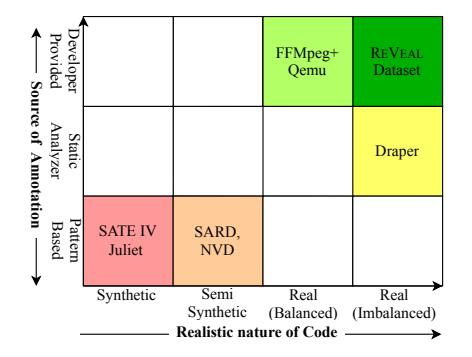
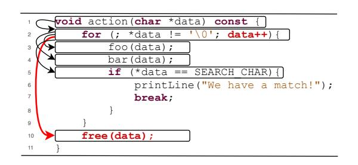
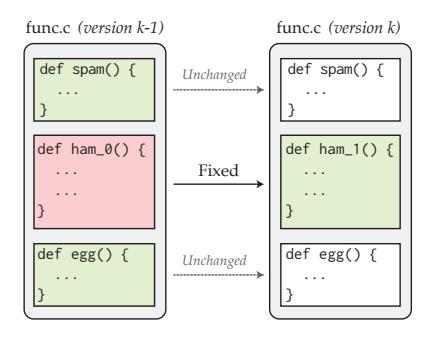
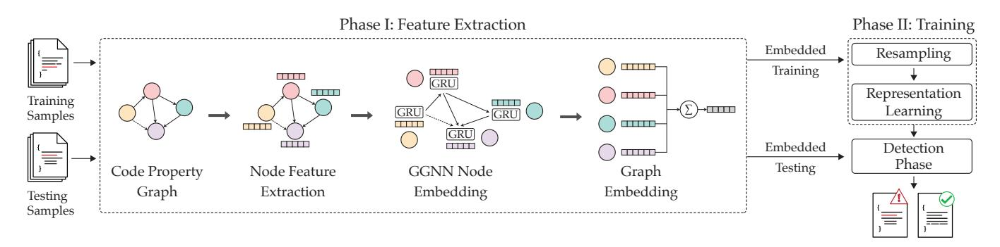
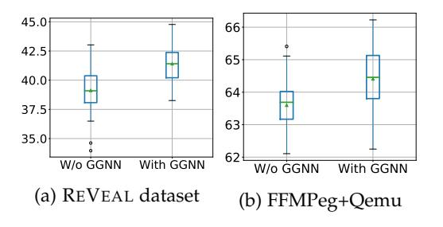

# Deep Learning based Vulnerability Detection: Are We There Yet?

Saikat Chakraborty、Rahul Krishna、Yangruibo Ding、Baishakhi Ray

**要旨**—ソフトウェアの脆弱性を自動検出することは、ソフトウェアセキュリティにおける基本的な問題である。既存のプログラム解析手法は、偽陽性または偽陰性が多いという問題を抱えている。近年、Deep Learning（DL）の進展により、DLを用いた自動脆弱性検出への関心が高まっている。いくつかの最近の研究は、脆弱性検出において最大95%の精度を達成する有望な結果を示している。本論文では、「最先端のDLベースの手法は、現実世界の脆弱性予測シナリオにおいてどれほどの性能を発揮するのか？」という問いを立てる。意外なことに、それらの性能は50%以上低下することが判明した。このような急激な性能低下の原因を体系的に調査した結果、既存のDLベースの脆弱性予測手法は、学習データの課題（たとえば、データの重複、脆弱クラスの非現実的な分布など）やモデル選択の課題（たとえば、単純なトークンベースモデル）に起因していることが明らかとなった。その結果、これらの手法はしばしば脆弱性の本質的な原因に関連する特徴を学習できず、代わりにデータセットから無関係な特徴（たとえば、特定の変数名や関数名など）を学習してしまう。これらの実証的知見を活用し、脆弱性予測の現実的な状況を踏まえた、より原理に基づいたデータ収集およびモデル設計アプローチが、より良い解決策につながることを示す。その結果得られたツールは、研究で取り上げたベースラインに比べて大幅に良好な性能を発揮しており、最大33.57%の精度向上と128.38%の再現率向上を達成している。総じて、本論文は既存のDLベースの脆弱性予測システムが抱える潜在的な問題点を明らかにし、今後のDLベース脆弱性予測研究の道筋を示すものである。その観点から、本研究の成果を支えるすべてのアーティファクトを公開している: [https://git.io/Jf6IA.](https://git.io/Jf6IA)

✦

**Index Terms**—ソフトウェア脆弱性、ディープラーニング、グラフニューラルネットワーク。

# **1 INTRODUCTION**

セキュリティ脆弱性の自動検出は、システムセキュリティにおける基本的な課題である。従来の手法は高い偽陽性率および偽陰性率に悩まされていることが知られている[\[1\]](#page-14-0)–[\[5\]](#page-15-0)。例えば、静的解析に基づくツールは通常、非脆弱なケースを脆弱であると誤検出し、高い偽陽性を生じる。一方、動的解析は多くの実際の脆弱性を検出できず、高い偽陰性に苦しむ。長期間にわたる努力の後も、これらのツールは依然として信頼性が低く、開発者に大きな手作業の負担を残している[\[2\]](#page-15-1)。

近年のDeep Learning（DL）の進展、特にコンピュータービジョンや自然言語処理の分野において、DLを用いてセキュリティ脆弱性を高精度で自動検出する試みに関心が高まっている。Google scholarによれば、2019年から2020年の間にセキュリティやソフトウェア工学の著名な会議で、学習技術を用いて様々な種類のバグを検出することを扱った論文が92本発表されている[1](#page-0-0)。実際、近年のいくつかの研究では、脆弱性検出において非常に有望な成果を挙げており、検出精度は最大で95%にも達していることが示されている[\[6\]](#page-15-2)–[\[12\]](#page-15-3)。

このようにDLモデルが脆弱性検出において著しい成功を報告していることを踏まえると、なぜこれらのモデルがこれほど良好に機能しているのか、どのような特徴をこれらのモデルが学習しているのか、そして何よりも、実世界の脆弱性検出において効果的かつ信頼性をもって利用できるのかについて疑問を抱くのは当然である。このようなDLモデルの説明可能性および一般化可能性を理解することは、コンピュータビジョンなど他の領域における類似の問題解決にも役立つ可能性があるため、重要である[\[13\]](#page-15-4), [\[14\]](#page-15-5)。

例えば、DLモデルの汎化性はデータセット内に内在するバイアスによって制限される。このバイアスは、多くの場合データセットの生成・キュレーション・ラベリングの過程で導入されるものであり、したがってテストデータとトレーニングデータの両方に等しく影響を与える（それらが同じデータセットから抽出されていると仮定した場合）。これらのバイアスのために、DLモデルはそのデータセットに固有のきわめて特異的な特徴を学習し、一般化可能な特徴ではなく、テストデータで高い精度を達成しがちである。例えば、Yudkowskyら[\[15\]](#page-15-6)は、米陸軍がカモフラージュされた戦車を検出するニューラルネットワークにおいて、モデルがテストデータで非常に高い精度を達成したにもかかわらず、データセットバイアスにより十分な汎化性を持たなかった事例について述べている。彼らは、データセット内のカモフラージュ戦車のすべての写真が曇りの日に撮影されており、モデルが戦車を検出する代わりに、単に画像の明暗によって分類することを学習してしまっていたことを発見した。

本論文では、最先端の深層学習ベースの脆弱性予測（以下、DLVP）技術4つの汎化性能を体系的に評価する。これらの技術は、既存の文献において最大95%の高精度でセキュリティ脆弱性を検出すると報告されている。主に、ソースコードを入力として受け取る深層ニューラルネットワーク（DNN）モデルに注目し、関数粒度で脆弱性を検出する。それらのモデルは、合成的に生成されたデータセットや実際のコードから適応されたデータセットなど、幅広いデータセット上で動作し、単純化された脆弱性予測設定に適合するよう設計されている。

まず、現実世界の脆弱性予測という状況における既存手法の性能を評価するため、二つの大規模かつ人気な実プロジェクト（ChromiumおよびDebian）から新しい脆弱性データセットを精選した。コード

<sup>•</sup> *Chakraborty, S., Krishna, R., Ding, Y., and Ray, B., はColumbia University（ニューヨーク、NY、USA）に所属している。E-mail: saikatc@cs.columbia.edu, i.m.ralk@gmail.com, yan-*

<span id="page-0-0"></span>*gruibo.ding@columbia.edu、および rayb@cs.columbia.edu。*

<sup>1.</sup> TSE、ICSE、FSE、ASE、S&P Oakland、CCS、USENIX Securityなどで発表されている。

サンプルは脆弱性あり／なしとして注釈が付けられており、その際にはそれぞれの課題追跡システムを活用している。コードと注釈の両方が実世界から取得されているため、このようなデータセットを用いた脆弱性検出は、現実的な脆弱性予測シナリオを反映している。また、Zhou *et al.* [\[12\]](#page-15-3) によって提案されたFFMPeg+Qemuデータセットも使用している。

驚くべきことに、既存のモデルのいずれも実環境では十分な性能を発揮しないことが判明した。事前学習済みモデルをそのまま実環境の脆弱性検出に利用した場合、性能は平均で約*73%*低下する。また、これらのモデルを実環境データで再学習させた場合でも、性能は報告された結果から約*54%*低下する。例えば、VulDeePecker [\[6\]](#page-15-2) は論文中で86.9%の適合率を報告している。しかし、VulDeePeckerの事前学習済みモデルを実世界のデータセットで使用すると、その適合率は11.12%にまで低下し、再学習後でも17.68%にしかならなかった。このような著しい性能低下について詳細に調査した結果、いくつかの問題が明らかとなった。

• *不十分なモデル*。最も一般的なモデルはトークンベースであり、コードをトークンの並びとして扱うため、脆弱性予測において重要な役割を果たすセマンティックな依存関係を考慮しない。グラフベースのモデルを用いる場合であっても、脆弱性あり・なしのカテゴリ間でのクラス分離を高めることには重点を置いていない。そのため、現実的なシナリオでは、これらのモデルは低い適合率および再現率に悩まされる。

• *無関係な特徴の学習* 既存の手法がどのような特徴を捉えているか（最先端の説明手法を用いて [\[17\]](#page-15-9), [\[18\]](#page-15-10)）を調べたところ、最先端のモデルは本質的に脆弱性に関連しない無関係な特徴を捉えており、これらはトレーニングデータセットのアーティファクトである可能性が高いことが分かった。

• *データの重複*。既存のほとんどの手法における学習データおよびテストデータには重複が含まれている（最大*68%*）ため、報告された結果が人工的に高くなっているのである。

• *データの不均衡*。既存の手法は実世界の脆弱性分布におけるクラス不均衡問題[\[19\]](#page-15-11), [\[20\]](#page-15-12)を解決していない。脆弱でないコードが脆弱なコードよりもはるかに多く出現するためである。

これらの懸念を実証的に確立した上で、今後DLベースの脆弱性予測研究者がこのような落とし穴を回避できるようなロードマップを提案する。本目的のために、実証的知見に基づく、より原理的なデータ収集およびモデル設計のアプローチが、より優れたソリューションへとつながることを示す。データ収集においては、静的および進化的（すなわちバグ修正）の両方の性質を取り入れた実世界の脆弱性予測データのキュレーション方法について議論する。モデル構築に関しては、伝統的なDL手法の上に表現学習[\[21\]](#page-15-13)を用いることで、脆弱なサンプルと非脆弱なサンプルのクラス分離が向上できることを示す。表現学習は、分類精度を高めるために必要な入力表現を自動的に発見する機械学習の一種であり、それによって手作業による特徴量設計の必要性が置き換えられる。我々の主たる洞察は以下の通りである。脆弱コードと正常コードの特徴は複雑であり、したがって、モデルはそれらを特徴空間で自動的に表現できるよう学習しなければならない。

さらに本研究では、セマンティック情報（グラフベースモデルを用いる）、データの重複除去、および脆弱性あり／なしサンプルのクラス不均衡に対処するための学習データのバランス調整を行うことで、脆弱性予測を大幅に改善できることを実証的に示した。これらの手順に従うことで、現行のベースラインに対し、文献中で最も性能の高いモデルの適合率および再現率を最大33.57%および128.38%まで向上させることができる。

まとめると、本論文の貢献は以下の通りである。

- 1) DLVPタスクにおける既存の手法を体系的に調査し、現行のデータセットおよびモデリング手法にいくつかの問題が存在することを明らかにした。
- 2) 実証結果を活用し、今後のDLVP研究に役立つベストプラクティスの要約を提案し、これらの提案を実験的に検証する。
- 3) ChromiumおよびDebianプロジェクトの開発者・ユーザーによって報告された脆弱性から、実際のデータセットをキュレーションした。我々のデータセットは、この匿名ディレクトリ [https://bit.ly/3bX30ai.](https://bit.ly/3bX30ai) にて公開している。
- 4) 本研究で使用したすべてのコードおよびデータも、より広く普及させるためにオープンソースとして公開している。当該コードおよび再現用データは[https://git.io/Jf6IA.](https://git.io/Jf6IA)で入手可能である。

この目的のために、DLベースの脆弱性検出は依然として未解決の問題であり、現実世界の脆弱性検出の状況に基づいた、よく考え抜かれたデータ収集およびモデル設計の枠組みが必要であると主張する。

# <span id="page-1-1"></span>**2 BACKGROUND AND CHALLENGES**

DLVP手法は、訓練データセットから様々な脆弱性パターンを学習し、対象ソフトウェア内の未知の脆弱性を検出することを目的としている。最も一般的なDLVP手法は、データ収集、モデル構築、および評価の三つのステップから成る。まず、訓練用のデータが収集され、設計目標やリソースの制約に応じて適切なモデルが選択される。訓練データは、選択したモデルが好む形式に従って前処理される。その後、損失関数を最小化するようモデルが訓練される。訓練済みのモデルは実環境での使用を想定している。モデルの有効性を評価するため、未知のテスト例に対するモデルの性能が評価される。

このセクションでは、DLベースの脆弱性予測手法の理論（§[2.1\)](#page-1-0)、既存のデータセット（§[2.2\)](#page-2-0)、既存のモデリング手法（§[2.3\)](#page-3-0)、および評価手順（§[2.4\)](#page-4-0）について説明する。それにおいて、既存のDLVP手法の適用性を潜在的に制限する課題について論じる。

# <span id="page-1-0"></span>**2.1 DLVP Theory**

DLベースの脆弱性予測器は、コード要素が脆弱または非脆弱とラベル付けされた訓練データ（Dtrain）セットから脆弱なコードパターンを学習する。コード要素（x）と対応する脆弱／非脆弱ラベル（y）が与えられた場合、モデルの目的はモデルパラメータ（θ）に関して確率p(y|x)を最大化する特徴を学習することである。形式的には、モデルの訓練とは、最適なパラメータ設定（θ∗）を学習することを意味する。

$$
\theta^* = argmax_{\theta} \prod_{(x,y)\in D_{train}} p(y|x,\theta)
$$
（1）

まず、コード要素（x i）は実数値ベクトル（h <sup>i</sup> ∈ R n）に変換される。これはx iのコンパクトな表現である。モデルがx iをh <sup>i</sup>に変換する方法は、モデルの仕様によって異なる。このh iはスカラー値yˆ ∈ [0, 1]に変換され、これはコード要素x iが脆弱である確率を示す。一般に、この変換および確率計算は、モデル内のフィードフォワード層とソフトマックス[\[22\]](#page-15-14)層によって達成される。通常、脆弱性予測のような二値分類タスクにおいては、最適なモデルパラメータはクロスエントロピー損失[\[23\]](#page-15-15)を最小化することによって学習される。クロスエントロピー損失は、モデルが予測した確率と実際の確率（脆弱でない場合は0、脆弱な例は1）[\[24\]](#page-15-16)との不一致を罰則として与えるものである。

<span id="page-2-1"></span>

図1：異なるDLVPデータセットとそれらの合成的／現実的性質を示す。赤から緑にかけて、色はデータセットの現実的性質が増すことを象徴している。赤が最も合成的であり、緑が最も現実的である。

#### <span id="page-2-0"></span>**2.2 Existing Dataset**

脆弱性予測モデルを訓練するためには、「脆弱」または「安全」というラベルが付与された注釈付きコードのセットが必要である。モデルが学習できるよう、脆弱なコードの数は十分に多くなければならない。研究者らはDLVPのためにデータを収集する際、幅広いデータソースを利用してきた（図[1\)](#page-2-1)を参照）。コードサンプルの収集方法や注釈の付け方に応じて、これらを次のように分類する。

• *Synthetic data:* 脆弱なコード例と注釈は人工的に作成されている。SATE IV Juliet [\[25\]](#page-15-17) データセットおよびSARD [\[26\]](#page-15-18) はこのカテゴリに該当する。ここでは、既知の脆弱なパターンを用いて例が合成されている。これらのデータセットは、もともと従来型の静的分析および動的分析に基づく脆弱性予測ツールの評価を目的として設計されたものである。

• *セミシンセティックデータ:* ここでは、コードまたはアノテーションのいずれかが人工的に生成される。例えば、Russell *et al.* [\[8\]](#page-15-7)によって提案されたDraperデータセットは、オープンソースリポジトリから収集された関数を含んでいるが、静的解析ツールを用いてアノテートされている。SARD [\[26\]](#page-15-18)およびNational Vulnerability Database (NVD [\[27\]](#page-15-19))データセットの例も、本番コードから取得されているが、脆弱性を明示的に示すために元の文脈から切り離される形でしばしば修正されている。これらのデータセットはシンセティックなものより複雑ではあるが、単純化や隔離によって現実世界の脆弱性の複雑さを完全には捉えていない。

• *実データ:* ここでは、コードとそれに対応する脆弱性アノテーションの両方が実世界の情報源から取得されたものである。例えば、Zhou *et al.* [\[12\]](#page-15-3) は *Devign* データセットをキュレートし、これは4つのオープンソースプロジェクトからの過去の脆弱性とその修正から構成されており、そのうち2つは公開されている。

```
1 void action(char *data) const {
2 // FLAW: Increment of pointer in the loop will cause
3 // freeing of memory not at the start of the buffer.
4 for (; *data != '\0'; data++){
5 if (*data == SEARCH_CHAR){
6 printLine("We have a match!");
7 break;
8 }
9 }
10 free(data);
11 }
```
図2: 脆弱性の例（CWE761）[\[28\]](#page-15-20)。

```
1 static void eap_request(
2 eap_state *esp, u_char *inp, int id, int len) {
3 ...
4 if (vallen < 8 || vallen > len) {
5 ...
6 break;
7 }
8 /* FLAW: 'rhostname' array is vulnerable to overflow.*/
9 - if (vallen >= len + sizeof (rhostname)){
10 + if (len - vallen >= (int)sizeof (rhostname)){
11 ppp_dbglog(...);
12 MEMCPY(rhostname, inp + vallen,
            sizeof(rhostname) - 1);
13 rhostname[sizeof(rhostname) - 1] = '\0';
14 ...
15 }
16 ...
17 }
```
図3: CVE-2020-8597 - パケットプロセッサのロジックの欠陥により発生する、linux point to point protocol daemon (pppd) におけるバッファオーバーフロー脆弱性の一例に対する部分的なパッチ（元のパッチ [\[29\]](#page-15-21)）である [\[30\]](#page-15-22)、[\[31\]](#page-15-23)。

**制限事項。** 本データセットの問題点は、データソースの現実性およびそれらのアノテーション方法にある（図[1\)](#page-2-1)参照）。単純なパターンから構成される合成データセットで学習したモデルは、現実世界ではほとんど見られないその単純なパターンしか検出できないという制約を持つ。例えば、VulDeePeckerおよびSySeVRで使用される図[2](#page-2-2)の非典型的なバッファオーバーフローの例を考えるとよい。これは教育的な例としては優れているが、現実の脆弱性はこのように単純でも孤立してもいない。図[3](#page-2-3)は、linux kernelからの別のバッファオーバーフロー例である。修正自体は非常に単純であるが、脆弱性の発見にはコード内のさまざまなコンポーネント（すなわち変数や関数など）の意味についての詳細な推論が要求される。図[2](#page-2-2)のような単純な例を推論するよう訓練されたモデルは、図[3](#page-2-3)のコードを推論することはできない。また、静的解析ツールでアノテーションされた任意のモデルは、その欠点、例えば高い偽陽性率[\[1\]](#page-14-0), [\[2\]](#page-15-1)などをすべて引き継ぐ[\[8\]](#page-15-7)。最も現実的なデータセットであるFFM-Peg+Qemu[\[12\]](#page-15-3)では、脆弱・非脆弱な例の比率は約45%-55%となっているが、これは脆弱コードの実社会における分布を反映していない。さらに、このデータセットには、脆弱性の修正コミットを経た関数のみが脆弱としてアノテーションされている関数しか含まれていない。このようなデータセットでモデルを学習させると、モデルには脆弱な関数の文脈に位置する他の関数が提示されないため、文脈中の他の非脆弱な関数と脆弱な関数を区別する能力も十分ではなくなる。

#### <span id="page-3-0"></span>**2.3 Existing Modeling Approaches**

モデル選択は主に取り入れたい情報に依存する。DLVPで一般的に選ばれるのは、トークンベースまたはグラフベースのモデルであり、入力データ（コード）はそれに応じて前処理される[\[6\]](#page-15-2)、[\[8\]](#page-15-7)、[\[12\]](#page-15-3)。

• *トークンベースモデル:* トークンベースモデルでは、コードはトークンの並びとして扱われる。既存のトークンベースモデルは、様々なニューラルネットワークアーキテクチャを使用している。例えば、Li *et al.* [\[6\]](#page-15-2)は、双方向長短期記憶 (BSLTM) ベースのモデルを提案し、Russell *et al.* [\[8\]](#page-15-7)は畳み込みニューラルネットワーク (CNN) とランダムフォレストに基づくモデルを提案し、また再帰型ニューラルネットワーク (RNN) およびCNNベースのベースラインモデルと脆弱性予測のために比較した。このような比較的単純なトークンベースモデルにおいては、トークン列の長さが性能に影響する重要な要因であり、モデルが長いシーケンスを扱うのは困難である。この問題に対応するために、VulDeePecker [\[6\]](#page-15-2) および SySeVR [\[7\]](#page-15-24) はコードスライスを抽出する。スライス手法の動機は、コード内のすべての行が脆弱性予測に等しく重要であるとは限らないという点にある。したがって、コード全体を対象とするのではなく、コード中の「興味深いポイント」(*例えば*、API呼び出し、配列インデックス付け、ポインタ使用など) から抽出したスライスのみを脆弱性予測のために使用し、それ以外は省略される。

• *グラフベースモデル:* これらのモデルは、コードをグラフとして捉え、さまざまな構文的・意味的依存関係を組み込むものである。構文グラフ（Abstract Syntax Tree）や意味グラフ（Control Flow graph, Data Flow graph, Program Dependency graph, Def-Use chain graphなど）といったさまざまなタイプが脆弱性予測に利用可能である。たとえば、Devign [\[12\]](#page-15-3)はYamaguchi *et al.* によって提案されたcode property graph（CPG）[\[16\]](#page-15-8)を活用して、グラフベースの脆弱性予測モデルを構築している。CPGは、コードのAbstract Syntax Tree（AST）にさまざまな依存エッジ（たとえば、control flow、data flow、defuseなど）を付加することで構築される（詳細は§[4](#page-4-1)参照）。

グラフベースおよびトークンベースのモデルはいずれも*ボキャブラリーエクスプロージョン*問題に対処しなければならない──コード内で出現し得る識別子（変数名、関数名、定数）の数は事実上無限であり、モデルはそのような識別子について推論しなければならない。この問題への一般的な対処法は、トークンを抽象的な名前に置き換えることである[\[6\]](#page-15-2)、[\[7\]](#page-15-24)。例えば、VulDeePecker[\[6\]](#page-15-2)は、ほとんどの変数名および関数名を記号的な名称（VAR1、VAR2、FUNC1、FUNC2など）へ置き換えている。

すべてのモデルに期待される入力は、一般に埋め込みと呼ばれる実数値ベクトルである。トークンをベクトルに埋め込む方法はいくつか存在する。その一つの方法は、脆弱性予測タスクと同時に学習される埋め込み層を用いることである。また、外部の単語埋め込みツール（例：Word2Vec）を使用して、各トークンのベクトル表現を作成する手法もある。VulDeePeckerおよびSySeVRは、シンボリックトークンをベクトルに変換するためにWord2Vecを利用している。一方で、Devignは具体的なコードトークンを実数ベクトルに変換するためにWord2Vecを使用している。

一度モデルが選択され、トレーニングデータセットに対して適切な前処理が施されると、損失関数を最小化することによってモデルの学習が可能となる。既存のほとんどの手法は、交差エントロピー損失の何らかのバリエーションを最小化することでモデルを最適化している。例えば、Russell *et al.* [\[8\]](#page-15-7) は交差エントロピー損失を用いてモデルを最適化し、Zhou *et al.* [\[12\]](#page-15-3) は正則化された交差エントロピー損失を使用している。

<span id="page-3-1"></span>

図4: CWE-761の例[\[34\]](#page-15-27)。バッファがバッファの先頭ではなく途中で解放されている。これにより、アプリケーションがクラッシュしたり、場合によっては重要なプログラム変数が変更されたり、コードが実行されたりする可能性がある。この脆弱性はデータ依存性によって検出できる。

**限界。** トークンベースのモデルは、トークン同士が直線的に依存していると仮定しており、そのためトークン間には語彙的な依存関係しか存在せず、意味的な依存関係が失われてしまう。この意味的な依存関係は、脆弱性予測においてしばしば重要な役割を果たす[\[35\]](#page-15-28)–[\[37\]](#page-15-29)。ある程度の意味情報を取り入れるために、VulDeePecker [\[6\]](#page-15-2)とSySeVR [\[7\]](#page-15-24)は、潜在的に注目すべきポイントのプログラムスライスを抽出した。例えば、Figure [4.](#page-3-1)のコードを考える。10行目のfree関数呼び出しに関するスライスを取ると、6行目と7行目以外のすべての行が得られる。このスライスのトークン列は次の通りである：void action ( char * data ) const { for ( data ; * data != '\0' ; **data ++** ) { foo ( data ) ; bar ( data ) ; if ( * data == SEARCH\_CHAR ) { **free ( data )** ;。この例では、このコードが脆弱である主な二つの要素、すなわち**data ++**（2行目）と**free ( data )**（10行目）はトークン列に含まれているが、それらは互いに遠く離れており、依存関係が明示的に維持されていないことがわかる。

対照的に、グラフベースモデルはデータ依存エッジ（赤いエッジ）を考慮できるため、これらの行の間に直接的なエッジが存在し、それによってこれらの行同士がより近づき、モデルがその接続について推論しやすくなるのである。これは単純なCWEの例（CWE 761）であり、データ依存グラフのみを用いて推論できるものであることに注意されたい。実際の脆弱性ははるかに複雑であり、制御フロー、データフロー、支配関係、その他のコード要素間の依存関係について推論する必要がある。しかしながら、グラフベースのモデルは一般的にトークンベースのモデルよりもはるかに計算コストが高く、リソース制約のある環境では十分なパフォーマンスを発揮できないのである。

既存のアプローチの一つの問題点は、訓練済みのモデルが脆弱なコードサンプルと非脆弱なコードサンプルを識別することを学習するものの、訓練パラダイムが脆弱な例と非脆弱な例の分離を明確に強調してはいない点である。そのため、わずかな変化で分類が不安定になる。

もう一つの問題は、実世界のデータセットにおいて脆弱なコードと正常なコードの間でデータの不均衡[\[38\]](#page-15-30)が存在し、脆弱な例の割合が非脆弱な例に比べて極めて低いことである[\[8\]](#page-15-7)。このような不均衡なデータセットでモデルを学習させると、モデルは非脆弱な例にバイアスされやすくなる。

<span id="page-4-4"></span>

図5: REVEALのための実世界データの収集。緑色のサンプルは*非脆弱*としてラベル付けされており、赤色のサンプルは*脆弱*としてマークされている。

#### <span id="page-4-0"></span>**2.4 Existing Evaluation Approaches**

現実世界で脆弱性を検出するために訓練されたモデルの適用可能性を理解するには、まずそれを評価しなければならない。ほとんどの場合、訓練済みモデルは保持されたテストセットで評価される。テスト例も訓練と同じ前処理手法を経てから、モデルがそれらの前処理済みテスト例の脆弱性を予測する。この評価手法によって、現実世界で脆弱性検出にモデルを使用した場合にどのように動作するかの見積もりが得られる。

**制限事項。** 既存のアプローチはすべて自身の評価用データセットを用いて性能を報告しているが、それではモデルの現実世界での適用性について包括的な概観は得られない。そのようなデータセット内評価から分かるのは、各アプローチが自分のデータセットにどれだけ適合しているかだけである。現実世界のプロジェクトで脆弱性を発見する事例研究は一部存在するが、それらの事例研究は偽陽性・偽陰性については明らかにしていない［\[1\]](#page-14-0)。偽陽性や偽陰性の数は、脆弱性予測における開発者の労力と直接相関しており［\[39\]](#page-15-31)、いずれかが多すぎれば開発者がモデルを使うことを妨げる要因となる［\[40\]](#page-15-32), ［\[41\]](#page-15-33) 。

# **3 REVEAL DATA COLLECTION**

既存のデータセットにおける制限に対処するために、我々は現実世界のより堅牢かつ包括的なデータセットであるREVEALを作成した。これは、Linux Debian KernelおよびChromium（Chromeのオープンソースプロジェクト）という二つのオープンソースプロジェクトにおける過去の脆弱性を追跡することによって実現した。これらのプロジェクトを選択した理由は以下の通りである。(i) これらは人気が高く、十分にメンテナンスされた公開プロジェクトであり、進化の歴史が長い、(ii) これら二つのプロジェクトは多様なセキュリティ課題を示す二つの重要なプログラム領域（OSとブラウザ）を代表している、(iii) 両プロジェクトには公開されている脆弱性レポートが豊富に存在するためである。

データをキュレートするために、まず*すでに修正済み*であり、パッチが公開されている問題を収集する。Chromiumについては、そのバグリポジトリであるBugzilla[2](#page-4-2)から情報をスクレイピングした。Linux Debian Kernelについては、Debian security tracker[3](#page-4-3)から問題を収集した。その後、脆弱性に関連する問題を特定し、*すなわち*「security」とラベル付けされたパッチを選択する。この識別作業は

このメカニズムはZhou *et al.* [\[42\]](#page-15-34)によって提案されたセキュリティ問題識別手法に着想を得ている。ここでは、セキュリティ関連のキーワードが含まれていないコミットをフィルタリングしている。

各パッチについて、当該パッチで変更されたC/C++のソースおよびヘッダファイルの該当する脆弱なバージョンと修正版（すなわち、旧バージョンと新バージョン）を抽出した。すべての変更関数のパッチ適用前バージョン（すなわち、パッチ前のバージョン）を脆弱としてアノテートし、すべての変更関数の修正版（すなわち、パッチ後のバージョン）を「クリーン」としてアノテートした。さらに、パッチに含まれていないその他の関数（すなわち、変更されていない関数）はすべて「クリーン」としてアノテートした。

我々のデータ収集戦略の人工的な例をFigure [5.](#page-4-4)に示す。ここでは、file.cの2つのバージョンが存在する。ファイルの以前のバージョン（バージョンk−1）は脆弱性を含んでおり、その後のバージョン（バージョンk）でham\_0()がham\_1()にパッチされることによって修正されている。我々のデータセットでは、ham\_0()が含まれ「vulnerable」とラベル付けされ、ham\_1()が含まれ「clean」とラベル付けされる。他の2つの関数（spam()とegg）はパッチで変更されていない。我々のデータセットには、これら2つの関数のコピーが含まれ、それぞれ「clean」とラベル付けされる。

このようにコードにアノテーションを付与することは、実際の脆弱性予測シナリオを模倣するものであり、DLモデルがスコープ内の他のすべての関数の文脈で脆弱な関数を検査することを学習するであろう。さらに、脆弱な関数の修正版を保持することで、DLモデルがパッチの性質を学習する可能性がある。当研究では、データ収集フレームワークおよび*Chromium*と*Debian*[4](#page-4-5)の精選された脆弱性データを広く公開するものである。

# <span id="page-4-1"></span>**4 REVEAL PIPELINE**

本節では、実世界の脆弱性の存在をより正確に検出することを目的としたREVEALパイプラインの簡単な概要を示す。図[6](#page-5-0)はREVEALパイプラインを示している。本パイプラインは、特徴抽出（フェーズI）と学習（フェーズII）の2つのフェーズで動作する。第一のフェーズでは、実世界のコードをグラフ埋め込みへと変換する（§[4.1\)](#page-4-6)。第二のフェーズでは、抽出した特徴に基づいて表現学習器を訓練し、脆弱な例と非脆弱な例とを最も理想的に分離できる表現を獲得させる（§[4.2\)](#page-6-0)。アルゴリズム[1](#page-6-1)は、REVEALの完全な学習手順を示している。このアルゴリズムは、学習データ（各タプルがコード（C）とそれに対応する脆弱性アノテーション（l）を含むタプルのリスト）を入力として想定している。

#### <span id="page-4-6"></span>**4.1 Feature Extraction (Phase-I)**

この段階の目標は、コードをコンパクトかつ均一な長さの特徴ベクトルへ変換しつつ、意味的および構文的情報を維持することである。以下に示す特徴抽出手法は、グラフ表現から特徴を抽出するために最も一般的に使用される一連の手順を表している[\[12\]](#page-15-3)。REVEALは、コード内の関数全体を表現するグラフ埋め込み（グラフベースの特徴ベクトル）を抽出するためにAlgorithm [2](#page-6-2)を用いている。

コード内の構文と意味論を抽出するために、コードプロパティグラフ（以下、CPG）[\[16\]](#page-15-8)を生成する。CPGは、元の情報を表現するのに特に有用な表現である。

<span id="page-4-2"></span><sup>2.</sup><https://bugs.chromium.org/p/chromium/issues/list>

<span id="page-4-3"></span><sup>3.</sup><https://security-tracker.debian.org/tracker/>

<span id="page-4-5"></span><sup>4.</sup> ChromiumおよびDebianデータセット：<https://bit.ly/3bX30ai>

|  |  | 表1: DLVPデータセットおよび手法の概要である。 |
|--|--|---------------------------------------------------|
|--|--|---------------------------------------------------|

<span id="page-5-1"></span>

| Dataset             | Used By            | # Programs | % Vul* | Granularity | Model Type | Model                     | Description                                                                                   |
|---------------------|--------------------|------------|--------|-------------|------------|---------------------------|-----------------------------------------------------------------------------------------------|
| SATE IV Juliet [25] | Russell et al. [8] | 11,896     | 45.00  | Function    | Token      | CNN+RF                    | 静的解析器のテスト用に合成されたコードである。                                                 |
| SARD [26]           | VulDeePecker [6]   | 9,851      | 31     | Slice       | Token      | BLSTM                     | 合成、学術的、あるいは実運用のセキュリティ欠陥または脆弱性を含む。                             |
| NVD [27]            | VulDeePecker‡      | 840        | 31     | Slice       | Token      | BLSTM                     | 実際のプロジェクトから収集された既知の脆弱性のコレクションである。                           |
|                     | SySeVR‡            | 1,592      | 13.41  | Slice       | Token      | BGRU                      | 実際のプロジェクトからのものである。                                                         |
| Draper [8]          | Russell et al. [8] | 1,274,366  | 6.46   | Function    | Token      | CNN+RF                    | GithubおよびDebianのソースリポジトリにあるパブリックリポジトリからのコードを含む。           |
| FFMPeg+Qemu [12]    | Devign [12]        | 22,361     | 45.02  | Function    | Graph      | GGNN                      | FFMPegはマルチメディアライブラリであり、Qemuはハードウェア仮想化エミュレータである。         |
| REVEAL dataset      | This paper         | 18,169     | 9.16   | Function    | Graph      | GGNN + MLP + Triplet Loss | ChromiumおよびDebianのソースコードリポジトリのコードを含む。                                 |

\* データセット内の脆弱なサンプルの割合である。

‡ VulDeePeckerおよびSySeVRは、モデルの訓練および評価のためにSARDとNVDデータセットの組み合わせを使用している。

<span id="page-5-0"></span>

図6：REVEAL脆弱性予測フレームワークの概要である。

コードは、制御フローおよびデータフローグラフの要素に加え、ASTやプログラム依存グラフ（PDG）を含む、統合的かつ簡潔なコード表現を提供するため有用である。上記の各要素は、コード全体の意味的構造について追加の文脈を提供する[\[16\]](#page-15-8)。

形式的には、CPGはG = (V, E)として表され、Vはグラフ内の頂点（またはノード）、Eはエッジを表す。CPG内の各頂点Vは、頂点の型（例: ArithmeticExpression, CallStatementなど）および元コードの断片から構成される。型情報を符号化するため、one-hotエンコーディングベクトルT<sup>v</sup>を用いる。頂点内のコード断片を符号化するためには、word2vec埋め込みC<sup>v</sup>を使用する。次に、頂点埋め込みを作成するために、T<sup>v</sup>とC<sup>v</sup>を結合して各頂点ごとの結合ベクトル表現とする。

現在の頂点埋め込みは、各頂点を個別に考慮しているため不十分である。そのため、隣接する頂点に関する情報や、結果としてグラフ全体の構造に関する情報が欠如している。この問題は、各頂点の埋め込みが自身の情報だけでなく、隣接する頂点の情報も反映するようにすれば解決できる。本稿ではこの目的のために、gated graph neural networks（以下、GGNN）[\[43\]](#page-15-35)を用いる。

グラフ内のすべてのノードの特徴ベクトル（X）とエッジ（E）がGGNNの入力である[\[42\]](#page-15-34), [\[43\]](#page-15-35)。CPG内の各頂点に対して、GGNNはゲート付き再帰ユニット（GRU）を割り当て、現在の頂点埋め込みを近傍全体の埋め込みを取り込むことで更新する。形式的には、

$$
x'_v = GRU(x_v, \sum_{(u,v) \in E} g(x_u))
$$

ここで、GRU(·)はゲート付きリカレント関数であり、x<sup>v</sup>は現在の頂点vの埋め込みであり、g(·)は頂点vのすべての近傍の埋め込みを同化する変換関数である[\[43\]](#page-15-35)–[\[45\]](#page-15-36)。x 0 vは、GGNNによって変換された頂点vの元の埋め込みxvの表現である。x 0 vは、vの元の埋め込みx<sup>v</sup>およびその近傍の埋め込みの両方を取り込んでいる。

前処理の最終段階は、すべての頂点埋め込み x 0 v を集約し、全体の CPG を表す単一のベクトル xg を作成することである。*すなわち*：

$$
x_g = \sum_{v \in \mathcal{V}} x'_v
$$

REVEALは単純な要素ごとの総和を集約関数として用いているが、実際にはこれはパイプライン内で設定可能なパラメータであることに注意されたい。これまでに示したパイプラインの結果は、元のソースコードのm次元特徴ベクトル表現である。GGNNを事前学習するために、GGNNの特徴抽出の上に分類層を追加する。この訓練手法はDevign [\[12\]](#page-15-3)と類似している。このような事前学習は「コード表現の学習」と「脆弱性の学習」というタスクを分解するものであり、Russell *et al.* [\[8\]](#page-15-7)によっても用いられている。我々はGGNNの事前学習を教師ありで行っているが、教師なしのプログラム表現学習[\[46\]](#page-15-37)もより良いプログラム表現を学習するために実施可能である。しかし、このような学習

```
Algorithm 1: REVEAL.
  Input : Train data – Dtrain,
         Contribution of triplet loss – α,
         Contribution of regularization loss – β,
         Separation boundary – γ,
         Learning rate – lr
  Output: Trained model.
1 Function REVE A L:
2 features ← ∅
3 labels ← ∅
4 . Extract features from every code
5 for (C, l) ∈ Dtrain do
6 f ← embed features(C)
7 features ← features ∪ f
8 labels ← labels ∪ l
9 end
10 . Rebalance with SMOTE.
11 Dbalanced ←SMOTE(features, labels)
12 M ← RepresentationLearningModel()
13 . Train Model.
14 for (xg, lxg
               ) ∈ Dbalanced do
15 . Define loss function.
16 Lall ← loss function(M, Dbalanced, xg, lxg
                                               , α, β, γ)
17 . θ represents the model parameters of M.
18 θ ← θ − ∇θ(Lall)
19 end
20 return Mθ
```
#### <span id="page-6-1"></span>**Algorithm 2: Graph Embedding**

```
Input : Code – C.
  Output: Feature vector xg representing C.
1 Function embed_features(C):
2 (V, E) ← extract code property graph (C)
3 X ← ∅
4 for v ∈ V do
5 Tv ← onehot(v.type())
6 Cv ← word2vec(v.code fragment())
7 xv ← concat(Tv, Cv)
8 X ← xv ∪ X
9 end
10 X
      0 ← GGNN(X, E)
11 xg ← Aggregate(X
                     0
                     )
12 return xg
```
本研究の範囲を超えているため、今後の研究課題とする。

# <span id="page-6-0"></span>**4.2 Training (Phase-II)**

実世界のデータにおいては、非脆弱なサンプル（すなわち、負の例）が脆弱なサンプル（すなわち、正の例）よりもはるかに多いことがTable [1.](#page-5-1) に示されている。この問題が放置されると、モデルに望ましくないバイアスが生じ、予測性能が制限されることになる。さらに、脆弱な例と非脆弱な例の抽出された特徴ベクトルは、特徴空間において大きな重なりを示す。このため、脆弱な例と非脆弱な例を明確に区別することが難しくなる。重なりを考慮せずにDLモデルを学習させると、予測性能が低下しやすくなる。

上記の問題を緩和するために、我々は2段階のアプローチを提案する。まず、リサンプリングを用いて、訓練データにおける脆弱性のある例と脆弱性のない例の比率を調整する。次に、再バランスされたデータ上で表現学習モデルを訓練し、脆弱性のある例と脆弱性のない例を最適に区別できる表現を学習する。

#### **Algorithm 3: Pseudocode for SMOTE.**

| 入力: トレーニングデータセット – Dtrain        |                                                 |
|------------------------------------------|-------------------------------------------------|
| 最近傍の数 – k,                        |                                                 |
| クラスごとの期待されるサンプル数 – m     |                                                 |
| 出力: サンプリング済みデータセット – Dsampled  |                                                 |
| 1                                        | 関数 SMOTE (Dtrain, k, m):                      |
| 2                                        | Dsampled ← Dtrain                               |
| 3                                        | 多数派サンプル数がmを超える間、以下を実行する         |
| 4                                        | x ← Dsampledからランダムに選ばれた多数派クラスのサンプル |
| 5                                        | xをDsampledから削除する                         |
| 6                                        | 終了                                            |
| 7                                        | 少数派サンプル数がm未満の間、以下を実行する            |
| 8                                        | x ← Dsampledからランダムに選ばれた少数派クラスのサンプル |
| 9                                        | neighbors ← xのk近傍の少数派サンプル                 |
| 10                                       | n ∈ neighbors について、以下を実行                |
| 11                                       | xs ← xとnの間で補間する                          |
| 12                                       | xsをDsampledに追加する                           |
| 13                                       | 終了                                            |
| 14                                       | 終了                                            |
| 15                                       | Dsampledを返す                                  |

#### <span id="page-6-4"></span><span id="page-6-3"></span>*4.2.1 Reducing Class Imbalance*

脆弱性クラスと非脆弱性クラスの数の不均衡に対処するために、「合成少数過剰サンプリング技術」（略してSMOTE）[\[47\]](#page-15-38)を使用する。本技術は、データ内の異なるクラスの頻度を変更することによって動作する。具体的には、SMOTEは多数派クラスをサブサンプリング（すなわち、一部のサンプルをランダムに削除する）し、同時に少数派クラスをオーバーサンプリング（合成サンプルを生成することによって）することで、全てのクラスが同じ頻度になるようにする。脆弱性予測の場合、少数派クラスは通常、脆弱性のあるサンプルである。SMOTEは、不均衡なデータセットを持つ様々な分野において有効であることが示されている[\[48\]](#page-15-39)–[\[54\]](#page-16-0)。

スーパーサンプリングの際、SMOTEは脆弱なサンプルを選択し、k個の最も近い脆弱な近傍を見つける。その後、少数クラスの人工的なメンバーを、自身とランダムに選ばれた近傍の1つとの間を補間することで作成する。アンダーサンプリングの際、SMOTEはトレーニングセットからランダムに脆弱でないサンプルを削除する。このプロセスは、脆弱なサンプルと脆弱でないサンプルの間のバランスが取れるまで繰り返される。SMOTEの疑似コードを、Algorithm [3.](#page-6-3)に示す。

#### <span id="page-6-5"></span>*4.2.2 Representation Learning Model*

Phase-Iの終了時点での脆弱性のあるコードサンプルと脆弱性のないコードサンプルのグラフ埋め込みは、特徴空間において高度な重なりを示す傾向がある。この効果は、図[8](#page-11-0)a)–(d)における特徴空間のt-SNEプロット[\[55\]](#page-16-1)によって示されている。これらの例では、脆弱性のあるサンプル（+で示されている）と脆弱性のないサンプル（◦で示されている）との間に明確な区別が存在しない。この分離の欠如は、脆弱性のあるサンプルと脆弱性のないサンプルの区別を学習するMLモデルの訓練を特に困難にしている。

予測性能を向上させるために、元の非分離空間から特徴量を射影し、脆弱なサンプルと非脆弱なサンプルの間の分離性がより高まる潜在空間へと変換可能なモデルを求める。そのために、多層パーセプトロン（MLP）[\[23\]](#page-15-15)を用いる。これは入力特徴ベクトル（xg）を潜在表現h(xg)に変換するよう設計されている。MLPは、入力層（xg）、パラメータθでパラメータ化された中間層群（f(·, θ)で表される）、および出力層である yˆ の三つの層群から構成される。

提案された表現学習器は、入力として元のグラフ埋め込み x<sup>g</sup> を受け取り、中間層 f(·, θ) を通して処理する方法である。中間層は、元のグラフ埋め込み x<sup>g</sup> を潜在空間 h(xg) に射影する。最終的に、出力層は潜在空間における特徴を用いて脆弱性を予測する。すなわち、yˆ = σ (W ∗ h(xg) + b) である。ここで σ はソフトマックス関数を表し、h<sup>g</sup> は潜在表現、W と b はそれぞれモデルの重みとバイアスを表す。

潜在空間における脆弱な例と非脆弱な例の分離を最大化するために、損失関数としてtriplet loss [\[56\]](#page-16-2)を採用する。triplet lossは機械学習、特に表現学習において、クラス間の分離を最大化するために広く用いられてきた[\[57\]](#page-16-3)、[\[58\]](#page-16-4)。triplet lossは、三つの個別損失関数から構成される：(a) クロスエントロピー損失（LCE）；(b) 射影損失（Lp）；および (c) 正則化損失（Lreg ）である。これは次式で表される：

<span id="page-7-0"></span>
$$
\mathcal{L}_{trp} = \mathcal{L}_{CE} + \alpha * \mathcal{L}_p + \beta * \mathcal{L}_{reg}
$$
（2）

αおよびβは、それぞれ射影損失と正則化損失への寄与を示す2つのハイパーパラメータである。トリプレット損失の最初の要素は、誤分類を罰するためのクロスエントロピー損失を測定することである。クロスエントロピー損失は、予測確率が実際のラベルから乖離するほど増加する。それは次のように定義される。

$$
\mathcal{L}_{CE} = -\sum \hat{y} \cdot log(y) + (1 - \hat{y}) \cdot log(1 - y) \tag{3}
$$

ここで、yは真のラベルを、yˆは予測されたラベルを表す。三重項損失の第二の要素は、潜在表現が脆弱な例と非脆弱な例をどれだけうまく分離できるかを定量化するために用いられる。潜在空間において、すべての脆弱な例が互いに近接しており、なおかつ非脆弱な例から十分に離れている場合、その潜在表現は有用であると見なされる。すなわち、同じクラスの例同士は非常に近く（すなわち、類似しており）、異なるクラスの例同士は互いに遠く離れている必要がある。それに応じて、損失関数L<sup>p</sup>を次のように定義する。

$$
\mathcal{L}_p = |\mathbb{D}(h(x_g), h(x_{same})) - \mathbb{D}(h(x_g), h(x_{diff})) + \gamma| \quad (4)
$$

ここで、h(xsame ) は x<sup>g</sup> と同じクラスに属するサンプルの潜在表現であり、h(xdiff ) は xg と異なるクラスに属するサンプルの潜在表現である。また、γ は最小分離境界を定義するために使用されるハイパーパラメータである。最後に、D(·) は2つのベクトル間のコサイン距離を表し、次のように定義される。

$$
\mathbb{D}(v_1, v_2) = 1 - \left| \frac{v_1 \cdot v_2}{||v_1|| + ||v_2||} \right| \tag{5}
$$

もし同じクラスに属する2つの例の間の距離が大きい場合（すなわち、D(h(xg), h(xsame ))が大きい場合）、あるいは異なるクラスに属する2つの例の間の距離が小さい場合（すなわち、D(h(xg), h(xdiff ))が小さい場合）、L<sup>p</sup>は大きな値となり、最適でない表現であることを示す。

トリプレット損失の最終要素は正則化損失（Lreg）であり、これは潜在表現（h(xg)）の大きさを制限するために用いられる。入力x<sup>g</sup>の潜在表現h(xg)は、複数のイテレーションを経てその大きさが恣意的に増大する傾向があることが観察されている[\[56\]](#page-16-2), [\[59\]](#page-16-5)。

#### **Algorithm 4: Loss function.**

| Input   | : Model – M                                          |
|---------|------------------------------------------------------|
|         | サンプリングされたデータセット – Dbalanced                 |
|         | 例のコード特徴量およびラベル – xg, lxg                   |
|         | 学習ハイパーパラメータ – α, β, γ, lr                    |
| Output: | REVEAL損失。                                        |
| 1       | 関数 Loss (M, Dbalanced, xg, lxg, α, β, γ, lr) :    |
| 2       | ▷ Dbalanced から xp および xn をサンプリングする。       |
| 3       | xp ← x ∈ Dbalanced (lx = lxg かつ xp ≠ xg)          |
| 4       | xn ← x ∈ Dbalanced (lx ≠ lxg かつ xn ≠ xg)          |
| 5       | ▷ xg, xp, xn を潜在空間に変換する。                   |
| 6       | hg, yg ← M.predict(xg)                              |
| 7       | hp ← M.transform(xp)                                |
| 8       | hn ← M.transform(xn)                                |
| 9       | Lce ← cross_entropy(yg, lxg)                        |
| 10      | Ldist ←  D(hg, hp) − D(hg, hn) + γ                  |
| 11      | Lre ←   h(xg)   +   h(xp)   +   h(xn)               |
| 12      | ▷ 最終損失。                                         |
| 13      | Lall ← Lce + α * Ldist + β * Lre                    |
| 14      | return Lall                                         |

<span id="page-7-1"></span>このような任意のh(xg)の増大は、モデルの収束を妨げる[\[60\]](#page-16-6)、[\[61\]](#page-16-7)。したがって、正則化損失（Lreg）を用いて、大きな値を持つ潜在表現（h(xg））にペナルティを与える。正則化損失は次のように定義される。

$$
\mathcal{L}_{reg} = ||h(x_g)|| + ||h(x_{same})|| + ||h(x_{diff})|| \tag{6}
$$

トリプレット損失関数を用いることで、REVEALはパラメータ（すなわち、θ、W、b）を最適化するようにモデルを訓練し、式[2.](#page-7-0) を最小化する。表現学習を用いる効果は、Figure [8\(](#page-11-0)b) における脆弱な例と非脆弱な例のより良い分離性によって観察できる。Algorithm [4](#page-7-1) は損失を計算するための詳細なアルゴリズムを示している。

# **5 EXPERIMENTAL SETUP**

#### **5.1 Implementation Details**

我々の手法の実装には、Pytorch 1.4.0およびCudaバージョン10.1を使用した。また、GGNNにはtensorflow 1.15を用いている。実験は、単一のNvidia Geforce 1080Ti GPU、Intel(R) Xeon(R) 2.60GHz 16CPU、252GB RAM上で実行した。Devignの実装およびハイパーパラメータはいずれも公開されていない。そのため、彼らの論文に従い、可能な限り精度高く再実装した。GGNNにおける最大イテレーション数は500と設定した。表現学習器の最大イテレーション数は100である。GGNNの場合はF1スコアが検証セットで50イテレーション連続で向上しない場合、表現学習の場合は5イテレーション連続で向上しない場合に、学習を早期終了する。REVEALにおける各コンポーネントのハイパーパラメータは、[表2.](#page-8-0)に示した。

#### **5.2 Study Subject**

表[1](#page-5-1)は、本論文で調査した全ての脆弱性予測手法およびデータセットをまとめたものである。我々は既存手法（すなわち、VulDeePecker [\[6\]](#page-15-2)、SySeVR [\[7\]](#page-15-24)、Russell *et al.* [\[8\]](#page-15-7)、および Devign [\[12\]](#page-15-3)）と REVEAL の性能を、2つの実世界データセット（すなわち、REVEAL dataset および FFM-Peg+Qemu）上で評価する。FFMPeg+Qemuは Zhou *et al.* [\[12\]](#page-15-3) によって共有され、彼らは同じ研究の中で Devign モデルも提案している。彼らによる Devign の実装は公開されていなかった。我々は彼らの手法を再実装し、結果を報告する。

表2：REVEALのハイパーパラメータ設定である。

<span id="page-8-0"></span>

| Model      | Parameter                         | Value         |
|------------|-----------------------------------|---------------|
| Word2Vec   | ウィンドウサイズ                       | 10            |
| Word2Vec   | ベクトルサイズ                        | 100           |
| GGNN       | 入力埋め込みサイズ                      | 169           |
|            | 隠れ層サイズ                          | 200           |
|            | グラフレイヤーの数                      | 8             |
| GGNN       | グラフ活性化関数                        | tanh          |
| GGNN       | 学習率                                | 0.0001        |
| Repr-model | 隠れ層の数                             | 3             |
|            | 隠れ層のサイズ                          | 256, 128, 256 |
|            | 隠れ層の活性化関数                       | relu          |
|            | ドロップアウト確率                        | 0.2           |
|            | $\gamma$                          | 0.5           |
|            | $\alpha$                          | 0.5           |
|            | $\beta$                           | 0.001         |
| Repr-model | オプティマイザ                            | Adam          |
| Repr-model | lr                                | 0.001         |

我々の結果が、同一の設定において彼らの報告した結果と密接に一致することを保証する。

#### **5.3 Evaluation**

モデルの性能を理解するためには、研究者やモデル開発者が既知の例のセットに対するモデルの性能を理解する必要がある。ここで重要な側面は二つあり、(a) 評価指標、(b) 評価手順である。

*問題の定式化と評価指標:* ほとんどの手法は、この問題を分類問題として定式化しており、コード例が与えられた際に、モデルがそのコードが脆弱であるか否かを示す2値の予測を提供する。この予測の定式化は、学習に十分な数の例（脆弱なものとそうでないものの両方）が存在することに依存している。本研究においても、同様の定式化に着目している。VulDeePeckerおよびSySeVRはコードスライスの分類として問題を定式化しているが、本研究ではRussell *et al.* [\[8\]](#page-15-7)、およびDevign [\[42\]](#page-15-34)で用いられている定式化に従い、関数を分類する。これはグラフを扱うモデルに最も適している。なぜなら、スライスはグラフ上のパスであるためである。

分類タスクに対する四つの一般的な評価指標[\[62\]](#page-16-8)―Accuracy、Precision、Recall、そしてF1-score―に基づく手法を検討する。Precisionは、Positive Predictive rateとも呼ばれ、*true positive / (true positive + false positive)*として計算され、予測された脆弱サンプルの正確性を示す指標である。一方、Recallは脆弱性予測の有効性を示し、*true positive / (true positive + false negative)*として計算される。F1-scoreは、PrecisionとRecallの幾何平均として定義され、両者のバランスを表す指標である。

*評価手順:* DLモデルはランダム性に大きく依存しているため [\[63\]](#page-16-9)、ランダム性によって生じるバイアスを排除するために、同じ実験を30回実施する。各実行時にはデータセットを無作為に分割し、訓練・検証・テストセットとしてそれぞれ80%、10%、20%を割り当てる。中央値の性能を報告する。

およびパフォーマンスの四分位範囲（IQR）である。ベースラインと比較する際には、統計的有意性検定[\[51\]](#page-16-10), [\[64\]](#page-16-11), [\[65\]](#page-16-12)および効果量検定[\[66\]](#page-16-13)を用いる。有意性検定は、2つのサンプル系列が単なるランダムノイズによって異なっているだけかどうかを判定する。効果量は、2つのサンプル系列がごくわずかな差以上に異なっているかどうかを示す。統計的に妥当な比較を保証するため、先行研究[\[67\]](#page-16-14)–[\[71\]](#page-16-15)に従い、ノンパラメトリック・ブートストラップ仮説検定[\[72\]](#page-16-16)をA12効果量検定[\[73\]](#page-16-17)–[\[75\]](#page-16-18)と併用する。両方の検定が分割が統計的に有意（99%信頼区間）であり、かつ「小さい」効果（A12 ≥ 60%）の結果ではないと一致した場合、異なる実験結果として区別する（Agrawal *et al.* [\[51\]](#page-16-10)と同様である）。

# **6 EMPIRICAL RESULTS**

以下の研究課題に対する答えとして実証結果を提示する。

• **RQ1:** 現実世界の脆弱性予測に対する既存のアプローチはどれほど効果的であるか（§[6.1\)](#page-8-1)

• **RQ2:** 既存のアプローチの限界は何であるか？（§[6.2\)](#page-9-0)

• **RQ3:** DLVPアプローチをどのように改善するか？（§[6.3\)](#page-11-1)

#### <span id="page-8-1"></span>**6.1 Effectiveness of existing vulnerability prediction approaches (RQ1)**

**モチベーション**。いかなるDLVP手法の目的も、現実世界の脆弱性を予測できるようにすることである。既存のモデルが訓練されているデータセットには、現実世界の脆弱性を代表するような単純な例が含まれている。したがって、理論的には、これらのモデルを用いて現実世界の脆弱性を検出できるはずである。

**アプローチ**。これらのモデルが使用される可能性のあるシナリオは2つ存在する。

◦ *Scenario-A (pre-trained models)*: 既存の事前学習済みモデルをそのまま再利用して、実際の脆弱性を予測することができる。このような設定での性能を評価するため、まずTable [1.](#page-5-1) に従い、各ベースラインモデルをそれぞれのデータセットで学習させる。次に、それらの事前学習済みモデルを用いて、実世界（*すなわち*、FFMPeg+Qemu および REVEAL データセット）における脆弱性検出を行う。

◦ *Scenario-B (再訓練モデル)*: 既存のモデルを、実際のデータセットでまず訓練し直してから、それらのモデルを脆弱性の検出に使用するという手順である。この設定におけるベースライン手法の性能を評価するために、まずFFMPeg+QemuおよびREVEALデータセットの一部を用いて各モデルを訓練する。その後、これらのモデルを用いてFFMPeg+QemuおよびREVEALの残りの部分に対する脆弱性の予測を行う。このプロセスを30回繰り返し、毎回異なるデータセット部分で訓練およびテストを行う。

**観察**。表[3b](#page-9-1)は、現実世界のデータ（すなわち、Scenario-A）における既存の事前学習済みモデルの脆弱性予測性能を一覧にしたものである。事前学習済みモデルを現実世界の脆弱性予測に用いた場合、性能が急激に低下することが観察される。

例えば、REVEALデータセットにおいて、VulDeePeckerはF1スコアが*わずかに*12.18%であり、FFMPeg+QemuではVulDeePeckerのF1スコアは14.27%である。一方、IEEE TRANSACTIONS ON SOFTWARE ENGINEERING, VOL. TBD, 2020 10では

<span id="page-9-1"></span>表3: 実世界の脆弱性予測における既存手法の性能である。すべての数値は*中央値（IQR）*の形式で報告している。

(a) 各論文によって報告されたベースラインスコアである。我々は中央値*(IQR)*が著者によって報告されていないため、単一の値を報告する。

| Dataset  | Technique      | Training    | Acc   | Prec  | Recall | F1    |
|----------|----------------|-------------|-------|-------|--------|-------|
| Baseline | VulDeePecker   | NVD/SARD    | ·     | 86.90 | ·      | 85.40 |
|          | SySeVR         | NVD/SARD    | 95.90 | 82.50 | ·      | 85.20 |
|          | Russell et al. | Juliet      | ·     | ·     | ·      | 84.00 |
|          |                | Draper      | ·     | ·     | ·      | 56.60 |
|          | Devign         | FFMPeg+Qemu | 72.26 | ·     | ·      | 73.26 |

| (b) シナリオA: 既存の事前学習済みモデルを使用する場合 |  |  |
|---------------------------------------------------|--|--|
|                                                   |  |  |

· = 報告されていない。

| Dataset          | Technique      | Training    | Acc             | Prec            | Recall          | F1              |
|------------------|----------------|-------------|-----------------|-----------------|-----------------|-----------------|
| REVEAL dataset   | VulDeePecker   | NVD/SARD    | 79.05<br>(0.25) | 11.12<br>(0.48) | 13.64<br>(0.50) | 12.18<br>(0.47) |
|                  | SySeVR         | NVD/SARD    | 79.48<br>(0.24) | 9.38<br>(0.30)  | 15.89<br>(0.63) | 10.37<br>(0.36) |
|                  | Russell et al. | Juliet      | 38.11<br>(0.11) | 41.36<br>(0.38) | 6.51<br>(0.07)  | 11.24<br>(0.12) |
|                  |                | Draper      | 70.08<br>(0.14) | 49.05<br>(0.35) | 15.61<br>(0.12) | 23.66<br>(0.24) |
|                  | Devign         | FFMPeg+Qemu | 66.24<br>(0.14) | 10.74<br>(0.11) | 37.04<br>(0.54) | 16.68<br>(0.17) |
| FFMpeg +<br>Qemu | VulDeePecker   | NVD/SARD    | 52.27<br>(0.23) | 8.51<br>(0.22)  | 44.78<br>(0.66) | 14.27<br>(0.33) |
|                  | SySeVR         | NVD/SARD    | 52.52<br>(0.18) | 10.62<br>(0.22) | 46.69<br>(0.20) | 16.77<br>(0.31) |
|                  | Russell et al. | Juliet      | 49.84<br>(0.10) | 33.17<br>(0.13) | 45.53<br>(0.14) | 37.65<br>(0.12) |
|                  |                | Draper      | 53.96<br>(0.14) | 44.00<br>(0.17) | 49.53<br>(0.20) | 46.60<br>(0.15) |

(c) シナリオB：実世界データを用いた再学習済みモデルの使用。

| Dataset        | Input         | Approach       | Acc          | Prec         | Recall        | F1           |
|----------------|---------------|----------------|--------------|--------------|---------------|--------------|
| REVEAL dataset | Token         | Russell et al. | 90.98 (0.75) | 24.63 (5.35) | 10.91 (2.47)  | 15.24 (2.74) |
|                | Slice + Token | VulDeePecker   | 89.05 (0.80) | 17.68 (7.51) | 13.87 (8.53)  | 15.7 (6.41)  |
|                | Token         | SySeVR         | 84.22 (2.48) | 24.46 (4.85) | 40.11 (4.71)  | 30.25 (2.35) |
|                | Graph         | Devign         | 88.41 (0.66) | 34.61 (3.24) | 26.67 (6.01)  | 29.87 (4.34) |
| FFMpeg + Qemu  | Token         | Russell et al. | 58.13 (0.88) | 54.04 (2.09) | 39.50 (2.17)  | 45.62 (1.33) |
|                | Slice + Token | VulDeePecker   | 53.58 (0.61) | 47.36 (1.80) | 28.70 (12.08) | 35.20 (8.82) |
|                | Token         | SySeVR         | 52.52 (0.81) | 48.34 (1.51) | 65.96 (7.12)  | 56.03 (3.20) |
|                | Graph         | Devign†        | 58.57 (1.03) | 53.60 (3.21) | 62.73 (2.99)  | 57.18 (2.58) |

† Devignの実装について著者に複数回連絡を試みたが、成功しなかった。最善を尽くしたにもかかわらず、Devignの報告された結果は再現できなかった。我々のDevignの実装を今後の利用のために*<https://github.com/saikat107/Devign>*で公開している。

ベースラインケース（表[3a\)](#page-9-1参照）において、VulDeePeckerのF1スコアは85.4%と非常に高かった。一方で、高度なグラフベースのDevignモデルでさえ、REVEALデータセット上ではF1スコアが約17%、適合率が約10%と低かった。他のすべてのベースラインでも同様のパフォーマンス低下が観察される。平均すると、この設定においてすべてのモデルでF1スコアが73%低下することがわかった。

<span id="page-9-2"></span>

| Dataset        | Pre-processing Technique | % of duplicates |
|----------------|--------------------------|-----------------|
| Juliet         | Russell et al.           | 68.63           |
| NVD + SARD     | VulDeePecker             | 67.33           |
| NVD + SARD     | SySeVR                   | 61.99           |
| Draper         | Russell et al.           | 6.07 / 2.99     |
| REVEAL dataset | None                     | 0.6             |
| REVEAL dataset | VulDeePecker             | 25.85           |
| REVEAL dataset | SySeVR                   | 25.56           |
| REVEAL dataset | Russell et al.           | 8.93            |
| FFMPeg+Qemu    | None                     | 0.2             |
| FFMPeg+Qemu    | VulDeePecker             | 19.58           |
| FFMPeg+Qemu    | SySeVR                   | 22.10           |
| FFMPeg+Qemu    | Russell et al.           | 20.54           |

シナリオBについて、表[3c](#page-9-1)は再学習したモデルの結果をまとめている。ここでも、ベースライン結果からの著しい性能低下が観察された。REVEALデータセットにおいては、Russell *et al.* およびVulDeePeckerはいずれもF1スコアがおよそ15%となり（ベースライン時の85%に対して著しい低下である）、SySeVRはREVEALデータセットで30%のF1スコアを達成した。他の設定でも同様の傾向が観察され、F1スコアの平均低下率は54%であった。

**結果:** 既存の手法は現実世界の脆弱性予測への汎化に失敗している。事前学習済みモデルをそのまま現実世界の脆弱性検出に用いた場合、f1スコアは平均で約*73%*低下する。また、これらのモデルを現実世界のデータで再訓練したとしても、報告されている結果から約*54%*性能が低下する。

# <span id="page-9-0"></span>**6.2 Key limitations of existing DLVP approaches (RQ2)**

**動機**。RQ1において、既存の手法が実世界の脆弱性の検出に効果的でないことを示した。本RQでは、それらが失敗する理由を調査する。ベースライン手法が以下に挙げるいくつかの問題を抱えていることが分かった。

#### *6.2.1 Data Duplication*

VulDeePeckerおよびSySeVRで使用されるスライシングや、Russell *et al.* によって使用されるトークナイゼーションなどの前処理技術は、トレーニングデータとテストデータの両方に大量の重複を導入する。これらの前処理技術によって重複が導入される方法はいくつか存在する――たとえば、同じスライスが異なるエントリーポイントから抽出される場合や、抽象的なトークナイゼーションのために異なるコードが同じトークンを持つ場合などが挙げられる。

**アプローチ**。各前処理手法をそれぞれのデータセット（§[2\)](#page-1-1)参照）および実世界のデータセットに適用する。**観察結果**。表[4](#page-9-2)は、いくつかの脆弱性予測手法によって導入された重複サンプルの数を示している。SySeVRおよびVulDeePeckerの前処理手法（すなわちスライス後のトークナイズ）は、60%以上の多量な重複サンプルを導入することが観察された。さらに、NVD、SARD、Julietのようなセミシンセティックデータセット（よりシンプルなコードスニペットから構成される）は、多数の重複データを生じる。一方、実世界のデータセットは遥かに複雑であるため、重複ははるかに少ない。本研究の場合、前処理前の2つの実世界データにはほとんど重複が存在していない（REVEALデータセットで0.6%、FFMPeg+Qemuで0.2%のみであった）。前処理後には、いくつか重複が導入されるものの（例：SySeVRの前処理手法によりREVEALデータセットで25.56%、FFMPeg+Qemuで22.10%の重複が発生）、ベースラインデータセットに比べれば遥かに少ない。スライスや前処理手法によって生じる重複は一般的には脆弱性予測に有利に働くが[\[7\]](#page-15-24), [\[76\]](#page-16-19)、これがDLモデルのパターン抽出能力を著しく損なう。実際、このような重複がトレーニングセットに多く存在すると、DLモデルが無関係な特徴を学習してしまう可能性がある。トレーニングセットとテストセット間で共通のサンプルが存在すると、異なるDLモデルの脆弱性予測タスクにおける公平な比較を妨げる要因となる。

理想的には、DLベースのモデルは、100％の例がユニークであるデータセットで訓練およびテストされるべきである。重複は手法の全体的な性能を人工的に高める傾向がある[\[77\]](#page-16-20)。これは、RQ1のScenario-Aにおけるベースライン結果と事前学習済みモデルの結果の差異によって裏付けられている（Table [3b\)](#page-9-1)を参照）。

#### *6.2.2 Data Imbalance*

現実世界のデータには、脆弱でない例が脆弱な例よりもはるかに多く含まれていることが多い。このように偏ったデータセットで学習したモデルは、過半数のクラスに対して著しくバイアスがかかる傾向がある。

**アプローチ**。本論文で使用した異なるデータセットからのサンプルの総数に対する脆弱なサンプルの割合を、表[1.](#page-5-1)に示すように計算する。

**観察**。いくつかのデータセットでは、脆弱な例と非脆弱な例の割合に顕著な不均衡が見られることがわかった。脆弱性のパーセンテージは6%程度しかない場合もある。脆弱な例と非脆弱な例の比率は、プロジェクトやデータ収集の手法によって異なる。既存の手法は学習時にデータの不均衡に十分対応できていない。このことが2つの問題を引き起こしている。 (1) 事前学習済みモデルを利用する場合（すなわちRQ1のScenario-A）では、現実世界の脆弱性予測の際に、学習データとテストデータで脆弱な例と非脆弱な例の比率が大きく異なる。これが、事前学習済みモデルの性能が低い理由である（Table [3b\)](#page-9-1) 参照）。(2) モデルを再学習した場合、多数派クラス（すなわち例数が多いクラス）にバイアスがかかりやすくなる。その結果、リコール値が低下し（すなわち多くの真の脆弱性を見落とす）、F1スコアも低下する（Table [3c\)](#page-9-1) 参照）。

#### *6.2.3 Learning Irrelevant Features*

良い脆弱性予測用のDLモデルを選択するためには、モデルが予測を行う際に使用する特徴を理解することが重要である。良いモデルは、脆弱性に関連するコード特徴により大きな重要性を割り当てるべきである。

**アプローチ**。モデルが予測に使用する特徴を理解するために、既存の手法によって予測されたコードに割り当てられた特徴重要度を調査する。VulDeePecker、SySeVR、Russell *et al.*のようなトークンベースのモデルについては、Lemnaを用いて特徴重要度を特定する[\[18\]](#page-15-10)。Lemnaは、入力内の各トークンに値ω t i を割り当て、そのトークンが予測に寄与する度合いを表現する。ω t i の値が高ければ高いほど、そのトークンが予測に対してより大きく寄与していることを示す。

<span id="page-10-0"></span>

(a) Draper [\[8\]](#page-15-7) データセットの脆弱なコード例は、Russel *et al.* のトークンベース手法によって正しく予測されたものである。

| 1   | static int mov_read_dvcl (MOVContext *c,   |
|-----|--------------------------------------------|
| 2   | AVIOContext *pb, MOVAtom atom) {           |
| 3   | AVStream *st;                              |
| 4   | uint8_t profile_level;                     |
| 5   | if (c->fc->nb_streams < 1)                 |
| 6   | return 0;                                  |
| 7   | st = c->fc->streams [c->fc->nb_streams-1]; |
| 8   | if (atom.size >= (1<<28)    atom.size < 7) |
| 9   | return AVERROR_INVALIDDATA;                |
| 10  | profile_level = avio_r8 (pb);              |
| 11  | if ((profile_level & 0xf0) != 0xc0)        |
| 12  | return 0;                                  |
| ... | ...                                        |
| 18  | st->codec->extradata_size = atom.size - 7; |
| 19  | avio_seek (pb, 6, SEEK_CUR);               |
| 20  | avio_read(                                 |
| ... | ...                                        |
| 21  | pb, st->codec->extradata,                  |
| 22  | st->codec->extradata_size);                |
| 23  | return 0;                                  |
| 24  | }                                          |

(b) FFMPeg+Qemu [\[12\]](#page-15-3) データセットからの脆弱な例がグラフモデルによって正確に予測された。他の手法ではこの例における脆弱性を予測できなかった。

図7：異なるモデルによる脆弱性の正しい分類における各コード要素の寄与度を示す。赤色で着色されたコード要素が最も寄与しており、緑色で着色されたものが最も寄与度が低い。**赤色**のコードは脆弱性の原因である。

予測およびその逆も同様である。グラフベースのモデル、例えばDevignのような場合、Lemnaは適用できない[\[18\]](#page-15-10)。この場合、グラフ内の各頂点の活性化値を用いて特徴量の重要度を算出する。活性化値が大きいほど、その頂点がより重要である。

**観察**。特徴量の重要度を可視化するために、ヒートマップを用いてコードの中で重要度が高い部分から低い部分までを強調表示する。図[7](#page-10-0)は、正しい予測の2つの例を示している。図[7a](#page-10-0)は、Russell *et al.*のトークンベース手法が脆弱性を正確に予測した事例である。しかし、予測において最も重要と判断された特徴（2行目および3行目）は、実際にバグのあるsprintfの行（6行目、8行目、10行目）に関係していない。我々は他のトークンベース手法でも同様の挙動を観測している。

対照的に、Figure [7b](#page-10-0) は、トークンベース手法によって非脆弱性と誤分類された例を示しているが、グラフベースモデルは正確にこれらを脆弱であると予測している。ここで注目すべきは、脆弱性が20行目に存在し、グラフベースモデルは3行目、7行目、19行目を使って予測を行い、該当する関数を脆弱としてマークしている点である。これら各行は、いずれも（pbとstを通じて）20行目とデータ依存性を共有していることが観察される。グラフベースモデルは、コードプロパティグラフを介してグラフ内の各頂点間の意味的依存性を学習するため、特徴重要度の高い一連の連結した頂点が

<span id="page-11-0"></span>

図8: t-SNEプロットは、脆弱な（+で示される）例と非脆弱な（◦で示される）例の分離を示している。既存の手法は、脆弱クラスと非脆弱クラスを最適に分離できていない。

グラフベースのモデルは、正確な予測を行うために用いられる。一方、トークンベースのモデルは必要なセマンティック情報を欠いており、そのため正確な予測を行うことができない。

#### *6.2.4 Model Selection: Lack of Class Separation*

既存の手法は、ソースコードを数値特徴ベクトルに変換し、これを脆弱性予測モデルの学習に利用するものである。脆弱性予測モデルの有効性は、2つのクラス（すなわち、脆弱なサンプルと非脆弱なサンプル）の特徴ベクトルがどれだけ分離可能であるかに依存する。クラスの分離性が高いほど、モデルがそれらを区別しやすくなるのである。

**アプローチ**。既存のモデルの分離性を調査するためにt-SNEプロットを使用する。t-SNEは次元削減手法の中でも特に人気が高く、高次元データセットが特徴空間内でどのように分布しているかを可視化するのに適している[\[55\]](#page-16-1)。t-SNE空間上で明確な分離が観察される場合、クラス同士が識別可能であることを示す。クラス分離性を数値的に定量化するために、Mao *et al.*によって提案されたセントロイド距離を用いる[\[56\]](#page-16-2)。まず、2つのクラスそれぞれのセントロイドを求める。次に、それらセントロイド間のユークリッド距離を計算する。ユークリッド距離が大きいモデルほど、より良いクラス分離を示しているため望ましい。

**観察**。Figure [8](#page-11-0)は既存手法のt-SNEプロットを示している。すべての既存手法（Figure [8a–](#page-11-0) [8d\)](#page-11-0)）において、2つのクラス間で特徴空間に大きな重なりが見られる。このことは、各既存手法におけるセントロイド間の距離が比較的低いことからも明らかである。既存手法の中で、Devign（Figure [8d\)](#page-11-0)）は最も低いセントロイド間距離（約0.0025）を示している。これは他のどの既存手法よりもはるかに低い値である。この分離不足が、Devignがグラフベースのモデルであるにもかかわらず、実際の環境での性能が低い理由を説明している（Table [3\)](#page-9-1)を参照のこと）。

**結果:** 既存のアプローチにはいくつかの制限がある。(a) データの重複を導入する、(b) データの不均衡に対応しない、(c) セマンティック情報を学習しない、(d) クラスの分離性が欠如している。DLVPは、これらの制限に対処することで改善される可能性がある。

#### <span id="page-11-1"></span>**6.3 How to improve DLVP approaches? (RQ3)**

**動機**。RQ2において、既存のDLVPが実世界のデータセットでの性能を制限する数々の課題を強調した。これらの課題に対処するために、REVEALを提供し、よくある問題を回避するための道筋を示す。

現状の最先端脆弱性予測手法が実際のデータセットに晒された際に直面する課題である。

**アプローチ**。REVEALの詳細な説明は§[4.](#page-4-1)で述べる。簡単に言えば、その動作は次の通りである。(i) 入力されたコード断片をコードプロパティグラフおよびGGNNの助けを借りて特徴ベクトルに変換する（§[4.1\)](#page-4-6)）、(ii) 特徴ベクトルはSMOTE（§[4.2.1\)](#page-6-4)）を用いてリサンプリングされ、潜在的なデータ不均衡に対処する、最後に、(iii) 多層パーセプトロンに基づく表現学習器を訓練し、正例と負例クラスを最大限分離する特徴ベクトルの表現を学習する（§[4.2.2\)](#page-6-5)）。このパイプラインは、現行の最先端手法と比較して次のような利点がある。

1) *重複への対応:* REVEALはデータの重複に悩まされない。前処理の段階で、入力サンプルは対応するコードプロパティグラフに変換され、そのグラフの頂点はGGNNで埋め込みが行われ、集約関数により集約される。この前処理アプローチは、各入力サンプルごとに一意の特徴を生成する傾向がある。入力が完全に同じでない限り、特徴ベクトルも同じにはならない。

2) *データの不均衡への対応:* REVEALは、合成少数派過サンプリング技術（SMOTE）を利用して、トレーニングデータ内の脆弱および非脆弱サンプルの分布を再バランスする。これにより、学習済みモデルは分布に依存せず、したがって脆弱および非脆弱例の分布が未知である実世界の脆弱性予測により適しているといえる。

3) *モデル選択への対応:* REVEALはコードプロパティグラフを用いて、ソースコードから意味的および構文的情報の両方を抽出する。GGNNを使用することで、各頂点の埋め込みはその隣接頂点すべての埋め込みと共に更新される。このことにより、埋め込みの意味的な豊かさがさらに増す。これは、現行のトークンベースおよびスライシングベースのモデルに対する大きな改善である。Figure [7b,](#page-10-0) に示すように、REVEALはここでの脆弱性を正確に予測できる。

4) *分離性の欠如への対処:* Figure [8a–](#page-11-0) [8d,](#page-11-0) に示されているように、脆弱性クラスは特徴空間において非脆弱性クラスとほとんど分離できない状態にある。この問題に対処するため、REVEALは、入力特徴ベクトルを自動的に再バランスし、脆弱性クラスと非脆弱性クラスが最大限に分離されるように学習する表現学習器を用いている[\[21\]](#page-15-13)。この手法は、Figure [8e.](#page-11-0) に示されているように、現行の最先端技術と比較して大幅な改善をもたらす。Figure [8a–](#page-11-0) [8d,](#page-11-0) の他のアプローチと比較すると、REVEALはクラス間の分離度が最も高い。

<span id="page-12-0"></span>

図9：REVEALデータセットのパフォーマンススペクトラムである。

<span id="page-12-2"></span>

図11：REVEALのF1スコアにおけるGGNNの効果。GGNNを通じてノード情報が隣接ノードに伝播されると、両方のデータセットでパフォーマンスが向上する。効果量はREVEALデータセットで0.81（大）、FFMPeg+Qemuで0.73である。

<span id="page-12-3"></span>

図12：REVEALの性能（F1スコア）における訓練データのリバランシングの効果。どちらのデータセットにおいても、リバランシングはREVEALの性能を向上させている。

<span id="page-12-4"></span>

図13: 他の機械学習モデルと比較したREVEALの性能（F1スコア）である。

脆弱性のあるクラスと脆弱性のないクラスの間では（他のGGNNベースの脆弱性予測手法と比べておおよそ85倍高い）。

REVEALの性能を、2つの実世界データセット、すなわちFFMPeg+QemuおよびREVEALデータの既存の脆弱性予測手法と比較する。

**観察**。図[9](#page-12-0)および図[10](#page-12-0)は、REVEALツールと他の手法との性能を比較している。REVEALはすべての指標において顕著な改善を示していることが観察できる。

◦ REVEAL *dataset:* REVEALはF1の観点で最も優れている。


図10: FFMPeg+Qemuの性能スペクトルである。凡例: Vul=VulDeePecker [\[6\]](#page-15-2)、Sys=SySeVR [\[7\]](#page-15-24)、Rus=Russell *et al.* [\[8\]](#page-15-7)、Dev=Devign [\[12\]](#page-15-3)、Rev=REVEAL。

表5: GGNNがREVEALの性能に与える影響［中央値（四分位範囲）］。

| Dataset           | Approach            | Accuracy        | Precision       | Recall          | F1-score        |
|-------------------|---------------------|-----------------|-----------------|-----------------|-----------------|
| REVEAL<br>dataset | REVEAL<br>w/o GGNN  | 83.69<br>(1.60) | 29.48<br>(2.69) | 57.69<br>(7.85) | 39.09<br>(2.30) |
|                   | REVEAL<br>with GGNN | 84.37<br>(1.73) | 30.91<br>(2.76) | 60.91<br>(7.89) | 41.25<br>(2.28) |
| FFMpeg+<br>Qemu   | REVEAL<br>w/o GGNN  | 53.87<br>(2.69) | 49.60<br>(1.68) | 89.25<br>(3.78) | 63.69<br>(0.85) |
|                   | REVEAL<br>with GGNN | 62.51<br>(0.90) | 56.85<br>(1.54) | 74.61<br>(4.31) | 64.42<br>(1.33) |

スコアおよびリコールについてである。中央値のリコールは60.91%（SySeVR、次点のモデルより20.8%多い）であり、中央値のF1スコアは41.25%（SySeVRより11.38%多い）である。これは、SySeVRと比較してリコールが51.85%、F1が36.36%向上したことを示している。一方、Devign（他のGGNNベースの脆弱性予測モデル）はより良い適合率を示すが、Devignの中央値リコールはREVEALよりも56.21%低い。このことは、Devignと比較してREVEALは若干多くの偽陽性（その結果、精度がやや低下する）の代償として、より多くの真の脆弱性（リコール向上）を見つけることができることを示している。全体として、REVEALの中央値F1スコアはDevignより11.38%高く、すなわち38.09%の改善となる。

◦ *FFMPeg+Qemu:* REVEALは、すべてのパフォーマンス指標において他の手法を上回っている。REVEALの中央値における精度、適合率、再現率、F1スコアは、それぞれ次善の手法よりも5.01%、5.19%、13.11%、および12.64%高い。

この研究課題の残りの部分では、REVEALの各コンポーネントの貢献を調査する。具体的には、(a) グラフニューラルネットワーク (§[6.3.1\)](#page-12-1) の使用によってどのような改善がもたらされるか、(b) トレーニングデータのリバランス (§[6.3.2\)](#page-13-0) による効果、そして最後に (c) 表現学習 (§[6.3.3\)](#page-13-1) の影響を検討する。

# <span id="page-12-1"></span>*6.3.1 Contribution of Graph Neural Network*

GGNNの貢献を理解するために、GGNNを用いないREVEALのバリアントを作成した。この設定では、GGNNの使用をバイパスし、初期頂点特徴量を集約してグラフ特徴量を生成する。さらに、リサンプリングや表現学習を行わず、*GGNNのみを使用する*別のREVEALバリアントも作成した。

図[11](#page-12-2)は、上記の設定におけるF1スコアを示している。両方のREVEALデータセットおよびFFMPeg+Qemuにおいて、REVEALのパイプラインでGGNNを使用した場合にF1スコアが上昇することが観察された。GGNNの使用による改善は統計的に有意であることが確認されており（REVEALデータセットではp値が0.0002、FFMPeg+Qemuでは0.001）、さらに各ケースで30回の独立した実験を行いA12効果量[\[66\]](#page-16-13)を計算したところ、

<span id="page-13-2"></span>表6: REVEALの性能におけるトレーニングデータ再バランスの影響（中央値/IQR）。FFMPeg+Qemuはほぼバランスが取れているため、さらなる再バランスによる性能への影響はほとんどない。しかし、REVEALデータセットにおいては、トレーニングデータの再バランスにより性能が大きく向上した。

| Dataset           | Approach           | Accuracy        | Precision        | Recall          | F1-score        |
|-------------------|--------------------|-----------------|------------------|-----------------|-----------------|
| REVEAL<br>dataset | W/O<br>Re-balance  | 90.48<br>(0.93) | 46.23<br>(11.30) | 15.09<br>(9.09) | 22.44<br>(9.56) |
|                   | With<br>Rebalance  | 84.37<br>(1.73) | 30.91<br>(2.76)  | 60.91<br>(7.89) | 41.25<br>(2.28) |
| FFMpeg+<br>Qemu   | W/O<br>Re-balance  | 62.94<br>(1.40) | 58.86<br>(2.88)  | 64.20<br>(6.76) | 61.40<br>(1.91) |
|                   | With<br>Re-balance | 62.51<br>(0.90) | 56.85<br>(1.54)  | 74.61<br>(4.31) | 64.42<br>(1.33) |
| Dataset           | Approach           | Accuracy        | Precision        | Recall          | F1-score        |
| REVEAL<br>dataset | RF                 | 85.46<br>(0.62) | 24.15<br>(3.03)  | 26.58<br>(2.08) | 25.32<br>(2.39) |
|                   | MLP†               | 84.81<br>(1.80) | 29.35<br>(3.51)  | 47.51<br>(4.77) | 36.42<br>(3.40) |
|                   | SVM                | 82.61<br>(0.43) | 29.42<br>(2.45)  | 61.20<br>(1.86) | 39.85<br>(2.54) |
|                   | REVEAL             | 84.37<br>(1.73) | 30.91<br>(2.76)  | 60.91<br>(7.89) | 41.25<br>(2.28) |
| FFMpeg+<br>Qemu   | RF                 | 57.34<br>(0.84) | 53.62<br>(1.50)  | 50.90<br>(1.23) | 52.23<br>(1.09) |
|                   | MLP†               | 61.43<br>(1.38) | 56.87<br>(2.04)  | 63.36<br>(4.81) | 59.93<br>(2.46) |
|                   | SVM                | 61.84<br>(0.55) | 57.66<br>(1.18)  | 63.26<br>(1.55) | 60.47<br>(0.92) |
|                   | REVEAL             | 62.51<br>(0.90) | 56.85<br>(1.54)  | 74.61<br>(4.31) | 64.42<br>(1.33) |

効果量はREVEALデータセットで81%、FFMPeg+Qemuで73%である。これは、REVEALデータセットにおいてREVEALがGGNNを使用した場合、しない場合と比べて81%の確率で良い性能を示し、FFMPeg+Qemuでは73%であることを意味する。これら両方の効果量はいずれも大きいとされ、GGNN付きREVEALのf1スコア分布が、GGNNなしのREVEALよりも優れていることを示している。

GGNNは各頂点に隣接頂点の情報を埋め込むため、頂点はグラフに関するより豊富な情報を持つと主張する。したがって、REVEALの分類モデルはより多くの情報を活用して推論できる。結果は、頂点が隣接頂点から情報を取り込むと、脆弱性予測の性能が向上することを示している。

#### <span id="page-13-0"></span>*6.3.2 Effect of Training Data Balancing*

SMOTEの貢献を理解するために、我々はSMOTEありのREVEALとSMOTEなしのREVEALの2つのバリアントを展開する。なお、REVEALはSMOTEを既製のデータバランシングツールとして使用している。どのデータバランシングツールを使用するかという選択は、REVEALのパイプラインにおける設定可能なパラメータである。

図[12](#page-12-3)は、REVEALのパイプラインにおけるデータ再サンプリングの効果を示している。トレーニングデータのリバランスによって、一般的にREVEALの性能が向上することが観察される。データセットの偏りが大きいほど、その改善幅も大きい。FFM-Peg+Qemuでは、非脆弱性事例がデータのおよそ55%を占めている。この場合、SMOTEを用いてもF1スコアの改善は3%にとどまる（図[12b](#page-12-3)を参照）。一方、REVEALデータセットでは、非脆弱性事例が90%を占めており、SMOTEを使わない場合と比較してF1スコアが22%以上改善する（図[12a](#page-12-3)を参照）。SMOTEを用いない場合、REVEALツールの適合率は向上し、最大で46.23%に達する（付録の表[6](#page-13-2)を参照）。これはすべての実験設定のなかで最も高い適合率である。しかしながら、この設定はデータの不均衡により再現率が低くなるという課題がある。したがって、利用者が再現率よりも適合率を重視する場合はSMOTEをオフにすることができ、逆の場合も同様である。

#### <span id="page-13-1"></span>*6.3.3 Effect of Representation Learning*

表現学習の貢献を理解するために、表現学習を他の三つの学習手法に置き換える：（a）Random Forest（Russell *et al.* [\[8\]](#page-15-7) のような他の脆弱性予測手法で用いられる一般的な決定木ベースの分類器）；（b）RBFカーネルを持つSVM（脆弱なインスタンスと非脆弱なインスタンスの間のマージンを最大化しようとする手法 [\[78\]](#page-16-21)）；および（c）

Table 7: REVEALの他のベースラインモデル、すなわちRandom Forest（RF）、Support Vector Machine（SVM）、NLL Lossを用いたMLP（MLP†）との性能比較結果を示す。REVEALは他のマージン最大化モデル（SVM）よりも良好な性能を達成しており、またREVEALの損失関数はMLP†に比べて性能を向上させている。

市販の多層パーセプトロンであり、対数尤度損失を使用する[\[79\]](#page-16-22)。

図 [13](#page-12-4) は、異なる分類モデルにおけるREVEALの性能を示している。REVEALデータセットおよびFFMPeg+Qemuの両方において、トリプレット損失を用いた我々の表現学習器が最良の性能を達成している。REVEALデータセットにおけるREVEALのF1スコア中央値は、RF、MLP、SVMベースラインと比べて、それぞれ62.8%、13.3%、3.5%高い値となっている。FFMPeg+QemuにおけるF1スコア中央値の改善幅は、RF、MLP、SVMと比較して、それぞれ23.33%、7.5%、6.5%である。

マージン最大化モデルは、一般的に脆弱なコードの分類においてより良い性能を示す。表現学習器を用いたREVEALは、REVEALデータセットおよびFFM-Peg+Qemuの両方において、SVMよりも統計的かつ有意に優れている（*p-values* < 0.01かつ*A12* > 0.6）。これは、おそらく、SVMが複数のパーセプトロン層を通じて損失を伝播させる表現学習モデルよりも浅いためである。

**結果:** DLVPアプローチの性能は、REVEALパイプラインを用いることで大幅に向上する。GGNNに基づく特徴埋め込みをSMOTEおよび表現学習と組み合わせて用いることで、データ重複、データ不均衡、および分離性の欠如が改善される。REVEALは、最先端手法に対し、精度で最大33.57%、再現率で128.38%の改善を達成する。

# **7 DISCUSSION**

#### **7.1 Vulnerability Detection in Real World**

ソースコード脆弱性検出ツールの有用性は、そのユースケースシナリオによって左右される。理想的には、現実世界のシナリオにおいて、開発者は訓練済みの脆弱性予測モデルを導入し、コードベースから脆弱な関数を特定することになる。簡単に言えば、コードベース内のすべての関数を前提とし、開発者は脆弱な関数を特定したいと考えるのである。セクション[2](#page-1-1)で議論したように、そのようなシナリオの評価は、アプローチの有用性を理解する上で極めて重要である。既存のアプローチでは、現実世界のこのようなシナリオにおいて、それぞれの手法がどのように機能するかについては、ほとんど、あるいは全く評価されていない。例えば、Devign [\[12\]](#page-15-3)は、シミュレートされた現実の不均衡評価を示している（Devignのオリジナル論文のTable 3を参照）。しかし、そのシミュレーションでは、テストデータの独自バージョンからランダムにサンプルを抽出し、脆弱な例を10%含めている。報告された結果からも、現実世界の不均衡な状況下ではパフォーマンスが低下することが示されている。とはいえ、彼らの評価方法では、データセット内の不均衡が人工的であるため、実際に手法が現実世界でどのように機能するかを正確に反映していないと仮定する。本研究では、このような評価シナリオをシミュレートする方法を提案する。従って、このような評価設定が脆弱性検出に関する新たな研究の推進に寄与することを望む。

#### <span id="page-14-1"></span>**7.2 Vulnerability Data and Tangled commits**


図14：脆弱性修正パッチにおける変更された関数数のヒストグラムである。

Tangled commitsは、ソフトウェア工学の分野で長年研究されてきた現象であり、ソフトウェア進化史を基盤とした研究にとって大きな障害となっている。開発者は、無関係あるいは関連性の低い複数の変更を一つのコミットにまとめてしまうことが多く、その結果として一つのコミットが複数の変更のもつれ（entanglement）となる。我々が収集したRE-VEALデータも、このようなもつれたコード変更を含むリスクがある。そこで、脆弱性修正パッチにおける関数の変更数の特徴について調査した。図[14](#page-14-1)は、脆弱性修正パッチごとに変更された関数の数のヒストグラムである。ほとんどのパッチは、ごく少数の関数しか変更しない。変更の80%は12個以下の関数変更で説明できる。

論文における実証的発見が複雑なコミットによってバイアスされていないことを検証するために、1つ以上の関数を変更するパッチを除外した別バージョンのREVEALデータを作成した。そのバージョンのREVEALデータでは、REVEALは26.33%のf1スコアを達成している。対照的に、表現学習を使用しない場合、REVEALのf1スコアは22.95%に低下する。データバランシングを使用しない場合、REVEALの性能は13.13%まで低下する。REVEALのパイプラインからGGNNを除去した場合、f1スコアは22.82%に低下する。これらの結果は、複雑なコード変更の有無にかかわらず、REVEALのパイプラインにおけるGGNN、データバランシング、および表現学習の重要性を裏付けるものである。

# **8 RELATED WORK**

MLベースの脆弱性予測研究は多岐にわたって行われている[\[87\]](#page-16-27)–[\[91\]](#page-16-28)。Yamaguchi *et al.* [\[92\]](#page-17-0)は、静的汚染追跡から生成された埋め込みに対して異常検知技術を適用し、入力検証などの欠落している条件を発見した。Perl *et al.* [\[93\]](#page-17-1)は、コミットメッセージを用いてプログラムの脆弱性を検出した。これらの研究は、Support Vector Machine (SVM)をVPに活用した。Li *et al.* [\[94\]](#page-17-2)は、マルチクラスSVMを用いて異なる種類の脆弱性を検出した。近年では、DLVPが静的[\[8\]](#page-15-7)および動的[\[95\]](#page-17-3)解析の両シナリオで盛んに研究されている。ただし、静的環境がより一般的であり[\[96\]](#page-17-4)、コードスライス[\[6\]](#page-15-2), [\[7\]](#page-15-24)、ツリー[\[97\]](#page-17-5)、グラフ[\[12\]](#page-15-3)などが用いられている。著名な手法の多く[\[6\]](#page-15-2)–[\[8\]](#page-15-7), [\[76\]](#page-16-19)はコードのトークンベース表現を利用しているが、近年のグラフベースモデリングは脆弱性予測において成功を収めている[\[12\]](#page-15-3)。

*Code Property Graph (CPG)*は、Yamaguchi *et al.* [\[16\]](#page-15-8)によって導入されたものであり、プログラムの意味的情報と構文的情報を統合的にモデル化するものである。CPGは、抽象構文木、制御フローグラフ、プログラム依存グラフから得られる情報を活用した統合的なデータ構造である。CPGは、脆弱性の推論において堅牢であることが示されている[\[12\]](#page-15-3), [\[16\]](#page-15-8), [\[98\]](#page-17-6)。このため、REVEALはCPGを用いてグラフベースの特徴量を抽出している。加えて、REVEALは（特徴空間における再サンプリングを通じて）データの不均衡バイアスを低減し、脆弱な例と非脆弱な例の分離を最大化するように学習する。

データの不均衡を減らすための手法にはいくつかの選択肢があり、いずれも不均衡なデータセットをバランスさせるために異なる戦略を用いている。REVEALのパイプラインではSMOTEを選択しているが、これは他のソフトウェア工学に関連した課題においても成功を示しているためである。

# **9 CONCLUSION**

本論文では、Deep Learning ベースの脆弱性検出に関するさまざまな側面を体系的に研究し、実世界の脆弱性を効果的に発見する方法について論じている。実証的な分析により、既存のデータセットおよびモデルには、実用時にそれらの技術の有用性を制限する可能性のあるさまざまな欠点があることを示した。調査の結果、既存のデータセットは実世界の脆弱性を表現するには単純すぎること、また既存のモデリング技術は脆弱性検出におけるコードのセマンティクスやデータ不均衡を十分に扱えていないことが判明した。これらの実証的発見に基づき、実世界の脆弱性データセットを収集するためのフレームワークを提案する。また、既存システムで発見した課題に対処し、より優れた脆弱性予測ツールへの可能性を示す構成可能な脆弱性予測ツールとして REVEAL を提案する。

#### **ACKNOWLEDGEMENTS**

我々は、データ収集の初期段階での支援にYufan Zhuangに感謝する。また、本論文に対する多大なフィードバックを提供してくれたDr. Suman Janaにも感謝する。

# **REFERENCES**

<span id="page-14-0"></span>[1] B. Johnson, Y. Song, E. Murphy-Hill, and R. Bowdidge,「なぜソフトウェア開発者はバグを見つけるために静的解析ツールを使用しないのか？」*Proceedings of the 2013 International Conference on Software Engineering*にて発表。IEEE Press、2013年、pp. 672–681。

- <span id="page-15-1"></span>[2] J. Smith、B. Johnson、E. Murphy-Hill、B. Chu、H. R. Lipford、「静的解析により潜在的なセキュリティ脆弱性を診断する際に開発者が抱く疑問」、*Proceedings of the 2015 10th Joint Meeting on Foundations of Software Engineering*、ACM、2015年、pp. 248–259。
- [3] N. Ayewah, W. Pugh, J. D. Morgenthaler, J. Penix, and Y. Zhou, "本番ソフトウェアにおける静的解析の欠陥警告の評価," 2007年。
- [4] J. Newsome and D. X. Song, 「一般的なソフトウェアに対するエクスプロイトの自動検出・解析・シグネチャ生成のための動的テイント解析。」*NDSS*、vol. 5. Citeseer、2005年、pp. 3–4.
- <span id="page-15-0"></span>[5] B. Liu, L. Shi, Z. Cai, and M. Li, "Software vulnerability discovery techniques: A survey," in *2012 fourth international conference on multimedia information networking and security*. IEEE, 2012, pp. 152–156.
- <span id="page-15-2"></span>[6] Z. Li, D. Zou, S. Xu, X. Ou, H. Jin, S. Wang, Z. Deng, and Y. Zhong, "Vuldeepecker: A deep learning-based system for vulnerability detection," in *Proceedings of the 25th Annual Network and Distributed System Security Symposium (NDSS'2018)*, 2018である。
- <span id="page-15-24"></span>[7] Z. Li, D. Zou, S. Xu, H. Jin, Y. Zhu, Z. Chen, S. Wang, and J. Wang, "Sysevr: A framework for using deep learning to detect software vulnerabilities," *arXiv preprint arXiv:1807.06756*, 2018.
- <span id="page-15-7"></span>[8] R. Russell, L. Kim, L. Hamilton, T. Lazovich, J. Harer, O. Ozdemir, P. Ellingwood, and M. McConley, "Automated vulnerability detection in source code using deep representation learning," in *Proceedings of the 17th IEEE International Conference on Machine Learning and Applications (ICMLA 2018)*. IEEE, 2018, pp. 757– 762.
- [9] B. Li、K. Roundy、C. Gates、Y. Vorobeychik、「Large-scale identification of malicious singleton files」、*Proceedings of the Seventh ACM on Conference on Data and Application Security and Privacy*、ACM、2017年、pp. 227–238。
- [10] D. Maiorca and B. Biggio, "PDFファイルのデジタル調査：埋め込まれたマルウェアの痕跡を明らかにする," *IEEE Security & Privacy*, vol. 17, no. 1, pp. 63–71, 2019.
- [11] G. Suarez-Tangil, S. K. Dash, M. Ahmadi, J. Kinder, G. Giacinto, and L. Cavallaro, "Droidsieve: Fast and accurate classification of obfuscated android malware," in *Proceedings of the Seventh ACM on Conference on Data and Application Security and Privacy*. ACM, 2017, pp. 309–320.
- <span id="page-15-3"></span>[12] Y. Zhou, S. Liu, J. Siow, X. Du, and Y. Liu, "Devign: Effective vulnerability identification by learning comprehensive program semantics via graph neural networks," in *Advances in Neural Information Processing Systems*, 2019, pp. 10 197–10 207.
- <span id="page-15-4"></span>[13] M. Barreno, B. Nelson, R. Sears, A. D. Joseph, and J. D. Tygar, "Can machine learning be secure?" in *Proceedings of the 2006 ACM Symposium on Information, computer and communications security*. ACM, 2006, pp. 16–25.
- <span id="page-15-5"></span>[14] A. Torralba and A. Efros, "Unbiased look at dataset bias," in *Proceedings of the 2011 IEEE Conference on Computer Vision and Pattern Recognition*. IEEE Computer Society, 2011, pp. 1521–1528.
- <span id="page-15-6"></span>[15] E. Yudkowsky, 「人工知能は世界的リスクにおける正と負の要因である」 *Global catastrophic risks*, vol. 1, no. 303, p. 184, 2008.
- <span id="page-15-8"></span>[16] F. Yamaguchi, N. Golde, D. Arp, and K. Rieck, "Modeling and discovering vulnerabilities with code property graphs," in *2014 IEEE Symposium on Security and Privacy*. IEEE, 2014, pp. 590–604.
- <span id="page-15-9"></span>[17] J. T. Springenberg, A. Dosovitskiy, T. Brox, and M. Riedmiller, "Striving for simplicity: The all convolutional net," *arXiv preprint arXiv:1412.6806*, 2014年である。
- <span id="page-15-10"></span>[18] W. Guo, D. Mu, J. Xu, P. Su, G. Wang, and X. Xing, "Lemna: Explaining deep learning based security applications," in *Proceedings of the 2018 ACM SIGSAC Conference on Computer and Communications Security*. ACM, 2018, pp. 364–379.
- <span id="page-15-11"></span>[19] Y. Sun, A. K. Wong, and M. S. Kamel, "Classification of imbalanced data: A review," *International journal of pattern recognition and artificial intelligence*, vol. 23, no. 04, pp. 687–719, 2009.
- <span id="page-15-12"></span>[20] C. Seiffert, T. M. Khoshgoftaar, J. Van Hulse, and A. Napolitano, "Rusboost: A hybrid approach to alleviating class imbalance," *IEEE Transactions on Systems, Man, and Cybernetics-Part A: Systems and Humans*, vol. 40, no. 1, pp. 185–197, 2009.
- <span id="page-15-13"></span>[21] Y. Bengio, A. Courville, and P. Vincent, "Representation learning: A review and new perspectives," *IEEE Transactions on Pattern Analysis and Machine Intelligence*, vol. 35, no. 8, pp. 1798–1828, 2013.
- <span id="page-15-14"></span>[22] J. S. Bridle, 「フィードフォワード分類ネットワークの出力の確率的解釈と、統計的パターン認識との関係について」, *Neurocomputing* 所収. Springer, 1990年, pp. 227–236.
- <span id="page-15-15"></span>[23] B. W. SUTER, "多層パーセプトロンはベイズ最適識別関数の近似として機能する," *IEEE Transactions on Neural Networks*, vol. 1, no. 4, p. 291, 1990.
- <span id="page-15-16"></span>[24] K. Plunkett and J. L. Elman, *Exercises in rethinking innateness: A handbook for connectionist simulations*. Mit Press, 1997.
- <span id="page-15-17"></span>[25] V. Okun、A. Delaitre、P. E. Blackによる「静的解析ツール展示会（sate）ivに関する報告書」であり、*NIST Special Publication*、第500巻、p.297、2013年発行である。
- <span id="page-15-18"></span>[26] N. I. of Standards and Technology, "Software assurance reference dataset," 2018年10月. [Online]. Available: [https:](https://samate.nist.gov/SRD/index.php) [//samate.nist.gov/SRD/index.php](https://samate.nist.gov/SRD/index.php)
- <span id="page-15-19"></span>[27] H. Booth, D. Rike, and G. Witte,「National Vulnerability Database (NVD): Overview」National Institute of Standards and Technology, Tech. Rep., 2013年である。
- <span id="page-15-20"></span>[28] 「Cwe-761の例、vuldeepecker。」 [オンライン]。利用可能: [https://github.com/CGCL-codes/VulDeePecker/blob/master/](https://github.com/CGCL-codes/VulDeePecker/blob/master/CWE-399/source_files/112611/CWE761_Free_Pointer_Not_at_Start_of_Buffer__char_console_81_bad.cpp) CWE-399/source [files/112611/CWE761](https://github.com/CGCL-codes/VulDeePecker/blob/master/CWE-399/source_files/112611/CWE761_Free_Pointer_Not_at_Start_of_Buffer__char_console_81_bad.cpp) Free Pointer Not at Start of Buffer char console 81 [bad.cpp](https://github.com/CGCL-codes/VulDeePecker/blob/master/CWE-399/source_files/112611/CWE761_Free_Pointer_Not_at_Start_of_Buffer__char_console_81_bad.cpp)
- <span id="page-15-21"></span>[29] P. Mackerras, "Cve-2020-8597 patch commit." [Online]. Available: [https://github.com/paulusmack/ppp/](https://github.com/paulusmack/ppp/commit/8d7970b8f3db727fe798b65f3377fe6787575426) [commit/8d7970b8f3db727fe798b65f3377fe6787575426](https://github.com/paulusmack/ppp/commit/8d7970b8f3db727fe798b65f3377fe6787575426)
- <span id="page-15-22"></span>[30] "point-to-point protocol daemon（pppd）におけるバッファオーバーフローの脆弱性。" [オンライン]. 入手可能:<https://bit.ly/2XrQWc1>
- <span id="page-15-23"></span>[31] "Cve-2020-8597." [オンライン]. 利用可能: [https://security-tracker.](https://security-tracker.debian.org/tracker/CVE-2020-8597) [debian.org/tracker/CVE-2020-8597](https://security-tracker.debian.org/tracker/CVE-2020-8597)
- <span id="page-15-25"></span>[32] J. Turian, L. Ratinov, and Y. Bengio, "Word representations: a simple and general method for semi-supervised learning," in *Proceedings of the 48th annual meeting of the association for computational linguistics*. Association for Computational Linguistics, 2010, pp. 384–394.
- <span id="page-15-26"></span>[33] X. Rong, 「word2vecパラメータ学習の解説」 *arXiv preprint arXiv:1411.2738*, 2014年である。
- <span id="page-15-27"></span>[34] "Cwe-761." [Online]. 利用可能: [https://cwe.mitre.org/data/](https://cwe.mitre.org/data/definitions/761.html) [definitions/761.html](https://cwe.mitre.org/data/definitions/761.html)
- <span id="page-15-28"></span>[35] L. Developers, "Clang," 2019年10月. [オンライン]. 利用可能: <clang.llvm.org>
- [36] C. Developers、「Cppcheck: 静的C/C++コード解析ツール」、2019年10月。[オンライン]。入手先：[http://cppcheck.sourceforge.](http://cppcheck.sourceforge.net) [net](http://cppcheck.sourceforge.net)
- <span id="page-15-29"></span>[37] 「Flawfinder:。」
- <span id="page-15-30"></span>[38] G. WuとE. Y. Changによる「Class-boundary alignment for imbalanced dataset learning」は、*ICML 2003 workshop on learning from imbalanced data sets II, Washington, DC*において2003年に発表され、pp. 49–56に掲載されている。
- <span id="page-15-31"></span>[39] A. Aggarwal and P. Jalote, "静的解析と動的解析を統合して脆弱性を検出する," in *30th Annual International Computer Software and Applications Conference (COMPSAC'06)*, vol. 1. IEEE, 2006, pp. 343–350.
- <span id="page-15-32"></span>[40] S. Heckman and L. Williams, "A systematic literature review of actionable alert identification techniques for automated static code analysis," *Information and Software Technology*, vol. 53, no. 4, pp. 363–387, 2011.
- <span id="page-15-33"></span>[41] T. Muske and A. Serebrenik, "Survey of approaches for handling static analysis alarms," in *2016 IEEE 16th International Working Conference on Source Code Analysis and Manipulation (SCAM)*. IEEE, 2016, pp. 157–166.
- <span id="page-15-34"></span>[42] Y. Zhou and A. Sharma, "コミットメッセージおよびバグレポートからのセキュリティ問題の自動識別," in *Proceedings of the 2017 11th Joint Meeting on Foundations of Software Engineering*, 2017, pp. 914–919.
- <span id="page-15-35"></span>[43] Y. Li、D. Tarlow、M. Brockschmidt、および R. Zemel、「Gated graph sequence neural networks」、*arXiv preprint arXiv:1511.05493*、2015年である。
- [44] R. Zhao, D. Wang, R. Yan, K. Mao, F. Shen, and J. Wang, 「ローカル特徴量ベースのゲート付きリカレントユニットネットワークを用いた機械の健康監視」 *IEEE Transactions on Industrial Electronics*, vol. 65, no. 2, pp. 1539–1548, 2017.
- <span id="page-15-36"></span>[45] M. Allamanis, M. Brockschmidt, and M. Khademi、「グラフによってプログラムを表現することを学習する」、*arXiv preprint arXiv:1711.00740*、2017年。
- <span id="page-15-37"></span>[46] M.-A. Lachaux, B. Roziere, L. Chanussot, and G. Lample, "プログラミング言語の教師なし翻訳," *arXiv preprint arXiv:2006.03511*, 2020年。
- <span id="page-15-38"></span>[47] N. V. Chawla, K. W. Bowyer, L. O. Hall, and W. P. Kegelmeyer, "Smote: synthetic minority over-sampling technique," *Journal of artificial intelligence research*, vol. 16, pp. 321–357, 2002.
- <span id="page-15-39"></span>[48] M. Tan, L. Tan, S. Dara, and C. Mayeux, "オンライン欠陥予測のための不均衡データ," in *2015 IEEE/ACM 37th IEEE International Conference on Software Engineering*, vol. 2. IEEE, 2015, pp. 99–108.
- <span id="page-16-29"></span>[49] L. Lusa *et al.*、「高次元クラス不均衡データに対するSmote」、『BMC bioinformatics』、vol. 14、no. 1、p. 106、2013年である。
- [50] B. Krawczyk, 「不均衡データからの学習：未解決の課題と今後の方向性」『Progress in Artificial Intelligence』、vol. 5, no. 4, pp. 221–232, 2016年。
- <span id="page-16-10"></span>[51] A. Agrawal and T. Menzies, "Is "better data" better than "better data miners"?" in *2018 IEEE/ACM 40th International Conference on Software Engineering (ICSE)*. IEEE, 2018, pp. 1050–1061.
- [52] B. Kellenberger, D. Marcos, and D. Tuia, 「UAV画像における哺乳類の検出：ディープラーニングを用いた大幅に不均衡なデータセットへの最良の対処法」 *Remote sensing of environment*, vol. 216, pp. 139–153, 2018.
- [53] S. Ding, B. Mirza, Z. Lin, J. Cao, X. Lai, T. V. Nguyen, and J. Sepulveda, "カーネルベースのオンライン学習による不均衡多クラス分類," *Neurocomputing*, vol. 277, pp. 139–148, 2018.
- <span id="page-16-0"></span>[54] S. Tyagi and S. Mittal, "機械学習における不均衡データ分類問題のサンプリング手法," in *Proceedings of ICRIC 2019*. Springer, 2020, pp. 209–221.
- <span id="page-16-1"></span>[55] L. v. d. MaatenとG. Hintonによる「Visualizing data using t-sne」、『Journal of machine learning research』、第9巻、11月号、2579–2605頁、2008年である。
- <span id="page-16-2"></span>[56] C. Mao, Z. Zhong, J. Yang, C. Vondrick, and B. Ray, "Metric learning for adversarial robustness," in *Advances in Neural Information Processing Systems*, 2019, pp. 478–489.
- <span id="page-16-3"></span>[57] E. Hoffer and N. Ailon, "Deep metric learning using triplet network," in *International Workshop on Similarity-Based Pattern Recognition*. Springer, 2015, pp. 84–92.
- <span id="page-16-4"></span>[58] J. Wang, F. Zhou, S. Wen, X. Liu, and Y. Lin, "Deep metric learning with angular loss," in *Proceedings of the IEEE International Conference on Computer Vision*, 2017, pp. 2593–2601.
- <span id="page-16-5"></span>[59] F. Schroff、D. Kalenichenko、J. Philbin、「Facenet: A unified embedding for face recognition and clustering」、*Proceedings of the IEEE conference on computer vision and pattern recognition*、2015年、pp. 815–823である。
- <span id="page-16-6"></span>[60] F. Girosi、M. Jones、およびT. Poggio、「正則化理論とニューラルネットワークアーキテクチャ」、*Neural computation*、vol. 7、no. 2、pp. 219–269、1995年である。
- <span id="page-16-7"></span>[61] G. Pereyra、G. Tucker、J. Chorowski、Ł. Kaiser、G. Hinton, "Regularizing neural networks by penalizing confident output distributions," *arXiv preprint arXiv:1701.06548*, 2017年である。
- <span id="page-16-8"></span>[62] D. M. Powers, "Evaluation: from precision, recall and f-measure to roc, informedness, markedness and correlation," 2011.
- <span id="page-16-9"></span>[63] H. D. Beale、H. B. Demuth、M. Hagan、「Neural network design」、*Pws, Boston*、1996年である。
- <span id="page-16-11"></span>[64] P. Koehn, "Statistical significance tests for machine translation evaluation," in *Proceedings of the 2004 conference on empirical methods in natural language processing*, 2004, pp. 388–395.
- <span id="page-16-12"></span>[65] M. D. Smucker, J. Allan, and B. Carterette, "A comparison of statistical significance tests for information retrieval evaluation," in *Proceedings of the sixteenth ACM conference on Conference on information and knowledge management*, 2007, pp. 623–632.
- <span id="page-16-13"></span>[66] M. R. Hess and J. D. Kromrey, "効果量のためのロバストな信頼区間：非正規性および不均一分散下におけるcohen'sdとcliff's deltaの比較研究," in *annual meeting of the American Educational Research Association*, 2004, pp. 1–30.
- <span id="page-16-14"></span>[67] D. F. Ferreira, "Sisvar: multiple comparisonsにおけるbootstrap手順のガイド," *Ciˆencia e agrotecnologia*, vol. 38, no. 2, pp. 109–112, 2014.
- [68] B. Ghotra, S. McIntosh, および A. E. Hassan, 「欠陥予測モデルのパフォーマンスに対する分類手法の影響の再検討」、*2015 IEEE/ACM 37th IEEE International Conference on Software Engineering*、vol. 1。IEEE、2015年、pp. 789–800。
- [69] N. MittasとL. Angelisによる "Ranking and clustering software cost estimation models through a multiple comparisons algorithm," *IEEE Transactions on software engineering*, vol. 39, no. 4, pp. 537–551, 2012。
- [70] M. G. Canteri, R. A. Althaus, J. S. das Virgens Filho, E. Giglioti, and C. V. Godoy, "Sasm-agri-sistema para analise e separac¸ ´ ao˜ de medias em experimentos agr ´ ´ıcolas pelos metodos scott-knott, ´ tukey e duncan." *Embrapa Soja-Artigo em peri´odico indexado (AL-ICE)*, 2001.
- <span id="page-16-15"></span>[71] E. G. Jelihovschi, J. C. Faria, and I. B. Allaman, "Scottknott: a package for performing the scott-knott clustering algorithm in r," *TEMA (S˜ao Carlos)*, vol. 15, no. 1, pp. 3–17, 2014.
- <span id="page-16-16"></span>[72] R. W. Johnson, "An introduction to the bootstrap," *Teaching Statistics*, vol. 23, no. 2, pp. 49–54, 2001.
- <span id="page-16-17"></span>[73] A. Arcuri and L. Briand, "A practical guide for using statistical tests to assess randomized algorithms in software engineering," in *Proceedings of the 33rd International Conference on Software Engineering*, ser. ICSE '11. New York, NY, USA: Association for Computing Machinery, 2011, p. 1–10. [Online]. Available: <https://doi.org/10.1145/1985793.1985795>
- [74] R. J. Grissom and J. J. Kim, *Effect sizes for research: A broad practical approach.* Lawrence Erlbaum Associates Publishers, 2005.
- <span id="page-16-18"></span>[75] A. Vargha and H. D. Delaney, "McGraw and WongのCL一般言語効果量統計量の批判と改善," *Journal of Educational and Behavioral Statistics*, vol. 25, no. 2, pp. 101–132, 2000.
- <span id="page-16-19"></span>[76] D. Zou, S. Wang, S. Xu, Z. Li, and H. Jin, "µvuldeepecker: A deep learning-based system for multiclass vulnerability detection," *IEEE Transactions on Dependable and Secure Computing*, 2019年。
- <span id="page-16-20"></span>[77] M. Allamanis, "コードの機械学習モデルにおけるコード重複の悪影響," in *Proceedings of the 2019 ACM SIGPLAN International Symposium on New Ideas, New Paradigms, and Reflections on Programming and Software*, 2019, pp. 143–153.
- <span id="page-16-21"></span>[78] B. Baesens、S. Viaene、T. Van Gestel、J. A. Suykens、G. Dedene、B. De Moor、J. Vanthienenによる「最小二乗サポートベクターマシン分類器におけるカーネルタイプの性能の経験的評価」『KES'2000. Fourth International Conference on Knowledge-Based Intelligent Engineering Systems and Allied Technologies. Proceedings (Cat. No. 00TH8516)』第1巻、IEEE、2000年、313–316ページ。
- <span id="page-16-22"></span>[79] J. Platt *et al.*, 「サポートベクターマシンのための確率的出力と正則化尤度法への比較」『Advances in large margin classifiers』、vol. 10、no. 3、pp. 61–74、1999年。
- <span id="page-16-23"></span>[80] M. Dias, A. Bacchelli, G. Gousios, D. Cassou, and S. Ducasse, "Untangling fine-grained code changes," in *2015 IEEE 22nd International Conference on Software Analysis, Evolution, and Reengineering (SANER)*. IEEE, 2015, pp. 341–350.
- [81] S. Sothornprapakorn, S. Hayashi, and M. Saeki, "複雑に絡み合った変更を可視化し、その分解とコミット構築を支援する," in *2018 IEEE 42nd Annual Computer Software and Applications Conference (COMPSAC)*, vol. 1. IEEE, 2018, pp. 74– 79.
- [82] M. Wang, Z. Lin, Y. Zou, and B. Xie, "Cora: 複雑に絡み合ったコード変更を分解し、レビュアーのために記述する手法," in *2019 34th IEEE/ACM International Conference on Automated Software Engineering (ASE)*. IEEE, 2019, pp. 1050–1061.
- <span id="page-16-24"></span>[83] Y. TaoとS. Kim、「複合コード変更を分割してコードレビューを容易にする」と題し、*2015 IEEE/ACM 12th Working Conference on Mining Software Repositories* にて発表。IEEE, 2015年, pp. 180–190.
- <span id="page-16-25"></span>[84] K. Herzig and A. Zeller, "The impact of tangled code changes," in *2013 10th Working Conference on Mining Software Repositories (MSR)*. IEEE, 2013, pp. 121–130.
- [85] K. Herzig、S. Just、およびA. Zeller、「複雑に絡み合ったコード変更が欠陥予測モデルに与える影響」、 *Empirical Software Engineering*、vol. 21、no. 2、pp. 303–336、2016年。
- <span id="page-16-26"></span>[86] H. Kirinuki, Y. Higo, K. Hotta, and S. Kusumoto, 「Hey! are you committing tangled changes?」in *Proceedings of the 22nd International Conference on Program Comprehension*, 2014, pp. 262–265。
- <span id="page-16-27"></span>[87] G. Lin、J. Zhang、W. Luo、L. Pan、Y. Xiang, "Poster: Vulnerability discovery with function representation learning from unlabeled projects," in *Proceedings of the 2017 ACM SIGSAC Conference on Computer and Communications Security*, 2017, pp. 2539–2541.
- [88] X. Ban, S. Liu, C. Chen, and C. Chua, "ソフトウェア脆弱性検出のためのディープラーニング特徴量の性能評価," *Concurrency and Computation: Practice and Experience*, vol. 31, no. 19, p. e5103, 2019.
- [89] Q. Meng, S. Wen, B. Zhang, and C. Tang, 「類似した関数を通じて脆弱性を自動的に発見する」, *2016 Progress in Electromagnetic Research Symposium (PIERS)*にて発表。IEEE, 2016年, pp. 3657–3661。
- [90] H. Joh、J. Kim、およびY. K. Malaiyaによる「ワイブル分布を用いた脆弱性発見モデリング」、*2008 19th International Symposium on Software Reliability Engineering (ISSRE)*において発表。IEEE、2008年、pp. 299–300。
- <span id="page-16-28"></span>[91] G. Jie, K. Xiao-Hui, and L. Qiang, 「機械学習に基づくソフトウェア脆弱性解析手法に関する調査」と*2016 IEEE First International Conference on Data Science in Cyberspace (DSC)*において発表。IEEE、2016年、pp. 642–647。
- <span id="page-17-0"></span>[92] F. Yamaguchi, C. Wressnegger, H. Gascon, and K. Rieck, "Chucky: Exposing missing checks in source code for vulnerability discovery," in *Proceedings of the 2013 ACM SIGSAC conference on Computer & communications security*. ACM, 2013, pp. 499–510.
- <span id="page-17-1"></span>[93] H. Perl, S. Dechand, M. Smith, D. Arp, F. Yamaguchi, K. Rieck, S. Fahl, and Y. Acar, "Vccfinder: Finding potential vulnerabilities in open-source projects to assist code audits," in *Proceedings of the 22nd ACM SIGSAC Conference on Computer and Communications Security*. ACM, 2015, pp. 426–437.
- <span id="page-17-2"></span>[94] Z. Li, D. Zou, S. Xu, H. Jin, H. Qi, and J. Hu, "Vulpecker: コード類似性解析に基づく自動脆弱性検出システム," in *Proceedings of the 32nd Annual Conference on Computer Security Applications*. ACM, 2016, pp. 201–213.
- <span id="page-17-3"></span>[95] D. She, K. Pei, D. Epstein, J. Yang, B. Ray, and S. Jana, "Neuzz: Efficient fuzzing with neural program smoothing," in *2019 IEEE Symposium on Security and Privacy (SP)*. IEEE, 2019, pp. 803–817.
- <span id="page-17-4"></span>[96] D. Larochelle and D. Evans, "静的にバッファオーバーフロー脆弱性の可能性を検出する," in *10th USENIX Security Symposium*, 2001.
- <span id="page-17-5"></span>[97] L. Mou, G. Li, L. Zhang, T. Wang, and Z. Jin, 「プログラミング言語処理のための木構造上の畳み込みニューラルネットワーク」, *Proceedings of 30th AAAI Conference on Artificial Intelligence*, 2016.
- <span id="page-17-6"></span>[98] F. Yamaguchi, A. Maier, H. Gascon, and K. Rieck, "Automatic inference of search patterns for taint-style vulnerabilities," in *2015 IEEE Symposium on Security and Privacy*. IEEE, 2015, pp. 797–812.
- <span id="page-17-7"></span>[99] S. Barua, M. M. Islam, X. Yao, and K. Murase, "Mwmote–majority weighted minority oversampling technique for imbalanced data set learning," *IEEE Transactions on knowledge and data engineering*, vol. 26, no. 2, pp. 405–425, 2012.
- <span id="page-17-8"></span>[100] H. Alsawalqah, H. Faris, I. Aljarah, L. Alnemer, and N. Alhindawi, "Hybrid smote-ensemble approach for software defect prediction," in *Computer Science On-line Conference*. Springer, 2017, pp. 355–366.
- [101] S. Guo, R. Chen, H. Li, T. Zhang, and Y. Liu, "分布の不均衡を持つ重大なバグレポートを cr-smote と elm により識別する," *International Journal of Software Engineering and Knowledge Engineering*, vol. 29, no. 02, pp. 139–175, 2019.
- [102] C. Pak, T. T. Wang, and X. H. Su, 「SMOTEによるオーバーサンプリングを用いたソフトウェア欠陥予測に関する実証的研究」 *International Journal of Software Engineering and Knowledge Engineering*, vol. 28, no. 06, pp. 811–830, 2018.
- <span id="page-17-9"></span>[103] R. Pears、J. Finlay、A. M. Connorによる「ソフトウェアビルド結果予測のための合成マイノリティ過剰サンプリング手法（SMOTE）」*arXiv preprint arXiv:1407.2330*, 2014年である。
