# IRIS: LLM-ASSISTED STATIC ANALYSIS FOR DETECTING SECURITY VULNERABILITIES

Ziyang Li University of Pennsylvania liby99@cis.upenn.edu Saikat Dutta Cornell University saikatd@cornell.edu Mayur Naik University of Pennsylvania mhnaik@cis.upenn.edu

### ABSTRACT

ソフトウェアはセキュリティ脆弱性が生じやすいものである。これらを検出するためのプログラム解析ツールは、人手による仕様への依存のため、実際には限定的な有効性しか持たない。大規模言語モデル（LLM）はコード生成において印象的な能力を示しているが、この種の脆弱性検出には全リポジトリを対象とした分析が必要であり、複雑なコード推論を行うことはできない。本研究ではIRISという、LLMと静的解析を体系的に組み合わせてセキュリティ脆弱性検出のための全リポジトリ推論を実現する神経記号的方法を提案する。具体的には、IRISはLLMを活用してテイント仕様推定および文脈解析を実行し、人手による仕様策定や検査の必要性を軽減する。評価のため、新たなデータセットであるCWE-Bench-Javaを作成した。これは実世界のJavaプロジェクトにおける120件の手動で検証されたセキュリティ脆弱性から構成されている。最先端の静的解析ツールであるCodeQLはこのうち27件の検出にとどまったが、IRIS（GPT-4を用いる）は55件（＋28件）の検出に成功し、CodeQLの平均的な誤検出率も5ポイント改善した。さらに、IRISは既存ツールでは発見できない未知の脆弱性を4件特定した。IRISは<https://github.com/iris-sast/iris>で公開されている。

### 1 INTRODUCTION

セキュリティ脆弱性は、ソフトウェアアプリケーションおよびその利用者の安全性に対して重大な脅威となる。2023年だけで29,000件以上のCVEが報告されており、これは2022年から約4,000件増加している[\(CVE Trends\)](#page-10-0)。脆弱性の発見は、それらを特定するための技術が進歩しているにもかかわらず、極めて困難である。有望な手法として静的汚染解析があり、これはGitHub CodeQL[\(Avgustinov et al., 2016\)](#page-10-1)、Facebook Infer[\(FB Infer\)](#page-10-2)、Checker Framework[\(Checker Frame](#page-10-3)[work\)](#page-10-3)、およびSnyk Code[\(Snyk.io\)](#page-12-0)などの一般的なツールで広く使用されている。しかしながら、これらのツールは実際においてその有効性と利用しやすさを大きく制限するいくつかの課題に直面している。

<span id="page-0-0"></span>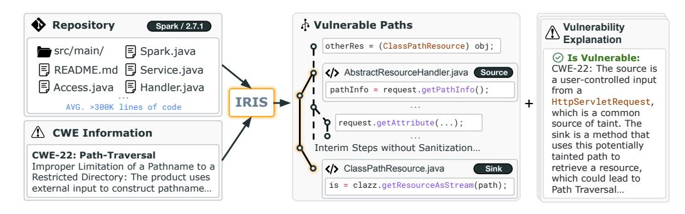

Figure 1: IRISニューロシンボリックシステムの概要である。本システムは、与えられたリポジトリ全体に対して指定された種類の脆弱性（CWE）を検査し、説明付きで潜在的な脆弱経路の集合を出力する。

サードパーティライブラリAPIの汚染仕様の欠如による偽陰性。まず、静的汚染解析は主にサードパーティライブラリAPIの仕様を、ソース・シンク・サニタイザとして利用する。実際には、開発者や解析技術者が自身のドメイン知識やAPIドキュメントに基づいて、このような仕様を手作業で作成しなければならない。これは労力がかかる上に、エラーが発生しやすい作業であり、その結果として仕様の抜け落ちや脆弱性解析の不完全さにつながりやすい。さらに、多くのライブラリに対してそのような仕様が存在する場合であっても、ライブラリの新バージョンでの変更を正しく反映したり、新たに開発されたライブラリを網羅するためには、これらの仕様を定期的に更新する必要がある。

精密で文脈依存かつ直感的な推論が不足していることによる誤検知が発生する。第二に、静的解析がしばしば低精度に苦しむことはよく知られている。すなわち、多くの誤警報を生成することがある。このような精度の低さには複数の要因が存在する。例えば、ソースやシンクの仕様が誤っている場合や、解析がコードの分岐や可能な入力について過大に近似する場合がある。さらに、仕様が正しい場合であっても、検出されたソースやシンクが利用される文脈が実際には悪用不可能である可能性もある。このため、開発者は多くの誤検知である可能性のあるセキュリティ警告を選別しなければならず、相当な時間と労力を浪費することになる。

従来のデータ駆動型アプローチによる静的テイント解析の改善には制約がある。静的テイント解析の課題に対応するため、多くの手法が提案されてきた。例えば、[Livshits et al.](#page-12-1) [\(2009\)](#page-12-1) は、MERLINと呼ばれる確率的アプローチを提案し、テイント仕様を自動的に抽出する方式を示した。より最近の研究であるSeldon [\(Chibotaru et al., 2019\)](#page-10-4) は、このアプローチのスケーラビリティを向上させるため、テイント仕様推論問題を線形最適化課題として定式化している。しかし、このような手法は、サードパーティライブラリのコードを解析して仕様を抽出する必要があり、コストが高く、大規模化が困難である。研究者らは誤検出アラートを軽減するため、統計的および学習ベースの技術も開発してきた [\(Jung et al., 2005;](#page-11-2) [Heckman & Williams, 2009;](#page-11-3) [Hanam et al., 2014\)](#page-10-5)。しかしながら、これらの手法も依然として実際には効果が限定的である [\(Kang et al., 2022\)](#page-11-0)。

大規模言語モデル（LLM）は、コード生成および要約において顕著な進歩を遂げている。LLMは、プログラム修復やコード変換、テスト生成、静的解析などのコード関連タスクにも応用されてきた。最近の研究では、LLMがメソッドレベルでの脆弱性検出の有効性について評価されており、LLMは特にメソッドがプロジェクト内で使用される*文脈*に依存するため、コードに対する複雑な推論に失敗することが示されている。一方で、SWE-Benchのような最近のベンチマークは、LLMがプロジェクトレベルの推論も苦手であることを示している。したがって、LLMを静的解析と組み合わせることで、その推論能力を向上できるかどうかは興味深い疑問である。本研究では、脆弱性検出を対象としてこの疑問に答え、以下の貢献を行う。

アプローチ。我々はIRISを提案する。これは静的解析とLLMの強みを組み合わせた神経記号型手法による脆弱性検出法である。Fig. [1](#page-0-0)はIRISの概要を示している。特定の脆弱性クラス（またはCWE）を対象としたプロジェクトを解析する場合、IRISはLLMを用いてCWE固有のテイント仕様を抽出する。IRISはこのような仕様を静的テイント解析ツールであるCodeQLで拡張する。我々の直感として、LLMはこれらのライブラリAPIの多くの使用例を学習しているため、異なるCWEに関する関連APIを理解していると考える。さらに、静的解析の不精度の問題に対処するため、LLMによる文脈解析技術を提案する。これにより、偽陽性警告を削減し、開発者によるトリアージ作業を最小限に抑える。我々の主要な洞察は、プロンプトにコードコンテキストと経路感受性情報をエンコードすることで、LLMからより信頼性の高い推論を引き出せるということである。最終的に、この神経記号型手法によってLLMがより精密なリポジトリ全体の推論を行い、静的解析ツールの運用にかかる人的コストを最小限にできる。

Dataset. 手作業で検証され、コンパイル可能なJavaプロジェクトのデータセットCWE-Bench-Javaを作成した。本データセットには、4つの一般的な脆弱性クラスにまたがる120件の脆弱性（各プロジェクトにつき1件）が含まれている。データセット内のプロジェクトは平均で30万行のコードを含む複雑なものであり、100万行を超えるコードを持つプロジェクトも10件含まれているため、脆弱性検出のための難易度の高いベンチマークとなっている。本データセットおよび対応するJavaプロジェクトを取得・ビルド・解析するためのスクリプトは、<https://github.com/iris-sast/cwe-bench-java> で公開されている。

結果。IRISをCWE-Bench-Java上で、7つの多様なオープンおよびクローズドソースのLLMを用いて評価した。全体として、IRISはGPT-4を用いた場合に最も優れた結果を示し、55件の脆弱性を検出した。これは既存の最も優れた静的解析ツールであるCodeQLよりも28件（103.7%）多い検出数である。また、この増加が偽陽性の増加によるものではないことも示しており、GPT-4を用いたIRISは平均偽検出率が84.82%であり、CodeQLよりも5.21%低い値であった。さらに、最新バージョンの30個のJavaプロジェクトに適用した際、GPT-4を用いたIRISはこれまで知られていなかった4つの脆弱性を発見した。

<span id="page-2-0"></span>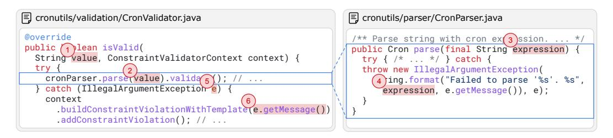

Figure 2: cron-utils（CVE-2021-41269）で発見されたCode Injection（CWE-94）脆弱性の一例であり、CodeQLが検出に失敗するものである。脆弱な経路の各プログラムポイントには番号を付けている。

### 2 MOTIVATING EXAMPLE

public void extractFile( String fileName, String destinationPath, String newFileName) throws ZipException { **Detected Source**: extractFileの2つの形式的パラメータ // 関数`assertCanonicalPathsAreSame`内 - if (!completePath.startsWith(outPath)) { /\* ... \*/ } + String comp = new File(completePath).getCanonicalPath(); + String out = new File(outPath).getCanonicalPath()); + if (!comp.startsWith(out)) { /\* ... \*/ } **CVE-2018-1002202の修正**: パスを検証するサニタイザである 本稿では、Cronデータ操作用Javaライブラリであるcron-utils（バージョン9.1.5）における既知のコードインジェクション（CWE-094）脆弱性をIRISが検出する効果を示す。図[2](#page-2-0)には関連するコードスニペットを示す。ユーザーが制御する文字列値がisValid関数に渡され、サニタイズされずにparse関数へ転送される。例外がスローされた場合、関数は入力値を含むエラーメッセージを構築する。しかし、このエラーメッセージはjavax.validatorのConstraintValidatorContextクラスのbuildConstraintViolationWithTemplateメソッドの呼び出し時に使用され、このメッセージ文字列がJava Expression Language（Java EL）式として解釈される。悪意のあるユーザーは、Runtime.exec('rm -rf /')のようなシェルコマンドを含んだ文字列を作成することで、この脆弱性を利用してサーバ上の重要なファイルを削除することができる。

try (OutputStream outputStream = new FileOutputStream(outputFile)) { **検出されたシンクB**: 意図されたディレクトリ外にファイルを書き込む可能性がある if (!destinationPath.mkdirs()) { // ... **検出されたシンクA**: ファイルシステムにディレクトリを作成する **脆弱ではない 脆弱である** この脆弱性を検出するにはいくつかの課題がある。まず、cron-utilsライブラリは13K SLOC（空行やコメントを除いた行数）で構成されており、この脆弱性を見つけるには分析が必要である。このプロセスでは、複数の内部メソッドやサードパーティAPIにまたがるデータと制御フローの分析が必要となる。次に、分析では関連する*ソース*と*シンク*を特定する必要がある。この場合、public isValidメソッドのvalueパラメータは呼び出された際に任意の文字列を含む可能性があり、したがって悪意のあるデータのソースとなり得る。さらに、buildConstraintViolationWithTemplateのような外部APIは任意のJava EL式を実行できるため、Code Injection攻撃に対して脆弱なシンクとして扱うべきである。最後に、信頼できないデータの流れを遮断するサニタイザーの特定も分析には求められる。

現代の静的解析ツール、例えばCodeQLは、複雑なコードベースにおける汚染データフローの追跡に効果的である。しかし、CodeQLは仕様の不足によりこの脆弱性を検出できない。CodeQLは360以上の有名なJavaライブラリモジュールにわたるソースおよびシンクについて多数の手作業でキュレーションされた仕様を含んでいる。しかし、このような仕様を手動で取得するには、人手による分析、仕様化、検証に多大な労力が必要である。さらに、仕様が完全であったとしても、CodeQLは文脈的推論の欠如により多くの偽陽性をしばしば生成し、開発者が結果をトリアージする負担を増加させることがある。

対照的に、IRISはLLMを用いることでプロジェクト固有および脆弱性固有の仕様を*オンザフライ*で推論するという異なるアプローチを取っている。IRISのLLMベースのコンポーネントは、信頼できないソースと脆弱なシンクを正しく特定する。IRISはこれらの仕様をCodeQLに追加し、検出されたリポジトリ内のソースとシンクの間のサニタイズされていないデータフロー経路を検出することに成功している。しかし、拡張されたCodeQLは多くの偽陽性を生成し、これは論理ルールで排除するのが困難である。この課題を解決するために、IRISは検出したコードパスと周辺コンテキストを単純なプロンプトに符号化し、LLMを用いて真の陽性か偽陽性かを分類する。具体的には、静的解析により報告された8つの経路のうち5つの偽陽性が除外され、Fig. [2](#page-2-0)の経路などが最終的なアラームのひとつとして残される。全体として、IRISはCodeQLのような静的解析ツールでは検出困難な多くの脆弱性も検出できる一方で、誤検知を最小限に抑えられることが観察されている。

### 3 IRIS FRAMEWORK

高レベルでは、IRISはJavaプロジェクトP、検出すべき脆弱性クラスC、大規模言語モデルLLMを入力として受け取る。IRISはプロジェクトPを静的に解析し、Cに特有の脆弱性をチェックし、潜在的なセキュリティアラートAの集合を返す。各アラートには、Cに対して脆弱な（すなわち、サニタイズされていない）汚染元から汚染先までのユニークなコードパスが添付されている。

<span id="page-3-0"></span>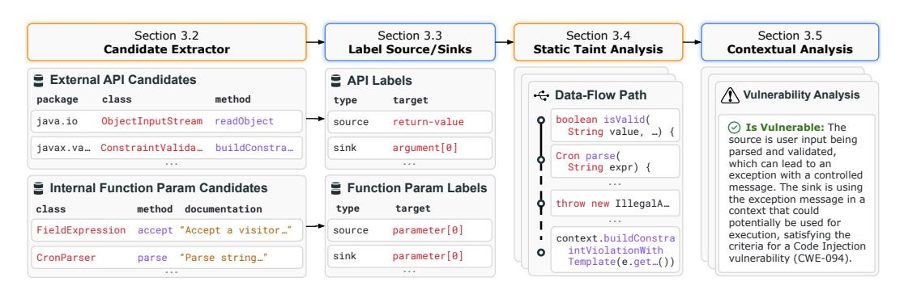

図3：IRISパイプラインの図解である。

**CWE**  図[3,](#page-3-0)で示されているように、IRISには4つの主要な段階がある。まず、IRISは与えられたJavaプロジェクトをビルドし、静的解析を用いて呼び出された外部APIや内部関数パラメータを含む全ての候補APIを抽出する。次に、IRISは大規模言語モデルに問い合わせを行い、これらのAPIに対して与えられた脆弱性クラスCに特有なソースまたはシンクのラベル付けを行わせる。第三に、IRISはラベル付けされたソースおよびシンクを、CodeQLのような静的解析エンジンに入力可能な仕様へと変換し、プロジェクト内のその脆弱性クラスに対応した伝播解析クエリを実行して脆弱性を検出する。この段階では、プロジェクト内の脆弱なコードパス（もしくは警告）が一式生成される。最後に、IRISは自動的に誤検知をフィルタリングすることで生成された警告をトリアージし、開発者に提示する。

#### 3.1 PROBLEM STATEMENT

**Java Project** Src/Snk Candidates **Function Params** Source Candidates **Source & Sink Specifications Candidate Extractor Inference Function Param Spec Infrerence** 4.1 4.2 **Program**  
静的テイント解析問題を脆弱性検出のために形式的に定義する。プロジェクトPが与えられたとき、テイント解析は手続き間のデータフローグラフG = (V, E)を抽出する。ここでVはプログラムの式や文を表すノードの集合であり、E ⊆ V × Vはノード間のデータまたは制御フローエッジを表すエッジの集合である。脆弱性検出タスクには2つの集合V C *source* ⊆ V, V C *sink* <sup>⊆</sup> <sup>V</sup> が付随し、それぞれテイントデータが発生し得るソースノード、およびテイントデータが到達した場合にセキュリティ脆弱性が発生し得るシンクノードを示す。当然ながら、異なるクラスCの脆弱性（あるいはCWE）には異なるソースおよびシンクの仕様が存在する。さらに、テイントデータの流れをブロックするサニタイザ仕様V C *sanitizer* ∈ V（例えば、文字列内の特殊文字をエスケープするなど）が存在し得る。

4.3 4.4 **データフローグラフ** 汚染分析の目的は、ソースとシンクのペア（V<sup>s</sup> ∈ V C *source*, V<sup>t</sup> ∈ V C *sink*）を発見することであり、ソースからシンクまで*非サニタイズ*パスが存在する場合である。より形式的には、*Unsanitized Paths*(Vs, Vt) ＝ ∃ *Path*(Vs, Vt) すなわち、∀V<sup>n</sup> ∈ *Path*(Vs, Vt), V<sup>n</sup> ∈/ V C *sanitizer* という条件を満たすパスが存在することである。ここで、*Path*(V1, Vk) はノードの列(V1, V2, ... , Vk)を表し、V<sup>i</sup> ∈ V かつ ∀i ∈ 1 *to* k − 1 : (v<sup>i</sup> , vi+1) ∈ E という条件を満たすものとする。

**静的汚染解析脆弱経路候補の文脈的フィルタリング脆弱性** 説明付き  
汚染解析における2つの主要な課題は以下である。1) 任意のプロジェクト P に対して、各クラス C に関連する汚染仕様を特定し、それを V C *source*、V C *sink* にマッピングすること、2) 汚染解析によって特定された *Unsanitized Paths*（Vs, Vt）における誤検出経路を効果的に排除することである。以下のセクションでは、それぞれの課題に対してLLMを活用することでどのように対応するかについて論じる。

#### 3.2 CANDIDATE SOURCE/SINK EXTRACTION

あるプロジェクトは、仕様が不明なさまざまなサードパーティAPIを使用する可能性があり、その結果として、テイント解析の有効性が低下する。また、内部APIも下流のライブラリからの信頼できない入力を受け入れる場合がある。したがって、本研究の目標は、そのようなAPIの仕様を自動的に推定することである。我々は、仕様 S <sup>C</sup> を3つ組 ⟨T, F, R⟩ と定義する。ここで、T ∈ {*ReturnValue*, *Argument*, *Parameter*, ... } は G 内で対応させるノードの種類、F はAPIのパッケージ名、クラス名、メソッド名、シグネチャ、および（該当する場合）引数やパラメータの位置を表す文字列のN個組、R ∈ {*Source*, *Sink*, *Taint-Propagator*, *Sanitizer*} はAPIの役割を示す。たとえば、仕様 ⟨*Argument*,(java.lang, Runtime, exec,(String[]), 0), *Sink*⟩ は、Runtimeクラスのexecメソッドの最初の引数が脆弱性クラス（OSコマンドインジェクション）のsinkであることを意味する。静的解析ツールは、これらの仕様を <sup>G</sup> 内のノード集合 V C *source* または V C *sink* にマッピングする。

汚染仕様 S C *source* および S C *sink* を特定するために、まず S ext、すなわち与えられたJavaプロジェクト内で呼び出され、汚染元またはシンクとなる可能性がある外部ライブラリAPIを抽出する。また、S int、すなわち公開されており、下流ライブラリによって呼び出される可能性がある内部ライブラリAPIも抽出する。

<span id="page-4-0"></span>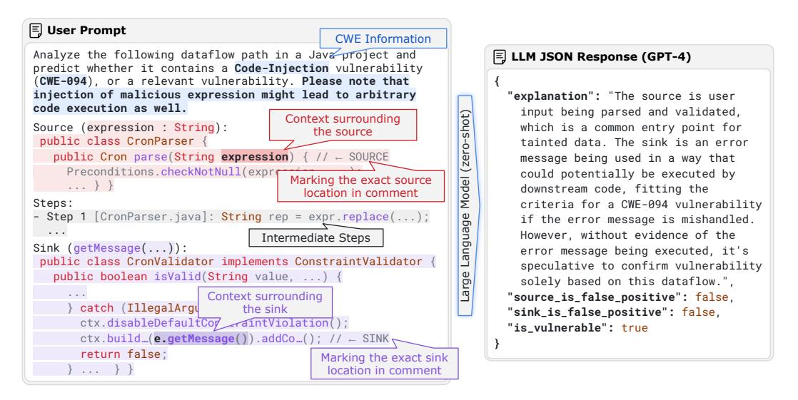

public void extractFile( **Detected Source**: extractFileの2つの形式的パラメータ  
Figure 4: データフローパスの文脈的分析に関するLLMユーザプロンプトと応答を示す。ユーザプロンプトにおいては、プロンプトテンプレートを埋めているCWEおよびパス情報を色付けして示している。より明確な提示のため、スニペットを修正し、システムプロンプトは省略している。

**CVE-2018-1002202の修正方法**：サニタイザーはパスをチェックするためにCodeQLを使用して、そのような候補と対応するメタデータ（メソッド名、型シグネチャ、囲まれているパッケージやクラス、さらには該当する場合JavaDocドキュメント）を抽出するのである。

#### 3.3 INFERRING TAINT SPECIFICATIONS USING LLMS

if (!destinationPath.mkdirs()) { // ... **検出されたシンクA**: ファイルシステム内にディレクトリを作成している

**脆弱ではない 脆弱である**

我々は自動仕様推論技術を開発した：*LabelSpecs*(S #, LLM, C, R) = S C R 、ここで S # = S ext ∪ S int はソースおよびシンクの候補仕様である。本研究では、サニタイザの仕様は考慮しない。なぜなら、我々が対象とする脆弱性クラスでは、通常サニタイザ仕様はほとんど変化しないからである。我々はLLMを用いてテイント仕様を推論する。具体的には、S extにおける外部APIはソースまたはシンクのいずれかとして分類でき、S intにおける内部APIではその形式パラメータをソースとして識別できる。付録では、外部APIおよび内部関数の形式パラメータからソースおよびシンク仕様を推論するためのユーザプロンプトを示す。

非常に多くのAPIにラベル付けを行う必要があるため、1つのプロンプトで複数のAPIをまとめて挿入し、LLMに対してJSON形式の文字列で応答するよう依頼する。バッチサイズは調整可能なハイパーパラメータである。外部APIのラベル付けにはfew-shot（通常は3-shot）プロンプティング戦略を採用し、内部APIのラベル付けにはzero-shotを使用する。特に内部APIについては、該当する場合はリポジトリのreadmeやJavaDocドキュメントの情報も含めている。実際には、この追加情報がLLMにコードベースの高レベルな目的や利用方法を理解させる助けとなり、より精度の高いラベル付けが可能になることが分かった。この段階の終わりには、次の段階で静的解析エンジンによって使用されるS C *source*とS C *sink*を正常に取得することができる。

#### 3.4 VULNERABILITY DETECTION

すべてのソースおよびシンクの仕様をLLMから取得した後、次のステップは、これを静的解析エンジンと組み合わせて、指定されたプロジェクト内の脆弱な経路、すなわち*Unsanitized Paths*(Vs, Vt)を検出することである。本研究では、このステップにCodeQL [\(GitHub, 2024a\)](#page-10-6)を用いる。CodeQLはプログラムをデータフローグラフとして表現し、これらのグラフを解析するためにDatalogに似たクエリ言語 [\(Smaragdakis & Bravenboer,](#page-12-5) [2010\)](#page-12-5)を提供する。多くのセキュリティ脆弱性は、CodeQLで記述された*クエリ*を用いてモデル化でき、そのようなプログラムから抽出されたデータフローグラフに対して実行することが可能である。プロジェクトPのデータフローグラフG<sup>P</sup>、CWE固有のソースおよびシンク仕様、および脆弱性クラスCに対するクエリが与えられたとき、CodeQLはプログラム中のunsanitized pathの集合を返す。正式には、

$$
CodeQL(\mathbb{G}^{P}, S_{source}^{C}, S_{sink}^{C}, Query^{C}) = \{Path_1, \ldots, Path_k\}.
$$

CodeQL自体は、各脆弱性クラスごとに多数のサードパーティAPIの仕様を含んでいる。しかし、後述する評価において示すように、このような特化したクエリや広範な仕様を持っていても、CodeQLは実世界のプロジェクトにおける脆弱性の大半を検出できない。本分析では、CodeQLが提供するものではなく、我々が抽出した仕様を用いた各脆弱性向けの特化したCodeQLクエリを作成した。クエリの詳細については付録で説明している。

#### 3.5 TRIAGING OF ALERTS VIA CONTEXTUAL ANALYSIS

汚染仕様を推論することは課題の一部しか解決しない。我々の観察によれば、LLMは多くの新たなAPI仕様を発見するのに役立つ一方、時には検討中の脆弱性クラスに関係のない仕様を検出することがあり、その結果、予測されるsourceやsinkが過剰となり、多くの誤警報が発生することがある。参考までに、数百件の汚染仕様であっても、しばしば開発者が選別しなければならない数千件の*Unsanitized Paths*(Vs, Vt)が生じることがある。このような開発者の負担を軽減するために、コンテキスト情報や自然言語情報を活用し、検出された脆弱なパス(*Path*)が真の陽性か偽陽性かを分類するLLMベースのフィルタリング手法である*FilterPath*(*Path*, G, LLM, C) = True|Falseも開発した。

図[4](#page-4-0) は、文脈的分析のためのプロンプト例を示している。このプロンプトにはCWE情報と、パス上の各ノードに対応するコードスニペットが含まれており、特にソースとシンクが強調されている。中間ステップについては、ファイル名とコード行を記載している。パスが長すぎる場合は、プロンプトのサイズを制限するためにノードの一部のみを保持する。このプロンプトに関する詳細および設計上の判断については付録で説明している。LLMには、最終的な判定とその説明を含むJSON形式での回答を期待している。JSON形式は、まず説明を生成し、その後最終判定を提示するようLLMを促すものであり、推論後に判断を示すことでより良い結果が得られることが知られている。さらに、判定が偽の場合には、ソースまたはシンクのいずれが偽陽性であるかもLLMに示させることで、他のパスの剪定が可能となり、LLMへの呼び出し回数の削減につながる。

#### 3.6 EVALUATION METRICS

IRISおよびそのベースラインの性能評価には、主に三つの指標を用いる：検出された脆弱性の数（*#Detected*）、平均偽発見率（*AvgFDR*）、および平均F1（*AvgF1*）である。評価にあたっては、データセットD = {P1, ... , Pn}を仮定し、各P<sup>i</sup>はJavaプロジェクトであり、少なくとも一つの脆弱性を含むことが既知であるものとする。プロジェクトPのラベルは、重要なプログラムポイントの集合V<sup>P</sup> vul = {V1, ... , Vn}として与えられ、脆弱性経路が通過すべき箇所を示す。これは*Path*∩V<sup>P</sup> vul ̸= ∅であることにより示される。実際には、これらは通常、各脆弱性報告から収集できるパッチ済みメソッドである。少なくとも一つ検出された脆弱性経路が、該当脆弱性の修正済み箇所を通過する場合、その脆弱性が検出されたと見なす。*Paths*<sup>P</sup>は、各プロジェクトPについて前段階で検出された経路の集合とする。各指標は以下のように正式に定義する。

$$
\#VulPath(P) = |\{Path \in Paths^P \mid Path \cap \mathbf{V}_{\text{val}}^P \neq \emptyset\}|, \quad Rec(P) = \mathbb{1}_{\#VulPath(P) > 0},
$$
\n
$$
\#Detected(\mathcal{D}) = \sum_{P \in \mathcal{D}} Rec(P), \quad prec(P) = \frac{\#VulPath(P)}{|Paths^P|},
$$
\n
$$
AvgFDR(\mathcal{D}) = avg_{P \in \mathcal{D}, |Paths^P| > 0}1 - Prec(P), \quad AvgFI(\mathcal{D}) = \frac{1}{|\mathcal{D}|} \sum_{P \in \mathcal{D}} \frac{2 \cdot Prec(P) \cdot Rec(P)}{Prec(P) + Rec(P)}.
$$

上記の数式は、パスに関連する脆弱性の検出と評価指標を定義している。それぞれの式は、パス数、脆弱パスの検出状況、検出精度、平均偽陽性率、平均F値などを表している。これにより、検出システムの性能を定量的に評価できる。

具体的には、*AvgFDR*が低いほど望ましい。これは偽陽性の割合が低いことを示しているからである。なお、検出ツールが経路を一つも取得しなかった場合（|*Paths*<sup>P</sup>| = 0）には、分母がゼロとなるため、*Prec*(P)が未定義となる場合がある。このため、*AvgFDR*の値が意味を持つためには、少なくとも一つの陽性結果が生成されたプロジェクト（|*Paths*<sup>P</sup>| > 0）のみに対象を絞っている。*AvgF1*においては、陽性ラベルが存在しない場合には*Rec*(P) = 0となり、*Prec*(P)の値に関わらずF1の値がゼロになるため、この問題を回避できる。

### 4 CWE-BENCH-JAVA: A DATASET OF SECURITY VULNERABILITIES IN JAVA

我々の手法を評価するためには、いくつかの重要な特徴を備えたJavaプロジェクトの脆弱なバージョンのデータセットが必要である。1) 各ベンチマークには、CWE ID、CVE ID、修正コミット、および脆弱なプロジェクトバージョンなどの関連する脆弱性メタデータが含まれていなければならない。2) データセット内の各プロジェクトはコンパイル可能である必要があり、これは静的解析やデータフローグラフ抽出のための重要な要件である。3) プロジェクトは実世界のものでなければならず、これは通常、合成ベンチマークと比べてより複雑であるため、解析がより困難となる。4) 最後に、各脆弱性およびそのプロジェクト内での位置（例：メソッド）を検証する必要があり、この情報を脆弱性検出ツールの堅牢な評価に利用できるようにしなければならない。残念ながら、既存のデータセットはこれらすべての要件を満たしていない。

<span id="page-6-0"></span>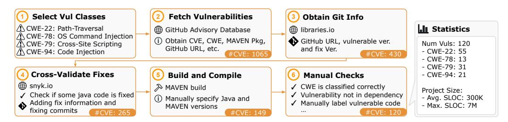

図5：CWE-Bench-Javaをキュレートするための手順およびデータセットの統計情報である。

430 430 これらの要件に対応するために、我々は独自の脆弱性データセットを作成した。本論文では、広く利用されているMavenパッケージマネージャを通じて入手可能なJavaライブラリの脆弱性のみに焦点を当てる。Javaを選択した理由は、Javaがサーバーサイド、Android、ウェブアプリケーションの開発によく使用されており、これらはセキュリティリスクの影響を受けやすいためである。さらに、Javaは長い歴史があるため、分析に利用できる多くの既存のCVEが多数のJavaプロジェクトに存在している。最初に、GitHub Advisory database [\(GitHub, 2024b](#page-10-7)[;c\)](#page-10-8) を利用し、これらの脆弱性を取得し、さらに複数の情報源からのクロスバリデーション情報や手動確認を含む追加のフィルタリングを行う。Fig. [5](#page-6-0) は、CWE-Bench-Javaのキュレーションのための一連のステップ全体を示している。

**CWE Information** 4.2 統計（図[5\)](#page-6-0）に示されているように、これらのプロジェクトの規模の大きさは、いかなる静的解析ツールや機械学習ベースのツールにとっても解析が困難であることを意味している。CWE-Bench-Java内の各プロジェクトには、GitHub情報、脆弱性バージョンおよび修正版、CVEメタデータ、自動的に取得およびビルドを行うスクリプト、さらに脆弱性に関与するプログラムの位置の集合が付属している。

### 5 EVALUATION

**Java Project Source & Sink Specifications Candidate Extractor Function**  4.2 我々は、IRISの広範な実験的評価を実施し、CWE-Bench-Javaにおける実世界Javaリポジトリの脆弱性検出におけるその実用的有効性を実証する。追加の結果および分析は付録で提供しているが、ここでは次の主要な研究課題に取り組む。

- ソース候補 **Param Spec Infrerence** • RQ 1: IRISはいくつの既知の脆弱性を検出できるか。
- RQ 2: IRISは、新しく、これまで知られていなかった脆弱性を検出するか。
- **Program**  • RQ 3: IRISによって推論されたsource/sink仕様はどれほど良好であるか。
- **Dataflow**  • RQ 4: IRISの各コンポーネントはどれほど効果的であるか。

#### 5.1 EXPERIMENTAL SETUP

**Static Taint Analysis 脆弱なパス候補のコンテキストフィルタリングによる脆弱性** 説明付き 4.3 4.4
評価のために、OpenAI のクローズドソース LLM である GPT-4 (gpt-4-0125-preview) と GPT-3.5 (gpt-3.5-turbo-0125) の2つを選択している。また、huggingface API を用いて、オープンソース LLM の4つの instruction-tuned バージョン、すなわち Llama 3 (L3) 8B と 70B、Qwen-2.5-Coder (Q2.5C) 32B、Gemma-2 (G2) 27B、および DeepSeekCoder (DSC) 7B を選択している。CodeQL ベースラインについては、バージョン 2.15.3 と、各 CWE に特化した組み込みの Security クエリを使用している。他のベースラインとしては、Facebook Infer [\(FB Infer\)](#page-10-2)、SpotBugs [\(Lavazza et al., 2020\)](#page-11-8)、Snyk [\(Snyk.io\)](#page-12-0) を含んでいる。他の実験設定については付録でさらに詳述している。

## 5.2 RQ1: EFFECTIVENESS OF IRIS ON DETECTING EXISTING VULNERABILITIES

表[1](#page-7-0)の結果は、IRISがCodeQLと比較して優れた性能を示していることを強調している。特に、IRISはGPT-4と組み合わせることで、55件の脆弱性を特定し、これはCodeQLより28件多い数値である。GPT-4が最も高い有効性を示している一方で、DeepSeekCoder 7Bのような小規模・特化型LLMも52件の脆弱性を検出しており、本手法が小規模モデルを効果的に活用でき、アクセシビリティを向上させることを示唆している。注目すべきは、この脆弱性検出数の増加が精度を損なっていない点であり、これはIRISがCodeQLと比べてGPT-4使用時に平均誤検出率（FDR）が低いことで証明されている。さらに、IRISは平均F1値を0.1改善しており、精度と再現率のバランスがより良好であることを示している。ただし、報告されている平均FDRはあくまで大まかな指標であり、本研究の評価基準ではIRISが発見した本物の（ただし未知の）脆弱性を偽陽性として数えてしまうことがある。そのため、報告したFDRは上限値である。検出精度の実態をより正確に把握するため、IRIS（GPT-4使用）によって報告された50件のアラームを無作為抽出し手動で分析したところ、50件中27件のアラームが潜在的な攻撃面を示していた。*この結果、より精緻な誤検出率を46%と推定できる。*したがって、IRISは実際の運用においてさらに高い有効性を発揮する可能性が高いと考える。

| Method        | #Detected (/120) | Detection Rate (%)     | Avg FDR (%)           | Avg F1 Score           |
|---------------|------------------|------------------------|-----------------------|------------------------|
| CodeQL        | 27               | 22.50                  | 90.03                 | 0.076                  |
| GPT-4         | <b>55</b> (↑ 28) | <b>45.83</b> (↑ 23.33) | <b>84.82</b> (↓ 5.21) | <b>0.177</b> (↑ 0.101) |
| GPT-3.5       | 47 (↑ 20)        | 39.17 (↑ 16.67)        | 90.42 (↑ 0.39)        | 0.096 (↑ 0.020)        |
| L3 8B         | 41 (↑ 14)        | 34.17 (↑ 11.67)        | 95.55 (↑ 5.52)        | 0.058 (↓ 0.018)        |
| IRIS + L3 70B | 54 (↑ 27)        | 45.00 (↑ 22.50)        | 90.96 (↑ 0.93)        | 0.113 (↑ 0.037)        |
| Q2.5C 32B     | 47 (↑ 20)        | 39.17 (↑ 16.67)        | 92.38 (↑ 2.35)        | 0.097 (↑ 0.021)        |
| G2 27B        | 45 (↑ 18)        | 37.50 (↑ 15.00)        | 91.23 (↑ 1.20)        | 0.100 (↑ 0.024)        |
| DSC 7B        | 52 (↑ 25)        | 43.33 (↑ 20.83)        | 95.40 (↑ 5.37)        | 0.062 (↓ 0.014)        |

<span id="page-7-0"></span>表1：Detection Rate（↑）、Average FDR（↓）、およびAverage F1（↑）におけるCodeQLとIRISの全体的な性能比較である。IRISの結果については、GPT-4やGPT-3.5、L3 8Bと70B、Q2.5C 32B、G2 27B、DSC 7Bを含むLLMを用いた結果を示している。

表[2](#page-7-1)は、検出された脆弱性の詳細な内訳を示し、IRISと各種ベースラインの比較を行っている。IRISがLlama-3 8Bを用いた場合を除き、これはCWE-22の脆弱性検出において劣っているが、IRISは一貫して他のすべてのベースラインを上回っている。特筆すべきは、CWE-78（OSコマンドインジェクション）がすべてのLLMにとって依然として特に困難である点である。我々の手動調査により、CWE-78の脆弱性パターンは極めて複雑であり、多くの場合、gadgets chains [\(Cao et al., 2023\)](#page-10-9)を介したOSコマンドインジェクションや、ファイル書き込みなどの外部副作用が関与しており、静的解析による追跡が困難であることが判明した。これは静的解析の本質的な限界を浮き彫りにしており、動的アプローチとの対比となっている。動的アプローチについては今後の課題として残すものである。

#### 5.3 RQ2: PREVIOUSLY UNKNOWN VULNERABILITIES BY IRIS

我々は、IRISをGPT-4と共に30件の最新バージョンのJavaプロジェクトに適用した。IRISが少なくとも1件のアラートを検出した16件のプロジェクトの中で、4件の脆弱性を特定した。その内訳は、パスインジェクション（CWE-22）の3件と、コードインジェクション（CWE-94）の1件である。これらの脆弱性が実際にIRISとLLMの統合によって発見されたことを確認するため、CodeQL単独では検出できなかったことも検証した。このうちの一例をFig. [8.](#page-8-0)で示す。CodeQLはソース指定が欠落していたためこの問題を検出できなかったが、GPT-4はAPIエンドポイントrestoreFromCheckpointを攻撃の潜在的な侵入口として的確に指摘した。

#### 5.4 RQ3: QUALITY OF LLM-INFERRED TAINT SPECIFICATIONS

LLMによって推論されたテイント仕様は、IRISの有効性にとって根本的なものである。この仕様の品質を評価するため、2つの実験を実施した。まず、CodeQLのテイント仕様をベンチマークとして用い、LLMによって推論されたソースおよびシンク仕様のリコールを推定した（Fig. [6\)](#page-8-0)。しかし、CodeQLが提供する仕様のセットは限られているため、既知のカバレッジ外で推論された仕様の品質も評価する必要があった。この目的のため、LLMによって推論されたソースおよびシンクラベルのうち、ランダムに選ばれた960個のサンプル（CWEとLLMの組み合わせごとに30件）を手動で分析し、全体的な精度を推定した（Fig. [7\)](#page-8-0)。

LLMによって推論されたシンクは、CodeQLのシンクの代替となり得る。全体として、LLMはCodeQLのシンク仕様（Fig. [6\)](#page-8-0)）に対してテストされた際、高いリコール率を示した。特にGPT-4が最も高いスコア（87.11%）を記録した。

<span id="page-7-1"></span>表2：ベースラインおよびIRISによって検出された脆弱性数（*#Detected*）のCWEごとの統計である。比較対象のベースラインはCodeQL（QL）、Facebook Infer（Infer）、Spotbugs（SB）、Snykである。かっこ内の値は、IRISがCodeQLに対して検出した差分を示している。

| CWE    | #Vuls | Baselines |       |    |      | IRIS with |           |           |           |           |
|--------|-------|-----------|-------|----|------|-----------|-----------|-----------|-----------|-----------|
|        |       | QL        | Infer | SB | Snyk | GPT-4     | GPT-3.5   | L3 8B     | L3 70B    | DSC 7B    |
| CWE-22 | 55    | 22        | 0     | 2  | 21   | 31 (↑ 9)  | 25 (↑ 3)  | 19 (↓ 3)  | 29 (↑ 7)  | 25 (↑ 3)  |
| CWE-78 | 13    | 1         | 0     | 1  | 1    | 3 (↑ 2)   | 1 (= 0)   | 2 (↑ 1)   | 2 (↑ 1)   | 3 (↑ 2)   |
| CWE-79 | 31    | 4         | 0     | 1  | 1    | 13 (↑ 9)  | 13 (↑ 9)  | 9 (↑ 9)   | 14 (↑ 10) | 14 (↑ 10) |
| CWE-94 | 21    | 0         | 0     | 0  | 0    | 8 (↑ 8)   | 8 (↑ 8)   | 11 (↑ 11) | 9 (↑ 9)   | 10 (↑ 10) |
| All    | 120   | 27        | 0     | 4  | 23   | 55 (↑ 28) | 47 (↑ 20) | 41 (↑ 14) | 54 (↑ 27) | 52 (↑ 25) |

<span id="page-8-0"></span>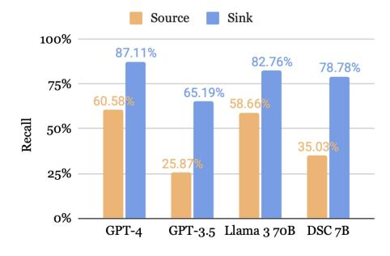

図6：CodeQLの汚染仕様に対するLLM推定の汚染仕様のリコールである。

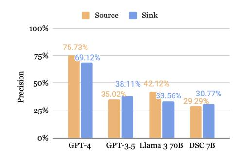

図7：ランダムにサンプリングされたラベルに対するLLM推論仕様の推定適合率である。

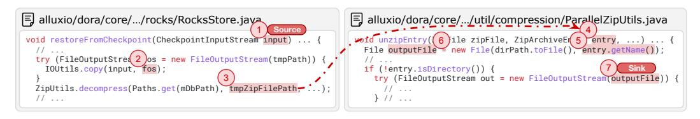

図8: alluxio 2.9.4で発見された未知の脆弱性である。スニペットは説明のために若干修正してある。データベースの復元権限を持つユーザーが、悪意のあるエントリ名を含むデータベースのチェックポイントZipファイルを指定することができる。解凍時に、そのエントリが任意のディレクトリに書き込まれる可能性があり、これによりZip-Slip脆弱性（CWE-022）が発生し、ホスティングサーバーが破損する恐れがある。

**Detected Source**: extractFileの2つの形式的パラメータ

ソース指定に関するリコールは一般的に低かったが、CodeQLは検出率の低さを補うためにソース指定の過大推定を行う傾向があると判明した。一方で、GPT-4は手動評価において高い適合率（70%以上）を達成しており（Fig. [7\)](#page-8-0)、以前Table [1.](#page-7-0) で報告された偽陽性率の低さと一致している。他のLLMに関しては、リコールが高い一方で適合率が低いという組み合わせが、シンク指定の過大推定傾向を示唆している。

String fileName, String destinationPath, String newFileName) throws ZipException { // In function `assertCanonicalPathsAreSame` - if (!completePath.startsWith(outPath)) { /\* ... \*/ } + String comp = new File(completePath).getCanonicalPath(); **CVE-2018-1002202への対応策**：パスを確認するサニタイザである。 仕様を過大評価することはIRISに利益をもたらす可能性がある。GPT-4以外のLLMにおける精度は低いものの、過大評価は実際にCodeQLの根本的な制限—テイント仕様の限定的なセット—に対処する助けとなる。過大評価を行うことで、LLMはテイント解析の範囲を拡大し、CodeQLの限定的な適用範囲に対する部分的な解決策を提供できる。この不正確さの影響は、後述するアブレーション研究に示すように、コンテクスト解析を用いることで緩和できる。

#### 5.5 RQ4: ABLATION STUDIES

try (OutputStream outputStream = new FileOutputStream(outputFile)) { **Detected Sink B**: 意図したディレクトリ外へのファイル書き込みの可能性がある  
if (!destinationPath.mkdirs()) { // ...  
**Detected Sink A**: ファイルシステム内でディレクトリを作成している

LLMが推論したソースとシンクの両方が必要である。

表 [3](#page-9-0) は、IRISにおいてLLMのソース指定またはシンク指定のいずれか一方のみを使用した場合の追加結果を示している。本実験では比較のため、GPT-4の結果のみを使用している。それぞれの行はCWEごとの検出された脆弱性の数を表している。GPT-4により推論されたソース指定またはシンク指定のいずれかを省略すると、全体のリコールが大幅に低下することが観察された。

コンテキスト分析の性能向上は、LLMの推論能力に依存する。Fig. [9,](#page-9-0) に示すように、適合率およびF1スコアの向上にはコンテキスト分析が非常に重要である。しかし、GPT-4、GPT-3.5、およびLlama-3 70Bのみがコンテキスト分析後に正の影響を受けており、小規模なモデルでは負の影響が見られる。コンテキスト分析による偽陽性の削減は、LLMが十分な推論能力を持つ場合に最も効果的である。実際、小規模なモデルは大規模なモデルよりも「vulnerable」と応答する傾向が高い。

### 6 RELATED WORK

脆弱性検出のための学習ベースのアプローチ。多くの先行手法が、脆弱性検出のためにディープラーニングを取り入れている。その中には、グラフニューラルネットワークに基づくモデルが含まれる。

<span id="page-9-0"></span>表3：LLMによって推論されたソースおよびシンク仕様に関するアブレーション（CodeQL（QL）対GPT-4）、*#Detected* メトリクスを用いて評価した。ソースまたはシンクのいずれかをCodeQL仕様に置き換えると、検出される脆弱性が著しく少なくなることがわかる。

| CWE               | 22 | 78 | 79 | 94 | Total     |
|-------------------|----|----|----|----|-----------|
| SrcQL + SnkQL     | 22 | 1  | 4  | 0  | 27 (↓ 28) |
| SrcGPT4 + SnkQL   | 28 | 3  | 5  | 0  | 36 (↓ 19) |
| SrcQL + SnkGPT4   | 10 | 1  | 9  | 4  | 24 (↓ 31) |
| SrcGPT4 + SnkGPT4 | 31 | 3  | 13 | 8  | 55        |

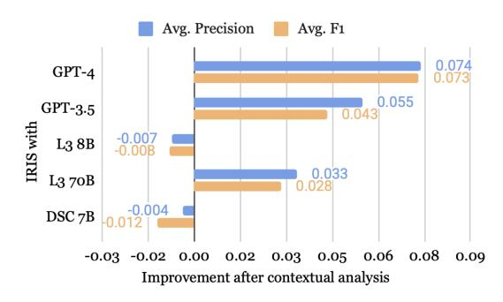

SrcGPT4 <sup>+</sup> SnkGPT4 31 3 13 8 <sup>55</sup> 図9: 文脈解析後の平均適合率および平均F1の向上である。

これらの手法は、脆弱性のメソッドレベル検出に焦点を当て、メソッドが脆弱であるか否かの二値ラベルのみを提供する。一方、IRISはプロジェクト全体の解析を行い、ソースからシンクへの明確なコードパスを提供し、異なるCWEの検出に合わせて調整可能である。さらに近年、複数の研究により、LLMが実際のコードにおける脆弱性検出に効果的でないことが示されている。これらの研究はメソッドレベルの脆弱性検出のみに焦点を当てていたが、脆弱性検出にはプロジェクト全体の推論が必要であり、現在のLLM単独ではそれが不可能であるという我々の動機を強化する結果となった。

静的解析ツールについて。CodeQL [\(Avgustinov et al., 2016\)](#page-10-1)以外にも、他の静的解析ツール [\(CPPCheck;](#page-10-15) [Semgrep, 2023;](#page-12-8) [FlawFinder;](#page-10-16) [FB Infer;](#page-10-2) [Code Checker\)](#page-10-17) も脆弱性検出のための解析を含んでいる。より一般的なクエリエンジン [\(Scholz et al., 2016;](#page-12-9) [Li et al., 2023b\)](#page-12-10) もプログラムのバグ発見に応用されてきた。しかし、これらのツールはCodeQLほど多機能かつ効果的ではない [\(Li et al., 2023a;](#page-11-13) [Lipp et al., 2022\)](#page-12-11)。近年、Snyk [\(Snyk.io\)](#page-12-0) や SonarQube [\(SonarQube\)](#page-12-12) などのプロプライエタリなツールも人気を高めているが、これらもIRISが改善する仕様不足や誤検知といった根本的な限界を共有している。我々の手法は、こうした全てのツールにbenefitをもたらすと想定する。MERLIN [\(Livshits et al., 2009\)](#page-12-1)、Seldon [\(Chibotaru](#page-10-4) [et al., 2019\)](#page-10-4)、InspectJS [\(Dutta et al., 2022\)](#page-10-18) などの研究は、確率的モデリングを用いて仕様推定の問題に取り組んでいる。特に、IRISと同様に、InspectJSも機械学習により推定された仕様でCodeQLを拡張している。ただし、InspectJSはシード仕様の品質に依存し、各サードパーティライブラリごとに高価な解析を要求する点でIRISとは異なり、IRISの方がよりスケーラブルである。今後の研究では、仕様に対する確率推定の導入を探求できる可能性がある。

ソフトウェア工学におけるLLMベースの手法について述べる。研究者たちは、LLMとプログラム推論ツールを組み合わせて、ファジングのような困難なタスクや、プログラム修復、障害箇所特定といった課題に取り組む事例が増えてきている。我々も[Li et al., 2024; Wang et al., 2024]と同様の方向性を持っているが、我々の知る限り、静的解析とLLMを組み合わせて、プロジェクト全体の解析を通じてアプリケーションレベルのセキュリティ脆弱性を検出した研究は、本研究が先駆的な試みである。

### 7 CONCLUSION AND LIMITATIONS

我々は、脆弱性検出のためにLLMと静的解析を組み合わせた新しいニューロシンボリック手法であるIRISを提案した。現実のプロジェクトにおける4つのクラスにわたる120件のセキュリティ脆弱性を含むデータセットCWE-Bench-Javaを作成した。我々の結果は、LLMと静的解析を体系的に組み合わせることで、従来の静的解析単独の場合と比べて、検出されるバグの数および開発者の負担軽減の両面で大きく改善することを示している。

制限事項。IRISが検出できない脆弱性は依然として多く存在する。今後のアプローチでは、これら二つのツールのより緊密な統合が性能向上のために検討される可能性がある。加えて、IRISは仕様推論や誤検知のフィルタリングのために多数のLLM呼び出しを行うため、解析コストが増大する可能性がある。Javaにおける本研究の結果は有望であるが、IRISが他の言語でも同様に高い性能を示すかどうかは不明である。さらに、IRISが生成するレポートと開発者が求めるレポートとの間には依然としてギャップが存在する。今後の研究でこの問題についてさらに探求する予定である。

### ACKNOWLEDGMENTS

匿名の査読者による貴重なフィードバックと提案に感謝する。これらは本研究の改善に役立った。また、Claire Wangがプロジェクトのオープンソース化に協力してくれたことにも感謝する。本研究はNSF award CCF 2313010による支援を受けている。

### REFERENCES

- <span id="page-10-1"></span>Pavel Avgustinov、Oege de Moor、Michael Peyton Jones、およびMax Schafer．QL: オブジェクト指向のクエリをリレーショナルデータ上で実行するものである．*European Conference on Object-Oriented Programming*, 2016．
- <span id="page-10-9"></span>Sicong Cao, Xiaobing Sun, Xiaoxue Wu, Lili Bo, Bin Li, Rongxin Wu, Wei Liu, Biao He, Yu Ouyang, and Jiajia Li. オーバーライド誘導型オブジェクト生成によるJavaデシリアライズ・ガジェットチェーン・マイニングの改善である。In *International Conference on Software Engineering*, 2023.
- <span id="page-10-10"></span>Saikat Chakraborty、Rahul Krishna、Yangruibo Ding、およびBaishakhi Rayによる論文「Deep learning based vulnerability detection: Are we there yet?」は、*IEEE Transactions on Software Engineering*の48巻、3280–3296ページ、2020年に掲載されている。

<span id="page-10-3"></span>Checker Framework, 2024. <https://checkerframework.org/>.

- <span id="page-10-13"></span>Xiao Cheng、Guanqin Zhang、Haoyu Wang、およびYulei Sui。コントラスト学習によるパス感受型コード埋め込みを用いたソフトウェア脆弱性検出である。*International Symposium on Software Testing and Analysis*, 2022にて発表。
- <span id="page-10-4"></span>Victor Chibotaru、Benjamin Bichsel、Veselin Raychev、Martin Vechevによる「Scalable taint specification inference with big code」。*Conference on Programming Language Design and Implementation*、2019年に発表されたものである。

<span id="page-10-17"></span>Code Checker, 2023. <https://github.com/Ericsson/codechecker>.

<span id="page-10-15"></span>CPPCheck, 2023. <https://cppcheck.sourceforge.io/>.

<span id="page-10-0"></span>CVE Trends, 2024. <https://www.cvedetails.com>。

- <span id="page-10-11"></span>Elizabeth Dinella、Hanjun Dai、Ziyang Li、Mayur Naik、Le Song、およびKe Wangによる「Hoppity: Learning graph transformations to detect and fix bugs in programs」は、プログラム中のバグを検出し修正するためのグラフ変換の学習について述べている。*International Conference on Learning Representations*、2020年。
- <span id="page-10-14"></span>Yangruibo Ding、Yanjun Fu、Omniyyah Ibrahim、Chawin Sitawarin、Xinyun Chen、Basel Alomair、David Wagner、Baishakhi Ray、およびYizheng Chenによる論文『Vulnerability detection with code language models: How far are we?』は、*arXiv preprint arXiv:2403.18624*、2024年である。
- <span id="page-10-18"></span>Saikat Dutta、Diego Garbervetsky、Shuvendu K Lahiri、Max Schaferによる「Inspectjs: コード類似度とユーザフィードバックを活用したJavaScriptの効果的な汚染指定推論」について述べる。本稿は*International Conference on Software Engineering: Software Engineering in Practice (SEIP) Track*、2022年に発表されたものである。

<span id="page-10-2"></span>FB Infer, 2023. <https://fbinfer.com/>.

<span id="page-10-16"></span>FlawFinder, 2023. <https://dwheeler.com/flawfinder>.

- <span id="page-10-12"></span>Michael FuとChakkrit TantithamthavornによるLineVul: トランスフォーマーベースの行レベル脆弱性予測である。*International Conference on Mining Software Repositories*, 2022にて発表された。
- <span id="page-10-6"></span>GitHub. Codeql, 2024a. <https://codeql.github.com>.
- <span id="page-10-7"></span>GitHub。Github advisory database、2024b。<https://github.com/advisories>。
- <span id="page-10-8"></span>GitHub。Githubのセキュリティ勧告、2024年c。 [https://github.com/github/](https://github.com/github/advisory-database) [advisory-database](https://github.com/github/advisory-database) である。
- <span id="page-10-5"></span>Quinn Hanam、Lin Tan、Reid Holmes、およびPatrick Lam。静的解析アラートにおけるパターンの発見：実用的なアラートランキングの改善。*International Conference on Mining Software Repositories*, 2014年。

- <span id="page-11-15"></span>Jingxuan He and Martin Vechev. コード向けの大規模言語モデル：セキュリティ強化と敵対的テストである。In *Conference on Computer and Communications Security*, 2023.
- <span id="page-11-3"></span>Sarah HeckmanおよびLaurie Williams. 実行可能な静的解析アラートを特定するためのモデル構築プロセスについて述べる。*International Conference on Software Testing, Verification and Validation*, 2009年に発表された。
- <span id="page-11-9"></span>David Hin、Andrey Kan、Huaming Chen、およびMuhammad Ali Babarによる論文である。「Linevd: グラフニューラルネットワークを用いた文レベルの脆弱性検出」と題されている。*International Conference on Mining Software Repositories*、2022年に発表された。
- <span id="page-11-7"></span>Carlos E Jimenez, John Yang, Alexander Wettig, Shunyu Yao, Kexin Pei, Ofir Press, and Karthik Narasimhan. SWE-Bench: 言語モデルは実世界のgithub issueを解決できるか？ *arXiv preprint arXiv:2310.06770*, 2023.
- <span id="page-11-1"></span>Brittany Johnson、Yoonki Song、Emerson Murphy-Hill、Robert Bowdidge。なぜソフトウェア開発者はバグを発見するために静的解析ツールを使用しないのか？*International Conference on Software Engineering*, 2013にて発表された。
- <span id="page-11-14"></span>Harshit Joshi、Jose Cambronero Sanchez、Sumit Gulwani、Vu Le、Gust Verbruggen、および Ivan ´ Radicekによる。"Repair is nearly generation: Multilingual program repair with LLMs"。*AAAI Conference on Artificial Intelligence*, 2023において発表された論文である。
- <span id="page-11-2"></span>Yungbum Jung、Jaehwang Kim、Jaeho Shin、およびKwangkeun Yiによる「Taming false alarms from a domain-unaware C analyzer by a Bayesian statistical post analysis」。*International Static Analysis Symposium*、2005年に発表された論文である。
- <span id="page-11-0"></span>Hong Jin Kang、Khai Loong Aw、およびDavid Lo。「自動静的解析ツールによる誤警報の検出：現状はどこまで進んでいるのか」。*International Conference on Software Engineering*, 2022年。
- <span id="page-11-6"></span>Avishree Khare、Saikat Dutta、Ziyang Li、Alaia Solko-Breslin、Rajeev Alur、Mayur Naik. 大規模言語モデルがセキュリティ脆弱性の検出においてどの程度有効であるかを理解する。*arXiv preprint arXiv:2311.16169*, 2023年。
- <span id="page-11-8"></span>Luigi Lavazza、Davide Tosi、Sandro Morascaによる論文である。「オープンソースソフトウェアの進化におけるspotbugs問題の持続性に関する実証的研究」である。*Quality of Information and Communications Technology*、2020年発表である。
- <span id="page-11-4"></span>Caroline Lemieux、Jeevana Priya Inala、Shuvendu K Lahiri、およびSiddhartha Senによる「CODAMOSA: 事前学習済み大規模言語モデルによるテスト生成のカバレッジ停滞からの脱却」。*International Conference on Software Engineering*、2023年。
- <span id="page-11-5"></span>Haonan Li、Yu Hao、Yizhuo Zhai、およびZhiyun Qianによる「Enhancing static analysis for practical bug detection: An llm-integrated approach」。*International Conference on Object-Oriented Programming, Systems, Languages, and Applications*、2024年。実用的なバグ検出のための静的解析を強化するために、LLMを統合したアプローチを提案している。
- <span id="page-11-13"></span>Kaixuan Li、Sen Chen、Lingling Fan、Ruitao Feng、Han Liu、Chengwei Liu、Yang Liu、Yixiang Chenによる「Java向け静的アプリケーションセキュリティテスト（SAST）ツールの比較と評価」。『*Joint Meeting on European Software Engineering Conference and Symposium on the Foundations of Software Engineering*』、2023a。
- <span id="page-11-10"></span>Yi Li、Shaohua Wang、およびTien Nhut Nguyenによる「Vulnerability detection with fine-grained interpretations」。*Joint Meeting on European Software Engineering Conference and Symposium on the Foundations of Software Engineering*、2021aに掲載されたものである。
- <span id="page-11-12"></span>Zhen Li、Deqing Zou、Shouhuai Xu、Hai Jin、Yawei Zhu、Zhaoxuan Chen、Sujuan Wang、およびJialai Wang。Sysevr: 深層学習を用いてソフトウェアの脆弱性を検出するためのフレームワークである。*IEEE Transactions on Dependable and Secure Computing*, 19:2244–2258, 2021b.
- <span id="page-11-11"></span>Zhuguo Li、Deqing Zou、Shouhuai Xu、Zhaoxuan Chen、Yawei Zhu、およびHai Jinによる「VulDeeLocator: A deep learning-based fine-grained vulnerability detector」。*IEEE Transactions on Dependable and Secure Computing*, 19:2821–2837, 2020年である。

- <span id="page-12-10"></span>Ziyang Li、Jiani Huang、Mayur NaikによるScallopは、ニューロシンボリックプログラミングのための言語である。*Conference on Programming Language Design and Implementation*にて、2023年に発表された。
- <span id="page-12-11"></span>Stephan Lipp、Sebastian Banescu、およびAlexander Pretschnerによる論文である。静的Cコードアナライザーが脆弱性検出にどれほど効果的かについての実証的研究である。*International Symposium on Software Testing and Analysis*, 2022に掲載された。
- <span id="page-12-1"></span>Benjamin Livshits、Aditya V. Nori、Sriram K Rajamani、およびAnindya Banerjee。Merlin: 明示的な情報フロー問題に対する仕様推論手法である。*Conference on Programming Language Design and Implementation*、2009年。
- <span id="page-12-3"></span>Rangeet Pan、Ali Reza Ibrahimzada、Rahul Krishna、Divya Sankar、Lambert Pouguem Wassi、Michele Merler、Boris Sobolev、Raju Pavuluri、Saurabh Sinha、Reyhaneh Jabbarvandによる論文『Lost in translation: A study of bugs introduced by large language models while translating code』は、コードを翻訳する際に大規模言語モデルが引き起こすバグについて調査したものである。発表は*International Conference on Software Engineering*, 2024である。
- <span id="page-12-9"></span>Bernhard Scholz、Herbert Jordan、Pavle Subotic、Till Westmann。「Datalogにおける高速大規模プログラム解析について」。*International Conference on Compiler Construction*、2016年に発表された。
- <span id="page-12-8"></span>Semgrep。Semgrepプラットフォーム。<https://semgrep.dev/>, 2023年。
- <span id="page-12-5"></span>Yannis Smaragdakis と Martin Bravenboer. 素早く容易なプログラム解析のために Datalog を使用する。*International Datalog 2.0 Workshop*, 2010 にて発表。
- <span id="page-12-0"></span>Snyk.io、2024年。<https://snyk.io>。

<span id="page-12-12"></span>SonarQube、2024年。<https://www.sonarsource.com/products/sonarqube>。

- <span id="page-12-7"></span>Benjamin Steenhoek、Hongyang Gao、Wei Leによる「Dataflow analysis-inspired deep learning for efficient vulnerability detection」*arXiv preprint arXiv:2212.08108*, 2023年である。
- <span id="page-12-4"></span>Benjamin Steenhoek、Md Mahbubur Rahman、Monoshi Kumar Roy、Mirza Sanjida Alam、Earl T Barr、およびWei Leによる「A comprehensive study of the capabilities of large language models for vulnerability detection」*arXiv preprint arXiv:2403.17218*、2024年である。
- <span id="page-12-16"></span>Chengpeng Wang、Wuqi Zhang、Zian Su、Xiangzhe Xu、Xiaoheng Xie、Xiangyu ZhangによるLLMDFA: 大規模言語モデルを用いたコード内データフローの解析。*Neural Information Processing Systems*、2024年に掲載された論文である。
- <span id="page-12-14"></span>Chunqiu Steven XiaとLingming Zhangによる「Less training, more repairing please: revisiting automated program repair via zero-shot learning」である。*Joint Meeting on European Software Engineering Conference and Symposium on the Foundations of Software Engineering*において2022年に発表された。
- <span id="page-12-2"></span>Chunqiu Steven Xia、Yuxiang Wei、およびLingming Zhang。「自動プログラム修復は大規模事前学習言語モデルの時代にある」と述べている。『International Conference on Software Engineering』、2023年。
- <span id="page-12-13"></span>Chunqiu Steven Xia、Matteo Paltenghi、Jia Le Tian、Michael Pradel、およびLingming Zhang。「Fuzz4all: Universal fuzzing with large language models」。*International Conference on Software Engineering*, 2024に掲載された論文である。
- <span id="page-12-15"></span>Aidan ZH Yang、Ruben Martins、Claire Le Goues、Vincent J Hellendoorn。テストを必要としない故障箇所特定のための大規模言語モデル。*arXiv preprint arXiv:2310.01726*, 2023年。
- <span id="page-12-6"></span>Yaqin Zhou、Shangqing Liu、J. Siow、Xiaoning Du、およびYang Liu。Devign: グラフニューラルネットワークを用いた包括的なプログラム意味論の学習による効果的な脆弱性識別である。*Neural Information Processing Systems*, 2019年。

## A IMPLEMENTATION DETAILS OF IRIS

#### A.1 SELECTING CANDIDATE SPECIFICATIONS

外部APIを抽出する際、潜在的なソースやシンクを含む可能性が低い、一般的に使用されるJavaライブラリを除外している。これらのライブラリには、JUnitやHamcrestのようなテスト用ライブラリ、Mockitoのようなモック用ライブラリが含まれている。プロジェクト内で定義されたメソッドは除外しているが、外部クラスやインターフェイスから継承されたメソッドについては特別に許可している。その例が、java.langパッケージ内の汎用クラスClassのgetResourceメソッドであり、これは文字列としてパスを受け取り、モジュール内のファイルにアクセスする。多くのプロジェクトでこのクラスを継承し、このメソッドが使用されている。入力パスが未検証の場合、指定されたモジュール外のリソースにアクセスすることでPath-Traversal脆弱性につながる可能性がある。したがって、このようなAPIの使用を検出することは極めて重要である。

汚染元は、通常、HTTPリクエストのレスポンスやコマンドライン引数など、外部ソースから入力を取得するメソッドによって返される値である。このため、戻り値の型が「voidでない」外部APIを候補ソースとして選定する。もう一つの汚染元のタイプは、Javaライブラリで一般的に見られるものである。下流のライブラリによって使用される場合、汚染された情報が関数呼び出しを通じてライブラリに渡されることがある。したがって、publicな内部関数の形式的なパラメータもソース候補として収集する。このような候補が過剰に多くなるため、更なる制約として、そのpublic内部関数が同一リポジトリ内のユニットテストケースから直接呼び出されている必要があるとする。ここで、テストケースは、そのファイルパスにsrc/testが含まれているかどうかを確認することで特定する。

一方で、テイントシンクは通常、外部APIへの引数である。これは、Runtime.exec(String command)メソッドに渡されるcommand引数のような*明示的*な引数や、file.delete()の関数呼び出しにおけるfile変数のような非static関数への*暗黙*のthis引数が含まれる。IRISで考慮するシンクの種類はこの型のみである。

これは全体の話ではなく、他にもさまざまな種類のソースやシンクが存在しうることに注意する必要がある。他の種類のソース候補としては、protectedだが内部でオーバーライドされた関数の形式パラメータ（protected HTTPServeletResponse doGet(HTTPServeletRequest req)におけるreqパラメータ）、純粋でない外部関数への引数（void read(byte[] buffer, int size)におけるbuffer引数）などが挙げられる。シンク候補としては、公開関数の戻り値やスローされる例外、さらにはパラメータを持たない静的メソッド（System.exit()）なども含まれる。その複雑さゆえに、本研究ではこのような種類のソースやシンクは扱わない。しかし、今後の研究でさらに探求する予定である。

## A.2 LLM PROMPTS FOR SPECIFICATION INFERENCE

LLMに仕様推論を問い合わせるために使用するプロンプトは2つある。最初のものは、外部APIをソースまたはシンクとしてラベル付けするためのものであり、リスト[1.](#page-14-0)に示している。大まかに言えば、これは各APIを{*Source*、*Sink*、*Taint-Propagator*、*None*}のいずれかに分類する分類タスクである。リストに示したように、システムプロンプトにはタスクに関する一般的な指示と、期待される出力形式（JSON）が含まれている。ユーザープロンプトでは、CWEの説明を提示している。これは、外部APIのソースおよびシンク仕様がCWEに依存するためである。さらに、与えられたCWEについて、ソースおよびシンクの両方を網羅した少数の例を追加で示している。最後に、CSVの形式に類似したバッチのメソッド一覧を記載している。特にシンク仕様については、どの引数が正確にシンクと見なされるべきかについて追加情報をLLMが出力することを期待している。これには明示的な引数だけでなく、暗黙のthis引数も含まれる。また、プロンプトにはtaint-propagatorも含まれているが、これはIRISの後続段階で実際には使用していないことも付記する。主に、taint-propagatorという概念は、LLMがシンクとサマリモデルを区別する助けとなるよう設計されている。サマリモデルは時に誤ってシンクと認識されることがあるためである。全体として、このプロンプトは目的を十分に果たしていると考える。

2つ目のプロンプトは、リスト[2,](#page-15-0)に示されており、内部APIの形式的パラメータをソースとしてラベリングするために使用される。内部APIを分析しているため、プロジェクトのREADMEや関数のドキュメントなどの情報は一般的に入手可能である。目的は、この内部APIが下流のライブラリから呼び出され、この形式的パラメータに悪意のある入力が渡される可能性があるかどうかを判断することである。この情報はCWE固有ではないため、本プロンプトにはCWE情報は含まれていない。

我々は、LLMがインターネット規模のデータで事前学習されているため、広く使われているライブラリやそのAPIの挙動についての知識を有していると仮定する。したがって、LLMが可能かどうかを問うのは自然である。

```
1 System: You are a security expert. You are given a list of APIs to be
     labeled as potential taint sources, sinks, or APIs that propagate
     taints. Taint sources are values that an attacker can use for
     unauthorized and malicious operations when interacting with the
     system. Taint source APIs usually return strings or custom object
     types. Setter methods are typically NOT taint sources. Taint sinks
     are program points that can use tainted data in an unsafe way, which
     directly exposes vulnerability under attack. Taint propagators carry
     tainted information from input to the output without sanitization,
     and typically have non-primitive input and outputs. Return the result
      as a json list with each object in the format:
2
3 { "package": <package name>,
4 "class": <class name>,
5 "method": <method name>,
6 "signature": <signature of the method>,
7 "sink_args": <list of arguments or 'this'; empty if the API is not sink
     >,
8 "type": <"source", "sink", or "taint-propagator"> }
9
10 DO NOT OUTPUT ANYTHING OTHER THAN JSON.
11
12
13 User: [CWE_LONG_DESCRIPTION]
14
15 Some example source/sink/taint-propagator methods are:
16 [CWE_SOURCE_SINK_EXAMPLES]
17
18 Among the following methods, \
19 assuming that the arguments passed to the given function is malicious, \
20 what are the functions that are potential source, sink, or taint-
     propagators to [CWE_TITLE] attack (CWE-[CWE_ID])?
21
22 Package,Class,Method,Signature
23 [Package1],[Class1],[Method1],[Signature1]
24 [Package2],[Class2],[Method2],[Signature2]
25 [...]
```

リスト1：外部APIをソースまたはシンクとしてラベリングするためのLLMプロンプトである。

任意の脆弱性クラスに対する情報源やシンクとして関連するAPIを特定するために使用される。うまくいけば、LLMは手作業の負担を軽減し、静的解析ツールの有効性を飛躍的に向上させることができる。

#### A.3 DESIGN DECISIONS OF LLM PROMPTS

以下は、LLMプロンプトの設計上の意思決定に関するいくつかの理由である。

- 1. 外部APIのラベリングのためのFew-shot：LLMがソース、シンク、そして汚染伝播APIのラベリングを担当するため、それぞれのカテゴリごとに1つの例、およびこれらのいずれにも該当しないAPIの否定例を提供する。例は一般的にJava標準ライブラリから選択する。なぜなら、それらは広く使用されており、ラベルも容易に入手できるからである。
- 2. 内部APIのラベリングに対するゼロショット: 内部APIのラベルが利用できないため、言語モデルのゼロショット能力に依存する。その際のパフォーマンス低下を軽減するために、重要な内部APIに関連するドキュメントなどの追加情報を含めている。
- 3. 文脈解析時のソースおよびシンク位置の前後±5行: 十分な文脈を提供しつつ、パフォーマンスとコストを管理するためのバランスの取れた手法として±5行を選択した。技術的にはより大きなウィンドウを使用することも可能であるが、文脈が過剰になると、言語モデルが圧倒され、精度が低下することを観察した。加え-

```
1 System: You are a security expert. You are given a list of APIs
     implemented in established Java libraries, and you need to identify
     whether some of these APIs could be potentially invoked by downstream
      libraries with malicious end-user (not programmer) inputs. For
     instance, functions that deserialize or parse inputs might be used by
      downstream libraries and would need to add sanitization for
     malicious user inputs. On the other hand, functions like HTTP request
      handlers are typically final and won't be called by a downstream
     package. Utility functions that are not related to the primary
     purpose of the package should also be ignored. Return the result as a
      json list with each object in the format:
2
3 { "package": <package name>,
4 "class": <class name>,
5 "method": <method name>,
6 "signature": <signature>,
7 "tainted_input": <a list of argument names that are potentially tainted
     > }
8
9 In the result list, only keep the functions that might be used by
     downstream libraries and is potentially invoked with malicious end-
     user inputs. Do not output anything other than JSON.
10
11
12 User: You are analyzing the Java package [PROJECT_AUTHOR]/[PROJECT_NAME].
      Here is the package summary:
13
14 [PROJECT_README_SUMMARY]
15
16 Please look at the following public methods in the library and their
     documentations (if present). What are the most important functions
     that look like can be invoked by a downstream Java package that is
     dependent on [PROJECT_NAME], and that the function can be called with
      potentially malicious end-user inputs? If the package does not seem
     to be a library, just return empty list as the result. Utility
     functions that are not related to the primary purpose of the package
     should also be ignored.
17
18 Package,Class,Method,Doc
19 [Package1],[Class1],[Method1],[Documentation1]
20 [Package2],[Class2],[Method2],[Documentation2]
21 [...]
```

リスティング2：内部APIの形式的パラメータをソースとしてラベル付けするためのLLMプロンプトである。

加えて、より大きなコンテキストは計算コストを大幅に増加させる。これは、クエリしなければならない候補APIや経路の数が多いことを考慮すると、特に顕著である。

4. コンテキスト分析におけるアラームパス内ノードのサブセット選択: ハイパーパラメータSを用いて、プロンプトに含める中間ステップ数を制御する。中間ステップがSを超えるパスについては、パスをS個の等しいセグメントに分割し、各セグメントから1つのステップを選択する。この選択では、サニタイズ処理を示唆する可能性があるため、関数呼び出しを優先する。関数呼び出しが存在しない場合は、そのセグメントからランダムにノードを選択する。実験において、Sを10に設定することで、コストと精度のバランスが良くなり、プロンプトに十分なコンテキストを含みつつ長さも適切になることを確認した。

## A.4 CODEQL QUERIES FOR STATIC ANALYSIS

Listing [3](#page-16-0) は、Path-Traversal脆弱性（CWE 22）に対する我々のCodeQLクエリを示している。行 [10-](#page-16-1) [29](#page-16-2) では、データフローグラフ内のどのノードをソースまたはシンクと見なすべきかを記述する、伝播解析の設定について述べている。ここで、行 [12](#page-16-3) は、呼び出されたメソッドが我々の定義する汚染ソースかどうかを確認するカスタム述語 isLLMDetectedSource を指定している。

```
1 import java
2 // other imports ...
3 import MySources
4 import MySinks
5
6 /**
7 * A taint-tracking configuration for tracking flow from remote sources
     to the
8 * creation of a path.
9 */
10 module MyTaintedPathConfig implements DataFlow::ConfigSig {
11 predicate isSource(DataFlow::Node source) {
12 isLLMDetectedSource(source)
13 }
14
15 predicate isSink(DataFlow::Node sink) {
16 isLLMDetectedSink(sink)
17 }
18
19 predicate isBarrier(DataFlow::Node sanitizer) {
20 sanitizer.getType() instanceof BoxedType or
21 sanitizer.getType() instanceof PrimitiveType or
22 sanitizer.getType() instanceof NumberType or
23 sanitizer instanceof PathInjectionSanitizer
24 }
25
26 predicate isAdditionalFlowStep(DataFlow::Node n1, DataFlow::Node n2) {
27 isLLMDetectedStep(n1, n2)
28 }
29 }
30
31 /** Tracks flow from remote sources to the creation of a path. */
32 module MyTaintedPathFlow = TaintTracking::Global<MyTaintedPathConfig>;
33
34 from MyTaintedPathFlow::PathNode source, MyTaintedPathFlow::PathNode sink
35 where MyTaintedPathFlow::flowPath(source, sink)
36 select
37 getReportingNode(sink.getNode()),
38 source,
39 sink,
40 "This path depends on a $@.",
41 source.getNode(),
42 sourceType(source.getNode())
```

<span id="page-16-2"></span>リスト3：Path-Traversal（CWE 22）の脆弱性を検出するためのCodeQLスクリプトである。

仕様である。同様に、我々の述語isLLMDetectedSinkは、ノードが我々の仕様に基づいて汚染シンクであるかどうかを判定する。行[16](#page-16-4)では、メソッド呼び出しまたはメソッド引数ノードが我々の仕様に基づき汚染シンクであるかどうかを確認している。我々は、Listings [4](#page-17-0)および[5](#page-17-1)に示すように、QLファイル内でソースおよびシンクの仕様を述語として生成している。汚染の設定とソースおよびシンク仕様が与えられれば、CodeQLは自動的に対象プロジェクトに対して汚染解析を実行することができる。

我々はテンプレートを用いて、LLMによって推論された仕様をCodeQLクエリへと変換する。クエリには三種類が存在する。

- 1. 内部関数の仮引数をソースとするもの。
- 2. 外部関数の戻り値をソースとする；
- 3. 外部関数への引数としてシンクとなる。

2種類のソースに対する例示的なクエリはリスティング[4](#page-17-0)に示されており、シンクに対する例示的なクエリはリスティング[5](#page-17-1)に示されている。リスティングに示されているように、関数のパッケージ、クラス、名前に対してだけでなく、個々の引数やパラメータにもマッチングを行う。また、本クエリではCodeQLが提供するgetSourceDeclaration()述語を用いることで、ジェネリック関数やジェネリッククラス内の関数にも対応している。特筆すべき点として、推論される仕様の数が多すぎる場合、単一の述語を複数階層の述語に分割することで、CodeQLのパフォーマンスを向上させている。

<span id="page-17-0"></span>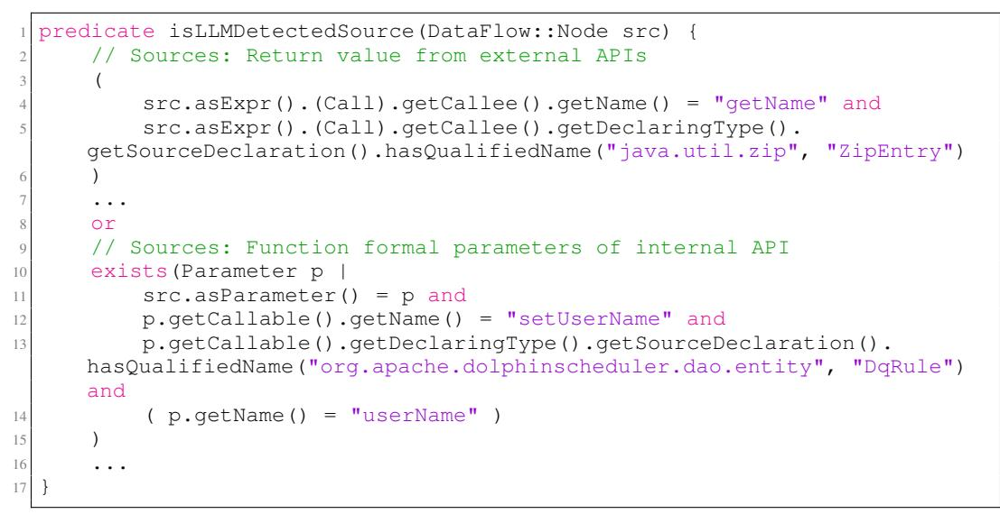

リスト4: ソース仕様のためのCodeQL述語である。

```
1 predicate isLLMDetectedSink(DataFlow::Node snk) {
2 exists(Call c |
3 c.getCallee().getName() = "createTempFile" and
4 c.getCallee().getDeclaringType().getSourceDeclaration().
    hasQualifiedName("java.io", "File") and
5 ( c.getArgument(0) = snk.asExpr().(Argument) )
6 )
7 or
8 ...
9 }
```

リスト5: Sink指定のためのCodeQL述語。

## A.5 VISUALIZATION OF METRICS

Fig. [10.](#page-18-0) において、*VulDetected* メトリクスの可視化を提供する。評価のため、プロジェクト P のラベルは、重要なプログラムポイント V<sup>P</sup> vul = {V1, . . . , Vn} の集合として与えられるものと仮定する。脆弱なパスはこれらのポイントを通過すべきである。実際には、これらは通常、各脆弱性レポートから収集できる修正済みメソッドである。Fig. [10,](#page-18-0) に示すように、検出された脆弱なパスの少なくとも一つが対象の脆弱性に対して修正された箇所を通過すれば、当該脆弱性が検出されたものとみなす。*Paths*<sup>P</sup> は、各プロジェクト P における前段階で検出されたパスの集合である。プロジェクト P 内の脆弱なパスは次のように定義される。

*VulPaths*(P) = {*Path* ∈ *Paths*<sup>P</sup> | *Path* ∩ V<sup>P</sup> vul ̸= ∅}

## B ADDITIONAL DETAILS OF CWE-BENCH-JAVA

## B.1 DETAILS OF DATASET EXTRACTION PROCESS

静的解析のためにCodeQLを使用しているため、各プロジェクトのデータフローグラフを抽出するために、さらに各プロジェクトをビルドする必要がある。そのためには、各プロジェクトをビルドする際に正しいものを特定する必要がある。

<span id="page-18-0"></span>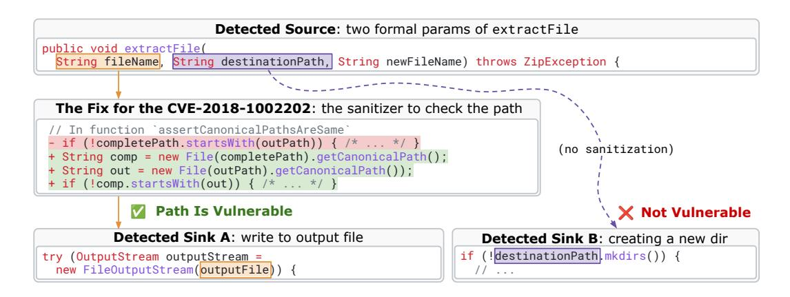

Figure 10: 我々の脆弱性検出に用いる指標の可視化である。スニペットはZip4j v2.11.5-2から適応し、より明確な提示のために若干の変更を加えている。両方のsinkがPath-Traversal（CWE-22）となる可能性があるが、左側のデータフローパスのみが修正済みサニタイザ関数を通過している。そのため、左側のパスのみを脆弱性として考慮する。

<span id="page-18-1"></span>

| Step                      | CWE-22 | CWE-78 | CWE-79 | CWE-94 | Total |
|---------------------------|--------|--------|--------|--------|-------|
| Initial CVEs              | 236    | 39     | 681    | 109    | 1065  |
| W/ Github URL and Version | 119    | 37     | 219    | 55     | 430   |
| W/ Fix Commit             | 89     | 27     | 99     | 50     | 265   |
| Compilable                | 56     | 17     | 50     | 26     | 149   |
| Fixes in Java Code        | 56     | 16     | 25     | 47     | 144   |
| Manual Validation         | 55     | 13     | 31     | 21     | 120   |

表4：脆弱性データセット収集統計である。

JavaおよびMavenのコンパイラバージョン。各プロジェクトを異なる組み合わせのJavaおよびMavenバージョンでビルドしようとする半自動スクリプトを開発した。Table [4](#page-18-1)の4行目は、ビルドに成功したプロジェクト数を示している。全体として、これは(⋆)149件のプロジェクトという結果である。

最後に、各修正コミットを手動で確認し、そのコミットが実際にJavaファイル内で指定されたCVEの修正を含んでいるかどうかを検証する。例えば、場合によっては修正が他の言語（ScalaやJSPなど）で記述されたファイルに存在することがある。プロジェクト内の他言語で書かれたコードが実行時やコンパイル時にJavaコンポーネントへ流入する可能性はあるが、静的解析がそのような脆弱性を正確に検出できるかどうかを正しく判断することはできない。したがって、そのようなCVEは除外する。また、依存関係に存在した脆弱性がバージョンアップグレードのみで修正された場合や、脆弱性が誤分類されていた場合も除外する。最終的に、IRISで評価するプロジェクトは（⋆）120件となる。本タスクにおいては、CVEをプロジェクトの２名の共著者に分担し、それぞれが独立して各ケースを検証する。共著者同士で結果をクロスチェックし、議論を重ねて最終的なプロジェクトリストをまとめる。

本研究の特徴に最も近いデータセットは、[Li et al.](#page-11-13) [\(2023a\)](#page-11-13) によって作成されたJavaデータセットであり、165件のCVEが含まれている。しかし、当初は彼らのデータセットを利用することも検討したが、いくつかの問題が判明した。第一に、彼らのデータセットにはビルドスクリプトが付属しておらず、各プロジェクトをCodeQLで自動的に実行することが困難であった。第二に、ほとんどのCWEに対してCVEの数が非常に少なく、異なる脆弱性クラスに対するツールの詳細な分析が困難であった。最後に、より多くのCVEを収集するための自動化されたスクリプトも提供されていなかった。そのため、自身でデータセットを作成し、本フレームワークはさらに多くの脆弱性クラスへ容易に拡張できるようにした。

B.2 当方のCWE-BENCH-JAVAと既存の脆弱性データセットとの比較

CWE-Bench-Javaを、Java、C、C++のコードベースにおける脆弱性検出のための既存のデータセットと、以下の基準で比較する。

<span id="page-19-0"></span>

| データセット              | 言語              | CVE情報 | 実際の事例 | 修正箇所      | コンパイル可 | 精査済み |
|--------------------------|------------------|----------|------------|---------------|------------|--------|
| BigVul                   | C/C++            | ✓        | ✓          | ✗             | ✗          | ✗      |
| Reveal                   | C/C++            | ✗        | ✓          | ✗             | ✗          | ✗      |
| CVEFixes                 | C/C++, Java, ... | ✓        | ✓          | ✓             | ✓          | ✗      |
| DiverseVul               | C/C++            | ✗        | ✓          | ✓             | ✗          | ✗      |
| DeepVD                   | C/C++            | ✗        | ✓          | ✗             | ✗          | ✗      |
| Juliet                   | C++, Java        | ✗        | ✗          | ✓             | ✓          | ✓      |
| Li et al. (2023a)        | Java             | ✓        | ✓          | ✓             | ✗          | ✓      |
| SVEN (He & Vechev, 2023) | C++              | ✗        | ✓          | ✓             | ✗          | ✓      |
| CWE-Bench-Java (Ours)    | Java             | ✓        | ✓          | ✓             | ✓          | ✓      |

|  |  |  |  |  | 表5：CWE-Bench-Javaと既存の脆弱性データセットとの比較である。 |  |
|--|--|--|--|--|-----------------------------------------------------------------------------|--|
|  |  |  |  |  |                                                                             |  |
|  |  |  |  |  |                                                                             |  |

- 1. CVE情報：データセットにCVEメタデータが含まれているかどうか。
- 2. 実世界: データセットが実世界のプロジェクトを含んでいるかどうか。
- 3. 修正箇所：データセットが脆弱性に関する修正情報を含むかどうか。
- 4. コンパイル可能性：データセットがプロジェクトのエンドツーエンドかつ自動的にコンパイル可能であることを保証しているかどうか；
- 5. 精査済み: データセット内の脆弱性が手動で検証され、確認されているかどうかである。

表[5](#page-19-0)に示すように、既存のデータセットと比較して、CWE-Bench-Javaはすべての基準を満たしている唯一のものである。このことは本新規データセットの重要性を強調するものである。

## C EVALUATION DETAILS

#### C.1 EXPERIMENTAL SETTINGS

我々は評価のために、OpenAIのクローズドソースLLMであるGPT 4（gpt-4-0125-preview）とGPT 3.5（gpt-3.5-turbo-0125）を選択する。本論文で使用するGPT 4およびGPT 3.5へのクエリは、2024年4月および5月にOpenAI APIを通じて実施した。

また、huggingface APIを通じて、6つの最先端のオープンソースLLMの命令調整版を選定する：Llama 3 8Bと70B、DeepSeekCoder 7B、QWEN-2.5-Coder 32B、そしてGemma-2 27Bである。オープンソースLLMの実行には2グループのマシンを使用する。1つ目は2.50GHzのIntel Xeonマシンで、40CPU、GeForce RTX 2080 Ti GPUを4基、750GBのRAMを搭載している。もう1つは3.00GHzのIntel Xeonマシンで、48CPU、A100を8基、1.5TのRAMを有する。

我々は静的解析の基盤としてCodeQLバージョン2.15.3を使用している。CodeQLには、throw文とそれに最も近いtry-catchブロック間のDataflowエッジを強化する追加機能をパッチとして適用している。我々のパッチのベースとしては、[このCodeQLのプルリクエスト](https://github.com/github/codeql/pull/9914)を使用している。

#### C.2 CODEQL BASELINE

CodeQLとのベースライン比較のために、CodeQL 2.15.3に付属している各CWE専用に設計された組み込みのSecurityクエリを使用する。各CWEには複数のセキュリティクエリが存在し、それぞれ異なるレベル（エラー、警告、推奨）のアラームを生成することに注意が必要である。各CWEについては、すべてのクエリによって生成されたアラートの合計（和集合）を取得し、異なるレベルのアラームを区別しない。例えば、CWE-22の脆弱性を検出するためにCodeQLには、TaintedPath、TaintedPathLocal、およびZipSlipの3つのクエリが存在する。TaintedPathとZipSlipはエラーレベルのアラームを生成する一方で、TaintedPathLocalは推奨のみを出す。CodeQLの利点として、我々の比較ではすべてのアラームを等しく扱う。

C.3 ハイパーパラメータおよびFew-shot例

IRISにおいては、外部および内部APIをラベリングするために2つのプロンプトを使用している。プロンプトにはバッチ化されたAPIが含まれていることを思い出してほしい。内部APIにはバッチサイズ20、外部APIにはバッチサイズ30を使用している。外部APIのラベリング時に使用するfew-shot例については、CWE-22には4例、CWE-78には3例、CWE-79には3例、CWE-94には3例を用いている。全てのLLMによる推論では、温度は0、最大トークン数は2048、top-pは1に設定している。GPT 3.5およびGPT 4については、可能な限りランダム性を抑制するためシードも固定している。

#### C.4 DETAILS OF SELECTED LLMS

7つの選定されたLLMのバージョンを表[6.](#page-20-0)に示す。

表6：本評価で選定したLLMのバージョンおよびモデルID。

| LLMバージョンとサイズ         | モデルID                                  |
|-----------------------------|----------------------------------------|
| GPT 4                       | gpt-4-0125-preview                     |
| GPT 3.5                     | gpt-3.5-turbo-0125                     |
| Llama 3 8B                  | meta-llama/Meta-Llama-3-8B-Instruct    |
| Llama 3 70B                 | meta-llama/Meta-Llama-3-70B-Instruct   |
| DeepSeekCoder 7B            | deepseek-ai/deepseek-coder-7b-instruct |
| Qwen-2.5-Coder 32B Instruct | Qwen/Qwen2.5-Coder-32B-Instruct        |
| Gemma-2 27B                 | google/gemma-2-27b-it                  |

#### C.5 STATISTICS OF UNIQUE AND RECURRING SPECIFICATIONS

<span id="page-20-1"></span>表7：CWE-Bench-Java内の全プロジェクトにおけるユニークなソースおよびシンクの仕様である。

表8：CWE-Bench-Javaにおける再発するソースおよびシンクの仕様である。

| CWE             | 22   | 78  | 79  | 94   | CWE                | 22  | 78  | 79   | 94  |
|-----------------|------|-----|-----|------|--------------------|-----|-----|------|-----|
| #Unique Sources | 1348 | 899 | 598 | 810  | #Recurring Sources | 908 | 232 | 1118 | 626 |
| #Unique Sinks   | 1069 | 575 | 514 | 1281 | #Recurring Sinks   | 919 | 201 | 911  | 961 |

継続的な汚染仕様推論が必要である。我々の結果は、一意のものおよび再発するソースやシンクが多数存在することを示している。表[7](#page-20-1)は、CWE-Bench-Javaにおいて単一のプロジェクトでのみ発生する推論されたソースおよびシンク仕様の数を示しており、表[8](#page-20-1)は、少なくとも二つのプロジェクトで発生する仕様を示している。これは、以前に推論された仕様が有用であったとしても、依然として多くの新たな関連APIが残されており、効果的な脆弱性検出のためにラベル付けが必要であることを示唆している。この観察結果は、CodeQLのような固定された仕様コーパスに依存するのではなく、各プロジェクトごとにLLMsを用いてこれらの仕様を*オンザフライ*で推論するIRISの設計を強く動機付けている。

#### C.6 STATISTICS OF INFERRED TAINT SPECIFICATIONS

表[9.](#page-20-2)に推論された汚染仕様の統計を示す。パーセンテージが示すように、GPT-4はDeepSeekCoder 7Bのような小規模なLLMよりも、より少ないソースとシンクのセットを生成している。

<span id="page-20-2"></span>表9: CWEごとおよび全体におけるGPT-4およびDeepSeekCoder（DSC）7Bによってソース（S）またはシンク（N）としてラベル付けされたAPI候補の比率である。

| CWE   | #Cand.  | GPT-4 |       | DSC 7B |       |
|-------|---------|-------|-------|--------|-------|
|       |         | %S    | %N    | %S     | %N    |
| 22    | 130,974 | 2.03% | 1.90% | 4.27%  | 4.01% |
| 78    | 25,605  | 4.73% | 3.37% | 3.67%  | 3.33% |
| 79    | 37,138  | 5.69% | 4.69% | 4.28%  | 4.56% |
| 94    | 36,325  | 5.12% | 7.83% | 6.11%  | 6.21% |
| Total | 230,042 | 3.41% | 3.45% | 4.50%  | 4.37% |

#### C.7 ERROR ANALYSIS: CAUSE OF UNDETECTED VULNERABILITIES

一般的に、IRISを用いることで発見されない脆弱性の主な原因として、以下の三つが挙げられる。

- 1. 脆弱性は単純なテイントデータフローによってモデル化できない場合がある。例えば、脆弱性CVE-2020-11977（CWE-94）は、予期しないexit(1)呼び出しによって現れるが、そこに直接テイントデータフローが流れ込んでいるわけではない。実際には、テイントデータフローはexitを囲む「if」文の条件部分に流れ込んでいる。この場合、シンクAPIのモデルでは脆弱性を捉えることができない。
- 2. 副作用によるデータフローエッジの欠如: 例えば、汚染情報が一時ファイルに書き込まれ、後に同じファイルから読み込まれることで脆弱性が生じる場合がある。しかし、データフローエッジが副作用を通じて伝達されており、これはCodeQLでは検出されない。
- 3. ライブラリの使用が明示されていないことによるデータフローエッジの欠落：脆弱性はライブラリの具体的な使用によってのみ顕在化する。しかし、ライブラリ自体の中では、ソースとシンクを結ぶ可能なデータフローは存在しない。

全体として、上記は静的解析における一般的な制限であると考える。LLM による偽陰性に関して、主な失敗モードは以下の2つである。

- 1. LLMからのtaint-propagatorラベルが欠落している場合、ソースからシンクへのデータフローエッジが欠落し、フローが遮断される原因となる。
- 2. LLMからのソースまたはシンクの指定が欠落している場合：関連するソースやシンクの指定が存在しない場合、静的解析ツールは解析のためのアンカーを持たない。

## D ANALYSIS RUNTIME

統計情報を含む完全な表を掲載し、プロジェクトおよび分析についてより詳細な情報を提供する（表[10\)](#page-21-0）。各プロジェクトについて、対応するCWE ID、ソースコード行数（SLOC）、完全な分析の実行時間、候補API数、Llama 3 8Bによるラベル付けされたソースおよびシンクの数を示している。さらに、注目すべきセルには色分けを行う。SLOCについては、1Mを超える場合は赤色、100kを超える場合は黄色で表示する。実行時間については、1時間以上の場合は赤色、5分以上の場合は黄色で表示する。候補数については、10kを超える場合は赤色で表示する。最後に、ソースおよびシンクの数については、200を超える場合は赤色で表示する。

<span id="page-21-0"></span>表10：すべてのプロジェクトにおける解析ランタイム、候補、推論されたソースおよびシンクの詳細（Llama 3 8B）。

| CWE-ID | Project         | SLOC    | Time | #Candidates | #Sources | #Sinks |
|--------|-----------------|---------|------|-------------|----------|--------|
| 22     | DSpace          | 218.2K  | 15s  | 3.61K       | 162      | 217    |
| 22     | spark           | 10.7K   | 1m   | 679         | 35       | 27     |
| 22     | spark           | 9.77K   | 57s  | 598         | 33       | 22     |
| 22     | wildfly         | 496.28K | 4m   | 14.13K      | 457      | 425    |
| 22     | vertx-web       | 51.01K  | 1m   | 2.06K       | 80       | 77     |
| 22     | camel           | 1.16M   | 8m   | 293         | 22       | 9      |
| 22     | hutool          | 135.34K | 4m   | 6.17K       | 115      | 211    |
| 22     | tika            | 106.3K  | 2m   | 3.84K       | 277      | 177    |
| 22     | retrofit        | 19.28K  | 1m   | 880         | 28       | 13     |
| 22     | jspwiki         | 149.45K | 1m   | 1.83K       | 62       | 80     |
| 22     | camel           | 1.21M   | 11m  | 4.43K       | 53       | 80     |
| 22     | tapestry-5      | 160.06K | 1m   | 3.04K       | 91       | 66     |
| 22     | spring-cloud-co | 18.56K  | 1m   | 1.16K       | 40       | 64     |
| 22     | spring-cloud-co | 18.44K  | 59s  | 1.16K       | 40       | 64     |
| 22     | rocketmq        | 94.64K  | 1m   | 2.78K       | 28       | 54     |
| 22     | mpxj            | 181.55K | 1m   | 1.6K        | 37       | 43     |
| 22     | flink           | 1.14M   | 2h   | 5.16K       | 39       | 61     |

（これは جدولデータであり、解説文や説明文は含まれていないため、翻訳するべきプローズが存在しない。従って、翻訳すべき内容はない。）

| 79 | json-sanitizer  | 1.47K   | 52s | 67     | 4   | 5   |
|----|-----------------|---------|-----|--------|-----|-----|
| 79 | hawkbit         | 112.09K | 1m  | 4.07K  | 144 | 151 |
| 79 | nacos           | 203.78K | 2m  | 4.08K  | 201 | 139 |
| 79 | antisamy        | 4.93K   | 1m  | 362    | 43  | 34  |
| 79 | esapi-java-lega | 35.26K  | 1m  | 1.48K  | 107 | 85  |
| 79 | antisamy        | 5.14K   | 1m  | 377    | 44  | 36  |
| 79 | jolokia         | 29.97K  | 1m  | 1.66K  | 117 | 97  |
| 79 | keycloak        | 60.6K   | 1m  | 2.1K   | 170 | 136 |
| 79 | cxf             | 722.83K | 15m | 15.09K | 766 | 710 |
| 79 | sling-org-apach | 1.37K   | 55s | 136    | 4   | 13  |
| 79 | DSpace          | 237.33K | 2m  | 3.67K  | 347 | 320 |
| 79 | keycloak        | 615.6K  | 3h  | 13.37K | 606 | 461 |
| 79 | keycloak        | 615.6K  | 3h  | 13.37K | 606 | 461 |
| 79 | xwiki-commons   | 105.92K | 1m  | 3.94K  | 244 | 151 |
| 79 | xwiki-commons   | 105.94K | 1m  | 3.94K  | 244 | 151 |
| 79 | xwiki-rendering | 97.01K  | 1m  | 1.22K  | 73  | 92  |
| 79 | xwiki-commons   | 106.87K | 1m  | 3.99K  | 254 | 161 |
| 79 | jspwiki         | 158.7K  | 1m  | 2.22K  | 176 | 126 |
| 79 | keycloak        | 617.15K | 4h  | 14.04K | 643 | 479 |
| 79 | xwiki-commons   | 107.09K | 1m  | 3.03K  | 209 | 143 |
| 79 | jstachio        | 53.02K  | 54s | 792    | 40  | 46  |
| 79 | xwiki-rendering | 97.63K  | 1m  | 1.24K  | 74  | 92  |
| 94 | spring-security | 43.9K   | 1m  | 1.83K  | 120 | 176 |
| 94 | xstream         | 52.25K  | 1m  | 1.64K  | 111 | 145 |
| 94 | cron-utils      | 13.08K  | 1m  | 476    | 13  | 26  |
| 94 | struts          | 160.51K | 12m | 4.39K  | 301 | 357 |
| 94 | activemq        | 547.68K | 1h  | 7.55K  | 370 | 607 |
| 94 | spring-framewor | 666.11K | 45m | 17.71K | 688 | 846 |
| 94 | spring-cloud-ga | 25.56K  | 1m  | 2.01K  | 130 | 153 |
| 94 | dubbo           | 175.63K | 2m  | 6.73K  | 342 | 383 |
| 94 | incubator-dubbo | 96.35K  | 1m  | 3.68K  | 194 | 255 |
| 94 | spring-security | 57.34K  | 1m  | 2.43K  | 192 | 234 |
| 94 | kubernetes-clie | 806.35K | 3m  | 2.33K  | 93  | 130 |
| 94 | commons-text    | 24.87K  | 1m  | 962    | 40  | 47  |
| 94 | ff4j            | 46.21K  | 1m  | 2.39K  | 133 | 274 |
| 94 | spring-boot-adm | 18.29K  | 1m  | 1.83K  | 92  | 157 |
| 94 | sqlite-jdbc     | 17.71K  | 59s | 732    | 50  | 74  |
| 94 | nifi            | 993.76K | 25m | 57     | 2   | 11  |
| 94 | rocketmq        | 108.39K | 2m  | 3.4K   | 117 | 164 |
| 94 | nifi            | 1.01M   | 27m | 261    | 27  | 24  |
| 94 | rocketmq        | 197.78K | 2m  | 6.28K  | 205 | 252 |
| 94 | dolphinschedule | 154.95K | 4m  | 5.78K  | 229 | 353 |
| 94 | dolphinschedule | 154.95K | 4m  | 5.78K  | 229 | 353 |
