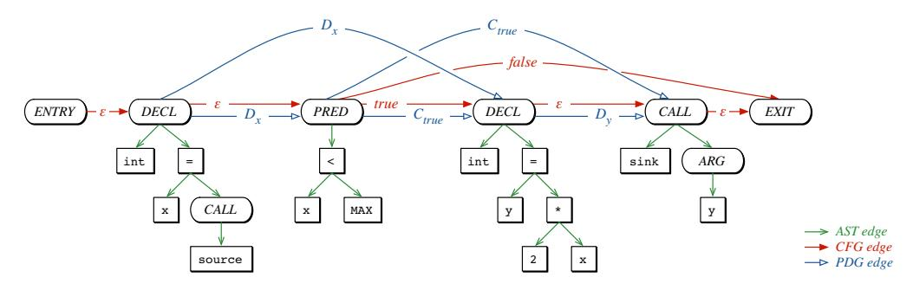

# Modeling and Discovering Vulnerabilities with Code Property Graphs

ファビアン・ヤマグチ∗、ニコ・ゴルデ†、ダニエル・アルプ∗、そしてコンラッド・リーク∗  
∗ゲッティンゲン大学、ドイツ  
†クアルコムリサーチ・ジャーマニー

*Abstract*—現在発生しているセキュリティ侵害の大多数は、不適切なコードが直接的な原因となっています。そのため、コンピュータシステムの防御は、ソフトウェア内の脆弱性を厳密に特定することに大きく依存していますが、これは専門的な知識を必要とし、手間がかかりミスも発生しやすい作業です。残念ながら、たった一つの不具合でもシステムのセキュリティを損なうのに十分であり、監査しなければならないコードの膨大さが攻撃者に有利に働いてしまいます。本論文では、大量のソースコードから効果的に脆弱性を抽出する手法を提案します。そのために、抽象構文木、制御フローグラフ、プログラム依存グラフといった古典的なプログラム解析の概念を統合した、*code property graph* という新しいソースコードの表現法を導入します。この包括的な表現により、たとえばバッファオーバーフローや整数オーバーフロー、フォーマット文字列脆弱性、メモリ情報漏洩など、一般的な脆弱性のテンプレートを*グラフトラバーサル*で巧みにモデル化することが可能になります。私たちはこの手法を一般的なグラフデータベース上で実装し、Linuxカーネルのソースコードから18件のこれまで未報告の脆弱性を特定することで、その有効性を示しました。

#### *Keywords*—*Vulnerabilities; Static Analysis; Graph Databases*

#### I. INTRODUCTION

コンピュータシステムのセキュリティは、基本的にその基盤となるソフトウェアの品質に依存しています。学術界や産業界で長年にわたる研究が行われてきたにもかかわらず、セキュリティ脆弱性はプログラムコード内に定期的に現れます。例えば、バッファの境界を考慮しなかったり、入力データの検証が不十分だったりすることが挙げられます。その結果、ソフトウェアの脆弱性は、今日におけるセキュリティ侵害の主な原因の一つであり続けています。例えば、2013年には、ユニバーサルプラグアンドプレイライブラリにおけるたった一つのバッファオーバーフローによって、2,300万台以上のルーターがインターネットからの攻撃に対して脆弱になりました [26]。同様に、現在でも何千人ものユーザーが、Java ランタイム環境のさまざまな欠陥を悪用するウェブベースのマルウェアの被害に遭っています [29]。

ソフトウェアの脆弱性発見は、古くからあるものの依然として困難なセキュリティの課題です。あるプログラムが別のプログラムの非自明な特性を識別できないため、ソフトウェア脆弱性の発見という一般的な問題は決定不能です[33]。その結果、現在利用されているセキュリティ欠陥の発見手法は、特定の種類の脆弱性のみに限定されているか、あるいは手作業による煩雑な監査に頼るものとなっています。特に、オペレーティングシステムのカーネルのような大規模ソフトウェアプロジェクトを保護する作業は、非常に困難であり、たったひとつの欠陥がコードベース全体のセキュリティを損なうおそれがあります。バッファオーバーフローやフォーマット文字列の脆弱性のように、ソフトウェア分野全体で長年繰り返し現れている脆弱性クラスも存在しますが、これらが特定のソフトウェアプロジェクト内でどのように現れるかを自動的に検出することは、依然として高度な専門知識がなければ困難な場合が多いのです[16]。

この状況の結果として、セキュリティ研究は当初、特定の種類の脆弱性、例えば安全でないライブラリ関数によって引き起こされる欠陥や、バッファオーバーフロー、整数オーバーフロー、不十分な入力データの検証などを静的に発見することに焦点を当てていました。その後、ソフトウェアテストの概念に基づき、単純なファズテストから高度なテイントトラッキングやシンボリック実行まで、動的プログラム解析を用いることで、より広範な脆弱性の検出が可能となりました。これらの手法はさまざまな種類の欠陥を発見できますが、実際には効率的に運用することが難しく、実行時間が非常に長くなったり、考慮すべき実行経路が指数関数的に増加するため、適切な結果を得られないことがしばしばあります。この課題への対応策として、近年のセキュリティ研究では、分析者を置き換えるのではなく監査中に支援するようなアプローチの検討が始まっています。提案された手法は、専門家の知識を静的プログラム解析に取り入れることで監査プロセスを効率化し、脆弱性の探索を効果的に導くことができます。

本論文では、この研究の方向性を継続し、大量のソースコードから脆弱性を抽出するための新しい手法を提案します。私たちの手法は、プログラム解析の古典的な概念と、グラフマイニング分野の最新の発展を組み合わせたものです。本手法の根本的な洞察は、多くの脆弱性はコードの構造、制御フロー、依存関係を同時に考慮することで初めて十分に発見できるという点にあります。この要件を満たすため、*code property graph* と呼ばれるソースコードの新しい表現方法を導入します。このグラフは、抽象構文木、制御フローグラフ、プログラム依存グラフの特性を一つのデータ構造で統合しています。この包括的なコードの見方により、*graph traversals* を用いて一般的な脆弱性のテンプレートを自分たちの手法で簡潔にモデル化することが可能です。データベースのクエリと同様に、グラフトラバーサルは code property graph を横断し、コードの構造、制御フロー、および各ノードに関連付けられたデータ依存性を調査します。このようにコードの異なる特性にまとめてアクセスできることで、さまざまな種類の欠陥のために簡潔なテンプレートを作成することが可能となり、大量のコードの脆弱性監査を支援します。

私たちは一般的なグラフデータベースを用いて本手法を実装し、バッファオーバーフロー、整数オーバーフロー、フォーマット文字列脆弱性、メモリ漏洩など、よく知られた複数の脆弱性タイプに対するグラフトラバーサルを設計することで、その実用的な利点を示します。事例として、大規模で厳密に監査されているコードベースであるLinuxカーネルのソースコードを分析します。私たちは、報告されているほぼすべての脆弱性が

© 2014, Fabian Yamaguchi. IEEEのライセンスのもとで提供。DOI 10.1109/SP.2014.44

2012年時点のLinuxカーネルは、コードプロパティグラフにおけるトラバーサルによって記述することができます。オープンソースコミュニティによるカーネルのセキュリティ向上への多大な努力にもかかわらず、これらのトラバーサルを利用することで、Linuxカーネルに存在する*18件の未発見の脆弱性*を見つけ出すことができました。これは、コードプロパティグラフの実践的な有用性を示しています。

まとめとして、私たちは脆弱性発見の問題に対して以下の貢献を行いました。

- *コードプロパティグラフ.* 私たちは、抽象構文木、制御フローグラフ、およびプログラム依存グラフの特徴を組み合わせた、ソースコードの新しい表現を共同データ構造として導入します。
- *脆弱性タイプのためのトラバーサル。* 一般的な脆弱性タイプは、コードプロパティグラフのトラバーサルとして巧みにモデル化でき、効率的な検出テンプレートの作成につながることを示します。
- *効率的な実装。* コードプロパティグラフをグラフデータベースにインポートすることにより、Linuxカーネルのような大規模なコードベース上でもトラバーサルを効率的に実行できることを示します。

この論文の残りの構成は以下の通りです。第II節ではコードの表現に関する背景情報を提供し、第III節ではプロパティグラフおよびグラフトラバーサルの概念を定義します。第IV節では私たちの新しい表現であるコードプロパティグラフを導入し、第V節ではそれが脆弱性の特徴付けにどのように利用できるかを示します。第VI節では私たちの手法を評価します。関連研究および限界については、それぞれ第VII節と第VIII節で議論します。第IX節が論文のまとめとなります。

#### II. REPRESENTATIONS OF CODE

プログラム解析やコンパイラ設計の分野では、プログラムの特性を理解するために様々なコード表現が開発されてきました。これらの表現は主にコードの解析や最適化を目的として設計されていますが、本稿で示すようにコードの特徴を記述するのにも適しています。特に、私たちは*抽象構文木*、*制御フローグラフ*、*プログラム依存グラフ*という三つの古典的な表現に注目し、脆弱性発見へのアプローチの基盤としています。コード表現についての詳細な議論はAhoらの著書[1]にまとめられています。

| void foo()        | 1 |
|-------------------|---|
| {                 | 2 |
| int x = source(); | 3 |
| if (x < MAX)      | 4 |
| {                 | 5 |
| int y = 2 * x;    | 6 |
| sink(y);          | 7 |
| }                 | 8 |
| }                 | 9 |

図1：例となるコードサンプル（図2を参照）。

このセクション全体を通してさまざまな表現を説明するシンプルな例として、Figure 1 に示すコードサンプルを取り上げます。

#### *A. Abstract Syntax Trees (AST)*

抽象構文木は、通常、コンパイラのコードパーサーによって生成される最初の中間表現のひとつであり、多くの他のコード表現を生成する際の基盤となります。これらの木構造は、文や式がどのように入れ子になってプログラムが構成されているかを忠実にエンコードします。しかし、*パースツリー*とは異なり、抽象構文木はもはやプログラムを表現するために選択された具体的な構文を表現しません。例えば、C言語では、カンマで区切られた宣言のリストは、通常、2つの連続した宣言と同じ抽象構文木を生成します。

抽象構文木は順序付き木であり、内部ノードは *演算子*（例えば、加算や代入）を表し、葉ノードは *オペランド*（例えば、定数や識別子）に対応します。例として、Figure 2a は Figure 1 に示されたコードサンプルの抽象構文木を示しています。抽象構文木は単純なコード変換に適しており、意味的に類似したコードの特定にも利用されてきましたが [3, 43]、より高度なコード解析、例えばデッドコードや未初期化変数の検出には適用できません。この欠点の理由は、このコード表現では制御フローやデータ依存関係が明示されていないためです。

### *B. Control Flow Graphs (CFG)*

制御フローグラフは、コードの文が実行される順序や、特定の実行経路が選択されるために満たすべき条件を明示的に記述します。このために、文や述語はノードとして表され、それらは制御の移動を示す有向エッジで接続されます。これらのエッジは抽象構文木の場合のように順序付けられている必要はありませんが、各エッジには*true*、*false*、または-のラベルを割り当てる必要があります。特に、文ノードは1本の出方向きエッジがあり、それは-のラベルが付けられ、述語ノードは述語の評価結果が*true*か*false*かに対応する2本の出方向きエッジを持ちます。制御フローグラフは、抽象構文木から2段階の手順で構築できます。まず、構造化された制御文（例：*if*、*while*、*for*）を考慮して仮の制御フローグラフを作成します。次に、その仮グラフを、*goto*、*break*、*continue*のような非構造的な制御文も考慮して修正します。Figure 2bは、Figure 1で示したコードサンプルのCFGを表しています。

制御フローグラフは、セキュリティの文脈においてさまざまな用途で利用されています。たとえば、既知の悪意のあるアプリケーションの亜種を検出したり [11]、ファズテストツールを支援したりする目的です [37]。さらに、プログラム解析を助けるための標準的なコード表現としてリバースエンジニアリングにおいても使用されています。しかし、制御フローグラフはアプリケーションの制御フローを明示する一方で、データフロー情報を提供できません。特に脆弱性分析においては、これにより制御フローグラフだけでは攻撃者によって影響を受けるデータを処理する文を容易に特定することができないことを意味します。

## *C. Program Dependence Graphs (PDG)*

Ferrante ら[9]によって導入されたプログラム依存グラフは、もともとプログラムスライスを実行するために開発されました。

Fig. 2: 図1の例に対するコードの表現を示しています。プログラム依存グラフでは、制御依存関係とデータ依存関係がCとDで示されています。

[41]、つまり、指定された文における変数の値に影響を与えるプログラム内のすべての文や述語を決定することを指す。プログラム依存グラフは、文や述語間の依存関係を明示的に表現する。特に、このグラフは2種類のエッジを用いて構築される。1つは、ある変数が別の変数に及ぼす影響を表すデータ依存エッジであり、もう1つは述語が変数の値に及ぼす影響に対応する制御依存エッジである。プログラム依存グラフのエッジは、各文や述語によって*定義*される変数と*使用*される変数の集合をまず特定し、それぞれの文や述語に対して*到達定義*を計算することで、制御フローグラフから算出することができる。これはコンパイラ設計の標準的な問題である[1を参照]。

例として、Figure 2c は Figure 1 に示されているコードサンプルのプログラム依存グラフを示しています。ここで注意すべき点は、制御依存のエッジは単なる制御フローのエッジではなく、特にステートメントが実行される順序はこのグラフからはもはや判断できない一方で、ステートメントと述語との間の依存関係は明確に可視化されているということです。

#### III. PROPERTY GRAPHS AND TRAVERSALS

提示された各表現は、それぞれが異なる観点からソースコードを捉えており、基盤となるプログラムの異なる側面を強調しています。これらの視点を統合して脆弱性発見のための共通表現へとまとめるために、私たちは*プロパティグラフ* [34] の概念を用います。これは、多くのグラフデータベース（例えば ArangoDB、Neo4J、OrientDB など）で使われる構造化データの基本的な表現方法です。形式的には、プロパティグラフは次のように定義されます。

定義1．*プロパティグラフ* G = (V, E, λ, μ) とは、有向でエッジにラベルが付き、属性を持つ多重グラフである。ここで、V はノードの集合、E ⊆ (V × V) は有向エッジの集合である。λ : E → Σ はエッジラベリング関数であり、アルファベットΣから各エッジにラベルを割り当てる。エッジおよびノードには、μ : (V ∪ E) × K → S という関数によってプロパティを割り当てることができる。ここで、K はプロパティキーの集合、S はプロパティ値の集合である。

Figure 3 は、4 つのノードからなる単純なプロパティグラフを示しています。プロパティグラフは多重グラフでもあるため、たとえば Figure 3 のノード A と B のように、2 つのノードが複数のエッジで接続される場合もあることに注意してください。さらにこの例では、各ノードに k ∈ K というキーを持つプロパティが割り当てられており、ノード A と B のみが S = {x, w} という集合からプロパティ値を保持しています。

Fig. 3: プロパティグラフの例。ノードに割り当てられたプロパティは破線で示されています。

プロパティグラフから情報を抽出する主な手段は、いわゆる *グラフトラバーサル*、または短く *トラバーサル* と呼ばれる手法です。これは、ラベルやプロパティに応じてグラフ上のエッジに沿って移動するために使われます。形式的には、グラフのトラバーサルは以下のように定義されます。

定義2．*traversal* とは、性質グラフ G に従って、ノードの集合から別のノードの集合へと写像する関数 T : P(V ) → P(V ) のことである。ここで、P は V のべき集合を表す。

この汎用的な定義により、複数のトラバーサルを連結して使うことができます。例えば、2つのグラフトラバーサル T0 と T1 は、関数合成 ◦ を用いて T0 ◦ T1 のように連結することができます。この連結に基づいて、いくつかの基本的なトラバーサルを定義できます。これらは、本論文で取り上げる他のすべてのトラバーサルを構築する際の基礎となります。まずは単純なフィルタートラバーサルを定義します。

$$
\text{Filter}_p(X) = \{ v \in X : p(v) \}
$$

これは、Xの集合内のすべてのノードについて、たとえば特定のプロパティをチェックすることで、ブール述語p(v)に一致するノードを返します。

プロパティグラフのエッジに沿って移動するために、以下の順方向トラバーサルを定義します。

$$
OUT(X) = \bigcup_{v \in X} \{u : (v, u) \in E\},\
$$

集合 $X$ に含まれる各頂点 $v$ から出る辺 $(v, u)$ において、$u$ となる全ての頂点の集合である。

$$
OUT_l(X) = \bigcup_{v \in X} \{u : (v, u) \in E かつ \lambda((v, u)) = l\},\
$$

$$
OUT_l^{k,s}(X) = \bigcup_{v \in X} \{u : (v, u) \in E \text{ かつ } \lambda((v, u)) = l
$$

そして $\mu((v, u), k) = s\}$

これは、ノード集合Xから到達可能なノードを返します。詳細には、トラバーサルOUTはXから到達可能なすべてのノードを返し、OUTlはラベルlを持つエッジを通じて到達可能なノードをすべて返し、OUTk,s lはラベルlとプロパティk:sを持つエッジを通じて到達可能なノードをすべて返します。同様に、グラフ内で後方に移動するためのトラバーサルIN、INl、およびINk,s lを定義します。

$$
IN(X) = \bigcup_{u \in X} \{v : (v, u) \in E\},\
$$

（$X$ に含まれるすべての $u$ について、$(v, u)$ が $E$ に属するような $v$ の集合の和集合として定義されます。）

$$
IN_l(X) = \bigcup_{u \in X} \{v : (v, u) \in E \text{ かつ } \lambda((v, u)) = l\},\
$$

$$
IN_l^{k,s}(X) = \bigcup_{u \in X} \{v : (v, u) \in E かつ \lambda((v, u)) = l かつ \mu((v, u), k) = s\}.
$$

最後に、他のトラバーサルの出力を集約するために、OR と AND の2つのトラバーサルを次のように定義します。

$$
OR(\mathcal{T}_1, ..., \mathcal{T}_N)(X) = \mathcal{T}_1(X) \cup ... \cup \mathcal{T}_N(X)
$$
  
AND( $\mathcal{T}_1, ..., \mathcal{T}_N$ )(X) =  $\mathcal{T}_1(X) \cap ... \cap \mathcal{T}_N(X)$

技術的な定義がやや難しいにもかかわらず、いくつかのグラフデータベースでは、これらの基本的なトラバーサルの効率的な実装が提供されています。特に、FILTER、OUT、IN の各トラバーサルは、*Gremlin* というグラフ言語の基本的な機能であり、Neo4J や InfiniteGraph などの一般的なデータベースでサポートされています。グラフトラバーサルの実装の詳細や、私たちの手法の評価については、Section VI で詳しく述べます。

#### IV. CODE PROPERTY GRAPHS

Section II で紹介したそれぞれの表現は、基礎となるソフトウェアの特定の特性を捉えています。しかし、1 つの表現だけでは、ほとんどの場合、脆弱性のタイプを特徴付けるには不十分です。そこで、Section III で導入したプロパティグラフの概念を用いて、3 つの表現を結合した統合データ構造を作成します。具体的には、まず AST、CFG、PDG をプロパティグラフとしてモデル化し、それらを 1 つのグラフに統合することで、個々の表現のすべての利点を活かせるようにします。

#### *A. Transforming the Abstract Syntax Tree*

唯一、ソースコードを言語構造ごとに詳細に分解して表現できるのはASTです。したがって、私たちはまずASTをプロパティグラフ GA = (VA, EA, λA, μA) として表現することから、統合表現の構築を始めます。ここで、ノード VA は木構造のノードに対応し、エッジ EA はラベリング関数 λA によってASTエッジとしてラベル付けされた木構造のエッジに対応します。さらに、各ノードには μA を用いてプロパティ *code* を割り当て、そのプロパティ値はノードが表す演算子またはオペランドに対応させます。最後に、木構造の順序構造を反映するため、各ノードにプロパティ *order* も割り当てます。その結果、このグラフのプロパティキーは KA = {*code*, *order*} となり、プロパティ値の集合 SA はすべての演算子・オペランドおよび自然数から構成されます。

# *B. Transforming the Control Flow Graph*

次のステップとして、CFGを統合表現に組み込むための準備を行います。この目的のため、CFGをプロパティグラフ GC = (VC , EC , λC , ·) として表現します。ここで、ノード VC は単純にAST内の文および述語に対応し、つまり、キー *code* に対してプロパティ値が *STMT* および *PRED* であるすべてのノード VA となります。さらに、プロパティグラフ内のすべてのエッジに、集合 ΣC = {*true*, *false*, -} からラベルを割り当てるエッジラベリング関数 λC を定義します。

#### *C. Transforming the Program Dependence Graph*

PDGは、文や述語間のデータ依存関係および制御依存関係を表現します。このグラフのノードはCFGのものと同じであり、両グラフの違いはエッジのみです。したがって、PDGは、新しいエッジ集合 EP と対応するエッジラベリング関数 λP : Ep → ΣP を定義するだけで、属性グラフ GP = (VC , EP , λP , μp) として表現できます。ここで、ΣP = {*C*, *D*} は、それぞれ制御依存とデータ依存に対応します。さらに、各データ依存には対応するシンボルを示す *symbol* 属性を、各制御依存には起点となる述語の状態（*true* または *false*）を示す *condition* 属性を割り当てます。

#### *D. Combining the Representations*

最後のステップとして、これら三つのプロパティグラフを結合し、*code property graph* と呼ばれる統合データ構造を作成します。このグラフを構築するための重要な洞察は、三つのグラフそれぞれに、ソースコード内の各ステートメントおよび述語ごとにノードが存在しているということです。実際のところ、ASTはこれら三つの表現の中で唯一、追加のノードを導入しています。したがって、ステートメントノードや述語ノードは自然に各表現を結び付け、異なる表現間の橋渡しとなります。

定義 3. *コードプロパティグラフ*は、ソースコードのAST、CFG、PDGから構築されたプロパティグラフG = (V, E, λ, μ)である。

- V = VA、
- E = EA ∪ EC ∪ EP ,
- λ = λA ∪ λC ∪ λP および
- μ = μA ∪ μE、

ここでは、記法を多少拡張して、ラベリング関数とプロパティ関数を組み合わせています。

コードプロパティグラフの例が、Figure 1で示されたコードサンプルについてFigure 4に示されています。簡単のため、プロパティのキーと値、ならびにASTエッジ上のラベルは示していません。

Fig. 4: 図1に示したコードサンプルのコードプロパティグラフ。

示されている。グラフのノードは主にFigure 2aのASTに一致している（*FUNC*および*IF*ノードのような無関係なものを除く）。一方で、変換後のCFGおよびPDGは、色付きのエッジによって示されている。

# V. TRAVERSALS FOR WELL-KNOWN TYPES OF VULNERABILITIES

コードプロパティグラフは、さまざまな種類のプログラミングパターンを表現することができますが、これをどのようにして脆弱性の発見に活用できるかは直感的には分かりにくいかもしれません。本節では、コードプロパティグラフを効果的に活用することで、多様なセキュリティ欠陥を特定し、脆弱性の記述用テンプレートを開発できることを示します。まずSection V-Bでは、コードの純粋な構文的記述の限界について検討し、その後、追加的な制御フロー情報がわずかな改善しかもたらさないことを示します（Section V-C）。最後にSection V-Dでは、データフロー、制御フロー、構文情報を組み合わせることで、幅広い種類の脆弱性を検出できるようになることを説明します。

#### *A. Motivational Example*

まず、Esser [7] によって発見されたSSH実装におけるバッファオーバーフローの最近の事例から始めます。これにより、多くのApple iOSアプリケーションが攻撃にさらされました。Esserは正規表現を用いて、図5に示されている脆弱なコードを発見しました。

| [...]                                               | 1  |
|-----------------------------------------------------|----|
| if (channelp) {                                     | 2  |
| /* シグナル名を（SIG プレフィックスなしで）設定 */ | 3  |
| uint32_t namelen =                                  | 4  |
| _libssh2_ntohu32(data + 9 + sizeof("exit-signal")); | 5  |
| channelp->exit_signal =                             | 6  |
| LIBSSH2_ALLOC(session, namelen + 1);                | 7  |
| [...]                                               | 8  |
| memcpy(channelp->exit_signal,                       | 9  |
| data + 13 + sizeof("exit_signal"), namelen);        | 10 |
| channelp->exit_signal[namelen] = '\0';              | 11 |
| [...]                                               | 12 |
| }                                                   | 13 |
| [...]                                               | 14 |

Fig. 5: libssh2 のコードの抜粋で、*libssh2 packet add* 関数における脆弱性を示している

脆弱な文（赤で示されています）は、6行目で*LIBSSH2 ALLOC*関数を使用してバッファ*exit signal*のメモリを割り当てています。割り当てるメモリの量は、引数内で変数*namelen*に1を足して直接計算されています。残念ながら、この変数は攻撃者が制御可能であり、もしそれが32ビット符号なし整数の最大値に設定された場合、加算がオーバーフローして値が0となり、割り当て関数には0が渡されるため、ほんのわずかなパディングバイトしか確保されません。その後、9行目で*namelen*バイトがこの小さすぎるバッファにコピーされると、バッファオーバーフローが発生します。

Esserは、以下の正規表現を使って6行目の脆弱な文を発見することができました。

ALLOC[A-Z0-9\_]\*\s\*\([ˆ,]\*,[ˆ;]\*[\*+-][ˆ>][ˆ;]\*\)\s\*; .

残念ながら、正規表現は割り当て呼び出し内の合計のみを記述しており、これは脆弱性に必要な条件のひとつに過ぎません。さらに、正規表現はコードの入れ子構造を一致させることができないため、記述自体が本質的に曖昧です。しかし、この定式化の最大の問題点は、変数 *namelen* への攻撃者の制御をモデル化できていないという点です。さらに、もし変数が適切にサニタイズされていれば、この脆弱性は存在しません。最後に、変数の幅も脆弱性にとって非常に重要です。

この簡単な例は、脆弱性パターンの特徴付けに関わるコードのさまざまな特性についての洞察を与えます。要約すると、以下の側面を網羅する必要があります。

- 1) *Sensitive operations.* セキュリティ上重要な操作、例えば保護された機能への呼び出し、バッファへのコピー、メモリの割り当てなどは、説明可能である必要があります。例に示すように、割り当ての内部で行われる算術演算のようなネストされたコードも非常に重要であるため、AST への完全なアクセスが必要となります。
- 2) *型の使用法*。多くの脆弱性は、プログラムで使用されているデータ型に密接に関連しています。例えば、Figure 5 に示されている脆弱性は、*namelen* が 32 ビット整数ではなく 16 ビット整数であれば存在しませんでした。この情報は AST に含まれています。
- 3) *Attacker control.* 分析者は、どのデータソースが攻撃者の制御下にあるかを表現できなければなりません。例に言及すると、*libssh2 ntohu32* から返される変数は攻撃者の制御下にある可能性が非常に高いです。なぜなら、このルーチンはネットワークバイトオーダーからホストバイトオーダーへ整数を変換するためであり、この整数はほぼ確実に

ネットワークです。これをモデル化するためには、PDGによって表現されるデータ依存性が必要です。

4) *サニタイズ処理.* 最後に、多くの脆弱性はプログラムが攻撃者によって制御されるデータを適切にサニタイズしていない場合にのみ発生します。たとえば、この例では、変数 *namelen* が割り当ての*前*に安全な範囲かどうか確認されていれば、脆弱性は存在しませんでした。このため、CFGによって明示される文の順序をモデル化することが重要となります。

ここでは、コードプロパティグラフが提供するさまざまな視点が、脆弱性発見のための効果的なグラフトラバーサルの構築にどのように寄与するかを詳しく分析します。

# *B. Syntax-Only Vulnerability Descriptions*

コードプロパティグラフは、もともと抽象構文木に含まれていたすべての情報を明らかにします。この情報によって、攻撃者が制御するソース、機微な操作、サニタイザーを記述することは可能ですが、このセクションで示されているように、文同士の相互作用については捉えきれません。

まず、Figure 5 における脆弱な文を、その構文構造によって説明します。この脆弱性の主な特徴は、割り当て関数への引数として直接加算が行われている点です。この単純な例だけでも、すでに二つの課題が生じます。第一に、関数内に加算や関数呼び出しを含んでいるかどうかを判断する必要があります。第二に、コードの入れ子構造を捉える必要があります。

最初の問題は、関数のすべてのノードを取得し、その後でそれらのノードのいずれかが総和または呼び出しを表しているかどうかをフィルタリングすることで対処できます。AST のすべてのノードのうち、ある基準に一致するものを探すことは、繰り返し発生する問題です。この問題に対して、AST のルートから全ノードをたどる再利用可能な走査 TNODES を定義することで、一度きりの解決策を提供します。これによって、AST に総和ノードや呼び出しノードが含まれているかどうかを、TNODES と FILTER を組み合わせるだけで簡単に判定できるようになります。

$$
MATCH_p(V) = FILTER_p \circ TNODES(V)
$$

ASTのすべてのv ∈ Vを根とするノードをすべて走査し、これらのノードを述語pに従ってフィルタします。コード中の割り当て関数へのすべての呼び出しを走査するには、Vをすべての関数ノードの集合とし、p(v)がvが割り当て関数への呼び出しである場合にtrueとなるようなMATCH走査を実行することで、簡単に実現できます。

第二の問題、すなわち呼び出しの引数の中にネストされた総和記号（summations）を特定するという点も、MATCH のトラバーサルを関数合成で単純に連結することができるため、容易に解決できるようになります。たとえば、関数 f の i 番目の引数内の総和記号を特定するには、次のようなトラバーサルを使用します。

$$
\mathrm{MATCH}_p \circ \mathrm{ARG}_f^i
$$

ここで、ARGi f は、fという名前の関数への呼び出しにおけるi番目の引数を返すMATCHトラバーサルであり、p(v) は μ(v, *code*) = *Summation* のときに真、そうでない場合は偽となります。

MATCHのトラバーサルだけでは、文同士の相互作用を特徴付けるには適していませんが、ほとんどの脆弱性タイプにおいて、センシティブな操作、サニタイザー、攻撃者が制御するソースを正確に記述するための基盤となります。さらに、図5の例で見られるように、単一の文を特徴付けるだけでも、その種類の脆弱性の探索範囲を絞り込めるケースがいくつか存在します。以下は、MATCHのトラバーサルだけでも同様にうまく対応できる脆弱性タイプの例です。

• *安全でない引数。* 安全でない引数は、脆弱性の一般的な原因です。たとえば、フォーマット文字列の脆弱性 [see 12, 31, 36] は、攻撃者が制御するフォーマット文字列が *printf* や *sprintf* などの関数に渡された場合に発生し、複数のプラットフォームで任意のコード実行に悪用される可能性があります。フォーマット文字列の脆弱性が発生するための必要条件は、*printf*、*sprintf*、*fprintf* などのユーティリティ関数に渡されるフォーマット文字列が定数文字列でないことです。これは、MATCHトラバーサルを使って次のように記述できます。

#### MATCHp ◦ ARG1 sprintf

ここで、p は v が定数文字列を表していない場合、つまり μ(v, *code*) = *String* である場合に true となります。この探索は攻撃者による制御をモデル化しているわけではありませんが、実際には非定数のフォーマット文字列を提供する理由はほとんどないため、十分に効果的です。

• *整数のオーバーフロー。* 割り当て関数の引数内で算術演算が行われる場合は、図5に示す動機付けの例のように、整数オーバーフローによってメモリ破損が発生する典型的なケースです。これらは、次のようなトラバーサルによって簡単に表現できます。

#### MATCHp ◦ ARG1 malloc

ここで p(v) は、v が算術演算である場合に真となります。例えば、μ(v, code) = *Multiplication* のようになります。

• *整数型に関する問題。* いくつかの脆弱性のタイプは、開発者が予期しなかった型変換が直接の原因となっています。特に、バッファオーバーフローは、暗黙の整数型キャストによって、バッファサイズの計算や検証が不適切になることで、しばしば発生します。例えば、*整数の切り捨て*は、代入文の右辺にある整数が左辺よりも幅広い場合に発生します。これらのタイプの脆弱性を見つけるには、前述の二つのケースより少し複雑で、代入文の左部分木と右部分木を比較して脆弱なケースを特定する必要があります。この目的のために、PAIRST2 T1 関数を定義します。ノードの集合、たとえばすべての代入ノードから出発し、PAIRSは2つの独立した走査T1 とT2を実行します。例えば、一方は代入の左部分木を、もう一方は右部分木を走査し、2つの走査の結果を組にしてまとめます。これらの組は、FILTER2と同様に定義される関数PAIRFILTERpを使って、述語pに従ってフィルタリングできます。整数の切り捨ては、この2つの関数とMATCHを組み合わせることで容易に検出でき、次のような走査が得られます。

PAIRFILTERp1 ◦ PAIRST2 T1 ◦ MATCHp2

1正式な定義は付録IX-Aに示されています。

2PAIRとPAIRFILTERの正式な定義は付録IX-Cに記載されています。

ここで、p1は、もし2番目のノードが最初のノードよりも広い型を持つ変数を示していればtrueとなり、p2はそのノードが代入であればtrueとなります。最後に、T1とT2はそれぞれ代入の左部分木および右部分木をたどります。

MATCHトラバーサルだけに基づいて脆弱性を特徴付けようとする試みのほとんどは失敗する運命にあります。なぜなら、ステートメント同士を関連付けることができないからです。しかし、セクションIIIで導入したANDやORを用いて複数のMATCHトラバーサルを組み合わせることで、潜在的に興味深いコードに絞り込むことが可能です。たとえば、*権限チェックの欠如* [27, 44を参照]は、脆弱なコードであるためには発生しなければならないセキュリティクリティカルな操作や攻撃者が制御するソース、および発生してはならないチェックによって特徴付けることができます。残念ながら、抽象構文木を用いる場合はこれができる最良の方法であり、このことを捉えるために以下の定義を提供します。

Definition 4. *構文のみの脆弱性記述* S とは、2 組 (M0,M1) であり、M0 と M1 は MATCH トラバーサルの集合です。ある AST ノードが構文のみの記述にマッチするのは、そのノードが M0 のすべての MATCH トラバーサルにマッチし、かつ M1 のいずれのトラバーサルにもマッチしない場合です。

構文だけに基づいた脆弱性の記述は、実際にはしばしば有効ですが、攻撃者の制御や文同士の相互作用を表現することができないため、誤検知が多く発生することがあります。次のセクションでは、この問題に部分的に対処する制御フローに基づく記述について説明します。

#### *C. Control-Flow Vulnerability Descriptions*

コードプロパティグラフの制御フローエッジを利用することで、文の実行順序をモデル化できるため、より広範囲な脆弱性へのアクセスが可能となります。特に、以下のような制御フローグラフ内のパスに対応する脆弱性を効果的に記述することができます。

- *リソースリーク。* 多くの脆弱性は、エラーが発生した際にすべての経路で適切にリソースが解放されないことが原因で発生しています。一般的なケースでは、これによりシステムが利用不能になることが多いですが、さらなる脆弱性を引き起こすために利用される場合もあります。
- *ロックの解放忘れ。* 一般的な場合の並行性の問題は検出が難しいですが、単純な制御フロー解析を用いることで、エラーパスでロックが解放されていないケースを検出することができます。
- *Use-after-freeの脆弱性。* すでに解放されたメモリ領域にアクセスするソフトウェアの不具合は、多くの場合、任意のコード実行に悪用されることがあります。これらの脆弱性は、一見無関係に見える複数の関数の複雑な相互作用から生じることがよくありますが、単純な制御フロー解析だけでも、関数内でこの種の脆弱性を特定できる場合があります。

いずれのケースにおいても、脆弱性は制御フローグラフ内の特定の経路と関連付けることができます。例えば、リソースリークは、メモリを獲得する文（例：*malloc*の呼び出し）からリソースを解放する文（例：*free*の呼び出し）を通過せずに関数の終端へ至る制御フローグラフ上の経路に結び付けられます。しかし、その経路が関連するのは、確保関数が確保されたメモリへのポインタを返す場合のみです。そのため、制御フローグラフ上の経路に追加の制約を付与する必要があります。これらの観察結果を次の定義にまとめます。

定義5. *制御フロー脆弱性記述*とは、4つ組（Ssrc, Send, Sdst, {(Si cnd, ti)}i=1...N ）である。ここで、Ssrcはソース文の構文のみの記述、Sendはエンド文の構文のみの記述、Sdstはデスティネーション文の構文のみの記述、{(Si cnd, ti)}i=1...N は条件の構文のみの記述と、それに対応する結果 ti ∈ {true, false} のリストである。ノードvが制御フロー脆弱性記述に一致するのは、以下の条件が成立する場合である。

- v を根とする AST には、Ssrc に一致する根ノード vsrc を持つ部分木が含まれている。
- 制御フローグラフにおいて、vsrc から Send に一致するノードへの経路が存在し、その経路が Sdst に一致するノードを通過しない。
- すべての 1 ≤ i ≤ N について、もしあるノードが記述 Si cnd に一致する場合、そのノードから始まるパス上のすべてのエッジは ti とラベル付けされなければなりません。

コントロールベースの脆弱性は、与えられたソースノードの集合から、宛先の記述に一致するノードを通過せず、条件の記述および関連する結果に従うようなエンドノードまでのすべての経路を見つけるために、深さ優先探索を行うトラバーサルを用いて表現することができます。このトラバーサルの正式な定義については、簡潔にするため省略します。

残念ながら、制御フローや構文情報だけでは、脆弱性パターンを特定するには通常十分ではありません。次のセクションで述べるように、特に攻撃者が制御するデータの流れを追跡することに関心があるためです。

#### *D. Taint-Style Vulnerability Descriptions*

最後に、構文情報、制御情報、およびデータフロー情報を組み合わせて脆弱性をモデル化します。構文のみや制御フローのみの脆弱性記述と比較して、データフローのエッジを用いることで攻撃者の制御をモデル化する追加的な能力を得ることができます。

各文ステートメントノードには、そのノードに到達するすべての代入や変数定義からのデータフローエッジが含まれているため、これらのエッジをたどるだけで、あるステートメントで使用されている変数を生成しているすべてのステートメントへと簡単にたどることができます。ただし、少し厄介なのは、データフローエッジで接続されているのがステートメントノード同士だけであるという点です。たとえば、関数呼び出しの引数からそのデータの生成元へたどりたい場合には、まずその引数を含むステートメントへと移動する必要があります。幸いなことに、これはAppendix IX-Bで正式に定義されているSTATEMENTトラバーサルを使うことで簡単に実現できます。ノードの集合に対する変数の生成元は、このトラバーサルを用いることで計算できます。

$$
PRODUCERS_{\mathcal{N}} = \bigcup_{n \in \mathcal{N}} IN_{D}^{symbol,n} \circ \text{STATEMENT}
$$

ここで N は関心のある識別子の集合であり、文で使用される変数のサブセットに解析を制限することができます。利便性のために、トラバーサル SOURCES も定義し、文で使用される変数のいずれかに対してデータを生成するすべての文を記述します。

SOURCESは貴重なトラバーサルであり、機密性の高い操作やデータソースに対して構文のみの記述と組み合わせることで、攻撃者が制御するデータが機密性の高い操作に使用されるケースを特定することができます。例えば、Linuxカーネルにおけるバッファオーバーフローの一般的な形態は、関数*get user*によって生成されたユーザー提供の整数が、そのまま*memcpy*操作のサイズフィールドとして直接使用される場合です。このような脆弱性を特定するために、次のようなトラバーサルを定式化できます。

$$
\text{MATCH}_p \circ \text{Sources} \circ \text{ARG}_{\text{memory}}^3
$$

ここで、pはノードが*get user*への呼び出しを表している場合に真を返す述語です。つまり、*memcpy*の3番目の引数を直接生成している*get user*へのすべての呼び出しにたどります。さらに、この走査のSOURCESは任意の回数連鎖でき、引数が攻撃者が制御するソースによって間接的に生成される場合も特定できます。

この定式化の弱点は、データのサニタイズを考慮していないため、データが有害でないことを確認するチェックが行われている場合でもケースが返されてしまう点です。サニタイザを考慮する一つの方法としては、追加の構文のみの記述を導入することが考えられますが、これでは文の順序が考慮されないため、チェックが正しい位置に配置されているかどうかを検出することができません。この問題を補うために、制御フローとデータフローの情報を組み合わせて利用します。特に、SOURCESと同じ機能を持ち、さらにサニタイザの構文のみの記述も指定できるようなトラバーサルの作成を目指しています。

我々は、トラバーサルUNSANITIZED3をSOURCESのドロップインリプレースメントとして定義します。これはさらに、記号ごとの構文のみのサニタイザー記述Ss valを記号sに対して指定することで、適切にサニタイズされたすべてのケースを除外することを可能にします。このトラバーサルは、以下の2つの条件を満たす場合にのみ、攻撃者によって制御されたソースを返します。

- 制御フローグラフにおいて、ソース文からシンク文への経路が存在し、その経路上のどのノードもサニタイザー記述のいずれにも一致しない。
- ソースで定義され、シンクで使用される変数が、制御フローパスを通じてシンクに到達します。つまり、そのパス上のいかなるノードによっても変数が再定義されていません。

構文のみの記述とUNSANITIZEDトラバーサルを組み合わせて、次のようにtaintスタイルの脆弱性記述を定義します。

定義6. *テイントスタイルの脆弱性記述* とは、攻撃者が制御可能なソースの構文のみの記述Ssrc、セキュリティ上重要なシンクSdst、およびサニタイザーの構文のみの記述の集合Ss sanからなる3つ組(Ssrc, Sdst, Ss san)である。ノードvはテイントスタイルの記述にマッチするとは、vを根とするASTが、Ssrcにマッチする根ノードvsourceを持つ部分木と、Sdstにマッチする根ノードvsinkを持つ別の部分木を含む場合である。

- vsource から vsink へのデータ依存関係のエッジによる経路が存在する、すなわち、ノードの列 (v0,...,vn) が存在し、v0 = vsource、vn = vsink、ei = (vi, vi+1) ∈ E かつ λ(ei) = D がすべての i = 0,...,n − 1 について成り立つ。
- これらのデータ依存エッジ ei = (vi, vi+1) のそれぞれについて、制御フローグラフ内で vi から vi+1 までのパス (v0,...,vm) が存在し、かつすべての k, 0 ≤ k ≤ m について vk

μ(ei,*symbol*) を定義しておらず、vk はサニタイザーの説明 Sμ((vi,vi+1),*symbol*) san と一致しません。

Taintスタイルの記述は、検証されたソース・シンクシステムで記述できる脆弱性のトラバーサルを定義するのに非常に適しています[see 18]。このタイプの脆弱性の例としては、インジェクション脆弱性、バッファオーバーフロー、整数オーバーフロー、整数型の脆弱性、安全でない引数、権限チェックの欠如、さらにはメモリ開示などが挙げられます。以下の例でこれを説明します。

• *バッファオーバーフローの脆弱性。* フローベースの説明を動機付けるために述べた通り、多くのバッファオーバーフローはコピー操作に渡される長さフィールドの検証が不十分であることが原因です。例えば、Linuxカーネルコードにおいて、多くのバッファオーバーフローは、*get user* 関数によって読み取られたサイズフィールドが検証されることなく、*memcpy* や *copy from user* の第3引数として渡されることで発生します。この脆弱性パターンは、次のようなトラバーサルによって表現できます。

$$
\text{ARG}^{1}_{get\_user} \circ \text{UNSANITIZED}_{\{\mathcal{T}_s\}} \circ \text{ARG}^{3}_{memory}
$$

この走査は、*get user* の最初の引数によって直接汚染されており、かつ走査 Ts に一致するノードによって検証されていない、*memcpy* のすべての3番目の引数を選択します。例えば、追跡されている変数 s を含む関係式に一致する走査が該当します。このタイプの走査は、UNSANITIZED 走査を連鎖させることで、間接的に汚染された引数も含めるよう容易に拡張できます。

• *コードインジェクションの脆弱性。* SQLインジェクションやコマンドインジェクションのような脆弱性は、テイントスタイルの記述でうまく説明できます。たとえば、攻撃者が任意のシェルコマンドを実行できてしまう典型的なコマンドインジェクションの脆弱性は、次のようなトラバーサルを使って説明できます。

$$
\text{ARG}^2_{recv} \circ \text{UNSANITIZED}_{\{\mathcal{T}_s\}} \circ \text{ARG}^1_{system}
$$

ここで Ts は、セミコロンへの比較やよく知られているバリデーション関数の呼び出しにマッチするトラバーサルです。このトラバーサルは、*recv* の第2引数がセミコロンを含んでいるかどうかのチェックなしに *system* の第1引数へ到達するすべてのケースを返します。

• *権限チェックの欠如。* ウェブアプリケーションやカーネルのコードでは、操作を実行する前にユーザーの権限を確認する必要がありますが、これを怠ると権限が昇格されてしまうことがあります [see 27, 44]。この種の脆弱性は、次のように表現できます:

$$
\text{Match}_{p1} \circ \text{Unsanitized}_{\{ \text{Match}_{p2} \}} \circ \text{Match}_{p3}
$$

ここで、p1、p2、p3は、それぞれ攻撃者が制御するソース、ユーザーが十分な権限を持っていることを確認するチェック、およびセキュリティ上重要な操作を表す述語です。

Taintスタイルの記述を用いることで、攻撃者が制御するソース、セキュリティ上重要な操作、サニタイザ、型情報、さらにはデータや制御フローの観点から文同士の相互作用まで記述することができます。これにより、幅広い脆弱性をカバーする検索クエリを提供することが可能になります。次のセクションでは、

3UNSANITIZED の正式な定義は付録 IX-E に記載されています。

我々の手法の評価を行い、対象としている脆弱性の種類が、今日のセキュリティが重要なコードにとって実際に関連性が高いことを示します。

#### VI. EVALUATION

本手法の実際的な有効性を評価するために、Linuxカーネルのソースコードを対象とします。Linuxカーネルは、複数のソフトウェアベンダーやオープンソースコミュニティによって定期的に脆弱性の監査が行われている大規模なコードベースです。評価は2つの段階で実施します。まず、2012年に報告されたLinuxカーネルの全ての脆弱性コードを調査し、グラフトラバーサルを用いてモデル化できる脆弱性の種類を特定することで、*カバレッジ分析*を行います（Section VI-B）。次に、一般的な脆弱性についてトラバーサルを構築し、それをLinuxカーネルのコードプロパティグラフに適用することで、本手法による*脆弱性発見能力*を検証します（Section VI-C）。

#### *A. Implementation*

私たちの評価のために、code property graphs のアイデアに基づいた静的コード解析システムを実装しました。本システムでは、堅牢なC/C++パーサを利用して、まず与えられたコードベース内の各関数のASTを抽出します。続いて、これらのASTをCFGおよびPDGへと変換し、さらに3つの表現すべてをSection IVで示したように code property graph へと統合します。加えて、グローバル変数や構造体宣言のノードもコード内に導入します。最終的には、可視な呼び出し元・呼び出し先の関係に基づいてすべての関数のグラフを連結することで、コードベース全体を1つの大きな code property graph として表現します。

Linuxカーネルのソースコードについては、5,200万のノードと8,700万のエッジを持つグラフを得ることになります。明らかに、このような大規模なグラフで情報を抽出することは、一般的なハードウェア上では決して簡単な作業ではありません。幸いなことに、非常に大きなプロパティグラフに効率的にアクセスできる、専用のグラフデータベースを利用することができます（ここでは *Neo4J Version 1.9.5* を使用しています）。さらに、これらのグラフデータベースは、グラフの探索を高速化する高度なキャッシュアルゴリズムの恩恵も受けることができます。

プロトタイプ実装を使用した場合、Linuxカーネルバージョン3.10-rc1（約130万行のコード）を、2.5 GHz Intel Core i5 CPUおよび8 GBのメインメモリを搭載したノートパソコン上でインポートするのに合計110分かかります。生成されるデータベースは、ノードとエッジ用に14 GBのディスク容量、さらに効率的なインデックス作成のために別途14 GBの容量を必要とします。

グラフ探索を実装するために、*Gremlin* は非常に適したグラフ言語であると考えられます。これは、ユーザー定義の探索処理を連結してデータベースに提供できるため、SQLデータベースのストアドプロシージャに似た仕組みを実現できるからです。これにより、セクションVで示したさまざまな探索処理をそのままGremlinコードに変換することが可能となります。さらに、Gremlinはデータベースとの互換レイヤーである *Blueprints* を通じてやりとりできる数少ない言語のひとつであり、作成したすべての探索処理を他のグラフデータベース実装に対しても修正なしで実行することができます。

本論文で紹介した脆弱性発見のためのトラバーサルの実行は、コールドデータベース、すなわちデータベースの内容がハードディスクから読み込まれる場合でも40秒未満で完了します。一度ノードとエッジがメインメモリにキャッシュされると、実行時間は30秒に短縮されます。このうち大部分の時間は、traversal UNSANITIZED を用いて大きな関数内の実行可能な制御フローパスを特定することに費やされます。

# *B. Coverage Analysis*

私たちはまず、MITRE組織が管理する中央脆弱性データベースを照会し、2012年にLinuxカーネルで割り当てられたすべてのCVE識別子を取得することから分析を始めます。合計で、カーネルのソースコードに存在する88件のユニークな脆弱性に対応する69個の識別子を得ました。これらの脆弱性をさまざまなタイプに分類するために、それぞれの脆弱性のパッチを手作業で調査し、報告された欠陥の根本的な原因を特定しました。この情報をもとに、88件の脆弱性を表Iに示す12の一般的なタイプに分類することができました。脆弱性の半数以上（88件中47件）は、メモリの情報漏洩、バッファオーバーフロー、またはリソースリークのいずれかであり、これらはすべて第V章で論じるように、グラフ探索を用いてうまく表現できます。

本手法のカバレッジを評価するために、Linuxカーネルで発見された12種類の脆弱性タイプを記述するのに必要なコード表現を分析します。特に、(a) AST単独、(b) ASTとPDGの組み合わせ、(c) ASTとCFGの組み合わせ、(d) AST、PDG、CFGの組み合わせ、それぞれのカバレッジを分析します。この分析結果はTable IIに示されています。

| 脆弱性の種類             | コード表現            |         |         |             |
|---------------------------|----------------------|---------|---------|-------------|
|                           | AST                  | AST+PDG | AST+CFG | AST+CFG+PDG |
| メモリ情報漏洩           |                      |         |         | ✓           |
| バッファオーバーフロー    |                      | (✓)     |         | ✓           |
| リソースリーク           |                      |         | ✓       | ✓           |
| 設計上の誤り             |                      |         |         | ✓           |
| ヌルポインタ参照         |                      |         |         | ✓           |
| 権限チェック漏れ         |                      | ✓       |         | ✓           |
| 競合状態                 |                      | ✓       |         | ✓           |
| 整数オーバーフロー       |                      |         |         | ✓           |
| ゼロ除算                 |                      | ✓       |         | ✓           |
| Use After Free            |                      |         | (✓)     | (✓)         |
| 整数型の問題             |                      |         |         | ✓           |
| 安全でない引数           | ✓                    |         | ✓       | ✓           |

TABLE II: さまざまな脆弱性タイプをモデル化するための各コード表現の網羅範囲。

明らかに、ASTだけではセキュリティ上の欠陥を特定するための情報はほとんど得られず、この表現を使って発見できるのは例えば誤った型変換のような一部の不適切な引数のみです。ASTとPDGから得られる情報を組み合わせることで、コードをよりよく把握でき、さまざまな種類のバッファオーバーフローや権限チェックの不足、ゼロによる除算などを説明できるようになります。しかし、ASTとPDGの組み合わせは、例えばセキュリティチェックの位置を特定する必要があるなど、文の順序が重要となる場合にはあまり役立ちません。また、ASTとCFGを組み合わせても、いくつかの脆弱性は見逃されてしまいます。

4http://mlsec.org/joern/

| Vulnerability types          | Description                                                                                                                       | #  |
|------------------------------|-----------------------------------------------------------------------------------------------------------------------------------|----|
| Memory Disclosure            | 構造体がユーザースペースにコピーされる際、すべてのフィールドやパディングバイトが正しく初期化されていないため、メモリ情報が漏洩します。  | 21 |
| Buffer Overflows             | コピー処理に関わる長さフィールドが確認されておらず、バッファオーバーフローが発生します。                                         | 16 |
| Resource Leaks               | 関数がリソースを作成するものの、すべてのエラーパスでそれが解放されません。                                                        | 10 |
| Design Errors                | プログラム設計が十分にセキュリティポリシーを実装できていません。                                                                 | 10 |
| Null Pointer Dereference     | 攻撃者が制御するポインタが、nullかどうか確認されずに参照されます。                                          | 8  |
| Missing Permission Checks    | セキュリティ上重要な操作が、事前の権限確認を受けずにアクセス可能となっています。                                       | 6  |
| Race Conditions              | 並行して実行されるプロセスによって様々なタイプの脆弱性が引き起こされます。                                                            | 6  |
| Integer Overflows            | コピー操作に関する長さフィールドが確認されているものの、その確認が不十分で整数オーバーフローを考慮していません。 | 3  |
| Division by Zero             | 攻撃者の制御する値が除算の分母となり、それがゼロになることを許しています。                                         | 3  |
| Use After Free               | アロケータによって解放されたメモリ領域が、再び使用されています。                                                          | 3  |
| Integer Type Vulnerabilities | コピー操作に関わる長さフィールドが確認されているものの、長さフィールドが符号付き整数のため確認が不十分です。    | 1  |
| Insecure Arguments           | 関数に渡す引数が暗黙的かつ安全でない型変換となります。                                                       | 1  |
| Total vulnerabilities        |                                                                                                                                   | 88 |

TABLE I: 2012年にLinuxカーネルで発見された脆弱性を脆弱性の種類ごとに分類したものです。

脆弱性のタイプによっては、攻撃者が制御するデータの流れをモデル化する必要があります。しかし、リソースリークや一部のuse-after-free脆弱性は、CFGにエンコードされた文の流れから特定することができます。

3つすべての表現をコードプロパティグラフで統合することによって、AST、CFG、PDGから得られる情報を活用し、12種類の脆弱性タイプのうち10種類をついにモデル化できるようになりました。残りの2つ、つまりレースコンディションと設計エラーについては、前者が実行時の特性に依存し、後者はプログラムの意図された設計の詳細がなければモデル化が難しいため、グラフトラバーサルで表現するのは困難です。さらに、実行時情報がないと記述が難しい、use-after-free 脆弱性の複雑な事例も数多く存在します。本手法の限界についてはSection VIIで議論します。

# *C. Discovery of Vulnerabilities*

コードプロパティグラフに対するグラフトラバーサルは、多くの脆弱性タイプを記述するのに適しているものの、実際に効果的であることはまだ示されていません。そこで、私たちは実用的な観点から、Linuxカーネルのコードプロパティグラフをさまざまな種類の脆弱性に対するトラバーサルを用いて解析し、手法の有効性を評価します。

まず、2012年に最も一般的に見られた2つの脆弱性タイプ、すなわち境界チェックの欠如による*バッファオーバーフロー*と、不完全に初期化された構造体が原因となる*メモリ情報漏洩*のためのトラバーサルを定義します。次に、2012年には見られなかった脆弱性タイプ、すなわち*メモリマッピングの脆弱性*と*ゼロバイト割り当て*のためのトラバーサルを構築します。これらはいずれもLinuxカーネルに特有の脆弱性タイプであり、従来のツールでは発見が困難です。まとめると、私たちの実験では以下のトラバーサルを使用しました。

- *バッファオーバーフロー*。攻撃者が制御可能な長さフィールドに対して検証が行われていないことによるバッファオーバーフローのためのトラバーサルを構築します。このトラバーサルについては、Section VI-Dで詳しく説明します。
- *メモリの情報漏えい。* 2012年にLinuxカーネルで発見された最も多くのセキュリティ上重大な欠陥は、ユーザ空間へコピーされる構造体が正しく初期化されていないことによって引き起こされています。これらの欠陥は、攻撃者がカーネルメモリに保存されている機密情報を漏洩させるために悪用される可能性があります。

これらの脆弱性を特定するために、私たちは構造体のローカル宣言から、*memset* を経由しないユーザ空間へのコピー操作まで、タイント方式のトラバーサルを構築します。さらに、構造体の型を調べ、シンタックスのみの記述を用いて、構造体のすべてのフィールドに代入が行われているかどうかを判定します。

- *メモリマッピング*。カーネルは、ユーザーが任意の物理メモリアドレスをユーザー空間にマップできないようにしなければなりません。これは、機密情報の漏洩や任意のコード実行を防ぐためです。これはカーネルに非常に特有な脆弱性のタイプです。私たちは、これらの脆弱性を特定するために、単純な構文のみを用いた脆弱性記述方法を定式化し、この手法がプログラム固有のバグにも十分適応できることを示します。
- *ゼロバイト割り当て。* 攻撃者が割り当て関数にゼロバイトの長さフィールドを渡すことができる場合、多くの割り当て関数が割り当て済みメモリの代わりにエラーコードを返すため、Linuxカーネルではクラッシュにつながることがよくあります。これは他のアロケータと比べて珍しいケースであり、そのため特定のプログラムに依存した脆弱性となります。これらのケースについては、汚染追跡による探索で対応します。

全体として、4つのトラバーサルを実行することで、これまで知られていなかった18件の脆弱性を特定することができました。これらはすべてカーネル開発者によって対処されています。特に懸念されるのは、全18件のうち9件が昨年多く見られた脆弱性のタイプであったことです。これは、攻撃者が既存の脆弱性パターンをモデル化することで、トラバーサルを用いてコードベース内の類似した問題を効果的に発見できてしまう可能性があることを示しています。私たちの調査結果の概要をTable III にまとめました。

ここからは、グラフトラバーサルを用いた脆弱性発見プロセスを説明するためのケーススタディについて議論します。ごく単純なトラバーサルを実行しただけで、わずか11個の関数を調査した際に、これまで知られていなかったバッファオーバーフロー脆弱性を7件特定できた事例を示します。

# *D. Case Study: Buffer Overflow Identification*

以下では、長さフィールドに対する検証チェックの欠如によって引き起こされるバッファオーバーフローを特定するためのトラバーサルを紹介します。この種の脆弱性は、テイントスタイルの記述を用いて表現することができ、そのため T0 ◦ UNSANITIZEDT s 1 ◦ T2 の形式のトラバーサルとして定式化できます。この目的のために、私たちが行うべきことは定義するだけです

| Type                 | Location                                 | Developer Feedback | Identifier    |
|----------------------|------------------------------------------|--------------------|---------------|
| Buffer Overflow      | arch/um/kernel/exitcode.c                | 修正済み           | CVE-2013-4512 |
| Buffer Overflow      | drivers/staging/ozwpan/ozcdev.c          | 修正済み           | CVE-2013-4513 |
| Buffer Overflow      | drivers/s390/net/qeth_core_main.c        | 修正済み           | CVE-2013-6381 |
| Buffer Overflow      | drivers/staging/wlags49_h2/wl_priv.c     | 修正済み           | CVE-2013-4514 |
| Buffer Overflow      | drivers/scsi/megaraid/megaraid_mm.c      | 修正済み           | -             |
| Buffer Overflow      | drivers/infiniband/hw/ipath/ipath_diag.c | 修正済み           | -             |
| Buffer Overflow      | drivers/infiniband/hw/qib/qib_diag.c     | 修正済み           | -             |
| Memory Disclosure    | drivers/staging/bcm/Bcmchar.c            | 修正済み           | CVE-2013-4515 |
| Memory Disclosure    | drivers/staging/sb105x/sb_pci_mp.c       | 修正済み           | CVE-2013-4516 |
| Memory Mapping       | drivers/video/au1200fb.c                 | 修正済み           | CVE-2013-4511 |
| Memory Mapping       | drivers/video/aul100fb.c                 | 修正済み           | CVE-2013-4511 |
| Memory Mapping       | drivers/uio/uio.c                        | 修正済み           | CVE-2013-4511 |
| Memory Mapping       | drivers/staging/.../drv_interface.c      | 修正済み           | -             |
| Memory Mapping       | drivers/gpu/drm/i810/i810_dma.c          | 修正作業中         | -             |
| Zero-byte Allocation | fs/xfs/xfs_ioctl.c                       | 修正済み           | CVE-2013-6382 |
| Zero-byte Allocation | fs/xfs/xfs_ioctl32.c                     | 修正済み           | CVE-2013-6382 |
| Zero-byte Allocation | drivers/net/wireless/libertas/debugfs.c  | 修正済み           | CVE-2013-6378 |
| Zero-byte Allocation | drivers/scsi/aacraid/commctrl.c          | 修正済み           | CVE-2013-6380 |

TABLE III: 私たちの4つのグラフトラバーサルを用いて発見されたゼロデイ脆弱性

攻撃者が制御するソースには、T0のような適切なトラバーサルを、サニタイザにはTs1、最後にセキュリティ上重要なシンクにはT2を用います。まずは、攻撃者が制御できるソースについて説明します。これらは調査対象のアプリケーションに固有のものです。Linuxカーネルの場合、特に有害なおそれのある入力の主要なソースとして、次の2つが考慮されます。

- *ユーザー空間／カーネル空間インターフェース*。データはさまざまなAPI関数を使ってユーザー空間からカーネル空間へコピーすることができる。例として、*copy from user* 関数を考える。この関数は攻撃者が制御可能なデータで最初の引数を汚染する。この動作は、トラバーサル T 0 0 = ARG1 *copy from user* で表現できる。
- *システムコールハンドラのパラメータ。* 攻撃者は対応するシステムコールを呼び出すことで、システムコールハンドラのパラメータを直接操作することができます。例として、writeシステムコールの*count*パラメータを考え、トラバーサルT 1 0 = FUNC( *write*) ◦ PARAM*cnt* を使用します。ここで、PARAMpおよびFUNCfはそれぞれ、pという名前のパラメータと、名前にfという部分文字列を含む関数ノードについて、空でないものとします。

データシンクとして、*copy from user* や *memcpy* の呼び出し時に渡される長さフィールド（つまり第三引数）に注目します。これは攻撃者がバッファにコピーされるデータ量を制御できる場合を特定するためです。システムコールハンドラの場合には、解析対象を *copy from user* への呼び出しのみにさらに限定し、長さフィールドだけでなくコピーされるデータ自体も攻撃者が制御できることを保証します。このようにして、シンクトラバーサルは T 0 2 = ARG3 *memcpy* および T 1 2 = ARG3 *copy from user* によって示されます。

最後に、次のいずれかの条件が満たされている場合、その長さフィールドは適切にサニタイズされているとみなすことで、誤検出の数を減らします。

- *送信先バッファの動的割り当て。* 送信先バッファは、length フィールドを使用してバッファのサイズを指定することで動的に割り当てられ、その結果、データを格納するのに十分な大きさのバッファとなります。
- *関係式*。length フィールドは、条件文の中で関係式として使用されます。例: x <

バッファサイズや、マクロ *min* の呼び出しにおいても同様です。なお、このようなチェックは正しくない場合があり、このルールは誤検知と見逃しとのトレードオフの実用的な例となっています。

したがって、サニタイザートラバーサル T s 1 を T s 1 = OR(Vs 0 , Vs 1 ) と定義します。ここで、Vs 0 は最初の引数に s を含む割り当てを一致させるマッチトラバーサル、Vs 1 は s を含む相対式や *min* への呼び出しを一致させるマッチトラバーサルです。最終的なトラバーサルは次のように与えられます。

OR(
$$
\mathcal{T}_0^0 \circ \text{UNSANITIZED}_{\mathcal{T}_1^s} \circ \text{OR}(\mathcal{T}_2^0, \mathcal{T}_2^1),
$$
 $\mathcal{T}_0^1 \circ \text{UNSANITIZED}_{\mathcal{T}_1^s} \circ \mathcal{T}_2^1$ )

このトラバーサルをLinuxソースコード全体で実行すると、表IVに示された11個の関数が返されます。そのうち7つの関数がバッファオーバーフローの脆弱性となっています。例として、図6は脆弱な関数*qeth snmp command*を示しています。13行目で、攻撃者が制御可能なデータがローカル変数req lenの初期化に使用されています。この変数は、28行目で検証処理を行わずにコピー操作の長さフィールドとして使われています。そのため、攻撃者は*snmp*バッファをオーバーフローさせ、任意のコードを実行できてしまう可能性があります。

| Filename                                 | Function             |
|------------------------------------------|----------------------|
| arch/um/kernel/exitcode.c                | exitcode_proc_write  |
| security/smack/smackfs.c                 | smk_write_rules_list |
| drivers/staging/ozwpan/ozcdev.c          | oz_cdev_write        |
| drivers/infiniband/hw/ipath/ipath_diag.c | ipath_diagpkt_write  |
| drivers/infiniband/hw/qib/qib_diag.c     | qib_diagpkt_write    |
| drivers/scsi/megaraid/megaraid_mm.c      | mimd_to_kioc         |
| drivers/scsi/megaraid.c                  | megadev_ioctl        |
| drivers/char/xilinx_.../xilinx_hwicap.c  | hwicap_write         |
| drivers/s390/net/qeth_core_main.c        | qeth_snmp_command    |
| drivers/staging/wlags49_h2/wl_priv.c     | wvlan_uil_put_info   |
| arch/ia64/sn/kernel/sn2/sn_hwperf.c      | sn_hwperf_ioctl      |

この表は、様々なファイルとそれぞれのファイル内で定義されている関数を対応付けたものです。ファイル名と関数名を一覧として示しており、それぞれの関数がどのファイルで実装されているかが一目で分かります。

TABLE IV: このセクションで説明したグラフトラバーサルを用いてLinuxカーネルから抽出した11個の関数を示します。脆弱性があるものは陰影で示されています。

| int qeth_snmp_command(struct qeth_card *card, | 1  |
|-----------------------------------------------|----|
| char __user *udata)                           | 2  |
| {                                             | 3  |
| struct qeth_cmd_buffer *iob;                  | 4  |
| struct qeth_ipa_cmd *cmd;                     | 5  |
| struct qeth_snmp_ureq *ureq;                  | 6  |
| int req_len;                                  | 7  |
| struct qeth_arp_query_info qinfo = {0, };     | 8  |
| int rc = 0;                                   | 9  |
| // []                                         | 10 |
| /* 4バイト（data_len構造体メンバー）をスキップしてreq_lenを取得する */        | 11 |
| req_lenを取得するため、4バイトをスキップする                | 12 |
| if (copy_from_user(&req_len, udata            | 13 |
| + sizeof(int),sizeof(int)))                   | 14 |
| return -EFAULT;                               | 15 |
|                                               | 16 |
| ureq = memdup_user(udata, req_len +           | 17 |
| sizeof(struct qeth_snmp_ureq_hdr));           | 18 |
| if (IS_ERR(ureq)) {                           | 19 |
| QETH_CARD_TEXT(card, 2, "snmpnome");          | 20 |
| return PTR_ERR(ureq);                         | 21 |
| }                                             | 22 |
| // []                                         | 23 |
| iob = qeth_get_adapter_cmd(card,              | 24 |
| IPA_SETADP_SET_SNMP_CONTROL,                  | 25 |
| QETH_SNMP_SETADP_CMDLENGTH + req_len);        | 26 |
| // []                                         | 27 |
| memcpy(&cmd->data.setadapterparms.data.snmp,  | 28 |
| &ureq->cmd, req_len);                         | 29 |
| rc = qeth_send_ipa_snmp_cmd(card, iob,        | 30 |
| QETH_SETADP_BASE_LEN + req_len,               | 31 |
| qeth_snmp_command_cb, (void *)&qinfo);        | 32 |
| // []                                         | 33 |
| kfree(ureq);                                  | 34 |
| kfree(qinfo.udata);                           | 35 |
| return rc;                                    | 36 |
| }                                             | 37 |

Fig. 6: 我々の手法を用いて発見されたLinuxカーネルドライバにおけるバッファオーバーフロー脆弱性。

### VII. LIMITATIONS

Linuxカーネルにおいていくつかの未知の脆弱性を発見できたことは、我々の手法の有効性を明確に示しています。しかしながら、考慮すべき制限も存在します。まず、我々の手法は完全に静的なものであるため、静的プログラム解析の本質的な限界を克服することはできません。制御フローおよびデータフロートラッキングは実装していますが、たとえば等価でありながら異なる表現方法を用いた式を発見するためのコード解釈は行っていません。これはシンボリック実行を使用すれば可能ですが、本手法では対応していません。その結果、実行時の挙動に起因する脆弱性、たとえばレースコンディションのようなものは、コードプロパティグラフを使ってモデル化することはできません。

第二に、脆弱性の発見問題が一般的な場合には決定不能であるという事実から [33]、私たちの手法は潜在的に脆弱なコードのみを検出することができます。特定の種類の脆弱性を対象とする手法とは対照的に、私たちはセキュリティ上の欠陥の存在を必ずしも保証しないものの、非常に大規模なソフトウェアプロジェクトにおいて潜在的な脆弱性を特定できる、汎用的な脆弱性の発見方法に注目しています。

第三に、現時点での実装では、手続き間解析には対応していません。グラフデータベース内で呼び出し関係に従って関数をリンクしていますが、効果的な手続き間トラバーサルを定式化するにはさらなる課題があります。これは私たちの手法自体の本質的な制約ではありません。なぜなら、制御フローグラフやプログラム依存グラフの手続き間バージョンとして、手続き間制御フローグラフやシステム依存グラフが存在しているからです［17参照］。今後は手続き間解析にも対応できるよう、研究を拡張していく予定です。

#### VIII. RELATED WORK

脆弱性のパターンを探すためのソースコードのスキャンは長い歴史があり、Microsoft PREfast [23]、PScan [5]、RATS [4] など、実際に使用されているいくつかの脆弱性スキャナーがこのアイデアを採用して、いくつかのよく知られた脆弱性を発見してきました。これらのツールは、特に開発プロセス中には有用ですが、通常、コード内の複雑かつ微妙な脆弱性を特定することはできません。さらに、これらのツールをコードベースの特性に合わせて調整することはできません。この問題を解消するために、複数の研究者が専門家の知識を静的解析の手法に組み込むことを検討しています。たとえば、Evans と Larochelle [8] は Splint を紹介しており、解析者がアノテーションを追加することで、さまざまなアプリケーションでバッファオーバーフローやフォーマットストリングの脆弱性を見つけられるようにしています。また、Vanegue と Lahiri [39] は HAVOC-Lite という拡張静的チェッカーを提案し、Microsoft COM コンポーネントの脆弱性を特定できるようにしています。私たちのアプローチもこれらと関連していますが、より幅広い種類の脆弱性に対応可能である一方、解析の精度はやや劣ります。

別の分野のセキュリティ研究では、ソースコード内の脆弱性 [例: 22, 25] やその他の欠陥 [例: 14, 15, 30] を発見するためのクエリ言語が研究されてきました。例えば、LivshitsとLam [24] は、クエリ言語PQLで記述された高レベルのプログラム記述から静的チェッカーを構築しています。その後、静的なテイント解析を利用して、Javaコード内のクロスサイトスクリプティングやSQLインジェクションの脆弱性を発見しています。同様に、Shankarら [36] も、Cプログラム中のフォーマット文字列の脆弱性を特定するために静的テイント解析を活用しています。これらの手法は特定の種類の脆弱性の特定には非常に効果的ですが、メモリ開示やリソースリークなど、より幅広い脆弱性への適用可能性は示されていません。さらに、静的テイント解析にはデータフローを受動的に捉えるという根本的な制限があり、例えば式を評価することはできません。

静的プログラム解析の欠点に対処するため、ファズテスト[10, 13, 42]や動的テイント追跡[例: 28, 40]といった動的アプローチが提案されています。しかし残念ながら、この方法では実行時に発生する脆弱性しか発見できず、そのため通常とは異なる制御経路に存在するセキュリティ上の欠陥がしばしば見逃されてしまいます。この問題を解決するため、いくつかの研究者はファズテストとシンボリック実行を組み合わせて、解析を積極的に珍しい経路へ誘導する方法を提案しています。しかし、これらの手法は扱うべきプログラム経路の数が指数的に増加するため、コストが高く、実際の運用も難しいことが多いです。

最後に、脆弱性発見に直接関連するわけではありませんが、Reps [32] は、グラフ到達可能性問題を解くことでプログラム解析を行うというアイデアを先駆的に提案し、多くのデータフロー問題やプログラムスライシングがグラフの探索によって解決できることを示しました。さらに、Kinloch と Munro [19] は、バグ発見やプログラム理解を支援するための新しい表現を作成することを検討しています。彼らは、実質的にはシステム全体のプログラム依存グラフである Combined C Graph (CCG) を提案しています。同様に、Krinke と Snelting [20] は、構文情報だけでなく制御およびデータフロー情報も組み合わせた、きめ細かいシステム依存グラフを提案し、制約解決を通じて精度の高いプログラムスライスを計算できるようにしています。しかし、彼らは本研究で探求しているような、グラフ探索によるバグや脆弱性パターンの記述という発想については触れていません。

#### IX. CONCLUSION

分析者にとって、ソフトウェアの脆弱性を発見する実用的な手段を提供することは、コンピュータシステムの安全を確保する上で非常に重要です。本論文では、膨大な量のコードから脆弱性を発見するためのアプローチを提示しました。このアプローチは、ソースコードの新しい表現であるコードプロパティグラフに基づいており、一般的な脆弱性のパターンをグラフのトラバーサルとしてモデル化することを可能にします。この表現を用いて、バッファオーバーフローやフォーマット文字列脆弱性、メモリアドレス漏洩など、多くのよく知られた脆弱性タイプについて、小さく簡潔なトラバーサルを提示しました。さらに、Linux kernelという大規模なコードベースをコードプロパティグラフで監査し、以前は知られていなかった合計18件の脆弱性をソースコード内で特定し、ベンダーによって確認および修正されました。

Code property graphs と graph traversals は、一般的なタイプの脆弱性を発見するのに適しているだけでなく、特定のコードベースに固有の脆弱性を特定するためにも柔軟に対応できます。トラバーサルを洗練させることにより、分析者は偽陽性や偽陰性の発生率を完全に制御でき、調査段階では曖昧なトラバーサルを作成し、よく理解されたタイプの脆弱性については非常に正確なトラバーサルで捉えることができます。

#### ACKNOWLEDGMENTS

著者らは、プロジェクトPROSEC（FKZ 01BY1145）においてBMBFから、またプロジェクトDEVIL（RI 2469/1-1）においてDFGからの資金提供を謝意をもって表明します。

### REFERENCES

- [1] A. Aho、R. Sethi、J. Ullman. *Compilers Principles, Techniques, and Tools*. Addison-Wesley, 1985.
- [2] T. Avgerinos, S. K. Cha, B. L. T. Hao, および D. Brumley. AEG: Automatic Exploit Generation. *Proc. of Network and Distributed System Security Symposium (NDSS)*, 2011 に掲載。
- [3] I. D. Baxter, A. Yahin, L. Moura, M. S. Anna, and L. Bier. 抽象構文木を使用したクローン検出。*Proc. of International Conference on Software Maintenance (ICSM)*, 1998 にて発表。
- [4] B. Chess と M. Gerschefske。「Rough auditing tool for security」。Google Code, http://code.google. com/p/rough-auditing-tool-for-security/、2013年11月アクセス。
- [5] A. DeKok. Pscan: Cソースファイルのための限定的な問題スキャナ。http://deployingradius.com/pscan/, 2013年2月にアクセス。
- [6] S. Eidemiller と E. Dalci. CWE-676: 潜在的に危険な関数の使用。MITRE Corporation., 2012.
- [7] S. Esser. Mountain Lion/iOSの脆弱性のガレージセール。SyScan Conferenceでのプレゼンテーション、2013年。
- [8] D. Evans と D. Larochelle. 拡張可能で軽量な静的解析を利用したセキュリティ向上について。*IEEE Software*, 19 (1):42–51, 2002年。
- [9] J. Ferrante、K. J. Ottenstein、および J. D. Warren。「プログラム依存グラフとその最適化への応用」*ACM Transactions on Programming Languages and Systems*, 9:319–349, 1987年。
- [10] V. Ganesh、T. Leek、M. Rinard。Taintベースの指向型ホワイトボックスファジング。*Proc. of the International Conference on Software Engineering*, 2009.
- [11] H. Gascon, F. Yamaguchi, D. Arp, and K. Rieck. 埋め込みコールグラフを用いたAndroidマルウェアの構造的検出について述べています。*Proc. of ACM CCS Workshop on Artificial Intelligence and Security (AISEC)*、2013年11月。
- [12] gera and riq. フォーマット文字列攻撃における進展について。*Phrack Magazine*, 0x3b(0x07), 2002年。
- [13] P. Godefroid, M. Y. Levin, and D. Molnar. SAGE: whitebox fuzzing for security testing. *Communications of the ACM*, 55(3):40–44, 2012.
- [14] S. F. Goldsmith, R. O'Callahan, and A. Aiken. プログラムトレースに対するリレーショナルクエリ。「*Proc. of ACM SIGPLAN International Conference on Object-Oriented Programming, Systems, Languages and Applications (OOPSLA)*」、2005年。
- [15] S. Hallem、B. Chelf、Y. Xie、D. Engler による論文。「A system and language for building system-specific, static analyses」。*Proc. of ACM SIGPLAN International Conference on Programming Languages Design and Implementation (PLDI)*、2002年。
- [16] S. Heelan. 脆弱性検出システム：ロボットではなく、サイボーグのように考えよう。*IEEE Security & Privacy*, 9(3):74–77, 2011.
- [17] S. Horwitz, T. Reps, and D. Binkley. 依存グラフを用いた手続き間スライス。*Proc. of ACM SIGPLAN International Conference on Programming Languages Design and Implementation (PLDI)*、35–46ページ、1988年。
- [18] N. Jovanovic, C. Kruegel, および E. Kirda. Pixy: Webアプリケーションの脆弱性を検出するための静的解析ツール。*Proc. of IEEE Symposium on Security and Privacy*, ページ 6–263, 2006年。
- [19] D. A. Kinloch と M. Munro による「Combined C graph 表現を用いた C プログラムの理解」。*Proc. of International Conference on Software Maintenance (ICSM)*、1994 年。
- [20] J. Krinke と G. Snelting による「測定ソフトウェアの検証は、スライシングおよび制約解決の応用である」。*Information and Software Technology*, 40(11):661– 675, 1998。
- [21] J. A. Kupsch と B. P. Miller. 手動と自動による脆弱性評価の比較：ケーススタディ。In *Proc. of Workshop on Managing Insider Security Threats (MIST)*, pages 83–97, 2009.
- [22] M. S. Lam, J. Whaley, V. B. Livshits, M. C. Martin, D. Avots, M. Carbin, and C. Unkel. コンテキスト感知型プログラム解析をデータベースクエリとして扱う方法について述べている。*Proc. of Symposium on principles of database systems*, 2005 に掲載。
- [23] J. R. Larus、T. Ball、M. Das、R. DeLine、M. Fahndrich、

J. Pincus、S. K. Rajamani、R. Venkatapathy。「Righting software」。*IEEE Software*, 21(3):92–100, 2004年。

- [24] V. B. Livshits と M. S. Lam による「Finding security vulnerabilities in java applications with static analysis」。*Proc. of USENIX Security Symposium*、2005年。
- [25] M. Martin、B. Livshits、および M. S. Lam による論文で、pql（Program Query Language）を用いてアプリケーションのエラーやセキュリティの欠陥を検出する方法について述べられています。これは *Proc. of ACM SIGPLAN International Conference on Object-Oriented Programming, Systems, Languages and Applications (OOPSLA)* にて2005年に発表されました。
- [26] H. Moore. Universal Plug and Playにおけるセキュリティ上の欠陥：接続を解除し、使用しないでください。技術報告書、Rapid 7、2013年。
- [27] D. Muthukumaran、T. Jaeger、V. Ganapathy。選択肢を活用して認可フックの配置を自動化する方法について述べています。*Proc. of ACM conference on Computer and Communications Security*、2012年。
- [28] J. Newsome と D. Song による「コモディティソフトウェア上のエクスプロイトの自動検出・解析およびシグネチャ生成のための動的テイント解析」。*Proc. of Network and Distributed System Security Symposium (NDSS)*、2005年。
- [29] J. W. Oh. 最近のJava悪用の傾向とマルウェア。Black Hat Las Vegas 2012での発表。
- [30] S. Paul と A. Prakash による、プログラムパターンを用いたソースコード検索のためのフレームワークについて述べられています。*IEEE Transactions on Software Engineering*, 1994.
- [31] C. Planet. フォーマット文字列への追悼。*Phrack Magazine*, 0x43(0x09), 2010.
- [32] T. Reps. グラフ到達可能性によるプログラム解析。*Information and Software Technology*, 1998.
- [33] H. G. Rice. 再帰的可算集合のクラスとそれらの決定問題。*Transactions of the American Mathematical Society*, 74:358–366, 1953.
- [34] M. A. Rodriguez および P. Neubauer. グラフトラバーサルパターン. *Graph Data Management: Techniques and Applications*, 2011.
- [35] E. Schwartz, T. Avgerinos, and D. Brumley. 動的テイント解析と前方のシンボリック実行について知りたかったすべてのこと（しかし尋ねるのが怖かったかもしれないこと）. *Proc. of IEEE Symposium on Security and Privacy*, pages 317–331, 2010.
- [36] U. Shankar、K. Talwar、J. S. Foster、D. Wagner。型修飾子を用いたフォーマット文字列の脆弱性検出について。*Proc. of USENIX Security Symposium* に収録、2001年、201–218ページ。
- [37] S. Sparks, S. Embleton, R. Cunningham, and C. C. Zou. 自動脆弱性分析: 制御フローを活用した進化的入力生成. In *Proc. of Annual Computer Security Applications Conference (ACSAC)*, pages 477–486. IEEE Computer Society, 2007.
- [38] M. Sutton、A. Greene、P. Amini. *Fuzzing: Brute Force Vulnerability Discovery*. Addison-Wesley Longman, 2007.
- [39] J. Vanegue, L. Bloomberg, および S. K. Lahiri. 拡張された静的チェッカーを用いた実用的なリアクティブセキュリティ監査に向けて。*Proc. of IEEE Symposium on Security and Privacy*, 2013.
- [40] T. Wang, T. Wei, Z. Lin, および W. Zou。IntScope：x86における整数オーバーフローの脆弱性を自動的に検出します。

*Proc. of Network and Distributed System Security Symposium (NDSS)*, 2009 で、シンボリック実行を用いてバイナリを解析しています。

- [41] M. Weiser. Program slicing. In *Proc. of International Conference on Software Engineering*, 1981.
- [42] M. Woo、S. K. Cha、S. Gottlieb、D. Brumley。ブラックボックス変異ファジングのスケジューリングについて。*Proc. of ACM Conference on Computer and Communications Security (CCS)*, 2013年。
- [43] F. Yamaguchi, M. Lottmann, and K. Rieck. 抽象構文木を用いた一般化された脆弱性の推定。*Annual Computer Security Applications Conference (ACSAC)*の論文集、359–368ページ、2012年12月。
- [44] F. Yamaguchi, C. Wressnegger, H. Gascon, and K. Rieck. Chucky: 脆弱性発見のためにソースコードの欠落しているチェックを明らかにする手法について述べています。*Proc. of ACM Conference on Computer and Communications Security (CCS)*, 2013.
- [45] M. Zitser、R. Lippmann、およびT. Leekによる、オープンソースコードの悪用可能なバッファオーバーフローを用いた静的解析ツールのテストに関する論文です。*Proc. of ACM SIGSOFT International Symposium on Foundations of Software Engineering SIG-SOFT FSE*、ページ97–106、2004年に収録されています。

# APPENDIX

# *A. The Traversal* TNODES

探索 TNODES は、集合 X 内の任意のノードを根とするASTのすべての子ノードを識別するために用いられます。この探索は、形式的に次のように定義できます。

$$
\text{TNODES}(X) = \bigcup_{v \in X} \left( v \cup \left( \bigcup_{v_c \in \text{OUT}_{\mathcal{A}}(\{v\})} \text{TNODES}(\{v_c\}) \right) \right).
$$

この再帰的な定義は、ASTのエッジ（Aというラベルが付けられている）に適用される基本的な探索OUTlのみに基づいており、単純に、木に含まれるノードはそのノード自身と、その部分木に含まれるノードによって構成されることを示しています。

### *B. The Traversals* STATEMENT *and* FUNCTION

Statementノードは、code property graphによって提供される3つの観点をつなぐ中心的な接続ポイントです。その結果、任意の非Statementノードから、それを包含するStatementノードへとたどる必要が生じることがよくあります。この目的のために、Section V-Dで使用したSTATEMENTトラバーサルを導入し、集合X内のすべてのノードに対するStatementノードを特定します。

STATEMENT(X) = v∈X s({v})

どこ

$$
s(X) = \begin{cases} X_1, & \text{if } \mu(X_1, code) = \text{Strut} \\ s(\text{In}_{\mathcal{A}}(X)), & \text{otherwise} \end{cases}
$$

そして、X1は集合Xの唯一の要素を示します。この探索は、ASTの入力エッジをたどり、*Stmt*型のノードに到達するまで続きます。類似の定義として、文を囲む関数に到達するための探索FUNCTIONも与えることができます。これは、親ノードをたどり、囲んでいる関数ノードが見つかるまで進むことで実現されます。

### *C.* PAIRS *and* PAIRFILTER

ASTの2つの部分木を比較することは、脆弱性を見つけるためのトラバーサルを定式化する際によく発生する問題です。この目的のために、2つのトラバーサルT1とT2に対して、関数PAIRST2T1を次のように定義します。

$$
\mathrm{PAIRS}_{\mathcal{T}_1}^{\mathcal{T}_2}(X) = \bigcup_{v \in X} \{(\mathcal{T}_1(\{v\}), \mathcal{T}_2(\{v\})\}
$$

および対応する関数

$$
PAIRFILTER_p(X) = \{(v_1, v_2) : (v_1, v_2) \が X に含まれ、かつ p(v_1, v_2) が成り立つ\}
$$

抽象構文木のすべてのペア (v1, v2) について、基準 p(v1, v2) が真であるものを取得する。

#### *D. Traversals for Type Information*

セクションIVで説明されているコードプロパティグラフは、すでに抽象構文木から変数の型を以下のようなトラバーサルを用いて決定することを可能にしています。

$$
Type_s = TypeNode \circ Filter_{p_s} \circ TNODES
$$

ここで ps(v) は、v が記号 s の識別子またはパラメータ宣言である場合に true となり、TYPENODE は識別子またはパラメータ宣言の型ノードへと辿っていきます。しかし実際には、変数の定義やステートメントで使用されている記号に素早くアクセスできるよう、コードプロパティグラフに追加のグラフ構造を拡張しています。制御フローグラフからプログラム依存グラフを構築する際には、既にすべてのステートメントによって *使用* され、*定義* されている記号を計算する必要があるため、この情報を *関数シンボルグラフ* で明示的に表現しています。

関数シンボルグラフ GS = (VS, ES, λS, μS) は、プロパティグラフであり、VS には関数で使用される各シンボルに対応する属性付きノードが含まれます。関数 μS は、それぞれのシンボルを持つノードに *code* という名前のプロパティを追加します。プロパティキーと値の集合は、AST のそれぞれの集合の部分集合となります。さらに、エッジ集合 ES には、それぞれの文からその文によって使用または定義されるシンボルへのエッジが含まれており、エッジラベリング関数 λS : ES → ΣS によって、それぞれ D と U としてラベル付けされます。

関数シンボルグラフを用いることで、私たちの研究で有用であると分かった以下のトラバーサルを定義することができます。

• DEFINES。DEFINESのトラバーサル

$$
\text{DEFINES}(V) = \text{OUT}_{\mathcal{D}}(V)
$$

ノードを、それが定義するすべてのシンボルのノードへと変換します。

• 使用法。この走査は、ノードをすべて使用されているシンボルに変換します

$$
ユーザー(V) = OUT_{\mathcal{U}}(V)
$$

• TYPEs. トラバーサル TYPEs は、ASTノードから開始してローカルシンボル s の型を判定するために使用できます。

$$
\text{Type}_s = \text{TypeNode} \circ \text{Filter}_{p_s} \circ \text{In}_{\mathcal{D}} \circ \text{Uses}
$$

ps(v) は、v が記号 s の識別子またはパラメータ宣言ノードである場合に真となり、それ以外の場合は偽となります。

これらのトラバーサルを備えることで、次のセクションで紹介するUNSANITIZEDトラバーサルを表現しやすくなります。

### *E. The Traversal* UNSANITIZED

最後に、トラバーサルUNSANITIZEDMの正式な定義を示します。これは、テイントスタイルの脆弱性記述の中心的な要素です。このトラバーサルは、アウトゴーイングな制御フローエッジを深さ優先でたどり、ノードが宛先ノードである場合、または次の3つの条件のいずれかが成立した場合に終了します：（1）ノードがMのサニタイザー記述のいずれかに一致する場合、（2）ノードが追跡対象のシンボルに代入を行い、それを上書きする場合、（3）ノードがすでに2回訪問されている場合。

これらの終了条件を捉えるために、述語 ps M(v, V) を定義します。これは、任意の 0 ≤ i ≤ |M|−1 に対して Mi({v}) = ∅、すなわち v が Mi にマッチする場合、または FILTER(μ(v,*code*)=s)◦DEFINES({v}) = ∅、すなわち v が記号 s に割り当てている場合に true となります。さらに、ノードが訪問された回数を記録するためにマルチセット V を保持します。したがって、ps M(v, V) は V(v)=2 の場合にも true となります。

関数 u(v, d)s M を定義します。これは、コントロールフローグラフにおいて、始点ノード v から終点ノード d へのすべてのパスのうち、M による検証を受けず、かつシンボル s の再定義が行われないものを表します。

$$
u(v, d)_{\mathcal{M}}^s = g(v, d, \emptyset, [])_{\mathcal{M}}^s
$$

g は次のように再帰的に定義される。

$$
g(v, d, \mathcal{V}, p)_{\mathcal{M}}^{s} = \begin{cases}\begin{cases} {\{p : v\}} & \text{もし } v = d \text{ のとき} \\ \emptyset & \text{もし } v \neq d \text{ かつ } p \neq [] \text{ のとき} \\ \end{cases} \\ h(v, d, \mathcal{V}, p)_{\mathcal{M}}^{s} & \text{それ以外の場合} \end{cases}
$$
  
そして $h(v, d, \mathcal{V}, p)_{\mathcal{M}}^{s} = \bigcup_{v_{c} \in OUT_{c}(\{v\})} g(v_{c}, d, \mathcal{V} \uplus v, p : v)_{\mathcal{M}}^{s}$ となる。

vc∈OUTC({v})

この定義において、OUTC(v) は v から出ている制御フローエッジによって接続されたノードを表します。V は、ノードが訪問された回数を記録するためのマルチセットであり、p はこれまでにたどってきたパスです。関数 u は、これら二つの変数をそれぞれ空のセットと空のリストに初期化し、深さ優先探索を実装する再帰的な定義 g を参照します。最後に、UPATH という関数を定義することで、ステートメントによって使われるすべてのシンボルに対して u を計算できます。

$$
\text{UPATH}_{\mathcal{M}}(d) = \bigcup_{s \in \text{Users}(\{d\})} \bigcup_{\text{src} \in S(s,d)} u(\text{src}, d)^s_{\mathcal{M}}
$$

ここで S(s, d) = PRODUCERS{s}({d}) であり、最後に

$$
\text{UNSANITIZED}_{\mathcal{M}}(X) = \text{FIRST} \circ \bigcup_{d \in \text{STATEMENT}(X)} \text{UPATH}_{\mathcal{M}}(d)
$$

これは、集合 X のすべての要素に対して UPATH を計算し、トラバーサル FIRST を用いて各パスの開始ノードを抽出します。

実際には、未サニタイズのパスが存在するかどうかだけを判定できれば十分なことが多いため、私たちの実装ではいずれかのパスが見つかった時点でUPATHの計算を終了します。さらに、UNSANITIZEDは、あいまいなソース記述をSに渡すことでさらに最適化でき、その結果uが検討するソース／シンクの組み合わせ数を減らすことができます。最後に、最大パス長までのみ深さ優先探索を行うことで、精度と必要な計算時間の間でトレードオフを図ることが可能です。
