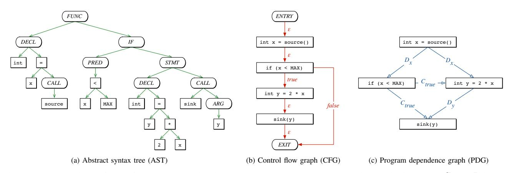

# Modeling and Discovering Vulnerabilities with Code Property Graphs

Fabian Yamaguchi∗、Nico Golde†、Daniel Arp∗、Konrad Rieck∗  
∗ゲッティンゲン大学（ドイツ）  
†クアルコムリサーチ（ドイツ）

_Abstract_—現在発生しているセキュリティ侵害の大多数は、不適切なコードが直接の原因となっています。そのため、コンピュータシステムの保護は、ソフトウェア内の脆弱性を厳密に特定することに大きく依存していますが、これは多大な専門知識を要する退屈でミスの起きやすい作業です。残念ながら、システムのセキュリティを損なうにはたった一つの欠陥で十分であり、監査すべき膨大な量のコードが攻撃者に有利に働きます。本論文では、大量のソースコードから効果的に脆弱性を抽出する手法を提案します。これを実現するために、_code property graph_ というソースコードの新しい表現方法を導入します。これは、抽象構文木、制御フローグラフ、プログラム依存グラフという古典的なプログラム解析の概念を統合したデータ構造です。この包括的な表現により、たとえばバッファオーバーフロー、整数オーバーフロー、フォーマット文字列の脆弱性、メモリリークなど、一般的な脆弱性のテンプレートを _graph traversals_ によってエレガントにモデル化できます。我々は、この手法を一般的なグラフデータベースを用いて実装し、Linuxカーネルのソースコードから18件の未知の脆弱性を特定することに成功し、その有効性を示します。

#### _Keywords_—_Vulnerabilities; Static Analysis; Graph Databases_

# I. INTRODUCTION

コンピュータシステムのセキュリティは、その基盤となるソフトウェアの品質に本質的に依存しています。学術界や産業界で長年にわたる研究が行われてきたにもかかわらず、セキュリティ脆弱性は依然としてプログラムコードの中に定期的に現れます。例えば、バッファの境界を考慮しない実装や、入力データの検証が不十分であることなどが挙げられます。その結果として、ソフトウェアの脆弱性は現代におけるセキュリティ侵害の主な原因の一つであり続けています。例えば、2013年には、ユニバーサルプラグアンドプレイライブラリのバッファオーバーフローが原因で、2300万台を超えるルーターがインターネットからの攻撃に対して脆弱になりました [26]。同様に、現在も数千人のユーザーがJavaランタイム環境のさまざまな欠陥を突くウェブベースのマルウェアの被害に遭っています [29]。

ソフトウェアの脆弱性の発見は、昔からあるものの、依然として難しいセキュリティ上の課題です。あるプログラムが別のプログラムの非自明な特性を特定できないため、ソフトウェア脆弱性を発見する一般的な問題は決定不能です [33]。その結果、現在利用できるセキュリティ欠陥の発見手法は、特定の種類の脆弱性に限定されているか、あるいは面倒で手作業による監査に頼ることになります。特に、オペレーティングシステムのカーネルのような大規模ソフトウェアプロジェクトをセキュアに保つことは非常に困難であり、たった一つの欠陥がコードベース全体のセキュリティを損なう可能性があります。バッファオーバーフローやフォーマットストリングの脆弱性のように、長い間ソフトウェアに繰り返し現れてきた脆弱性の種類も存在しますが、これらが特定のソフトウェアプロジェクトに現れた場合、それを自動的に検出するのは、依然として高度な専門知識がなければ難しい場合が多いです [16]。

このような状況の結果として、セキュリティ研究は当初、不適切なライブラリ関数によって引き起こされる欠陥[6]、バッファオーバーフロー[45]、整数オーバーフロー[40]、または入力データの不十分な検証[18]など、特定の種類の脆弱性を静的に発見することに焦点を当ててきました。ソフトウェアテストの概念に基づき、より広範な脆弱性の検出が動的プログラム解析を用いて達成されてきており、これは単純なファジングテスト[e.g., 38, 42]から高度なテイントトラッキングやシンボリック実行[e.g., 2, 35]まで多岐にわたります。これらの手法はさまざまな種類の欠陥を発見できるものの、実際に効率的に運用するのは困難であり、実行時の負荷が非常に大きい場合や、考慮すべき実行経路が指数関数的に増加するために、しばしば適切な結果が得られないことがあります[16, 21]。この問題に対処するため、最近では監査担当者を支援するアプローチの研究も始まっています。提案された手法は、専門家の知識に基づいて静的プログラム解析を補強することで監査プロセスを加速させ、脆弱性の探索を効率的に導くことができます[e.g., 39, 43, 44]。

本論文では、この研究の方向性を継続し、大量のソースコードから脆弱性を発掘するための新しいアプローチを提案します。私たちの手法は、プログラム解析の古典的な概念と、グラフマイニング分野の近年の発展を組み合わせたものです。本手法の根本的な洞察は、多くの脆弱性が、コードの構造、制御フロー、および依存関係を同時に考慮することで初めて十分に発見できるという点にあります。この要件に対応するために、私たちは _code property graph_ と呼ばれるソースコードの新しい表現を導入します。このグラフは、抽象構文木、制御フローグラフ、プログラム依存グラフの特性を結合したデータ構造です。この包括的なコードの視点により、_graph traversals_ を用いて一般的な脆弱性のテンプレートを洗練された形でモデル化できます。データベースのクエリと同様に、グラフトラバーサルによってコードプロパティグラフ上を走査し、コードの構造、制御フロー、各ノードに関連付けられたデータ依存性を調査します。このように異なるコード特性へ同時にアクセスすることで、さまざまな種類の欠陥に対する簡潔なテンプレートの作成が可能となり、大規模なコードの脆弱性監査を支援します。

私たちは、この手法を一般的なグラフデータベースを用いて実装し、バッファオーバーフロー、整数オーバーフロー、フォーマット文字列の脆弱性、メモリ情報漏洩など、よく知られている複数の脆弱性タイプに対してグラフトラバーサルを設計することで、その実用的な利点を示します。ケーススタディとして、大規模でよく監査されているコードベースであるLinuxカーネルのソースコードを分析します。私たちは、報告されたほぼすべての脆弱性が

© 2014, Fabian Yamaguchi. IEEEのライセンスの下で提供。DOI 10.1109/SP.2014.44

2012年時点のLinuxカーネルは、そのコードプロパティグラフにおけるトラバーサルを用いて記述することができます。オープンソースコミュニティによるカーネルのセキュリティ向上への多大な努力にもかかわらず、これらのトラバーサルによって、Linuxカーネル内の_これまで知られていなかった18件の脆弱性_を発見することができました。これにより、コードプロパティグラフの実践における有効性が示されます。

まとめると、私たちは脆弱性発見の課題に対して以下の貢献を行いました。

- _Code property graph._ ソースコードの新しい表現方法を導入します。これは、抽象構文木、制御フローグラフ、プログラム依存グラフの特性を組み合わせ、ひとつのデータ構造としてまとめたものです。
- _脆弱性タイプのためのトラバーサル._ 一般的な脆弱性のタイプは、コードプロパティグラフのトラバーサルとして洗練された形でモデル化でき、効率的な検出テンプレートを生み出すことを示しています。
- _効率的な実装。_ コードプロパティグラフをグラフデータベースにインポートすることで、Linuxカーネルのような大規模なコードベースでもトラバーサルを効率的に実行できることを示します。

本稿の残りの構成は以下の通りです。Section IIでは、コードの表現に関する背景情報を提供します。Section IIIでは、プロパティグラフおよびグラフトラバーサルの概念を定義します。Section IVでは、新たな表現であるcode property graphsを紹介し、Section Vではそれを用いて脆弱性を特徴付ける方法を示します。Section VIでは、本手法の評価を行います。Section VIIおよびVIIIでは、それぞれ関連研究と限界について議論します。Section IXで本稿をまとめます。

#### II. REPRESENTATIONS OF CODE

プログラム解析やコンパイラ設計の分野では、プログラムの特性を論理的に扱うために様々なコード表現方法が開発されてきました。これらの表現は主にコードの解析や最適化を目的として設計されていますが、本研究で示すように、コードの特性を記述するのにも適しています。特に、私たちは_抽象構文木_、_制御フローグラフ_、_プログラム依存グラフ_という三つの古典的な表現に注目し、これらを脆弱性発見の手法の基盤としています。コード表現に関する詳細な議論はAhoらによる書籍[1]に記載されています。

| void foo()        | 1   |
| ----------------- | --- |
| {                 | 2   |
| int x = source(); | 3   |
| if (x < MAX)      | 4   |
| {                 | 5   |
| int y = 2 \* x;   | 6   |
| sink(y);          | 7   |
| }                 | 8   |
| }                 | 9   |
|                   |     |

Fig. 1: 例となるコードサンプル（Figure 2 参照）。

このセクションを通してさまざまな表現方法を説明する簡単な例として、Figure 1 に示されているコードサンプルを考えます。

#### _A. Abstract Syntax Trees (AST)_

抽象構文木は、通常、コンパイラのコードパーサが最初に生成する中間表現の一つであり、多くの他のコード表現を生成する際の基盤となります。これらの木構造は、文や式がどのように入れ子になってプログラムを構成しているかを正確に符号化します。しかし、_構文解析木_とは異なり、抽象構文木はもはやプログラムを記述するために選ばれた具体的な構文を表してはいません。例えば、C言語では、カンマで区切られた宣言のリストは、通常、連続する2つの宣言と同じ抽象構文木を生成します。

抽象構文木は順序付き木であり、内部ノードは「演算子」（例えば加算や代入）を、葉ノードは「オペランド」（例えば定数や識別子）を表します。例として、Figure 2a は Figure 1 に示されたコードサンプルの抽象構文木を示しています。抽象構文木は単純なコード変換には適しており、意味的に類似したコードの識別にも利用されてきました [3, 43]。しかし、死んだコードや初期化されていない変数の検出といった、より高度なコード解析には適用できません。この欠点の理由は、このコード表現では制御フローやデータ依存性が明示的に示されていないためです。

# _B. Control Flow Graphs (CFG)_

制御フローグラフは、コードの文が実行される順序や、特定の実行経路が選択されるために満たすべき条件を明示的に記述します。このため、文や述語はノードとして表され、それらは制御の移動を示す有向エッジで接続されます。これらのエッジは抽象構文木の場合のように順序付けられている必要はありませんが、各エッジには _true_、_false_、または - のラベルを付与する必要があります。特に、文のノードにはラベルが - の出辺が一つあり、述語ノードには述語の評価結果に対応して _true_ または _false_ の2つの出辺があります。制御フローグラフは、抽象構文木から2段階の手順で構築することができます。まず、構造的な制御文（例えば _if_、_while_、_for_）を考慮し、予備的な制御フローグラフを作成します。次に、_goto_、_break_、_continue_ などの非構造的な制御文を追加で考慮することで、予備的な制御フローグラフを修正します。Figure 2bは、Figure 1で示されたコード例のCFGを示しています。

Control flow graphsは、セキュリティの分野でさまざまな用途に利用されてきました。たとえば、既知の悪意あるアプリケーションの亜種を検出するためや、fuzz testingツールの指針として利用されています。また、プログラムの理解を助けるために、リバースエンジニアリングにおける標準的なコード表現となっています。しかし、control flow graphsはアプリケーションの制御フローを明らかにする一方で、データフローに関する情報は提供できません。特に脆弱性分析においては、control flow graphsだけでは攻撃者に影響されるデータを処理する文を簡単に特定することができないということになります。

## _C. Program Dependence Graphs (PDG)_

Program dependence graphs は Ferrante らによって導入され [9]、もともとはプログラムスライスを実行するために開発されました。

図2: 図1の例におけるコードの表現。プログラム依存グラフでは、制御依存とデータ依存がそれぞれ C および D で示されている。

ing [41]、すなわち、指定された文における変数の値に影響を与えるプログラム内のすべての文と述語を決定することです。プログラム依存グラフは、文や述語間の依存関係を明示的に表現します。特に、このグラフは2種類のエッジを用いて構築されます。ひとつは、ある変数が別の変数に影響を与えることを表すデータ依存エッジ、もうひとつは、述語が変数の値に影響を与えることを示す制御依存エッジです。プログラム依存グラフのエッジは、まず各文が_定義_する変数と_使用_する変数の集合を決定し、各文や述語について_到達定義_を計算することで、コントロールフローグラフから求めることができます。これはコンパイラ設計での標準的な問題です [1参照]。

例として、Figure 2c は Figure 1 に示したコードサンプルのプログラム依存グラフを示しています。ここで注意すべき点は、制御依存エッジは単なる制御フローエッジではなく、特に文の実行順序はこのグラフからはもはや判別できない一方で、文と述語の間の依存関係は明確に可視化されているということです。

#### III. PROPERTY GRAPHS AND TRAVERSALS

提示された各表現は、基盤となるプログラムの異なる側面を強調しつつ、ソースコードに対する固有の視点を提供します。これらの視点を結合し、脆弱性発見のための統合的な表現を得るために、_プロパティグラフ_ [34] という概念を用います。これは、多くのグラフデータベース（たとえば ArangoDB、Neo4J、OrientDB など）で構造化データの基本的な表現です。厳密には、プロパティグラフは次のように定義されます。

定義1．_プロパティグラフ_ G = (V, E, λ, μ) は、有向エッジ付き、ラベル付き、属性付きの多重グラフであり、V はノードの集合、E ⊆ (V × V ) は有向エッジの集合、λ : E → Σ は各エッジにアルファベットΣからラベルを割り当てるエッジラベリング関数である。ノードおよびエッジには、μ : (V ∪ E) × K → S という関数によってプロパティを割り当てることができる。ここで K はプロパティキーの集合、S はプロパティ値の集合である。

Figure 3は、4つのノードを持つシンプルなプロパティグラフを示しています。プロパティグラフはマルチグラフであるため、2つのノードが複数のエッジで接続される場合があることに注意してください。例えば、Figure 3のノードAとBがその例です。さらにこの例では、各ノードにキーk ∈ Kを持つプロパティが割り当てられており、ノードAとBだけが集合S = {x, w}からのプロパティ値を保持しています。

Fig. 3: プロパティグラフの例。ノードに割り当てられたプロパティは破線で示されています。

プロパティグラフにおける情報抽出の主な手法は、いわゆる _グラフトラバーサル_（または単に _トラバーサル_）です。これは、ラベルやプロパティに応じてグラフのエッジに沿って移動するために利用されます。形式的には、グラフのトラバーサルは次のように定義されます。

定義2．_トラバーサル_ は、性質グラフ G に従ってノードの集合を別のノードの集合に写す関数 T : P(V ) → P(V ) である．ここで、P は V のべき集合である．

この一般的な定義により、複数のトラバーサルを連結して使用することが可能になります。たとえば、2つのグラフトラバーサル T0 と T1 は、関数合成 ◦ を用いて T0 ◦ T1 のように連結することができます。この連結に基づき、本論文で扱う他のすべてのトラバーサルの構築の基礎となる、いくつかの基本的なトラバーサルを定義できます。ここではまず、単純なフィルタートラバーサルを定義します。

$$
\text{Filter}_p(X) = \{ v \in X : p(v) \}
$$

これは、集合X内のすべてのノードのうち、ブール述語p(v)に一致するもの、たとえば特定のプロパティを持つかどうかをチェックすることによって取得されるノードを返します。

プロパティグラフのエッジに沿って移動するために、以下の順方向のトラバーサルを定義します。

$$
OUT(X) = \bigcup_{v \in X} \{u : (v, u) \in E\},
$$

（訳す対象となる段落が存在しません。）

$$
OUT_l(X) = \bigcup_{v \in X} \{u : (v, u) \in E \text{ かつ } \lambda((v, u)) = l\},
$$

（入力された段落が見つかりません。翻訳する文章を入力してください。）

$$
OUT_l^{k,s}(X) = \bigcup_{v \in X} \{u : (v, u) \in E \text{ かつ } \lambda((v, u)) = l\}
$$

\nおよび $\mu((v, u), k) = s\}$

これは、ノードの集合Xから到達可能なノードを返します。詳細には、OUTトラバーサルはXから到達可能なすべてのノードを返し、OUTlはラベルlを持つエッジをたどって到達可能なすべてのノードを返し、OUTk,s lはラベルlかつプロパティk:sを持つエッジをたどって到達可能なすべてのノードを返します。同様に、グラフ内を逆方向に移動するためのトラバーサルIN、INl、およびINk,s lも定義します。

$$
IN(X) = \bigcup_{u \in X} \{v : (v, u) \in E\},
$$

（入力に翻訳すべき段落が見当たりませんでした。翻訳を希望されるMarkdown形式の段落を入力してください。）

$$
IN_l(X) = \bigcup_{u \in X} \{v : (v, u) \in E \text{ かつ } \lambda((v, u)) = l\},
$$

（入力されたMarkdownの段落が空白のようです。翻訳するテキストがありません。翻訳が必要な文章を入力してください。）

$$
IN_l^{k,s}(X) = \bigcup_{u \in X} \{v : (v, u) \in E \text{ かつ } \lambda((v, u)) = l\}
$$

\nおよび $\mu((v, u), k) = s\}.$

最後に、他のトラバーサルの出力を集約するために、ORとANDという2つのトラバーサルを次のように定義します。

$$
OR(\mathcal{T}_1, ..., \mathcal{T}_N)(X) = \mathcal{T}_1(X) \cup ... \cup \mathcal{T}_N(X)
$$

AND( $\mathcal{T}_1, ..., \mathcal{T}_N$ )(X) = $\mathcal{T}_1(X) \cap ... \cap \mathcal{T}_N(X)$

やや技術的な定義ではありますが、いくつかのグラフデータベースはこれら基本的なトラバーサルを効率的に実装しています。特に、FILTER、OUT、INトラバーサルは、Neo4J や InfiniteGraph などの一般的なデータベースでサポートされているグラフ言語 _Gremlin_ の基本的な機能です。グラフトラバーサルの実装の詳細と、我々の手法の評価については、セクションVIで述べます。

#### IV. CODE PROPERTY GRAPHS

Section IIで提示したそれぞれの表現方法は、基盤となるソフトウェアの特定の特性を捉えています。しかし、単一の表現方法だけでは、ほとんどの場合、脆弱性の種類を十分に特徴付けることはできません。そこで、Section IIIで紹介したプロパティグラフの概念を用いて、三つの表現方法を統合したデータ構造を作成します。具体的には、まずAST、CFG、PDGをプロパティグラフとしてモデル化し、それぞれの表現方法の利点をすべて備えた一つのグラフへと統合していきます。

#### _A. Transforming the Abstract Syntax Tree_

ソースコードを言語構造体に詳細に分解して表現できる唯一の表現方法はASTです。したがって、私たちはASTをプロパティグラフ GA = (VA, EA, λA , μA) として表現することから共同表現の構築を始めます。ここで、ノード VA は木構造のノードによって与えられ、エッジ EA は木構造のエッジに対応し、ラベリング関数 λA によってASTエッジとしてラベル付けされます。さらに、各ノードには μA を用いて _code_ プロパティを割り当て、プロパティ値がそのノードが表す演算子またはオペランドに対応するようにします。最後に、木構造の順序性を反映するため、各ノードに _order_ プロパティも付与します。その結果、グラフのプロパティキーは KA = {_code_, _order_} となり、プロパティ値の集合 SA はすべての演算子、オペランド、および自然数から構成されます。

#### _B. Transforming the Control Flow Graph_

次のステップとして、CFGを統合表現に組み込むための準備を行います。この目的のために、CFGをプロパティグラフ GC = (VC , EC , λC , ·) として表現します。ここで、ノード VC は単純にAST内の文や述語に対応し、つまり、_code_ というキーに対して値が _STMT_ や _PRED_ となっているすべてのノード VA です。さらに、プロパティグラフ内のすべてのエッジに ΣC = {_true_, _false_, -} からラベルを割り当てるエッジラベリング関数 λC を定義します。

#### _C. Transforming the Program Dependence Graph_

PDGは、文や述語間のデータ依存関係および制御依存関係を表します。このグラフのノードはCFGのノードと同じであり、2つのグラフの違いはエッジのみです。したがって、PDGは、新しいエッジの集合 EP とそれに対応するエッジラベリング関数 λP : Ep → ΣP を定義することで、プロパティグラフ GP = (VC , EP , λP , μp) として表現できます。ここで ΣP = {_C_, _D_} は制御依存関係とデータ依存関係に対応します。さらに、各データ依存関係には対応する記号を示すプロパティ _symbol_ を、各制御依存関係には元となる述語の状態が _true_ または _false_ であることを示すプロパティ _condition_ を付与します。

#### _D. Combining the Representations_

最後のステップとして、私たちは3つのプロパティグラフを結合し、_code property graph_ と呼ばれる統合データ構造を作成します。このグラフを構築するための重要なポイントは、3つのグラフそれぞれに、ソースコード内の各ステートメントおよび述語に対応するノードが存在していることです。実際、ASTはこれら3つの表現の中で唯一、追加のノードを導入します。そのため、ステートメントおよび述語ノードは、表現を自然に結びつけるとともに、ある表現から別の表現への接続点として機能します。

定義3. _コードプロパティグラフ_ とは、ソースコードのAST、CFG、PDGから構築されたプロパティグラフ G = (V, E, λ, μ) である。

- V = VA、
- E = EA ∪ EC ∪ EP ,
- λ = λA ∪ λC ∪ λP および
- μ = μA ∪ μE、

ここでは、記法を多少拡張してラベリング関数とプロパティ関数を結合しています。

図4に、図1で示したコードサンプルのコードプロパティグラフの例を示します。簡単のため、プロパティキーや値、ASTエッジ上のラベルは省略しています。

Fig. 4: 図1に示したコードサンプルのコードプロパティグラフ。

示されている。グラフのノードは主にFigure 2aのASTと一致している（無関係な _FUNC_ および _IF_ ノードを除く）が、変換されたCFGとPDGは色付きのエッジで示されている。

## V. TRAVERSALS FOR WELL-KNOWN TYPES OF VULNERABILITIES

コードプロパティグラフは、さまざまな種類のプログラミングパターンを表現することができます。しかし、それをどのように脆弱性の発見に利用できるかはすぐには明らかではありません。本節では、コードプロパティグラフを効果的に解析することで、多様な種類のセキュリティ上の欠陥を特定し、脆弱性の記述テンプレートを作成できることを示します。まず、Section V-Bでコードの純粋な構文的記述の限界について検討し、次に追加の制御フロー情報だけではわずかな改善しかもたらさないことを示します（Section V-C）。最後に、Section V-Dでは、データフロー、制御フロー、構文情報を組み合わせることにより、さまざまな脆弱性を発見できるようになることを説明します。

## _A. Motivational Example_

まず、Esser [7] によってSSHの実装で発見され、多くのApple iOSアプリケーションを攻撃にさらしたバッファオーバーフローの最近の例から始めます。Esserは、Figure 5に示されている脆弱なコードを特定するために正規表現を用いました。

| []                                                | 1   |
| ------------------------------------------------- | --- |
| if (channelp) {                                   | 2   |
| /_ シグナル名をセット（SIGプレフィックスなし） _/   | 3   |
| uint32_t namelen =                                | 4   |
| \_libssh2_ntohu32(data+9+ sizeof("exit-signal")); | 5   |
| channelp->exit_signal =                           | 6   |
| LIBSSH2_ALLOC(session, namelen + 1);              | 7   |
| []                                                | 8   |
| memcpy(channelp->exit_signal,                     | 9   |
| data + 13 + sizeof("exit_signal"), namelen);      | 10  |
| channelp->exit_signal[namelen] = '\0';            | 11  |
| []                                                | 12  |
| }                                                 | 13  |
| []                                                | 14  |
|                                                   |     |

Fig. 5: libssh2のコードからの抜粋で、関数_libssh2 packet add_に存在する脆弱性を示している

脆弱な箇所（赤で示されています）は、6行目で関数_LIBSSH2 ALLOC_を使ってバッファ_exit signal_のためのメモリを割り当てています。割り当てるメモリ量は、引数の中で変数_namelen_に1を足して計算されています。残念ながら、この変数は攻撃者によって操作可能であり、もし32ビット符号なし整数の最大値が選ばれると、加算処理でオーバーフローが発生し、割り当て関数には0が渡されるため、ほんの数バイトのパディングのみが割り当てられる結果になります。その後9行目で_namelen_バイトがサイズ不足のバッファにコピーされると、バッファオーバーフローが発生します。

Esserは、次の正規表現を使用して6行目の脆弱な記述を発見することができました。

ALLOC[A-Z0-9\_]\*\s\*\([ˆ,]\*,[ˆ;]\*[\*+-][ˆ>][ˆ;]\*\)\s\*; .

残念ながら、正規表現は割り当て呼び出し内の和のみを記述しており、これは脆弱性に必要な条件のひとつにすぎません。さらに、正規表現ではコードの入れ子構造を一致させることができないため、記述自体が本質的に曖昧になります。しかし、この定式化の最大の欠点は、変数 _namelen_ に対する攻撃者の制御を記述できていない点です。さらに、変数が適切にサニタイズされていれば、この脆弱性は存在しなかったでしょう。最後に、変数の幅が脆弱性の上で非常に重要となります。

この簡単な例は、脆弱性パターンの特性化に関与するコードのさまざまな特性についての洞察を与えます。まとめると、次の側面をカバーする必要があります。

- 1. _Sensitive operations._ 保護された機能への呼び出しや、バッファへのコピー、メモリの割り当てといったセキュリティ上重要な操作は、記述可能である必要があります。例に示されているように、割り当ての中にある算術操作のようなネストされたコードも非常に重要であり、そのためASTへの完全なアクセスが必要となります。
- 2. _型の使用._ 多くの脆弱性は、プログラムで使用されているデータ型に密接に関連しています。例えば、Figure 5 に示されている脆弱性は、_namelen_ が 32 ビット整数ではなく 16 ビット整数であれば存在しなかったでしょう。この情報は AST に含まれています。
- 3. _Attacker control._ アナリストは、どのデータソースが攻撃者の制御下にあるかを表現できなければなりません。例に言及すると、_libssh2 ntohu32_ から返される変数は、ネットワークバイトオーダーからホストバイトオーダーに整数を変換するルーチンであるため、その整数はほぼ確実に攻撃者から受信したものであり、攻撃者の制御下にある可能性が非常に高いです。

ネットワークです。このモデル化には、PDGによって表現されるデータ依存関係が必要です。

4. _Sanitization._ 最後に、多くの脆弱性は、プログラムが攻撃者が制御するデータに対して適切なサニタイズ処理を行っていない場合にのみ発生します。たとえば、上記の例で変数 _namelen_ が割り当ての前に安全な範囲かどうかチェックされていれば、脆弱性は存在しませんでした。このため、CFGによって明示的にされるステートメントの順序を正確にモデル化することが非常に重要です。

ここでは、コードプロパティグラフによって提供されるさまざまなビューが、脆弱性発見のための有効なグラフトラバーサルの構築にどのように寄与しているかを詳細に分析します。

## _B. Syntax-Only Vulnerability Descriptions_

コードプロパティグラフは、もともと抽象構文木に含まれていたすべての情報を公開します。この情報は、攻撃者が制御するソース、機密性の高い操作、およびサニタイザを記述するには十分ですが、本節で示すように、文同士の相互作用を捉えることはできません。

まず、図5の脆弱な文をその構文構造によって説明します。この脆弱性の重要な特性は、割り当て関数への引数において直接的な加算処理が行われている点です。このシンプルな例だけでもすでに2つの課題が存在します。第一に、関数内に加算と呼び出しが含まれているかどうかを判別する必要があります。第二に、コードの入れ子構造を捉える必要があります。

最初の問題は、まず関数のすべてのノードを取得し、その後、それらのノードの中に総和や呼び出しを表すものがあるかどうかをフィルタリングすることで対処できます。AST のすべてのノードの中から特定の条件に合致するノードを見つけることは、繰り返し発生する問題です。私たちはこれに対処するため、AST のルートからすべてのノードをたどる再利用可能な走査 TNODES を定義します。これにより、TNODES を FILTER と組み合わせるだけで、その AST に総和ノードや呼び出しノードが含まれているかどうかを簡単に判定できるようになります。

$$
MATCH_p(V) = FILTER_p \circ TNODES(V)
$$

全ての v ∈ V を根とするASTに含まれるノードを辿り、述語 p に従ってこれらのノードをフィルタリングします。コード内で全てのメモリ割り当て関数の呼び出しを辿る場合、V を全ての関数ノードの集合とし、p(v) が v がメモリ割り当て関数の呼び出しである時に真となるような MATCH トラバーサルを実行するだけで実現できます。

第二の問題、すなわち、呼び出しの引数の中にネストされた総和記号を識別することも簡単に解決できるようになります。というのも、MATCHトラバーサルは関数合成を使って単純に連結できるからです。例えば、関数fのi番目の引数の中にある総和記号を識別するには、次のトラバーサルを使用します。

$$
\mathrm{MATCH}_p \circ \mathrm{ARG}_f^i
$$

ここで、ARGi f は f という名前の関数への呼び出しの i 番目の引数を返す MATCH トラバーサルであり、p(v) は μ(v, _code_) = _Summation_ である場合に真となり、それ以外の場合は偽となります。

ただし、MATCHトラバーサル単体では文同士の相互作用を特徴づけるのには適していませんが、脆弱性の大多数の種類において、センシティブな操作、サニタイザ、および攻撃者が制御可能なソースを正確に記述するための基礎となります。さらに、単一の文を特徴づけるだけで、Figure 5の例で見られるように、すでにある種の脆弱性の探索範囲を絞り込める場合も多く存在します。以下は、MATCHトラバーサル単体でも同様に有効となる脆弱性タイプの例です。

• _安全でない引数_。安全でない引数は、脆弱性の一般的な原因です。例えば、フォーマット文字列の脆弱性 [see 12, 31, 36] は、攻撃者が制御するフォーマット文字列が _printf_ や _sprintf_ などの関数に渡された場合に発生し、複数のプラットフォームで任意のコード実行などに悪用される可能性があります。フォーマット文字列の脆弱性の必要条件は、_printf_、_sprintf_、_fprintf_ などのユーティリティ関数に渡されるフォーマット文字列が定数の文字列でないことです。これは、次のように MATCH トラバーサルを使って表現できます。

#### MATCHp ◦ ARG1 sprintf

ここで、p は v が定数文字列を表していない場合、すなわち μ(v, _code_) = _String_ のときに真となります。この走査は攻撃者による制御をモデル化してはいませんが、実際には定数でない書式文字列を用いる理由がほとんどないため、十分に有効です。

• _整数オーバーフロー。_ 割り当て関数の引数内で算術演算が行われる場合は、図5に示された動機付けの例のように、メモリの破損につながる整数オーバーフローが発生しやすい典型的なケースです。これらは、次のようなトラバーサルによって容易に表現できます。

#### MATCHp ◦ ARG1 malloc

p(v) は、v が算術演算である場合に真となります。例えば、μ(v, code) = _Multiplication_ のようになります。

• _整数型に関する問題。_ いくつかのタイプの脆弱性は、開発者が予期しない型変換が直接の原因となっています。特に、バッファオーバーフローは、暗黙の整数型キャストによってバッファサイズの計算や検証が正しく行われないことで頻繁に発生します。例えば、_整数の切り捨て_ は、代入の右辺にある整数が左辺よりも広い場合に発生します。これらのタイプの脆弱性を発見するには、前述の二つの場合よりも少し複雑で、脆弱なケースを特定するには代入の左右の部分木を比較する必要があります。この目的のために、PAIRST2 T1 という関数を定義します。例えば、全ての代入ノードの集合から開始して、PAIRSは左右それぞれの部分木を走査するT1およびT2という二つの独立した走査を行い、その結果を対として組み合わせます。これらのペアは、FILTER2と同様に定義された関数PAIRFILTERpを使って、述語pに従ってフィルタリングできます。整数の切り捨ては、これら二つの関数をMATCHと組み合わせることで簡単に検出でき、その走査は次のようになります。

> PAIRFILTERp1 ◦ PAIRST2 T1 ◦ MATCHp2

（この数式はそのままにしていますが、翻訳する本文が含まれていません。このままで問題ありません。）

1正式な定義は付録IX-Aに記載されています。

2PAIRE と PAIRFILTER の正式な定義は付録 IX-C に記載されています。

ここで、p1 は、2番目のノードが1番目のノードよりも広い型を持つ変数を示している場合に真となり、p2 はそのノードが代入である場合に真となります。最後に、T1 および T2 は、それぞれ代入の左部分木および右部分木をたどります。

MATCHトラバーサルのみに基づいて脆弱性を特徴付けようとするほとんどの試みは失敗に終わる傾向にあります。なぜなら、ステートメント同士の関係を表現できないからです。しかし、Section IIIで紹介したANDやORを使って複数のMATCHトラバーサルを組み合わせることで、潜在的に興味深いコードに絞り込むことが可能です。たとえば、_missing permission checks_ [see 27, 44]は、セキュリティ上重要な操作と攻撃者が制御できるソースが存在し、かつチェックが存在しない場合に、そのコードが脆弱となり得る、という形で特徴付けることができます。残念ながら、抽象構文木を用いる場合にはこれができる最善の方法であり、この状況を捉えるために以下の定義を示します。

定義 4. _構文のみの脆弱性記述_ S は 2-タプル (M0, M1) であり、M0 および M1 は MATCH トラバーサルの集合である。AST ノードは、M0 内のすべての MATCH トラバーサルに一致し、かつ M1 内のトラバーサルには一切一致しない場合に、構文のみの記述に一致する。

構文のみを用いた脆弱性の記述は、実際には効果的であることが多いですが、攻撃者の制御や文同士の相互作用を表現することができないため、しばしば多くの誤検知を生じてしまいます。次のセクションでは、この問題に部分的に対処する制御フローに基づく記述について説明します。

#### _C. Control-Flow Vulnerability Descriptions_

コードプロパティグラフの制御フローエッジを利用することで、文の実行順序をモデル化できるため、より広範な脆弱性に対応できるようになります。特に、制御フローグラフ内のパスに対応する脆弱性については、以下のようにうまく記述することができます。

- _リソースリーク._ 多くの脆弱性は、リソースが割り当てられた後、すべてのエラーパスで適切に解放されないことで発生します。典型的な場合、これによりシステムが利用不能になることがありますが、更なる脆弱性を誘発するために悪用されることもあります。
- _ロックの解放忘れ。_ 一般的な場合における並行性の問題を検出するのは困難ですが、単純な制御フロー解析を用いることで、エラーパスでロックが解放されていないケースを検出することができます。
- _Use-after-free vulnerabilities._ すでに解放されたメモリ領域にアクセスするコードによるソフトウェアの欠陥は、しばしば任意のコード実行のために悪用されます。これらの脆弱性は、一見無関係に見えるいくつかの関数の複雑な相互作用によって発生することが多いですが、関数内でこれらの脆弱性を特定するには、単純な制御フロー解析で十分な場合もあります。

いずれのケースにおいても、脆弱性は制御フローグラフ内の特定のパスに関連付けることができます。例えば、リソースリークは、メモリを獲得する文（例: _malloc_ への呼び出し）からリソースを解放する文（例: _free_ への呼び出し）を通らずに関数の終わりに至る制御フローパスに結びついています。しかし、そのパスが関連するのは、割り当て関数が割り当てられたメモリへのポインタを返す場合のみです。したがって、制御フローグラフ内のパスには追加の制約を付加する必要があります。これらの観察を次の定義でまとめます。

定義 5. _control-flow vulnerability description_ は、4つ組 (Ssrc, Send, Sdst, {(Si cnd, ti)}i=1...N ) で表される。ここで、Ssrc はソース文の構文のみの記述、Send はエンド文の構文のみの記述、Sdst はデスティネーション文の構文のみの記述、そして {(Si cnd, ti)}i=1...N は条件の構文のみの記述と、それに関連付けられた結果 ti ∈ {true, false} のリストである。ノード v が control-flow vulnerability description に一致するのは、次の条件が成立する場合である。

- vを根とするASTには、Ssrcに一致する根ノードvsrcを持つ部分木が含まれています。
- vsrc から Send に一致するノードまでの制御フローグラフ上の経路が存在し、その経路は Sdst に一致するノードを経由しません。
- すべての 1 ≤ i ≤ N に対して、もしあるノードが説明 Si cnd に合致する場合、そのノードから始まる経路上のすべてのエッジは ti とラベル付けされなければならない。

コントロールに基づく脆弱性は、深さ優先探索を用いたトラバーサルによって表現することができます。これは、指定されたソースノードの集合から、ディスクリプションに一致するノードを通らず、条件ディスクリプションおよび関連する結果に従う、エンドノードまでのすべての経路を見つけるものです。このトラバーサルの正式な定義は、簡潔さのためここでは省略します。

残念ながら、制御フローや構文情報だけでは、脆弱性パターンを特定するには通常十分ではありません。というのも、特に次のセクションで述べる通り、攻撃者によって制御されるデータの流れを追跡することに関心があるためです。

#### _D. Taint-Style Vulnerability Descriptions_

最後に、構文・制御およびデータフロー情報を組み合わせて脆弱性をモデル化します。構文のみや制御フローによる脆弱性の記述と比較して、データフローのエッジを用いることで攻撃者による制御もモデル化できるという追加的な利点があります。

各ステートメントノードには、そのノードに到達するすべての代入や変数定義からのデータフローエッジが含まれているため、これらのエッジに従うだけで、そのステートメントで使用されている変数を生成するすべてのステートメントを簡単にたどることができます。しかし、わずかな問題もあります。データフローエッジで接続されているのはステートメントノードだけであり、たとえば関数呼び出しの引数からそのデータの生成元にたどりたい場合、まずその引数を囲むステートメントまでたどる必要があります。幸いなことに、これは付録IX-Bで正式に定義されているSTATEMENTトラバーサルを用いることで簡単に実現できます。ノードの集合に対する変数の生成元は、このトラバーサルを使用して計算できます。

$$
PRODUCERS_{\mathcal{N}} = \bigcup_{n \in \mathcal{N}} IN_{D}^{symbol,n} \circ \text{STATEMENT}
$$

ここで N は関心のある識別子の集合であり、これにより文で使用されている変数の部分集合に分析を制限することができます。便利のために、SOURCES というトラバーサルも定義し、これは文で使用されている変数のいずれかに対してデータを生成するすべての文を記述します。

SOURCESは非常に有用なトラバーサルです。なぜなら、機密性の高い操作やデータソースの構文情報と組み合わせることで、攻撃者が制御するデータが機密性の高い操作に使用されているケースを特定できるからです。例えば、Linuxカーネルにおけるバッファオーバーフローの一般的な形態として、_get user_関数によって取得されたユーザー提供の整数値が、そのまま_memcpy_操作のサイズフィールドとして使用されることがあります。こういった脆弱性を特定するために、次のようなトラバーサルを定式化することができます。

$$
MATCH_p \circ \text{SOURCES} \circ \text{ARG}^3_{memory}
$$

ここで、pはノードが_get user_呼び出しを表している場合にtrueを返す述語です。つまり、_memcpy_の第3引数を直接生成している_get user_のすべての呼び出しへと探索します。さらに、この探索SOURCESは任意の回数連鎖させることができ、引数が攻撃者制御のソースによって間接的にのみ生成される場合も特定できます。

この定式化の弱点は、データのサニタイズ（無害化）を考慮していないことであり、そのためデータが有害でないことを確認するチェックが行われている場合でも、該当するケースが返されてしまいます。サニタイザを考慮するための一つの方法としては、構文だけによる追加的な記述を導入することが考えられますが、これでは文の順序が考慮されないため、チェックが正しい位置に配置されているかどうかを検出することは不可能です。私たちは、この欠点に対処するために、制御フローとデータフロー情報の組み合わせを利用します。特に、SOURCESと同様の機能を提供するトラバーサルを作成しつつ、さらに構文だけによるサニタイザの記述を指定できるようにすることを目指しています。

トラバーサル UNSANITIZED3 を、SOURCES のドロップイン代替として定義します。これは、記号ごとの構文のみのサニタイザー記述 Ss val を記号 s に対して追加で指定でき、適切にサニタイズされたすべての場合を除外します。このトラバーサルは、以下の2つの条件を満たす場合にのみ、攻撃者が制御するソースを返します。

- 制御フローグラフにおいて、ソース文からシンク文へのパスが存在し、そのパス上のいかなるノードもサニタイザーの説明に一致しない。
- ソースによって定義され、シンクによって使用される変数が、制御フローパスを通じてシンクに到達する、つまり、そのパス上のどのノードによっても再定義されていない場合を指します。

構文のみの記述とUNSANITIZEDのトラバーサルを組み合わせて、私たちは以下のようにテイントスタイルの脆弱性記述を定義します。

定義6．_汚染型脆弱性記述_とは、攻撃者が制御可能なソースの構文のみの記述 Ssrc、セキュリティ上重要なシンク (Sdst)、およびサニタイザのための構文のみの記述の集合 (Ss san) からなる3つ組 (Ssrc, Sdst, Ss san) のことを指す。ノード v は、v を根とするASTが Ssrc にマッチする根ノード vsource を持つ部分木と、Sdst にマッチする根ノード vsink を持つ別の部分木の両方を含んでいる場合、汚染型記述にマッチする。

- vsourceからvsinkへのデータ依存エッジのパスが存在する、つまり、ノードの列（v0,...,vn）が存在し、v0がvsource、vnがvsinkであり、ei = (vi, vi+1) ∈ Eかつλ(ei) = Dがすべてのi = 0,...,n − 1について成り立つ。
- これらのデータ依存エッジ ei = (vi, vi+1) のそれぞれについて、制御フローグラフ内に vi から vi+1 へのパス (v0,...,vm) が存在し、すべての k, 0 ≤ k ≤ m に対して、vk

μ(ei,_symbol_) を定義しておらず、vk はサニタイザの説明 Sμ((vi,vi+1),_symbol_) san と一致していません。

Taintスタイルの記述は、検証済みのソース-シンクシステムで記述できる脆弱性のためのトラバーサルを定義するのに適しています（[see 18]参照）。このタイプの脆弱性には、インジェクション脆弱性、バッファオーバーフロー、整数オーバーフロー、整数型の脆弱性、安全でない引数、不足している権限チェック、さらにはメモリ情報漏洩などが含まれます。以下の例はこれを示しています。

• _バッファオーバーフローの脆弱性._ フローに基づく説明を導入する動機として述べたように、多くのバッファオーバーフローは、コピー操作に渡される長さフィールドの検証が不十分なことが原因で発生します。例えば、Linuxカーネルのコードでは、多くのバッファオーバーフローが、_get user_ 関数で読み取ったサイズフィールドが、検証されることなく _memcpy_ や _copy from user_ の第3引数として渡されることによって発生します。この脆弱性のパターンは、次のようなトラバーサルで表現できます。

$$
\text{ARG}^{1}_{get\_user} \circ \text{UNSANITIZED}_{\{\mathcal{T}_s\}} \circ \text{ARG}^{3}_{memory}
$$

このトラバーサルは、_get user_ の最初の引数によって直接汚染されており、その検証がトラバーサル Ts にマッチするノードで行われていない _memcpy_ の3番目の引数をすべて選択します。たとえば、トラッキングされている変数 s を含む比較式にマッチするトラバーサルが該当します。この種類のトラバーサルは、UNSANITIZED トラバーサルを連鎖させることで、間接的に汚染された引数も簡単に含めるよう拡張できます。

• _コードインジェクションの脆弱性._ SQLインジェクションやコマンドインジェクションのような脆弱性は、テイントスタイルの記述を用いてうまく表現することができます。たとえば、攻撃者が任意のシェルコマンドを実行できる典型的なコマンドインジェクションの脆弱性は、次のようなトラバーサルで記述することができます。

$$
ARG_{recv}^2 \circ \text{UNSANITIZED}_{\{\mathcal{T}_s\}} \circ \text{ARG}_{system}^1
$$

ここで Ts とは、比較処理をセミコロンにマッチさせたり、よく知られたバリデーション関数を呼び出したりする探索処理を指します。この探索処理は、_recv_ の第2引数がセミコロンを含むかどうかの確認を行うことなく _system_ の第1引数に到達するすべてのケースを返します。

• _権限チェックの欠如。_ Webアプリケーションやカーネルコードの両方で、操作を実行する前にユーザーの権限を確認する必要がありますが、これを怠ると権限昇格が可能になります [参照 27, 44]。このタイプの脆弱性は、次のように表現できます。

$$
\text{Match}_{p1} \circ \text{UNSANITIZED}_{\{\text{Match}_{p2}\}} \circ \text{MACH}_{p3}
$$

ここで、p1、p2、およびp3は、それぞれ攻撃者が制御するソース、ユーザーが十分な権限を持っているかを確認するチェック、およびセキュリティ上重要な操作を表す述語です。

Taintスタイルの記述を用いることで、攻撃者が制御するソースやセキュリティ上重要な操作、サニタイザ、型情報、さらには文同士のデータフローや制御フローにおける相互作用を表現できます。これにより、幅広い脆弱性をカバーする検索クエリを提供することが可能になります。次のセクションでは、

3UNSANITIZED の正式な定義は付録 IX-E に記載されています

私たちは自分たちの手法の評価を行い、対象としている脆弱性の種類が、現代のセキュリティクリティカルなコードにとって実際に関連性があることを示します。

#### VI. EVALUATION

我々は、Linuxカーネルのソースコードを対象に本手法の実用的な有効性を評価する。Linuxカーネルは、複数のソフトウェアベンダーやオープンソースコミュニティによって定期的に脆弱性の監査が行われている大規模なコードベースである。評価は2段階で行う。まず、2012年に報告されたLinuxカーネルのすべての脆弱性コードを調査し、グラフトラバーサルを用いてモデル化できる脆弱性の種類を特定することで、_カバレッジ分析_ を行う（Section VI-B）。次に、よく見られる脆弱性に対してトラバーサルを構築し、それをLinuxカーネルのコードプロパティグラフに適用することで、本手法の _脆弱性発見能力_ を検証する（Section VI-C）。

#### _A. Implementation_

私たちの評価のために、code property graphs4のアイデアに基づく静的コード解析システムを実装しました。私たちのシステムは、まず堅牢なC/C++パーサーを用いて、与えられたコードベース内の各関数についてASTを抽出します。次に、これらのASTをCFGおよびPDGに変換し、セクションIVで説明したように、3つの表現すべてをcode property graphに統合します。さらに、グローバル変数や構造体宣言のためのノードもコード内に導入します。最後に、見えるcaller-callee関係に基づいてすべての関数のグラフを連結することで、コードベース全体を1つの大規模なcode property graphとして表現します。

Linuxカーネルのソースコードからは、5,200万個のノードと8,700万本のエッジからなるグラフが得られます。このような大規模なグラフから情報を抽出することは、一般的なハードウェア上では決して容易な作業ではありません。幸いなことに、非常に大きなプロパティグラフに効率的にアクセスできる専用のグラフデータベースを利用することができます（ここでは _Neo4J Version 1.9.5_ を使用します）。さらに、これらのグラフデータベースを利用することで、グラフの探索を高速化する高度なキャッシュアルゴリズムの恩恵も受けられます。

プロトタイプ実装を使用した場合、約130万行のコードを持つLinuxカーネルバージョン3.10-rc1のインポートには、2.5 GHzのIntel Core i5 CPUと8 GBのメインメモリを搭載したノートパソコンで合計110分かかります。生成されたデータベースは、ノードとエッジのために14 GBのディスク容量を必要とし、さらに効率的なインデックス作成のためにもう14 GBが必要となります。

グラフのトラバーサルを実装する際、_Gremlin_ は非常に適したグラフ言語であると考えています。なぜなら、ユーザーが定義したトラバーサルを連鎖させてデータベースに渡すことができるため、SQLデータベースにおけるストアドプロシージャに似た仕組みを実現できるからです。これにより、セクションVで示したさまざまなトラバーサルを、そのままGremlinコードに変換できます。さらに、Gremlinは互換性レイヤーである _Blueprints_ を介してデータベースと接続できる数少ない言語の一つであり、そのおかげで作成したトラバーサルを他のグラフデータベース実装でも変更せずに実行できます。

本論文で紹介した脆弱性発見のためのトラバーサル処理は、コールドデータベース、つまりデータベースの内容をハードディスクから読み込む必要がある場合でも、40秒以内で完了します。一度ノードとエッジがメインメモリにキャッシュされると、実行時間は30秒に短縮され、その大部分の時間は、大きな関数内で有効な制御フローパスをトラバーサルUNSANITIZEDを用いて判定する処理に費やされます。

# _B. Coverage Analysis_

私たちはまず、MITRE組織が管理する中央脆弱性データベースを検索し、2012年にLinuxカーネルの脆弱性に割り当てられたすべてのCVE識別子を取得します。合計で69件の識別子が見つかり、カーネルのソースコードに存在する88件の固有の脆弱性に対応しています。これらの脆弱性を異なるタイプに分類するため、各脆弱性のパッチを手作業で調査し、報告された欠陥の根本原因を特定します。この情報に基づき、88件の脆弱性を表Iに示す12種類の一般的なタイプに割り当てることができました。脆弱性の半数以上（88件中47件）は、メモリ情報漏洩、バッファオーバーフロー、またはリソースリークであり、これらはいずれもセクションVで説明するグラフ探索によって適切に表現できます。

私たちの手法の網羅性を評価するために、Linuxカーネルで発見された12種類の脆弱性タイプを記述するのに必要なコード表現を分析します。特に、(a) ASTのみ、(b) ASTとPDGの組み合わせ、(c) ASTとCFGの組み合わせ、(d) AST、PDG、CFGの組み合わせのそれぞれにおける網羅性を分析します。この分析結果は表IIに示されています。

| 脆弱性の種類              | コード表現                  |         |         |             |
| ------------------------- | -------------------- | ------- | ------- | ----------- |
|                           | AST                  | AST+PDG | AST+CFG | AST+CFG+PDG |
| メモリ開示                |                      |         |         |             |
| バッファオーバーフロー    |                      | ( )  |         |             |
| リソースリーク            |                      |         |         |             |
| 設計エラー                |                      |         |         |             |
| ヌルポインタ参照          |                      |         |         |             |
| 権限チェックの欠如        |                      |         |         |             |
| レースコンディション      |                      |         |         |             |
| 整数オーバーフロー        |                      |         |         |             |
| ゼロ除算                  |                      |         |         |             |
| 解放後使用                |                      |         | ( )  | ( )      |
| 整数型の問題              |                      |         |         |             |
| 安全でない引数            |                      |         |         |             |

TABLE II: 異なるコード表現が脆弱性タイプのモデリングに対応している範囲。

明らかに、AST だけではセキュリティ上の欠陥を見つけるための情報はほとんど得られません。そのため、この表現を使って発見できるのは、例えば不適切な型キャストといった、一部の不安全な引数の形式に限られます。AST と PDG の情報を組み合わせることで、コードをより深く理解でき、さまざまなバッファオーバーフロー、権限チェックの欠如、ゼロによる除算などの種類を記述することが可能になります。しかし、AST と PDG の組み合わせは、例えばセキュリティチェックの位置を特定する必要がある場合など、ステートメントの順序が重要となるケースでは有用性が制限されます。また、AST と CFG の組み合わせでも、多くの場合で脆弱性の一部は見逃されてしまいます。

4http://mlsec.org/joern/

| Vulnerability types          | Description                                                                                                                       | #   |
| ---------------------------- | --------------------------------------------------------------------------------------------------------------------------------- | --- |
| Memory Disclosure            | 構造体がユーザ空間にコピーされる際、全てのフィールドやパディングバイトが正しく初期化されていないため、メモリが漏洩します。           | 21  |
| Buffer Overflows             | コピー操作に関わる長さフィールドがチェックされておらず、バッファオーバーフローが発生します。                                        | 16  |
| Resource Leaks               | 関数でリソースが作成されても、すべてのエラーパスで解放されません。                                                                | 10  |
| Design Errors                | プログラム設計が十分にセキュリティポリシーを実装していません。                                                                    | 10  |
| Null Pointer Dereference     | 攻撃者が制御するポインタがヌルであるかどうかを確認せずに参照されています。                                                        | 8   |
| Missing Permission Checks    | セキュリティ的に重要な操作に対して、事前の権限確認を経ずにアクセスできてしまいます。                                              | 6   |
| Race Conditions              | 並行して実行されるプロセスが様々な脆弱性を引き起こします。                                                                       | 6   |
| Integer Overflows            | コピー操作に関わる長さフィールドはチェックされていますが、整数オーバーフローが考慮されておらずチェックが不十分です。               | 3   |
| Division by Zero             | 攻撃者により制御された値が除算の分母となり、ゼロが許可されています。                                                              | 3   |
| Use After Free               | アロケータによって解放された後のメモリブロックが利用されています。                                                                | 3   |
| Integer Type Vulnerabilities | コピー操作に関わる長さフィールドはチェックされていますが、そのフィールドが符号付き整数であるためチェックが不十分です。            | 1   |
| Insecure Arguments           | 関数に引数を渡す際、暗黙的かつ安全でない型変換が行われています。                                                                  | 1   |
| Total vulnerabilities        |                                                                                                                                   | 88  |

TABLE I: 2012年にLinuxカーネルで発見された脆弱性を、脆弱性の種類ごとに分類したもの。

脆弱性の種類によっては、攻撃者が制御するデータのフローをモデル化する必要があります。しかしながら、リソースリークや一部のuse-after-free脆弱性は、CFGにエンコードされた文のフローから特定することができます。

すべての表現をコードプロパティグラフで組み合わせることにより、AST、CFG、およびPDGから得られる情報を活用して、12種類の脆弱性タイプのうち10種類をモデル化できるようになりました。残りの2種類、つまり競合状態と設計上のエラーについては、最初のものが実行時の特性に依存し、後者はプログラムの意図された設計の詳細がなければモデル化が困難なため、グラフトラバーサルによる表現が難しくなっています。さらに、実行時情報がなければ説明が難しいuse-after-free脆弱性の巧妙なケースも多く存在します。本手法の限界については、Section VIIで議論します。

# _C. Discovery of Vulnerabilities_

コードプロパティグラフ上でのグラフトラバーサルは、多くの脆弱性タイプを記述するのに適しています。しかし、それらが実際に有効であるかどうかは、まだ示されていません。そこで私たちは、さまざまな種類の脆弱性に対するトラバーサルを用いて、Linuxカーネルのコードプロパティグラフをマイニングし、我々の手法を実際に評価します。

まず、2012年に最も一般的に見られた2種類の脆弱性、すなわち境界チェックの不足による_バッファオーバーフロー_と、不完全に初期化された構造体が原因の_メモリ漏洩_に対するトラバーサルを定義します。次に、2012年には発見されなかったタイプの脆弱性、すなわち_メモリマッピング脆弱性_と_ゼロバイト割り当て_に対するトラバーサルを構築します。これらはいずれもLinuxカーネルに特有の脆弱性であり、従来のツールでは見つけにくいものです。まとめとして、私たちの実験では以下のトラバーサルを使用しました。

- _バッファオーバーフロー._ 攻撃者が制御する長さフィールドの検査が欠落していることによって発生するバッファオーバーフローに対するトラバーサルを構築します。このトラバーサルについては、Section VI-Dで詳しく説明します。
- _メモリ開示について._ 2012年にLinuxカーネルで発見されたセキュリティ上重要な脆弱性の中で最も多かったのは、適切に初期化されていない構造体がユーザ空間にコピーされることによるものでした。こうした脆弱性は、攻撃者によってカーネルメモリ内に保存された機密情報を漏洩させるために悪用される可能性があります。この問題を特定するには

これらの脆弱性について、私たちは、構造体のローカル宣言から、_memset_ を経由せずにユーザー空間へのコピー操作に至るまで、テイントスタイルのトラバーサルを構築します。さらに、構造体の型を調べ、構文のみの記述を用いて、その構造体のすべてのフィールドに値が代入されているかどうかを判定します。

- _メモリマッピング._ カーネルは、機密情報の漏洩や任意のコード実行を防ぐために、ユーザーが任意の物理メモリアドレスをユーザースペースにマッピングできないようにしなければなりません。これはカーネルに特有の脆弱性タイプです。これらの脆弱性を特定するため、シンプルな構文ベースの脆弱性記述を定式化し、私たちの手法がプログラム特有のバグにも十分適応できることを示します。
- _ゼロバイト割り当て。_ 攻撃者が割り当て関数に対してゼロバイトの長さフィールドを渡せる場合、多くの割り当て関数がメモリを返す代わりにエラーコードを返すため、Linuxカーネルではクラッシュが発生することがよくあります。これは他のアロケーターと比較して珍しい現象であり、そのため比較的プログラム固有の脆弱性となります。これらのケースについては、伝染（taint）スタイルのトラバーサルで扱っています。

全体として、4つのトラバーサルを実行することによって、これまで知られていなかった18件の脆弱性を特定することができました。これらはすべてカーネル開発者によって対処済みです。特に懸念すべき点は、合計18件のうち9件が、昨年多く見られた脆弱性のタイプであったことです。これは、攻撃者が既存の脆弱性パターンをモデル化するだけで、トラバーサルを用いてコードベース内の類似した欠陥を効率的に見つけ出せることを示しています。私たちの調査結果の概要をTable IIIに示します。

ここからは、グラフトラバーサルを用いた脆弱性発見プロセスを説明するためのケーススタディについて述べます。シンプルなトラバーサル手法を用いることで、わずか11個の関数をレビューしただけで、これまで知られていなかった7件のバッファオーバーフロー脆弱性を特定できた過程を示します。

# _D. Case Study: Buffer Overflow Identification_

以下では、長さフィールドの検証チェックが欠如していることによって引き起こされるバッファオーバーフローを特定するためのトラバーサルを示します。この種の脆弱性は、テイントスタイルの記述を使って簡潔に表現できるため、T0 ◦ UNSANITIZEDT s 1 ◦ T2 という形のトラバーサルとして表現できます。この目的のためには、単に

| Type                 | Location                                 | Developer Feedback | Identifier    |
| -------------------- | ---------------------------------------- | ------------------ | ------------- |
| バッファオーバーフロー      | arch/um/kernel/exitcode.c                | 修正済み            | CVE-2013-4512 |
| バッファオーバーフロー      | drivers/staging/ozwpan/ozcdev.c          | 修正済み            | CVE-2013-4513 |
| バッファオーバーフロー      | drivers/s390/net/qeth_core_main.c        | 修正済み            | CVE-2013-6381 |
| バッファオーバーフロー      | drivers/staging/wlags49_h2/wl_priv.c     | 修正済み            | CVE-2013-4514 |
| バッファオーバーフロー      | drivers/scsi/megaraid/megaraid_mm.c      | 修正済み            | -             |
| バッファオーバーフロー      | drivers/infiniband/hw/ipath/ipath_diag.c | 修正済み            | -             |
| バッファオーバーフロー      | drivers/infiniband/hw/qib/qib_diag.c     | 修正済み            | -             |
| メモリ情報漏洩        | drivers/staging/bcm/Bcmchar.c            | 修正済み            | CVE-2013-4515 |
| メモリ情報漏洩        | drivers/staging/sb105x/sb_pci_mp.c       | 修正済み            | CVE-2013-4516 |
| メモリマッピング      | drivers/video/au1200fb.c                 | 修正済み            | CVE-2013-4511 |
| メモリマッピング      | drivers/video/au1100fb.c                 | 修正済み            | CVE-2013-4511 |
| メモリマッピング      | drivers/uio/uio.c                        | 修正済み            | CVE-2013-4511 |
| メモリマッピング      | drivers/staging//drv_interface.c         | 修正済み            | -             |
| メモリマッピング      | drivers/gpu/drm/i810/i810_dma.c          | 修正作業中          | -             |
| 0バイト割り当て         | fs/xfs/xfs_ioctl.c                       | 修正済み            | CVE-2013-6382 |
| 0バイト割り当て         | fs/xfs/xfs_ioctl32.c                     | 修正済み            | CVE-2013-6382 |
| 0バイト割り当て         | drivers/net/wireless/libertas/debugfs.c  | 修正済み            | CVE-2013-6378 |
| 0バイト割り当て         | drivers/scsi/aacraid/commctrl.c          | 修正済み            | CVE-2013-6380 |

TABLE III: 私たちの4つのグラフトラバーサルを用いて発見されたゼロデイ脆弱性

攻撃者が制御するソースには適切なトラバーサル T0、サニタイザーには Ts 1、そして最後にセキュリティ上重要なシンクには T2 が用いられます。まず、攻撃者が制御するソースから始めますが、これらは調査対象のアプリケーションに固有です。Linuxカーネルの場合、潜在的に有害な入力の代表的な2つのソースが考慮されます。

- _ユーザー空間／カーネル空間のインタフェース._ データは、いくつかの異なるAPI関数を使用してユーザー空間からカーネル空間にコピーすることができます。例として、_copy from user_ 関数を考えます。この関数は、その最初の引数に攻撃者が制御するデータを持ち込みます。これは、トラバーサル T 0 0 = ARG1 _copy from user_ を使って表すことができます。
- _システムコールハンドラのパラメータ._ 攻撃者は、対応するシステムコールを呼び出すことによって、システムコールハンドラのパラメータを直接操作できます。ここでは例としてwriteシステムコールの_count_パラメータを考え、トラバーサルT 1 0 = FUNC( _write_) ◦ PARAM*cnt* を使用します。ここで、PARAMpおよびFUNCfは、それぞれpという名前のパラメータや、名前に部分文字列fを含む関数のノードについて非空です。

データシンクとして、バッファにコピーされるデータ量を攻撃者が制御できる場合を特定するため、_copy from user_ や _memcpy_ の呼び出し時に渡される長さフィールド（すなわち第3引数）に注目します。システムコールハンドラの場合、分析を _copy from user_ の呼び出しのみに絞ることで、長さフィールドだけでなくコピーされるデータ自体も攻撃者の制御下にあることを確認しています。したがって、シンクへのトラバーサルは T 0 2 = ARG3 _memcpy_ および T 1 2 = ARG3 _copy from user_ で表されます。

最後に、次のいずれかの条件が満たされていれば、長さフィールドは適切にサニタイズされていると見なし、誤検知の件数を減らします。

- _宛先バッファの動的確保。_ 宛先バッファは、長さフィールドを使ってバッファのサイズを指定し、動的に確保されます。これにより、バッファはデータを格納するのに十分な大きさになります。
- _Relational expressions._ 長さフィールドは、条件内の関係式で使用されます。例えば、x <

バッファサイズ、またはマクロ _min_ の呼び出し時に行われます。このようなチェックは正しくない場合があるため、このルールは誤検出（フォールスポジティブ）と見落とし（フォールスネガティブ）の間で実用的なトレードオフの例となっています。

したがって、サニタイザートラバーサル T s 1 を T s 1 = OR(Vs 0 , Vs 1 ) と定義します。ここで、Vs 0 は最初の引数に s を含む割り当てにマッチするトラバーサルであり、Vs 1 は s を含む相対式や _min_ への呼び出しにマッチするトラバーサルです。最終的なトラバーサルは次のようになります。

OR(

$$
\mathcal{T}_0^0 \circ \text{UNSANITIZED}_{\mathcal{T}_1^s} \circ \text{OR}(\mathcal{T}_2^0, \mathcal{T}_2^1),
$$

$\mathcal{T}_0^1 \circ \text{UNSANITIZED}_{\mathcal{T}_1^s} \circ \mathcal{T}_2^1$ )

このトラバーサルをLinuxソースコード全体で実行すると、表IVに示す11個の関数が返されます。これら11個の関数のうち7つがバッファオーバーフローの脆弱性です。例として、図6は脆弱な関数 _qeth snmp command_ を示しています。13行目で、攻撃者が制御可能なデータがローカル変数 req len の初期化に使われています。この変数は28行目でコピー操作の長さフィールドとして、サニタイズされることなく使用されています。そのため、攻撃者はバッファ _snmp_ をオーバーフローさせ、任意のコードを実行できる可能性があります。

| Filename                                 | Function            |
| ---------------------------------------- | ------------------- |
| arch/um/kernel/exitcode.c                | exitcode procへの書き込み |
| security/smack/smackfs.c                 | smkルールリストへの書き込み |
| drivers/staging/ozwpan/ozcdev.c          | oz cdevへの書き込み      |
| drivers/infiniband/hw/ipath/ipath_diag.c | ipath diagpktへの書き込み   |
| drivers/infiniband/hw/qib/qib_diag.c     | qib diagpktへの書き込み     |
| drivers/scsi/megaraid/megaraid_mm.c      | mimdからkiocへの処理       |
| drivers/scsi/megaraid.c                  | megadev ioctlの処理        |
| drivers/char/xilinx\_/xilinx_hwicap.c    | hwicapへの書き込み         |
| drivers/s390/net/qeth_core_main.c        | qeth snmpコマンド           |
| drivers/staging/wlags49_h2/wl_priv.c     | wvlan uilの情報書き込み     |
| arch/ia64/sn/kernel/sn2/sn_hwperf.c      | sn hwperf ioctlの処理       |

TABLE IV: このセクションで説明したグラフ探索を用いてLinuxカーネルから抽出された11個の関数を示します。脆弱性があるものは網掛けされています。

| int qeth_snmp_command(struct qeth_card \*card, | 1   |
| ---------------------------------------------- | --- |
|                                                |     |
| char \_\_user \*udata) {                    | 2   |
|                                                | 3   |
| struct qeth_cmd_buffer \*iob;                  | 4   |
| struct qeth_ipa_cmd \*cmd;                     | 5   |
| struct qeth_snmp_ureq \*ureq;                  | 6   |
| int req_len;                                   | 7   |
| struct qeth_arp_query_info qinfo = {0, };      | 8   |
| int rc = 0;                                    | 9   |
| // []                                          | 10  |
| /* 4バイト（data_len構造体メンバー）をスキップして | 11  |
| req_lenを取得する */                           | 12  |
| if (copy_from_user(&req_len, udata             | 13  |
| + sizeof(int),sizeof(int)))                    | 14  |
| return -EFAULT;                                | 15  |
|                                                | 16  |
| ureq = memdup_user(udata, req_len +            | 17  |
| sizeof(struct qeth_snmp_ureq_hdr));            | 18  |
| if (IS_ERR(ureq)) {                            | 19  |
| QETH_CARD_TEXT(card, 2, "snmpnome");           | 20  |
| return PTR_ERR(ureq);                          | 21  |
| }                                              | 22  |
| // []                                          | 23  |
| iob = qeth_get_adapter_cmd(card,               | 24  |
| IPA_SETADP_SET_SNMP_CONTROL,                   | 25  |
| QETH_SNMP_SETADP_CMDLENGTH + req_len);         | 26  |
| // []                                          | 27  |
| memcpy(&cmd->data.setadapterparms.data.snmp,   | 28  |
| &ureq->cmd, req_len);                          | 29  |
| rc = qeth_send_ipa_snmp_cmd(card, iob,         | 30  |
| QETH_SETADP_BASE_LEN + req_len,                | 31  |
|                                                |     |
| qeth_snmp_command_cb, (void \*)&qinfo);        | 32  |
| // []                                          | 33  |
| kfree(ureq);                                   | 34  |
| kfree(qinfo.udata);                            | 35  |
| return rc;                                     | 36  |
| }                                              | 37  |

Fig. 6: 我々の手法を用いて発見されたLinuxカーネルドライバにおけるバッファオーバーフロー脆弱性。

#### VII. LIMITATIONS

Linuxカーネルにおいていくつかの未知の脆弱性を発見できたことは、私たちのアプローチの有効性を明確に示しています。しかしながら、考慮すべき制限も存在します。まず、私たちのアプローチは純粋に静的解析であるため、静的プログラム解析に固有の限界を克服することはできません。制御フローやデータフローの追跡は実装していますが、たとえばコードを解釈して、異なる表現で書かれている同値な式を見つける――シンボリック実行で可能となるような――ことは行っていません。その結果、実行時の振る舞いによって引き起こされる競合状態のような脆弱性については、code property graphsでモデル化することができません。

第二に、脆弱性発見の問題が一般の場合には解決不可能であるという事実から[33]、私たちのアプローチは潜在的に脆弱である可能性のあるコードを特定することしかできません。特定の種類の脆弱性を対象とするアプローチとは対照的に、私たちはセキュリティ上の欠陥の存在を保証するものではありませんが、非常に大規模なソフトウェアプロジェクトにおいて潜在的な脆弱性を特定できる汎用的な手法に注目しています。

第三に、現時点の実装では、手続き間解析には対応していません。グラフデータベース内で関数同士を呼び出し関係に基づいてリンク付けはしていますが、効果的な手続き間トラバーサルを行うにはさらなる課題があります。ただし、これは本手法自体の本質的な限界ではありません。なぜなら、制御フローグラフやプログラム依存グラフの手続き間バージョンとして、手続き間制御フローグラフやシステム依存グラフが存在するためです［参照 17］。今後は、手続き間解析にも対応できるよう、本研究を拡張することを目指します。

#### VIII. RELATED WORK

ソースコード内の脆弱性パターンをスキャンするという手法には長い歴史があり、実際に使われている多くの脆弱性スキャナ、例えばMicrosoft PREfast [23]、PScan [5]、RATS [4] などは、このアイデアを採用してよく知られた複数の脆弱性を発見してきました。これらのツールは特に開発プロセス中に有用ですが、通常、コード内の複雑で微妙な脆弱性を特定することはできません。さらに、コードベース固有の事情に合わせてこれらのツールを調整することはできません。この問題を解決するために、複数の研究者が専門家の知識を静的解析手法に取り入れることを検討してきました。例えば、Evans と Larochelle [8] は Splint について説明しており、これはアナリストがアノテーションを付与することで、さまざまなアプリケーションにおけるバッファオーバーフローやフォーマットストリング脆弱性の発現を発見できるようにしています。また、Vanegue と Lahiri [39] は Microsoft COM コンポーネントの脆弱性を特定するための拡張静的チェッカーである HAVOC-Lite を提案しています。私たちのアプローチもこれらに関連していますが、分析の精度を多少犠牲にすることで、より幅広い脆弱性を検出可能にしています。

セキュリティ研究の別の分野では、ソースコード内の脆弱性[e.g., 22, 25]やその他の欠陥[e.g., 14, 15, 30]を発見するためのクエリ言語が研究されてきました。例えば、Livshits と Lam [24] は、クエリ言語PQLで記述された高水準なプログラム記述から静的チェッカーを構築しています。その後、静的なテイント解析を用いて、Javaコード中のクロスサイトスクリプティングやSQLインジェクションの脆弱性を発見しています。同様に、Shankar ら [36] も静的テイント解析を利用してCプログラムにおけるフォーマット文字列の脆弱性を特定しています。これらの手法は特定の種類の脆弱性の特定には非常に効果的ですが、メモリ漏洩やリソースリークなど、より広範な脆弱性タイプに適用できることは示されていません。さらに、静的テイント解析は、その受動的なデータフローの観点から本質的に制約があり、例えば式の評価ができないといった限界があります。

ファズテスト[10, 13, 42]や動的テイントトラッキング[例: 28, 40]のような動的手法が、静的プログラム解析の欠点を克服するために提案されています。しかし、こうした手法では実行時に引き起こされる脆弱性しか発見できず、通常とは異なる制御経路に存在するセキュリティ上の欠陥が見逃されることがよくあります。これに対処するために、複数の研究者がファズテストとシンボリック実行を組み合わせ、解析を積極的に珍しい経路へ導く手法を提案しています。しかしこれらの手法は、考慮すべきプログラム経路の数が指数関数的に増大するため、コストが高く、実際の運用も困難になりがちです。

最後に、脆弱性発見と直接関係しているわけではありませんが、Reps [32] は、グラフ到達可能性問題を解くことでプログラム解析を行うというアイデアを初めて提案し、多くのデータフロー問題やプログラムスライシングがグラフの走査によって解決できることを示しました。さらに、バグ発見やプログラム理解を支援するための新しい表現方法の作成については、Kinloch and Munro [19] によって検討されています。彼らは、実質的にはシステム全体のプログラム依存グラフである Combined C Graph (CCG) を提案しています。同様に、Krinke and Snelting [20] は、構文情報および制御・データフロー情報も組み合わせ、制約解決によって高精度なプログラムスライスを計算可能な細粒度のシステム依存グラフを提示しています。しかし、彼らは本研究で探求しているような、バグや脆弱性パターンをグラフ走査で記述するというアイデアには踏み込んでいません。

#### IX. CONCLUSION

ソフトウェアの脆弱性発見を実践的に支援する手段をアナリストに提供することは、コンピュータシステムの安全性を確保する上で非常に重要です。本論文では、大量のコードから脆弱性を発見するための手法を提示しました。この手法は、ソースコードの新しい表現方法であるコードプロパティグラフに基づいており、グラフの探索によって一般的な脆弱性のパターンをモデリングできるようにします。この表現を用いて、バッファオーバーフローやフォーマット文字列脆弱性、メモリアドレスリークなど、多くのよく知られている脆弱性タイプに対して小さく簡潔な探索手法を提示しました。さらに、コードプロパティグラフを用いて大規模なコードベースであるLinuxカーネルを監査し、ベンダーによって確認および修正された合計18件の未発見だった脆弱性を特定しました。

Code property graphs およびグラフトラバーサルは、一般的なタイプの脆弱性を見つけるのに適していますが、さらに重要なのは、特定のコードベースに固有の脆弱性を特定するためにうまく調整できる点です。トラバーサルを精緻化することで、アナリストは偽陽性率と偽陰性率を完全に制御でき、調査の発見段階では曖昧なトラバーサルを作成し、理解が進んだ脆弱性タイプのインスタンスを捉えるためには非常に精密なトラバーサルを策定することが可能です。

#### ACKNOWLEDGMENTS

著者らは、プロジェクトPROSEC（FKZ 01BY1145）におけるBMBFからの資金提供および、プロジェクトDEVIL（RI 2469/1-1）におけるDFGからの資金提供に感謝の意を表します。

#### REFERENCES

- [1] A. Aho, R. Sethi, and J. Ullman. _Compilers Principles, Techniques, and Tools_. Addison-Wesley, 1985.
- [2] T. Avgerinos, S. K. Cha, B. L. T. Hao, and D. Brumley. AEG: Automatic Exploit Generation. In _Proc. of Network and Distributed System Security Symposium (NDSS)_, 2011.
- [3] I. D. Baxter, A. Yahin, L. Moura, M. S. Anna, and L. Bier. 抽象構文木を用いたクローン検出。_Proc. of International Conference on Software Maintenance (ICSM)_, 1998年。
- [4] B. Chess と M. Gerschefske. Rough auditing tool for security. Google Code, http://code.google. com/p/rough-auditing-tool-for-security/, 2013年11月閲覧。
- [5] A. DeKok. Pscan: cソースファイル向けの限定的な問題スキャナー。 http://deployingradius.com/pscan/, 2013年2月にアクセス。
- [6] S. Eidemiller および E. Dalci. CWE-676: 潜在的に危険な関数の使用. MITRE Corporation., 2012.
- [7] S. Esser. Mountain Lion/iOSの脆弱性のガレージセール。SyScan Conferenceでの発表, 2013年。
- [8] D. Evans と D. Larochelle による論文。「拡張可能な軽量静的解析を用いてセキュリティを向上させる」という内容です。_IEEE Software_, 19 (1):42–51, 2002年。
- [9] J. Ferrante、K. J. Ottenstein、および J. D. Warren。「プログラム依存グラフとその最適化への利用」 _ACM Transactions on Programming Languages and Systems_, 9:319–349, 1987年。
- [10] V. Ganesh、T. Leek、M. Rinard。Taintベースによる指向性ホワイトボックス・ファジングについて。_International Conference on Software Engineering_ の論文集、2009年。
- [11] H. Gascon、F. Yamaguchi、D. Arp、および K. Rieck。「埋め込み型呼び出しグラフを用いたAndroidマルウェアの構造的検出」。_Proc. of ACM CCS Workshop on Artificial Intelligence and Security (AISEC)_、2013年11月。
- [12] gera and riq. フォーマット文字列攻撃の進歩。_Phrack Magazine_, 0x3b(0x07), 2002.
- [13] P. Godefroid, M. Y. Levin, and D. Molnar. SAGE: whitebox fuzzing for security testing. _Communications of the ACM_, 55(3):40–44, 2012.
- [14] S. F. Goldsmith、R. O'Callahan、A. Aiken。「Relational queries over program traces」_Proc. of ACM SIGPLAN International Conference on Object-Oriented Programming, Systems, Languages and Applications (OOPSLA)_、2005年。
- [15] S. Hallem、B. Chelf、Y. Xie、D. Englerによる論文。「システム固有の静的解析を構築するためのシステムと言語」について、_Proc. of ACM SIGPLAN International Conference on Programming Languages Design and Implementation (PLDI)_、2002年に掲載されました。
- [16] S. Heelan. 脆弱性検出システム：ロボットではなくサイボーグの発想を. _IEEE Security & Privacy_, 9(3):74–77, 2011.
- [17] S. Horwitz, T. Reps, and D. Binkley. 依存グラフを用いた手続き間スライシング。_Proc. of ACM SIGPLAN International Conference on Programming Languages Design and Implementation (PLDI)_、35–46ページ、1988年。
- [18] N. Jovanovic, C. Kruegel, and E. Kirda. Pixy: ウェブアプリケーションの脆弱性を検出するための静的解析ツール。_Proc. of IEEE Symposium on Security and Privacy_, pages 6–263, 2006.
- [19] D. A. Kinloch と M. Munro．Cプログラムを複合Cグラフ表現を用いて理解する．_Proc. of International Conference on Software Maintenance (ICSM)_，1994年．
- [20] J. Krinke and G. Snelting. スライシングと制約解決の応用としての計測ソフトウェアの検証。_Information and Software Technology_, 40(11):661– 675, 1998年。
- [21] J. A. Kupsch と B. P. Miller による「Manual vs. automated vulnerability assessment: A case study」。_Proc. of Workshop on Managing Insider Security Threats (MIST)_ に収録、ページ83–97、2009年。
- [22] M. S. Lam, J. Whaley, V. B. Livshits, M. C. Martin, D. Avots, M. Carbin, and C. Unkel. コンテキストに敏感なプログラム解析をデータベースクエリとして実現する方法について述べています。_Proc. of Symposium on principles of database systems_, 2005.
- [23] J. R. Larus, T. Ball, M. Das, R. DeLine, M. Fahndrich, ¨

J. Pincus、S. K. Rajamani、およびR. Venkatapathyによる論文「Righting software」は、_IEEE Software_ の21巻3号（2004年）、92–100ページに掲載されています。

- [24] V. B. Livshits と M. S. Lam による、静的解析を用いた Java アプリケーションのセキュリティ脆弱性の発見について記述されています。_Proc. of USENIX Security Symposium_, 2005 に掲載されました。
- [25] M. Martin、B. Livshits、M. S. Lam。PQL（Program Query Language）を使用してアプリケーションのエラーとセキュリティの欠陥を見つける方法。_Proc. of ACM SIGPLAN International Conference on Object-Oriented Programming, Systems, Languages and Applications (OOPSLA)_、2005年。
- [26] H. Moore. ユニバーサルプラグアンドプレイにおけるセキュリティの欠陥：接続解除。遊ばないこと。テクニカルレポート、Rapid 7、2013年。
- [27] D. Muthukumaran, T. Jaeger, and V. Ganapathy. 選択肢を活用して認可フックの配置を自動化する方法について述べています。_Proc. of ACM conference on Computer and Communications Security_, 2012.
- [28] J. NewsomeとD. Songによる、一般的なソフトウェア上でのエクスプロイトの自動検出、分析、およびシグネチャ生成のための動的テイント解析に関する論文です。_Proc. of Network and Distributed System Security Symposium (NDSS)_、2005年。
- [29] J. W. Oh. 最近のJava悪用動向とマルウェア。Black Hat Las Vegas 2012での発表。
- [30] S. PaulとA. Prakashによる論文で、プログラムパターンを用いたソースコード検索のためのフレームワークについて述べられています。_IEEE Transactions on Software Engineering_, 1994年。
- [31] C. Planet. フォーマット文字列への追悼。_Phrack Magazine_, 0x43(0x09), 2010.
- [32] T. Reps. グラフ到達可能性によるプログラム解析。 _Information and Software Technology_, 1998.
- [33] H. G. Rice. 再帰的に列挙可能な集合のクラスとそれらの決定問題。_Transactions of the American Mathematical Society_, 74:358–366, 1953.
- [34] M. A. RodriguezとP. Neubauer。グラフトラバーサルパターン。_Graph Data Management: Techniques and Applications_, 2011年。
- [35] E. Schwartz、T. Avgerinos、D. Brumleyによる論文「All you ever wanted to know about dynamic taint analysis and forward symbolic execution (but might have been afraid to ask)」が _Proc. of IEEE Symposium on Security and Privacy_ の2010年のページ317–331に掲載されています。
- [36] U. Shankar, K. Talwar, J. S. Foster, and D. Wagner. 型修飾子を用いたフォーマット文字列の脆弱性検出について。_Proc. of USENIX Security Symposium_, ページ 201–218, 2001年。
- [37] S. Sparks, S. Embleton, R. Cunningham, and C. C. Zou. 自動脆弱性解析：進化的な入力生成のための制御フローの活用. In _Proc. of Annual Computer Security Applications Conference (ACSAC)_, pages 477–486. IEEE Computer Society, 2007.
- [38] M. Sutton、A. Greene、P. Amini。_Fuzzing: Brute Force Vulnerability Discovery_。Addison-Wesley Longman、2007年。
- [39] J. Vanegue、L. Bloomberg、S. K. Lahiri。拡張された静的チェッカーを用いた実用的なリアクティブセキュリティ監査に向けて。_Proc. of IEEE Symposium on Security and Privacy_, 2013年。
- [40] T. Wang、T. Wei、Z. Lin、W. Zou。IntScope: x86における整数オーバーフローの脆弱性を自動的に検出します

シンボリック実行を用いてバイナリを解析する。

- [41] M. Weiser. プログラムスライシング。_Proc. of International Conference on Software Engineering_, 1981年。
- [42] M. Woo, S. K. Cha, S. Gottlieb, and D. Brumley. ブラックボックス変異型ファジングのスケジューリング. _Proc. of ACM Conference on Computer and Communications Security (CCS)_ にて発表, 2013年.
- [43] F. Yamaguchi、M. Lottmann、K. Rieckによる「Generalized vulnerability extrapolation using abstract syntax trees」。_Annual Computer Security Applications Conference (ACSAC)_ の論文集、2012年12月、359–368ページ。
- [44] F. Yamaguchi, C. Wressnegger, H. Gascon, and K. Rieck. Chucky: ソースコードにおける不足している検査を明らかにして脆弱性を発見する手法について述べています。 _Proc. of ACM Conference on Computer and Communications Security (CCS)_, 2013.
- [45] M. Zitser、R. Lippmann、T. Leek。オープンソースコードから発見された悪用可能なバッファオーバーフローを用いて、静的解析ツールのテストを行った。_Proc. of ACM SIGSOFT International Symposium on Foundations of Software Engineering SIG-SOFT FSE_、ページ97–106、2004年。

# APPENDIX

# _A. The Traversal_ TNODES

TNODES という走査は、集合 X に含まれるいずれかのノードを根とする AST のすべての子ノードを特定するために使用される。この走査は、正式には次のように定義できる。

$$
\text{TNODES}(X) = \bigcup_{v \in X} \left( v \cup \left( \bigcup_{v_c \in \text{OUT}_{\mathcal{A}}(\{v\})} \text{TNODES}(\{v_c\}) \right) \right).
$$

再帰的な定義は、ASTのエッジ（Aというラベルが付けられている）に適用される基本的な走査OUTlのみに基づいており、木に含まれるノードは、そのノード自身と、その部分木に含まれるノードによって構成される、ということを単純に述べています。

# _B. The Traversals_ STATEMENT _and_ FUNCTION

ステートメントノードは、コードプロパティグラフが提供する3つのビューの中心的な接続点となっています。そのため、任意の非ステートメントノードから、それを囲むステートメントノードへと辿る必要がしばしば生じます。この目的のために、Section V-Dで使用されているように、STATEMENTというトラバーサルを導入し、集合X内のすべてのノードについて対応するステートメントノードを特定します。

$$
\texttt{STATEMENT}(X) = \bigcup_{v \in X} s(\{v\})
$$

どこ

$$
s(X) = \begin{cases} X_1, & \text{もし } \mu(X_1, code) = \text{Strut} \text{ の場合} \\ s(\text{IN}_{\mathcal{A}}(X)), & \text{それ以外} \end{cases}
$$

そして、X1 は集合 X の唯一のメンバーを示します。このトラバーサルは、_Stmt_ 型のノードに到達するまで、AST の外部からのエッジをたどります。同様の定義を用いて、ステートメントを囲む関数に到達するためのトラバーサル FUNCTION も与えることができ、これは親ノードをたどって囲む関数ノードが見つかるまで進みます。

#### _C._ PAIRS _and_ PAIRFILTER

ASTの2つの部分木を比較することは、脆弱性対策のための走査を定式化する際によく発生する問題です。この目的のために、2つの走査 T1 と T2 に対して PAIRST2 T1 という関数を定義します。

$$
\mathrm{PAIRS}_{\mathcal{T}_1}^{\mathcal{T}_2}(X) = \bigcup_{v \in X} \{(\mathcal{T}_1(\{v\}), \mathcal{T}_2(\{v\})\}
$$

およびそれに対応する関数

$$
PAIRFILTER_p(X) = \{(v_1, v_2) : (v_1, v_2) \in X \text{ かつ } p(v_1, v_2)\}
$$

抽象構文木のすべてのペア (v1, v2) について、基準 p(v1, v2) が真であるものを取得する。

#### _D. Traversals for Type Information_

セクションIVで説明されているコードプロパティグラフは、次のようなトラバーサルを用いて抽象構文木から変数の型を特定することをすでに可能にしています。

$$
\text{Type}_s = \text{TypeNode} \circ \text{Filter}_{p_s} \circ \text{Twodes}
$$

ここで、ps(v) は、v がシンボル s の識別子またはパラメータ宣言である場合に真になります。また、TYPENODE は識別子やパラメータ宣言の型ノードへとたどります。しかし、実際には、変数の定義や文で使用されるシンボルへの迅速なアクセスを可能にするために、追加のグラフ構造をコードプロパティグラフに付加します。制御フローグラフからプログラム依存グラフを構築する際には、すでにすべての文によって「使用される」および「定義される」シンボルを計算する必要があるため、私たちはこの情報を _function symbol graph_ として明示的に表現します。

関数シンボルグラフ GS = (VS, ES, λS, μS) は、プロパティグラフであり、VS には関数で使用される各シンボルに対応する属性付きノードが含まれます。関数 μS は、それぞれのノードに、対応するシンボルを保持する _code_ という名前のプロパティを追加します。プロパティキーと値の集合は、それぞれASTの集合の部分集合です。さらに、エッジ集合 ES には、各文からその文で使用または定義される各シンボルへのエッジが含まれ、そのエッジはエッジラベリング関数 λS : ES → ΣS によって、DおよびUでラベル付けされます。

関数シンボルグラフを利用することで、私たちの作業で有用であることがわかった、次のようなトラバーサルを定義できます。

• DEFINES。DEFINES のトラバーサル

$$
\mathsf{DEFINES}(V) = \mathsf{OUT}_{\mathcal{D}}(V)
$$

ノードを、そのノードが定義するすべてのシンボルのノードに変換します。

• 用途。このトラバーサルはノードを、使用されているすべてのシンボルに変換します

$$
USES(V) = OUT_{\mathcal{U}}(V)
$$

• TYPEs。走査型 TYPEs を使うことで、ASTノードからローカルシンボル s の型を判定することができます。

$$
\text{Type}_s = \text{TypeNode} \circ \text{Filter}_{p_s} \circ \text{In}_{\mathcal{D}} \circ \text{Uses}
$$

ps(v) は、v が記号 s の識別子またはパラメーター宣言ノードである場合に真となり、それ以外の場合は偽となります。

これらのトラバーサルを備えることで、次のセクションで示されるUNSANITIZEDトラバーサルを表現するのがより簡単になります。

# _E. The Traversal_ UNSANITIZED

最後に、私たちはトラバーサルUNSANITIZEDMの正式な定義を示します。これは、汚染追跡型の脆弱性記述の中心となる要素です。このトラバーサルは、制御フローの出辺を深さ優先でたどり、到達先ノードか、以下の三つのいずれかの条件が成り立つ場合に終了します：（1）そのノードがMに含まれるサニタイザのいずれかの記述と一致する場合、（2）そのノードが追跡対象のシンボルへの代入を行い、それを上書きする場合、（3）そのノードがすでに2回訪問されている場合です。

これらの終了条件を捉えるために、述語 ps M(v, V) を定義します。これは、任意の 0 ≤ i ≤ |M|−1 について Mi({v}) = ∅、すなわち v が Mi にマッチするか、または FILTER(μ(v,_code_)=s)◦DEFINES({v}) = ∅、つまり v がシンボル s に割り当てている場合に成り立ちます。さらに、ノードが訪問された回数を記録するために multi-set V を保持します。したがって、V(v)=2 の場合にも ps M(v, V) は成り立ちます。

関数 u(v, d)s M を、制御フローグラフにおいてソースノード v からデスティネーションノード d までのすべてのパスであって、それらが M による検証を受けず、かつシンボル s を再定義しないものを表すものとして定義する。

$$
u(v, d)_{\mathcal{M}}^s = g(v, d, \emptyset, [])_{\mathcal{M}}^s
$$

g は再帰的に定義されている

$$
g(v,d,\mathcal{V},p)_{\mathcal{M}}^{s} = \begin{cases} \begin{cases} \{p:v\} & \text{もし } v = d \text{ の場合} \\ \emptyset & \text{もし } v \neq d かつ p \neq [] \text{ の場合} \\ \land p_{\mathcal{M}}^{s}(v) \\ h(v,d,\mathcal{V},p)_{\mathcal{M}}^{s} & \text{それ以外の場合} \end{cases} \\ \text{および } h(v,d,\mathcal{V},p)_{\mathcal{M}}^{s} = \bigcup_{v \in \mathcal{G}} (v_{c},d,\mathcal{V} \uplus v,p:v)_{\mathcal{M}}^{s} .\end{cases}
$$

vc∈OUTC({v})

この定義において、OUTC(v) は v から出る制御フローエッジによって接続されているノードを表します。V はノードが訪問された回数を記録するためのマルチセットであり、p はこれまでにたどったパスです。関数 u は、後者二つの変数をそれぞれ空の集合と空のリストに初期化し、深さ優先探索を実装する再帰的定義 g を参照します。最後に、UPATH 関数を定義することで、文によって使用されるすべてのシンボルに対して u を計算できます。

$$
\text{UPATH}_{\mathcal{M}}(d) = \bigcup_{s \in \text{USES}(\{d\})} \bigcup_{\text{src} \in S(s,d)} u(\text{src}, d)^s_{\mathcal{M}}
$$

ここで S(s, d) = PRODUCERS{s}({d}) であり、最後に

$$
\text{UNSANITIZED}_{\mathcal{M}}(X) = \text{FIRST} \circ \bigcup_{d \in \text{STATEMENT}(X)} \text{UPATH}_{\mathcal{M}}(d)
$$

これは、集合Xのすべての要素についてUPATHを計算し、トラバーサルFIRSTを用いて各パスの開始ノードを抽出します。

実際には、未サニタイズのパスが存在するかどうかだけを判定できれば十分なことが多いため、我々の実装では一つでもそのようなパスが見つかった時点でUPATHの計算を終了します。さらに、UNSANITIZEDは、Sにあいまいなソース記述を渡すことで最適化でき、これによりuが考慮するソース／シンクの組み合わせ数を減らすことができます。最後に、最大パス長までに限定して深さ優先探索を行うことで、精度と必要な計算時間のトレードオフを調整できます。
