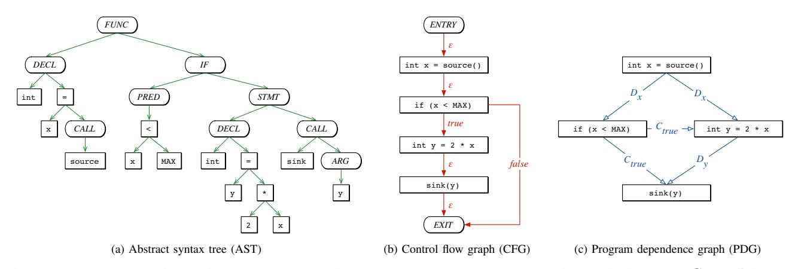
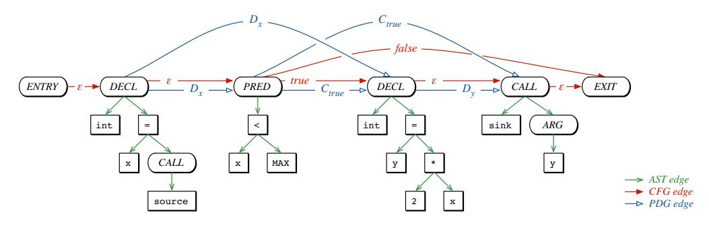

# Modeling and Discovering Vulnerabilities with Code Property Graphs

Fabian Yamaguchi∗, Nico Golde†, Daniel Arp∗ and Konrad Rieck∗ ∗University of Gottingen, Germany ¨ †Qualcomm Research Germany

*Abstract*—The vast majority of security breaches encountered today are a direct result of insecure code. Consequently, the protection of computer systems critically depends on the rigorous identification of vulnerabilities in software, a tedious and errorprone process requiring significant expertise. Unfortunately, a single flaw suffices to undermine the security of a system and thus the sheer amount of code to audit plays into the attacker's cards. In this paper, we present a method to effectively mine large amounts of source code for vulnerabilities. To this end, we introduce a novel representation of source code called a *code property graph* that merges concepts of classic program analysis, namely abstract syntax trees, control flow graphs and program dependence graphs, into a joint data structure. This comprehensive representation enables us to elegantly model templates for common vulnerabilities with *graph traversals* that, for instance, can identify buffer overflows, integer overflows, format string vulnerabilities, or memory disclosures. We implement our approach using a popular graph database and demonstrate its efficacy by identifying 18 previously unknown vulnerabilities in the source code of the Linux kernel.

#### *Keywords*—*Vulnerabilities; Static Analysis; Graph Databases*

#### I. INTRODUCTION

The security of computer systems fundamentally depends on the quality of its underlying software. Despite a long series of research in academia and industry, security vulnerabilities regularly manifest in program code, for example as failures to account for buffer boundaries or as insufficient validation of input data. Consequently, vulnerabilities in software remain one of the primary causes for security breaches today. For example, in 2013 a single buffer overflow in a universal plugand-play library rendered over 23 million routers vulnerable to attacks from the Internet [26]. Similarly, thousands of users currently fall victim to web-based malware that exploits different flaws in the Java runtime environment [29].

The discovery of software vulnerabilities is a classic yet challenging problem of security. Due to the inability of a program to identify non-trivial properties of another program, the generic problem of finding software vulnerabilities is undecidable [33]. As a consequence, current means for spotting security flaws are either limited to specific types of vulnerabilities or build on tedious and manual auditing. In particular, securing large software projects, such as an operating system kernel, resembles a daunting task, as a single flaw may undermine the security of the entire code base. Although some classes of vulnerabilities reoccurring throughout the software landscape exist for a long time, such as buffer overflows and format string vulnerabilities, automatically detecting their incarnations in specific software projects is often still not possible without significant expert knowledge [16].

As a result of this situation, security research has initially focused on statically finding specific types of vulnerabilities, such as flaws induced by insecure library functions [6], buffer overflows [45], integer overflows [40] or insufficient validation of input data [18]. Based on concepts from software testing, a broader detection of vulnerabilities has then been achieved using dynamic program analysis, ranging from simple fuzz testing [e.g., 38, 42] to advanced taint tracking and symbolic execution [e.g., 2, 35]. While these approaches can discover different types of flaws, they are hard to operate efficiently in practice and often fail to provide appropriate results due to either prohibitive runtime or the exponential growth of execution paths to consider [16, 21]. As a remedy, security research has recently started to explore approaches that assist an analyst during auditing instead of replacing her. The proposed methods accelerate the auditing process by augmenting static program analysis with expert knowledge and can thereby guide the search for vulnerabilities [e.g., 39, 43, 44].

In this paper, we continue this direction of research and present a novel approach for mining large amounts of source code for vulnerabilities. Our approach combines classic concepts of program analysis with recent developments in the field of graph mining. The key insight underlying our approach is that many vulnerabilities can only be adequately discovered by jointly taking into account the structure, control flow and dependencies of code. We address this requirement by introducing a novel representation of source code denoted as *code property graph*. This graph combines properties of abstract syntax trees, control flow graphs and program dependence graphs in a joint data structure. This comprehensive view on code enables us to elegantly model templates for common vulnerabilities using *graph traversals*. Similar to the query in a database, a graph traversal passes over the code property graph and inspects the code structure, the control flow, and the data dependencies associated with each node. This joint access to different code properties enables crafting concise templates for several types of flaws and thereby helps to audit large amounts of code for vulnerabilities.

We implement our approach using a popular graph database and demonstrate its practical merits by designing graph traversals for several well-known vulnerability types, such as buffer overflows, integer overflows, format string vulnerabilities, or memory disclosures. As a show case, we analyze the source code of the Linux kernel—a large and well-audited code base. We find that almost all vulnerabilities reported for

© 2014, Fabian Yamaguchi. Under license to IEEE. DOI 10.1109/SP.2014.44

the Linux kernel in 2012 can be described using traversals in its code property graph. Despite considerable efforts by the open-source community to improve the kernel's security, these traversals enable us to discover *18 previously unknown vulnerabilities* in the Linux kernel, thereby demonstrating the capabilities of code property graphs in practice.

In summary, we make the following contributions to the problem of vulnerability discovery:

- *Code property graph.* We introduce a novel representation of source code that combines properties of abstract syntax trees, control flow graphs and program dependence graphs in a joint data structure.
- *Traversals for vulnerability types.* We show that common types of vulnerabilities can be elegantly modeled as traversals of the code property graph and give rise to efficient detection templates.
- *Efficient implementation.* We demonstrate that by importing the code property graph into a graph database, traversals can be efficiently executed on large code bases, such as the Linux kernel.

The remainder of this paper is structured as follows: We provide background information on representations of code in Section II and define the concepts of property graphs and graph traversals in Section III. We introduce our novel representation—code property graphs—in Section IV and demonstrate how it can be used to characterize vulnerabilities in Section V. We evaluate our approach in Section VI. Related work and limitations are discussed in Section VII and VIII, respectively. Section IX concludes the paper.

#### II. REPRESENTATIONS OF CODE

Various different representations of code have been developed in the fields of program analysis and compiler design to reason about properties of programs. While these representations have been designed primarily to analyze and optimize code, they are also suited to characterize it as explored in this work. In particular, we focus on three classic representations, namely *abstract syntax trees*, *control flow graphs* and *program dependence graphs* which form the basis for our approach to vulnerability discovery. A detailed discussion of code representations can be found in the book by Aho et al. [1].

| void foo()        | 1 |
|-------------------|---|
| {                 | 2 |
| int x = source(); | 3 |
| if (x < MAX)      | 4 |
| {                 | 5 |
| int y = 2 * x;    | 6 |
| sink(y);          | 7 |
| }                 | 8 |
| }                 | 9 |

Fig. 1: Exemplary code sample (see Figure 2).

As a simple example illustrating the different representations and running through this section, we consider the code sample shown in Figure 1.

#### *A. Abstract Syntax Trees (AST)*

Abstract syntax trees are usually among the first intermediate representations produced by code parsers of compilers and thus form the basis for the generation of many other code representations. These trees faithfully encode how statements and expressions are nested to produce programs. In contrast to a *parse tree*, however, abstract syntax trees no longer represent the concrete syntax chosen to express the program. For example, in the language C, a comma-separated list of declarations will usually produce the same abstract syntax tree as two consecutive declarations.

Abstract syntax trees are ordered trees where inner nodes represent *operators* (e.g., additions or assignments) and leaf nodes correspond to *operands* (e.g., constants or identifiers). As an example, consider Figure 2a showing an abstract syntax tree for the code sample given in Figure 1. While abstract syntax trees are well suited for simple code transformations and have been employed to identify semantically similar code [3, 43], they are not applicable for more evolved code analysis, such as the detection of dead code or uninitialized variables. The reason for this deficiency is that neither the control flow nor data dependencies are made explicit by this representation of code.

### *B. Control Flow Graphs (CFG)*

A control flow graph explicitly describes the order in which code statements are executed as well as conditions that need to be met for a particular path of execution to be taken. To this end, statements and predicates are represented by nodes, which are connected by directed edges to indicate the transfer of control. While these edges need not be ordered as in the case of the abstract syntax trees, it is necessary to assign a label of *true*, *false* or to each edge. In particular, a statement node has one outgoing edge labeled as -, whereas a predicate node has two outgoing edges corresponding to a *true* or *false* evaluation of the predicate. Control flow graphs can be constructed from abstract syntax trees in a two step procedure: first, structured control statements (e.g., *if*, *while*, *for*) are taken into account to build a preliminary control flow graph. Second, the preliminary control flow graph is corrected by additionally considering unstructured control statements such as *goto*, *break* and *continue*. Figure 2b shows the CFG for the code sample given in Figure 1.

Control flow graphs have been used for a variety of applications in the security context, e.g., to detect variants of known malicious applications [11] and to guide fuzz testing tools [37]. Moreover, they have become a standard code representation in reverse engineering to aid in program understanding. However, while control flow graphs expose the control flow of an application, they fail to provide data flow information. For vulnerability analysis in particular, this means that control flow graphs cannot be easily used to identify statements, which process data influenced by an attacker.

## *C. Program Dependence Graphs (PDG)*

Program dependence graphs introduced by Ferrante et al. [9] have been originally developed to perform program slic-

Fig. 2: Representations of code for the example in Figure 1. Control and data dependencies are indicated by C and D in the program dependence graph.

ing [41], that is, to determine all statements and predicates of a program that affect the value of a variable at a specified statement. The program dependence graph explicitly represents dependencies among statements and predicates. In particular, the graph is constructed using two types of edges: data dependency edges reflecting the influence of one variable on another and control dependency edges corresponding to the influence of predicates on the values of variables. The edges of a program dependence graph can be calculated from a control flow graph by first determining the set of variables *defined* and the set of variables *used* by each statement and calculating *reaching definitions* for each statement and predicate, a standard problem from compiler design [see 1].

As an example, Figure 2c shows the program dependence graph for the code sample given in Figure 1. Note that control dependency edges are not simply control flow edges and, in particular, that the order in which statements are executed can no longer be determined from the graph, whereas dependencies between statements and predicates are clearly visible.

#### III. PROPERTY GRAPHS AND TRAVERSALS

Each of the presented representations provides a unique view on source code emphasizing different aspects of the underlying program. To combine these views into a joint representation for vulnerability discovery, we employ the concept of a *property graph* [34], which is a basic representation of structured data in many graph databases, as for example ArangoDB, Neo4J and OrientDB. Formally, a property graph is defined as follows.

Definition 1. A *property graph* G = (V, E, λ, μ) is a directed, edge-labeled, attributed multigraph where V is a set of nodes, E ⊆ (V × V ) is a set of directed edges, and λ : E → Σ is an edge labeling function assigning a label from the alphabet Σ to each edge. Properties can be assigned to edges and nodes by the function μ : (V ∪ E) × K → S where K is a set of property keys and S the set of property values.

Figure 3 shows a simple property graph with four nodes. Note that property graphs are multigraphs and thus two nodes may be connected by multiple edges, as for example the nodes A and B in Figure 3. Moreover, in the example, a property with key k ∈ K is assigned to each node, where only the nodes A and B store property values from the set S = {x, w}.

Fig. 3: Example of a property graph. Properties assigned to nodes are indicated by dashed lines.

The main tool for mining information in property graphs are so-called *graph traversals*, or short *traversals*, which can be used to move along the edges of the graph depending on the labels and properties. Formally, a traversal of the graph is defined as follows.

Definition 2. A *traversal* is a function T : P(V ) → P(V ) that maps a set of nodes to another set of nodes according to a property graph G, where P is the power set of V .

This generic definition allows for chaining multiple traversals together. For example, two graph traversals T0 and T1 can be chained together to T0 ◦ T1 using a function composition ◦. Based on this chaining, we can define a number of elementary traversals, which serve as a basis for the construction of all other traversals discussed in this paper. We begin by defining a simple filter traversal

$$
\text{Filter}_p(X) = \{ v \in X : p(v) \}
$$

that returns all nodes in the set X matching the Boolean predicate p(v), for example, by checking for a certain property.

To move along the edges of a property graph, we define the following forward traversals

$$
OUT(X) = \bigcup_{v \in X} \{u : (v, u) \in E\},\
$$

$$
OUT_l(X) = \bigcup_{v \in X} \{u : (v, u) \in E \text{ and } \lambda((v, u)) = l\},\
$$

$$
OUT_l^{k,s}(X) = \bigcup_{v \in X} \{u : (v, u) \in E \text{ and } \lambda((v, u)) = l
$$

and  $\mu((v, u), k) = s\}$ 

which return nodes reachable from the set of nodes X. In detail, the traversal OUT returns all nodes reachable from X, OUTl returns all nodes reachable over edges with label l, and OUTk,s l all nodes reachable over edges with label l and property k:s. Similarly, we define traversals IN, INl and INk,s l for moving backward in the graph by

$$
IN(X) = \bigcup_{u \in X} \{v : (v, u) \in E\},\
$$

$$
IN_l(X) = \bigcup_{u \in X} \{v : (v, u) \in E \text{ and } \lambda((v, u)) = l\},\
$$

$$
IN_l^{k,s}(X) = \bigcup_{u \in X} \{v : (v, u) \in E \text{ and } \lambda((v, u)) = l \text{ and } \mu((v, u), k) = s\}.
$$

Finally, we define two traversals OR and AND to aggregate the output of other traversals as follows:

$$
OR(\mathcal{T}_1, ..., \mathcal{T}_N)(X) = \mathcal{T}_1(X) \cup ... \cup \mathcal{T}_N(X)
$$
  
AND( $\mathcal{T}_1, ..., \mathcal{T}_N$ )(X) =  $\mathcal{T}_1(X) \cap ... \cap \mathcal{T}_N(X)$ 

Despite the slightly technical definitions, several graph databases provide efficient implementations for these elementary traversals. In particular, the FILTER, OUT and IN traversals are basic functions of the graph language *Gremlin* supported by popular databases, such as Neo4J and InfiniteGraph. We discuss the details of implementing graph traversals along with the evaluation of our approach in Section VI.

#### IV. CODE PROPERTY GRAPHS

Each of the representations presented in Section II captures certain properties of the underlying software. However, a single representation alone is insufficient to characterize a vulnerability type in the vast majority of cases. We thus combine the three representation into a joint data structure using the concept of property graphs introduced in Section III. In particular, we first model ASTs, CFGs and PDGs as property graphs and then proceed to merge them to one graph offering all advantages of the individual representations.

#### *A. Transforming the Abstract Syntax Tree*

The only representation offering a detailed decomposition of source code into language constructs is the AST. Hence, we start the construction of a joint representation by expressing an AST as a property graph GA = (VA, EA, λA , μA), where the nodes VA are given by the tree nodes and the edges EA are the corresponding tree edges labeled as AST edges by the labeling function λA. Additionally, we assign a property *code* to each node using μA, such that the property value corresponds to the operator or operand the node represents. Finally, we assign a property *order* to each node to reflect the ordered structure of the tree. As a result, the property keys of the graph are KA = {*code*, *order*} while the set of property values SA is given by all operators and operands and the natural numbers.

# *B. Transforming the Control Flow Graph*

As the next step, we prepare the CFG for incorporation into a joint representation. For this purpose, we express the CFG as a property graph GC = (VC , EC , λC , ·), where the nodes VC simply correspond to statements and predicates in the AST, that is, all nodes VA with the property values *STMT* and *PRED* for the key *code*. Furthermore, we define an edge labeling function λC that assigns a label from the set ΣC = {*true*, *false*, -} to all edges in the property graph.

#### *C. Transforming the Program Dependence Graph*

The PDG represents data and control dependencies among statements and predicates. The nodes of this graph are thus the same as those of the CFG and only the edges of the two graphs differ. Hence, the PDG can be represented as a property graph GP = (VC , EP , λP , μp) simply by defining a new set of edges EP and a corresponding edge labeling function λP : Ep → ΣP where ΣP = {*C*, *D*} corresponds to control and data dependencies. Additionally, we assign a property *symbol* to each data dependency to indicate the corresponding symbol and a property *condition* to each control dependency to indicate the state of the originating predicate as *true* or *false*.

#### *D. Combining the Representations*

As the last step, we combine the three property graphs into a joint data structure denoted as *code property graph*. The key insight necessary to construct this graph is that in each of the three graphs, a node exists for each statement and predicate in the source code. In fact, the AST is the only one of the three representations, which introduces additional nodes. Statement and predicate nodes thus naturally connect representations and serve as transition points from one representation to another.

Definition 3. A *code property graph* is a property graph G = (V, E, λ, μ) constructed from the AST, CFG and PDG of source code with

- V = VA,
- E = EA ∪ EC ∪ EP ,
- λ = λA ∪ λC ∪ λP and
- μ = μA ∪ μE,

where we combine the labeling and property functions with a slight abuse of notation.

An example of a code property graph is shown in Figure 4 for the code sample given in Figure 1. For simplicity, property keys and values as well as labels on AST edges are not

Fig. 4: Code property graph for the code sample given in Figure 1.

shown. The nodes of the graph mainly match the AST in Figure 2a (except for the irrelevant *FUNC* and *IF* node), while the transformed CFG and PDG are indicated by colored edges.

# V. TRAVERSALS FOR WELL-KNOWN TYPES OF VULNERABILITIES

The code property graph allows many different kinds of programming patterns to be expressed, however, it is not immediately clear how it can be employed to discover vulnerabilities. In this section, we show that code property graphs can be effectively mined to identify many different types of security flaws and develop templates for the description of vulnerabilities. We begin by exploring the limitations of purely syntactic descriptions of code in Section V-B and proceed to show that additional control flow information only provides a slight improvement (Section V-C). Finally, in Section V-D, data flow, control flow and syntactical information are combined, thus making a large variety of vulnerabilities accessible.

#### *A. Motivational Example*

We begin with a recent example of a buffer overflow found in an SSH implementation by Esser [7] exposing many Apple iOS applications to attack. Esser employed a regular expression to spot the vulnerable code shown in Figure 5.

| [...]                                               | 1  |
|-----------------------------------------------------|----|
| if (channelp) {                                     | 2  |
| /* set signal name (without SIG prefix) */          | 3  |
| uint32_t namelen =                                  | 4  |
| _libssh2_ntohu32(data + 9 + sizeof("exit-signal")); | 5  |
| channelp->exit_signal =                             | 6  |
| LIBSSH2_ALLOC(session, namelen + 1);                | 7  |
| [...]                                               | 8  |
| memcpy(channelp->exit_signal,                       | 9  |
| data + 13 + sizeof("exit_signal"), namelen);        | 10 |
| channelp->exit_signal[namelen] = '\0';              | 11 |
| [...]                                               | 12 |
| }                                                   | 13 |
| [...]                                               | 14 |

Fig. 5: Excerpt from the code of libssh2 showing a vulnerability in the function *libssh2 packet add*

The vulnerable statement (marked in red) allocates memory for the buffer *exit signal* using the function *LIBSSH2 ALLOC* on line 6. The amount of memory to allocate is calculated directly in the argument by adding 1 to the variable *namelen*. Unfortunately, this variable is attacker-controlled and thus if it is chosen to be the maximum size of a 32-bit unsigned integer, the summation wraps and a value of 0 is passed to the allocation function resulting in the allocation of only a few padding bytes. When *namelen* bytes are then copied into the undersized buffer on line 9, a buffer overflow occurs.

Esser was able to discover the vulnerable statement on line 6 using the following regular expression:

ALLOC[A-Z0-9\_]\*\s\*\([ˆ,]\*,[ˆ;]\*[\*+-][ˆ>][ˆ;]\*\)\s\*; .

Unfortunately, the regular expression only describes the summation inside the allocation call, one of a number of necessary conditions for the vulnerability. Moreover, the description is inherently vague as regular expressions cannot match the nested structure of code. However, the biggest drawback of the formulation is that the description fails to model attacker control over the variable *namelen*. Furthermore, the vulnerability would not exist if the variable had been properly sanitized. Finally, the width of the variable is vital for the vulnerability.

This simple example gives insight into the different properties of code that play a role in the characterization of vulnerability patterns. In summary, the following aspects need to be covered.

- 1) *Sensitive operations.* Security sensitive operations such as calls to protected functionality, copying into buffers or the allocation of memory need to be describable. As the example shows, nested code such as arithmetic operations inside allocations are of great interest, and thus full access to an AST is necessary.
- 2) *Type usage.* Many vulnerabilities are tightly bound to data types used in a program. For example, the vulnerability shown in Figure 5 would not exist if *namelen* was a 16 bit integer as opposed to a 32 bit integer. This information is present in the AST.
- 3) *Attacker control.* Analysts must be able to express which data sources are under attacker control. Referring to the example, it is highly likely that variables returned by *libssh2 ntohu32* are attacker-controlled as the routine converts an integer from network to host byte order and hence the integer is almost certainly received from

a network. Data dependencies as expressed by the PDG are needed in order to model this.

4) *Sanitization.* Finally, many vulnerabilities only occur if a program lacks proper sanitization of attackercontrolled data. If in the example, the variable *namelen* had been checked to be in a safe range *before* allocation, the vulnerability would not exist. Modeling statement order as made explicit by the CFG is thus crucial.

We now analyze in detail how the different views provided by the code property graph contribute to the construction of successful graph traversals for vulnerability discovery.

# *B. Syntax-Only Vulnerability Descriptions*

The code property graph exposes all information originally contained in the abstract syntax tree. This information is sufficient to describe attacker-controlled sources, sensitive operations and sanitizers, but fails to capture the interplay between statements as illustrated in this section.

We begin by describing the vulnerable statement in Figure 5 by its syntactical structure. The key property of the vulnerability is that a summation occurs directly in an argument to an allocation function, a simple example already introducing two challenges: first, we need to determine whether a function contains summations and calls; second, we need to capture the nested structure of code.

The first problem can be addressed by obtaining all nodes of a function and subsequently filtering them to determine whether any of the nodes represent summations or calls. Finding all nodes of an AST that match a criterion is a reoccurring problem. We address it once and for all by defining a re-usable traversal TNODES that traverses from the root of an AST to all nodes of the AST.1 This immediately allows us to determine whether an AST contains summation or call nodes simply by combining TNODES with FILTER to obtain

$$
MATCH_p(V) = FILTER_p \circ TNODES(V)
$$

which traverses to all nodes contained in ASTs rooted at all v ∈ V and filters these nodes according to the predicate p. Traversing to all calls to allocation functions in the code can then simply be achieved by running a MATCH traversal where V is the set of all function nodes and p(v) is true if v is a call to an allocation function.

The second problem, i.e., identifying summations nested inside arguments to calls now becomes easy to solve as well, as MATCH traversals can simply be chained using function composition, e.g., to identify summations inside i'th arguments to a function f, we use the traversal

$$
\mathrm{MATCH}_p \circ \mathrm{ARG}_f^i
$$

where ARGi f is a MATCH traversal returning i-th arguments of calls to functions named f and p(v) is true if μ(v, *code*) = *Summation* and false otherwise.

MATCH traversals alone are not suited to characterize the interplay between statements, however, they form the basis for the precise description of sensitive operations, sanitizers and attacker controlled sources in the vast majority of vulnerability types. Moreover, there are a number of cases where characterizing a single statement can already narrow the search for vulnerabilities of a type as seen in the example of Figure 5. The following are examples of vulnerability types where MATCH traversals alone are equally successful.

• *Insecure arguments.* Insecure arguments are a common source for vulnerabilities. For example, format string vulnerabilities [see 12, 31, 36] result when an attackercontrolled format string is passed to functions such as *printf* or *sprintf* and can be exploited for arbitrary code execution on several platforms. A necessary condition for format string vulnerabilities is that the format string passed to a utility function such as *printf*, *sprintf* or *fprintf* is not a constant string. This can be described using a MATCH traversal as follows:

#### MATCHp ◦ ARG1 sprintf

where p is true if v does not represent a constant string, i.e., if μ(v, *code*) = *String*. While this traversal does not model attacker control, it is successful in practice as there are few reasons to ever supply a non-constant format string.

• *Integer overflows.* Cases where arithmetic operations are performed inside arguments to allocation functions are prime candidates for integer overflows leading to the corruption of memory as shown in the motivating example depicted in Figure 5. These can be easily expressed by traversals such as the following:

#### MATCHp ◦ ARG1 malloc

where p(v) is true if v is an arithmetic operation, e.g., μ(v, code) = *Multiplication*.

• *Integer type issues.* Several types of vulnerabilities are a direct consequence of type conversions unforeseen by developers. In particular, buffer overflows are often caused by incorrectly calculated or verified buffer sizes resulting from implicit integer casts. As an example, an *integer truncation* occurs when integers on the righthand side of an assignment are wider than those on the left hand side. Spotting these types of vulnerabilities is a little more evolved than in the previous two cases as the left and right subtrees of assignments need to be compared in order to determine vulnerable cases. To this end, we define the function PAIRST2 T1 . Starting from a set of nodes, e.g., all assignment nodes, PAIRS performs two independent traversals T1 and T2, for example, one that traverses to the left subtree of the assignment and one that traverses to the right, and combines the results of the two traversals into pairs. These pairs can then be filtered according to a predicate p using the function PAIRFILTERp defined analogously to FILTER2. Integer truncations can now easily be detected by combining the two functions with MATCH, yielding the traversal

PAIRFILTERp1 ◦ PAIRST2 T1 ◦ MATCHp2

1A formal definition is given in Appendix IX-A.

2Formal definitions of PAIR and PAIRFILTER are given in Appendix IX-C.

where p1 is true if the second node denotes a variable with a type wider than that of the first node, p2 is true if the node is an assignment and finally, T1 and T2 traverse to left and right subtrees of assignments respectively.

While most attempts to characterize vulnerabilities based on MATCH traversals alone are bound to fail, as statements cannot be put into relation, it is possible to combine several MATCH traversals using AND and OR as introduced in Section III to narrow in on potentially interesting code. For example, *missing permission checks* [see 27, 44] can be characterized by the security critical operation and attacker-controlled source which must occur and a check which may not occur in order for the code to be vulnerable. Unfortunately, this is also the best one can do using abstract syntax trees and we provide the following definition to capture this.

Definition 4. A *syntax-only vulnerability description* S is a 2-tuple (M0,M1) where M0 and M1 are sets of MATCH traversals. An AST node matches a syntax-only description if it matches all MATCH traversals in M0 and none of the traversals in M1.

Syntax-only vulnerability descriptions are often effective in practice, however, as it is not possible to express attacker control nor the interaction of statements, they often produce a high number of false positives. In the next section, we discuss descriptions based on control flow that tackle this problem partially.

#### *C. Control-Flow Vulnerability Descriptions*

By using the control flow edges of the code property graph, a wider range of vulnerabilities becomes accessible as we can model statement execution order. In particular, vulnerabilities corresponding to paths in the control flow graph, such as the following, can be described well.

- *Resource leaks.* Many vulnerabilities exist where resources are allocated which are not properly deallocated on all error paths. In typical cases, this leads to a system becoming unavailable, however, it can also be used to trigger further vulnerabilities.
- *Failure to release locks.* While concurrency issues in the general case are hard to detect, simple control flow analysis can be used to detect cases where a lock is not released on an error path.
- *Use-after-free vulnerabilities.* Software defects where code accesses an already released memory region are often exploitable for arbitrary code execution. While these vulnerabilities often result from complicated interactions of several seemingly unrelated functions, simple control flow analysis can suffice to identify these vulnerabilities within a function.

In all three cases, a vulnerability can be associated with a specific path in the control flow graph. For example, resource leaks are tied to a path in the control flow graph leading from a statement attaining memory (e.g., a call to *malloc*) to the end of the function without passing through a statement that releases the resource (e.g., a call to *free*). However, the path is only relevant if the allocation function returns a pointer to allocated memory and thus we need to attach additional constraints to paths in the control flow graph. We capture these observations in the following definition.

Definition 5. A *control-flow vulnerability description* is a 4-tuple (Ssrc, Send, Sdst, {(Si cnd, ti)}i=1...N ) where Ssrc is a syntax-only description for source statements, Send for end-statements, Sdst for destination statements and {(Si cnd, ti)}i=1...N is a list of syntax-only descriptions for conditions and associated outcomes ti ∈ {true, false}. A node v matches a control-flow vulnerability description if the following conditions hold:

- The AST rooted at v contains a subtree with the root node vsrc that matches Ssrc.
- There exists a path in the control flow graph from vsrc to a node matching Send that does not lead through a node matching Sdst.
- For all 1 ≤ i ≤ N, if a node matches the description Si cnd, all edges of the path originating from the node must be labeled as ti.

Control-based vulnerabilities can be expressed using a traversal which performs a depth-first search to find all paths from a given set of source nodes to end-nodes which do not lead through nodes matching the destination description and adhere to the condition description and associated outcomes. A formal definition of this traversal is omitted for brevity.

Unfortunately, control flow and syntactical information alone are usually not sufficient to specify vulnerability patterns as one is particularly interested in tracking the flow of attacker controlled data as we discuss in the next section.

#### *D. Taint-Style Vulnerability Descriptions*

Finally, we combine syntax, control and data flow information to model vulnerabilities. Compared to syntax-only and control-flow vulnerability descriptions, we gain the additional capability to model attacker control using data flow edges.

As each statement node contains incoming data flow edges from all assignments and variable definitions reaching it, we can easily traverse to all statements producing variables used by a statement simply by following these edges. However, a small difficulty arises as only statement nodes are connected by data flow edges and thus if, for example, we want to traverse from an argument of a function call to its data producers, we must first traverse to the enclosing statement. Fortunately, this can easily be achieved using the traversal STATEMENT formally defined in Appendix IX-B. The producers of variables for a set of nodes can then be calculated using the traversal

$$
PRODUCERS_{\mathcal{N}} = \bigcup_{n \in \mathcal{N}} IN_{D}^{symbol,n} \circ \text{STATEMENT}
$$

where N is a set of identifiers of interest, allowing us to restrict analysis to a subset of the variables used by a statement. For convenience, we also define the traversal SOURCES to describe all statements producing data for any of the variables used by a statement.

SOURCES is a valuable traversal as it can be combined with syntax-only descriptions for sensitive operations and data sources to identify cases where attacker-controlled data is used by a sensitive operation. For example, a common incarnation of buffer overflows in the Linux kernel is that a user-provided integer produced by the function *get user* is directly used as a size-field in a *memcpy* operation. We can formulate the following traversal to identify such vulnerabilities:

$$
\text{MATCH}_p \circ \text{Sources} \circ \text{ARG}_{\text{memory}}^3
$$

where p is a predicate returning true if a node represents a call to *get user*, i.e., we traverse to all calls to *get user* directly producing third arguments of *memcpy*. In addition, the traversal SOURCES can be chained an arbitrary number of times to identify cases where arguments are only indirectly generated by the attacker-controlled source.

A weakness of this formulation is that it does not account for data sanitization and thus, even cases are returned where data is checked to ensure that it is not harmful. A possibility to account for sanitizers is to introduce additional syntax-only descriptions, however, this does not take into account the order of statements, making it impossible to detect whether a check is placed correctly. We address this deficiency by using a combination of control and data flow information. In particular, we are interested in creating a traversal providing the same functionality as SOURCES, but additionally allowing a syntaxonly description for sanitizers to be supplied.

We define the traversal UNSANITIZED3 as a drop-in replacement for SOURCES which additionally allows symbolspecific syntax-only sanitizer descriptions Ss val for symbols s to be supplied to exclude all properly sanitized cases. The traversal returns attacker-controlled sources only if they meet the following two conditions.

- There exists a path from the source statement to the sink statement in the control flow graph such that no node on the path matches any of the sanitizer descriptions.
- A variable defined by the source and used by the sink reaches the sink via the control flow path, i.e., the variable is not redefined by any node on the path.

Combining syntax-only descriptions and the UNSANITIZED traversal, we define taint-style vulnerability description as follows.

Definition 6. A *taint-style vulnerability description* is a 3-tuple (Ssrc, Sdst, Ss san) given by a syntax-only description Ssrc for attacker-controlled sources, for security sensitive sinks (Sdst) and a set of syntax-only descriptions for sanitizers (Ss san). A node v matches a taint-style description if the AST rooted at v contains a subtree with the root node vsource that matches Ssrc and another subtree rooted at vsink matching Sdst and

- there exists a path of data dependency edges from vsource to vsink, i.e., a sequence of nodes (v0,...,vn) exists such that v0 = vsource, vn = vsink, ei = (vi, vi+1) ∈ E and λ(ei) = D for all i = 0,...,n − 1.
- for each of these data dependency edges ei = (vi, vi+1), there exists a path (v0,...,vm) in the control flow graph from vi to vi+1 such that for all k, 0 ≤ k ≤ m, vk

does not define μ(ei,*symbol*) and vk does not match the sanitizer description Sμ((vi,vi+1),*symbol*) san .

Taint-style descriptions are well suited to define traversals for vulnerabilities that can be described by a validated sourcesink system [see 18]. Examples for these types of vulnerabilities are injection vulnerabilities, buffer overflows, integer overflows, integer type vulnerabilities, insecure arguments, missing permission checks and even memory disclosure. The following examples illustrate this.

• *Buffer overflow vulnerabilities.* As discussed to motivate flow-based descriptions, many buffer overflows are the result of insufficient validation of length fields passed to copy operations. For example, in Linux kernel code, many buffer overflows result from size fields read by the function *get user* and passed as a third argument to *memcpy* or *copy from user* without undergoing validation. This vulnerability pattern can be expressed by a traversal such as:

$$
\text{ARG}^{1}_{get\_user} \circ \text{UNSANITIZED}_{\{\mathcal{T}_s\}} \circ \text{ARG}^{3}_{memory}
$$

This traversal selects all third arguments to *memcpy* directly tainted by first arguments to *get user* not being validated by a node matching the traversal Ts, e.g., a match traversal matching relational expressions involving the tracked variable s. Traversal of this type can easily be extended to include arguments tainted indirectly, by chaining UNSANITIZED traversals.

• *Code injection vulnerabilities.* Vulnerabilities such as SQL and command injection can be described well using taint-style descriptions. For example, a typical command injection vulnerability allowing an attacker to execute arbitrary shell commands could be described using a traversal such as:

$$
\text{ARG}^2_{recv} \circ \text{UNSANITIZED}_{\{\mathcal{T}_s\}} \circ \text{ARG}^1_{system}
$$

where Ts is a traversal matching comparisons to semicolons and calls to well known validation functions. This traversal returns all cases where a second argument to *recv* reaches a first argument to *system* without checking whether it contains a semicolon.

• *Missing permission checks.* Both web application and kernel code commonly need to check user permissions before executing an operation and failure to do so allows privileges to be escalated [see 27, 44]. Vulnerabilities of this type can be expressed as follows:

$$
\text{Match}_{p1} \circ \text{Unsanitized}_{\{ \text{Match}_{p2} \}} \circ \text{Match}_{p3}
$$

where p1, p2 and p3 are predicates describing attackercontrolled sources, checks to ensure the user has sufficient permissions and security sensitive operations, respectively.

Taint-style descriptions allow us to describe attacker controlled sources, security sensitive operations, sanitizers, type information and even the interplay of statements in terms of data and control flow. This enables us to provide search queries covering a wide range of vulnerabilities. In the next section,

3A formal definition of UNSANITIZED is given in Appendix IX-E

we present an evaluation of our approach, showing that the types of vulnerabilities covered are indeed relevant for today's security-critical code.

#### VI. EVALUATION

We proceed to evaluate the practical efficacy of our approach on the source code of the Linux kernel, a large code base that is regularly audited for vulnerabilities by several software vendors and the open-source community. Our evaluation is carried out in two steps: first, we conduct a *coverage analysis* by reviewing the code of all vulnerabilities reported for the Linux kernel in 2012 and determining which vulnerability types can be modeled using graph traversals (Section VI-B). Second, we study the ability of our approach to *discover vulnerabilities* by constructing traversals for prevalent vulnerabilities and applying them to the code property graph of the Linux kernel (Section VI-C).

#### *A. Implementation*

For our evaluation we implement a static code analysis system based on the idea of code property graphs4. Our system employs a robust C/C++ parser to first extract ASTs for each function in a given code base. We then transform these ASTs into CFGs and PDGs and merge all three representations to a code property graph as outlined in Section IV. Additionally, we introduce nodes for global variables and structure declarations in the code. We finally link together the graphs of all functions based on visible caller-callee relationships, thus representing the entire code base as one large code property graph.

For the source code of the Linux kernel, we obtain a graph with 52 million nodes and 87 million edges. Obviously, mining information in such a large graph on commodity hardware is far from being a trivial task. Fortunately, we can make use of specialized graph databases that are capable of providing efficient access to very large property graphs (we employ *Neo4J Version 1.9.5*). Moreover, these graph databases allow us to benefit from sophisticated caching algorithms that accelerate traversals over the graph.

Using a prototype implementation, importing the Linux kernel version 3.10-rc1 with approximately 1.3 million lines of code takes a total of 110 minutes on a laptop computer with a 2.5 GHz Intel Core i5 CPU and 8 GB of main memory. The resulting database requires 14 GB of disk space for nodes and edges as well as another 14 GB for efficient indexing.

For implementing graph traversals, we find *Gremlin* to be a well suited graph language, as it allows user-defined traversals to be chained and provided to the database, thus implementing a mechanism similar to stored procedures in SQL databases. This enables us to convert the different traversals presented in Section V directly to Gremlin code. Furthermore, Gremlin is one of the few languages interfacing with databases over the compatibility layer *Blueprints*, thereby enabling us to run all crafted traversals against other graph database implementations without modification.

Running the traversals for vulnerability discovery presented in this paper takes under 40 seconds on a cold database, i.e., when database contents needs to be read from hard disk. Once nodes and edges are cached in main memory, execution time reduces to 30 seconds where the vast majority of time is spent to determine viable control flow paths in large functions using the traversal UNSANITIZED.

# *B. Coverage Analysis*

We begin our analysis by querying the central vulnerability database maintained by the MITRE organization for all CVE identifiers allocated to vulnerabilities in the Linux kernel in 2012. In total we retrieve 69 identifiers addressing 88 unique vulnerabilities in the source code of the kernel. To categorize these vulnerabilities into different types we manually inspect the patches for each of the vulnerabilities and determine the root-cause of the reported flaw. With this information we are able to assign the 88 vulnerabilities to 12 common types as shown in Table I. More than half of the vulnerabilities (47 out of 88) are either memory disclosures, buffer overflows or resource leaks—all of which can be expressed well using graph traversals as discussed in Section V.

To assess the coverage of our approach, we analyze which code representations are necessary to describe the 12 vulnerability types discovered in the Linux kernel. In particular, we analyze the coverage of (a) an AST alone, (b) the combination of an AST and PDG, (c) the combination of an AST and CFG, and (d) the combination of an AST, PDG and CFG. The results of this analysis are presented in Table II.

| Vulnerability types       | Code representations |         |         |             |
|---------------------------|----------------------|---------|---------|-------------|
|                           | AST                  | AST+PDG | AST+CFG | AST+CFG+PDG |
| Memory Disclosure         |                      |         |         | ✓           |
| Buffer Overflow           |                      | (✓)     |         | ✓           |
| Resource Leaks            |                      |         | ✓       | ✓           |
| Design Errors             |                      |         |         | ✓           |
| Null Pointer Dereference  |                      |         |         | ✓           |
| Missing Permission Checks |                      | ✓       |         | ✓           |
| Race Conditions           |                      | ✓       |         | ✓           |
| Integer Overflows         |                      |         |         | ✓           |
| Division by Zero          |                      | ✓       |         | ✓           |
| Use After Free            |                      |         | (✓)     | (✓)         |
| Integer Type Issues       |                      |         |         | ✓           |
| Insecure Arguments        | ✓                    |         | ✓       | ✓           |

TABLE II: Coverage of different code representation for modeling vulnerability types.

Obviously, the AST alone provides only little information for spotting security flaws and thus only some forms of insecure arguments, e.g. incorrect type casts, can be discovered using this representation. By combining the information from the AST and PDG, we obtain a better view of the code and can describe different classes of buffer overflows, missing permission checks and divisions by zero. However, the combination of an AST and PDG is of limited use in cases where the order of statements matters, for example, when the location of a security check needs to be determined. The combination of an AST and CFG also misses some vulnerabilities, since most

4http://mlsec.org/joern/

| Vulnerability types          | Description                                                                                                                       | #  |
|------------------------------|-----------------------------------------------------------------------------------------------------------------------------------|----|
| Memory Disclosure            | A structure is copied to user space and not all fields or padding bytes are properly initialized resulting in memory disclosure.  | 21 |
| Buffer Overflows             | A length field involved in a copy operation is not checked resulting in buffer overflows.                                         | 16 |
| Resource Leaks               | A function creates a resource, but it is not destroyed on all error paths.                                                        | 10 |
| Design Errors                | Program design does not sufficiently implement security policies.                                                                 | 10 |
| Null Pointer Dereference     | A pointer controlled by an attacker is dereferenced without checking whether it is null.                                          | 8  |
| Missing Permission Checks    | A security sensitive operation can be accessed without undergoing a prior permission check.                                       | 6  |
| Race Conditions              | Concurrently running processes cause various types of vulnerabilities.                                                            | 6  |
| Integer Overflows            | A length field involved in a copy operation is checked, but the check is insufficient as integer overflows are not accounted for. | 3  |
| Division by Zero             | An attacker-controlled value is a denominator in a division and it is allowed to be zero.                                         | 3  |
| Use After Free               | An allocated block of memory is used after being freed by the allocator.                                                          | 3  |
| Integer Type Vulnerabilities | A length field involved in a copy operation is checked, but the check is insufficient as the length field is a signed integer.    | 1  |
| Insecure Arguments           | Passing arguments to a function results in an implicit, insecure type cast.                                                       | 1  |
| Total vulnerabilities        |                                                                                                                                   | 88 |

TABLE I: Vulnerabilities discovered in the Linux kernel in 2012 sorted by vulnerability type.

vulnerability types require the flow of attacker-controlled data to be modeled. Still, resources leaks and some use-after-free vulnerabilities can be identified from the flow of statements encoded in a CFG.

By combining all three representations in a code property graph, we are finally able to model 10 of the 12 vulnerability types, making use of information available from the AST, CFG and PDG. The two remaining types, race conditions and design errors, are hard to express using graph traversals, as the first depends on runtime properties and the second is difficult to model without details on the intended design of a program. Moreover, there exist many contrived cases of use-after-free vulnerabilities that are difficult to describe without runtime information. We provide a discussion of the limitations of our approach in Section VII.

# *C. Discovery of Vulnerabilities*

Graph traversals over code property graphs are well suited to describe many vulnerability types, however, it remains to be shown that they are effective in practice. To this end, we practically evaluate our method by mining the code property graph of the Linux kernel using traversals for different kinds of vulnerabilities.

We begin by specifying traversals for the two most common vulnerability types encountered in 2012, *buffer overflows* due to missing bounds checks and *memory disclosures* caused by incompletely initialized structures. We proceed to build traversals for types of vulnerabilities not encountered in 2012, namely *memory mapping vulnerabilities* and *zero-byte allocations*, both of which are types of vulnerabilities very specific to the Linux kernel and thus hard to spot with conventional tools. In summary, we used the following traversals in our experiments.

- *Buffer overflows.* We construct a traversal for buffer overflows resulting from missing checks on attacker controlled length fields. This traversal is discussed in detail in Section VI-D.
- *Memory disclosures.* The largest number of security critical flaws found in the Linux kernel in 2012 are caused by improperly initialized structures copied to user space. These flaws can be used by attackers to leak sensitive objects stored in kernel memory. To identify

these vulnerabilities, we construct a taint-style traversal from local declarations of structures to operations copying to user space which do not pass through *memset*. Moreover, we lookup the structure type and use a syntaxonly description to determine whether all fields of the structure are assigned to.

- *Memory mapping.* The kernel must ensure that users cannot map arbitrary physical memory addresses to user space in order to prevent leaking of confidential information and arbitrary code execution. This is a vulnerability type which is very specific to kernels. We formulate a simple syntax-only vulnerability description to identify these vulnerabilities, showing that our method can be adapted well to program-specific bugs.
- *Zero-byte allocations.* Cases where an attacker can cause an allocation function to receive a length field of zero bytes often lead to crashes in the Linux kernel as many of its allocation functions return error-codes instead of allocated memory. This is uncommon when compared to other allocators and thus represents a rather programspecific vulnerability. We cover these cases with a taintstyle traversal.

Overall, by running the four traversals, we identified 18 previously unknown vulnerabilities, all of which have been addressed by kernel developers. It is particularly alarming to see that 9 out of the total of 18 vulnerabilities are vulnerability types prevalent in the last year. This shows that it can be sufficient for attackers to model existing vulnerability patterns to effectively find similar flaws in the code base using traversals. Table III summarizes our findings.

We now proceed to discuss a case study to illustrate the vulnerability discovery process using graph traversals, showing how a simple traversal allowed us to identify seven previously unknown buffer overflow vulnerabilities while reviewing only eleven functions.

# *D. Case Study: Buffer Overflow Identification*

In the following, we present a traversal to identify buffer overflows caused by missing validation checks on length fields. These types of vulnerabilities can be elegantly expressed using taint-style descriptions and hence as traversals of the form T0 ◦ UNSANITIZEDT s 1 ◦ T2. To this end, we merely need to define

| Type                 | Location                                 | Developer Feedback | Identifier    |
|----------------------|------------------------------------------|--------------------|---------------|
| Buffer Overflow      | arch/um/kernel/exitcode.c                | Fixed              | CVE-2013-4512 |
| Buffer Overflow      | drivers/staging/ozwpan/ozcdev.c          | Fixed              | CVE-2013-4513 |
| Buffer Overflow      | drivers/s390/net/qeth_core_main.c        | Fixed              | CVE-2013-6381 |
| Buffer Overflow      | drivers/staging/wlags49_h2/wl_priv.c     | Fixed              | CVE-2013-4514 |
| Buffer Overflow      | drivers/scsi/megaraid/megaraid_mm.c      | Fixed              | -             |
| Buffer Overflow      | drivers/infiniband/hw/ipath/ipath_diag.c | Fixed              | -             |
| Buffer Overflow      | drivers/infiniband/hw/qib/qib_diag.c     | Fixed              | -             |
| Memory Disclosure    | drivers/staging/bcm/Bcmchar.c            | Fixed              | CVE-2013-4515 |
| Memory Disclosure    | drivers/staging/sb105x/sb_pci_mp.c       | Fixed              | CVE-2013-4516 |
| Memory Mapping       | drivers/video/au1200fb.c                 | Fixed              | CVE-2013-4511 |
| Memory Mapping       | drivers/video/aul100fb.c                 | Fixed              | CVE-2013-4511 |
| Memory Mapping       | drivers/uio/uio.c                        | Fixed              | CVE-2013-4511 |
| Memory Mapping       | drivers/staging/.../drv_interface.c      | Fixed              | -             |
| Memory Mapping       | drivers/gpu/drm/i810/i810_dma.c          | Fix underway       | -             |
| Zero-byte Allocation | fs/xfs/xfs_ioctl.c                       | Fixed              | CVE-2013-6382 |
| Zero-byte Allocation | fs/xfs/xfs_ioctl32.c                     | Fixed              | CVE-2013-6382 |
| Zero-byte Allocation | drivers/net/wireless/libertas/debugfs.c  | Fixed              | CVE-2013-6378 |
| Zero-byte Allocation | drivers/scsi/aacraid/commctrl.c          | Fixed              | CVE-2013-6380 |

TABLE III: Zero-day vulnerabilities discovered using our four graph traversals

suitable traversals T0 for attacker controlled sources, T s 1 for sanitizers and finally, T2 for security sensitive sinks. We begin with the sources controlled by an attacker, which are specific to the application under examination. For the Linux kernel, the following two prominent sources of potentially harmful input are considered.

- *User/kernel space interfaces.* Data can be copied from user to kernel space using a number of different API functions. As an example, we consider the *copy from user* function which taints its first argument with data controlled by an attacker. This can be captured using the traversal T 0 0 = ARG1 *copy from user*.
- *Parameters of system call handlers.* Attackers have direct control over the parameters of system call handlers by invoking the corresponding system call. We consider *count*-parameters of write system calls as an example and use the traversal T 1 0 = FUNC( *write*) ◦ PARAM*cnt* where PARAMp and FUNCf are non-empty for parameters named p and nodes in functions with names containing the sub-string f respectively.

As data sinks, we consider the length fields (i.e., third arguments) passed to *copy from user* and *memcpy* calls as we are interested in identifying cases where an attacker controls the amount of data copied into a buffer. In the system call handler case, we further restrict the analysis by analyzing only calls to *copy from user* to ensure that not only the length field but also the copied data is under the attacker's control. The sink traversals are thus given by T 0 2 = ARG3 *memcpy* and T 1 2 = ARG3 *copy from user*.

Finally, we reduce the number of false positives by assuming that a length field is properly sanitized if at least one of the following conditions are met.

- *Dynamic allocation of the destination buffer.* The destination buffer is dynamically allocated using the length field to specify the size of the buffer and thus the buffer is large enough to hold the data.
- *Relational expressions.* The length field is used in a relational expression inside a condition, e.g., x <

buffer size, or in a call to the macro *min*. Note that such checks may be incorrect and thus this rule is a practical example of a trade-off between false-positives and false-negatives.

Hence, we define the sanitizer traversal T s 1 to be T s 1 = OR(Vs 0 , Vs 1 ) where Vs 0 is a match traversal matching allocations where the first argument contains s and Vs 1 is a match traversal matching relative expressions and calls to *min* containing s. The final traversal is then given by

OR(
$$
\mathcal{T}_0^0 \circ \text{UNSANITIZED}_{\mathcal{T}_1^s} \circ \text{OR}(\mathcal{T}_2^0, \mathcal{T}_2^1),
$$
 $\mathcal{T}_0^1 \circ \text{UNSANITIZED}_{\mathcal{T}_1^s} \circ \mathcal{T}_2^1$ )

Running this traversal on the entire Linux source code returns the eleven functions shown in Table IV. Of those eleven functions, seven are buffer overflow vulnerabilities. As an example, Figure 6 shows the vulnerable function *qeth snmp command*. On line 13, attacker controlled data is used to initialize the local variable req len. This variable is used without performing sanitization on line 28 as a lengthfield of a copy-operation. An attacker can thus overflow the buffer *snmp* possibly allowing execution of arbitrary code.

| Filename                                 | Function             |
|------------------------------------------|----------------------|
| arch/um/kernel/exitcode.c                | exitcode_proc_write  |
| security/smack/smackfs.c                 | smk_write_rules_list |
| drivers/staging/ozwpan/ozcdev.c          | oz_cdev_write        |
| drivers/infiniband/hw/ipath/ipath_diag.c | ipath_diagpkt_write  |
| drivers/infiniband/hw/qib/qib_diag.c     | qib_diagpkt_write    |
| drivers/scsi/megaraid/megaraid_mm.c      | mimd_to_kioc         |
| drivers/scsi/megaraid.c                  | megadev_ioctl        |
| drivers/char/xilinx_.../xilinx_hwicap.c  | hwicap_write         |
| drivers/s390/net/qeth_core_main.c        | qeth_snmp_command    |
| drivers/staging/wlags49_h2/wl_priv.c     | wvlan_uil_put_info   |
| arch/ia64/sn/kernel/sn2/sn_hwperf.c      | sn_hwperf_ioctl      |

TABLE IV: The 11 functions extracted from the Linux kernel using the graph traversal discussed in this section. Vulnerabilities are shaded.

| int qeth_snmp_command(struct qeth_card *card, | 1  |
|-----------------------------------------------|----|
| char __user *udata)                           | 2  |
| {                                             | 3  |
| struct qeth_cmd_buffer *iob;                  | 4  |
| struct qeth_ipa_cmd *cmd;                     | 5  |
| struct qeth_snmp_ureq *ureq;                  | 6  |
| int req_len;                                  | 7  |
| struct qeth_arp_query_info qinfo = {0, };     | 8  |
| int rc = 0;                                   | 9  |
| // []                                         | 10 |
| /* skip 4 bytes (data_len struct member)      | 11 |
| to get req_len */                             | 12 |
| if (copy_from_user(&req_len, udata            | 13 |
| + sizeof(int),sizeof(int)))                   | 14 |
| return -EFAULT;                               | 15 |
|                                               | 16 |
| ureq = memdup_user(udata, req_len +           | 17 |
| sizeof(struct qeth_snmp_ureq_hdr));           | 18 |
| if (IS_ERR(ureq)) {                           | 19 |
| QETH_CARD_TEXT(card, 2, "snmpnome");          | 20 |
| return PTR_ERR(ureq);                         | 21 |
| }                                             | 22 |
| // []                                         | 23 |
| iob = qeth_get_adapter_cmd(card,              | 24 |
| IPA_SETADP_SET_SNMP_CONTROL,                  | 25 |
| QETH_SNMP_SETADP_CMDLENGTH + req_len);        | 26 |
| // []                                         | 27 |
| memcpy(&cmd->data.setadapterparms.data.snmp,  | 28 |
| &ureq->cmd, req_len);                         | 29 |
| rc = qeth_send_ipa_snmp_cmd(card, iob,        | 30 |
| QETH_SETADP_BASE_LEN + req_len,               | 31 |
| qeth_snmp_command_cb, (void *)&qinfo);        | 32 |
| // []                                         | 33 |
| kfree(ureq);                                  | 34 |
| kfree(qinfo.udata);                           | 35 |
| return rc;                                    | 36 |
| }                                             | 37 |

Fig. 6: Buffer overflow vulnerability in a Linux kernel driver found using our approach.

### VII. LIMITATIONS

The discovery of several unknown vulnerabilities in the Linux kernel clearly demonstrates the capabilities of our approach. Nonetheless, there exist limitations that need to be considered: First, our approach is purely static and thus cannot overcome the inherent limitations of static program analysis. While we implement control and data flow tracking, we do not interpret code, for example, to find equivalent but differently formulated expressions as would be possible using symbolic execution. As a result, vulnerabilities induced by runtime behavior, such as race conditions, cannot be modeled using code property graphs.

Second, due to the fact that the problem of vulnerability discovery is undecidable in the general case [33], our approach can only spot potentially vulnerable code. In contrast to approaches that target a specific types of vulnerabilities, we focus on a generic way of mining for vulnerabilities that may not guarantee the presence of a security flaw, but can identify potentially vulnerabilities in very large software projects.

Third, our current implementation does not address interprocedural analysis. While we link functions according to call relations in the graph database, formulating effective interprocedural traversals poses additional challenges. This is not an inherent limitation of our approach, as inter-procedural variants of control flow graphs and program dependence graphs exist in the form of inter-procedural control flow graphs and system dependence graphs [see 17]. In the future, we aim to extend our work for inter-procedural analysis.

#### VIII. RELATED WORK

Scanning source code for patterns of vulnerabilities has a long history and a number of vulnerability scanners used in practice, such as Microsoft PREfast [23], PScan [5] or RATS [4], have adopted this idea to find several well-known vulnerabilities. While these tools are valuable, in particular during the development process, they usually fail to identify complex and subtle vulnerabilities in code. Moreover, it is not possible to adapt these tools to account for the specifics of a code base. As a remedy, several researchers have since considered to incorporate expert knowledge into methods of static analysis. For example, Evans and Larochelle [8] describe Splint, which allows analysts to provide annotations to find incarnations of buffer overflows and format string vulnerabilities in different applications. Moreover, Vanegue and Lahiri [39] propose an extended static checker named HAVOC-Lite to identify vulnerabilities in Microsoft COM components. Our approach is related, yet makes a wider range of vulnerabilities accessible at the expense of a less precise analysis.

A different branch of security research has studied query languages for spotting vulnerabilities [e.g., 22, 25] and other flaws [e.g., 14, 15, 30] in source code. For example, Livshits and Lam [24] construct static checkers from high-level program descriptions formulated in the query language PQL. They subsequently employ static taint analysis to uncover crosssite-scripting and SQL injection vulnerabilities in Java code. Similarly, Shankar et al. [36] make use of static taint analysis to identify format string vulnerabilities in C programs. These approaches are highly effective at identifying specific types of vulnerabilities, however, they have not been shown to be applicable to a wider range of vulnerability types, such as memory disclosures and resource leaks. Furthermore, static taint-analysis is inherently limited by its passive view on data flow, for example, expressions cannot be evaluated.

Dynamic approaches to program analysis such as fuzz testing [10, 13, 42] and dynamic taint tracking [e.g., 28, 40] have been proposed to address the deficiencies of static program analysis. Unfortunately, only vulnerabilities triggered at runtime can be found in this way and thus security flaws in unusual control paths are often not discovered. As a remedy, several researchers have proposed to combine fuzz testing with symbolic execution to actively guide the analysis into exploring unusual paths. These approaches, however, are costly and often hard to operate in practice as they suffer from the exponential number of program paths to consider.

Finally, not directly related to vulnerability discovery, Reps [32] pioneered the idea of performing program analysis by solving graph reachability problems, showing that many dataflow problems as well as program slicing can be solved by traversing graphs. Moreover, creating new representations specifically to aid in bug finding and program understanding has been considered by Kinloch and Munro [19]. They present the Combined C Graph (CCG), which, in essence, is a system-wide program dependence graph. Similarly, Krinke and Snelting [20] present a fine grained system dependence graph that also combines syntactical as well as control and data flow information to allow precise program slices to be calculated via constraint solving. Yet, they do not explore the idea of describing bug or vulnerability patterns using graph traversals as explored in this work.

#### IX. CONCLUSION

Providing analysts with practical means for discovery of vulnerabilities in software is of utmost importance to secure computer systems. In this paper, we have presented an approach for mining large amounts of code for vulnerabilities. This approach builds on a novel representation of source code, a code property graph, that enables modeling patterns for common vulnerabilities in terms of graph traversals. Using this representation we have presented small and concise traversals for many well-known types of vulnerabilities, including buffer overflows, format string vulnerabilities and memory address leaks. Moreover, we have audited a large code base—the Linux kernel—with a code property graph and identified a total of 18 previously unknown vulnerabilities in the source code confirmed and fixed by the vendor.

Code property graphs and graph traversals are suitable to find common types of vulnerabilities but more importantly, they can be tailored well to identify vulnerabilities specific to a code base. By refining traversals, the analyst has full control over false-positive and false-negative rates, allowing vague traversals to be formulated during the discovery phase of an analysis and very precise traversals to capture instances of well-understood types of vulnerabilities.

#### ACKNOWLEDGMENTS

The authors acknowledge funding from BMBF under the project PROSEC (FKZ 01BY1145) and from DFG under the project DEVIL (RI 2469/1-1).

### REFERENCES

- [1] A. Aho, R. Sethi, and J. Ullman. *Compilers Principles, Techniques, and Tools*. Addison-Wesley, 1985.
- [2] T. Avgerinos, S. K. Cha, B. L. T. Hao, and D. Brumley. AEG: Automatic Exploit Generation. In *Proc. of Network and Distributed System Security Symposium (NDSS)*, 2011.
- [3] I. D. Baxter, A. Yahin, L. Moura, M. S. Anna, and L. Bier. Clone detection using abstract syntax trees. In *Proc. of International Conference on Software Maintenance (ICSM)*, 1998.
- [4] B. Chess and M. Gerschefske. Rough auditing tool for security. Google Code, http://code.google. com/p/rough-auditing-tool-for-security/, visited November, 2013.
- [5] A. DeKok. Pscan: A limited problem scanner for c source files. http://deployingradius.com/pscan/, visited February, 2013.
- [6] S. Eidemiller and E. Dalci. Cwe-676: Use of potentially dangerous function. MITRE Corporation., 2012.
- [7] S. Esser. Mountain Lion/iOS vulnerabilities garage sale. Presentation at SyScan Conference, 2013.
- [8] D. Evans and D. Larochelle. Improving security using extensible lightweight static analysis. *IEEE Software*, 19 (1):42–51, 2002.
- [9] J. Ferrante, K. J. Ottenstein, and J. D. Warren. The program dependence graph and its use in optimization. *ACM Transactions on Programming Languages and Systems*, 9:319–349, 1987.
- [10] V. Ganesh, T. Leek, and M. Rinard. Taint-based directed whitebox fuzzing. In *Proc. of the International Conference on Software Engineering*, 2009.
- [11] H. Gascon, F. Yamaguchi, D. Arp, and K. Rieck. Structural detection of android malware using embedded call graphs. In *Proc. of ACM CCS Workshop on Artificial Intelligence and Security (AISEC)*, Nov. 2013.
- [12] gera and riq. Advances in format string exploitation. *Phrack Magazine*, 0x3b(0x07), 2002.
- [13] P. Godefroid, M. Y. Levin, and D. Molnar. SAGE: whitebox fuzzing for security testing. *Communications of the ACM*, 55(3):40–44, 2012.
- [14] S. F. Goldsmith, R. O'Callahan, and A. Aiken. Relational queries over program traces. In *Proc. of ACM SIGPLAN International Conference on Object-Oriented Programming, Systems, Languages and Applications (OOPSLA)*, 2005.
- [15] S. Hallem, B. Chelf, Y. Xie, and D. Engler. A system and language for building system-specific, static analyses. In *Proc. of ACM SIGPLAN International Conference on Programming Languages Design and Implementation (PLDI)*, 2002.
- [16] S. Heelan. Vulnerability detection systems: Think cyborg, not robot. *IEEE Security & Privacy*, 9(3):74–77, 2011.
- [17] S. Horwitz, T. Reps, and D. Binkley. Interprocedural slicing using dependence graphs. In *Proc. of ACM SIGPLAN International Conference on Programming Languages Design and Implementation (PLDI)*, pages 35–46, 1988.
- [18] N. Jovanovic, C. Kruegel, and E. Kirda. Pixy: A static analysis tool for detecting web application vulnerabilities. In *Proc. of IEEE Symposium on Security and Privacy*, pages 6–263, 2006.
- [19] D. A. Kinloch and M. Munro. Understanding C programs using the combined C graph representation. In *Proc. of International Conference on Software Maintenance (ICSM)*, 1994.
- [20] J. Krinke and G. Snelting. Validation of measurement software as an application of slicing and constraint solving. *Information and Software Technology*, 40(11):661– 675, 1998.
- [21] J. A. Kupsch and B. P. Miller. Manual vs. automated vulnerability assessment: A case study. In *Proc. of Workshop on Managing Insider Security Threats (MIST)*, pages 83–97, 2009.
- [22] M. S. Lam, J. Whaley, V. B. Livshits, M. C. Martin, D. Avots, M. Carbin, and C. Unkel. Context-sensitive program analysis as database queries. In *Proc. of Symposium on principles of database systems*, 2005.
- [23] J. R. Larus, T. Ball, M. Das, R. DeLine, M. Fahndrich, ¨

J. Pincus, S. K. Rajamani, and R. Venkatapathy. Righting software. *IEEE Software*, 21(3):92–100, 2004.

- [24] V. B. Livshits and M. S. Lam. Finding security vulnerabilities in java applications with static analysis. In *Proc. of USENIX Security Symposium*, 2005.
- [25] M. Martin, B. Livshits, and M. S. Lam. Finding application errors and security flaws using pql: Program query language. In *Proc. of ACM SIGPLAN International Conference on Object-Oriented Programming, Systems, Languages and Applications (OOPSLA)*, 2005.
- [26] H. Moore. Security flaws in universal plug and play: Unplug. don't play. Technical report, Rapid 7, 2013.
- [27] D. Muthukumaran, T. Jaeger, and V. Ganapathy. Leveraging choice to automate authorization hook placement. In *Proc. of ACM conference on Computer and Communications Security*, 2012.
- [28] J. Newsome and D. Song. Dynamic taint analysis for automatic detection, analysis, and signature generation of exploits on commodity software. In *Proc. of Network and Distributed System Security Symposium (NDSS)*, 2005.
- [29] J. W. Oh. Recent Java exploitation trends and malware. Presentation at Black Hat Las Vegas, 2012.
- [30] S. Paul and A. Prakash. A framework for source code search using program patterns. *IEEE Transactions on Software Engineering*, 1994.
- [31] C. Planet. A eulogy for format strings. *Phrack Magazine*, 0x43(0x09), 2010.
- [32] T. Reps. Program analysis via graph reachability. *Information and Software Technology*, 1998.
- [33] H. G. Rice. Classes of recursively enumerable sets and their decision problems. *Transactions of the American Mathematical Society*, 74:358–366, 1953.
- [34] M. A. Rodriguez and P. Neubauer. The graph traversal pattern. *Graph Data Management: Techniques and Applications*, 2011.
- [35] E. Schwartz, T. Avgerinos, and D. Brumley. All you ever wanted to know about dynamic taint analysis and forward symbolic execution (but might have been afraid to ask). In *Proc. of IEEE Symposium on Security and Privacy*, pages 317–331, 2010.
- [36] U. Shankar, K. Talwar, J. S. Foster, and D. Wagner. Detecting format string vulnerabilities with type qualifiers. In *Proc. of USENIX Security Symposium*, pages 201–218, 2001.
- [37] S. Sparks, S. Embleton, R. Cunningham, and C. C. Zou. Automated vulnerability analysis: Leveraging control flow for evolutionary input crafting. In *Proc. of Annual Computer Security Applications Conference (ACSAC)*, pages 477–486. IEEE Computer Society, 2007.
- [38] M. Sutton, A. Greene, and P. Amini. *Fuzzing: Brute Force Vulnerability Discovery*. Addison-Wesley Longman, 2007.
- [39] J. Vanegue, L. Bloomberg, and S. K. Lahiri. Towards practical reactive security audit using extended static checkers. In *Proc. of IEEE Symposium on Security and Privacy*, 2013.
- [40] T. Wang, T. Wei, Z. Lin, and W. Zou. IntScope: Automatically detecting integer overflow vulnerability in x86

binary using symbolic execution. In *Proc. of Network and Distributed System Security Symposium (NDSS)*, 2009.

- [41] M. Weiser. Program slicing. In *Proc. of International Conference on Software Engineering*, 1981.
- [42] M. Woo, S. K. Cha, S. Gottlieb, and D. Brumley. Scheduling blackbox mutational fuzzing. In *Proc. of ACM Conference on Computer and Communications Security (CCS)*, 2013.
- [43] F. Yamaguchi, M. Lottmann, and K. Rieck. Generalized vulnerability extrapolation using abstract syntax trees. In *Proc. of Annual Computer Security Applications Conference (ACSAC)*, pages 359–368, Dec. 2012.
- [44] F. Yamaguchi, C. Wressnegger, H. Gascon, and K. Rieck. Chucky: Exposing missing checks in source code for vulnerability discovery. In *Proc. of ACM Conference on Computer and Communications Security (CCS)*, 2013.
- [45] M. Zitser, R. Lippmann, and T. Leek. Testing static analysis tools using exploitable buffer overflows from open source code. In *Proc. of ACM SIGSOFT International Symposium on Foundations of Software Engineering SIG-SOFT FSE*, pages 97–106, 2004.

# APPENDIX

# *A. The Traversal* TNODES

The traversal TNODES is used to identify all child nodes of the ASTs rooted at any of the nodes in the set X. This traversal can be formally defined as

$$
\text{TNODES}(X) = \bigcup_{v \in X} \left( v \cup \left( \bigcup_{v_c \in \text{OUT}_{\mathcal{A}}(\{v\})} \text{TNODES}(\{v_c\}) \right) \right).
$$

The recursive definition is based entirely on the elementary traversal OUTl applied on AST edges (labeled as A) and simply states that the nodes contained in a tree are given by the node itself and the nodes contained in its subtrees.

### *B. The Traversals* STATEMENT *and* FUNCTION

Statement nodes are the central connecting points between the three views on the code offered by the code property graph. In consequence, it is often necessary to traverse from an arbitrary non-statement node to the statement that encloses it. To this end, we introduce the traversal STATEMENT, as used in Section V-D, to determine statement nodes for all nodes in a set X:

STATEMENT(X) = v∈X s({v})

where

$$
s(X) = \begin{cases} X_1, & \text{if } \mu(X_1, code) = \text{Strut} \\ s(\text{In}_{\mathcal{A}}(X)), & \text{otherwise} \end{cases}
$$

and X1 denotes the only member of the set X. This traversal follows incoming AST edges until a node of type *Stmt* is reached. A similar definition can be given for a traversal FUNCTION to reach the function enclosing the statement, simply by traversing to parent nodes until an enclosing function node is found.

### *C.* PAIRS *and* PAIRFILTER

Comparing two subtrees of an AST is a reoccurring problem when formulating traversals for vulnerabilities. To this end, we define the function PAIRST2 T1 for two traversals T1 and T2 as

$$
\mathrm{PAIRS}_{\mathcal{T}_1}^{\mathcal{T}_2}(X) = \bigcup_{v \in X} \{(\mathcal{T}_1(\{v\}), \mathcal{T}_2(\{v\})\}
$$

as well as the corresponding function

$$
PAIRFILTER_p(X) = \{(v_1, v_2) : (v_1, v_2) \in X \text{ and } p(v_1, v_2)\}
$$

to obtain all pairs (v1, v2) of abstract syntax trees where the criterion p(v1, v2) is true.

#### *D. Traversals for Type Information*

The code property graph as described in Section IV already allows the types of variables to be determined from the abstract syntax tree using a traversal such as the following

$$
Type_s = TypeNode \circ Filter_{p_s} \circ TNODES
$$

where ps(v) is true if v is an identifier or parameter declaration for the symbol s and TYPENODE traverses to the type node of an identifier or parameter declaration. However, in practice, we augment an additional graph structure onto the code property graph to provide quick access to the definition of variables and the symbols used by a statement. As constructing the program dependence graph from the control flow graph already requires the symbols *used* and *defined* by all statements to be calculated, we make this information explicit in a *function symbol graph*.

A function symbol graph GS = (VS, ES, λS, μS) is a property graph where VS contains an attributed node for each symbol used by the function. The function μS adds a property named *code* to each of the nodes holding its corresponding symbol. The sets of property keys and values are subsets of the respective sets of the AST. Moreover, the edge set ES contains an edge from each statement to each symbol used or defined by the statement, labeled by the edge labeling function λS : ES → ΣS as D and U respectively.

The function symbol graph allows us to define the following traversals we have found to be useful in our work.

• DEFINES. The DEFINES traversal

$$
\text{DEFINES}(V) = \text{OUT}_{\mathcal{D}}(V)
$$

transforms a node to the nodes of all symbols it defines.

• USES. This traversal transforms nodes to all symbols used

$$
Users(V) = OUT_{\mathcal{U}}(V)
$$

• TYPEs. The traversal TYPEs can be used to determine the type of a local symbol s starting from an AST node:

$$
\text{Type}_s = \text{TypeNode} \circ \text{Filter}_{p_s} \circ \text{In}_{\mathcal{D}} \circ \text{Uses}
$$

where ps(v) is true if v is an identifier or parameter declaration node of symbol s and false otherwise.

Equipped with these traversals, it becomes easier to express the UNSANITIZED traversal presented in the next section.

### *E. The Traversal* UNSANITIZED

Finally, we give a formal definition of the traversal UNSANITIZEDM, the core ingredient for taint-style vulnerability descriptions. This traversal follows outgoing control flow edges in a depth-first manner and terminates at a node if it is a destination node or any of the following three conditions hold: (1) the node matches any of the sanitizer descriptions from M or (2) the node assigns to the tracked symbol, thus overwriting it or (3) the node has been visited twice already.

To capture these termination criteria, we define the predicate ps M(v, V) to be true if for any 0 ≤ i ≤ |M|−1, Mi({v}) = ∅, i.e., v matches Mi or FILTER(μ(v,*code*)=s)◦DEFINES({v}) = ∅, i.e., v assigns to symbol s. Moreover, we maintain a multi-set V to keep track of the number of times a node has been visited, and thus ps M(v, V) is also true if V(v)=2.

We proceed to define the function u(v, d)s M to denote all paths in the control flow graph from the source node v to the destination node d which do not undergo validation by M and do not re-define the symbol s as

$$
u(v, d)_{\mathcal{M}}^s = g(v, d, \emptyset, [])_{\mathcal{M}}^s
$$

where g is defined recursively as

$$
g(v, d, \mathcal{V}, p)_{\mathcal{M}}^{s} = \begin{cases}\begin{cases} {\{p : v\}} & \text{if } v = d \\ \emptyset & \text{if } v \neq d \land p \neq [] \\ \end{cases} \\ h(v, d, \mathcal{V}, p)_{\mathcal{M}}^{s} & \text{otherwise} \end{cases}
$$
  
and  $h(v, d, \mathcal{V}, p)_{\mathcal{M}}^{s} = \bigcup_{v_{c} \in OUT_{c}(\{v\})} g(v_{c}, d, \mathcal{V} \uplus v, p : v)_{\mathcal{M}}^{s}$ .

vc∈OUTC({v})

In this definition, OUTC(v) denotes the nodes connected to v via outgoing control flow edges, V is a multi set used to record the number of times a node has been visited and p is the path traversed so far. The function u simply initializes the latter two variables to be an empty set and an empty list respectively and references the recursive definition g which implements the depth-first traversal. Finally, we can define the function UPATH which calculates u over all symbols used by a statement as

$$
\text{UPATH}_{\mathcal{M}}(d) = \bigcup_{s \in \text{Users}(\{d\})} \bigcup_{\text{src} \in S(s,d)} u(\text{src}, d)^s_{\mathcal{M}}
$$

where S(s, d) = PRODUCERS{s}({d}), and finally

$$
\text{UNSANITIZED}_{\mathcal{M}}(X) = \text{FIRST} \circ \bigcup_{d \in \text{STATEMENT}(X)} \text{UPATH}_{\mathcal{M}}(d)
$$

which calculates UPATH for all elements of the set X and extracts the start node of each path using the traversal FIRST.

In practice, it is often sufficient to determine only *if* an unsanitized path exists at all so our implementation terminates calculation of UPATH when one of the paths has been found. Moreover, UNSANITIZED can be further optimized by allowing a vague source description to be passed to S, thus reducing the number of source/sink-pairs considered by u. Finally, a tradeoff between precision and required computation time can be made by performing depth first search only up to a maximum path length.