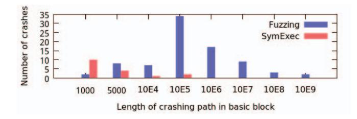

# (State of) The Art of War: Offensive Techniques in Binary Analysis

Yan Shoshitaishvili、Ruoyu Wang、Christopher Salls、Nick Stephens、Mario Polino、Andrew Dutcher、John Grosen、Siji Feng、Christophe Hauser、Christopher Kruegel、Giovanni Vigna UC Santa Barbara

{yans,fish,salls,stephens,mario,dutcher,jmg,slipper,christophe,chris,vigna}@cs.ucsb.edu

*Abstract*—バイナリコードの脆弱性を発見し、悪用することは困難な作業である。データ構造や制御構造に関する高水準で意味的に豊かな情報が欠如しているため、プログラムの特性分析を大規模に行うことが難しくなる。しかしながら、バイナリ解析の重要性は増してきている。多くの場合、実際に*実行*されるコードの特性を証明（または否定）する唯一の方法が、バイナリ解析である。

本論文では、過去に提案された複数の解析手法を実装するバイナリ解析フレームワークを提示する。この技術を体系的に実装することで、他の研究者がこれらを組み合わせて新たな手法を開発できるようにしている。さらに、これらの手法を統一的なフレームワークで実装することで、各アプローチを直接比較し、その利点と欠点を特定できるようになる。本論文に含まれる評価は、バイナリ脆弱性解析技術の有効性を評価するためにDARPAが作成した最近のデータセットを用いて実施している。

本フレームワークはオープンソース化されており、セキュリティコミュニティで利用可能である。

#### I. INTRODUCTION

インタプリタ言語やWorld Wide Webの普及にもかかわらず、バイナリアナリシスはコンピュータセキュリティの分野において極めて重要な話題であり続けている。その理由はいくつかある。第一に、インタプリタ言語はバイナリプログラムによってインタプリタされるか、もしくはJust-In-Time（JIT）コンパイルによってバイナリコードに変換されている。第二に、「コア」なOSの構造体やパフォーマンスが重視されるアプリケーションは、依然として（通常はCやC++といった）バイナリコードへコンパイルされる言語で記述されている。第三に、Internet of Thingsの台頭は、一般に極めてリソースに制約のあるデバイスによって支えられている。インタプリタやJust-In-Timeコンパイルに割けるサイクルを持たないため、これらのデバイスのファームウェアは（再び、通常Cで）バイナリへコンパイルされる言語で記述される傾向がある。

残念ながら、多くの低水準言語はセキュリティ保証がほとんどなく、これがしばしば脆弱性の原因となる。例えば、バッファオーバーフローは、そのような脆弱性を軽減する技術の開発が着実に進められているにもかかわらず、依然として最も一般的なソフトウェアの欠陥の一つであり続けている。さらに悪いことに、「メモリ破損脆弱性」と呼ばれるより広いカテゴリのほとんどは、同様に安全でない言語の使用に起因しており、最も一般的な脆弱性のかなりの割合を占めている[2]。この問題は、汎用計算機器上のソフトウェアに限定されるものではない。スマートロックからペースメーカー、自動車に至るまで、遠隔から悪用可能な脆弱性が発見されている[10]。

もう一つ重要な点は、コンパイラやツールチェーンがバグのない存在ではないということである。プログラムのソースコードを解析することで証明された特性が、まったく同じプログラムであってもコンパイル後には成り立たない場合がある[56]。これは実際に起こっていることであり、最近ではXcode Ghost[3]として知られる悪意のあるバージョンのXcodeが、コンパイル時に不正なコードを挿入することで、40以上の人気iOSアプリケーションにひそかに感染し、数百万台のユーザー端末を危険にさらした。このような脆弱性は深刻かつ現実的な影響を及ぼすため、悪用される前に発見することが最重要である。そのために、セキュリティ研究コミュニティはバイナリプログラムの欠陥を特定する解析技術の開発に多大な努力を注いできた[55]。このような「攻撃的」（解析対象アプリケーションに対する「攻撃」を見つけるため）解析技術は、用いられるアプローチや対象とする脆弱性の観点から広範囲で多様であるが、主に二つの問題点を抱えている。

まず、多くのバイナリアナリシス手法の実装は、研究用プロトタイプとして始まり、そこでその役割を終える場合が多い。このような状況になると、貢献のために費やされた多大な労力が無駄になり、今後の研究者はこれらの手法に基づく研究を実施する際に、実装面で一からやり直さなければならないことが多い。この立ち上げコストは進歩を妨げる要因となる。過去の手法を再実装するのに費やす一週間ごとに、新たな解決策を開発するために費やせる時間がその分減るのである。

第二に、これらのシステムを再現するために必要となる作業量と、その多くが一般公開されていないという事情により、それらの結果を再現することは非現実的となる。その結果、個別のバイナリ解析手法が他の手法と比べてどの程度*適用可能*であるのかが不明瞭となる。このことに加えて、現代のオペレーティングシステムが持つ本質的な複雑さや、アプリケーションとその環境との相互作用を正確かつ一貫してモデル化する困難さにより、比較のための共通基盤を確立することは非常に困難である。比較が存在する場合でも、比較対象となるシステムは実装の詳細や評価に使われるデータセットがそれぞれ異なっている傾向がある。

最初の問題を緩和する試みにおいて、我々はangrというバイナリアナリシスフレームワークを作成した。本フレームワークは、文献における最先端のバイナリアナリシス技術の多くを統合している。我々の目標は、分野を体系化し、現在の研究の有効な手法をアクセス可能でオープンかつ実用的な形で実装することにより、次世代のバイナリアナリシス技術の開発を促進することであった。これにより、各技術同士を容易に比較できるようになる。angrは提供している。

© 2016, Yan Shoshitaishvili. IEEEによるライセンスの下で提供されている。DOI 10.1109/SP.2016.17


多くの種類の分析のための構成要素であり、静的手法と動的手法の両方を用いて、提案された研究手法を容易に実装し、その有効性を相互に比較できるようにする。また、これらの構成要素は、分析の*合成*を可能にし、それぞれの強みを活用できるようにする。

過去1年間において、第2の課題に対する解決策も導入された。それは、分析手法やツールを比較し、研究の再現性を考慮したものである。具体的には、DARPAがCyber Grand Challengeを主催し、これは自動バイナリ解析、脆弱性発掘、エクスプロイト生成、ソフトウェアパッチ適用の現状を探るために設計された競技である。この競技の一環として、DARPAは自動解析システムに現実的な課題を提示するよう特別に設計されたアプリケーションのコーパスを作成・公開し、これらの課題に対する*グラウンドトゥルース*（ラベル付きの脆弱性およびエクスプロイト）も作成した。このバイナリのデータセットは、近年文献で提案された各種解析手法の相対的な有効性を評価するための完全なテストスイートを提供する。さらに、DARPA CGC予選イベントでは、世界中のチームがこれらのバイナリを攻撃・防御するための自動バイナリ解析システムを投入した。これらの結果は公開されており、既存文献の攻撃手法を、競技参加者が提供した最良の手法と比較する機会を提供している1。

我々の目標は、バイナリ解析システムにおいて現代的な攻撃手法を実装することによって、それらの相対的な有効性を理解することである。本論文では、次世代バイナリ解析エンジンであるangrの実装について詳細に述べる。これらの技術を用いて開発した複数の攻撃的解析（特に、現在文献で記述されているアプローチの再現）を提示し、脆弱性発見、エクスプロイトのリプレイ、自動エクスプロイト生成、ROPシェルコードのコンパイル、エクスプロイトのハードニングといった分野における結果の再現を行う。また、能力の強化を目的として、これらの手法を組み合わせることにより克服した課題や、達成した改善についても記載する。共通の解析エンジン上にこれらを実装することで、基盤となる解析エンジンの実装上の差異ではなく、手法の理論的な差異から生じる有効性の違いを調査することが可能となる。このことにより、DARPAによって提供されたデータセット上で、これらアプローチの比較評価を行うことができたのである。

要するに、我々は以下の貢献を行う。

- 1) 我々は、多くの既存の攻撃的バイナリ解析手法を一つの首尾一貫したフレームワーク内で再現し、現在の攻撃的バイナリ解析技術の相対的な有効性について理解を提供する。
- 2) 多様なバイナリ解析手法を組み合わせ、大規模に適用する際の困難さ（およびそれらの困難さへの解決策）を示す。
- 3) 我々は、自身のフレームワークであるangrをオープンソース化し、バイナリコード解析の将来世代の研究に役立ててもらう。

1上位7チームはそれぞれ75万米ドルの賞金を獲得した。このような動機付けにより、各チームは利用可能な中で最良の分析を行ったと考えられる。

#### II. AUTOMATED BINARY ANALYSIS

研究者たちは長年にわたり自動バイナリアナリシス技術の実現に取り組んできた。しかし、この分野における近年の進展にもかかわらず、そのようなシステムの開発および実世界での導入は依然として困難である。これは、対象となる技術によっては、実世界のソフトウェアに対して自動解析を行うために克服すべき重大な制限が存在するためである。本節では、自動解析における課題に触れ、なぜDARPA Cyber Grand Challengeコンテストが異なる解析手法を比較するための有意義な方法を提供し得るのかを論じる。

#### *A. Trade-offs*

バイナリ解析が困難である理由は容易に理解できる。ある意味で、「クラッシュするか？」と問うことは「停止するか？」と問うことに類似しており、この種の解析はすぐに停止問題[32]に抵触する。プログラム解析、特に攻撃的なバイナリ解析は、実現可能性を維持するために注意深くバランスを取った理論的なトレードオフに基づいて進められる傾向がある。このようなトレードオフを行わなければならない主な分野は二つある。

リプレイ性。バグには、それぞれ重要度に違いがある。システムが行うトレードオフによっては、特定の分析によって発見されたバグが*再現可能*でない場合もある。これは、分析がどの*範囲*で行われるかに関係している。ある種の分析はアプリケーション全体を最初から実行し、脆弱性を引き起こすために*正確に*何をすべきかを推論できる。他方、別のシステムはアプリケーションの個々の部分のみを分析する: この場合、特定のモジュールでバグを発見できても、そのモジュールの実行を*どのように引き起こすか*を推論できず、そのためクラッシュを自動的に*再現*することはできない。

セマンティックな洞察。いくつかの解析手法には、プログラムを意味的に有意義な方法で推論する能力が欠けている場合がある。たとえば、動的解析はアプリケーションによって実行されたコードを追跡することはできるが、*なぜ*それが実行されたのかや、*どの部分*の入力がアプリケーションにその特定の動作を引き起こさせたのかを理解することはできない。一方で、特定のプログラム動作に関与する入力バイトを特定できるようなシンボリック解析は、より高い意味的理解を持っているといえる。

入力のリプレイ可能性やセマンティックな洞察を提供するためには、解析手法は特定のトレードオフを行う必要がある。例えば、高いリプレイ可能性は低いカバレッジと関連している。これは直感的である。なぜなら、リプレイ可能な入力を生成する解析手法は、解析したい任意のコードに到達する方法を理解しなければならず、リプレイを前提としない解析よりも多くのコードを解析することができなくなるからである。一方で、バグを検証するためのトリガー入力をリプレイできなければ、バグのリプレイ可能性を優先しない解析は*偽陽性*（すなわち、実際の脆弱性を表さない欠陥検出）が高くなる傾向がある。リプレイ可能な入力がない場合、これらの偽陽性はヒューリスティクスによってフィルタリングされる必要があり、その結果、偽陰性が発生する可能性もある。

同様に、解析対象のプログラムについて意味的洞察を得るためには、解析は大量のデータを保存し処理しなければならない。意味的洞察を伴う動的解析は、例えば特定の分岐が実行されるために成立しなければならない条件を保存するかもしれない。一方で、静的解析は選択されたデータ領域によって意味的洞察を調整する。より単純なデータ領域（すなわち、実際の値ではなく*範囲*を追跡する）では、意味的洞察の度合いが低く表現される。

再現性と高いセマンティックな理解の両方を試みる解析は、スケーラビリティの問題に直面する。アプリケーション全体のセマンティック情報を、エントリーポイントから考えられるすべてのアクションにわたって保持するには、プログラムをあらゆる可能な条件下で実行するのと本質的に同じだけの処理能力が求められる。このような解析はスケールしないため、適用可能にするためには情報を破棄し、*完全性*（すなわち、すべての潜在的な脆弱性が発見されるという保証）を犠牲にしなければならない。

これらの基本的な課題に加えて、実装上の課題も存在する。これらの中で最も大きなものは*環境モデル*である。高度なセマンティック理解を伴ういかなる解析においても、アプリケーションとその環境との相互作用をモデル化しなければならない。現代のオペレーティングシステムにおいて、そのような相互作用は非常に複雑である。たとえば、最新のLinuxでは三百以上のシステムコールが含まれており、解析システムが完全であるためには、それらすべての効果をモデル化しなければならない。

例。バイナリ解析のさまざまな課題を示すために、リスト1に複数の脆弱性を持つプログラムの具体的な例を示す。本例は、明確さと紙面の都合のために簡略化されており、後述する内容に読者を導入することのみを目的としている。

memcpyへの3回の呼び出しを観察すると、10行目と30行目の呼び出しはバッファオーバーフローを引き起こすが、16行目の呼び出しは引き起こさない。しかし、追跡される情報量によっては、静的解析手法がmemcpyへのこれら3回全ての呼び出しを潜在的なバグとして報告する可能性がある。その理由は、16行目についてもバッファオーバーフローが発生しないことを判断するだけの情報を持ち得ないためである。さらに、静的解析によるレポートにはこれらのバグの位置が含まれるが、それらを引き起こす入力は提供されない。

動的手法、例えばファジングは、発見されたバグを引き起こす実行可能な入力を生成できるという利点がある。 一方で、単純なファジング手法は通常、浅いバグしか発見できず、特別に作成された入力を要求するコードを通過することができない。Listing 1においては、動的手法は10行目のバグを発見するのが難しい。なぜなら、この条件を満たすためには特定の入力が必要であるためである。しかし、30行目のオーバーフローはランダムなテストによって引き起こすことが可能なので、ファジング手法によってそのバグを引き起こす入力が見つかるはずである。

10行目のバグを見つけるためには、多くの可能な入力を同時に考察するための抽象的なデータモデルを導入することができる。そのアプローチの一つがDynamic Symbolic Execution (DSE)である。しかし、動的シンボリック技法は強力である一方で、「パス爆発問題」に悩まされる。すなわち、分岐ごとにパスの数が指数関数的に増加し、すぐに扱いきれなくなるのである。シンボリック実行では10行目のバグを検出し、制約ソルバーを用いてそれに対する入力を生成できる。また、16行目のmemcpyがオーバーフローし得ないことも証明できるはずである。しかしながら、実行はおそらく30行目のバグを見つけることはできないだろう。なぜなら、バグを引き起こさない膨大な数の潜在的なパスが存在するためである。

```
1 int main(void) {
2 char buf[32];
4 char *data = read_string();
5 unsigned int magic = read_number();
7 // difficult check for fuzzing
8 if (magic == 0x31337987) {
9 // buffer overflow
10 memcpy(buf, data, 100);
11 }
13 if (magic < 100 && magic % 15 == 2 &&
14 magic % 11 == 6) {
15 // Only solution is 17; safe
16 memcpy(buf, data, magic);
17 }
19 // Symbolic execution will suffer from
20 // path explosion
21 int count = 0;
22 for (int i = 0; i < 100; i++) {
23 if (data[i] == 'Z') {
24 count++;
25 }
26 }
28 if (count >= 8 && count <= 16) {
29 // buffer overflow
30 memcpy(buf, data, count*20);
31 }
33 return 0;
34 }
```
リスト1：異なる手法が異なるバグを報告する例である。

#### *B. The DARPA Cyber Grand Challenge*

2013年10月、DARPAはDARPA Cyber Grand Challenge [23]を発表した。他分野（ロボティクスや自律走行車両など）におけるDARPA Grand Challengeと同様に、CGCは世界中のチーム同士が競い合う競技であり、すべての参加者は自律プログラムでなければならない。Cyber Grand Challengeにおける参加者の目標は単純である。自分たちのシステムが提供されたソフトウェアの脆弱性を自律的に特定し、悪用し、修正する必要がある。賞金として数百万ドルが発表された。CGC Qualifying Event（2015年6月開催）を完了した上位7チームには各750,000ドルが与えられ、CGC Final Event（2016年8月開催）では上位3チームにそれぞれ2,000,000ドル、1,000,000ドル、750,000ドルが授与される予定である。

Cyber Grand Challengeの主催者は、自動バイナリ解析システム向けの競技設計に多くの考慮を払った。たとえば、*環境モデル*の問題への対処として、CGC専用の新しいOSを作成した：DECREE OSである。DECREEは極めて単純なオペレーティングシステムであり、システムコールはわずか7つのみである。transmit、receive、waitfdはファイルディスクリプタ経由でデータを送信、受信、および待機するためのものであり、randomはランダムデータを生成するものである。

3

６

１２

１８

27

３２

メモリ管理のためにallocateおよびdeallocateを使用し、終了するためにterminateを使用する。

単純な環境モデルであるにもかかわらず、CGC向けにDARPAが提供したバイナリには幅広い複雑性がある。サイズは4キロバイトから10メガバイトに及び、機能も単純なエコーサーバからウェブサーバ、画像処理ライブラリまで多岐にわたる。DARPAはこれまでの競技で使用されたすべてのバイナリを、概念実証のエクスプロイトや脆弱性に関する解説つきでオープンソース化している[24]。

単純な環境モデルにより、大規模にバイナリ解析手法を正確に実装し評価することが可能となるため、本論文の比較評価においてはDARPA CGCのサンプルをデータセットとして使用する。

#### *C. Comparative Analysis of CGC Binaries*

攻撃的なバイナリ解析は、対象となるアプリケーションについて推論するために異なる基盤技術を用いる。例えば、異なる「ドメイン」でデータを分析したり、テスト対象のアプリケーションと異なるレベルでインタラクションを行ったりする場合がある。次の2つの節では、現時点における最先端の状況を調査し、残りの論文で詳細評価を行うためにいくつかの解析手法を選定する。本稿では、バイナリソフトウェアの欠陥を特定し悪用することを目的とした解析手法（たとえば、シンボリック実行を用いたメモリ安全違反の検出）に特に焦点を当てており、それらの基礎となるより一般的なバイナリ解析手法（この場合はシンボリック実行自体）については対象外とする。

# III. BACKGROUND: STATIC VULNERABILITY DISCOVERY

静的手法は、プログラムを実行することなくその内容について推論するものである。通常、プログラムは*抽象領域*上で解釈される。ビットの1と0からなるメモリ領域は、他の抽象的なエンティティを含む（身近な例では単に整数の場合もあるが、後述するように、これにはより抽象的な構成物も含まれうる）。加えて、メモリのレイアウトや、実際に辿られる実行経路といったプログラムの構成要素もまた、抽象化される場合がある。

ここでは、静的解析を二つのパラダイムに分ける。すなわち、プログラムの特性をグラフ（例えば、*control-flow graph*）としてモデル化するものと、データ自体をモデル化するものである。

静的脆弱性識別技術には、セクションII-Aで議論したトレードオフに関連する2つの主な欠点がある。第一に、その結果は*再現可能*ではないという点である。静的解析による検出は手作業による検証が必要であり、検出された脆弱性を*どのように*引き起こせるかに関する情報は得られない。第二に、これらの解析はより単純なデータ領域で動作する傾向があり、その結果*意味的洞察*が低下する。要するに、過剰近似が生じるのである。すなわち、特定のプログラム特性（脆弱性など）の*不在*についてはしばしば信頼性のある推論が可能である一方、脆弱性の*存在*に関する主張では高い誤検出率に悩まされるのである。

#### *A. Recovering Control Flow*

*Control-flow graph*（CFG）の復元は、そのノードが命令の基本ブロックであり、エッジがそれらの間の制御フロー遷移の可能性を示すものであるが、脆弱性発見のためのほとんどすべての静的手法にとって前提条件である。

制御フロー回復は文献[21]、[33]、[34]、[50]、[58]、[59]で広く議論されている。CFG回復は、ある基本ブロック（例えばBa）を逆アセンブルおよび解析し、その可能な*出口*（すなわち、B<sup>b</sup>やBcのような後続の基本ブロック）を特定し、それらがまだ追加されていなければCFGに追加し、B<sup>a</sup>をB<sup>b</sup>やBcに接続し、B<sup>b</sup>およびB<sup>c</sup>について再帰的に解析を繰り返し、新しい出口が特定されなくなるまで行うという再帰的なアルゴリズムとして実装されている。CFG回復には本質的な課題が存在する。それは間接ジャンプである。間接ジャンプは、バイナリがレジスタやメモリ位置に格納された値をターゲットとして制御フローを移す際に発生する。*直接*ジャンプとは異なり、直接ジャンプではターゲットが命令自体にエンコードされており容易に解決可能だが、間接ジャンプのターゲットは様々な要因によって変化する可能性がある。具体的には、間接ジャンプはいくつかの種類に分類される。

- 計算によるジャンプ。計算によるジャンプのターゲットは、コードで指定された計算をアプリケーションが実行することによって決定される。この計算はさらに、他のレジスタやメモリ内の値に依存する場合がある。これの一般的な例はジャンプテーブルである。アプリケーションはレジスタまたはメモリ内の値を使ってメモリに格納されたジャンプテーブルへのインデックスを決定し、そのインデックスからターゲットアドレスを読み取り、そこへジャンプする。
- コンテキスト依存である。間接ジャンプはアプリケーションのコンテキストに依存する場合がある。一般的な例は、標準Cライブラリのqsort()である―この関数は比較のために*コールバック*を受け取る。その結果、qsort()内部の基本ブロックのジャンプ先の一部は、呼び出し元に依存する。なぜなら呼び出し元がコールバック関数を提供するからである。
- オブジェクト感受性。コンテキスト感受性の特別なケースとして、オブジェクト感受性がある。オブジェクト指向言語においては、オブジェクトポリモーフィズムのために仮想関数の使用が必要であり、これは多くの場合、関数ポインタの*仮想テーブル*として実装され、実行時にジャンプ先を決定する際に参照される。そのため、ジャンプ先は呼び出し元が関数に渡すオブジェクトの型に依存する。

さまざまな間接ジャンプの種類に対処するために、異なる手法が設計されており、それらのいくつかの実装についてはセクションVIIで議論する予定である。最終的に、CFGリカバリの目的は、これらの間接ジャンプのターゲットをできるだけ多く*解決する*ことでCFGを構築することである。特定の間接ジャンプは、*集合*（*すなわち*、ジャンプテーブル内のすべてのアドレス。もしそれらの使用条件が成立しうる場合）の値に解決されることがあり、この集合はオブジェクト感度やコンテキスト感度に応じて変化することがある。ジャンプターゲットの解決精度によって、CFGリカバリ解析には次の2つの特性がある。

健全性。CFGリカバリ手法が*健全*であるとは、すべての潜在的な制御フロー遷移の集合が生成されたグラフに表現されている場合を指す。すなわち、間接ジャンプが実際に到達可能なアドレスの*部分集合*のみに解決された場合、グラフの健全性は低下する。基本ブロックの潜在的なターゲットを見逃した場合、CFGリカバリアルゴリズムによってそのブロックが決して発見されず、そのブロックが行う直接および間接ジャンプもすべて見逃されることになる。これは累積的な効果をもたらす：間接ジャンプの解決失敗は、グラフの完全性を著しく損なう可能性がある。健全性は、バイナリ中の間接ジャンプターゲット識別における*真陽性*率として考えることができる。

完全性。完全なCFGリカバリは、すべてのエッジが実際に可能な制御フローの遷移を表すCFGを構築するものである。CFG解析が*完全性*を重視して誤りを犯す場合、実際には存在し得ないエッジが含まれる可能性が高い。完全性は、間接ジャンプターゲット識別の*偽陽性*率の逆と考えることができる。

空のグラフを生成するCFGリカバリー解析は*完全*であると見なされ、すべての命令が他のすべての命令を指すグラフを生成する解析は*健全*であると見なされる。<sup>2</sup> 理想的な状態はその中間にあるが、スケーラブルなアルゴリズムでこれを実現するのは困難である。したがって、異なる解析ごとに両者の間で異なる妥協が必要となる。

制御フローグラフのさらなる難しさは、*コードカバレッジ*、すなわち制御フローグラフによってどれだけのコードが明らかにされるかを正確に測定することである。これはしばしば*デッドコード*、すなわちどのジャンプからも到達不可能なコードの存在によって複雑になる。

#### *B. Vulnerability Detection with Flow Modeling*

プログラムの特性のグラフを分析することで、いくつかの脆弱性を発見できる場合がある。

グラフベースの脆弱性発見。プログラムプロパティグラフ（例えば、制御フローグラフ、データフローグラフ、制御依存グラフなど）は、ソフトウェアの脆弱性を特定するために使用できる。これらの手法は当初ソースコードに適用されたが [60], [61]、その後バイナリにも拡張されている [45]。これらの手法は、制御フローまたはデータ依存グラフ内のノード集合として表現されるバグのモデルを構築し、そのモデルの事例をアプリケーション内で特定することに依存している。しかし、このような手法は脆弱なコードのコピーを探索することを目的としており、既存の脆弱性に関する予備知識を利用できる点で利点がある。これらの手法とは異なり、本論文の焦点は、まったく新しい脆弱性の発見にある。

# *C. Vulnerability Detection with Data Modeling*

静的解析は、アプリケーションが操作するデータの抽象化についても推論できる。

値集合解析。一般的な静的解析手法の一つに*値集合解析*（VSA）[6]がある。大まかに言えば、VSAは任意の時点におけるプログラム状態（*すなわち*、メモリおよびレジスタ内の値）の厳密な過剰近似を特定しようとするものである。

2Xu et. al.は、CFGの健全性と完全性を逆の方法で定義しており、空のグラフが健全であり、完全なグラフが完全であるとする[59]。本論文では、III-A節の定義に従う。

プログラムである。これは、間接ジャンプの可能なターゲットや、メモリ書き込み操作の可能なターゲットを理解するために利用できる。これらの近似は精度の欠如という問題があるが、*健全*である。すなわち、過大評価することはあっても、過小評価することは決してない。

メモリのリードおよびライトの近似的なアクセスパターンを分析することによって、バイナリ内の変数およびバッファの位置を特定することができる。これが完了すると、復元された変数およびバッファの位置を分析して*重複*しているバッファを発見することができる。このような重複バッファは、例えばバッファオーバーフロー脆弱性によって引き起こされる可能性があるため、各検出は潜在的な脆弱性の一つである。

# IV.

#### BACKGROUND: DYNAMIC VULNERABILITY DISCOVERY

動的手法とは、特定の入力が与えられた際に、実際またはエミュレートされた環境でプログラムの実行を調査する分析である。本節では、基盤となる一般的なバイナリアナリシス技術ではなく、脆弱性を特定するために用いられる動的手法に特に焦点をあてて論じる。

動的手法は大きく二つのカテゴリに分けられる：具体的実行と象徴的実行である。これらの手法は非常に「リプレイ可能」な入力を生成するが、「意味的洞察」の観点では異なっている。

#### *A. Dynamic Concrete Execution*

動的具体実行とは、最小限に計測された環境でプログラムを実行するという概念である。プログラムは通常通りに機能し、通常操作するデータの*ドメイン*（すなわち、0と1）で動作する。これらの解析は通常、単一の経路のレベル（すなわち、「特定の入力が与えられたとき、プログラムはどの経路を辿ったか」）で推論を行う。そのため、動的具体実行にはユーザーが*テストケース*を提供する必要がある。これは問題であり、大規模または未知のデータセット（本研究のような場合）ではそのようなテストケースは簡単には得られないのである。

*1) Fuzzing:* 脆弱性発見において動的コンクリート実行が最も関連する応用は、Fuzzingである。Fuzzingとは、異常な入力をアプリケーションに与え、クラッシュを引き起こそうとする動的手法である。初期の段階では、こうした入力はハードコードされたルールによって生成され、実行の詳細な監視はほとんど行われなかった [38]。特定の入力によってアプリケーションがクラッシュした場合、その入力はバグを引き起こしたと見なされる。それ以外の場合は、その入力がさらにランダムに変更された。不幸なことに、Fuzzerは*テストケース*の要件に悩まされる。注意深く作成されたテストケースがなければ、Fuzzerはプログラムのごく表面的な機能しかテストできないのである。

カバレッジベースのファジング。慎重に作成されたテストケースの必要性は、コードカバレッジベースのファジング[39]の登場によって部分的に緩和された。コードカバレッジベースのファザーは、ターゲットアプリケーションで実行されるコード量を最大化する入力を生成しようと試みる。なぜなら、より多くのコードが実行されれば、脆弱なコードが実行される可能性も高くなる、という洞察に基づいているからである。American Fuzzy Lop (AFL)[1]は、多くの最近の脆弱性発見に寄与している最先端のファザーであり、唯一の指針としてコードカバレッジの指標を用いる。その脆弱性発見の成功により、近年ファジングへの関心が高まっている。

カバレッジベースのファジングは、ターゲットアプリケーションに対するセマンティックな洞察に欠けている。これは、特定のコードがまだ実行されていないことを検出する能力はあるが、そのコードの実行を引き起こすために入力のどの部分を変異させるべきかを理解できないことを意味する。

テイントベースのファジング。ファジングを改良するもう一つの手法が、*テイントベース*ファザーの開発である[9]、[62]。これらのファザーは、アプリケーションが入力をどのように処理するかを分析し、今後の実行で入力のどの部分を修正すべきかを理解することができる。一部のファザーは、テイントトラッキングとデータ依存性の回復[30]、[42]などの静的手法を組み合わせている。また、プロトコル解析の成果を取り入れ、ファジングカバレッジの向上を図るものもある[22]。

テイントベースのファザーは、入力のどの部分を変異させればプログラム内の特定の経路へ実行を導けるかを理解できるが、それでもなお、この入力を*どのように*変異させるべきかについては把握していない。

*2) Dynamic Symbolic Execution:* シンボリック手法は、静的解析と動的解析のギャップを埋め、ファジングの限定的なセマンティック洞察への対処策を提供するものである。Dynamic symbolic executionは、シンボリック実行の一種であり、動的手法という点で、プログラムをエミュレート環境で実行するものである。しかし、この実行は*シンボリック変数*の*抽象*領域で行われる。これらのシステムはアプリケーションをエミュレートしながら、プログラム実行全体にわたってレジスタとメモリの状態およびそれらの変数への*制約*を追跡する。条件分岐に到達すると、実行はフォークされ、*両方*のパスがたどられる。そして、分岐が選択されたパスには分岐条件を、選択されなかったパスには分岐条件の否定を、それぞれそのパス上の制約として保存する[49]。

ファジングとは異なり、動的シンボリック実行は対象アプリケーションに対して極めて高い意味的洞察を持つ。これらの技術は、どのようにして特定の望ましいプログラム状態を引き起こすかについて推論でき、実行中の経路の一つが解析の関心を引く条件を満たした場合、蓄積された経路制約を利用して適切な入力をアプリケーションに遡及的に生成できる。このことは、ソフトウェアのバグ特定に非常に強力なツールとなり、その結果として動的シンボリック実行は非常に活発な研究分野である。

古典的な動的記号実行。動的記号実行は、ソフトウェアの脆弱性を直接発見するために使用できる。初めはソースコードのテストに適用されたが[12]、[13]、Mayhem[16]やS2E[19]によってバイナリコードにも拡張された。これらのエンジンは、脆弱な状態（例えば、命令ポインタが攻撃者の入力によって上書きされる場合）が特定されるまで、経路探索を実行することでアプリケーションを解析する。

しかし、セクションII-Aで議論したトレードオフがここで問題となる。現在提案されている全てのシンボリック実行手法は、*パス爆発*の問題によりスケーラビリティが非常に限定的である。なぜなら、分岐のたびに新たなパスが生成されうるため、プログラム内のパスの数は、各パス中の分岐命令の数に応じて指数関数的に増加するからである。*有望なパスの優先順位付け* [11], [37] や、状況に応じたパスの*マージ* [5], [35], [47] によってパス爆発を回避しようとする試みもあった。しかし一般的には、この課題は純粋な動的シンボリック実行解析エンジンにおいて未だ克服されていない。そして（本論文で後述するように）、このようなシステムによって発見されるバグの多くは*浅い*ものである。

Symbolic-assisted fuzzing。パス爆発問題に対処するために提案されている方法の一つは、多くの処理をより高速な手法、すなわちfuzzingへオフロードすることである。このアプローチはfuzzingの強み、すなわちその高速性を活用し、また主な弱点であるアプリケーションへの意味的洞察力の欠如を緩和しようとする。したがって、研究者たちはfuzzingとsymbolic executionを組み合わせている[14], [15], [17], [28], [29], [54]。このようなsymbolically-guided fuzzerは、fuzzingコンポーネントによって特定された入力をdynamic symbolic executionエンジンで処理し、修正する。dynamic symbolic executionは解析対象プログラムについてより深い理解を用いて入力を適切に変異させることで、従来探索されていなかったコードを刺激する追加のテストケースを提供し、fuzzingコンポーネントが引き続き進捗を達成できるようにする（すなわち、コードカバレッジの観点で）。

制約の緩いシンボリック実行。動的シンボリック実行の取り扱いやすさを向上させる別の方法は、アプリケーションの*一部*のみを実行することである。この手法は、Under-constrained Symbolic Execution [26], [46] として知られ、*潜在的な*バグの特定に有効であるが、2つの欠点がある。第一に、アプリケーションの一部の実行における適切なコンテキストを確保することができないため、結果として多くの偽陽性が発生する。第二に、静的脆弱性発見手法と同様に、制約の緩いシンボリック実行は発見したバグの再現性を犠牲にし、スケーラビリティを優先するという特徴を持つ。

#### V. BACKGROUND: EXPLOITATION

脆弱性発見の分析は、実際には*クラッシュを引き起こす入力*を発見するものである。これらのクラッシュ入力をトリアージする、すなわち、どのクラッシュが実際のセキュリティ問題を示しているかを理解することは、こうした手法のほとんどの範囲外である。しかし、発見された脆弱性の再現および分析に関する研究も存在する。本節では、特定されたクラッシュを再現するプロセス、自動的にエクスプロイトを生成してクラッシュのセキュリティ影響を検証する手法、そして現代の緩和技術の存在下でエクスプロイトを耐性強化する手法について説明する。

# *A. Crash Reproduction*

ほとんどの脆弱性発見解析は、テスト対象のアプリケーションを現実的とは言えない条件下で実行する。例えば、多くのファザーは実行時のランダム性を「非ランダム化」する。すなわち、実行ファイルのPIDや現在時刻など、ランダム性の原因となるものをハードコーディングするのである。これは主に二つの理由から行われる。第一に、ほとんどの近代的なファズィング手法では、ある入力を同じアプリケーションの二つのインスタンスに与えた場合、両方とも同じ結果を出すという暗黙の前提がある。第二に、動的シンボリック実行など他の技術におけるランダム性のモデル化は、十分に研究されている分野とは言えないためである。

非ランダム化のため、脆弱性発見技術によって報告されたクラッシュは、分析環境の外部では容易に再現できるとは限らない。例えば、ランダムなトークンを生成し、そのトークンをユーザーが入力しない限り危険なコード領域に進めず、かつクラッシュするようなアプリケーションを考える。非ランダム化された分析環境下では、生成されるトークンは常に同じ値となり、分析によって特定されたクラッシュを引き起こす入力は常に同じ経路を通ってクラッシュに至る。しかし、分析環境の“外部”ではトークンの値は毎回異なり、以前はクラッシュしていた入力も“クラッシュしない”経路を通る可能性がある。

些細な再現ができないクラッシュ入力は、一般的に二つのカテゴリに分類される。

- 欠損データ。脆弱性発見手法は、アプリケーションから最初に正しい応答値を受け取ることなく、それを「推測」できてしまう場合がある。例に挙げたトークンは、非ランダム化環境下では常に一定値となるため、ファジングのような解析エンジンによって、プログラムから先に取得することなく偶然にその値が推測されてしまうことがある。解析環境の外で、得られたクラッシュ入力をリプレイすると、トークン値が一致せずクラッシュが発生しない。
- 関係の欠如。ファジングのようなセマンティックな洞察が低い手法では、プログラムから取得されたデータと、その後にプログラムへ提供されるデータとの*関係*を復元することができない。例えば、クラッシュを引き起こす入力によってアプリケーションがトークンをユーザーに提供し、後にそれがクラッシュを引き起こすために使用される場合でも、ファザーの出力には、アプリケーションがユーザーに提供するトークンの値と、ユーザーがアプリケーションに提供しなければならないトークンの値との関係が欠如している。

データが欠落している場合、入力は分析環境の外部では単純に再現できず、新たなクラッシュを引き起こす入力が発見される可能性がある。データリークの特定を専門とする解析手法が存在する[42]が、angrにはまだそのような解析を実装していない。

後者の場合、非ランダム化されたクラッシュ入力は、アプリケーションと通信する方法を、そのアプリケーションから受け取ったデータと後で提供されるデータとの関係の観点から定義する*入力仕様*に変換しなければならない。この手法の一つがReplayer [43]であり、現実世界の条件下でどのようにプログラムパスを再現できるかを理解するために、プログラムパスの前提条件を算出するものである。

# *B. Exploit Generation*

上記で述べた一つ以上の手法を利用する生産的な脆弱性掘削エンジンによって、テスト対象のアプリケーションに対して多くのクラッシュが発生する可能性がある。しかし、これらのクラッシュがすべて悪用可能というわけではない。悪用不可能な入力の例としては、NULLポインタ参照が挙げられる。現代のオペレーティングシステムではアドレス0でのメモリマッピングが禁止されているため、かつては悪用可能だった状況が悪用不可能なクラッシュに変化している。クラッシュが悪用可能かどうかを理解することは、バグのトリアージ（すなわち、どのバグを優先して調査・修正するかの決定）に役立つ。

クラッシュが悪用可能かどうかをテストする明白な方法は、それを実際に悪用しようとすることである。この目的のために、クラッシュを引き起こす入力を自動的にアプリケーションのエクスプロイトへ変換しようとするいくつかのシステムが提案されている[4]、[31]、[51]。

# *C. Exploit Hardening*

近年、バイナリハーデニング技術、例えば実行不可スタック領域やアドレス空間配置のランダム化（ASLR）などが、従来の攻撃手法、すなわち第一世代の自動エクスプロイトエンジンによって生成されたものなどの有効性を著しく低減させている。そのため、たとえ悪用可能な脆弱性が存在しても、現代的な防御策によって緩和される場合がある。

現在の自動エクスプロイト手法は、現代の緩和技術が広く採用される以前に設計されたものであり、現代のソフトウェア保護によってそれらが生成するエクスプロイトは機能しなくなっている。この問題を回避するために、現在の技術で生成されたエクスプロイトをそのような防御策に対して自動的にハードニングする手法が考案されている。これらの手法は、従来のシェルコードベースのエクスプロイトを、Return-Oriented Programming [52] を利用した等価なエクスプロイトに変換することで動作する。したがって、Return-Oriented Programsを自動的に構築する手法が必要となり、いくつかのそうした手法が開発されている [18], [48]。

# VI. ANALYSIS ENGINE

我々がIII、IV、V節で述べた分析は、過去数年間にわたって様々な時期に提案され、異なる技術で実装され、異なるデータセットおよび多様な方法論で評価されてきた。このことは問題である。なぜなら、異なるアプローチの相対的な有効性や、それらが異なる種類のアプリケーションに適用可能かどうかを理解するのが困難になるからである。

この問題を緩和するために、柔軟で高機能な次世代バイナリアナリシスシステムであるangrを開発し、前節で提示した分析のいくつかを実装した。本節では、この分析システム、その設計目標、そしてこの設計が現実的なバイナリの解析に与えた影響について述べる。

#### *A. Design Goals*

angrの設計目標は以下の通りである。

- クロスアーキテクチャ対応。組み込みデバイスの台頭とともに、しばしばARMやMIPSプロセッサー上で動作する現代のソフトウェアは、多様なハードウェアアーキテクチャ向けに作られている。これは、x86対応だけでほとんどの解析エンジンに十分だった過去10年間からの転換である。現代のバイナリ解析エンジンはクロスアーキテクチャ解析を実行できる必要がある。さらに、32ビットプロセッサーはもはや標準ではなくなった。現代の解析エンジンは64ビットバイナリの解析も対応しなければならない。
- クロスプラットフォーム対応。クロスアーキテクチャ対応と同様に、現代的な解析システムは異なるオペレーティングシステムのソフトウェアを解析できる必要がある。これは、個々のオペレーティングシステムに特有の概念を意味する。

システムは抽象化されなければならず、さらにさまざまな実行可能フォーマットの*読み込み*をサポートする必要がある。

- 異なる解析パラダイムへの対応。有用な解析エンジンは、前述のセクションで説明した幅広い解析に対応できなければならない。そのためには、エンジン自体が抽象化され、さまざまな種類のメモリモデルやデータ領域を提供する必要がある。
- ユーザビリティ。angrの目的は、セキュリティコミュニティにとって再現・改善・新規作成のいずれにも有用なバイナリ解析技術のツールを提供することである。そのため、angrの学習コストを低く保ち、使いやすさを高めることに努めた。angrはほぼ完全にPythonで実装されており、IPythonインタラクティブシェル[44]からも容易に利用できる簡潔かつシンプルなAPIを備えている。Pythonの採用は他の言語選択肢と比べて一定の実行速度低下を招くが、ほとんどのバイナリ解析技術はアルゴリズム自体の遅さによる影響の方が大きく、言語による性能低下が問題となることは稀である。言語のオーバーヘッドが重要となる場合には、angrはPython JITエンジンであるPyPy上で動作させることで、著しい速度向上が得られる。

我々の目標は、angrが我々のプラットフォーム上で典型的なバイナリ解析手法を約1週間で再現できるようにすることであった。実際には、Veritesting [5]を8日で再現し、ガイド付きシンボリック実行を1か月で、AEG [4]を週末で、Q [48]を約3週間で、underconstrained symbolic execution [46]を2日で再現することができた。動的シンボリック実行とvalue-set analysisについては、それらをシステム自体の構築と同時に約2年かけて実装したため、実装作業の見積もりを算出するのは難しい。

これらの設計目標を達成するために、私たちは解析エンジンを慎重に構築した。これを実現するため、各種解析用のモジュラー型ビルディングブロックを作成し、それぞれの間で厳格な分離を維持することに努め、angrの上位部分（たとえば状態表現）が下位部分（データモデルなど）について行う前提条件の数を減らした。この設計によって、解析間でオンザフライに組み合わせたり変換したりすることが容易になっている。また、他の研究者がangrの個別モジュールを再利用する際の容易さにもつながることを期待している。以降の複数のセクションにおいて、各angrサブモジュールの技術的設計について論じる。

## *B. Submodule: Intermediate Representation*

複数のアーキテクチャをサポートするために、アーキテクチャ固有のネイティブバイナリコードを中間表現（IR）へ変換し、その上で解析を実装している。独自の「IRリフター」を作成するのは非常に時間のかかる技術的作業であるため、それをせず、ValgrindプロジェクトのIRリフターであるlibVEXを活用した。libVEXは、プログラム解析のために特別に設計されたVEXと呼ばれるIRを生成する。我々は、当初Firmalice [53] のために作成したPyVEXを用い、VEX IRをPython上で扱えるようにした。VEXを活用することで、ARM、MIPS、PPC、x86（後者の64ビット版はamd64となる）の32ビットおよび64ビットバージョンのプロセッサに対する解析サポートを提供できる。Valgrindの貢献者によって継続的に改良が加えられており、例えばSPARCアーキテクチャへの移植作業も現在進行中である。

後述するように、angrが常にVEXを中間表現として使用しなければならないという本質的な制約は存在しない。実装上、異なる中間表現をサポートすることは、単純なエンジニアリング作業である。

#### *C. Submodule: Binary Loading*

アプリケーションバイナリを解析システムにロードする作業は、CLEというモジュールによって処理される。CLEは「CLE Loads Everything」の再帰的頭字語である。CLEは異なるバイナリフォーマットを抽象化し、指定されたバイナリおよびそれが依存するすべてのライブラリのロード、動的シンボルの解決、再配置の実行、プログラム状態の適切な初期化を行う。CLEを通じて、angrはほとんどのPOSIX準拠システム（Linux, FreeBSDなど）、Windows、およびDARPA Cyber Grand Challenge向けに作成されたDECREE OSのバイナリをサポートしている。

CLEは、バイナリオブジェクト（すなわち、アプリケーションバイナリ、POSIXの.so、あるいはWindowsの.dll）を表す複数の基底クラス、これらのオブジェクト内のセグメントやセクション、そしてそのセクション内の場所を表すシンボルを提供することによって、バイナリローダーの拡張可能なインターフェースを提供している。CLEはファイルフォーマット解析ライブラリ（特に、Linuxバイナリにはelftools、Windowsバイナリにはpefile）を用いてそれらのオブジェクト自体を解析し、その後、必要な再配置を行って「ロードされた」アプリケーションのメモリイメージを公開するのである。

### *D. Submodule: Program State Representation/Modification*

SimuVEXモジュールは*プログラム状態*（すなわち、レジスタやメモリ内の値、開いているファイル、*など*のスナップショット）を表現する役割を担っている。SimuVEX用語でSimStateと名付けられたこの状態は、*ステートプラグイン*の集合として実装されており、状態が作成される際にユーザーや解析によって指定される*ステートオプション*によって制御される。現在、以下のステートプラグインが存在する。

- レジスタ。SimuVEXはプログラムの任意の時点におけるレジスタの値を、対応するプログラム状態の状態プラグインとして追跡する。
- シンボリックメモリ。シンボリック実行を可能にするため、SimuVEXはシンボリックメモリモデルをステートプラグインとして提供している。これはMayhem [16] で提案されたインデックス付きメモリモデルを実装している。
- 抽象メモリ。抽象メモリ状態プラグインは、静的解析によってメモリをモデル化するために使用される。連続したインデックス付きメモリモデルを実装するシンボリックメモリとは異なり、抽象メモリは*領域*ベースのメモリモデルを提供し、これはほとんどの静的解析で使用されている。
- POSIX。POSIX準拠の環境でバイナリを解析する際、SimuVEXはこのステートプラグインにおいて*システム状態*を追跡する。例えば、シンボリック状態で開かれているファイルなどが含まれる。各ファイルはメモリ領域およびシンボリックな位置インデックスとして表現される。
- ログ。SimuVEXは、このプラグイン内で状態に対して行われたすべての操作（つまり、メモリ書き込みやファイル読み取りなど）をログとして追跡する。
- インスペクション。SimuVEXは強力なデバッグインターフェースを提供しており、汚染、正確な式の構成など、複雑な条件でブレークポイントを設定することができる。

記号的条件である。このインターフェースは、SimuVEXの動作を*変更*するためにも使用できる。たとえば、メモリ読み取りを計装してメモリマップドI/Oデバイスをエミュレートすることができる。

- ソルバー。ソルバーは、さまざまなデータドメインへのインターフェースを公開するプラグインであり、データモデルプロバイダー（以下で説明するClaripy）を通じて動作する。たとえば、このプラグインがシンボリックモードに設定されている場合、レジスタ、メモリ、ファイル内のデータをシンボリックに解釈し、アプリケーション解析時に経路制約を追跡する。
- アーキテクチャ。architectureプラグインは、解析に有用なアーキテクチャ固有の情報（例えば、スタックポインタの名称、アーキテクチャのワードサイズなど）を提供する。このプラグイン内の情報は、angrの一部として配布されているarchinfoモジュールから取得されている。

これらのステートプラグインは、さまざまな方法で組み合わせて異なる分析をサポートできるビルディングブロックを提供する。

さらに、SimuVEXは解析の基本単位を実装している。それは、アプリケーションコードのブロックによってプログラム状態に加えられるセマンティックな変化を表現することである（SimuVEXの用語では、このようなコードブロックをSimRunと呼ぶ）。つまり、SimuVEXはVEXで表現されたコードのブロックを通じて*入力*状態を処理し、*出力*状態（あるいは、条件付きジャンプのように複数の出力状態が可能なブロックに遭遇した場合は出力状態の集合）を生成する能力を提供している。また、このSimuVEXの部分もモジュール化されている。基本ブロックのVEX変換に加え、SimuVEXは現在、手作業で作成したPython関数をSimRunとしてユーザーが提供することを許可しており、Pythonコードでブロックにインストゥルメントを加える強力な方法を提供している。実際、環境モデルの実装もこの仕組みによる。すなわち、システムコールはプログラム状態を変更するPython関数として実装されている。

## *E. Submodule: Data Model*

SimStateのレジスタやメモリに格納されている*値*は、他のモジュールであるClaripyによって提供される抽象化によって表現されている。

Claripyは、すべての値を、その値が使用されるすべての操作を追跡する*式*の内部表現へと抽象化する。つまり、式xに式5を加えると、x + 5という式になるが、これは引数としてxと5へのリンクを維持しているのである。これらの式は「式ツリー」として表現され、値が葉ノード、操作が非葉ノードとなっている。

任意の時点で、式はClaripyの*バックエンド*によって提供されるデータドメインに変換することができる。具体的には、Claripyは具体的ドメイン（整数および浮動小数点数）、シンボリックドメイン（Z3 SMTソルバー[25]によって提供されるシンボリック整数およびシンボリック浮動小数点数）、およびValue Set Analysis[6]のための値集合抽象ドメインをサポートするバックエンドを提供している。Claripyは他のバックエンドにも容易に拡張できる。特に他のSMTソルバーの実装は興味深いものであり、研究により異なるソルバーが異なる種類の制約の解決に優れていることが示されている[8]。

ユーザーが直接操作する処理、すなわちバックエンドによって提供される構成要素（例えば、Z3バックエンドによって提供される記号式x+1）をPythonのプリミティブ（例えば、制約解決の結果として得られるx+1の整数値解など）へ解釈する処理は*フロントエンド*によって提供される。フロントエンドはバックエンドを様々な複雑性を持つ追加機能で拡張するものである。Claripyは現在、いくつかのフロントエンドを提供している。

- FullFrontend。このフロントエンドは、ユーザーに対して記号的な解決を公開し、制約を追跡し、Z3バックエンドを用いてそれらを解決し、結果をキャッシュする。
- CompositeFrontend。KLEEおよびMayhemで提案されているように、制約を独立したセットに分割することで、ソルバーへの負荷が軽減される。CompositeFrontendは、この機能への透過的なインターフェースを提供する。
- LightFrontend。このフロントエンドは制約トラッキングをサポートせず、単純にVSAバックエンドを使用してVSAドメイン内で式を解釈する。
- ReplacementFrontend。ReplacementFrontendは、LightFrontendを拡張し、VSA値に対する*制約*のサポートを追加するものである。制約（例：x+1 < 10）が導入された際、ReplacementFrontendはそれを解析し、関連する変数の範囲（例：0 <= x <= 8）を特定する。以後、ReplacementFrontendが変数xの可能な値について参照されると、以前に決定された範囲と変数を交差させ、VSA単体よりも正確な結果を提供する。
- HybridFrontend。HybridFrontendは、FullFrontendとReplacementFrontendを組み合わせることで、記号制約解決における高速な近似サポートを提供する。Mayhem [16] はこのような機能を示唆していたが、我々の知る限り、この機能を研究コミュニティに公開した最初のツールはangrである。

このモジュール式設計により、Claripyはさまざまなデータドメインが提供する機能を強力な方法で組み合わせ、それをangrの他の部分に公開できるようになっている。

#### *F. Submodule: Full-Program Analysis*

angrのアナリスト向け部分は、動的シンボリック実行や制御フローグラフの復元といった完全な解析機能を提供している。この解析への「エントリーポイント」はProjectであり、これはバイナリとその関連ライブラリを表している。このオブジェクトから、他のサブモジュールのすべての機能（すなわち、状態の作成、共有オブジェクトの調査、基本ブロックの中間表現の取得、Python関数によるバイナリコードのフック等）にアクセスできる。さらに、全プログラム解析用の主なインターフェースとしてPath GroupsとAnalysesの2つが存在している。

Path Groups。PathGroupとは、動的シンボリック実行へのインターフェースであり、アプリケーション内を経路が実行、分岐、あるいは終了する際にそれらを追跡するものである。このインターフェースの作成は、シンボリック実行中の経路管理に対するフラストレーションから生じた。angrの初期開発段階では、シンボリック実行を利用する各種解析のために、経路のアドホックな管理を実装していた。同じ機能、すなわち経路が分岐・統合する際の階層の追跡、どの経路が有用で探索時に優先すべきかの分析、有望でない経路の終了判断、を何度も再実装していることに気がついた。これらの経路群に対して行う共通の操作を統一し、PathGroupインターフェースを作成したのである。

分析。angrはAnalysisクラスによって、あらゆる全体プログラム解析の抽象化を提供している。このクラスは、制御フローグラフの復元のような静的解析のライフサイクルや、第IX節で示したような複雑な動的解析のライフサイクルを管理する。

angrがバイナリについて何らかの*真実*（つまり、「アドレスXの基本ブロックがアドレスYの基本ブロックにジャンプできる」など）を特定した場合、それを対応するProjectの*ナレッジベース*に格納する。この共有ナレッジベースによって、解析が協力しながらアプリケーションについての情報を発見できるようになる。

# *G. Open-Source Release*

我々は、バイナリアナリシスの新しい手法を実装できるプラットフォームを開発するという目標のもとでangrの開発を始めた。現実的なバイナリの解析に関連する予期せぬ課題に直面した結果、このような解析エンジンがセキュリティコミュニティにとって非常に有用であることに気づいた。我々は、バイナリアナリシスの未来のための基盤を提供し、研究者が同じ課題に何度も取り組む手間から解放されることを期待して、angrをオープンソース化した。angrは65,000行余りのコードで実装されており、IPythonシェルから直接利用できるほか、pythonモジュールとしても利用可能であり、標準のPythonパッケージマネージャであるpip経由で簡単にインストールできる。

angrのオープンソースリリースには、解析エンジンモジュール（VI-A節からVI-F節で説明されている）が含まれており、その上にXV節で議論されているアプリケーションを実装した。後者のうち、制御フローグラフのリカバリ、静的解析フレームワーク、動的シンボリック実行エンジン、制約緩和シンボリック実行の実装をオープンソース化している。他のアプリケーションについても将来的にリリースする計画であるが、現時点ではプロトタイプレベルのコードと、DARPA Cyber Grand Challengeに積極的に応用されている状態が混在している。

angrはコミュニティから非常に大きな熱意をもって迎えられている。オープンソースとして公開された最初の3か月間で、システムを構成する各モジュールのGitHubにおいて合計約500件の「スター」（ソフトウェアを高く評価する人数の指標）を集めた。同期間中、angrはpipを通じておおよそ6,000回インストールされ、Gitリポジトリも毎週平均20回クローンされた。また、angrは既に他の研究機関における少なくとも1件の授業プロジェクトにて、学生へのバイナリアナリシス入門を目的として使用されている。さらに、他にもいくつかの研究機関がangrを基盤として研究用プロトタイプを構築していること、また複数の企業が商用バイナリアナリシスシステムにおける実用性評価を行っていることも把握している。

# VII. IMPLEMENTATION: CFG RECOVERY

angrがCFGを生成する際に使用するプロセスについて説明するとともに、最終的な結果の完全性および健全性を向上させるために開発された特定の手法についても述べる。

特定のプログラムが与えられた場合、angrはプログラムのエントリーポイントから開始し、いくつかの必要な最適化を加えつつ、反復的にCFGリカバリを行う。angrは、*強制実行*、*後方スライシング*、*シンボリック実行*の組み合わせを活用し、可能な限り各間接ジャンプのすべてのジャンプターゲットをリカバリする。また、ターゲットアプリケーションに関する大量のデータを生成し、保存することができる。これらのデータは、後のデータ依存性トラッキングなど、他の解析に使用できる。

このアルゴリズムには三つの主な欠点がある。速度が遅いこと、「デッドコード」を自動的に処理できないこと、および未回収の間接ジャンプを通じてのみ到達可能なコードを見逃す可能性があることである。この問題に対処するために、バイナリの高速な逆アセンブル処理（いかなる基本ブロックも実行せずに実施）と、その後のヒューリスティックによる関数、関数内制御フロー、直接的な関数間制御フロー遷移の特定を行う補助アルゴリズムを作成した。しかしながら、この補助アルゴリズムははるかに精度が低い。関数間の到達可能性に関する情報を欠き、コンテキストに依存せず、複雑な間接ジャンプの回復ができないためである。

このセクションの残りでは、我々の高度なリカバリアルゴリズムであるCFGAccurateについて議論する。その後、Section VII-Fで高速アルゴリズムであるCFGFastについて議論する。

#### *A. Assumptions*

angrのCFGAccurateは、アルゴリズムの実行時間を最適化するためにバイナリについていくつかの仮定を行っている。

- 1) プログラム内のすべてのコードは、さまざまな関数に分割できる。
- 2) すべての関数は、明示的なcall命令（またはその同等物）によって呼び出されるか、あるいは制御フローにおいてtail jump（関数の末尾で呼び出しをジャンプに変換し、再帰関数のスタック使用量を削減するためによく用いられる最適化）に先行される、のいずれかである。tail jumpでは、新たに呼ばれる関数が単に呼び出し元のリターンアドレスを再利用する。
- 3) 各関数のスタッククリーンアップの挙動は、どこから呼び出されても予測可能である。このため、CFGAccurateは呼び出し元関数を解析中にすでに解析済みの関数を安全にスキップし、スタックのバランスを保つことができる。

これらの仮定は、angrが解析することを想定しているバイナリの種類に制約を課している。仮定1、2、3は、解析対象のバイナリが難読化されておらず、「標準的な」動作をすることを要求している。難読化された、あるいは異常なバイナリを解析する場合には、これらの仮定を取り除くこともできるが、その場合CFG回復の実行時間が長くなる。

我々のCFGリカバリーコードは、関連文献[21]、[34]、[50]、[58]、[59]で提案された手法に基づいて構築している。ただし、これらの手法は、現実のバイナリには厳しすぎる、または非現実的な仮定を用いる。具体的には、我々のCFGリカバリーが基づいている研究とは異なり、以下のいずれも仮定しない。

1) すべての関数は、その呼び出し元の次の命令に戻る[59]。

- 2) 間接分岐のジャンプターゲットは、常に制御フローパスによって決定され、プログラムの状態やコンテキストによって決まるわけではない[59]。例えば、既存の文献の中には、間接ジャンプがすべて*計算される*ものであり、以前のコンテキストから関数ポインタとして渡されるものではないと仮定しているものがある。
- 3) 間接ジャンプのジャンプターゲットに対する式は、一般的なイディオムのセットと一致しなければならない[21]、[58]。既存の研究と異なり、本研究ではポインタに適用されうる操作の種類については一切仮定しない。
- 4) 関数に入る前のスタックポインタは、関数から戻った後のスタックポインタと同じである。
- 5) 二つの関数が重複することはない（言い換えれば、基本ブロックを共有することはできない[34]）。CFGAccurateはコードを共有する関数に対処できる。
- 6) シンボルテーブルや再配置情報などの追加情報が利用可能である[50]。

バイナリから制御フローグラフを復元するための実際のアルゴリズムについては、次のいくつかのセクションで説明する。

# *B. Iterative CFG Generation*

残念ながら、単一の手法だけではCFGAccurateの完全かつ正確なCFGを再構築するという目標を達成できない。そのため、CFGAccurateは速度と完全性を達成するために、複数の手法を交互に適用してCFGを構築する。具体的には、フォースドエグゼキューション、軽量な逆方向スライシング、シンボリックエグゼキューション、値集合解析の四つの手法が用いられる。これらの手法によって反復的に再構築されるCFGであるCは、アプリケーションのエントリポイントの基本ブロックで初期化される。

CFG復元の過程において、CFGAccurateはジャンプ先が未解決の間接ジャンプのリスト L<sup>j</sup> を保持している。解析によってそのようなジャンプが識別されると、L<sup>j</sup> に追加される。各反復的手法の終了後、CFGAccurateはリスト内の次の手法を実行する。この次の手法は、L<sup>j</sup> 内のジャンプを解決する場合もあり、新たな未解決ジャンプをL<sup>j</sup> に追加する場合もあり、またCFG Cに基本ブロックやエッジを追加する場合もある。CFGAccurateは、全ての手法を実行してもL<sup>j</sup> またはCに何の変化も起きない場合に終了する。これは、利用可能な解析によって解決可能な未解決間接ジャンプがもはや存在しないことを意味するためである。

# *C. Forced Execution*

angrのCFGAccurateは、CFGリカバリの第一段階においてDynamic Forced Executionの概念を活用している[59]。Forced Executionは、各分岐点において条件分岐の両方向が必ず実行されることを保証する。

CFGAccurateは、基本ブロックの作業リストBwと、解析済みブロックのリストBaを管理している。解析が開始されると、Cに存在しBaには存在しないすべての基本ブロックで作業リストを初期化する。CFGAccurateがこの作業リストの基本ブロックを解析するたびに、その基本ブロックおよびそのブロックからの*直接*ジャンプはCに追加される。ただし、間接ジャンプはこの方法では処理できない。強制実行のもとでは、間接ジャンプのターゲットが実際のプログラム実行時と異なる可能性がある。なぜなら、強制実行は予想外の順序でコードを実行するからである。したがって、各間接ジャンプは後の解析のためにリストL<sup>j</sup>に格納される。

間接ジャンプを解決できないため、本解析は高速なCFG復元解析として機能し、検出された基本ブロックや未解決の間接ジャンプを他の解析に迅速に供給する役割を果たす。

# *D. Symbolic Execution*

動的強制実行における主な問題は、間接ジャンプの存在である。なぜなら、間接ジャンプのターゲットが正しく解決されていることを確認する方法がないからである。一方で、間接ジャンプは全く解決不能な場合もある（すなわち、強制実行の結果としてジャンプ先が初期化されていないメモリから読み取られる状態になる）、この場合、回収されたCFGに壊れた制御フロー遷移が残ることとなる。他方、間接ジャンプが部分的に解決可能な場合もある（すなわち、解析によって全ての可能なジャンプターゲットの一部しか取得できない場合）

各ジャンプ J ∈ L<sup>j</sup> について、CFGAccurateはCFGを逆方向にたどり、最初の*マージポイント*（すなわち、間接ジャンプに至る途中で複数の経路が収束する点）に到達するか、閾値となるブロック数に達するまで探索を行う（経験的に、妥当な閾値は8であることが判明している）。そこから、間接ジャンプに到達するまで前方のシンボリック実行を行い、間接ジャンプのターゲットとなりうる値を求めるために制約ソルバーを用いる。

CFGAccurateは、計算された可能なターゲットの集合がしきい値未満である場合にジャンプが正常に解決されたと見なす。このしきい値には256という値を使用しているが、実際にはジャンプが正常に解決*されない*場合、その値は*制約されていない*（つまり、ターゲットの集合はアドレスのビット数だけで制限されている）ことがわかった。

ジャンプが正常に解決された場合、JはL<sup>j</sup>から削除され、ジャンプターゲットの各可能な値に対してCFGにエッジおよびノードが追加される。

## *E. Backward Slicing*

angrの強制実行および記号実行解析は、多くの未解決ジャンプを解決できない。その理由は*コンテキスト*の欠如である。これらの解析はコンテキスト非感知的な方法で行われる。関数がポインタを引数として受け取り、そのポインタが間接ジャンプのターゲットとして使用された場合、解析はそれを解決できないのである。

より完全性を達成するために、我々のCFG生成にはコンテキスト依存の要素が必要である。これを*backward slicing*によって実現している。CFGAccurateは、未解決のジャンプから逆方向のスライスを計算する。このスライスは、直前の*call context*の始点まで拡張される。つまり、分析されている間接ジャンプがF<sup>a</sup>という関数内にあり、F<sup>a</sup>がF<sup>b</sup>およびFcの両方から呼び出されている場合、このスライスはF<sup>a</sup>のジャンプ位置から遡り、F<sup>b</sup>の開始位置にある基本ブロックとFcの開始位置にある基本ブロックという2つの開始ノードを含む形となる。

CFGAccurateは次に、このスライスをangrのシンボリック実行エンジンを用いて実行し、制約エンジンを使用してシンボリックジャンプの可能なターゲットを特定する。このとき、ジャンプターゲットの解集合のサイズに関しては256という同じ閾値が用いられる。ジャンプターゲットが正常に解決された場合、ジャンプはL<sup>j</sup>および制御フロー遷移を表すエッジから削除され、ターゲット基本ブロックが回収されたCFGに追加される。

## *F. CFGFast*

高速CFG生成アルゴリズムの目的は、コードカバレッジが高く、バイナリ内の関数の位置と内容を少なくとも特定できるグラフを生成することである。このグラフには多くの*制御フロー*が欠如しているため、完全なものではない。しかしながら、このようなグラフでもバイナリの手動分析および自動分析の両方に有用である。

CFGFastは以下の手順を実行する:

- 関数の識別。ハードコーディングされた関数プロローグシグネチャを使用する。これはByteWeight [7] のような手法から生成可能であり、アプリケーション内の関数を識別するために用いる。アプリケーションに*シンボル*が含まれており、関数の位置が指定されている場合、それらも関数開始位置としてグラフへシードとして利用する。加えて、プログラムのエントリーポイントを表す基本ブロックもグラフに追加する。
- 再帰的逆アセンブリ。再帰的逆アセンブリは、特定された関数内の直接ジャンプを復元するために用いられる。
- 間接ジャンプの解決。軽量なエイリアス解析、データフロー追跡、事前定義された戦略を組み合わせて、関数内の制御フロー転送を解決する。現在、CFGFastにはジャンプテーブルの識別および間接呼び出しターゲットの解決のための戦略が含まれている。

目標は、高いカバレッジを持つCFGを迅速に再構築することであり、関数同士の到達可能性の理解については考慮しない。

# *G. Using the CFG Recovery*

angrはCFGリカバリーアルゴリズムを二つの解析として公開している: CFGFastとCFGAccurateである。これらの解析はCFGデータをangrのナレッジベースに出力する（詳細はVI-F節で議論する）。このデータは、その後の手動解析や自動化された解析の過程で利用できる。

#### VIII. IMPLEMENTATION: VALUE SET ANALYSIS

CFGが生成されると、より高度な解析を実行できる。そのうちの一つがValue-Set Analysis [6]である。Value-Set Analysis（VSA）は、バイナリプログラムに対して数値解析とポインタ解析を組み合わせた静的解析手法である。各プログラムポイントにおいてレジスタや抽象的なメモリ位置が保持しうる値を近似するために、Value-Set Abstract domainと呼ばれる抽象領域を用いる。

VSAは、関数内のすべてのプログラムポイントに対して*不動点*に到達するまでプログラムを解析する。不動点は、関数内の任意の時点において、いかなるレジスタや抽象メモリ位置が取り得るすべての値の厳密な過大近似を表している。たとえば、計算されたアドレスAへのメモリ書き込みについては、計算された不動点におけるAの値を調べることで、考えうるすべての書き込みターゲットの完全なリストが得られる。

Balakrishnan らによって提案された元のVSA設計[6]は、実世界のバイナリを解析する際には十分に機能しない。こうしたバイナリに対してVSAを機能させるために、解析の精度を向上させるためのいくつかの改良を開発する必要があった。

- ストライド区間の離散集合を作成する。VSAの基本データ型であるストライド区間は、本質的に数値集合の近似である。これは、通常の具体的な値の集合を近似するのに適している。しかし、これらの値がプログラム内のジャンプ先として使用された場合、ストライド区間の過剰近似的な性質が、ジャンプ先であるべきでないアドレスへの制御フロー遷移を生じさせ、回収したCFGにおいて不正確さをもたらす。この問題に効果的に対処するため、我々は「ストライド区間集合」と呼ばれる新たなデータ型を開発した。これは、結合されていない複数のストライド区間の集合を表現するものである。ストライド区間集合は、K個を超える要素を含む場合に限り、一つのストライド区間に結合される。ここでKは調整可能な閾値である。II-A節で論じている我々のモデルにおいて、この閾値はセマンティックな洞察とスケーラビリティとのトレードオフを制御するものである。すなわち、Kの値を高くすると高い精度を維持できるが、解析の複雑さが増大するというコストが生じる。
- 経路述語に代数的ソルバーを適用する。分岐条件を追跡することによって、条件分岐で脱出した後やマージ手続き中に状態内の変数を制約でき、より精密な解析結果を得られる。Affine-Relation Analysisは、これらの条件を追跡する手法として提案されている[40]。しかし、これは実装が複雑であり（制約式でサポートできる算術演算が非常に限られる原因となる）、現実的には計算コストも高い。我々の解決策は、ストライド区間領域上で動作する軽量な代数的ソルバーを実装することである。これは、一部のアフィン関係を考慮するための剰余算術に基づいている。新たな経路述語が現れた際（すなわち、条件分岐を追跡しているとき）、我々はそれを単純化し、解くことでその経路述語に関与する変数の数値範囲を得ようとする。その後、新たに生成された数値範囲と各対応変数の元の値との間で共通部分を求める。これによって、新たな分岐条件が見つかるたびにvalueset解析の結果を継続的に洗練でき、最終的な不動点の精度を高めることが可能となる。
- 符号なし・符号付きの区別に依存しないドメインの採用。元々提案されたように、VSAは符号付きストライド区間ドメイン上で動作しており、すべての値が符号付きであることを前提としている。すなわち、nビットのストライド区間において、lを下限、hを上限とすると、常にl ∈ [−2<sup>n</sup>−<sup>1</sup>, 2<sup>n</sup>−<sup>1</sup> − 1] ∧ h ∈ [−2<sup>n</sup>−<sup>1</sup>, 2<sup>n</sup>−<sup>1</sup> − 1] ∧ l ≤ hが成立する。しかし、このことは符号なし算術計算の結果に大きな過大近似をもたらす。実際、この過大近似はジャンプアドレスが符号なしであり、ジャンプアドレスの計算が一般に符号なし値（すなわち符号なし比較の場合など）に依存するため、より深刻となる。この問題の解決策は、解析において符号なし・符号付きの区別に依存しないドメインを採用することである。*Wrapped Interval Analysis* [41]はそのような

LLVMコードを解析するための区間領域であり、符号付き数と符号なし数の両方を同時に扱うことができる。本理論に基づき、VSA領域に適用した符号性に依存しないストライド区間領域を構築した。

VSAを用いて、メモリ破損検出を三つのフェーズで行う。まず、VSA中にプログラム内のすべての読み書きアクセスパターンを収集する。これらのアクセスパターンに基づき、スタック領域およびヒープ領域の変数に対して変数復元を行う。我々の実装はTIE [36] における変数復元と類似している。次に、すべてのスタックおよびヒープ領域をスキャンし、異常なバッファを検出する。これにはa)重複バッファ、b)境界外バッファが含まれる。その後、すべての異常なバッファを潜在的なメモリ破損として単純に報告する。

## *A. Using VSA*

angrが全プログラムのVSA解析に提供する主なインターフェースは、*Value Flow Graph*である。VFGは、各プログラム位置でのVSAのフィックスポイントを表す*プログラム状態*を含む強化されたCFGである。VFG解析に渡されるパラメータによって、これには単一の関数、関数呼び出しのツリー、あるいはプログラム全体が含まれる場合がある。

VFGに含まれるプログラム状態は、SimuVEX（具体的にはSimAbstractMemoryメモリモデル）によって提供される抽象的なレイアウトでメモリを表現しており、メモリ内の値はClaripyによって提供されるvalue-setsで表現されている。我々は、これらのプログラム状態に含まれるデータに対してバッファ重複解析を実施し、メモリアクセスが取り得る値の範囲を分析した。

## IX. IMPLEMENTATION: DYNAMIC SYMBOLIC EXECUTION

我々の解析プラットフォームの動的記号実行モジュールは、主にMayhem [16]で記述されている手法に基づいている。我々の実装は、同じメモリモデルとパス優先順位付け手法に従っている。このモジュールはangrの中核的な機能の一つであり、Veritestingや制約緩和記号実行などの他の解析も、これを基盤として利用している。

我々は、ClaripyのZ3へのインターフェースを使用して、SimuVEXが提供するシンボリックメモリモデル（具体的にはSimSymbolicMemory）を構築している。プログラム内の個々の実行経路は、angrが提供するPathオブジェクトによって管理されており、これが経路でのアクション、経路条件、およびその他さまざまな経路固有の情報を追跡している。これら経路のグループは、angrのPathGroup機能によって管理されており、動的シンボリック実行中の経路の分岐、統合、フィルタリングを管理するインターフェースを提供している。

angrはVeritesting [5]をネイティブにサポートしており、Veritesting解析として実装し、PathGroupオブジェクトに渡すオプションによって透過的なサポートを提供している。この高度な状態マージ技法は、静的に（かつ選択的に）パスをマージすることによって、状態爆発の指数的な増加問題を緩和するのに役立つ。

# X. IMPLEMENTATION:

# UNDER-CONSTRAINED SYMBOLIC EXECUTION

我々は、UC-KLEE [46] で提案されたアンダーコンストレインドシンボリック実行（UCSE）を実装し、これをUC-angrと名付けた。UCSEは、各関数ごとに個別に実行を行う動的シンボリック実行技術である。解析は特定の関数に*どのように*到達するかについて推論できないため、UCSEによる検出結果は再現できない。各関数はその*コンテキスト*（すなわち、実際の実行で呼び出される際の引数やグローバル変数）なしで生成されるため、解析は正確とは言えず、偽陽性が発生しやすくなる。

UCSEは、状態においてコンテキストが不足しているタグを*アンダーコンストレインド*として扱う。このようなアンダーコンストレインドなデータがポインタとして使用される場合、新たなアンダーコンストレインド領域が生成され、ポインタは新しい領域を指すようになる。この「オンデマンド」なメモリ割り当てにより、複雑なデータ構造を管理するコードの解析が可能となる。セキュリティ違反（すなわち、スタック上の保存されたリターンアドレスへの書き込み）が特定された場合、関与する値が*アンダーコンストレインド*状態であるかどうかが確認される。特定の条件下（つまり、関与する全てのデータがアンダーコンストレインドの場合）には、その違反は誤検知としてフィルタリングされる。

UCSEで説明されている手法に対して、2つの変更を加えた。

- グローバルメモリのアンダーコンストレイン。元のUC-KLEE実装は、グローバルメモリへのアクセスをアンダーコンストレインとして扱っていない。しかし、このようなメモリはプログラムコンテキストの一部であり、UCSEで予測することは不可能である。なぜなら、特定の関数を解析する時点でグローバルデータが既に上書きされている可能性があるからである。したがって、すべてのグローバルデータをアンダーコンストレインとしてマークし、これにより偽陽性率を下げることができる。
- パス制限器。元々のUC-KLEEの実装には、パスの爆発を防ぐためのいくつかの組み込み制限が存在していた。例えば、制約の少ないポインタのデリファレンスの深さを制限することで、制約の少ないリンクリストの探索が無限に終わらないことを回避していた。我々は追加の制限器を導入した：ある関数がパス爆発の原因であると判断した場合、その関数の解析を中止する。これは、ハードコーディングした制限（実験では経験的に決定した64パスの上限を使用）によって検出しており、単一の関数がこの数以上の分岐を持つ場合、その関数を即時リターンに置き換え、その関数の呼び出し元から解析を巻き戻す。この方法により、パス爆発を回避して解析の現実的な処理を保つことができるが、解析の精度はさらに低下する。
- 偽陽性のフィルタリング。我々は、UCangrの実装にいくつかの追加的な偽陽性フィルタを導入した。具体的には、悪用可能な状態を検出した際、その状態が制約の不十分なデータによって誤って悪用可能と判断されないようにすることを試みている。まず、追加の制約Eを用いた制約解決を行い、このEは状態が悪用可能「でない」ことを表現する（すなわち、セキュリティ違反がリターンアドレスの上書きであった場合、リターンアドレスが「上書きされていない」ように状態を制約する）。次に、この悪用不可能な状態から導かれる各不十分に制約された値の可能な解へと各値を制約する。これらの制約をUと呼ぶ。最後に、制約Eを除去し、制約Uのみを保持したまま、チェックを行う。

それでもこの状態が悪用される可能性がある。もし悪用できるのであれば、この関数自体に本質的な欠陥が存在する可能性が高く、この欠陥は必ずしもコンテキストの*データ*が欠如していることに依存しない点に注意すべきである。ただし、この欠陥は依然として*制約*の欠如による誤検知、あるいは十分に制約されていないデータに関するコンテキストが限定されていることによるものの可能性もあることに留意する必要がある。

UC-angrは、制約の緩いデータアクセスを追跡し、必要なリロケーションを実行するSimStateプラグインとして実装されている。このプラグインが初期化されると、動的シンボリック実行と同じPathGroupパラダイムを用いて、制約の緩いシンボリック実行を行うことができる。

# XI. IMPLEMENTATION: SYMBOLIC-ASSISTED FUZZING

ここでは、記号支援型ファジング実装の概要を述べるが、完全な手法であるDrillerについては別論文[54]で詳述している。

我々のsymbolic-assisted fuzzingの実装は、AFL fuzzerを基盤とし、angrをsymbolic tracerとして用いている。AFLのパフォーマンスを監視することで、AFLが生成した入力をsymbolically-tracingするタイミングを決定できる。この判断のために、fuzzerが新たな状態遷移を発見する速度に着目する。AFLが入力のミューテーションを1回行った後、新しい状態遷移を発見できなかったと報告した場合、fuzzerが進展に苦労していると仮定し、AFLが*unique*と判断したすべてのパス（すなわち、他のパスにはないジャンプ、すなわちソースアドレスとデスティネーションアドレスの組によって識別されるジャンプを持つパス）に対しangrを呼び出し、AFLが入力を見つけられなかった遷移を探索するのである。

Drillerのシンボリックコンポーネントはangrのシンボリック実行エンジンを用いて実装されており、AFLによって提供される具体的な入力値に基づいて経路をシンボリックにトレースすることができる。この方法により、シンボリック実行に内在する経路爆発問題を回避できる。なぜなら、各具体入力は単一（トレースされた）経路に対応し、これらの入力はAFLによって有望なものだけが厳選されるからである。各具体入力はPathGroup内の個別の経路に対応する。PathGroupの各ステップで、すべての分岐が確認され、直近のジャンプ命令がAFLにとって未知の経路へと導くか確認される。そのようなジャンプが見つかった場合、SMTソルバーにクエリを発行して新しいジャンプへと実行を導く入力を生成させる。この入力はAFLにフィードバックされ、AFLは後続のファジングステップでそれを変異させていく。このフィードバックループにより、高価なシンボリック実行時間と安価なファジング時間のバランスをとることが可能となり、同時にファジングがプログラム動作に対して持つ低いセマンティック洞察の問題を緩和できる。

#### XII. IMPLEMENTATION: CRASH REPRODUCTION

Replayer [43] によって提案された手法を実装し、入力値（すなわち、攻撃者が送信する値）と出力値（すなわち、攻撃者がアプリケーションから漏洩させる値）の間の失われた関係を復元した。

我々のReplayerの実装は、我々のシンボリック実行エンジンの上に構築されている。クラッシュを引き起こす入力のリプレイ問題は、プログラムを初期状態sからクラッシュ状態qへと遷移させるための入力仕様i<sup>s</sup>を探索する問題として定義できる。我々のアルゴリズムは、プログラムP、初期状態s<sup>a</sup>（すなわち、実行ファイルのエントリポイントにおける状態）、クラッシュ状態qa、そしてインストゥルメント化（ランダム性排除済み）環境下でs<sup>a</sup>からq<sup>a</sup>へと遷移させる入力i<sup>a</sup>を入力として受け取るが、これは非インストゥルメント化環境下では正しくリプレイできない。我々の実装は、入力iaを用いてs<sup>a</sup>からqaへの経路をシンボリックに実行する。その際に、Pの実行中に生成されたすべての制約を記録する。これらの制約、実行経路、プログラムP、新たな初期状態sbが与えられると、事前に記録した実行経路に従い、新たなクラッシュ状態q<sup>b</sup>に到達するまで、*未制約な*シンボリック入力でPをシンボリック実行することができる。この時点で、入力および出力に対する入力制約を解析し、それらの関係性を回復することができる。この関係性データを用いて入力仕様isを生成し、クラッシュ入力のリプレイを可能にする。

Replayerによって提案された実装には、クラッシュ再現への適用において2つの主な制限がある。第一に、セクションV-Aで述べるように、あるクラッシュがクラッシュを適切にリプレイするために必要なすべてのデータを取得できない可能性がある。Replayerはこれらのケースに対応できず、新たなクラッシュ入力を見つける必要がある。

第二に、Replayerはクラッシュ入力を処理する際にアプリケーションが非ランダム化環境で実行した正確なパスのみを使用して、入力仕様を生成する。もしバイナリの実行トレースが、ランダムデータの正確な値によって変化する場合、Replayerは正しい入力を計算できない。例えば、ランダムなクッキーがデコーディング関数を通じて特定のパスの実行を引き起こし、パス述語を導入した場合、その正確なパスで実行を再現すると、クッキーの値が当初のものと異なるものに制約されることがある。このような場合、再現されたクッキーは正しくなくなり、再現の試みは失敗することになる。後述するが、AEGも同様の制約に直面している。このことは、この分野の研究が両タスクにおいて進展する可能性を示唆している。

#### XIII. IMPLEMENTATION: EXPLOIT GENERATION

AXGEN [51]、AEG [4]およびMayhem [16]で説明されているものと類似したアルゴリズムを実装することによって、最新の自動エクスプロイト生成技術の有効性を評価することができた。我々の実装により、脆弱性に対するエクスプロイトを作成することが可能となり、攻撃者は保存された命令ポインタを書き換えることでプログラムの実行を制御できる（例：関数ポインタの書き換えやスタック上のバッファオーバーフローの悪用など）。

Vulnerable States。AEG/Mayhemとは異なるが、AXGENと類似して、angrを用いてクラッシュしたプログラム入力に対してコンコリック実行を行うことでエクスプロイトを生成する。コンコリック実行を進める際には、クラッシュした入力をプログラムに具体的に実行させて得られる動的トレースと同じ経路をたどるよう強制する。プログラムがクラッシュした時点でコンコリック実行を停止し、シンボリック状態を確認してクラッシュの原因を特定し、エクスプロイトの可能性を測定する。特定のレジスタに含まれるシンボリックビット数を数えることで、クラッシュをフレームポインタ上書き、インストラクションポインタ上書き、任意書き込みなど、いくつかのカテゴリに分類できる。

命令ポインタの上書き手法。最も単純で悪用可能なバグは、クラッシュ時に命令ポインタにシンボリックビットが現れる場合である。命令ポインタにシンボリックビットが含まれていることを検出した場合、命令ポインタをシェルコードのような制御された命令列や、ROPチェインを実行できるシンボリックバッファにスタックをピボットするROPガジェットなどへ制約することができる。angr自体は、AEGやAXGENで議論されている多くの実装詳細、例えばテイントトラッキングやパス条件の構築を処理しているため、我々はシンボリックなメモリバッファの発見や、レジスタ値への制約適用によるエクスプロイト生成に専念できるという利点がある。これはこれらアプローチで提案されている通りである。

CGCバイナリの悪用。Cyber Grand Challengeは、わずか7つのシステムコールのみを含むカスタムOS上でゲームを主催している。プログラムの実行やファイルのオープンが可能なシステムコールが存在しないため、Cyber Grand Challenge内でのエクスプロイトはレジスタ制御の実証と、メモリの読み書き能力の提示に限定される。DARPAの基準によれば、CGCには2種類のエクスプロイトが存在する。

- タイプ1のエクスプロイトは、攻撃者が汎用レジスタと命令ポインタレジスタを制御できることを示している。
- Type 2のエクスプロイトは、攻撃者がプロセスメモリ空間から制御された読み取りを実行できることを示している。

126個のバイナリにAEGを適用したうち、実際にエクスプロイトに成功したのは合計4個のバイナリのみであった。このうち2つのバイナリについてのみ、「Type 2」エクスプロイトを生成することができた。これら両方の「Type 2」エクスプロイトはROPによるハードニングができず、シェルコードへのジャンプという手法に頼らざるを得なかった。さらに、AEGが生成できたのは、ハードニングされたROP「Type 1」エクスプロイトが2つだけであった。これらの結果から、自動エクスプロイト生成の分野ではさらなる研究が必要であり、現行の手法は現代の脆弱性には十分に適用できないことが示されていると考える。

直面した課題。ここでは、CROMU00019 [24]を用いて、我々のツールが Cyber Grand Challenge のバイナリを悪用しようとした際に直面した課題のいくつかを示す。本項では、このチャレンジの README で言及されている2番目の脆弱性、特に攻撃者が供給する文字列のデコード中に発生するスタック上のバッファオーバーフローの悪用に焦点を当てる。

我々がエクスプロイト生成中に直面した主な問題は、オーバーフローするデータの各バイトが単一の値となるように制約するパス述語の存在であった。このバイトの値はシンボリック入力に基づいて選択されているにもかかわらずである。CROMU00019はそのdecode関数でこれを示している。ペイロードの各バイトはdecodeに含まれるswitch文の分岐をたどり、脆弱な状態を表すパスに制限的な述語を課している。このswitch文の分岐はシンボリックデータに基づいてとられるが、返されるデータは具体的な値であり、これらの分岐それぞれがプログラム中の異なるパスを表している。従来のAEG手法は、制御フローの乗っ取りを行うためにシンボリックデータへ適切な制約を課せることを前提としているが、この挙動では、我々が望むバイトを出力バッファに配置する唯一のパスをdecode関数内で見つける必要がある。

この問題の解決策は、脆弱な条件が存在する多数の経路の中から、望ましい制御フローのハイジャックを実行する単一の経路を探索することである。しかし、現代のエクスプロイト生成能力にはこのような機能がなく、このようなケースが、CGC Qualifierイベントで提示された多くのスタックバッファオーバーフロー脆弱性が、現状の最先端自動エクスプロイト生成手法によっては悪用されない理由となっている。

#### XIV. IMPLEMENTATION: EXPLOIT HARDENING

現代の緩和技術に対するエクスプロイトの強化のため、Q [48]のアイデアに基づいたROPチェーンコンパイラを実装した。これにより、メモリへのデータ書き込みやライブラリ内の任意の関数呼び出しなど、最終的な目的を達成するためのROPペイロードを自動的に生成できる。本節では、Q自体に対する差分や改善点に焦点をあてて述べる。

我々のアプローチは以下の手順から成る。

- ガジェットの発見。アプリケーション内のすべての実行可能コードについて、すべてのバイトオフセットでスキャンし、ROPガジェットを特定し、その効果に基づいて分類する。例えば、mov [ebx], eax; pop ebx; ret という命令列は、メモリ書き込みおよびレジスタロードとして分類される。この分類を実現するために、本解析ではangrのPathオブジェクトが提供するアクション履歴およびClaripyが提供するシンボリックな関係を活用している。
- ガジェットの配置。ROPチェーンコンパイラは次に、*高水準*な動作を実現するために使用できるガジェットの*配置*を決定する。例えば、データをスタックにプッシュするガジェットと、データをポップするガジェットを組み合わせることで、あるレジスタから別のレジスタへデータを移動する配置が作成できる。
- ペイロード生成。ROPコンパイラが必要なガジェットの配置セットを特定した後、これらのガジェットを*チェーン*として結合し、高度な操作（攻撃者が指定した引数でシステムコールを実行するなど）を実行する。この処理は、angrのプログラム状態にガジェットの配置を書き込み、その出力を指定された引数に制約し、SMTソルバーに対してその入力の解を問い合わせることで行う。

我々の実装はQとはわずかな点で異なる。第一に、Qはスタックを作業用の記憶領域として利用していなかった。その理由は明確ではないが、一つの説明として、彼らの解析プラットフォームがスタック操作のモデル化をサポートしていなかった可能性がある。また別の理由として、スタックが必ずしもスタックポインタによって指されているとは限らない（すなわち未知の位置にある）と仮定した方がアプローチとしてより一般的であり続けるため、という可能性も考えられる。我々の統合システムにおいては、スタックポインタがスタックを指しているかどうか特定することができた。これは、AEGの我々の実装によって生成したexploitからそのメタデータを取得できたためである。

もう一つの改良点は、ガジェットの分類に関するものである。Qは*value sampling*手法を用いて特定のガジェットクラスを識別していたが、この方法ではサンプルのカバレッジが限定されるため、いくつかのガジェットチェーンを見逃す結果となっていた。

| Technique                  | Based On                 | Described In |
|----------------------------|--------------------------|--------------|
| Dynamic Symbolic Execution | Various [12], [16], [20] | IV-A2, IX    |
| Veritesting                | Veritesting [5]          | IV-A2, IX    |
| Under-constrained DSE      | UCSE [46]                | IV-A2, X     |
| Symbolic-Assisted Fuzzing  | Driller [54]             | IV-A1, XI    |
| Static Analyses            | VSA [6]                  | III-C, VIII  |
| Crash Replay               | Replayer [43]            | V-A, XII     |
| Exploit Generation         | AEG [4]                  | V-B, XIII    |
| Exploit Hardening          | Q [48]                   | V-C, XIV     |

TABLE I

本論文で実施および評価された分析、それらが基づく文献、および本論文内でそれらについて論じられているセクションである。

データ。本手法では、すべてのガジェットを記号的に解析し、慎重なキャッシュ技術を用いることで解析を高速に保っている。

#### XV. COMPARATIVE EVALUATION

angrの設計を活用することによって、同一のコードベース上で先に述べたバイナリ解析手法を再現することができ、それによってそれらの有効性を比較評価することが可能となった。われわれの知る限り、これはこれまでに行われていない。従来の比較は異なる実装上で行われており、結果の違いが実装上の差異によって生じる可能性が残されていた。fuzzer（AFL）自体を除けば、我々の解析はすべて同一の解析エンジン上に実装されており、互いに90%以上同じコードベースを共有している。

我々は評価を行うために、CGC Qualification EventのためにDARPAによって公開されたCGCバイナリのコーパスを使用する。II-B節で述べたように、これらのバイナリは複雑さに大きな幅があるが、DARPAが分析システムの実装コストを軽減するために設計した単純な環境モデルを利用している。

CFGリカバリ、動的および静的脆弱性発見、クラッシュリプレイ、エクスプロイト、およびエクスプロイトハードニングのために実装した手法を評価する。本論文で実装・評価した分析、それらが基づく文献、および記述がなされている該当セクションの概要を、表Iに示す。

#### *A. CFG recovery*

CFGはangrにおいて他の解析の前提条件として使用されるため、angrのCFGリカバリの性能を理解することは重要である。第VII節で詳細に述べたように、angrには2つのCFGリカバリアルゴリズムが存在する。CFGAccurateは*強制実行*という基本的なアプローチに依存しており、間接ジャンプの解決に*後方スライシング*と*シンボリック逆トラバーサル*という2つの手法を提供している。一方、CFGFastは主に再帰的な逆アセンブルとヒューリスティクスを用いて、関数および関数間の制御フローを迅速に識別する。

これらのリカバリ手法の有効性を理解するために、CFGFastおよびCFGAccurateを、最先端の商用ツールであるIDA Pro 6.9によるCFGリカバリとCGCバイナリ上で比較した。IDA ProがどのようにCFGをリカバリするかについての詳細はほとんど公開されていないが、先行研究[59]の記述や我々の観察に基づき、IDA Proはバイナリを再帰的に逆アセンブルし、シンボルやその他のヒューリスティクスを用いて位置を特定すると考えている。

| CGC Qualifying Position  | Binaries Crashed |
|--------------------------|------------------|
| First                    | 77               |
| Second                   | 12               |
| Third                    | 57               |
| Fourth                   | 9                |
| Fifth                    | 23               |
| Sixth                    | 57               |
| Seventh                  | 44               |
| Eighth (did not qualify) | 39               |
| Ninth (did not qualify)  | 65               |

表III

CGC予選イベントにおけるトップ9競技者のクラッシュしたバイナリの数。

バイナリ全体の関数に対して処理を行い、その後、軽量なデータフロー解析を用いて間接ジャンプのターゲットをさらに解決する。この点において、概念的にはCFGAccurateよりもCFGFastに近い。グラウンドトゥルースのCFG情報が利用できないため、IDAのCFGリカバリ結果と我々のCFGリカバリ結果との間で回収された基本ブロック数および制御フロー遷移数の相対値によって評価を行う。

まず我々は、CFGFastによって特定されたブロックおよびエッジと、IDA Proによって生成されたグラフを比較し、CFGの完全性を評価した。表IIが我々の結果を示している。CFGFastはIDA Proよりわずかに高いコードカバレッジを持ち、より多くのエッジを復元している。この理由として、CFGFastで使用されている軽量なデータフロー解析とヒューリスティクスが、IDAで用いられているものよりも高度であるためであると考えている。いくつかのバイナリにおけるリカバリー結果の手動分析から、CFGFastはコード復元の点でより積極的であることが示唆される。具体的には、IDA Proは一部のコード部分が到達不能であると考え、コードとして逆アセンブルを拒否するのに対し、CFGFastはそのような箇所もコードとして識別する傾向がある。この現象については、本手法が*過度に*積極的である可能性があり、その結果、そのような箇所を誤って識別してしまう場合があると考えられる。しかし、CGCバイナリを分析した際には、そのようなケースは確認されていない。

いくつかのバイナリ解析ではエントリーポイントからの*到達可能性情報*が必要であるため、IDA Proによって生成されたCFGの*到達可能*部分（すなわち、エントリーポイントからパスが判明できるブロックで構成されるCFG）と、angrのCFGAccurate解析によって復元されたCFGとの比較も含めている。表IIに結果を示す。強制実行手法を後方スライスと組み合わせて改良することで、angrはCFGを復元する能力を大幅に向上させている。しかし、CFGAccurateは*アドホック*なヒューリスティックに頼っていないため、生成されるCFGのコードカバレッジはIDA Proほど高くない。より高いカバレッジを達成するためには、ユーザーがCFGFastからすべての復元関数を取得し、それらをCFGAccurateの開始点として指定することができる。

# *B. Evaluation of Vulnerability Analysis Techniques*

第VIII節から第XI節において、複数の脆弱性発見手法の実装について述べる。ここでは、これらの手法をCGCデータセットに適用した比較評価の結果を示す。評価は、評価データセットを取得したDARPAコンペティションの期間である24時間のタイムアウトで実施した。

これらの結果の要約を表IVに示す。また、件数についてより良い文脈を提供するために

| 手法                              | 関数    |       | 関数エッジ        |        | ブロック |         | ブロックエッジ      |         | バイト数  |           | 時間 (秒) |       |
|--------------------------------|-----------|-------|----------------|--------|--------|---------|-------------|---------|--------|-----------|----------|-------|
|                                | M         | A     | M              | A      | M      | A       | M           | A       | M      | A         | M        | A     |
| IDA Pro 6.9                    | 48        | 52.96 | 76.5           | 99.62  | 829    | 3589.93 | 1188        | 6487.68 | 14037  | 104779.66 | 1.14     | 1.80  |
| angr - CFGFast                 | 61        | 70.08 | 88             | 118.74 | 843    | 3609.45 | 1193        | 6538.52 | 14296  | 105007.49 | 0.87     | 5.01  |
| IDA Pro 6.9 - reachability     | 37        | 40.96 | 74             | 90.76  | 496    | 1043.81 | 759         | 1693.01 | 7874   | 21721.85  | 1.14     | 1.80  |
| angr - forced execution        | 31        | 33.24 | 48             | 55.22  | 349.5  | 413.85  | 612         | 751.96  | 6125   | 13963.5   | 23.50    | 36.96 |
| angr - symbolic back traversal | 32        | 33.76 | 50             | 56.28  | 368    | 635.41  | 645         | 1089.78 | 6323   | 10883.51  | 27.22    | 34.10 |
| angr - backward slicing        | 30        | 32.80 | 47.5           | 53.89  | 344.5  | 653.56  | 594         | 1178.98 | 6109.5 | 14641.85  | 24.78    | 79.46 |

TABLE II

CFGFastおよびCFGAccurateが回収したCFGとIDA Proによって回収されたCFGの評価である。全バイナリにおける各値の中央値（M）および平均値（A）を示す。

| 手法                                      | リプレイ可能 | セマンティックインサイト | スケーラビリティ | クラッシュ数 | 誤検知数         |
|------------------------------------------|------------|------------------------|-------------------|---------------|-----------------|
| Dynamic Symbolic Execution               | はい        | 高い                   | 低い              | 16            | 0               |
| Veritesting                              | はい        | 高い                   | 中程度            | 11            | 0               |
| Dynamic Symbolic Execution + Veritesting | はい        | 高い                   | 中程度            | 23            | 0               |
| Fuzzing (AFL)                            | はい        | 低い                   | 高い              | 68            | 0               |
| Symbolic-Assisted Fuzzing                | はい        | 高い                   | 高い              | 77            | 0               |
| VSA                                      | いいえ      | 中程度                 | 高い              | 27            | 130             |
| Under-constrained Symbolic Execution     | いいえ      | 高い                   | 高い              | 25            | 346             |

TABLE IV

全ての脆弱性発見手法における評価結果。

我々の手法によって特定されたクラッシュについては、Table IIIに実際のCGC Qualification Eventで競合他社によって特定されたクラッシュの数も記載している。チームの総合スコアはクラッシュ数だけでなく他の要素にも依存しているため、予選イベントでの順位は競合他社の位置と相関していない。これらの競合他社のうち、1位チーム[27]と7位チーム[57]の2チームは、コンペティションで用いた手法についてブログ記事を書いている。両チームとも、Drillerと概念的に類似した記号的支援型ファジング技術を用いている。なお、我々のDriller実装が1位チームと同じ数の脆弱性を特定しているが、これは偶然であり（おそらく手法の類似性によるものと思われる）、意図的な結果ではない。

動的シンボリック実行。動的シンボリック実行を、Veritesting パス爆発緩和手法の有無の両方で評価することを選択した。本手法の実装詳細については、セクションIXで説明する。

予想通り、動的記号実行はしばしばパス爆発問題に陥った。標準的な手法では、合計でCGCバイナリのうち16個に脆弱性が特定された。パス爆発問題を部分的に緩和するために設計されたVeritestingでは、11個しか特定できず、合わせて脆弱性が特定されたアプリケーションは23件であった。

当初は、より良い結果が得られているにもかかわらず、Veritestingアプローチが動的シンボリック実行単独よりも発見した脆弱性が少なかったことに驚いた。これら4つのバイナリを調査した結果、Veritestingに内在する興味深いトレードオフを特定した。Veritestingは効率的なパスマージを用いてパス爆発に対処しており、これによってパス爆発がさらなる解析を不可能にするまでに、バイナリ内のより深いパスまで探索できるようになっている。しかし、このようなパスマージは複雑な式を導入する（例えば、レジスタeaxの値が2つのマージされたパス間で異なる場合、マージ後のパスの値は両パスの以前の値を符号化した複雑な式となる）ため、制約ソルバーに過度な負荷を与える。そのため、これらのマージが増えるにつれて、制約ソルバーの解決時間は長くなる傾向がある。制約解決がNP完全問題であるため、複雑さが増すことで合理的な時間内では脆弱性への到達が不可能となる。この結果、Veritestingは動的シンボリック実行がパス爆発で困難となる浅いバグの特定には有効だが、より長いパスでは制約ソルバーを圧迫してしまうのである。

シンボリック支援ファジング。支援ファジングは、文献において非常に効果的であることが証明されている。第XI節では、Driller [54]と呼ばれるシンボリック支援ファジング手法の実装について議論する。

このシンボリック補助ファジングツールは、ファジングコンポーネントとしてAFLを使用している。AFLが生成した各入力は、動的シンボリック実行エンジンでトレースされ、入力を注意深く変異させることで到達可能なコード部分が特定される。この注意深い変異はシンボリック制約ソルバーによって実行され、その入力はAFLに再投入され、さらに実行および変異が行われる。DSEエンジンでトレースされる個々の入力は分岐しない（すべての入力が具体的であるため）、トレース時にパス爆発は発生しない。また、AFLはカバレッジ増加に寄与しないすべての入力を除外することにより、DSEエンジンに渡す入力の数を制限している。

AFL単独でCGCサービスのかなりの割合の脆弱性を特定できることに言及すべきである。実際、我々のシンボリック支援ファザーが検出した77件の脆弱性のうち、68件はAFL単独で検出されたものである。残り9件はシンボリック支援を用いることによって発見されたものである。

DSEとファジングの比較。さまざまな動的シンボリック実行手法の結果の違いは驚くべきものである。DSEはシンボリック支援による手法とほぼ同数の脆弱性を特定できると合理的に予想されるかもしれない。



図1．ファジングと動的シンボリック実行によって発見されたクラッシュ経路の長さ

ファジング、そしてファジング単体以上の成果があった。実際には、ファジングはほぼ*3倍*もの脆弱性を特定したのである。ある意味、これは最近のセキュリティ業界の動向を反映している。すなわち、シンボリック解析エンジンは非実用的と批判される一方で、ファザーはますます注目を集めている。しかし、この状況はここ数年の研究の方向性と食い違っているように思われる。なぜなら、近年の研究はシンボリック実行を重視する傾向があるからだ。

これらの手法が発見したクラッシュ入力を分析した結果、興味深い事実を確認した。すなわち、動的記号実行エンジンによって発見されるエクスプロイトは、*短い*パスを表す傾向があるという点である。この結果はFigure 1に示している。動的記号実行（たとえVeritestingを用いた場合でも）が脆弱性の発見に*失敗*した複数のアプリケーションをスポットチェックすることで、この原因が解析の複雑さの増加、すなわちパスの長さに指数的に比例することに起因していると結論付けた。

具体的には、パスAが与えられた場合、次の条件分岐でAが分岐する確率はp<sup>a</sup>であり、A<sup>1</sup>はジャンプを選択するパスを、A<sup>2</sup>はジャンプしないパスをそれぞれ進むことになる。次の条件分岐においても、A<sup>1</sup>およびA<sup>2</sup>がそれぞれ分岐する可能性がある。このようにして、解析対象となるパスの数は指数関数的に増加し、どこかのタイミングで解析しなければならないパスの数が非現実的な規模になる可能性も、実行された基本ブロック数に指数的に比例するといえる。したがって、一般的な動的シンボリック実行手法は、多くの基本ブロックの実行を必要としない*浅い*クラッシュの検出には最適であるが、*深い*クラッシュはパス爆発によって隠蔽されたり到達不能になりやすいのである。

技法の相対的な有効性をさらに理解するために、生成されたテストケースの*コードカバレッジ*を計算した。解析の結果、シンボリック実行（Veritestingを含む）はバイナリごとに平均330ブロック（中央値260）をカバーしたのに対し、ファジングは689（中央値402）、シンボリック支援ファジングは698（中央値406）をカバーした。これらの結果からもう一つ興味深い結論が得られる。すなわち、ファジングまたはシンボリック支援ファジングによって生成されたパスを*グラフ*として結合すると、それはCFGAccurateによって復元されたグラフよりも多くのコードカバレッジを持つCFGを表現することになり（さらに、グラフ内の各エッジが定義上到達可能であることから、完全性も完璧に近い）、正確なCFG復元アルゴリズムのさらなる改善の必要性が示唆される。

制約が不十分な記号実行。angrを拡張し、制約が不十分な記号実行をサポートすることで、このような手法が本データセットに対してどれほど有効であるかをより良く理解できるようにした。これらの詳細はセクションXで示す。

UC-angrはCGCバイナリにおいて371件の脆弱性を報告した。

しかし、この手法は関数をそのコンテキストなしで解析するため、静的解析と同様の問題を抱えている。すなわち、結果には大量の偽陽性が含まれ、しかもその結果は再現性がない（すなわち、クラッシュを引き起こす入力は生成されず、脆弱性の存在箇所を指摘するだけである）。実際、UC-angrの結果には346件の偽陽性が確認されており、25件の真陽性が残ったため、偽陽性率は93%となった。これはUC-KLEE [46]によって報告されている値と一致している。

静的バッファ重複検出。本研究では、ファジング、シンボリック実行、その他の静的解析によって特定されるさまざまな種類の脆弱性を比較できるようにするため、VSAベースのメモリ破損検出解析を実装した。詳細についてはセクションVIIIで説明する。

UC-angrと同様に、我々のVSAの結果もリプレイ可能ではなく、偽陽性が発生するという問題がある。全体として、VSAはCGCバイナリにおいて実際の脆弱性を27件特定したが、偽陽性は130件発生し、偽陽性率は82.8%であった。

リプレイ不可手法とリプレイ可能手法の比較。もう一つの驚くべき結果は、リプレイ不可手法（VSAおよび制約の緩いシンボリック実行）のパフォーマンスが比較的低かったことである。これらの手法はリプレイ性の要件から解放されているため、解析でより多くのカバレッジを達成できるが、文脈の欠如がこのデータセットにおいて膨大な数の偽陽性をもたらすことが分かった。偽陽性率を合理的に保つために、積極的な偽陽性フィルタリング（セクションXで述べた通り）を実装する必要があり、その結果、多くの真陽性も同時に除外されてしまった。

実際のバイナリに対する静的解析技術の改善は、研究の注目を要する分野であるように思われ、今後の研究の方向性として検討している。

# *C. Exploitation Evaluation.*

上記の手法によってクラッシュが特定された後、その深刻度を理解するためにリプレイおよびエクスプロイトを試みる。

クラッシュのリプレイ。我々がV-A節で議論するように、脆弱性発見解析によって特定されたクラッシュ入力は、環境データ（たとえばランダムシード）が分析によって「非ランダム化」されているため、単純にはリプレイできない場合がある。我々は、各CGCバイナリについてクラッシュを分析し、自身の脆弱性特定手法で脆弱性を特定できなかったバイナリにはDARPAが提供した参照クラッシュ入力を用いた。これらのクラッシュ入力のうち、6つは単純にはリプレイできなかった。つまり、脆弱性特定エンジンから提供されたクラッシュ入力を単にリプレイするのではなく、バイナリとのやり取りを再解析し、これらのバイナリに存在するチャレンジ・レスポンス成分を回収する必要があった。

興味深いことに、DARPAはCGC Qualifying EventにおけるCGCバイナリの著者に対して、制御フローがランダムデータによって影響を受けることを禁止する制限を課している。このため、Section XIIで議論したReplayerの制限、すなわちランダムデータの値の違いによる異なるパス述語の導入は、CGCバイナリ上での動作には当てはまらない。angrがあるアプリケーションでハングしたが、手動による解析の結果、これはアプローチ自体の問題ではなく、実装上の問題であることが判明した。そして予想通り、Replayerは残り5件の入力仕様を復元することができた。

6つのバイナリは大規模なデータセットではないが、この結果は、この分野における現行技術が、ランダムなデータによる制御フローの変動が存在しない場合のバイナリを適切に処理できることを示唆している。より複雑な制御フローを持つ実世界のバイナリに対して、これらの技術を評価し、必要に応じて拡張するためのさらなる研究が必要である。

自動エクスプロイト生成。クラッシュを特定し、Replayerで実行した後、ターゲットアプリケーションを確実にクラッシュさせる入力仕様が得られる。しかし、このような入力が依然として「エクスプロイト可能」であるとは限らない。例えば、CGCデータセットに多数存在するヌルポインタの参照によるクラッシュは、現代のシステムではエクスプロイト不可能である。このようなエクスプロイト可能な入力と非エクスプロイトな入力を区別するため、クラッシュからエクスプロイトの生成を試みる。

我々は、AEGシステム[4]で提案された手法を用いて、すべてのCGCアプリケーションに対するエクスプロイトの自動生成を試みた。しかし、これらの手法によって武器化できたクラッシュエクスプロイトは*4*件だけであったことに驚かされた。バイナリをさらに詳しく調査した結果、その理由が判明した。まず、CGC資格イベントの目的はバイナリの*クラッシュ*を発見することであって、エクスプロイトを発見することではなかった。そのため、これらのバイナリに含まれる多くの脆弱性は実際にはエクスプロイト不可能（すなわちヌルポインタ参照など）であった。次に、CGCバイナリが現実的なエクスプロイトシナリオを幅広くモデル化していることから、AEGで提案された手法の大部分はこのようなバイナリには適用できなかったことが分かった。

この分野の現状はかなり基本的なものであり、それがこれらの結果に現れている。複雑な脆弱性を自動的に悪用することを可能にするためには、この分野におけるさらなる研究が必要である。

エクスプロイトの強化。たとえ悪用可能な脆弱性が存在しても、現代的な保護機構によって緩和される可能性がある。その結果、*エクスプロイトの強化*が必要であり、近年の研究によって調査されてきた。我々はQ [48] によって提案された手法を再実装し、AEGによって生成されたエクスプロイトの強化を試みた。

Qの実装は、AEGが生成した4つのエクスプロイトのうち2つを強化することができた。我々の解析によれば、残りの2つのエクスプロイトが強化できなかった理由は、Qの手法がバイナリ内の十分な情報を活用していないためである。これら2つの例では、スタック上に攻撃者が制御するデータが十分に存在せず、攻撃者が制御するデータをプログラムの他の部分で利用するためには*stack pivot*が必要となる。Qの手法にはこのような操作について推論するための根拠がなく、その結果、これらのエクスプロイトは強化できないのである。

#### XVI. CONCLUSIONS

本稿では、angrというシステムを紹介した。本システムは、バイナリにおける脆弱性の自動識別および悪用のための多数の手法を、統一されたフレームワークで実装している。各種解析手法および、それらをフレームワークへ組み込む際に遭遇した課題についても体系的に示した。これらのアプローチを単一のシステムで実装することにより、これらの手法の有効性を評価するために作成したデータセット上で、有意義な比較を行うことができた。この評価結果は、研究の方向性を示す基礎として、また、既存手法の改善のためにも利用可能である。

我々はangrをオープンソース化した。これにより、コミュニティがその上に構築を重ね、バイナリアナリシス分野における未解決の課題に集中して取り組めるようにしたのである。

謝辞。本研究は、DARPAの契約番号N66001-13-2-4039およびONRの契約番号N00014-15-1-2948の下で支援されている。米国政府は、当該著作権表示にかかわらず、政府目的のために転載物を複製および配布する権限を有している。

#### REFERENCES

- [1] American Fuzzy Lop. http://lcamtuf.coredump.cx/afl/.
- [2] OWASP Top 10 Project. http://http://www.owasp.org.
- [3] XcodeGhostマルウェアである。http://www.apple.com/cn/xcodeghost/ #english.
- [4] T. Avgerinos, S. K. Cha, B. L. Tze Hao, and D. Brumley. AEG: 自動エクスプロイト生成。*Proceedings of the 18th Annual Network and Distributed System Security Symposium (NDSS'11)* にて、2011年。
- [5] T. Avgerinos, A. Rebert, S. K. Cha, and D. Brumley. Veritestingによるシンボリック実行の強化である。ページ1083–1094、2014年。
- [6] G. Balakrishnan、T. Reps、D. Melski、およびT. Teitelbaumによる “WYSINWYX: What You See Is Not What You eXecute”。 *Lecture Notes in Computer Science (including subseries Lecture Notes in Artificial Intelligence and Lecture Notes in Bioinformatics)*, 4171 LNCS:202–213, 2008 である。
- [7] T. Bao、J. Burket、M. Woo、R. Turner、D. Brumleyによる"BYTEWEIGHT: Learning to Recognize Functions in Binary Code"は、*Proceedings of the 23rd USENIX Security Symposium*において、2014年、ページ845–860に掲載されている。
- [8] C. Barrett、L. De Moura、およびA. Stump. SMT-COMP: 理論付き充足可能性競技である。*Computer Aided Verification* において、20–23ページ。Springer、2005年。
- [9] S. Bekrar, C. Bekrar, R. Groz, and L. Mounier. スマートファジングのためのテイントベース手法。*Software Testing, Verification and Validation (ICST), 2012 IEEE Fifth International Conference on* にて、818–825ページ。IEEE、2012年。
- [10] Bloomberg Business. 病院の機器は命を救うこともあれば、個人情報をハッキングされる可能性もある。http://www.bloomberg.com/features/2015-hospital-hack/.
- [11] P. Boonstoppel, C. Cadar, and D. Engler. RWset: 制約ベースのテスト生成におけるパス爆発への攻撃である。*Tools and Algorithms for the Construction and Analysis of Systems*、4963 LNCS巻、351–366ページ。Springer Berlin Heidelberg、2008年。
- [12] C. Cadar、D. Dunbar、およびD. Engler. KLEE: 複雑なシステムプログラムに対する高カバレッジテストの自動生成および無人化. *Proceedings of the 8th USENIX Symposium on Operating Systems Design and Implementation (OSDI'08)*、第8巻、209–224ページ、2008年。
- [13] C. Cadar、V. Ganesh、P. M. Pawlowski、D. L. Dill、およびD. R. Engler。EXE: Automatically Generating Inputs of Death。*Proceedings of the 13th ACM Conference on Computer and Communications Security*において、322–335ページ、2006年。
- [14] G. Campana. Fuzzgrind: 自動ファジングツールである。In *Actes du 7eme symposium sur la s ` ecurit ´ e des technologies de linformation et ´ des communications (SSTIC)*, pages 213–229, 2009.
- [15] D. Caselden, A. Bazhanyuk, M. Payer, L. Szekeres, S. McCamant, and D. Song. 変換認識型 HI-CFG を用いたエクスプロイト生成についての技術報告書である。DTIC Document、2013年。
- [16] S. K. Cha、T. Avgerinos、A. Rebert、D. Brumleyによる「Unleashing Mayhem on Binary Code」。*Proceedings of the IEEE Symposium on Security and Privacy*に掲載、ページは380–394、2012年発表である。
- [17] S. K. Cha、M. Woo、D. Brumley。「Program-Adaptive Mutational Fuzzing」。*Proceedings of IEEE Symposium on Security and Privacy*、2015年7月号、725–741ページ、2015年である。
- [18] P. Chen, X. Xing, B. Mao, L. Xie, X. Shen, and X. Yin. x86上でのJump-Oriented Programmingシェルコードの自動構築について述べる。*Proceedings of the 6th ACM Symposium on Information, Computer and Communications Security*に掲載、ページ20–29。ACM、2011年。
- [19] V. Chipounov、V. Georgescu、C. Zamfir、G. Candeaによる「Selective Symbolic Execution」。*Proceedings of the 5th Workshop on Hot Topics in System Dependability*、2009年に掲載されたものである。
- [20] V. Chipounov, V. Kuznetsov, and G. Candea. S2E: ソフトウェアシステムのイン・ヴィヴォ多経路解析のためのプラットフォームである。*Proceedings of the sixteenth International Conference on Architectural Support for Programming Languages and Operating Systems*、265–278ページ、2011年。
- [21] C. Cifuentes and M. Van Emmerik. バイナリコードからのジャンプテーブルcase文の復元である。*Proceedings of the Seventh International Workshop on Program Comprehension*に収録、192–199ページ。IEEE、1999年。
- [22] P. M. Comparetti, G. Wondracek, C. Kruegel, and E. Kirda. Prospex: プロトコル仕様抽出. *Proceedings of the 2009 IEEE Symposium on Security and Privacy*において、110–125ページに掲載. IEEE, 2009年.
- [23] DAPRA. DARPA Cyber Grand Challenge. http: //www.cybergrandchallenge.com/.
- [24] DARPA. CyberGrandChallengeのサンプルgitリポジトリである。https://github.com/CyberGrandChallenge/samples.
- [25] L. De MouraとN. Bjørnerによる「Z3: An Efficient SMT Solver」。*Proceedings of the Theory and Practice of Software, 14th International Conference on Tools and Algorithms for the Construction and Analysis of Systems*、TACAS'08/ETAPS'08、337–340ページ、2008年、ベルリン、ハイデルベルク。Springer-Verlag発行である。
- [26] D. EnglerとD. Dunbarによる「Under-constrained Execution: Making Automatic Code Destruction Easy and Scalable」という論文は、*Proceedings of the 2007 international symposium on Software testing and analysis*の1–4ページに収録されている。発行年は2007年である。
- [27] ForAllSecure. Mayhem CRSを解き放つ。http: //blog.forallsecure.com/2016/02/09/unleashing-mayhem/.
- [28] P. Godefroid、N. Klarlund、およびK. SenによるDART: Directed Automated Random Testingである。『Proceedings of the 2005 ACM SIGPLAN Conference on Programming Language Design and Implementation』、第40巻、213–223ページ、2005年に掲載されている。
- [29] P. Godefroid、M. Y. Levin、およびD. Molnarによる「SAGE: Whitebox Fuzzing for Security Testing」。*ACM Queue*、10(1):20、2012年である。
- [30] I. Haller、A. Slowinska、M. Neugschwandtner、H. Bos。Dowser：バッファオーバーフローの脆弱性を発見するためのガイド付きファザーである。*Proceedings of the 22nd USENIX Security Symposium*、49–64ページ、2013年。
- [31] S.-K. Huang、M.-H. Huang、P.-Y. Huang、C.-W. Lai、H.-L. Lu、およびW.-M. Leong。「CRAX: ソフトウェアクラッシュ解析によるシンボリック継続としての攻撃のモデリングによる自動エクスプロイト生成」。*Software Security and Reliability (SERE), 2012 IEEE Sixth International Conference on*、ページ78–87。IEEE、2012年。
- [32] Indefinite Studies. リバースエンジニアにおける停止問題。http://indefinitestudies.org/2010/12/19/the-halting-problem-for-reverseengineers/.
- [33] J. KinderとH. Veithによる Jakstab: A Static Analysis Platform for Binaries. *Proceedings of the 20th international conference on Computer Aided Verification*、ページ423–427、ベルリン、2008年発行。Springer-Verlagである。
- [34] C. Kruegel、W. Robertson、F. Valeur、および G. Vigna。「難読化されたバイナリの静的逆アセンブル」。「第13回USENIX Security Symposium論文集」第13巻、18–18頁、2004年に掲載されている。
- [35] V. Kuznetsov、J. Kinder、S. Bucur、G. Candeaによる「Efficient State Merging in Symbolic Execution」。*Proceedings of the 2012 ACM SIGPLAN Conference on Programming Language Design and Implementation (PLDI'12)*、ページ193、2012年に掲載されたものである。
- [36] J. Lee, T. Avgerinos, and D. Brumley. TIE: バイナリプログラムにおける型の原理的リバースエンジニアリングである。*Proceedings of the 18th Network and Distributed System Security Symposium (NDSS'11)* において発表、2011年。
- [37] Y. Li, Z. Su, L. Wang, and X. Li. 象徴実行をあまり踏みならされていない経路へ導く。In *Proceedings of the 2013 ACM SIGPLAN international conference on Object Oriented Programming Systems Languages & Applications*, pages 19–32, 2013.
- [38] B. P. Miller, L. Fredriksen, and B. So. UNIXユーティリティの信頼性に関する実証的研究である。*Communications of the ACM*, 33(12):32–44, 1990.
- [39] C. Miller. コードカバレッジによるファジングの実例。https: //fuzzinginfo.files.wordpress.com/2012/05/cmiller toorcon2007.pdf.
- [40] M. Muller-OlmとH. Seidlによる「線形代数による正確な手続き間解析」。*Proceedings of the 31st ACM SIGPLAN-SIGACT Symposium on Principles of Programming Languages*、第39巻、330–341ページ、2004年。
- [41] J. A. Navas、P. Schachte、H. Søndergaard、P. J. Stuckeyによる。Signednessに依存しないプログラム解析：低レベルコードのための高精度な整数範囲推定である。*Lecture Notes in Computer Science (including*

*サブシリーズ Lecture Notes in Artificial Intelligence および Lecture Notes in Bioinformatics)*、第7705巻 LNCS、115–130ページ、2012年。

- [42] M. Neugschwandtner, P. Milani Comparetti, I. Haller, and H. Bos. The BORG: Nanoprobing Binaries for Buffer Overreads. *Proceedings of the 5th ACM Conference on Data and Application Security and Privacy*に収録、87–97ページ。ACM、2015年。
- [43] J. Newsome、D. Brumley、J. Franklin、D. Songによる。Replayer: バイナリ解析による自動プロトコルリプレイである。*Proceedings of the ACM Conference on Computer and Communications Security*、311–321ページ、2006年。
- [44] F. Perez and B. E. Granger. IPython: 対話型科学計算のためのシステムである。*Computing in Science and Engineering*, 9(3):21–29, May 2007. http://ipython.org.
- [45] J. Pewny、B. Garmany、R. Gawlik、C. Rossow、T. Holzによる論文である。バイナリ実行ファイルにおけるクロスアーキテクチャのバグ検索について述べている。*Proceedings of the 2015 IEEE Symposium on Security and Privacy*、2015年7月、709–724ページに掲載されている。
- [46] D. a. RamosとD. Englerによる「Under-Constrained Symbolic Execution: Correctness Checking for Real Code」。*Proceedings of the 24th USENIX Security Symposium*に掲載、2015年、49–64ページである。
- [47] P. Saxena、P. Poosankam、S. McCamant、およびD. Song。「Loop-Extended Symbolic Execution on Binary Programs」。『Proceedings of the 18th International Symposium on Software Testing and Analysis』、225ページ、2009年。
- [48] E. Schwartz、T. Avgerinos、およびD. Brumley。Q: Exploitのハードニングを容易にしたものである。*Proceedings of the 20th USENIX Security Symposium*、第8巻、25ページ、2011年。
- [49] E. J. Schwartz、T. Avgerinos、D. Brumleyによる「All You Ever Wanted to Know About Dynamic Taint Analysis and Forward Symbolic Execution (but Might Have Been Afraid to Ask)」である。*Proceedings of the 2010 IEEE Symposium on Security and Privacy*（SP '10）、317–331ページ、Washington, DC, USA、2010年、IEEE Computer Society発行。
- [50] B. Schwarz、S. Debray、およびG. Andrewsによる「Disassembly of Executable Code Revisited」。*Proceedings of Ninth working conference on Reverse engineering, 2002*に収録、ページ45–54。IEEE、2002年。
- [51] D. K. Sean Heelan. *ソフトウェア脆弱性に対する制御フロー乗っ取り型エクスプロイトの自動生成*. 博士論文, University of Oxford computing laboratory, 9 2009.
- [52] H. Shacham. The Geometry of Innocent Flesh on the Bone: Returninto-libc without Function Calls (on the x86). *第14回ACMコンピュータ及び通信セキュリティ会議論文集*、第22巻、552–561ページ、2007年。
- [53] Y. Shoshitaishvili、R. Wang、C. Hauser、C. Kruegel、およびG. VignaによるFirmalice - バイナリファームウェアにおける認証バイパス脆弱性の自動検出。*Proceedings of Network and Distributed System Security Symposium*にて、2015年2月、8–11ページ。Internet Societyによる。
- [54] N. Stephens、J. Grosen、C. Salls、A. Dutcher、R. Wang、J. Corbetta、Y. Shoshitaishvili、C. Kruegel、G. Vigna。Driller: 選択的なシンボリック実行によるファジングの強化について述べている。*Proceedings of the Network and Distributed System Security Symposium*、2016年。
- [55] L. Szekeres、M. Payer、T. Wei、D. Songによる論文「SoK: Eternal War in Memory」。*Proceedings of the IEEE Symposium on Security and Privacy*において発表され、ページは48–62、2013年発行である。
- [56] K. Thompson. Trusting Trustについての考察。*Communications of the ACM*, 27(8):761–763, 1984年8月。
- [57] Trail of Bits Blog. Cyber Grand Challengeでどのような成果を上げたか。http://blog.trailofbits.com/2015/07/15/how-we-fared-in-the-cybergrand-challenge/.
- [58] J. Troger and C. Cifuentes. バイナリ変換のための仮想メソッド呼び出しの解析である。*Proceedings of Ninth Working Conference on Reverse Engineering, 2002* に掲載、65–74ページ。IEEE、2002年。
- [59] L. Xu、F. Sun、およびZ. Suによる「バイナリからの正確な制御フローグラフの構築」。*University of California, Davis, Tech. Rep*, 2009年である。
- [60] F. Yamaguchi、N. Golde、D. Arp、K. Rieck。コードプロパティグラフによる脆弱性のモデル化と発見について述べている。*Proceedings of the 2014 IEEE Symposium on Security and Privacy*に掲載、590–604ページ、2014年。
- [61] F. Yamaguchi, A. Maier, H. Gascon, and K. Rieck. タイントスタイルの脆弱性に対する検索パターンの自動推論である。*Proceedings of the 2015 IEEE Symposium on Security and Privacy* に収録。2015年7月、797–812ページ。
- [62] M. Zalwski. Bunny the Fuzzer Documentation. http: //code.google.com/p/bunny-the-fuzzer/wiki/BunnyDoc.
