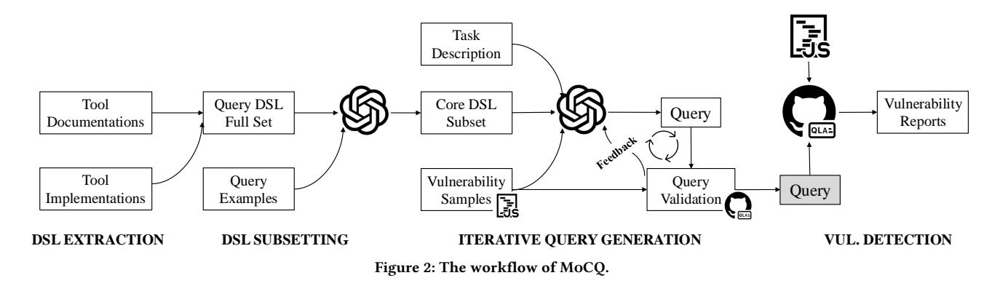
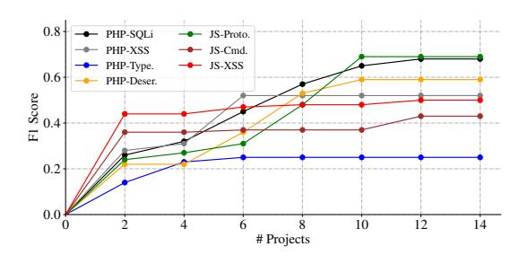
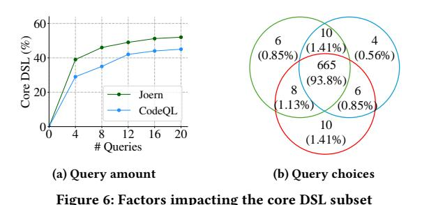
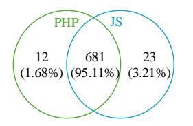

# Automated Static Vulnerability Detection via a Holistic Neuro-symbolic Approach

Penghui Li Columbia University New York, NY, USA pl2689@columbia.edu

Songchen Yao Columbia University New York, NY, USA sy2743@columbia.edu Josef Sarfati Korich Columbia University New York, NY, USA jsk2266@columbia.edu

Changhua Luo Wuhan University Wuhan, Hubei, China chluo2502@whu.edu.cn

Jianjia Yu Johns Hopkins University Baltimore, MD, USA jyu122@jhu.edu

Yinzhi Cao Johns Hopkins University Baltimore, MD, USA yinzhi.cao@jhu.edu

Junfeng Yang Columbia University New York, NY, USA junfeng@cs.columbia.edu

### Abstract

Static vulnerability detection is still a challenging problem and demands excessive human efforts, e.g., manual curation of good vulnerability patterns. None of prior works, including classic program analysis or Large Language Model (LLM)-based approaches, have fully automated such vulnerability pattern generations with reasonable detection accuracy. In this paper, we design and implement, MoCQ, a novel holistic neuro-symbolic framework that combines the complementary strengths of LLMs and classical static analysis to enable scalable vulnerability detection. The key insight is that MoCQ leverages an LLM to automatically extract vulnerability patterns and translate them into detection queries, and then on static analysis to refine such queries in a feedback loop and eventually execute them for analyzing large codebases and mining vulnerabilities. We evaluate MoCQ on seven types of vulnerabilities spanning two programming languages. We found MoCQ-generated queries uncovered at least 12 patterns that were missed by experts. On a ground truth dataset, MoCQ achieved comparable precision and recall compared to expert-crafted queries. Moreover, MoCQ has identified seven previously unknown vulnerabilities in real-world applications, demonstrating its practical effectiveness. We have responsibly disclosed them to the corresponding developers.

#### CCS Concepts

• Security and privacy → Software and application security.

### Keywords

Neuro-symbolic Analysis; Static Vulnerability Detection

### 1 Introduction

Static vulnerability detection examines source code without execution and thus is scalable and efficient for analyzing large codebases. It has been widely adopted in both industry and open-source security research. Classic static approaches conduct rigorous program analysis involving control- and data-flows on program representations (e.g., code property graph) generated from large codebases. One popular technique is to query the representations to search for given vulnerability patterns. This has been adopted by prominent tools like CodeQL [\[8\]](#page-12-0), Semgrep [\[55\]](#page-13-0), and Joern [\[6,](#page-12-1) [70\]](#page-13-1), and has detected many zero-day vulnerabilities in the past [\[6,](#page-12-1) [57,](#page-13-2) [58,](#page-13-3) [70\]](#page-13-1).

Despite the success, one remaining barrier is that static vulnerability detection still requires excessive human efforts, especially manual curation of vulnerability patterns. Such manual efforts are not only time-consuming (e.g., spanning seven weeks [\[15\]](#page-12-2)) but also introduce inaccuracies due to limited human knowledge, reducing the overall effectiveness of static detection [\[3,](#page-12-3) [41\]](#page-12-4). As codebases evolve and new threats emerge, maintaining accurate detection patterns further requires continuous updates and efforts.

A natural solution to reduce the human efforts and inaccuracies is to introduce Large Language Models (LLMs). For example, researchers [\[13,](#page-12-5) [34,](#page-12-6) [72\]](#page-13-4) recently have explored using LLMs for static vulnerability detection without classic program analysis. The intuition is that LLMs excel at pattern recognition—they can identify recurring syntactic and semantic structures, and typical usage patterns, and understand semantics across diverse codebases and programming languages. For example, LLMs can understand programs based on natural language cues such as identifier names and comments. However, LLMs lack rigorous reasoning and often produce inconsistent or incomplete results due to their probabilistic nature and hallucinations. Additionally, token constraints limit their applicability to real-world complex software. Existing evaluation indicates that even state-of-the-art LLMs performed poorly with high false positive rates and often non-deterministic outputs [\[61\]](#page-13-5).

Since neither the classic nor LLM-based static approach is sufficient for effective vulnerability detection, a promising direction is to integrate them into a neuro-symbolic framework[1](#page-0-0) that combines their complementary strengths. Some recent works have already taken a step forward in such an integration. For example, IRIS [\[29\]](#page-12-7) and Artemis [\[18\]](#page-12-8) use LLMs to extract taint specifications such as sources and sinks and integrate them into existing detection patterns. However, human efforts are still needed, indicating significant engineering efforts and inaccuracies due to human errors also exist because they rely on existing expert-crafted detection patterns.

In this paper, we design a novel, static, fully automated, neurosymbolic vulnerability detection framework, called MoCQ (Model-Generated Code Queries), which splits the tasks for LLMs and static program analysis based on their respective strengths. The core idea is to leverage LLMs to automatically extract vulnerability

<span id="page-0-0"></span><sup>1</sup>Neuro refers to LLM-based analysis, which leverages neural models for semantic reasoning; and symbolic refers to classic static analysis with symbolic representations and formal logic systems.

patterns and incorporate the patterns into static program analysis. This achieves the best of both worlds: the pattern recognition capability of LLMs, and the scalability and rigorousness of classic static analysis. More specifically, MoCQ uses LLMs to generate vulnerability patterns and express them as queries to the program representations generated via classic program analysis.

While the idea is intuitively simple, the LLM-driven generation of vulnerability patterns faces multiple challenges. LLMs often do not have enough knowledge of domain-specific languages (DSLs) used by static vulnerability detection tools (e.g., Scala-like DSL for Joern [\[70\]](#page-13-1) and SQL-like DSL for CodeQL), resulting in unparseable or uncompilable queries. Specifically, our study shows that pretrained, commercial LLMs, e.g., ChatGPT [\[51\]](#page-13-6), often fail to generate valid queries, frequently producing syntax errors or triggering executiontime exceptions. To deal with this challenge, MoCQ adopts a technique, specifically DSL subsetting, to refine DSL by selecting a core set of features to guide the automated query generation, without sacrificing expressiveness. The intuition is that such a refined subset can be better understood by pretrained LLMs while still preserving the core semantics due to the redundant nature of the DSL.

Besides, even when the LLM-generated queries are syntactically correct and executable, they may fail to capture vulnerabilities effectively. Specifically, they may trigger semantic errors (i.e., fail to report vulnerabilities), be overly specific (i.e., overfitting to known instances via matching exact variable names or fixed control flow paths), or be overly general (i.e., underfitting by matching many irrelevant code cases). To deal with these, MoCQ adopts a feedbackdriven approach, which incorporates fine-grained feedback from a symbolic query validator for iterative query refinement. The query validator executes the LLM-generated queries and monitors the exhibited behaviors, including syntax errors, execution exceptions, and semantic errors. Specifically, we instrument the query execution runtime to obtain a block-level program state of the query execution to precisely locate the errors and inconsistencies. These are then used for the LLM to refine the incorrect query. The validator further uses heuristics to detect if a query is too specific and instructs the LLM to generalize it; it also instructs LLMs to eliminate false positives (if any) to improve the precision.

We implemented MoCQ for two state-of-the-art static vulnerability detection tools (Joern [\[70\]](#page-13-1) and CodeQL [\[8\]](#page-12-0)). We then extensively evaluated MoCQ on seven types of vulnerabilities from the OWASP Top Ten [\[52\]](#page-13-7), covering two popular programming languages PHP and JavaScript. Our results show that, given only a few (e.g., 5-18) vulnerability examples, MoCQ can efficiently generate detection queries within hours. These queries demonstrate strong detection capability, comparable to those crafted by security experts. Notably, MoCQ uncovered at least 12 vulnerability patterns that were missed in expert-crafted queries, highlighting the strength of our LLM-based approach. A comprehensive ablation study further confirms the importance of DSL subsetting and the symbolic validator, which significantly contribute to the validity of the generated queries. MoCQ-generated queries successfully detected seven new vulnerabilities in real-world applications and four could not be identified by expert-crafted patterns.

This paper makes the following contributions.

• We proposed a novel way to split the tasks for neural and symbolic components to achieve their complementary benefits.

- We developed a DSL subsetting technique and a feedback-driven approach to automatically generating vulnerability patterns.
- We implemented a holistic, fully-automated, neuro-symbolic vulnerability detection framework MoCQ.
- We demonstrated that MoCQ could automatically generate vulnerability patterns for real-world vulnerabilities and achieve comparable results with patterns from security experts. MoCQ uncovered at least 12 new patterns and seven new vulnerabilities.

#### 2 Background

### 2.1 Large Language Models

Recent advancements in LLMs such as ChatGPT [\[51\]](#page-13-6), Claude [\[5\]](#page-12-9), and Gemini [\[11\]](#page-12-10) have demonstrated their capability in various tasks including code generation, unit testing, and reasoning over structured data [\[14,](#page-12-11) [60\]](#page-13-8). Trained on massive codebases, these models can understand complex programming structures by learning the cues from natural language semantics such as identifier names and human-written comments. For example, Artemis [\[18\]](#page-12-8) uses an LLM to analyze the function name to decide if a function accepts user inputs in web applications. LLMs can also generate syntactically and semantically correct code snippets to solve code challenges like LeetCode. Some attempts leverage LLMs for security-relevant tasks. For example, Fuzz4All [\[69\]](#page-13-9) uses LLMs to generate fuzzing inputs; ChatAFL [\[39\]](#page-12-12) employs LLMs to extract input format (grammar) from network protocol specifications for protocol fuzzing. These efforts showcase the effectiveness of LLMs in extracting information from natural language descriptions and code.

In-context Learning. In-context learning is a fundamental capability of modern LLMs, allowing them to perform new tasks without explicit retraining or post-training. Instead of modifying model weights, in-context learning enables LLMs to generalize patterns and behaviors from a few examples as part of input prompts like in few-shot learning.

#### 2.2 Query-based Static Analysis

Query-based static analysis tools formulate vulnerability patterns as structured queries in the domain-specific languages (DSLs) of the tools. They typically employ a language-specific frontend to convert source code into graph-like program representations, such as an abstract syntax tree (AST), control-flow graph (CFG), or code property graph (CPG) [\[70\]](#page-13-1). Security analysts then define precise analysis queries that operate on the representations to find vulnerabilities. By decoupling analysis logic (queries) from the language semantic reasoning backend, this approach could achieve high flexibility and maintainability. For example, to extend to a different programming language, one only needs to develop an additional language frontend and could reuse the backend. Notable tools include Joern [\[6,](#page-12-1) [70\]](#page-13-1), GitHub's CodeQL [\[8\]](#page-12-0), and Amazon's CodeGuru [\[56\]](#page-13-10). More specifically, Yamaguchi et al. introduced Joern by modeling programs in CPG [\[4\]](#page-12-13). GitHub's CodeQL [\[8\]](#page-12-0) further popularized query-based analysis by integrating it into security workflows for large-scale vulnerability detection.

The query DSLs allow security analysts to specify vulnerability patterns. Each analysis tool typically comes with its own DSL. For example, Joern uses a Scala-like DSL with a rich set of APIs and

```
1 // find obj["__proto__"] in t = obj["__proto__"]
2 def objProto = cpg.call
3 .where(_.name(Operators.assignment))
4 .argument(2)
5 .isCall
6 .arrayAccess
7
8 // find t["toString"] in t["toString"] = "Hacked"
9 def objProp = cpg.call
10 .where(_.name(Operators.assignment))
11 .argument(1)
12 .isCall
13 .arrayAccess
14
15 // find a data-flow path from objProp to objProto
16 objProp.array.reachableBy(
17 objProto
18 )
19 .filter(...)
```

Figure 1: Example real-world query in Joern, simplified for clarity.

custom data structures. CodeQL, on the other hand, adopts a SQLlike DSL. During query execution, the static analysis tools often enforce strict syntax and semantic validations.

### 3 Problem Statement

### 3.1 Motivation

The effectiveness of query-based static analysis hinges not only on rigorous language semantic reasoning but more importantly, on the quality of vulnerability patterns. High-quality, well-crafted patterns are essential. Without them, even the most powerful static analysis may miss critical vulnerabilities or generate excessive noise.

A Query Example. [Figure 1](#page-2-0) illustrates a simplified version of a real-world Joern query designed to JavaScript detect prototype pollution [\[15\]](#page-12-2). Specifically, JavaScript is a prototype-based language where objects inherit properties and methods through a mechanism known as prototypes. Modifying the prototype of one object can affect all other objects that inherit from the same prototype, resulting in vulnerabilities known as prototype pollution. For example, an attacker can overwrite the toString method by first accessing the prototype reference using t=obj["\_\_proto\_\_"] and then modifying it via t["toString"]="Hacked". As a result, any object inheriting from the fundamental prototype Object.prototype now have a tampered toString method. This type of vulnerability can lead to severe security consequences, including arbitrary code execution, cross-site scripting, privilege escalation, and denial of service [\[9,](#page-12-14) [21,](#page-12-15) [26,](#page-12-16) [32,](#page-12-17) [57\]](#page-13-2).

[Figure 1](#page-2-0) comprises three main steps: (1) identifying the object prototype (lines 1-6), (2) identifying the property access (lines 8-13), and (3) verifying whether there is a data connection between them (lines 15-19). Constructing such queries requires a profound understanding of the query DSL and is inherently challenging.[2](#page-2-1) As an example, consider the first step. The dot operator (".") in Joern's DSL enables query chaining, meaning that each stage operates on the intermediate results produced by the preceding stage to progressively refine the search. The query begins by identifying assignment operations via Operators.assignment (in Joern, assignment is modeled as a form of call operation). It then extracts the second argument of the assignment using argument(2), which corresponds

<span id="page-2-1"></span><sup>2</sup>The original query is more complex and includes additional operations, such as verifying whether the accessed values and properties are controllable by user inputs. We simplified it for illustration and clarification purposes.

to the right-hand side (RHS) of the assignment expression. Finally, arrayAccess is used to filter results, narrowing the matches to cases where the RHS is an indexed (array-style) access.

Summary. Designing robust vulnerability patterns remains a significant challenge. First, it requires expertise in security vulnerabilities, programming languages, the static analysis tool, and DSLs, resulting in a time-consuming process that is difficult to get right. Maintaining these queries to account for emerging threats further demands ongoing expertise and sustained efforts. For example, from the Git history, the version shown in [Figure 1](#page-2-0) took three weeks to develop, followed by an additional month of refinement [\[2\]](#page-12-18). Second, experts cannot always capture the full breadth of attack vectors, leading to missed vulnerabilities. In practice, many queries—even those written by GitHub's CodeQL team have been found to be imprecise or buggy [\[3,](#page-12-3) [41\]](#page-12-4). In the above example, an attacker can bypass the query detection by chaining property access and assignment in a single expression, such as obj["\_\_proto\_\_"]["toString"] = "Hacked". Beyond that, as we will show in [§6.3.2,](#page-8-0) three more advanced mechanisms for manipulating object properties—automatically uncovered by our research were overlooked even in the latest version of the example query.

## <span id="page-2-2"></span>3.2 Challenges

This work aims to explore an automated approach to generating vulnerability patterns using LLMs. When new threats are publicly disclosed, a developer can rapidly generate comprehensive vulnerability patterns to scan their codebases without the long delays traditionally required for manual pattern engineering. While the idea of using LLMs to generate queries is intuitively simple, the task is challenging as shown in our study on five vulnerability types among the OWASP Top Ten [\[52\]](#page-13-7). Specifically, we asked ChatGPT-4o [\[51\]](#page-13-6) to generate vulnerability queries for these vulnerabilities. Among all 300 cases spanning five vulnerability types with three prompting strategies, only one successfully generated a query to retrieve a JavaScript command injection under the few-shot setting. More details can be found in [Appendix A.](#page-13-11)

(Simplified) Prompt : You are an expert on Joern and static analysis. You are given two query examples and a vulnerability example, please generate a Joern query to detect JavaScript prototype pollution.

(Simplified) Answer:

1 ... 2 val assign = code.call 3 .nameExact("assignment") 4 ...

In the above, we show a prompt to generate a query for JavaScript prototype pollution under the few-shot setting, and the response query. The generated query actually could not successfully run in Joern's analysis engine. We summarize the following four key technical problems.

DSL Syntax Correctness. The LLM-generated queries frequently raise grammar and syntax errors, which stem from the model's incomplete understanding of the DSL grammar. Specifically, static analysis tools use complex DSLs, and LLMs typically lack sufficient exposure to their syntax, semantics, and typical usage. For example, Joern queries based on the code property graph usually require the root object cpg (e.g., [Figure 1\)](#page-2-0). However, the query generated above did not follow this requirement. This issue is further aggravated by the hallucinations of LLMs.

Runtime Execution Correctness. Queries must execute within domain-specific runtime (i.e., analysis engine) and interact meaningfully with structured program representations. LLM-generated queries often use incorrect or non-existent function calls, missing parameters, and incompatible data types or operations, resulting in execution-time exceptions. For example, the nameExact operation in the above query used "assignment" instead of "<operator>.assignment", which led to execution-time exceptions after we first manually fixed the syntax error.

Semantic Validity. Even when queries are syntactically correct and executable, ensuring their semantic validity remains challenging. They must satisfy runtime constraints and capture the correct traversal logic. Executable queries may still fail to reflect intended program behaviors, leading to semantic errors, where the query runs without crashing but misses the vulnerable code.

Precision-recall Balance. Similar to how security analysts craft queries, LLM-generated queries must be not only correct but also comprehensive and precise. Patterns that are too specific (i.e., overfitting) may miss variants of the same vulnerability, resulting in high false negatives, whereas overly general patterns (i.e., underfitting) can produce excessive false positives. Achieving this balance between precision and recall remains a fundamental challenge in query generation.

#### 4 MoCQ

We design MoCQ, a novel static neuro-symbolic system whose workflow is outlined in [Figure 2.](#page-4-0) MoCQ first analyzes open knowledge such as documentation and tool implementations to extract the query DSL, and then constructs a core DSL subset [\(§4.1\)](#page-3-0). MoCQ then generates vulnerability queries [\(§4.2\)](#page-4-1) through a feedback loop with a trace-driven symbolic query validator to refine [\(§4.3\)](#page-5-0) and optimize [\(§4.4\)](#page-6-0) the queries. Finally, MoCQ outputs the generated query, which can be applied to detect new vulnerabilities. We summarize two key techniques in MoCQ that facilitate solving the aforementioned challenges.

Query DSL Extraction and Subsetting. To help generate syntactically- and semantically-correct queries, we first obtain the formal specifications of the query DSLs used by the static analysis tools, which also define the desired output structure for LLMs. MoCQ extracts the DSL specifications—including DSL grammars, data types, compatible APIs, and their functionalities—by automatically parsing the online documentation and implementations. However, directly using all extracted DSL specifications would overwhelm an LLM because of the DSL's complexity, and would still not enable the LLM to efficiently generate valid queries. We thus propose a language subsetting technique, which selects a core subset of DSL features from the extracted full set with the help of a few real-world query examples. This is based on our observation that query DSL often contains redundant features, for example, those that can be equally expressed by other language features. Such a DSL subset could be better understood by the LLMs to significantly reduce the query generation complexity.

Iterative Feedback Loop. Atop the core DSL subset, MoCQ employs an LLM to generate queries and iteratively refines them based on fine-grained feedback from our symbolic query validator. Specifically, we instrument query execution runtime, which executes and analyzes the generated queries to locate the exact locations or causes of the syntax and semantic errors. Beyond that, the validator also tracks the intermediate program states on the query execution traces and validates whether the generated query could retrieve the given vulnerability examples. During such an iterative process, MoCQ is able to gradually generate valid queries that can analyze complex real-world programs. Moreover, the validator incorporates heuristics to detect potential overfitting in queries and guides the LLM to generalize them. It also instruments the LLM to refine the query to eliminate the false positives.

#### <span id="page-3-0"></span>4.1 DSL Specification Extraction

As mentioned in [§3.2](#page-2-2) and detailed in [Appendix A,](#page-13-11) many query execution failures arise from a lack of grammar and semantic understanding. This suggests that it is difficult for LLMs to generate valid queries without domain-specific context. The simplest way to equip pretrained LLMs with such knowledge is through few-shot learning, where a few domain-specific query examples are provided to illustrate DSL usage. However, the effectiveness of this approach depends on the coverage and diversity of the examples. In practice, for DSLs with the complexity of Joern and CodeQL, the highly structured output space cannot be effectively captured by just a handful of examples. On the other hand, fine-tuning LLMs requires a large volume of task-specific training data—in this case, valid and diverse query examples—which is often impractical to collect.

We thus propose to extract the DSL specifications in a concise way and feed the DSL specifications to the pretrained LLMs to guide query generation. Our DSL specification includes both the grammar and the semantics of the query language. The former governs the code structure while the latter encapsulates the operational meaning behind query statements like the APIs or data structures accessed, parameter processing logic, and resulting runtime behaviors. Note that the DSL specifications are tool-specific and we only need to extract once per tool.

<span id="page-3-1"></span>4.1.1 DSL Extraction. The extraction process targets both syntax and semantics. To this end, MoCQ first analyzes the static analysis tool's documentation (e.g., online use instructions) and source code (e.g., API implementations and comments). Documentation typically contains structured content (e.g., HTML tables) that describes grammar, operations, and usage patterns. We first crawl the online documentation of the tools and prompt a pretrained LLM to extract grammar rules, data types, operations, and API usage. For example, Joern's website [\[47\]](#page-12-19) lists its query operations (termed "Steps") along with their descriptions.

Online documentation only briefly mentions the APIs' behaviors. We seek more precise and comprehensive definitions from their code implementations, which offer ground-truth definitions through function signatures, type annotations, inline comments, etc. We first manually identify and retrieve relevant source code files from each tool's implementation, then leverage an LLM to automatically summarize the functionality of the functions. This process is manageable and needs to be done only once per tool,

<span id="page-4-0"></span>

although it could be automated by linking function names from the documentation with their implementations in the source code. The prompt template used for extraction is shown in [Appendix E.](#page-14-0)

4.1.2 DSL Subsetting. The extracted query DSL specification is complex and could overwhelm the model. For example, static analysis tools like Joern and CodeQL have thousands of APIs. Each API can have multiple parameter choices, resulting in an exponential number of combinations of these rules and operations. Even though MoCQ has known the precise description for each operation, our evaluation (details in [§6.4.2\)](#page-9-0) demonstrates that providing LLMs with the full-set DSL does not efficiently produce good queries.

We design a language subsetting technique to resolve the DSL complexity issue. We observe that DSL specification contains significant redundancy not strictly necessary for constructing useful queries. A smaller common subset is often sufficient for most common queries. In essence, we limit the DSL to a more tractable subset of features, rather than exposing every possible construct, for query generation. Concretely, the subsetting process operates at the granularity of APIs, which can strike a balance between expressiveness and control—it preserves flexibility for query construction while keeping the DSL surface concise and understandable. MoCQ first associates typical parameter choices with each API. It then analyzes the full set of DSL APIs, and decides and selects these important, necessary DSL APIs for common usage. This is feasible since the LLM can refer to features' intended behaviors or functionalities collected in [§4.1.1](#page-3-1) to evaluate if one is necessary.

We also provide a small collection of queries to help MoCQ learn the core DSL subset. Here the LLM only needs to base on them to select the API subset from the full set, which is much simpler than generating new queries using few-shot prompting with query examples. Nevertheless, if a security analyst identifies additional needs or corner cases, they can perform a one-time augmentation to expand the DSL subset.

4.1.3 DSL Prompting. We provide the core DSL subset to the LLM to guide query generation. We adopt a grammar prompting technique [\[63\]](#page-13-12) to concisely express the grammar. Specifically, we supply an abstract grammar specification of the DSL using the Backus-Naur Form (BNF) [\[37\]](#page-12-20), which is a standard way of defining language syntax. Although BNF is itself domain-specific, it appears more frequently in training data than custom query DSLs. Moreover, the BNF structure is simpler and more concise than real query examples, while still conveying rich information about DSL usage. We

<span id="page-4-2"></span>⟨traversal⟩ ::= ⟨cpg\_start⟩ . ⟨step\_chain⟩ ⟨cpg\_start⟩ ::= cpg | cpg.method | cpg.call | ... ⟨step\_chain⟩ ::= ⟨step⟩ | ⟨step⟩ . ⟨step\_chain⟩ ⟨step⟩ ::= ⟨filter\_step⟩ | ⟨complex\_step⟩ ⟨filter\_step⟩ ::= .where( ⟨predicate⟩ ) ⟨complex\_step⟩ ::= .filter( ⟨predicate⟩ ) | .reachableBy( ⟨traversal⟩ ) | ... ⟨predicate⟩ ::= \_.name( ⟨reference⟩ ) | ⟨identifier⟩ ⟨reference⟩ ::= Operators. ⟨operator⟩ ⟨operator⟩ ::= assignment | arrayAccess | fieldAccess | ...

Figure 3: BNF grammar for Joern, extracted by MoCQ.

also specify the subset semantics like APIs to the LLM in a compact form, including their signature, data types, and API functionalities.

[Figure 3](#page-4-2) presents a simplified grammar for Joern using BNF. It details the fundamental grammar rules, such as the cpg\_start that initializes a traversal query, and how various components connect to form complete expressions. The grammar rules explicitly define the structure and permissible compositions of the DSL, guiding models to produce syntactically valid statements. For example, by following the grammar, an LLM knows to begin queries with cpg followed by appropriate method chaining through step\_chain elements, effectively avoiding common syntax errors. The grammar also clarifies how to construct complex queries using operations like filter\_step and complex\_step, enabling more sophisticated code analysis patterns.

### <span id="page-4-1"></span>4.2 Query Generation

Atop the core DSL subset, MoCQ generates detection queries as described in [Algorithm 1.](#page-5-1) Each time, MoCQ is tasked to generate a query ( ) for a specific vulnerability type (). It takes as input (1) a task description ( ) that contains a natural language explanation of the vulnerability type, and (2) a small set of vulnerability examples in the type ( = { | = 1, . . . ,}). To make query generation more manageable, MoCQ first produces a per-example query ( ) that could analyze and retrieve the corresponding example . Then, MoCQ performs optimizations to address overfitting and underfitting (line 8). Finally, the system merges all per-example

Conference '17, July 2017, Washington, DC, USA

Conference'17, July 2017, Washington, DC, USA Penghui Li, Songchen Yao, Josef Sarfati Korich, Changhua Luo, Jianjia Yu, Yinzhi Cao, and Junfeng Yang

|    | Algorithm 1: Iterative query generation in a feedback loop.  |  |
|----|--------------------------------------------------------------|--|
|    |                                                              |  |
|    | Input :Task-Description $D^t$ , Vulnerability examples $E^t$ |  |
|    | Output: Query $Q^t$                                          |  |
|    | 1 QList ← []                                                 |  |
|    | 2 foreach $e_i^t ∈ E^t$ do                                   |  |
| 3  | PState ← null                                                |  |
| 4  | for i ← 1 to MaxN do                                         |  |
| 5  | $Q_i^t$ ← LLMQueryGen ( $e_i^t$ , $D^t$ , PState)            |  |
| 6  | error, PState ← Validation ( $Q_i^t$ , $e_i^t$ )             |  |
| 7  | if not error then                                            |  |
| 8  | $Q_i^t$ ← Optimize ( $Q_i^t$ )                               |  |
| 9  | QList.add( $Q_i^t$ )                                         |  |
| 10 | break                                                        |  |
| 11 | end                                                          |  |
| 12 | end                                                          |  |
| 13 | end                                                          |  |
|    | 14 $Q^t ← ⋃_{q∈QList} q$ // Merge per-example queries        |  |
|    | 15 return $Q^t$                                              |  |
| 16 |                                                              |  |
|    | 17 function Validation (Q, e):                               |  |
| 18 | S ← null                                                     |  |
| 19 | foreach B ∈ Q do                                             |  |
| 20 | S = Execute (B, e, S) // Capture fine-grained runtime info   |  |
| 21 | end                                                          |  |
| 22 | return S.err, S.programState                                 |  |
| 23 | end                                                          |  |

<span id="page-5-1"></span>

queries into a unified per-type query ( = Ð =1 ) for effective real-world vulnerability detection (line 14).

The vulnerability examples play a crucial role in our design. First, they help LLMs understand the semantics and patterns associated with each vulnerability type, especially for unseen threats. Nevertheless, MoCQ goes beyond simple pattern matching through our dedicated generalization technique described in [§4.4.2.](#page-6-1) Second, MoCQ uses these examples as test cases to validate the generated queries. Specifically, as we will show in [§4.3,](#page-5-0) MoCQ executes the query and checks whether it can retrieve the corresponding examples from the application under analysis. We believe this is a reasonable and practical assumption for deploying MoCQ in realworld scenarios because vulnerability examples are often available, for example, from the CVE database. To this end, MoCQ takes a program slice for each vulnerability example—retaining the necessary code syntax and semantics for query generation.

As an initial step, we include the general workflow of the vulnerability type in the task description. Instead of composing a single monolithic query with hundreds or thousands of operations, MoCQ applies a chain-of-thought prompting strategy to decompose the detection task into smaller, well-defined subtasks. For example, to detect prototype pollution, MoCQ splits the task into four steps: (1) identifying object property modifications, (2) determining if user-controlled input affects the property name, (3) inspecting the property name itself, and (4) checking for sanitization. Importantly, MoCQ can automatically perform this decomposition based on the task descriptions, without manual intervention.

### <span id="page-5-0"></span>4.3 Iterative Query Refinement

Given the difficulty of query generation, it is almost impossible to produce a qualified query in a single LLM attempt, even when provided with the DSL grammar and semantics. Therefore, MoCQ incorporates an iterative feedback loop (shown as the for loop on lines 4-11 of [Algorithm 1\)](#page-5-1) to debug and refine the query using fine-grained feedback from a trace-driven symbolic query validator. This process terminates either when a valid query is generated or when the maximum attempt threshold (MaxN) is reached.

4.3.1 Reflection with Symbolic Validation. MoCQ first asks the LLM to reflect on its past query output, suggest an improved version, and then retry the task [\[28,](#page-12-21) [54\]](#page-13-13). This helps mitigate randomness and hallucinations. Different from prior self-reflection techniques, MoCQ employs a trace-driven symbolic query validation to provide fine-grained feedback information to the LLM.

In particular, the generated query ( ) can be represented as a sequence with blocks denoted as [1, 2, . . . , ]. The query produces a trace when executing. When applying the to analyze the application containing the vulnerability example , MoCQ records the intermediate program states for its blocks along the trace. Specifically, when the first blocks have been executed, MoCQ collects the set of in-scope variables and their runtime values by instrumenting the query execution runtime. [Formula 1](#page-5-2) formulates the program state , where represents the in-scope variable till block , and is the corresponding value at current time.

<span id="page-5-2"></span>
$$
S_j = \{ var = val_j \mid var \in B_{\le j} \}
$$
 (1)

To help locate the root cause of failure, we provide the LLM finegrained program state information with annotated trace values [1, 2, . . . , ]. Our design of feedback further includes checks for syntax errors, execution exceptions, and semantics errors.

Syntax Validation. Syntax validation checks if the query complies with the extracted DSL grammar. The static analysis tool itself provides a runtime for the queries and is naturally equipped with grammar validation capability. However, it is often coarse-grained without pinpointing the exact error locations. Therefore, we instrument and hook the grammar validator to obtain the corresponding grammar rule of the errors. Alternatively, one can leverage off-theshelf grammar parser (e.g., constructing an ANTLR [\[53\]](#page-13-14)).

Execution Validation. Similarly, MoCQ refers to the collected DSL specifications for execution exceptions. There are multiple types of semantic errors such as undefined variables, missing attributes, type mismatches, or incorrect API usage. Our symbolic validator checks these behaviors and outputs the error locations. Besides merely identifying the errors, MoCQ also searches on the collected DSL semantics to suggest (potentially correct) operations by fuzzily matching the name similarities. For example, it could suggest "<operator>.assignment" as a similar argument for "assignment" to fix the exactName exception mentioned in [§3.2.](#page-2-2)

Semantic Validation. MoCQ also evaluates and inspects the semantic behaviors of the query execution. Specifically, MoCQ debugs the runtime behavior of the query with the account of the vulnerability example . This leverages the knowledge of the vulnerability example to provide feedback to the LLM for refining the query. A naive approach is to check whether the query as a whole retrieves the vulnerability example (i.e., boolean feedback). However, this is insufficient for helping an LLM pinpoint the root cause when the query fails to retrieve the example. MoCQ thus filters in only the program states corresponding to the vulnerability example from the whole-project analysis, enabling the LLM to cross-check query behavior and self-correct potential issues.

### <span id="page-6-0"></span>4.4 Query Optimization

We develop three optimizations to mitigate query underfitting and overfitting and to improve query execution efficiency.

<span id="page-6-3"></span>4.4.1 Eliminating FPs for Precision. When using the query to analyze the project containing the input vulnerability example , it might return false positives. A false positive must be introduced at a certain code block . MoCQ thus similarly leverages the program state to help the LLM reason about how the false positive is introduced. The elimination also goes through multiple iterations. Note that it is common for a static analysis query to produce false positives—many of them cannot be excluded, for example, those involving complex path constraints.

We currently assume the cases outside the collected known true positives are false positives. In our evaluation, we take a best-effort manner to manually collect all true-positive vulnerabilities in a project as the example set , therefore, all cases outside are considered false positives. In practice, non-vulnerable code is much more prevalent than vulnerable code, so a report from an underdevelopment query is more like to be a false positive. Recent research has shown it is possible to leverage an LLM to assess if a case is false positive or not [\[29\]](#page-12-7). We leave this as a future work.

<span id="page-6-1"></span>4.4.2 Generalization for Recall. The generated queries could be overly specific, especially when given input vulnerability examples. To mitigate the overfitting issue, MoCQ generalizes the queries to not just focus on a specific example. This is especially important to make the queries capable of real-world detection later on. As an initial step, we design a few heuristics to assess if a query is overfitting. First, MoCQ checks whether the query relies on exact constant values (e.g., hardcoded variable names and string literals) that are unique to a specific example. Such reliance limits the applicability of the query to other contexts. Second, MoCQ examines whether the query includes structural patterns or constraints that are overly specific to the layout of a particular program, such as deep AST chains or unique call sequences. Once any such situation is found, MoCQ employs the LLM to paraphrase or abstract queries by asking it to identify the core intention behind the original query and express it in a more general form to resolve the identified overfitting situation. Such generalization improves the reusability of queries and enables the detection of vulnerability variants.

4.4.3 Merging for Efficiency. After generating individual queries for different vulnerability examples, MoCQ performs query merging to consolidate detection rules and improve efficiency. A naive approach would simply apply a logical OR operation to combine all per-example queries—sequentially running each one independently. However, this can lead to performance degradation, as many queries share redundant and repetitive conditions. To address that, MoCQ introduces an LLM-assisted query merging stage. All individual queries are given to an LLM, which attempts to merge them

into a single optimized query ( ) while preserving their detection capability. The merged query is passed through the symbolic query validator for all vulnerability examples to verify its correctness and effectiveness (this process is omitted from [Algorithm 1\)](#page-5-1). If the merged query fails validation on any of the examples, MoCQ further undergoes the feedback loop to iteratively improve the merging process. By optimizing queries before real-world adaption, MoCQ minimizes redundant computation and ensures that vulnerability detection remains scalable and precise.

#### 5 Implementation

We implemented our solution for Joern [\[70\]](#page-13-1) and CodeQL [\[8\]](#page-12-0) and present important implementation details in this section.

Instrumentation of Symbolic Validator. We realized the runtime program state tracking by instrumenting the query execution runtime. In particular, we enhanced the query parsing process to locate syntax errors. For the other two, we hooked the internal language interpreter. Specifically, these query languages' interpreters typically contain a main interpretation loop that switches over the instruction types and invokes specific handlers. We thus added additional hookers for selected handlers to collect variables and their runtime values.

Query Execution Server. The iterative query generation would invoke the symbolic validator and static analysis runtime multiple times. The invocations often operate on the same codebase—the project containing the input vulnerability example. To improve the overall efficiency, we eliminate the repetitive project loading process by starting a local server to host the codebase for interactive, continuous query execution. This could significantly improve the efficiency of the symbolic validator.

Function References in Joern. During our implementation, we realized that Joern could not correctly connect a function's reference to its definition. When generating queries, the LLMs (and human experts) all would first assume such function inferences are properly handled. This introduces a lot of failures in the generated queries. Therefore, we carefully modified the variable references in Joern [\[70\]](#page-13-1) and complemented the DSL of Joern to support explicit function dereference.

### 6 Evaluation

In this section, we extensively evaluate MoCQ to answer the following questions.

- New Vulnerability Detection. How effective is MoCQ in discovering new vulnerabilities in real-world applications?
- Query Effectiveness. How effective are the MoCQ-generated queries for detecting vulnerabilities? How do they compare to related approaches?
- Ablation Study. How does each component of MoCQ contribute to its performance?
- DSL Subsetting. What are the characteristics of the DSL subset used by MoCQ?

### <span id="page-6-2"></span>6.1 Experimental Setup

Dataset. We consider seven types of vulnerabilities in PHP and JavaScript from OWASP Top Ten [\[52\]](#page-13-7) for our evaluation. For each

<span id="page-7-0"></span>Table 1: New vulnerabilities and the contributing new patterns.

| Project                   | Vul. Type | Experts' | MoCQ | Contributing New Pattern                | Status |
|---------------------------|-----------|----------|------|-----------------------------------------|--------|
| forkcms [45]              | PHP SQLi  | ✓        | ✓    | -                                       | Rep    |
| SyliusCmsPlugin [42]      | PHP XSS   | ×        | ✓    | Ctx-sensitive san. via htmlspecialchars | Rep    |
| parse-static-imports [46] | JS Cmd.   | ×        | ✓    | Vulnerable operation with repl          | Ack    |
| es2015-proxy [44]         | JS Proto. | ×        | ✓    | Data flow via Object.assign             | Rep    |
| web-worker [48]           | JS Proto. | ✓        | ✓    | -                                       | Rep    |
| koa-send [49]             | JS Proto. | ✓        | ✓    | -                                       | Rep    |
| content-type [43]         | JS Proto. | ×        | ✓    | Data flow via Reflect.set               | Rep    |

vulnerability type, we selected 20 popular projects that contain known vulnerabilities. We examined relevant public sources, including the CVE database and GitHub issues, and incorporated findings from our previous research, to collect all known vulnerabilities as the ground truth on a best-effort basis. In total, we included 265 vulnerabilities for our evaluation. Vulnerabilities within a single project may share similarities, potentially leading to data leakage if some are used for query generation and others for performance evaluation. To mitigate this, we randomly selected 15 projects (192 vulnerabilities) for query generation—the generation dataset, and the remaining 5 projects (73 vulnerabilities) for performance evaluation—the testing dataset. We consistently adhere to this dataset split throughout the entire evaluation. In addition to the two datasets with ground truth, we collect 19 projects in their latest versions to evaluate new vulnerability discovery—referred to as the latest project dataset.

Configuration of MoCQ. MoCQ is a complex system influenced by various factors, particularly the number of projects and vulnerabilities used for query generation, as well as the choice of underlying model and static analysis engine. Unless otherwise noted, our default setting involves generating queries from vulnerability examples drawn from ten randomly selected projects in the generation dataset, using the Claude 3.7 Sonnet model and static analysis engine Joern. These ten projects cover 113 input vulnerability examples. A more comprehensive ablation study evaluating other settings is presented in [§6.4.](#page-9-1) We ran the experiments three times with an attempt threshold of 5,000 iterations and used the mean values for the results.

#### 6.2 Zero-day Detection

We first evaluate MoCQ on the latest project dataset. MoCQgenerated queries effectively discover seven zero-day vulnerabilities, shown in [Table 1,](#page-7-0) including four JavaScript prototype pollution, one JavaScript command injection, one PHP SQL injection, and one PHP cross-site scripting. We responsibly reported the vulnerabilities and to date one has been acknowledged.

As a comparison, we collected queries from the official Joern tool [\[4\]](#page-12-13) as well as from recent publications [\[15,](#page-12-2) [25\]](#page-12-29). When there are multiple queries for a vulnerability type, we use the one with the best detection results. On the same dataset, expert-crafted queries identified three new vulnerabilities, all of which were also detected by MoCQ-generated queries. The other four vulnerabilities were exclusively detected using the new patterns discovered by MoCQ. Our in-depth study revealed four unique vulnerability patterns that contributed to MoCQ's superior performance; these were entirely missed by existing Joern queries, leading to their failure to detect the vulnerabilities. A more comprehensive list of new patterns uncovered by MoCQ is discussed in [§6.3.2](#page-8-0) and [Table 4.](#page-9-2)

<span id="page-7-1"></span>

|    | 1 function mergeOptions(target, source) {                   |
|----|-------------------------------------------------------------|
| 2  | for (let key in source) {                                   |
| 3  | Object.assign(target[key], source[key]);                    |
| 4  | }                                                           |
| 5  | return target;                                              |
|    | 6 }                                                         |
| 7  |                                                             |
|    | 8 // Proof-of-Concept (PoC)                                 |
|    | 9 const obj = {}                                            |
|    | 10 const payload = '{"__proto__": {"toString": "Hacked"}}'; |
|    | 11 mergeOptions(obj, JSON.parse(payload));                  |
| 12 |                                                             |
|    | 13 // All objects have the polluted property                |
|    | 14 const newObj = {};                                       |

15 console.log(newObj.toString); // "Hacked"

Figure 4: A JavaScript prototype pollution vulnerability.

Case Study. [Figure 4](#page-7-1) shows the prototype pollution vulnerability in es2015-proxy [\[44\]](#page-12-25). The mergeOptions function iterates over the properties of source object and assigns the property values to target object. When source is crafted to include the special property "\_\_proto\_\_", the mergeOptions function inadvertently assigns its value to overwrite target["\_\_proto\_\_"], which refers to the object's prototype. Specifically, the proof-of-concept (PoC) payload we created modifies the implementation of the toString method of target["\_\_proto\_\_"]. This modification impacts not only target but also all objects that inherit from the foundational object prototype Object.prototype, such as the newObj on line 14. Detecting this vulnerability requires capturing the Object.assign in the pattern for property modification, which was missed by expert-crafted queries.

#### 6.3 Query Effectiveness

We apply the queries generated under the default setting to the testing dataset and compare them to related approaches.

6.3.1 Performance of MoCQ. The testing dataset contains 72 true vulnerabilities and per-type breakdown is shown as TP in [Ta](#page-8-1)[ble 2.](#page-8-1) Overall, MoCQ-generated queries could detect a broad range of vulnerabilities across PHP and JavaScript ecosystems. Out of 72 known vulnerabilities, MoCQ-generated queries successfully detected 56 cases with 90 false positives. We also computed the recall (. = + = ) and precision (. = + ). MoCQ achieved a strong overall recall of 0.77 and a precision of 0.40. The precision, especially the false positive rate, is reasonable in practice, especially given the challenge of statically analyzing dynamic PHP and JavaScript codebases. As we will show in [§6.3.2,](#page-8-0) even expert-crafted queries have similar precision.

We analyzed the 16 vulnerabilities missed by MoCQ-generated queries. These false negatives stem from multiple root causes. There are 11 cases caused by incomplete patterns, including missing taint source specifications—particularly involving customized thirdparty sources—missing vulnerable operations, etc., which could have been detected if a more comprehensive pattern had been generated. Besides, two cases involved incomplete data flows where the targets of dynamic function calls were missing from the project's program representations. This occurred because the static construction of representations failed to properly handle dynamic language features. Three cases were caused by flaws in type-related issues. For instance, inaccurate type information led to one false negative

<span id="page-8-1"></span>Table 2: Vulnerability detection using Joern on the testing dataset. It contains true vulnerabilities reported by both MoCQ and expert-crafted queries (M∩E), only MoCQ (M\E), or only expert-crafted queries (E\M).

|               |           |      |      | MoCQ  |       |      |      | Experts' |       |       | Detection Delta |       |      |      | MoCQ+Experts' |       |      |      | Pure LLM |       |
|---------------|-----------|------|------|-------|-------|------|------|----------|-------|-------|-----------------|-------|------|------|---------------|-------|------|------|----------|-------|
| Vul. Type     | # TP𝑡𝑜𝑡𝑎𝑙 | # TP | # FP | Rec.  | Prec. | # TP | # FP | Rec.     | Prec. | # M∩E | # M\E           | # E\M | # TP | # FP | Rec.          | Prec. | # TP | # FP | Rec.     | Prec. |
| PHP SQLi      | 19        | 16   | 14   | 0.84  | 0.53  | 17   | 21   | 0.89     | 0.45  | 15    | 1               | 2     | 18   | 23   | 0.95          | 0.44  | 9    | 45   | 0.47     | 0.17  |
| PHP XSS       | 13        | 8    | 10   | 0.62  | 0.44  | 7    | 14   | 0.54     | 0.33  | 7     | 1               | 0     | 8    | 15   | 0.62          | 0.35  | 9    | 27   | 0.69     | 0.25  |
| PHP Type.     | 6         | 4    | 22   | 0.67  | 0.15  | 3    | 18   | 0.50     | 0.14  | 3     | 1               | 0     | 4    | 24   | 0.67          | 0.14  | 2    | 23   | 0.33     | 0.08  |
| PHP Deser.    | 8         | 5    | 4    | 0.62  | 0.56  | 4    | 6    | 0.50     | 0.40  | 2     | 3               | 2     | 7    | 7    | 0.88          | 0.50  | 5    | 57   | 0.63     | 0.08  |
| JS Proto.     | 11        | 10   | 8    | 0.91  | 0.56  | 7    | 12   | 0.64     | 0.37  | 6     | 4               | 1     | 11   | 13   | 1.00          | 0.46  | 4    | 39   | 0.36     | 0.09  |
| JS Cmd.       | 5         | 5    | 17   | 1.00  | 0.23  | 5    | 15   | 1.00     | 0.25  | 5     | 0               | 0     | 5    | 20   | 1.00          | 0.20  | 3    | 25   | 0.60     | 0.11  |
| JS XSS        | 11        | 8    | 15   | 0.73  | 0.35  | 9    | 11   | 0.82     | 0.45  | 6     | 2               | 3     | 11   | 12   | 1.00          | 0.48  | 6    | 34   | 0.55     | 0.15  |
| Total / *Avg. | 73        | 56   | 90   | *0.77 | *0.40 | 52   | 97   | *0.70    | *0.34 | 44    | 12              | 8     | 64   | 114  | *0.87         | *0.37 | 38   | 250  | *0.52    | *0.13 |

Table 3: Query generation efficiency.

<span id="page-8-2"></span>

|            | PHP SQLi | PHP XSS | PHP Type. | PHP Deser. | JS Proto. | JS Cmd. | JS XSS |
|------------|----------|---------|-----------|------------|-----------|---------|--------|
| MoCQ       |          |         |           |            |           |         |        |
| # Examples | 23       | 28      | 11        | 13         | 15        | 10      | 13     |
| Time       | 15.3h    | 24.6h   | 5.2h      | 18.7h      | 21.4h     | 7.9h    | 10.5h  |
| Experts'   |          |         |           |            |           |         |        |
| # Commits  | 5        | 5       | 10        | 17         | 28        | 1       | 1      |
| Time Span  | 2d       | 3d      | 7d        | 5w         | 7w        | -       | -      |

in PHP type juggling and two in JavaScript prototype pollution. The latter two categories could not be fixed by refining the patterns.

<span id="page-8-0"></span>6.3.2 Comparison to Expert-crafted Queries. We further evaluated the collected expert-crafted queries on the same testing dataset.

Engineering Efforts. MoCQ is efficient in generating queries and demonstrates a significant advantage in required engineering efforts. We report the number of input vulnerability examples and the total query generation time per vulnerability type in [Table 3.](#page-8-2) In general, MoCQ required only a few hours to generate queries for each vulnerability type, significantly shorter than previous best practices that relied heavily on expert engineering. Generally, types with more input examples took longer to process. On average, it took 0.9 hours to construct a query for a single example across different types. Complex vulnerabilities like PHP deserialization and JavaScript prototype pollution were the most time-consuming cases, requiring 1.4 and 1.5 hours per example, respectively.

We analyzed the Git commit history in the open-source repositories of the expert-crafted queries. We find that experts often use multiple commits to develop and revise the queries, and the commit history often spans days to a few weeks. We acknowledge that Git commit history does not precisely reflect the actual, continuous engineering effort involved. For instance, the time span between the first and last commit may overestimate or underestimate the true effort, as substantial work may have occurred before the first commit or between commits without being recorded. Nevertheless, we argue that it serves as a reasonable proxy for estimating the engineering effort required. As a comparison, MoCQ, as a fullyautomated solution, can run continuously and shorten the amount of time to construct queries.

Vulnerability Detection. Overall, MoCQ-generated queries achieved a comparable performance to expert-crafted queries despite the latter demanding abundant security expertise and engineering efforts. As shown in [Table 2,](#page-8-1) expert-crafted queries detected fewer true positives and produced more false positives, yielding an

average recall of 0.7 and precision of 0.34. A closer look at their detailed detection differences revealed 44 vulnerabilities were detected by both of them. In three vulnerability types (PHP XSS, PHP Type., and JavaScript Cmd.), MoCQ-generated queries successfully detected all the vulnerabilities identified by expert-crafted queries, as indicated by a zero count of E\M.

In the remaining four types, however, MoCQ-generated and expert-crafted queries demonstrated complementary strengths each was able to detect some vulnerabilities missed by the other. Motivated by this, we explored how their combination would perform. We combined both MoCQ-generated and experts' queries, and then used the combined set for Joern in vulnerability detection (MoCQ+Experts'). This combined version achieved promising results, with a high recall of 0.87 and a precision of 0.37 on average. Notably, it successfully detected all known vulnerabilities in three vulnerability types, achieving a perfect recall of 1. This shows that although MoCQ-generated queries alone do not surpass expert-crafted queries in all cases, their combination is an effective strategy.

Following that, we tried to apply MoCQ to refine the expertcrafted query for JavaScript prototype pollution as an example. MoCQ ran for around one hour and automatically revised the query, which in return detected 3 previously missed vulnerabilities. This highlights that MoCQ not only automatically generates detection queries but also can improve an existing expert-crafted query.

New Patterns. We highlight the new patterns MoCQ discovered. We define an atomic operation—such as a specific API call, expression type, or data flow—that is not recognized by expertcrafted queries as a new pattern. We then conservatively locate these new operations through pair-wise comparison with expertcrafted queries and found 12 new vulnerability patterns, as shown in [Table 4.](#page-9-2) We constructed a minimal PoC vulnerability example to validate each new pattern. Compared to expert-crafted queries, MoCQ uncovered new operations that propagate data flows, or new vulnerability operations that can lead to security consequences. By filling in these missing components, static analysis could more comprehensively search vulnerabilities in target application code.

MoCQ not only found nine new patterns specific to a vulnerability type but also three general patterns applicable to the vulnerabilities in the entire programming language. For example, four mechanisms for PHP type juggling were missed by experts, e.g., PHP built-in functions array\_search and array\_flip where implicit type casting could occur. MoCQ also detected a new general

<span id="page-9-2"></span>Table 4: New vulnerability patterns uncovered by MoCQ. \*MoCQ uncovered 34 distinct operations in the phar category for PHP deserialization and we conservatively counted one.

| Vul. Type   | Pattern               | Functionality                  |
|-------------|-----------------------|--------------------------------|
| General PHP | htmlspecialchars      | Ctx-sensitive sanitization     |
| PHP Type.   | in_array              | Implicit type casting          |
| PHP Type.   | array_search          | Loose comparison               |
| PHP Type.   | array_flip            | Implicit type casting          |
| PHP Type.   | case in switch        | Type coercion in case matching |
| PHP Deser.  | phar*                 | Object deserialization         |
| PHP Deser.  | copy                  | Object deserialization         |
| General JS  | Object.assign         | Data propagation               |
| General JS  | Reflect.set           | Data manipulation              |
| JS Proto.   | Object.assign         | Data propagation               |
| JS Proto.   | Object.defineProperty | New property manipulation      |
| JS Proto.   | obj.__defineGetter__  | New property manipulation      |

way in JavaScript to propagate data flows via Reflect.set—which could benefit the detection of different types of vulnerabilities. We submitted the new patterns to the maintainers of expert-crafted queries. One of them has been acknowledged.

6.3.3 Comparison to LLM-based Approaches. We compare MoCQ to LLM-based approaches including pure LLM-based and IRIS [\[29\]](#page-12-7). Pure LLM-based Detection. This approach directly provides the source code to an LLM and asks it to assess if there is any vulnerability. Unlike MoCQ, there is no LLM-based tool that can perform whole project analysis for large codebases, to the best of our knowledge. We thus take the common practice by separately checking individual code snippets (source code file) [\[13,](#page-12-5) [40\]](#page-12-30) with Claude 3.7 Sonnet. To handle non-determinism across multiple LLM runs, we assign the final label based on majority agreement—if at least two out of three runs agree, we adopt that label for the case.

The evaluation results in the last part of [Table 2](#page-8-1) show lower precision and recall. This is primarily due to the lack of cross-file information, such as global variables and inter-procedural function calls defined outside the current file, leading to many false positives and false negatives. For instance, detecting JavaScript prototype pollution requires tracking data flow from external user input to object property manipulation. It is thus often infeasible when analyzing a single file in isolation. We also observed that when the entire vulnerability is contained within a single file, the LLM tends to produce fairly reliable results.

IRIS. IRIS [\[29\]](#page-12-7) is a related work that combines LLM-identified taint specifications with existing queries. We consider its contribution orthogonal or complementary to that of MoCQ. IRIS is designed for Java programs and is not directly applicable for an end-to-end comparison. We thus incorporated its main technique and evaluated how could help resolve our false negatives. The results showed that IRIS could successfully identify missing data sources for three false negative cases. Nevertheless, IRIS does not have a holistic, fullyautomated way of query generation.

### <span id="page-9-1"></span>6.4 Ablation Study

We conduct a comprehensive ablation study to measure the individual contributions of the techniques on the testing dataset. We use the F1 score (2 · .·. .+.) as our evaluation metric, as it captures

<span id="page-9-3"></span>

Figure 5: F1 scores with queries generated with different numbers of input projects.

both precision and recall, and is well-suited for imbalanced data where non-vulnerable code is much more than vulnerable code. Due to the space limit, we put the efficiency analysis of query merging in [Appendix D.](#page-14-1)

6.4.1 Vulnerability Examples. MoCQ takes as input a few vulnerability examples to generate queries. The queries might perform better when generated with more examples. Here, we gradually added more projects and applied the queries to the testing dataset. This incremental setup helps us understand the impact of additional projects on performance. We conduct our experiments at the project granularity rather than the vulnerability granularity due to similar data leakage concerns (discussed in [§6.1\)](#page-6-2).

[Figure 5](#page-9-3) illustrates the F1 scores on the same testing dataset under different numbers of input projects. The F1 score increased as more projects were used for query generation. However, the point at which performance stabilized varies by vulnerability type. For example, JavaScript XSS achieved a stably high F1 score with four projects, whereas JavaScript prototype pollution generally required ten. Overall, we find that ten projects are typically sufficient to generate high-quality queries. This corresponds to the 5-18 vulnerability examples across different vulnerability types (details in [Appendix B\)](#page-13-15).

<span id="page-9-0"></span>6.4.2 DSL Subset. To understand the effect of the subsetting technique, we developed a variant containing the full set of DSL, denoted as DSL100, and used it to generate queries. Generally, we observed a much longer time in query generation, and DSL100 frequently reached the attempt threshold before producing valid queries. This further resulted in lower quality of merged queries, and accordingly, worse detection results, as shown in [Table 5.](#page-10-0) We also attempted to remove another 10% of random APIs from the DSL and used the remaining for query generation. It turned out that many previously successful queries could no longer be generated. This highlights the importance of performing a practical DSL subsetting to retain core features.

6.4.3 FP Elimination. During the iterative query generation, MoCQ treats those cases outside the generation dataset as false positives and uses them to refine the queries [\(§4.4.1\)](#page-6-3). To understand the impact of such false positive signals, we experimented by disabling them as a comparison and showed the results as W/O in [Table 5.](#page-10-0) Naturally, more false positives were introduced in the final reports when analyzing the projects in the testing dataset, even though

<span id="page-10-0"></span>Table 5: Ablation study with F1 scores, experimented using 10 input projects. The default setting is with Joern and Claude 3.7 Sonnet.

| Vul. Type  | MoCQ | DSL100 | W/OFP | W/OGen | GPT-4o | CodeQL |
|------------|------|--------|-------|--------|--------|--------|
| PHP SQLi   | 0.65 | 0.38   | 0.54  | 0.37   | 0.44   | -      |
| PHP XSS    | 0.52 | 0.23   | 0.32  | 0.25   | 0.43   | -      |
| PHP Type.  | 0.25 | 0.15   | 0.19  | 0.23   | 0.31   | -      |
| PHP Deser. | 0.59 | 0.41   | 0.34  | 0.28   | 0.50   | -      |
| JS Proto.  | 0.69 | 0.54   | 0.33  | 0.28   | 0.54   | 0.72   |
| JS Cmd.    | 0.37 | 0.29   | 0.18  | 0.32   | 0.22   | 0.35   |
| JS XSS     | 0.48 | 0.33   | 0.23  | 0.32   | 0.35   | 0.38   |
| Average    | 0.51 | 0.33   | 0.30  | 0.29   | 0.40   | 0.48   |

the true positives remained the same. This in turn decreased the average F1 score to 0.3.

6.4.4 Generalization. Query generalization is important in the design of MoCQ. It enables MoCQ to capture diverse vulnerability patterns beyond the given input vulnerability example. Many new patterns could only be discovered with generalization. When we disabled it from MoCQ (W/O), the F1 score significantly dropped to 0.29. Our manual analysis of some queries revealed many new vulnerability patterns that the full-fledged MoCQ previously identified now disappeared. It is reasonable because by explicitly instrumenting the LLM to generalize the patterns, the LLM can better capture structural variations across vulnerabilities.

6.4.5 Models. MoCQ is not limited to only Claude 3.7 Sonnet. We further experimented with another model, GPT-4o [\[51\]](#page-13-6). The results on Joern are shown in [Table 5.](#page-10-0) In our experiments, ChatGPT-4o has an average F1 score of 0.4, while full-fledged MoCQ with Claude 3.7 Sonnet has the best performance of 0.51. Our experience suggests that the Claude 3.7 Sonnet model has a better capability in coding tasks than ChatGPT-4o. Though we did not integrate other models due to our cost constraints, we believe MoCQ has wide applicability.

6.4.6 Static Tools. Besides Joern, we further experimented MoCQ with CodeQL. CodeQL is capable of analyzing JavaScript but not PHP. We thus evaluated it using the same setup for the three types of JavaScript vulnerabilities in our dataset. From our experience, CodeQL queries are often considered harder due to their higher DSL complexity, so the results on two types of vulnerabilities were worse than MoCQ with Joern. It is interesting to observe that MoCQ with CodeQL achieved a better F1 score (0.72) on JavaScript prototype pollution.

#### 6.5 DSL Subset

In this section, we evaluate and characterize the DSL subset extracted by MoCQ.

Number of Queries. The query examples would have an impact on the DSL subset. We thus provided the Claude 3.7 Sonnet with progressively more query examples to understand how the amount of provided queries could impact the size core DSL subset. We conducted the experiments for Joern and CodeQL and presented the results in [Figure 6a.](#page-10-1) Initially, more queries enriched the resulting core DSL subset, and the subset became gradually stable with 12 to 16 query examples. Ultimately, the subsetting technique could remove approximately half of the available APIs—48% for Joern and


<span id="page-10-1"></span>

55% for CodeQL—and significantly reduce the exploration space for query generation. Our earlier evaluation already demonstrated that the preserved subset was sufficiently expressive for vulnerability detection. While we do not claim this subset to be optimal or minimal, our manual analysis suggests that some preserved APIs

could still be pruned. Nonetheless, the current design is effective

and useful in practice. Different choices of query examples might impact the resulting DSL subset. To measure this, we randomly selected 16 queries from a pool of 40 to construct the core DSL subset. We repeated this three times. The Venn diagram in [Figure 6b](#page-10-1) demonstrates that the three different query choices still resulted in a large overlap (93.8%). There could be some divergence across choices due to the variability in query examples. This suggests that the majority of the necessary features are consistent. We also measured the impact of using language-specific queries on the DSL subset in [Appendix C.](#page-14-2) Details of Removed Features. We randomly sampled 50 removed APIs to explain why they were removed. We made a few key observations. First, the majority (45 out of 50) of removed DSL features in Joern could be equivalently expressed using the retained ones. For example, the whereNot() condition in Joern can be rewritten as a valid .where(not). This is particularly interesting, as DSL features are typically introduced to simplify usage and improve expressiveness [\[17\]](#page-12-31)—yet here we find that some offer redundant functionality that can be composed of other constructs. Two removed features are debugging interfaces and textual processing operations, such as printing. They are not necessary for production-environment queries. The other three are language-specific operations—those required only for specific programming languages. For example, address operation in Joern is applicable to binary code and not required for JavaScript or PHP. Similar findings were observed in CodeQL, though it has relatively more language-specific operations removed (7 out of 50).

#### 7 Discussion

In this section, we discuss the current limitations and future directions.

Vulnerability Examples. At present, MoCQ requires a small set of true positive vulnerability samples, which helps the LLM understand the vulnerabilities and also serves as test cases to validate the queries. For our current evaluation, we randomly selected the vulnerability examples. A more careful selection of the vulnerability examples (e.g., cover diverse vulnerability perspectives) or providing more examples would advance the performance of

MoCQ. Besides, we believe negative cases can be helpful to improve the precision of generated queries. We currently assume the reports outside the known true positives as the negative signals and wish the queries could exclude them. One can also additionally provide negative cases, including well-annotated true negatives and false negatives. For example, patched vulnerabilities can be a good source of true negatives.

Other Use Scenarios. We present a generic pipeline for generating detection queries, which enables multiple practical use scenarios. For example, MoCQ can be used to enhance existing expert-crafted queries by automatically extending them with additional detection capabilities. We have showcased this for JavaScript prototype pollution. In addition, MoCQ can serve as a foundation for building a digital twin of an existing (black-box) static analysis tool. In this setting, feedback—such as true/false positives or partial results—from a closed-source tool can guide MoCQ in generating queries that approximate its behaviors. This is especially useful in industrial contexts where high-performing yet opaque tools lack extensibility or transparency. By mimicking such tools, MoCQ enables more flexible, explainable analysis for smooth integration into modern development workflows.

Model Fine-tuning. We currently leverage in-context learning to generate detection queries in DSL. Our DSL specification mitigates the errors triggered during the generation process but MoCQ may still require many iterations to correct errors and refine the queries. Fine-tuning pretrained models could be an effective way to make MoCQ even more powerful. Our pipeline can then serve as a foundation to generate synthetic query data for resolving issues like lack of training data in fine-tuning. Our symbolic query validator can also be used as the reward function in reinforcement learning-based model training.

Ethical Considerations. We strive to adhere to the best practices of research ethics throughout this project. We employed LLMs to generate vulnerability detection patterns in a controlled, local environment, ensuring that the generated outputs did not pose any risk to public systems or external stakeholders. Any newly discovered vulnerabilities were responsibly disclosed to the corresponding application developers. We are also actively engaging with the maintainers of expert-crafted vulnerability patterns to share our insights and improve existing queries.

#### 8 Related Work

Learning-based Detection. Various transformer-based methods have been applied for vulnerability detection, including encoderonly [\[1\]](#page-12-32),I encoder-decoder [\[66,](#page-13-16) [67\]](#page-13-17), and decoder-only [\[60\]](#page-13-8) architectures. Researchers have also adapted various fine-tuning strategies, such as domain-specific pretraining [\[12\]](#page-12-33), instruct-tuning [\[7,](#page-12-34) [36\]](#page-12-35), supervised fine-tuning [\[65,](#page-13-18) [73\]](#page-13-19), parameter-efficient fine-tuning [\[36\]](#page-12-35) to improve models' performance. Complementary to fine-tuning approaches, prompt engineering using variations like few-shot, chainof-thought, and progressive prompting strategies [\[16,](#page-12-36) [33,](#page-12-37) [50,](#page-13-20) [71\]](#page-13-21) have achieved promising results. However, multiple studies [\[61\]](#page-13-5) have identified limitations like response inconsistency and diminished efficacy when addressing under-represented vulnerabilities or large codebases. Compared with these works, MoCQ has the additional advantage of symbolic methods and is highly scalable.

Neuro-symbolic Program Analysis. Generally, neuro-symbolic program analysis combines a neural and a symbolic component. IRIS [\[29\]](#page-12-7) and Artemis [\[18\]](#page-12-8) leverage LLMs to infer project-specific taint specifications for Java and PHP applications, respectively. They rely on signatures and comments to decide whether the functions are sources or sinks. IRIS further uses an LLM to eliminate false positives by providing the slices. There is also work that leverages neural methods to validate vulnerabilities, e.g., WAP [\[38\]](#page-12-38). Furthermore, LLMSA [\[64\]](#page-13-22) uses an LLM to decompose the vulnerability analysis problem into several simple syntactic or semantic properties upon smaller code snippets, which are handled by the symbolic analysis rules. LLift [\[24\]](#page-12-39) uses an LLM to analyze the post constraints for use-before-initialization bugs within the Linux kernel. MoCQ distinguishes itself from these by targeting automated query generation from scratch, and we believe MoCQ can complement them to reduce engineering demands.

Cloned Vulnerability Detection. Software developers might borrow code (thus vulnerabilities in it) from others. Multiple work uses the signature of a known vulnerability to detect such vulnerable code clones in other codebases. VUDDY [\[22\]](#page-12-40) leverages a functionlevel granularity signature after code abstraction and normalization. It can only find extract clones without modifications (type-1) and renamed clones with identifier changes (type-2). TRACER [\[20\]](#page-12-41) represents the signature as an inter-procedural data-flow trace by collecting the operations in the trace; HiddenCPG [\[68\]](#page-13-23) constructs a graph structure and RecurSan [\[58\]](#page-13-3) calculates a symbolic expression for existing vulnerabilities. MoCQ is different by extracting and generalizing vulnerability patterns for a class of vulnerabilities instead of focusing on specific vulnerability instances.

General Static Analysis. Lots of tools specifically target the analysis of PHP and JavaScript applications—the primary testing target of this paper—including TChecker [\[35\]](#page-12-42), RIPS [\[10\]](#page-12-43), Pixy [\[19\]](#page-12-44), and ODGen [\[27\]](#page-12-45). Unlike query-based systems, these tools typically rely on hard-coded analysis logic and do not support customizable or extensible analyses through user-defined queries. Realizing such customization on them requires additional implementation considerations and engineering. More generally, there is a line of efforts analyzing other programming languages such as C/C++ [\[59\]](#page-13-24), Java [\[23,](#page-12-46) [62\]](#page-13-25), Rust [\[30,](#page-12-47) [31\]](#page-12-48), etc.

#### 9 Conclusion

This work presented MoCQ, a novel neuro-symbolic approach that combines the complementary advantages of LLMs and static analysis to achieve fully automated vulnerability detection. With a DSL subsetting technique and trace-driven symbolic validation, MoCQ automatically extracts vulnerability patterns using an LLM. These patterns are then integrated with query-based static analysis to achieve high scalability in analyzing large codebases. Our evaluation demonstrates that MoCQ could achieve comparable detection performance as expert-crafted queries. It significantly reduces the required engineering efforts, lowers the barrier to building tailored vulnerability detectors, and makes automated security analysis more accessible and adaptable. We believe that our novel neurosymbolic approach represents a promising new direction for general software security.

Conference'17, July 2017, Washington, DC, USA

#### References

- <span id="page-12-32"></span>[1] 2020. CodeBERT: A Pre-Trained Model for Programming and Natural Languages", author = "Feng, Zhangyin and Guo, Daya and Tang, Duyu and Duan, Nan and Feng, Xiaocheng and Gong, Ming and Shou, Linjun and Qin, Bing and Liu, Ting and Jiang, Daxin and Zhou, Ming. In Findings of the Association for Computational Linguistics: EMNLP 2020. Online.
- <span id="page-12-18"></span>[2] 2023. Joern for Prototype Polllution. [https://github.com/Tobiasfro/joern/](https://github.com/Tobiasfro/joern/commits/master/) [commits/master/.](https://github.com/Tobiasfro/joern/commits/master/)
- <span id="page-12-3"></span>[3] 2024. CodeQL 2.14.2 Change Log. [https://codeql.github.com/docs/codeql](https://codeql.github.com/docs/codeql-overview/codeql-changelog/codeql-cli-2.14.2/#javascript-typescript)[overview/codeql-changelog/codeql-cli-2.14.2/#javascript-typescript.](https://codeql.github.com/docs/codeql-overview/codeql-changelog/codeql-cli-2.14.2/#javascript-typescript)
- <span id="page-12-13"></span>[4] 2025. Open-source code analysis platform for C/C++/Java/Binary/Javascript/Python/Kotlin based on code property graphs. [https://github.com/joernio/joern.](https://github.com/joernio/joern)
- <span id="page-12-9"></span>[5] Anthropic. 2025. Claude.<https://www.anthropic.com/claude> AI assistant developed by Anthropic.
- <span id="page-12-1"></span>[6] Michael Backes, Konrad Rieck, Malte Skoruppa, Ben Stock, and Fabian Yamaguchi. 2017. Efficient and flexible discovery of php application vulnerabilities. In Proceedings of the 2nd IEEE European Symposium on Security and Privacy (EuroS&P). Paris, France.
- <span id="page-12-34"></span>[7] Wei Chang, Chunyang Ye, and Hui Zhou. 2024. Fine-Tuning Pre-trained Model with Optimizable Prompt Learning for Code Vulnerability Detection. In 2024 IEEE 35th International Symposium on Software Reliability Engineering (ISSRE). 108–119.
- <span id="page-12-0"></span>[8] CodeQL. 2024. CodeQL. [https://codeql.github.com/.](https://codeql.github.com/)
- <span id="page-12-14"></span>[9] Eric Cornelissen, Mikhail Shcherbakov, and Musard Balliu. 2024. GHunter: Universal Prototype Pollution Gadgets in JavaScript Runtimes. In Proceedings of the 33th USENIX Security Symposium (Security). Philadelphia, PA, USA.
- <span id="page-12-43"></span>[10] Johannes Dahse and Thorsten Holz. 2014. Simulation of Built-in PHP Features for Precise Static Code Analysis. In Proceedings of the 2014 Annual Network and Distributed System Security Symposium (NDSS). San Diego, CA.
- <span id="page-12-10"></span>[11] Google DeepMind. 2023. Introducing Gemini: our largest and most capable AI model. [https://deepmind.google/technologies/gemini/.](https://deepmind.google/technologies/gemini/)
- <span id="page-12-33"></span>[12] Yangruibo Ding, Saikat Chakraborty, Luca Buratti, Saurabh Pujar, Alessandro Morari, Gail Kaiser, and Baishakhi Ray. 2023. CONCORD: Clone-Aware Contrastive Learning for Source Code. In Proceedings of the 32nd ACM SIGSOFT International Symposium on Software Testing and Analysis (ISSTA 2023). Association for Computing Machinery, New York, NY, USA, 26–38. [doi:10.1145/3597926.3598035](https://doi.org/10.1145/3597926.3598035)
- <span id="page-12-5"></span>[13] Yangruibo Ding, Yanjun Fu, Omniyyah Ibrahim, Chawin Sitawarin, Xinyun Chen, Basel Alomair, David Wagner, Baishakhi Ray, and Yizheng Chen. 2025. Vulnerability detection with code language models: How far are we?. In Proceedings of the 47th International Conference on Software Engineering (ICSE). Ottawa, Ontario, Canada.
- <span id="page-12-11"></span>[14] Xueying Du, Mingwei Liu, Kaixin Wang, Hanlin Wang, Junwei Liu, Yixuan Chen, Jiayi Feng, Chaofeng Sha, Xin Peng, and Yiling Lou. 2024. Evaluating large language models in class-level code generation. In Proceedings of the IEEE/ACM 46th International Conference on Software Engineering. 1–13.
- <span id="page-12-2"></span>[15] Tobias Fröberg. 2023. Detection of Prototype Pollution Using Joern: Joern's Detection Capability Compared to CodeQL's. Master's thesis.
- <span id="page-12-36"></span>[16] Michael Fu, Chakkrit Kla Tantithamthavorn, Van-Anh Nguyen, and Trung Le. 2023. ChatGPT for Vulnerability Detection, Classification, and Repair: How Far Are We? 2023 30th Asia-Pacific Software Engineering Conference (APSEC) (2023), 632–636.
- <span id="page-12-31"></span>[17] Felienne Hermans, Martin Pinzger, and Arie van Deursen. 2009. Domain-Specific Languages in Practice: A User Study on the Success Factors. In Model Driven Engineering Languages and Systems. Springer Berlin Heidelberg, Berlin, Heidelberg, 423–437.
- <span id="page-12-8"></span>[18] Yuchen Ji, Ting Dai, Zhichao Zhou, Yutian Tang, and Jingzhu He. 2025. Artemis: Toward Accurate Detection of Server-Side Request Forgeries through LLM-Assisted Inter-Procedural Path-Sensitive Taint Analysis. In Proceedings of the 2025 Annual ACM Conference on Object-Oriented Programming, Systems, Languages, and Applications (OOPSLA). Singapore.
- <span id="page-12-44"></span>[19] Nenad Jovanovic, Christopher Kruegel, and Engin Kirda. 2006. Pixy: A static analysis tool for detecting web application vulnerabilities. In Proceedings of the 27th IEEE Symposium on Security and Privacy (S&P). Oakland, CA, USA.
- <span id="page-12-41"></span>[20] Wooseok Kang, Byoungho Son, and Kihong Heo. 2022. TRACER: signature-based static analysis for detecting recurring vulnerabilities. In Proceedings of the 29th ACM Conference on Computer and Communications Security (CCS). Los Angeles, CA, USA.
- <span id="page-12-15"></span>[21] Zifeng Kang, Song Li, and Yinzhi Cao. 2022. Probe the Proto: Measuring Client-Side Prototype Pollution Vulnerabilities of One Million Real-world Websites.. In Proceedings of the 2022 Annual Network and Distributed System Security Symposium (NDSS). San Diego, CA, USA.
- <span id="page-12-40"></span>[22] Seulbae Kim, Seunghoon Woo, Heejo Lee, and Hakjoo Oh. 2017. Vuddy: A scalable approach for vulnerable code clone discovery. In Proceedings of the 38th IEEE Symposium on Security and Privacy (S&P). San Jose, CA, USA.
- <span id="page-12-46"></span>[23] Patrick Lam, Eric Bodden, Ondrej Lhoták, and Laurie Hendren. 2011. The Soot framework for Java program analysis: a retrospective. In Cetus Users and Compiler

Infrastructure Workshop (CETUS 2011), Vol. 15.

- <span id="page-12-39"></span>[24] Haonan Li, Yu Hao, Yizhuo Zhai, and Zhiyun Qian. 2024. Enhancing Static Analysis for Practical Bug Detection: An LLM-Integrated Approach. Proc. ACM Program. Lang. 8, OOPSLA1 (April 2024). [doi:10.1145/3649828](https://doi.org/10.1145/3649828)
- <span id="page-12-29"></span>[25] Penghui Li and Wei Meng. 2021. LChecker: Detecting Loose Comparison Bugs in PHP. In Proceedings of the Web Conference (WWW). Ljubljana, Slovenia.
- <span id="page-12-16"></span>[26] Song Li, Mingqing Kang, Jianwei Hou, and Yinzhi Cao. 2021. Detecting Node. js prototype pollution vulnerabilities via object lookup analysis. In Proceedings of the 29th ACM Joint European Software Engineering Conference and Symposium on the Foundations of Software Engineering (ESEC/FSE). Athens, Greece.
- <span id="page-12-45"></span>[27] Song Li, Mingqing Kang, Jianwei Hou, and Yinzhi Cao. 2022. Mining Node.js Vulnerabilities via Object Dependence Graph and Query. In Proceedings of the 31st USENIX Security Symposium, Security 2022. 143–160.
- <span id="page-12-21"></span>[28] Tao Li, Gang Li, Zhiwei Deng, Bryan Wang, and Yang Li. 2023. A Zero-Shot Language Agent for Computer Control with Structured Reflection. In Findings of the Association for Computational Linguistics: EMNLP 2023. Association for Computational Linguistics, Singapore. [https://aclanthology.org/2023.findings](https://aclanthology.org/2023.findings-emnlp.753/)[emnlp.753/](https://aclanthology.org/2023.findings-emnlp.753/)
- <span id="page-12-7"></span>[29] Ziyang Li, Saikat Dutta, and Mayur Naik. 2025. Llm-assisted static analysis for detecting security vulnerabilities. In Proceedings of the 13th International Conference on Learning Representations (ICLR). Singapore.
- <span id="page-12-47"></span>[30] Zhuohua Li, Jincheng Wang, Mingshen Sun, and John CS Lui. 2021. MirChecker: detecting bugs in Rust programs via static analysis. In Proceedings of the 28th ACM Conference on Computer and Communications Security (CCS). Virtual Event, Korea.
- <span id="page-12-48"></span>[31] Zhuohua Li, Jincheng Wang, Mingshen Sun, and John CS Lui. 2022. Detecting cross-language memory management issues in rust. In European Symposium on Research in Computer Security. Springer, Copenhagen, Denmark, 680–700.
- <span id="page-12-17"></span>[32] Zhengyu Liu, Kecheng An, and Yinzhi Cao. 2024. Undefined-oriented Programming: Detecting and Chaining Prototype Pollution Gadgets in Node.js Template Engines for Malicious Consequences. In 2024 IEEE Symposium on Security and Privacy (SP). San Francisco, CA, USA.
- <span id="page-12-37"></span>[33] Zhihong Liu, Zezhou Yang, and Qing Liao. 2024. Exploration On Prompting LLM With Code-Specific Information For Vulnerability Detection. In 2024 IEEE International Conference on Software Services Engineering (SSE).
- <span id="page-12-6"></span>[34] Guilong Lu, Xiaolin Ju, Xiang Chen, Wenlong Pei, and Zhilong Cai. 2024. GRACE: Empowering LLM-based software vulnerability detection with graph structure and in-context learning. Journal of Systems and Software (2024).
- <span id="page-12-42"></span>[35] Changhua Luo, Penghui Li, and Wei Meng. 2022. TChecker: Precise Static Inter-Procedural Analysis for Detecting Taint-Style Vulnerabilities in PHP Applications. In Proceedings of the 29th ACM Conference on Computer and Communications Security (CCS). Los Angeles, CA, USA.
- <span id="page-12-35"></span>[36] Qiheng Mao, Zhenhao Li, Xing Hu, Kui Liu, Xin Xia, and Jianling Sun. 2024. Towards Explainable Vulnerability Detection with Large Language Models. [https:](https://api.semanticscholar.org/CorpusID:270521866) [//api.semanticscholar.org/CorpusID:270521866](https://api.semanticscholar.org/CorpusID:270521866)
- <span id="page-12-20"></span>[37] Daniel D McCracken and Edwin D Reilly. 2003. Backus-naur form (bnf). In Encyclopedia of computer science. 129–131.
- <span id="page-12-38"></span>[38] Ibéria Medeiros, Nuno F. Neves, and Miguel Correia. 2011. Automatic detection and correction of web application vulnerabilities using data mining to predict false positives. In Proceedings of the 21st International World Wide Web Conference (WWW). Seoul, Korea.
- <span id="page-12-12"></span>[39] Ruijie Meng, Martin Mirchev, Marcel Böhme, and Abhik Roychoudhury. 2024. Large language model guided protocol fuzzing. In Proceedings of the 2024 Annual Network and Distributed System Security Symposium (NDSS). San Diego, CA, USA.
- <span id="page-12-30"></span>[40] Mohammad Mahdi Mohajer, Reem Aleithan, Nima Shiri Harzevili, Moshi Wei, Alvine Boaye Belle, Hung Viet Pham, and Song Wang. 2024. Effectiveness of ChatGPT for Static Analysis: How Far Are We?. In Proceedings of the 1st ACM International Conference on AI-Powered Software (AIware 2024). Association for Computing Machinery, New York, NY, USA, 151–160. [doi:10.1145/3664646.3664777](https://doi.org/10.1145/3664646.3664777)
- <span id="page-12-4"></span>[41] N/A. 2024. CodeQL 2.16.3 Change Log. [https://codeql.github.com/docs/codeql](https://codeql.github.com/docs/codeql-overview/codeql-changelog/codeql-cli-2.16.3/#javascript-typescript)[overview/codeql-changelog/codeql-cli-2.16.3/#javascript-typescript.](https://codeql.github.com/docs/codeql-overview/codeql-changelog/codeql-cli-2.16.3/#javascript-typescript)
- <span id="page-12-23"></span>[42] N/A. 2025. Content management system for eCommerce apps created on Sylius platform. Built with Sylius code quality, flexibility, BDD. [https://github.com/](https://github.com/BitBagCommerce/SyliusCmsPlugin) [BitBagCommerce/SyliusCmsPlugin.](https://github.com/BitBagCommerce/SyliusCmsPlugin)
- <span id="page-12-28"></span>[43] N/A. 2025. Create and parse HTTP Content-Type header. [https://www.npmjs.](https://www.npmjs.com/package/content-type) [com/package/content-type.](https://www.npmjs.com/package/content-type)
- <span id="page-12-25"></span>[44] N/A. 2025. ES2015-proxy. [https://www.npmjs.com/package/es2015-proxy?](https://www.npmjs.com/package/es2015-proxy?activeTab=readme) [activeTab=readme.](https://www.npmjs.com/package/es2015-proxy?activeTab=readme)
- <span id="page-12-22"></span>[45] N/A. 2025. Fork is an easy to use open source CMS using Symfony Components. [https://github.com/forkcms/forkcms.](https://github.com/forkcms/forkcms)
- <span id="page-12-24"></span>[46] N/A. 2025. Gracefully parse ECMAScript static imports. [https://www.npmjs.](https://www.npmjs.com/package/parse-static-imports) [com/package/parse-static-imports.](https://www.npmjs.com/package/parse-static-imports)
- <span id="page-12-19"></span>[47] N/A. 2025. Joern Documentation: Node-Type Steps. [https://docs.joern.io/cpgql/](https://docs.joern.io/cpgql/reference-card/) [reference-card/.](https://docs.joern.io/cpgql/reference-card/)
- <span id="page-12-26"></span>[48] N/A. 2025. Native cross-platform Web Workers. Works in published npm modules. [https://www.npmjs.com/package/web-worker.](https://www.npmjs.com/package/web-worker)
- <span id="page-12-27"></span>[49] N/A. 2025. Static file serving middleware. [https://www.npmjs.com/package/koa](https://www.npmjs.com/package/koa-send)[send.](https://www.npmjs.com/package/koa-send)

- <span id="page-13-20"></span>[50] Yu Nong, Haoran Yang, Long Cheng, Hongxin Hu, and Haipeng Cai. 2025. AP-PATCH: Automated Adaptive Prompting Large Language Models for Real-World Software Vulnerability Patching. In Proceedings of the 34th USENIX Security Symposium (Security). Seattle, WA, USA.
- <span id="page-13-6"></span>[51] OpenAI. 2024. GPT-4o Technical Report. [https://openai.com/index/gpt-4o.](https://openai.com/index/gpt-4o) Accessed: 2025-04-07.
- <span id="page-13-7"></span>[52] OWASP Foundation. 2021. OWASP Top 10: The Ten Most Critical Web Application Security Risks. [https://owasp.org/Top10/.](https://owasp.org/Top10/)
- <span id="page-13-14"></span>[53] Terence Parr. 2013. The definitive ANTLR 4 reference. (2013).
- <span id="page-13-13"></span>[54] Matthew Renze and Erhan Guven. 2024. The Benefits of a Concise Chain of Thought on Problem-Solving in Large Language Models. In 2024 2nd International Conference on Foundation and Large Language Models (FLLM).
- <span id="page-13-0"></span>[55] semgrep. 2025. Meet Your New AI AppSec Engineer. [https://semgrep.dev/.](https://semgrep.dev/)
- <span id="page-13-10"></span>[56] Amazon Web Services. 2025. Amazon CodeGuru. [https://aws.amazon.com/](https://aws.amazon.com/codeguru/) [codeguru/.](https://aws.amazon.com/codeguru/)
- <span id="page-13-2"></span>[57] Mikhail Shcherbakov, Musard Balliu, and Cristian-Alexandru Staicu. 2023. Silent spring: Prototype pollution leads to remote code execution in Node. js. In Proceedings of the 32nd USENIX Security Symposium (Security). Anaheim, CA, USA.
- <span id="page-13-3"></span>[58] Youkun Shi, Yuan Zhang, Tianhao Bai, Lei Zhang, Xin Tan, and Min Yang. 2024. RecurScan: Detecting Recurring Vulnerabilities in PHP Web Applications. In Proceedings of the Web Conference (WWW). Singapore.
- <span id="page-13-24"></span>[59] Yulei Sui and Jingling Xue. 2016. SVF: interprocedural static value-flow analysis in LLVM. In Proceedings of the 25th international conference on compiler construction.
- <span id="page-13-8"></span>[60] Hugo Touvron, Louis Martin, Kevin Stone, Peter Albert, Amjad Almahairi, Yasmine El Hage, Baptiste Roziere, Jie Ren, Laurent Sifre, Jean-Rémi King, Thomas Scialom, Gabriel Synnaeve, Nicolas Usunier, Hervé Jégou, and Edouard Grave. 2023. Code Llama: Open Foundation Models for Code. [https://github.com/meta](https://github.com/meta-llama/codellama)[llama/codellama.](https://github.com/meta-llama/codellama)
- <span id="page-13-5"></span>[61] Saad Ullah, Mingji Han, Saurabh Pujar, Hammond Pearce, Ayse K. Coskun, and Gianluca Stringhini. 2024. LLMs Cannot Reliably Identify and Reason About Security Vulnerabilities (Yet?): A Comprehensive Evaluation, Framework, and Benchmarks. In Proceedings of the 45th IEEE Symposium on Security and Privacy (S&P). San Francisco, CA, USA.
- <span id="page-13-25"></span>[62] Raja Vallée-Rai, Phong Co, Etienne Gagnon, Laurie Hendren, Patrick Lam, and Vijay Sundaresan. 2010. Soot: A Java bytecode optimization framework. In CASCON First Decade High Impact Papers. 214–224.
- <span id="page-13-12"></span>[63] Bailin Wang, Zi Wang, Xuezhi Wang, Yuan Cao, Rif A. Saurous, and Yoon Kim. 2023. Grammar Prompting for Domain-Specific Language Generation with Large Language Models. In Proceedings of the 37th Annual Conference on Neural Information Processing Systems (NeurIPS). New Orleans, LA, USA.
- <span id="page-13-22"></span>[64] Chengpeng Wang, Yifei Gao, Wuqi Zhang, Xuwei Liu, Qingkai Shi, and Xiangyu Zhang. 2024. LLMSA: A Compositional Neuro-Symbolic Approach to Compilation-free and Customizable Static Analysis. In Proceedings of the 2024 Empirical Methods in Natural Language Processing (EMNLP). Miami, FL, USA.
- <span id="page-13-18"></span>[65] Rongcun Wang, Senlei Xu, Yuan Tian, Xingyu Ji, Xiaobing Sun, and Shujuang Jiang. 2024. SCL-CVD: Supervised contrastive learning for code vulnerability detection via GraphCodeBERT. Computers & Security (2024). [doi:10.1016/j.cose.](https://doi.org/10.1016/j.cose.2024.103994) [2024.103994](https://doi.org/10.1016/j.cose.2024.103994)
- <span id="page-13-16"></span>[66] Yue Wang, Hung Le, Akhilesh Deepak Gotmare, Nghi D. Q. Bui, Junnan Li, and Steven C. H. Hoi. 2023. CodeT5+: Open Code Large Language Models for Code Understanding and Generation. In Conference on Empirical Methods in Natural Language Processing.<https://api.semanticscholar.org/CorpusID:258685677>
- <span id="page-13-17"></span>[67] Yue Wang, Weishi Wang, Shafiq R. Joty, and Steven C. H. Hoi. 2021. CodeT5: Identifier-aware Unified Pre-trained Encoder-Decoder Models for Code Understanding and Generation. In Proceedings of the 2021 Conference on Empirical Methods in Natural Language Processing. Online and Punta Cana, Dominican Republic.
- <span id="page-13-23"></span>[68] Seongil Wi, Sijae Woo, Joyce Jiyoung Whang, and Sooel Son. 2022. HiddenCPG: large-scale vulnerable clone detection using subgraph isomorphism of code property graphs. In Proceedings of the Web Conference (WWW). Virtual Event, Lyon, France.
- <span id="page-13-9"></span>[69] Chunqiu Steven Xia, Matteo Paltenghi, Jia Le Tian, Michael Pradel, and Lingming Zhang. 2024. Fuzz4all: Universal fuzzing with large language models. In Proceedings of the 46th International Conference on Software Engineering (ICSE). Lisbon, Portugal.
- <span id="page-13-1"></span>[70] Fabian Yamaguchi, Nico Golde, Daniel Arp, and Konrad Rieck. 2014. Modeling and discovering vulnerabilities with code property graphs. In Proceedings of the 35th IEEE Symposium on Security and Privacy (S&P). San Jose, CA, USA.
- <span id="page-13-21"></span>[71] Chenyuan Zhang, Hao Liu, Jiutian Zeng, Kejing Yang, Yuhong Li, and Hui Li. 2024. Prompt-Enhanced Software Vulnerability Detection Using ChatGPT. In Proceedings of the 2024 IEEE/ACM 46th International Conference on Software Engineering: Companion Proceedings (ICSE-Companion '24). 276–277.
- <span id="page-13-4"></span>[72] Xin Zhou, Ting Zhang, and David Lo. 2024. Large language model for vulnerability detection: Emerging results and future directions. In Proceedings of the 46th International Conference on Software Engineering (ICSE). Lisbon, Portugal.
- <span id="page-13-19"></span>[73] Jin Zhu, Hui Ge, Yun Zhou, Xiao Jin, Rui Luo, and Yanchen Sun. 2024. Detecting Source Code Vulnerabilities Using Fine-Tuned Pre-Trained LLMs. In 2024 IEEE 17th International Conference on Signal Processing (ICSP). 238–242.

## <span id="page-13-11"></span>A Details of Preliminary Study

We conducted a preliminary study evaluating ChatGPT-4o's capability to generate queries for five types of vulnerabilities among the OWASP Top 10 [\[52\]](#page-13-7). To invoke the LLM, we experimented with three different prompting strategies: (1) zero-shot, where the model is directly asked to generate a query for a vulnerability type without any query example; (2) chain-of-thought (CoT), which prompts the model to break down its reasoning step by step; and (3) few-shot, where the model is provided with two query examples. Each time, we also provided a true positive vulnerability example. The prompt templates are present in [Table 9.](#page-15-0)

We evaluated the queries generated by ChatGPT-4o based on two key criteria: (1) execution success (% Exe.), which checks whether a query runs without runtime errors, and (2) result correctness (% Res.), which verifies if the query successfully identifies the intended vulnerability example. We did not assess whether the queries generalize to additional vulnerabilities beyond the input case. To reduce randomness, each experiment was repeated ten times.

[Table 6](#page-13-26) reports the success rates across ten trials for each vulnerability type. To our surprise, among all cases, only one query was successfully generated to retrieve a JavaScript command injection under the few-shot setting. Most of the queries raised errors or exceptions and could not be executed successfully. Compared to other settings, the few-shot approach offered limited guidance on DSL syntax and structure but was generally inadequate for producing valid or effective queries. In most cases, the generated queries failed to compile due to syntax or structural issues. Only a few compiled successfully, and among those, just one retrieved the intended vulnerability. This suggests that while few-shot examples provide partial insights, they are insufficient for generating functional queries in real-world scenarios. An iterative approach incorporating feedback or contextual information could further improve outcomes.

These issues are non-trivial to address, even for human experts. Two authors manually reviewed and attempted to fix the broken queries. Repairing syntax and structural errors alone often required several hours per query, underscoring both the complexity of the query languages and the steep learning curve involved.

<span id="page-13-26"></span>Table 6: Evaluation of LLM-generated queries. Exe. and Res. denote execution success and result correctness, respectively.

|        | Vul. Type | Zero-shot |   | CoT |   | Few-shot |    |
|--------|-----------|-----------|---|-----|---|----------|----|
| Joern  | PHP SQLi  | 0         | 0 | 0   | 0 | 30       | 0  |
|        | PHP XSS   | 0         | 0 | 0   | 0 | 10       | 0  |
|        | PHP Type. | 0         | 0 | 0   | 0 | 0        | 0  |
|        | JS Proto. | 0         | 0 | 0   | 0 | 0        | 0  |
|        | JS Cmd.   | 0         | 0 | 0   | 0 | 50       | 10 |
| CodeQL | JS Proto. | 0         | 0 | 0   | 0 | 50       | 0  |
|        | JS Cmd.   | 0         | 0 | 0   | 0 | 20       | 0  |

### <span id="page-13-15"></span>B Vulnerability Examples for High F1 Scores

In [Table 7,](#page-14-3) we report the number of vulnerability examples required to reach such a stably high F1 score. We consider an F1 score high and stable when it no longer improves by more than 5% compared to

the previous step in [Figure 5.](#page-9-3) Note that each project may contribute a different number of examples. Despite this variation, the results indicate that fewer than 20 vulnerability examples are typically sufficient across different vulnerability types.

<span id="page-14-3"></span>

| PHP SQLi | PHP XSS | PHP Type. | PHP Deser. | JS Proto. | JS Cmd. | JS XSS |
|----------|---------|-----------|------------|-----------|---------|--------|
| 15       | 18      | 5         | 13         | 14        | 14      | 6      |

#### <span id="page-14-2"></span>C DSL Subset with Language-specific Queries

We assessed the impact of language-specific queries on the DSL subset. To explore this, we conducted another experiment on Joern comparing the core DSL subsets on PHP and JavaScript. We used two sets of 16 queries: one comprising general queries and PHP-specific queries, and the other comprising general queries and JavaScript-specific queries. [Figure 7](#page-14-4) shows that the two subsets overlapped by 95.11%. This demonstrates the target languages of the queries do not have a huge impact on obtaining the core subset. This also reflects that language-specific operations are not prevalent. We did not evaluate this in CodeQL because it does not support PHP.

<span id="page-14-4"></span>

Figure 7: Impact of the query languages on the DSL subset.

#### <span id="page-14-1"></span>D Query Merging and Efficiency

The query merging stage in MoCQ could improve the analysis efficiency. We thus designed a baseline version by sequentially running each per-example query and accumulating the query execution time compared to the merged version. [Table 8](#page-14-5) shows the analysis time for each vulnerability type on the testing dataset. As we can see, the merging component (W/ M.) could finish the analysis several times faster than the unmerged one (W/O M.), demonstrating the necessity of query merging.

<span id="page-14-5"></span>Table 8: Analysis time (in hours) with or without the merging component on the testing dataset.

|        | PHP SQLi | PHP XSS | PHP Type. | PHP Deser. | JS Proto. | JS Cmd. | JS XSS |      |
|--------|----------|---------|-----------|------------|-----------|---------|--------|------|
| W/ M.  | 4.2h     | 4.9h    | 8.2h      | 1.5h       | 2.3h      | 0.4h    | 1.1h   | 0.7h |
| W/O M. | 24+h     | 24+h    | 6.2h      | 5.4h       | 2.8h      | 3.4h    | 2.7h   |      |

### <span id="page-14-0"></span>E Prompt Design

We detail our prompt templates used in this project in [Table 9.](#page-15-0)

<span id="page-15-0"></span>

| Task                                 |                         | Prompt                                                                                                                                                                                                                                                                                                                                                                                                                                                                                                      |
|--------------------------------------|-------------------------|-------------------------------------------------------------------------------------------------------------------------------------------------------------------------------------------------------------------------------------------------------------------------------------------------------------------------------------------------------------------------------------------------------------------------------------------------------------------------------------------------------------|
| Preliminary<br>Study<br>(Appendix A) | Zero-shot               | You are a security expert in analyzing PHP and JavaScript application vulnerabilities. You are proficient in tool-name.<br>Given the following code snippet of a vulnerability-type, please generate a tool-name query that could be used to<br>detect the given vulnerability-type vulnerability.                                                                                                                                                                                                          |
|                                      | Chain-of-<br>thought    | You are a security expert in analyzing PHP and JavaScript application vulnerabilities. You are proficient in tool-name.<br>Given the following code snippet of a vulnerability-type, please generate a tool-name query that could be used to<br>detect the given vulnerability-type vulnerability. Please provide step-by-step reasoning outlining how you arrive at<br>the final query, including how you identify user-controlled data and its flow into dangerous methods.                               |
|                                      | Few-shot                | You are a security expert in analyzing PHP and JavaScript application vulnerabilities. You are proficient in tool-name.<br>Given the following code snippet of a vulnerability-type, please generate a tool-name query that could be used to<br>detect the given vulnerability-type vulnerability. We provide the following two query examples for your reference.                                                                                                                                          |
| DSL Extraction (§4.1)                | Grammar                 | You are an expert on the tool-name. You are given the documentation of tool-name. Your task is to analyze the<br>documentation below to summarize the grammar of the domain-specific query language for the queries of tool-name.<br>Please summarize the language's grammar in the Backus-Naur Form.                                                                                                                                                                                                       |
|                                      | Semantics               | You are an expert of the tool-name. You are given the source code implementations of tool-name. Your task is to<br>analyze the implementations to summarize the functionalities or behaviors of the domain-specific APIs listed below.                                                                                                                                                                                                                                                                      |
| Query<br>Generation<br>(§4.2)        | Generation              | You are an expert in tool-name. You will write a vulnerability detection query to detect vulnerability-type using the<br>domain-specific language (DSL): {DSL syntax and semantics}. To do this, follow a step-by-step reasoning process to<br>break down the detection task into smaller subtasks. For each step, generate a corresponding DSL query fragment.<br>Finally, combine the fragments into a complete query. Here is a vulnerability example in vulnerability-type and a<br>few query examples. |
|                                      | Refinement              | You are an expert on tool-name. Your previously generated query for vulnerability-type produced unexpected<br>errors: syntax errors / execution exceptions / semantic errors. Please refer to the detailed error messages and our<br>execution state to revise the query.                                                                                                                                                                                                                                   |
|                                      | False<br>positives      | You are an expert on tool-name. Your previously generated query for vulnerability-type could successfully retrieve<br>the input vulnerability example. However, it produced a few false positives: {false positive cases}, and the execution<br>states concerning the false positives are: {execution states}. Please refer to that to revise the query.                                                                                                                                                    |
|                                      | Generalization          | You are an expert on tool-name. Your previously generated query for vulnerability-type could successfully retrieve<br>the input vulnerability example. However, it is too specific to the input vulnerability example and is potentially<br>overfitting for the pattern: {overfitting pattern}. Please refer to the program language specifications to generalize<br>the query to also search other venerability variants beyond the input example.                                                         |
| LLM-based Detection<br>(§6.3.2)      | Single-file<br>analysis | You are a security expert in analyzing PHP and JavaScript application vulnerabilities. Here are a few vulnerability<br>examples in vulnerability-type. Please help me evaluate if the code snippet below contains any vulnerabilities in                                                                                                                                                                                                                                                                    |

vulnerability-type. Here is the code to analyze: {code-in-a-file}.

#### Table 9: Prompt templates for various tasks in this paper.