# LEARNING TO REPRESENT PROGRAMS WITH GRAPHS

Miltiadis Allamanis Microsoft Research Cambridge, UK miallama@microsoft.com Marc Brockschmidt Microsoft Research Cambridge, UK mabrocks@microsoft.com

Mahmoud Khademi<sup>∗</sup>

Simon Fraser University Burnaby, BC, Canada mkhademi@sfu.ca

### ABSTRACT

ソースコード（つまり、形式言語）に関する学習課題は近年注目されていますが、ほとんどの研究は自然言語の手法を転用し、コード特有の既知のセマンティクスが持つ独自の利点を十分に活用していません。例えば、同じ変数や関数が離れた場所で使われることによって生じる長距離の依存関係は、しばしば考慮されていません。私たちは、コードの構文的および意味的な構造をグラフで表現し、グラフベースのディープラーニング手法を用いてプログラム構造に対する推論を学習することを提案します。

この研究では、ソースコードからグラフを構築する方法と、Gated Graph Neural Networksの学習をこのような大規模グラフにスケールさせる方法を紹介します。私たちは、2つのタスクでこの手法を評価しました。1つ目はVARNAMINGで、ネットワークが変数の使用例からその名前を予測しようとします。2つ目はVARMISUSEで、ネットワークが特定のプログラムの位置で使用されるべき正しい変数を選択する推論を学びます。より構造化されていないプログラム表現を利用した手法との比較から、既知の構造をモデル化する利点が示され、私たちのモデルが意味のある名前を推定し、多くの場合でVARMISUSEタスクを解決できるよう学習していることが示唆されます。さらに、私たちのテストでは、VARMISUSEが成熟したオープンソースプロジェクトに存在するいくつかのバグを特定できることが分かりました。

### 1 INTRODUCTION

大規模なソースコードリポジトリとスケーラブルな機械学習手法の登場により、「ビッグコード」というアイデアが自然に生まれました。これは、既存のソースコードから一般化してソフトウェアエンジニアを支援する、大部分が教師なしの手法を指します。現在、既存の深層学習モデルはソースコードの表層的でテキスト的な構造、例えばトークンの列や構文木、あるいは変数の依存関係を平坦に捉えたネットワークとして捉えています。しかし、そのようなモデルでは、ソースコードが持つ豊かで明確なセマンティクスを活用する機会を逃しています。本研究では、これを緩和する一歩として、ソースコード内の追加の情報源としてデータフローと型階層の2つを取り入れます。具体的には、プログラムをグラフとして符号化し、エッジが構文的な関係（例えば「前/後のトークン」）やセマンティックな関係（「変数が最後に使われた/書き込まれた場所」、「引数の形式パラメータの名前がstream」など）を表す形にします。私たちの重要な洞察は、これらのセマンティクスを明示的に機械学習モデルへの構造化された入力として与えることで、必要な学習データ量やモデル容量、学習手順への要求を緩和でき、これまでの最先端では困難だった課題を解決できる、という点にあります。

プログラムのより多くのセマンティック構造を明らかにする利点を示すために、2つのタスクを検討します。まず、VARNAMINGタスクを考察します [\(Allamanis et al., 2014;](#page-8-2) [Raychev et al., 2015\)](#page-9-4)。このタスクでは、ソースコードが与えられたときに、「正しい」変数名をサブトークンの列として推論します。これは、変数がどのように使用されているかについてある程度理解すること、すなわち、コードの複数の行にわたって推論することが要求されます。

<sup>∗</sup>マイクロソフトリサーチ（ケンブリッジ、英国）でのインターン中に行われた研究です。

```
var clazz=classTypes["Root"].Single() as JsonCodeGenerator.ClassType;
Assert.NotNull(clazz);
var first=classTypes["RecClass"].Single() as JsonCodeGenerator.ClassType;
Assert.NotNull( clazz );
Assert.Equal("string", first.Properties["Name"].Name);
Assert.False(clazz.Properties["Name"].IsArray);
```

Figure 1: RavenDBというオープンソースC#プロジェクトで検出されたバグの一部。コードは少し簡略化されています。私たちのモデルは、ハイライト（黄色）の箇所で使用されている変数が誤っていることを正しく検出します。本来は、そのスロットにはfirstが入るべきでした。この問題は私たちが報告し、[PR 4138.](https://github.com/ravendb/ravendb/pull/4138)で修正されました。

次に、変数誤用予測タスク（VARMISUSE）を導入します。このタスクでは、ネットワークがプログラムのある位置でどの変数が使われるべきかを推論することを目指します。このタスクを説明するために、[Figure 1](#page-1-0) には、私たちのモデルが人気のあるオープンソースプロジェクトで検出したバグのやや簡略化したコード片が示されています。具体的には、黄色でハイライトされた箇所で、clazz という変数の代わりに first という変数が使われるべきでした。既存の静的解析手法ではこのような問題を検出できませんが、ソフトウェアエンジニアであれば経験からこのエラーを容易に特定できるでしょう。

これらのタスクで高い精度を達成するためには、プログラムの意味論的な表現を学習する必要があります。両方のタスクにおいて、変数の*意味論的*な役割（_例_:「これはカウンターか？」「これはファイル名か？」）を学習することが求められます。さらに、VARMISUSE では変数の使用に関する意味論（_例_:「ここではファイル名が必要である」）を学習する必要があります。この「空欄を埋める要素」タスクは、Word2Vec [\(Mikolov et al., 2013\)](#page-9-5) や GLoVe [\(Pennington et al., 2014\)](#page-9-6) など、自然言語単語の分散表現を学習する手法と関連しています。しかし、私たちはデータフロー情報のようなより豊かな構造から学ぶことができます。本研究はプログラム表現の学習に向けた一歩であり、コード補完（「これが探している変数だ」）や、より高度なバグ検出（「このオブジェクトを使用する前にロックすべきである」）など、他の幅広いタスクで価値があると期待されます。

要約すると、私たちの貢献は以下の通りです。(i) VARMISUSE課題を、ソースコードの機械学習モデリングにおけるチャレンジとして定義し、プログラムの（ある程度の）セマンティクスを学習することを求めるものとしています（_[section 3](#page-2-0)参照_）。(ii) コードのグラフ構造をモデリングし、それらのグラフ上でプログラム表現を学習することで、VARNAMINGおよびVARMISUSE課題を解決するための深層学習モデルを提案します（_[section 4](#page-2-1)参照_）。(iii) 実世界のソースコード290万行からなる大規模データセット上で私たちのモデルを評価し、最良のモデルがVARNAMING課題で32.9%、VARMISUSE課題で85.5%の精度を達成し、より単純なベースラインを上回ることを示します（_[section 5](#page-5-0)参照_）。(iv) VARMISUSEの実用的な意義として、成熟したオープンソースソフトウェアプロジェクトで発見したバグのいくつかを要約します（_[subsection 5.3](#page-7-0)参照_）。グラフニューラルネットワークの実装（より単純な課題向け）は<https://github.com/Microsoft/gated-graph-neural-network-samples>で、データセットは<https://aka.ms/iclr18-prog-graphs-dataset>で公開しています。

# 2 RELATED WORK

私たちの研究は、ソースコードの成果物に対して機械学習を応用するという最近の分野を基礎としています。例えば、コードをトークンの列としてモデル化する手法や、コードの構文木構造をモデル化する手法があります。コードに対する言語モデルに関するこれまでの研究では、変数名やメソッド名などの識別子の予測が、このタスクにおける最大の課題の一つであることが示されています。

私たちの研究に最も近いのは、[Allamanis et al.](#page-8-4) [\(2015\)](#page-8-4) の研究であり、彼らは変数のすべての使用箇所を利用して、その名前を予測するために分散表現の学習を行っています。しかし、彼らはデータフロー情報を利用しておらず、私たちの知る限り、それを扱ったモデルは存在しません。[Raychev et al.](#page-9-4) [\(2015\)](#page-9-4) および [Bichsel et al.](#page-9-8) [\(2016\)](#page-9-8) は、条件付き確率場を用いて、変数、ASTの要素、型の間のさまざまな関係をモデル化し、変数名や型の予測（あるいはAndroidアプリの難読化解除）を行っていますが、データフロー自体は明示的には考慮していません。これらの研究では、すべての変数の使用箇所が事前に決定論的に分かっており（コードが完成していて変更されないため）、[Allamanis et al.](#page-8-2) [\(2014;](#page-8-2) [2015\)](#page-8-4) の場合と同様です。

私たちの研究は、スケッチを用いたプログラム合成 [\(Solar-Lezama, 2008\)](#page-9-9) や自動コード移植 [\(Barr et al., 2015\)](#page-8-5) に関する研究と遠い関係があります。しかし、これらの手法はギャップを埋めるために、仕様（例えば入出力例やテストスイートなど）のセットが必要です。一方で私たちの手法は、大規模なコードから学習した統計情報を用いて、仕様が一切なくともギャップを統計的に補完できるという点で補完的な存在と考えられます。これは、コード中によく見られる変数の使い方のパターンを学習することによって可能になります。

グラフ上のニューラルネットワークは、さまざまなディープラーニング手法をグラフ構造の入力に適用しています。これらは、リンク予測や分類といった一連の応用で利用されており、NLPにおける意味役割付与などにも使われています。ソースコードとやや関連する研究としては、数学的な定理証明における前提選択のために、数式のグラフベースの表現を学習するというものがあります。

## <span id="page-2-0"></span>3 THE VARMISUSE TASK

コードにおける変数の誤用を検出するには、プログラムの意味を理解し推論する能力が求められます。このタスクに取り組むには、プログラム要素の役割や機能を推測し、それらがどのように関係しているかを理解する必要があります。たとえば、Fig. [1,](#page-1-0) のようなプログラムが与えられた場合、clazz の使用箇所が誤りであり、代わりに first を使うべきであることを自動的に検出するのが目的です。このタスクは標準的なコード補完と似ていますが、変数識別子のみを対象とし、ほぼ完成したプログラムを扱う点で、その範囲や目的が大きく異なります。

Task Description  
私たちはソースコードファイルを、トークン t<sup>0</sup> . . . t<sup>N</sup> = T の並びとして扱います。この中で、いくつかのトークン tλ<sup>0</sup> , tλ<sup>1</sup> . . . は変数です。さらに、V<sup>t</sup> ⊂ V は、t の位置でスコープ内のすべての型が正しい変数の集合を指します。つまり、t で使ってもコンパイラエラーにならない変数です。私たちは、正しい変数の使用を予測したいトークン tok<sup>λ</sup> を _スロット_ と呼びます。それぞれのスロット tλ ごとに別々のタスクを定義します。t<sup>0</sup> . . . tλ−<sup>1</sup> と tλ+1, . . . , t<sup>N</sup> が与えられたとき、Vt<sup>λ</sup> の中から正しく t<sup>λ</sup> を選択することです。学習や評価の目的では、正解（ground truth）と一致する場合を正しい解としますが、実際には複数の割り当てが正しい場合もあることに注意が必要です（すなわち、複数の変数がメモリ上で同じ値を指している場合など）。

## <span id="page-2-1"></span>4 MODEL: PROGRAMS AS GRAPHS

このセクションでは、プログラムのソースコードを*プログラムグラフ*へ変換し、その上で表現を学習する方法について説明します。これらのプログラムグラフは、プログラムのテキストだけでなく、標準のコンパイラツールを利用して得られるセマンティック情報もエンコードしています。

Gated Graph Neural Networks  
私たちの研究は、Gated Graph Neural Networks [\(Li et al.,](#page-9-11) [2015\)](#page-9-11)（GGNN）に基づいており、ここでその概要を説明します。グラフ G = (V, E, X) は、ノードの集合 V、ノード特徴量 X、および有向エッジ集合のリスト E = (E1, . . . , EK) から構成されています。ここで K はエッジタイプの数を表します。各 v ∈ V には、そのノードの特徴を表す実数値ベクトル x (v) ∈ R <sup>D</sup> を付与します（例えば、そのノードの文字列ラベルの埋め込みなど）。

各ノード v には状態ベクトル h(v) を関連付けており、これはノードラベル x(v) から初期化されます。状態ベクトルと特徴ベクトルのサイズは通常同じですが、ノード特徴量をパディングすることでより大きな状態ベクトルを使用することも可能です。グラフ全体で情報を伝播させるために、各ノード v からその隣接ノードへタイプ k の「メッセージ」が送信されます。各メッセージはそのノードの現在の状態ベクトルから m(v)<sup>k</sup> = f<sup>k</sup>(h(v)) として計算されます。ここで、f<sup>k</sup> は任意の関数とすることができますが、私たちの場合は線形層を選択します。すべてのグラフエッジに対して同時にメッセージを計算することで、全ノードの状態も同時に更新できます。特に、ノード v の新たな状態は、すべての受信メッセージを集約することで計算されます。すなわち、m˜(v) = g({m(u)<sup>k</sup> | タイプ k のエッジが u から v に存在する }) です。g は集約関数であり、要素ごとの総和として実装します。集約されたメッセージ m˜(v) とノード v の現在の状態ベクトル h(v) が与えられると、次のタイムステップの状態 h<sup>0</sup>(v) は h<sup>0</sup>(v) = GRU(m˜(v), h(v)) として計算されます。ここで、GRU は gated recurrent unit (GRU) のリカレントセル関数です [\(Cho et al., 2014\)](#page-9-18)。

<span id="page-3-1"></span>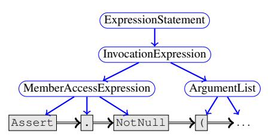

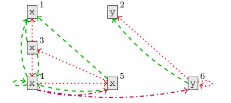

(a) 図[1,](#page-1-0) の2行目の簡易構文グラフで、青い丸みを帯びたボックスは構文ノード、黒い長方形のボックスは構文トークン、青いエッジは子エッジ、二重の黒いエッジはNextTokenエッジを表しています。

(b) (x <sup>1</sup>,y <sup>2</sup>) = Foo(); while (x <sup>3</sup> > 0) x <sup>4</sup> = x <sup>5</sup> + y 6 （わかりやすくするためにインデックスを追加）、赤い点線はLastUseエッジ、緑の破線はLastWriteエッジ、点破線の紫はComputedFromエッジを表している。

Figure 2: プログラム表現に使用されるグラフエッジの例。

上記の方程式によって定義されたダイナミクスは、一定回数のタイムステップにわたって繰り返されます。その後、最後のタイムステップの状態ベクトルをノード表現として使用します。[1](#page-3-0)

Program Graphs  
プログラムのソースコードをグラフとして表現し、異なるエッジの種類を用いて、さまざまなトークン間の構文的およびセマンティックな関係をモデル化します。プログラムグラフの中核となるのは抽象構文木（AST）であり、これは*構文ノード*（プログラミング言語の文法における非終端記号に対応）と*構文トークン*（終端記号に対応）で構成されます。構文ノードにはプログラムの文法における非終端記号の名前をラベル付けし、構文トークンにはそれが表す文字列をラベル付けします。ASTに従ってノード同士を接続するためにChildエッジを使用します。これは構文ノードの子に順序を与えるものではないため、構文トークン同士を、その後続トークンへと接続するNextTokenエッジも追加します。この例はFig. [2a.](#page-3-1) に示されています。

プログラム内の制御とデータの流れを捉えるために、変数に対応する構文トークンの異なる使用や更新を結ぶ追加のエッジを加えます。このようなトークン v について、DR(v) をその変数が最後に使用された可能性のある構文トークンの集合とします。この集合には複数のノードが含まれることがあります（例えば、条件分岐の両方の分岐で変数が使われた後に変数を使用する場合など）、またプログラムの中で後に続く構文トークンまで含まれることもあります（ループの場合）。同様に、D<sup>W</sup>(v) をその変数が最後に書き込まれた構文トークンの集合とします。これらを利用して、LastRead（あるいはLastWrite）エッジを v から DR(v)（あるいは D<sup>W</sup>(v)）のすべての要素に接続します。さらに、代入 v = expr を観測した場合、expr 内に現れるすべての変数トークンを ComputedFrom エッジで v に接続します。このようなセマンティックエッジの例を Fig.[2b.](#page-3-1) に示します。

同じ変数が使われているすべての箇所を連鎖させるために、LastLexicalUseエッジを使ってグラフを拡張します（これはデータフローとは独立しており、例えば if (...) { ... v ...} else { ... v ...} のような場合でも、vの両方の出現にリンクを張ります）。また、returnトークンをメソッド宣言にReturnsToエッジで接続します（これにより、その名前や型への「ショートカット」が作られます）。[Rice et al.](#page-9-19) [\(2017\)](#page-9-19) に着想を得て、メソッド呼び出しの引数を対応する仮引数とFormalArgNameエッジでつなげます。つまり、呼び出しFoo(bar)とメソッド宣言Foo(InputStream stream)を見た場合、barトークンとstreamトークンを結びつけます。最後に、変数に対応するすべてのトークンを、その変数を利用している囲みの条件式に対して、GuardedByおよびGuardedByNegationエッジで接続します。例えば、if (x > y) { ... x ...} else { ... y ...} の場合、xからx > yのASTノードにGuardedByエッジ（同様にyからはGuardedByNegationエッジ）を追加します。

最後に、すべての種類のエッジについて、それぞれの逆向きエッジ（隣接行列を転置することで）を導入し、エッジおよびエッジタイプの数を2倍にします。逆向きエッジは、GGNN全体で情報をより速く伝播させるのに役立ち、モデルの表現力を高めます。

<span id="page-3-0"></span><sup>1</sup>グラフ畳み込みネットワーク（GCN）[\(Kipf & Welling, 2016;](#page-9-13) [Schlichtkrull et al., 2017\)](#page-9-20)は、GGNNのより単純な代替となります。これは、状態更新のためにゲート付きリカレントユニットを使用せず、各GGNN層ごとの伝播ステップ数を1に固定した場合のGGNNの特殊例にあたります。その代わりに、複数の層が用いられます。我々の実験では、GCNはGGNNよりも汎化性能が劣りました。

変数型情報の活用  
私たちは静的型付け言語を前提とし、ソースコードがコンパイル可能であると仮定しています。したがって、各変数には（既知の）型 τ(v) が割り当てられています。これを活用するために、既知の型に対して学習可能な埋め込み関数 r(τ) を定義し、さらに未知または表現されていない型すべてに対して「UNKTYPE」も定義します。また、多くのオブジェクト指向言語で利用可能な豊富な型階層も活用します。そのために、変数の型 τ(v) をそのスーパータイプの集合、すなわち τ∗(v) = {τ : τ(v) implements type τ} ∪ {τ(v)} へとマッピングします。そして、変数 v の型表現 r∗(v) を {r(τ) : τ ∈ τ∗(v)} の要素ごとの最大値として計算します。ここで最大値を選択したのは、部分順序関係（型ラティスのような）を表現する自然なプーリング操作となるためです。τ∗(v) のすべての型を利用することで、共通のスーパータイプやインターフェイスを実装する未確認の型にも一般化が可能になります。例えば、List<K> には複数の具象型（例：List<int>, List<string>）があります。とはいえ、これらの型は共通のインターフェイス (IList) を実装していて、共通の特徴を持ちます。学習時には、τ∗(v) の非空部分集合をランダムに選択し、ラティス内のすべての既知の型が学習されることを保証します。これはドロップアウトのような機構として作用し、型ラティス内のすべての型に対して良い表現を学習できるようにします。

初期ノード表現 初期ノードの状態を計算するために、トークンのテキスト表現とその型に関する情報を組み合わせます。具体的には、トークンを表すノードの名前をキャメルケースやパスカルケースで区切ってサブトークン（_例_：classTypes は class と types の2つのサブトークンに分割されます）に分割します。そして、すべてのサブトークンの埋め込みの平均を取り、ノード名の埋め込みを取得します。最後に、先に説明した方法で計算された型の表現 r ∗ (v) をノード名の表現と連結し、それを線形層に通すことで、グラフ内の各ノードの初期表現を得ます。

Programs Graphs for VARNAMING  
与えられたプログラムと既存の変数 v について、前述のようにプログラムグラフを構築し、対応するすべての変数トークン内の変数名を特別な <SLOT> トークンに置き換えます。名前を予測するためには、前述した学習可能なトークン埋め込みと型埋め込みを連結して初期ノードラベルを計算し、GGNN伝播を8ステップ実行します[2](#page-4-0)。その後、すべての <SLOT> トークンの表現を平均して変数使用表現を計算します。この表現は、1層のGRUの初期状態として使用され、目標の名前をサブトークンの系列として予測します（たとえば、inputStreamBuffer という名前は [input, stream, buffer] という系列として扱います）。この graph2seq アーキテクチャは、最尤目的で学習します。[section 5](#page-5-0) では、正確な名前の予測精度やサブトークンの予測に対するF1スコアについて報告しています。

VARMISUSE のためのプログラムグラフ  
プログラムグラフで VARMISUSE を扱うためには、グラフを修正する必要があります。まず、使用する変数を予測したいスロット t に対して _コンテキスト表現_ c(t) を計算するには、t の位置に新しいノード v<SLOT> を挿入し、ここがこの時点で「穴」に相当するようにします。そして、選択される変数に依存しないすべての適用可能なエッジ（つまり、LastUse、LastWrite、LastLexicalUse、GuardedBy エッジ以外のすべて）を使って残りのグラフと接続します。次に、ターゲットスロットにおける各候補変数 v の _使用表現_ u(t, v) を計算するには、すべての Vt の v について「候補」ノード vt,v を挿入し、この変数がこのスロットで使用される場合に挿入される LastUse、LastWrite、LastLexicalUse エッジをグラフに追加して接続します。これらの各候補ノードは、スコープ内でのその変数の仮想的な配置を表現しています。

初期のノード表現に、候補ノード vt,v に対して 1 に設定された追加のビットを連結し、GGNN の伝播を 8 ステップ実行します[2](#page-4-0)。その後、コンテキスト表現と使用表現はそれぞれノードの最終状態、すなわち c(t) = h (v<SLOT>) および u(t, v) = h (vt,v) となります。最後に、その場所での正しい変数使用を、arg max<sup>v</sup> W[c(t), u(t, v)] として計算します。ここで W は、c(t) と u(t, v) の連結を利用する線形層です。学習にはマージン最大化目的を用います。

#### 4.1 IMPLEMENTATION

大規模で多様なグラフ集合にGGNNsを使用するには、さまざまな形状が存在するため、効率的なバッチ処理が難しく、ある程度のエンジニアリング作業が必要です。重要な点として、大規模なグラフは通常非常にスパースであるため、エッジを隣接リストとして表現するとメモリ消費を抑えるのに有利であることが多いです。私たちの場合、これはスパーステンソルを用いることで簡単に実装できます。

私たちは、ステップ数が少ないと良い結果が得られず、逆に伝播ステップを増やしても大きな効果は得られないことを確認しました。

表現方法により、現代のGPUの並列処理能力を効率的に活用できる大きなバッチサイズを可能にしています。もう一つの重要なポイントは、複数のグラフからなるバッチを多数の接続されていないコンポーネントを持つ1つの大きなグラフとして表現することです。これはノードの識別子を一意にするための適切な前処理を行うだけで実現できます。この処理によってバッチ構成がややCPU負荷の高いものになりますが、別スレッドでミニバッチを準備すると有用であることがわかりました。私たちのTensorFlow [\(Abadi et al., 2016\)](#page-8-6) 実装は、平均2,228（中央値936）ノード、8,350（中央値3,274）エッジを持ち、8回のGGNNアンローリング反復を行うグラフを用いて、NVidia GeForce GTX Titan X 1台で学習時に1秒あたり55グラフ、テスト時には219グラフまでスケールします。なお、全20種類のエッジタイプ（元々の10種のエッジタイプそれぞれに前向き・後向きがある）と、隠れ層のサイズ64で設定しています。GGNNにおけるエッジタイプの数は実行時間に比例して影響します。例えば、アブレーションスタディで最も一般的な2種類のエッジタイプ（NextToken, Child）のみを用いたGGNNでは、同じハイパーパラメータ設定で学習時に1秒あたり105グラフ、テスト時には419グラフを達成しています。GGNNの（汎用的な）実装は、より簡単なデモンストレーションタスクを用いて [https://github.com/Microsoft/](https://github.com/Microsoft/gated-graph-neural-network-samples) [gated-graph-neural-network-samples](https://github.com/Microsoft/gated-graph-neural-network-samples) で公開されています。

### <span id="page-5-0"></span>5 EVALUATION

Dataset  
VARMISUSEタスクのためのデータセットは、GitHub上のオープンソースC#プロジェクトから収集しました。プロジェクトの選定には、GitHubで最もスター数が多い非フォークのプロジェクトを選びました。その後、Roslynを使って完全に（簡単に）コンパイルできないプロジェクトは除外しました。これは、コードの正確な型情報（外部ライブラリに含まれる型も含む）を抽出するためにコンパイルが必要だからです。最終的なデータセットには、さまざまな分野（コンパイラ、データベースなど）の29プロジェクトが含まれており、非空行のコードが約290万行あります。詳細な表は[Appendix D.](#page-15-0)に示されています。

変数の誤用を検出するタスクのために、すべてのプロジェクトからデータを収集します。具体的には、すべての変数使用箇所を選び、変数宣言を除外したうえで、少なくとも1つ以上の型互換な代替変数がスコープ内に存在する場所を対象とします。このタスクでは、その位置にもともと存在していた正しい変数を推測することが求められます。したがって、設計上、少なくとも1つの型が正しい代替変数が必ず存在することになります。つまり、それを選択しても型チェック時にエラーは発生しません。私たちのテストデータセットでは、各スロットに平均して3.8個の型が正しい代替変数（中央値3、σ = 2.6）が存在します。

私たちのデータセットから、2つのプロジェクトを開発用セットとして選択しました。残りのプロジェクトの中から、UNSEENPROJTEST用に3つのプロジェクトを選び、全く未知の構造や型を持つプロジェクトでのテストを可能にしました。さらに残る23のプロジェクトは、トレイン／バリデーション／テストのセットに60-10-30の割合で分割し、ファイル単位（つまり、ひとつのソースファイルからの全ての例は同じセットに入る）で分けました。このようにして得られたテストセットをSEENPROJTESTと呼びます。

VARMISUSEのベースラインとして、2つの双方向RNNベースのベースラインを検討します。ローカルモデル（LOC）は、ターゲット位置の前後のトークンに対して2層の双方向GRUを単純に適用したものです。このベースラインでは、c(t)はRNNによって計算されたスロット表現に設定され、各変数の使用コンテキストu(t, v)は、その変数の名前と型の埋め込みであり、GGNNの初期ノードラベルと同じ方法で計算されます。このベースラインにより、このタスクにおいて使用コンテキスト情報がどれほど重要かを評価できます。フラットデータフローモデル（AVGBIRNN）は、LOCを拡張したもので、使用表現u(t, v)は、各使用箇所の前後のトークンに対してさらに2層の双方向RNNを適用し、変数トークンvで得られた表現を平均化して計算します。ローカルコンテキストc(t)はLOCと同一です。AVGBIRNNは、すべての変数使用箇所にわたる平均を取ることで長距離依存に対応し、構造的情報もある程度考慮する、より強力なベースラインです。両モデルとも、c(t)<sup>T</sup>u(t, v)が最大となる変数を選択します。

VARNAMING については、LOC を AVGLBL に置き換えます。AVGLBL は、それぞれの変数使用箇所に対して左側4つ、右側4つのコンテキストトークンを用いた対数バイリニアモデルを使用し、そのコンテキスト表現を平均化します（これは [Allamanis et al.](#page-8-4) [\(2015\)](#page-8-4) のモデルに相当します）。また、VARNAMING で AVGBIRNN もテストし、これは本質的に対数バイリニアのコンテキストモデルを双方向RNNに置き換えたものです。

|              | SEENPROJTEST |        |          |       | UNSEENPROJTEST |        |          |       |
| ------------ | ------------ | ------ | -------- | ----- | -------------- | ------ | -------- | ----- |
|              | LOC          | AVGLBL | AVGBIRNN | GGNN  | LOC            | AVGLBL | AVGBIRNN | GGNN  |
| VARMISUSE    |              |        |          |       |                |        |          |       |
| Accuracy (%) | 50.0         | —      | 73.7     | 85.5  | 28.9           | —      | 60.2     | 78.2  |
| PR AUC       | 0.788        | —      | 0.941    | 0.980 | 0.611          | —      | 0.895    | 0.958 |
| VARNAMING    |              |        |          |       |                |        |          |       |
| Accuracy (%) | —            | 36.1   | 42.9     | 53.6  | —              | 22.7   | 23.4     | 44.0  |
| F1 (%)       | —            | 44.0   | 50.1     | 65.8  | —              | 30.6   | 32.0     | 62.0  |

<span id="page-6-1"></span>Table 1: モデルの評価。SEENPROJTESTはトレーニングセットにファイルが含まれているプロジェクトのテストセットを指し、UNSEENPROJTESTはトレーニングデータにファイルがまったく含まれていないプロジェクトを指します。結果は2回の実行の平均です。

<span id="page-6-3"></span>

| Table 2: GGNNモデルにおけるSEENPROJTESTでの2つのタスクに関するアブレーションスタディ。 |     |     |     |     |
| -------------------------------------------------------------------------------------- | --- | --- | --- | --- |
| -------------------------------------------------------------------------------        | --  | --  | --  | --  |

|                                                 | Accuracy (%)                                               |           |      |     |
| ----------------------------------------------- | ---------------------------------------------------------- | --------- | ---- | --- | --- |
| Ablation Description                            | VARMISUSE                                                  | VARNAMING |      |     |
| Standard Model (reported in Table 1)            | 標準モデル（表1に記載）                                    | 85.5      | 53.6 |     |     |
| Only NextToken, Child, LastUse, LastWrite edges | NextToken, Child, LastUse, LastWriteのエッジのみ利用       | 80.6      | 31.2 |     |     |
| Only semantic edges (all but NextToken, Child)  | セマンティックエッジのみ利用（NextToken, Child以外すべて） | 78.4      | 52.9 |     |     |
| Only syntax edges (NextToken, Child)            | シンタックスエッジのみ利用（NextToken, Child）             | 55.3      | 34.3 |     |     |
| Node Labels: Tokens instead of subtokens        | ノードラベル: サブトークンの代わりにトークンを使用         | 85.6      | 34.5 |     |     |
| Node Labels: Disabled                           | ノードラベル: 無効化                                       | 84.3      | 31.8 |     |     |

## 5.1 QUANTITATIVE EVALUATION

[Table 1](#page-6-1)は、両タスクにおける各モデルの評価結果を示しています。[4](#page-6-2) LOCはほとんど情報を捉えていないため、比較的良くない成績となっています。AVGLBLとAVGBIRNNは、多くの変数使用箇所から情報を取得するものの、この問題の持つ豊かな構造を明示的にエンコードしていないため、GGNNと比べて大きく差をつけられています。特にVARMISUSEではその差が顕著で、コードの構造や意味論がこのタスク設定においてはるかに重要になるためです。

新しいプロジェクトへの一般化  
異なるドメインを持つ多様なソースコードプロジェクトにまたがって一般化することは、機械学習における重要な課題です。私たちは、トレーニングセットにファイルが含まれていないプロジェクトから成るUNSEENPROJTESTセットを用いて、評価を繰り返しました。[Table 1](#page-6-1)の右側は、私たちのモデルがSEENPROJTESTと比較してわずかに低いものの、依然として良好なパフォーマンスを達成していることを示しています。これは、UNSEENPROJTESTでは型ラティスがほとんど未知であるため、予想される結果です。

私たちは、訓練済みモデルを未知のプロジェクト（つまり、ドメイン）に適用する際の主な問題は、その型階層が不明であり、使用されている語彙（例えば変数名、メソッド名、クラス名など）が大きく異なる可能性があるという点にあると考えています。

Ablation Study  
私たちのモデルにおけるいくつかの設計選択の効果を調べるために、追加の実験を実施し、その結果を[Table 2.](#page-6-3)に示します。まず、プログラムグラフで使用するエッジを変更しました。モデルを構文情報のみに制限すると、両方のタスクでパフォーマンスに大きな影響があることがわかりました。一方、意味的エッジのみに制限した場合は、主にVARMISUSEの性能に影響を与えるようです。同様に、ComputedFrom、FormalArgName、およびReturnsToエッジはVARMISUSEでわずかな向上をもたらしますが、VARNAMINGの性能は大きく向上します。ノードラベル表現に関する実験からも分かるように、構文ノードやトークン名はVARMISUSEにはほとんど影響を与えませんが、VARNAMINGには大きな影響を及ぼすことが明らかです。

# 5.2 QUALITATIVE EVALUATION

[Figure 3](#page-7-1) は、GGNN がサンプルテストスニペットに対して行った予測を示しています。このスニペットは、ルートフォルダに徐々に降りていくことでグローバルディレクティブファイルを再帰的に検索しています。正しい変数の使い方について推論することは、人間にとっても難しいですが、GGNN は変数を正しく予測しています。

<span id="page-6-0"></span><sup>3</sup><http://roslyn.io>

<span id="page-6-2"></span><sup>4</sup> また、セクション [A](#page-10-0) では、VARMISUSEタスクにおけるGGNNモデルのROC曲線と適合率-再現率曲線も示しています。

<span id="page-7-1"></span>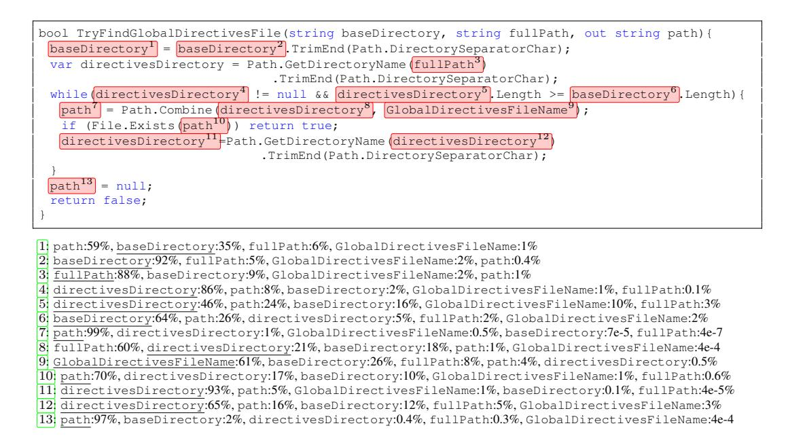

Figure 3: ServiceStackプロジェクトのSEENPROJTESTセットのスニペット内のスロットに対するVARMISUSEの予測。追加のビジュアライゼーションは[Appendix B.](#page-10-1)で見ることができる。下線が引かれているトークンが正しいトークンである。モデルは各スロットで複数の文字列変数の中から選ぶ必要があり、それらはすべて何らかのパスを表している。GGNNは、変数同士が複雑にやり取りされる状況を考慮し、13個のスロットのうち11個で正しい変数の使用を正確に予測している。

```
public ArraySegment<byte> ReadBytes(int length){
   int size = Math.Min(length, _len - _pos);
   var buffer = EnsureTempBuffer( length );
   var used = Read(buffer, 0, size);
```

Figure 4: RavenDB オープンソースプロジェクトで発見されたバグ（黄色）。このコードは、バッファのサイズが size ではなく length であることを不必要に保証している（ここでは、私たちのモデルが正しい変数として size を予測している）。

2か所（スロット1と8）を除くすべての場所での使用例です。ソフトウェアエンジニアがコードを書いているとき、彼女が1つの変数を他の変数の代わりに誤って使用してしまう可能性は十分に考えられます。すべての変数が文字列型であるため、型エラーは発生しません。Fig. [3](#page-7-1) の確率が示すように、多くの潜在的な変数の誤用はモデルによって検出され、ソフトウェアエンジニアにとって有益な警告が得られます。コメント付きの追加のサンプルは [Appendix B.](#page-10-1) にあります。

さらに、[Appendix C](#page-14-0) には、GGNN の使用表現 u(t, v) のコサイン類似度によって計算された、類似した表現を持つコードスニペットのペアの例が示されています。読者は、ネットワークが意味的に似た変数の使用方法をまとめて学習していることに気付くことができます。たとえば、変数を使用する前に null をチェックする場合、さまざまなコードセグメント間で類似した分散表現が得られることがあります（[Appendix C](#page-14-0) のサンプル 1）。

#### <span id="page-7-0"></span>5.3 DISCOVERED VARIABLE MISUSE BUGS

私たちは、VARMISUSEモデルを用いて、RavenDB（ドキュメントデータベース）およびRoslyn（MicrosoftのC#コンパイラフレームワーク）におけるバグの発生が疑われる箇所を特定しました。そのために、両プロジェクトでモデルが最も高い確信をもって正解とは異なる変数を選択した上位500箇所のサンプルを手作業で調査し、それぞれのプロジェクトで3件ずつバグを発見しました。

Figs. [1,](#page-1-0)[4](#page-7-2)[,5](#page-8-7) は、RavenDBで発見された問題を示しています。Fig. [1](#page-1-0) のバグはおそらくコピーペーストによって引き起こされたものであり、従来の手法では簡単に検出することができません。コンパイラはこのような問題について警告を*出しません*。

```
if (IsValidBackup(backupFilename) == false) {
 output("Error:"+ backupLocation +" doesn't look like a valid backup");
 throw new InvalidOperationException(
     backupLocation + " doesn't look like a valid backup");
```

Figure 5: RavenDBオープンソースプロジェクトで発見されたバグ（黄色）。backupFilenameがIsValidBackupによって無効と判定されているにもかかわらず、ユーザーにはbackupLocationが無効であると通知されている。

未使用の変数（first は使われているため）は問題ではなく、また通常、誰も別のテストをテストするようなテストを書くことはありません。図 [4](#page-7-2) では、重大ではないものの、メモリ消費量の増加につながる可能性のある問題を示しています。図 [5](#page-8-7) は、有益ではないエラーメッセージから発生する別の問題を示しています。私たちはさらに3件のバグを[Roslyn](http://roslyn.io) の開発者に個別に報告し、その間にこれらの問題は修正されました（cf. <https://github.com/dotnet/roslyn/pull/23437>）。報告したバグの一つは、特定の Roslyn 機能を使用した際に Visual Studio がクラッシュする原因となる可能性がありました。

広く公開され、テストされたコードでこれらの問題が見つかったことは、私たちのモデルがソフトウェア開発プロセスにおいてクラシックなプログラム解析ツールを補完するものとして有用である可能性を示唆しています。たとえば、ある使用例としては、コードレビューの過程でVARMISUSEモデルが異常と特定した箇所に注目を促したり、テストやコストのかかるコード解析作業の優先順位を決める際の指針として活用したりすることが挙げられます。

### 6 DISCUSSION & CONCLUSIONS

ソースコードは、プログラミング言語研究など他の分野では十分に理解され研究されてきましたが、ディープラーニングにとっては比較的新しい領域です。ソースコードには、テキストや知覚データとは異なる新たな可能性があり、（局所的な）意味が明確に定義されている上に、よく知られた効率的なプログラム解析を用いて豊富な付加情報を抽出することができます。一方で、この豊富な構造化情報を統合することは興味深い課題でもあります。私たちのVARMISUSEタスクは、コード補完のようなより単純な課題を超えて、こうした可能性を明らかにします。これは、型システムに標準的に含まれる情報を確率的に洗練することを要求するため、ソースコードの「意味」を学習するという本質的な課題への最初の代替指標と考えます。

### REFERENCES

- <span id="page-8-6"></span>Tensorflowは、異種分散システム上での大規模機械学習のためのものである。_arXiv preprint arXiv:1603.04467_, 2016.
- <span id="page-8-2"></span>Miltiadis Allamanis、Earl T Barr、Christian Bird、およびCharles Sutton。「Learning natural coding conventions」。_Foundations of Software Engineering (FSE)_、2014年。
- <span id="page-8-4"></span>Miltiadis Allamanis、Earl T Barr、Christian Bird、Charles Suttonによる論文。正確なメソッド名やクラス名を提案する手法について述べています。_Foundations of Software Engineering (FSE)_、2015年発表です。
- <span id="page-8-1"></span>Miltiadis Allamanis、Hao Peng、Charles Suttonによる「A convolutional attention network for extreme summarization of source code」。*International Conference on Machine Learning (ICML)*にて、2016年、pp. 2091–2100。
- <span id="page-8-0"></span>Miltiadis Allamanis、Earl T Barr、Premkumar Devanbu、Charles Sutton。これは、ビッグコードおよび自然性のための機械学習に関するサーベイです。_arXiv preprint arXiv:1709.06182_, 2017年。
- <span id="page-8-5"></span>Earl T Barr、Mark Harman、Yue Jia、Alexandru Marginean、およびJustyna Petke。自動ソフトウェア移植。_International Symposium on Software Testing and Analysis (ISSTA)_、2015年。
- <span id="page-8-8"></span>Al Bessey、Ken Block、Ben Chelf、Andy Chou、Bryan Fulton、Seth Hallem、Charles Henri-Gros、Asya Kamsky、Scott McPeak、および Dawson Engler。数十億行ものコードを経て：現実世界でバグを見つけるための静的解析の利用。_Communications of the ACM_, 53(2):66–75, 2010年。
- <span id="page-8-3"></span>Avishkar Bhoopchand、Tim Rocktäschel、Earl Barr、Sebastian Riedel。スパースポインタネットワークを用いたPythonコードサジェスチョンの学習。_arXiv preprint arXiv:1611.08307_, 2016年。
- <span id="page-9-8"></span>Benjamin Bichsel、Veselin Raychev、Petar Tsankov、および Martin Vechev による論文です。Androidアプリケーションの統計的難読化解除について扱っています。_Conference on Computer and Communications Security (CCS)_、2016 年に発表されました。
- <span id="page-9-3"></span>Pavol Bielik、Veselin Raychev、およびMartin Vechev。「PHOG: probabilistic model for code」。_International Conference on Machine Learning (ICML)_、2016年。
- <span id="page-9-18"></span>Kyunghyun Cho, Bart van Merriënboer, Dzmitry Bahdanau, and Yoshua Bengio. ニューラル機械翻訳の特性について: エンコーダ–デコーダアプローチ。_Syntax, Semantics and Structure in Statistical Translation_, 2014.
- <span id="page-9-12"></span>Michaël Defferrard、Xavier Bresson、Pierre Vandergheynstによる「Convolutional neural networks on graphs with fast localized spectral filtering」。*Neural Information Processing Systems (NIPS)*にて、pp. 3844–3852、2016年に発表されました。
- <span id="page-9-14"></span>Justin Gilmer、Samuel S. Schoenholz、Patrick F. Riley、Oriol Vinyals、George E. Dahlによる論文「Neural message passing for quantum chemistry」。_arXiv preprint arXiv:1704.01212_, 2017年。
- <span id="page-9-10"></span>Marco Gori、Gabriele Monfardini、Franco Scarselliによる論文「A new model for learning in graph domains」は、*IEEE International Joint Conference Neural Networks (IJCNN)*において発表されました。IEEE、2005年。
- <span id="page-9-15"></span>Aditya GroverおよびJure Leskovecによる論文「node2vec: Scalable feature learning for networks」は、*International Conference on Knowledge Discovery and Data Mining (SIGKDD)*で発表され、ACMより2016年にpp. 855–864で出版されました。
- <span id="page-9-0"></span>Abram Hindle、Earl T Barr、Zhendong Su、Mark Gabel、Premkumar Devanbuによる論文です。ソフトウェアの自然さについて述べています。_International Conference on Software Engineering (ICSE)_、2012年に発表されました。
- <span id="page-9-13"></span>Thomas N Kipf と Max Welling による論文「Semi-supervised classification with graph convolutional networks」は、_arXiv preprint arXiv:1609.02907_, 2016 に掲載されています。
- <span id="page-9-11"></span>Yujia Li、Daniel Tarlow、Marc Brockschmidt、Richard Zemelによる「Gated graph sequence neural networks」は、_International Conference on Learning Representations (ICLR)_、2015年に発表されました。
- <span id="page-9-2"></span>Chris J Maddison と Daniel Tarlow による「Structured generative models of natural source code」。_International Conference on Machine Learning (ICML)_、2014年。
- <span id="page-9-16"></span>Diego Marcheggiani と Ivan Titov による "Encoding sentences with graph convolutional networks for semantic role labeling" は、_ACL_ 2017 で発表されました。
- <span id="page-9-5"></span>Tomas Mikolov、Ilya Sutskever、Kai Chen、Greg S Corrado、Jeff Deanによる「Distributed representations of words and phrases and their compositionality」。_Neural Information Processing Systems (NIPS)_、2013年に掲載された論文です。
- <span id="page-9-6"></span>Jeffrey Pennington, Richard Socher, and Christopher D Manning. GloVe: 単語表現のためのグローバルベクトル。_EMNLP_、2014年。
- <span id="page-9-1"></span>Veselin Raychev、Martin Vechev、Eran Yahavによる「Code completion with statistical language models」。_Programming Languages Design and Implementation (PLDI)_ にて、2014年、pp. 419–428。
- <span id="page-9-4"></span>Veselin Raychev、Martin Vechev、およびAndreas Krauseによる "Predicting program properties from Big Code"。_Principles of Programming Languages (POPL)_、2015年。
- <span id="page-9-7"></span>Veselin Raychev、Pavol Bielik、Martin Vechevによる論文「Probabilistic model for code with decision trees」は、_Object-Oriented Programming, Systems, Languages, and Applications (OOPSLA)_、2016年で発表されました。
- <span id="page-9-19"></span>Andrew Rice、Edward Aftandilian、Ciera Jaspan、Emily Johnston、Michael Pradel、Yulissa Arroyo-Paredesによる論文。引数選択の欠陥を検出する手法について述べられている。_Proceedings of the ACM on Programming Languages_、1(OOPSLA):104、2017年。
- <span id="page-9-20"></span>Michael Schlichtkrull、Thomas N. Kipf、Peter Bloem、Rianne van den Berg、Ivan Titov、Max Wellingによる論文です。グラフ畳み込みネットワークを用いて関係データをモデル化する手法について述べられています。_arXiv preprint arXiv:1703.06103_, 2017年。
- <span id="page-9-9"></span>Armando Solar-Lezama. _Program synthesis by sketching_. University of California, Berkeley, 2008.
- <span id="page-9-17"></span>Mingzhe Wang、Yihe Tang、Jian Wang、およびJia Dengによる論文。「Premise selection for theorem proving by deep graph embedding」。この論文は*Advances in Neural Information Processing Systems*に掲載されており、ページ2783–2793、2017年。

<span id="page-10-2"></span>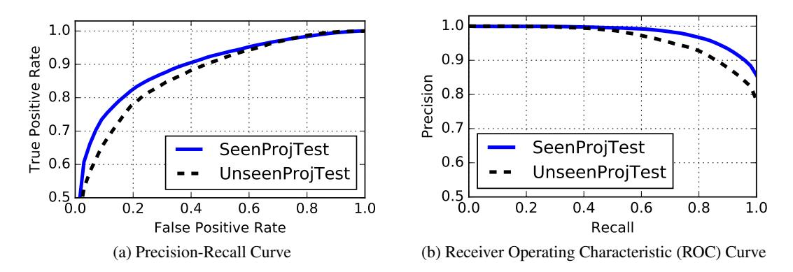

Figure 6: VARMISUSEにおけるGGNNモデルのPrecision-Recall曲線とROC曲線。なお、y軸は50%から始まっていることに注意してください。

Table 3: VARMISUSE における型が正しく、スコープ内にある候補変数の数ごとの GGNN モデルの性能。ここでは、サブトークンを使用した完全な GGNN モデルの性能を算出している。

| # of candidates                | 2    | 3    | 4    | 5    | 6 or 7 | 8+   |
| ------------------------------ | ---- | ---- | ---- | ---- | ------ | ---- |
| Accuracy on SEENPROJTEST (%)   | 91.6 | 84.5 | 81.8 | 78.6 | 75.1   | 77.5 |
| Accuracy on UNSEENPROJTEST (%) | 85.7 | 77.1 | 75.7 | 69.0 | 71.5   | 62.4 |

### <span id="page-10-0"></span>A PERFORMANCE CURVES

[Figure 6](#page-10-2) は、GGNNモデルのROC曲線と適合率-再現率曲線を示しています。読者がご覧の通り、偽陽性率を10%に設定すると、SEENPROJTESTでは真陽性率[5](#page-10-3)が73%、unseen testでは69%となります。これは、このモデルが高い精度設定でも実用的に使用できることを示唆しています。

## <span id="page-10-1"></span>B VARMISUSE PREDICTION SAMPLES

以下に、SEENPROJTESTプロジェクトからのサンプルと、モデルの性能に関するコメントを示します。コードのコメントや書式は、組版の都合により変更されている場合があります。正解の選択肢は下線で示しています。

### Sample 1

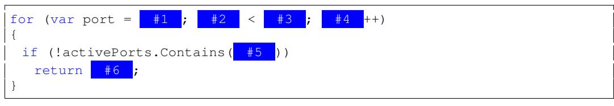

| #1   | 始点: 97%            |     | 終点: 3%       |     |
| ---- | -------------------- | --- | -------------- | --- |
| ---- | -------------------- | --  | -------------- | --  |

#2 ポート：100%、開始時：0%、終了時：0%

#3 endingAt: 100%、startingFrom: 0%、port: 0%

#4 ポート：100%、開始時：0%、終了時：0%

- #5ポート：100%、開始時：0%、終了時：0%
- #6 port: 100%、開始時: 0%、終了時: 0%

. モデルはループ内のすべての変数を正確に予測しています。

業界では10％の偽陽性率が広く受け入れられており、30％が最大許容範囲とされています。

Sample 2

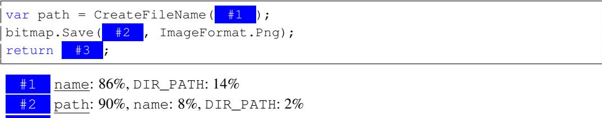

#3 パス: 76%、名前: 16%、DIR_PATH: 8%

. 文字列変数の意味的な役割が正しく推論されており、混乱はありません。

Sample 3

```
[global::System.Diagnostics.DebuggerNonUserCodeAttribute]
public void MergeFrom(pb::CodedInputStream input) {
 uint tag;
 while ((tag = input.ReadTag()) != 0) {
   switch(tag) {
    default:
      input.SkipLastField();
      break;
    case 10: {
       #1 .AddEntriesFrom(input, _repeated_payload_codec);
      break;
    }
   }
 }
}
```

#1 ペイロード: 66%、payload\_: 44%

. モデルはしばしばエイリアス、つまり同じメモリ上の場所を指す変数によって混乱します。この例では、どちらの選択肢でも同じ振る舞いになりました。

Sample 4

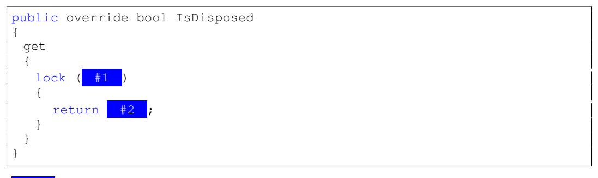

#1 \_gate: 99%、\_observers: 1% #2 \_isDisposed: 90%、\_isStopped: 8%、HasObservers: 2%

ReturnsToエッジは、他の方法では予測が不可能だった変数を予測するのに役立ちます。

#### Sample 5

| /// <summary><br/>/// 例外が発生したことを、登録されているすべてのオブザーバーに通知します。<br/>/// </summary>          |
| ------------------------------------------------------------------------------------------------------------------------ |
| /// <param name="error"/> すべてのオブザーバーに送信する例外です。<br>public override void OnError(Exception error)<br>{ |
| if (<br>#1<br>== null)<br>throw new ArgumentNullException(nameof(<br>#2<br>));                                           |
|                                                                                                                          |
| var os = default(IObserver <t>[]);</t>                                                                                   |
| lock (<br>#3<br>)                                                                                                        |
| {<br>CheckDisposed();                                                                                                    |
| if (!<br>#4<br>)<br>{                                                                                                    |
| os = \_observers.Data;<br>\_observers = ImmutableList <iobserver<t>&gt;.Empty;</iobserver<t>                             |
| #5<br>= true;                                                                                                            |
| #6<br>=<br>#7<br>;                                                                                                       |
| }<br>}                                                                                                                   |
| if (os != null)                                                                                                          |
| {<br>foreach (var o in os)                                                                                               |
| {                                                                                                                        |
| o.OnError(<br>#8<br>);                                                                                                   |
| }<br>}                                                                                                                   |
| }                                                                                                                        |
|                                                                                                                          |

| エラー: 93%、<br>\_例外: 7%                                |
| ---------------------------------------------------------- |
| エラー: 98%、<br>\_例外: 2%                                |
| *ゲート: 100%、<br>*オブザーバー: 0%                       |
| *停止済み: 86%、<br>*破棄済み: 13%、<br>オブザーバー有: 1% |
| *停止済み: 91%、<br>*破棄済み: 9%、<br>オブザーバー有: 0%  |
| \_例外: 100%、<br>エラー: 0%                               |
| エラー: 98%、<br>\_例外: 2%                                |
| \_例外: 99%、<br>エラー: 1%                                |
|                                                            |

. このモデルは、最後のスロット以外のすべてのスロットから正しい変数を予測します。最後の変数について推論するには、クラスファイル全体にわたるコードの手続き間理解が必要となります。

#4 プローブ：98%、削除要求：2%

#### Sample 6

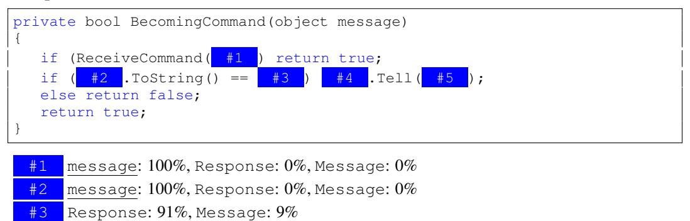

#5 Response: 98%、Message: 2%。このモデルは、スロット#3の使用例を除き、すべての使い方を正しく予測しています。このコードの断片について推論するには、コードの意図に関するさらなるセマンティック情報が必要です。

## Sample 7

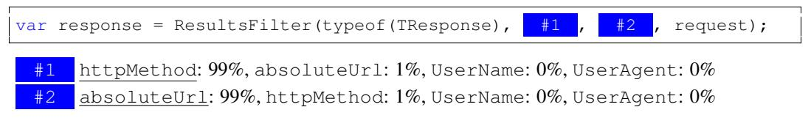

モデルは、正式なパラメータ名と一致させることで、正しい文字列パラメータを選択することができます。

#### Sample 8

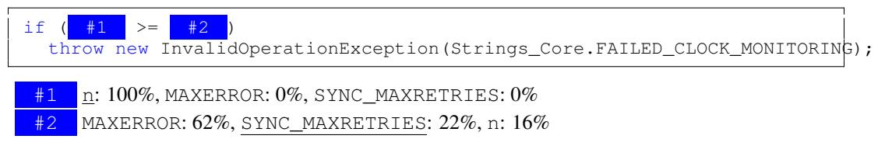

モデルが条件文について推論するのは難しく、特にスロット#2のような珍しい定数が含まれている場合はなおさらです。

## <span id="page-14-0"></span>C NEAREST NEIGHBOR OF GGNN USAGE REPRESENTATIONS

ここでは、学習された表現 u(t, v) のコサイン類似度に基づいて、最も近い隣接ペアを示します。各スロット t はダークブルーで表示され、v のすべての使用箇所は黄色（_例えば_ variableName ）で示されています。これは、良い例と悪い例の両方を示した手作業で選んだ例のセットです。それぞれのペアの後には、簡単な説明が続きます。

#### Sample 1

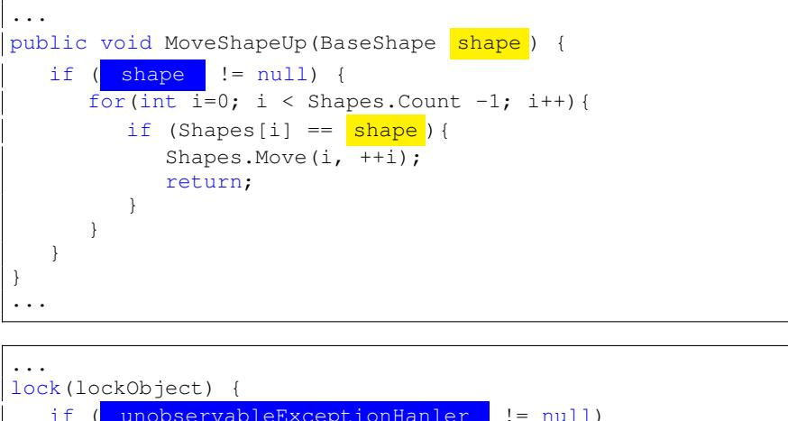

```
if ( unobservableExceptionHanler != null)
      return false;
   unobservableExceptionHanler = handler;
}
...
```

nullチェックが行われるスロットは、似たような表現になります。

#### Sample 2

```
...
public IActorRef ResolveActorRef(ActorPath actorPath ){
 if(HasAddress( actorPath .Address))
   return _local.ResolveActorRef(RootGuardian, actorPath .ElementsWithUid);
 ...
...
```

```
...
ActorPath actorPath ;
if (TryParseCachedPath(path, out actorPath)) {
   if (HasAddress( actorPath .Address)){
      if ( actorPath .ToStringWithoutAddress().Equals("/"))
         return RootGuarding;
      ...
   }
   ...
}
...
```

. 類似のAPIプロトコルに従うスロットは、類似した表現を持ちます。関数 HasAddress はローカル関数であり、テストセット内でのみ確認できます。

#### Sample 3

```
...
foreach(var filter in configuration.Filters){
   GlobalJobFilter.Filters.Add( filter );
}
...
```

```
...
public void Count_ReturnsNumberOfElements(){
   _collection.Add( _filterInstance );
   Assert.Equal(1, _collection.Count);
}
...
```

コレクションのようなオブジェクトに要素を追加すると、同様の表現が得られます。

### <span id="page-15-0"></span>D DATASET

収集されたデータセットとその特性は[Table 4.](#page-15-1)に示されています。プロジェクトの集合としての完全なデータセットおよびその解析済みJSONは、オンラインで公開される予定です。

<span id="page-15-1"></span>Table 4: 本データセット内のプロジェクト一覧。アルファベット順に並んでいます。kLOCはC#コードの空でない行数を示します。Devと記載されたプロジェクトは開発用セットとして使用されました。†が付いたプロジェクトはテスト専用データセットに含まれています。それ以外のプロジェクトは、トレイン・バリデーション・テストに分割されました。データセット全体で約2.9MLOCが含まれています。

| Name              | Git SHA  | kLOCs | Slots | Vars  | Description                              |     |
| ----------------- | -------- | ----- | ----- | ----- | ---------------------------------------- | --- |
| Akka.NET          | 719335a1 | 240   | 51.3k | 51.2k | アクターベースの並列・分散フレームワーク |     |
|                   |          |       |       |       | フレームワーク                           |     |
| AutoMapper        | 2ca7c2b5 | 46    | 3.7k  | 10.7k | オブジェクト間マッピングライブラリ       |     |
| BenchmarkDotNet   | 1670ca34 | 28    | 5.1k  | 6.1k  | ベンチマーク計測ライブラリ               |     |
| BotBuilder        | 190117c3 | 44    | 6.4k  | 8.7k  | ボット構築用SDK                          |     |
| choco             | 93985688 | 36    | 3.8k  | 5.2k  | Windows用パッケージマネージャ            |     |
| commandline†      | 09677b16 | 11    | 1.1k  | 2.3k  | コマンドラインパーサ                     |     |
| CommonMark.NETDev | f3d54530 | 14    | 2.6k  | 1.4k  | Markdownパーサ                           |     |
| Dapper            | 931c700d | 18    | 3.3k  | 4.7k  | オブジェクトマッパーライブラリ           |     |
| EntityFramework   | fa0b7ec8 | 263   | 33.4k | 39.3k | オブジェクト・リレーショナルマッパー     |     |
| Hangfire          | ffc4912f | 33    | 3.6k  | 6.1k  | バックグラウンドジョブ処理ライブラリ     |     |
| Humanizer†        | cc11a77e | 27    | 2.4k  | 4.4k  | 文字列操作・書式化ライブラリ             |     |
| Lean†             | f574bfd7 | 190   | 26.4k | 28.3k | アルゴリズム取引エンジン                 |     |
| Nancy             | 72e1f614 | 70    | 7.5k  | 15.7  | HTTPサービスフレームワーク               |     |
| Newtonsoft.Json   | 6057d9b8 | 123   | 14.9k | 16.1k | JSONライブラリ                           |     |
| Ninject           | 7006297f | 13    | 0.7k  | 2.1k  | コードインジェクション用ライブラリ       |     |
| NLog              | 643e326a | 75    | 8.3k  | 11.0k | ロギングライブラリ                       |     |
| Opserver          | 51b032e7 | 24    | 3.7k  | 4.5k  | 監視システム                             |     |
| OptiKey           | 7d35c718 | 34    | 6.1k  | 3.9k  | 支援用オンスクリーンキーボード           |     |
| orleans           | e0d6a150 | 300   | 30.7k | 35.6k | 分散仮想アクターモデル                   |     |
| Polly             | 0afdbc32 | 32    | 3.8k  | 9.1k  | レジリエンス＆一時的障害対策ライブラリ   |     |
|                   |          |       |       |       | ライブラリ                               |     |
| quartznet         | b33e6f86 | 49    | 9.6k  | 9.8k  | スケジューラー                           |     |
| ravendbDev        | 55230922 | 647   | 78.0k | 82.7k | ドキュメントデータベース                 |     |
| RestSharp         | 70de357b | 20    | 4.0k  | 4.5k  | REST・HTTP APIクライアントライブラリ     |     |
| Rx.NET            | 2d146fe5 | 180   | 14.0k | 21.9k | リアクティブ言語拡張                     |     |
| scriptcs          | f3cc8bcb | 18    | 2.7k  | 4.3k  | C#用テキストエディタ                     |     |
| ServiceStack      | 6d59da75 | 231   | 38.0k | 46.2k | Webフレームワーク                        |     |
| ShareX            | 718dd711 | 125   | 22.3k | 18.1k | 共有アプリケーション                     |     |
| SignalR           | fa88089e | 53    | 6.5k  | 10.5k | プッシュ通知フレームワーク               |     |
| Wox               | cdaf6272 | 13    | 2.0k  | 2.1k  | アプリケーションランチャー               |     |

本研究のために、GPLライセンスのプロジェクトを除く大部分のデータを公開しました。データは <https://aka.ms/iclr18-prog-graphs-dataset> で入手できます。一部のプロジェクトをデータから除外しているため、以下に公開データセットにおける結果（3回の実行で平均した値）を報告します。

|                | Accuracy (%) | PR AUC |
| -------------- | ------------ | ------ |
| SEENPROJTEST   | 84.0         | 0.976  |
| UNSEENPROJTEST | 74.1         | 0.934  |
