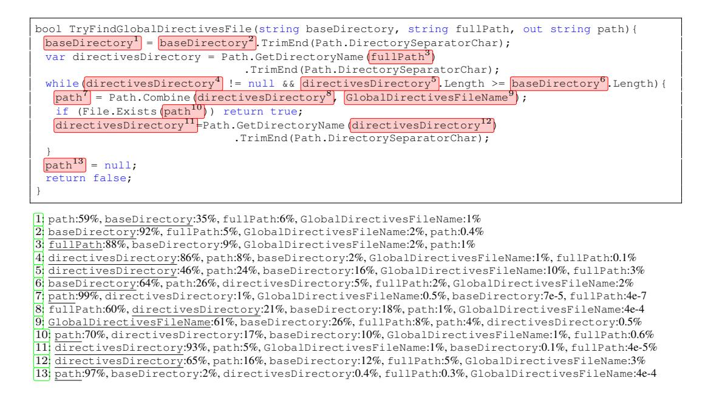
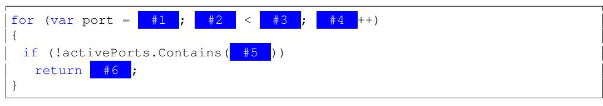
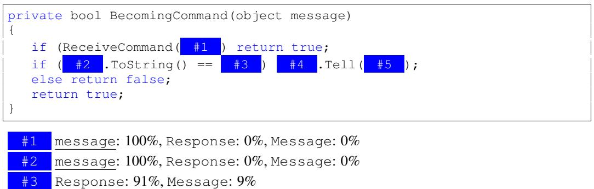

# LEARNING TO REPRESENT PROGRAMS WITH GRAPHS

Miltiadis Allamanis Microsoft Research Cambridge, UK miallama@microsoft.com Marc Brockschmidt Microsoft Research Cambridge, UK mabrocks@microsoft.com

Mahmoud Khademi<sup>∗</sup>

サイモンフレーザー大学 バーナビー、ブリティッシュコロンビア州、カナダ mkhademi@sfu.ca

### ABSTRACT

ソースコード（*つまり*、形式言語）に関する学習タスクは近年注目されていますが、これまでの多くの研究は自然言語の手法を転用し、コード特有の既知のセマンティクスがもたらす独自の機会を十分に活かしていません。たとえば、同じ変数や関数が離れた場所で使われることによって生じる長距離の依存関係は、しばしば考慮されていません。私たちは、コードの構文的およびセマンティックな構造の両方をグラフで表現し、グラフベースの深層学習手法を用いてプログラム構造に基づく推論を学習することを提案します。

本研究では、ソースコードからグラフを構築する方法と、Gated Graph Neural Networks の学習をそのような大規模グラフにスケールさせる方法について紹介します。私たちは、2つのタスクで本手法を評価しました。一つは VARNAMING で、ネットワークが変数の使われ方からその名前を予測しようとするものです。もう一つは VARMISUSE で、ネットワークが特定のプログラム位置でどの変数を使うべきかを推論できるように学習します。より構造化されていないプログラム表現を用いる手法と比較した結果、既知の構造をモデル化することの利点が示され、私たちのモデルが意味のある名前を推測したり、多くの場合で VARMISUSE タスクを解決できることが示唆されました。さらに、私たちのテストにより、VARMISUSE は成熟したオープンソースプロジェクト内の多くのバグを特定できることも分かりました。

### 1 INTRODUCTION

大規模なソースコードリポジトリと、スケーラブルな機械学習手法の登場により、既存のソースコードから一般化してソフトウェアエンジニアを支援する「ビッグコード」、すなわちほぼ教師なしの手法という考えが自然に生まれます [\(Allamanis et al., 2017\)](#page-8-0)。現在のソースコード向け深層学習モデルは、その浅いテキスト構造、つまりトークン列として [\(Hindle](#page-9-0) [et al., 2012;](#page-9-0) [Raychev et al., 2014;](#page-9-1) [Allamanis et al., 2016\)](#page-8-1)、構文木として [\(Maddison & Tarlow, 2014;](#page-9-2) [Bielik et al., 2016\)](#page-9-3)、あるいは変数間のフラットな依存ネットワークとして [\(Raychev et al., 2015\)](#page-9-4) ソースコードを捉えています。こうしたモデルは、ソースコードの豊かで厳密に定義されたセマンティクスを活用する機会を逃しています。本研究では、ソースコードに含まれる2つの追加的な情報源、すなわちデータフローと型階層を取り入れることで、これを改善する一歩を踏み出します。具体的には、プログラムをグラフとして表現し、エッジが構文的な関係（「トークンの前／後」など）や意味的な関係（「変数が最後に使われた／書き込まれた場所」「ストリームという名前の形式パラメータ」など）を表します。我々の重要な洞察は、これらのセマンティクスを明示的に構造化された入力として機械学習モデルに与えることで、大量の学習データ、モデル容量、学習手順に対する要求を軽減し、現時点では実現できていないタスクも解決できるという点です。

私たちは、プログラムのより多くのセマンティック構造を明らかにすることの利点を示すために、2つのタスクを検討します。まず最初に、VARNAMINGタスクを考えます [\(Allamanis et al., 2014;](#page-8-2) [Raychev et al., 2015\)](#page-9-4)。このタスクでは、ソースコードが与えられたときに、「正しい」変数名をサブトークンの列として推論します。これは、変数がどのように使われているかについての理解、すなわち、コードの複数行にまたがる推論が必要となります。

<sup>∗</sup>Microsoft Research（英国ケンブリッジ）でのインターンシップ中に行った研究です。

```
var clazz=classTypes["Root"].Single() as JsonCodeGenerator.ClassType;
Assert.NotNull(clazz);
var first=classTypes["RecClass"].Single() as JsonCodeGenerator.ClassType;
Assert.NotNull( clazz );
Assert.Equal("string", first.Properties["Name"].Name);
Assert.False(clazz.Properties["Name"].IsArray);
```
Figure 1: RavenDBというオープンソースのC#プロジェクトで検出されたバグの一部を示しています。コードは少し簡略化されています。私たちのモデルは、ハイライト（黄色）された箇所で使用されている変数が正しくないことを正確に検出しました。本来であれば、firstがこのスロットに置かれるべきでした。この問題を報告し、[PR 4138.](https://github.com/ravendb/ravendb/pull/4138)で修正されました。

第二に、私たちは変数誤用予測タスク（VARMISUSE）を導入します。このタスクでは、ネットワークがプログラム内のある場所でどの変数が使われるべきかを推論することを目指します。このタスクを説明するために、[Figure 1](#page-1-0) では、私たちのモデルが著名なオープンソースプロジェクトで検出したバグの、少し簡略化したコード断片を示しています。具体的には、黄色でハイライトされた箇所で、本来使われるべきだった変数 first の代わりに、変数 clazz が使われていました。既存の静的解析手法ではこの種の問題を検出することができませんが、ソフトウェアエンジニアであれば経験から容易にこのミスを特定できるでしょう。

これらのタスクで高い精度を達成するためには、プログラムのセマンティクス（意味）的な表現を学習する必要があります。両方のタスクに共通して、変数の*意味的*役割（「カウンターか？」「ファイル名か？」など）を学ぶ必要があります。さらに、VARMISUSEにおいては変数の使用セマンティクス（「ここではファイル名が必要だ」など）を学ぶことが求められます。この「空欄補充要素」タスクは、Word2Vec [\(Mikolov et al., 2013\)](#page-9-5)やGLoVe [\(Pennington et al., 2014\)](#page-9-6) のような自然言語単語の分散表現学習手法と関連しています。しかし、より豊かな構造、例えばデータフロー情報などからも学習することができます。本研究はプログラム表現の学習に向けた一歩であり、コード補完（「この変数を探しているのでは？」）や、より高度なバグ検出（「このオブジェクトを使う前にロックすべきだ」）など、他のさまざまなタスクでも有用になると期待されます。

まとめると、私たちの貢献は以下の通りです。(i) VARMISUSEタスクを、機械学習によるソースコードのモデリングの課題として定義し、プログラムの（ある程度の）意味を学習する必要があることを示しました（*cf.* [section 3\)](#page-2-0)。 (ii) コードのグラフ構造をモデリングし、そのグラフ上でプログラム表現を学習することによって、VARNAMINGタスクおよびVARMISUSEタスクを解決するためのディープラーニングモデルを提案しました（*cf.* [section 4\)](#page-2-1)。 (iii) 290万行の実際のソースコードからなる大規模なデータセットでモデルを評価したところ、最良のモデルでVARNAMINGタスクで32.9%、VARMISUSEタスクで85.5%の精度を達成し、より単純なベースラインを上回りました（*cf.* [section 5\)](#page-5-0)。 (iv) VARMISUSEの実用的な有用性について、成熟したオープンソースソフトウェアプロジェクトで実際に発見したバグをいくつかまとめることで示しました（*cf.* [subsection 5.3\)](#page-7-0)。グラフニューラルネットワークの実装（より単純なタスクへのもの）は<https://github.com/Microsoft/gated-graph-neural-network-samples> で、データセットは<https://aka.ms/iclr18-prog-graphs-dataset> で公開されています。

## 2 RELATED WORK

私たちの研究は、ソースコードアーティファクトに機械学習を応用するという最近の分野に基づいています。例えば、コードをトークンの列としてモデル化する手法や、コードの構文木構造をモデル化する手法などがあります。コードの言語モデルに関するすべての研究において、変数名やメソッド識別子の予測がこのタスクにおける最大の課題の一つであることが判明しています。

私たちの研究に最も近いのは、[Allamanis et al.](#page-8-4) [\(2015\)](#page-8-4) の研究であり、彼らは変数の全ての使用箇所を使って、その名前を予測するための分散表現を学習しています。しかし、彼らはデータフロー情報を利用しておらず、私たちもそれを利用しているモデルについては認識していません。[Raychev et al.](#page-9-4) [\(2015\)](#page-9-4) および [Bichsel et al.](#page-9-8) [\(2016\)](#page-9-8) は、変数やAST要素、型の間の様々な関係をモデル化するために条件付き確率場を用い、変数名や型の予測（もしくはAndroidアプリの難読化解除）を行っていますが、データの流れを明示的に考慮していません。これらの研究では、全ての変数使用箇所が（コードが完全で変更されていないため）事前に決定的に知られています。これは [Allamanis et al.](#page-8-2) [\(2014;](#page-8-2) [2015\)](#page-8-4) の場合も同様です。

私たちの研究は、スケッチを用いたプログラム合成[\(Solar-Lezama, 2008\)](#page-9-9)や自動コード移植[\(Barr et al., 2015\)](#page-8-5)に関する研究と遠い関連があります。しかし、これらの手法はギャップを埋めるために仕様（例えば入出力例やテストスイート）が必要であり、大量のコードから学習した統計情報を利用するわけではありません。これらの手法は私たちのアプローチを補完するものと考えられます。なぜなら、私たちはコードから共通する変数使用パターンを学習することで、仕様を必要とせず統計的にギャップを埋めることができるからです。

グラフ上のニューラルネットワークは、さまざまな深層学習手法をグラフ構造の入力に適応させています。これらはリンク予測や分類、NLPにおけるセマンティックロールラベリングなど、さまざまな応用で利用されています。ソースコードと多少関連する研究としては、定理証明における前提選択のために、数式のグラフベース表現を学習するものがあります。

### <span id="page-2-0"></span>3 THE VARMISUSE TASK

コード内の変数の誤用を検出するには、プログラムの意味論についての理解と推論が求められます。この課題にうまく取り組むためには、プログラム要素の役割や機能を推測し、それらがどのように関連しているかを理解する必要があります。例えば、Fig. [1,](#page-1-0) のようなプログラムが与えられた場合、clazz の使用が誤りであり、代わりに first を使うべきだと自動的に検出することが課題となります。この課題は標準的なコード補完に似ていますが、変数識別子のみに注目し、ほぼ完成したプログラムを対象とする点で、その範囲や目的が大きく異なります。

タスクの説明  
私たちはソースコードファイルを、トークン t<sup>0</sup> . . . t<sup>N</sup> = T からなる列として捉えます。このうち、いくつかのトークン tλ<sup>0</sup>、tλ<sup>1</sup> . . . は変数です。さらに、V<sup>t</sup> ⊂ V は、t の位置でスコープ内にあり型が正しいすべての変数の集合を指します。つまり、t で使用してもコンパイラエラーが発生しない変数です。正しい変数使用を予測したいトークン tok<sup>λ</sup> を「スロット」と呼びます。各スロット tλ ごとに独立したタスクを定義します。すなわち、t<sup>0</sup> . . . tλ−<sup>1</sup> と tλ+1, . . . , t<sup>N</sup> が与えられたとき、Vt<sup>λ</sup> から t<sup>λ</sup> を正しく選択します。学習や評価の目的において、正解は単にグラウンドトゥルースと一致するものですが、実際には、複数の代入が正しいと見なされる場合もあることに注意してください（すなわち、複数の変数がメモリ上で同じ値を参照する場合など）。

### <span id="page-2-1"></span>4 MODEL: PROGRAMS AS GRAPHS

このセクションでは、プログラムのソースコードを*プログラムグラフ*へ変換し、その上での表現を学習する方法について説明します。これらのプログラムグラフは、プログラムのテキストだけでなく、標準的なコンパイラツールを用いて取得できるセマンティック情報もエンコードします。

Gated Graph Neural Networks  
本研究は Gated Graph Neural Networks [\(Li et al.,](#page-9-11) [2015\)](#page-9-11)（GGNN）に基づいており、ここでその概要を説明します。グラフ G = (V, E, X) は、ノードの集合 V、ノードの特徴量 X、および有向エッジ集合のリスト E = (E1, . . . , EK) から構成されます。ここで K はエッジの種類の数です。各 v ∈ V には、そのノードの特徴を表す実数値ベクトル x (v) ∈ R <sup>D</sup> を付与します（例えば、そのノードの文字列ラベルの埋め込みなど）。

各ノード v には状態ベクトル h(v) を割り当て、ノードラベル x(v) から初期化します。状態ベクトルと特徴ベクトルのサイズは通常同じですが、ノード特徴量にパディングを施すことでより大きな状態ベクトルを使用することも可能です。グラフ全体に情報を伝播させるために、各 v から隣接ノードへタイプ k の「メッセージ」が送信されます。各メッセージは、現在の状態ベクトルから m(v)<sup>k</sup> = fk(h(v)) のように計算されます。ここで f<sup>k</sup> は任意の関数にできますが、本研究では線形層を選択しています。すべてのグラフエッジのメッセージを同時に計算することで、すべての状態を同時に更新できます。特に、ノード v の新しい状態は、すべての受信メッセージを集約して m˜(v) = g({m(u)<sup>k</sup> | u から v へのタイプ k のエッジがある }) で計算されます。g は集約関数であり、要素ごとの総和として実装しています。集約されたメッセージ m˜(v) とノード v の現在の状態ベクトル h(v) を用いて、次のタイムステップの状態 h<sup>0</sup>(v) は h<sup>0</sup>(v) = GRU(m˜(v), h(v)) のように計算します。ここで GRU はゲート付きリカレントユニット（GRU）のリカレントセル関数です [\(Cho et al., 2014\)](#page-9-18)。

<span id="page-3-1"></span>


(a) 図 [1,](#page-1-0) の2行目の簡略化された構文グラフであり、青い丸みを帯びたボックスは構文ノード、黒い長方形のボックスは構文トークン、青いエッジはChildエッジ、二重の黒いエッジはNextTokenエッジを示しています。

(b) (x <sup>1</sup>,y <sup>2</sup>) = Foo(); while (x <sup>3</sup> > 0) x <sup>4</sup> = x <sup>5</sup> + y 6（分かりやすくするためにインデックスを追加）、赤い点線がLastUseエッジ、緑の破線がLastWriteエッジ、紫色の一点鎖線がComputedFromエッジを表している。

図2: プログラム表現で使用されるグラフのエッジの例。

上記の方程式で定義されたダイナミクスは、決められた回数だけ繰り返されます。その後、最後のタイムステップで得られた状態ベクトルをノードの表現として使用します。[1](#page-3-0)

Program Graphs  
私たちはプログラムのソースコードをグラフとして表現し、異なるトークン間の構文的および意味的な関係をモデル化するために異なるエッジタイプを使用します。プログラムグラフの中核となるのはプログラムの抽象構文木（AST）であり、これは*構文ノード*（プログラミング言語の文法における非終端記号に対応）と*構文トークン*（終端記号に対応）から構成されます。構文ノードにはプログラムの文法における非終端記号の名前をラベル付けし、構文トークンにはそれらが表す文字列をラベル付けします。ASTに従ってノードを接続するためにChildエッジを使用します。ただし、これだけでは構文ノードの子に順序が付かないため、各構文トークンをその後続のトークンと接続するNextTokenエッジも追加します。この例はFig. [2a.](#page-3-1) に示されています。

プログラム内の制御やデータの流れを捉えるために、変数に対応する構文トークンの異なる使用や更新を結ぶ追加のエッジを導入します。このようなトークン v について、DR(v) は、その変数が最後に使われた可能性のある構文トークンの集合とします。この集合には、複数のノードが含まれる場合があります（例えば、変数が両方の分岐で使用された条件分岐の後で再び使われる場合など）。また、ループの場合には、実際のプログラムコード上で後に位置する構文トークンが含まれることもあります。同様に、D<sup>W</sup>(v) は変数が最後に書き込まれた構文トークンの集合とします。これらの集合を使い、v から DR(v)（または D<sup>W</sup>(v)）の全ての要素へ LastRead（または LastWrite）エッジを追加します。さらに、代入 v = expr が観測されるたびに、expr 内に現れるすべての変数トークンに v を ComputedFrom エッジで接続します。このようなセマンティックエッジの例は Fig. [2b.](#page-3-1) に示されています。

同じ変数が使われている箇所すべてを連結するために、LastLexicalUseエッジを用いてグラフを拡張します（これはデータフローとは独立しており、例えば if (...) { ... v ...} else { ... v ...} のような場合、両方のvの出現をリンクします）。また、returnトークンをReturnsToエッジを使ってメソッド宣言に接続します（これにより、その名前や型への「ショートカット」が作られます）。[Rice et al.](#page-9-19) [\(2017\)](#page-9-19) に着想を得て、メソッド呼び出し内の引数と、それに対応する仮引数をFormalArgNameエッジでつなげます。つまり、呼び出しとして Foo(bar) があり、メソッド宣言で Foo(InputStream stream) がある場合、bar トークンと stream トークンを接続します。最後に、変数に対応するすべてのトークンを、その変数を使っているガード式に GuardedBy と Guarded-ByNegation エッジを使って結びつけます。例えば if (x > y) { ... x ...} else { ... y ...} という場合、xからx > yに対してGuardedByエッジを、yからx > yに対してGuardedByNegationエッジを追加します。

最後に、すべての種類のエッジについて、それぞれに対応する逆方向のエッジ（隣接行列を転置することで実現）を導入します。これにより、エッジおよびエッジタイプの数が倍増します。逆方向のエッジは、GGNN全体で情報をより速く伝達するのに役立ち、モデルの表現力を高めます。

<span id="page-3-0"></span><sup>1</sup>Graph Convolutional Networks (GCN) [\(Kipf & Welling, 2016;](#page-9-13) [Schlichtkrull et al., 2017\)](#page-9-20) は、GGNNsのより単純な代替手段となります。これは、GGNNs において状態更新のためのゲート付きリカレントユニットを使用せず、1層ごとの伝播ステップ数を1に固定した特別な場合に相当します。その代わりに、複数の層を使用します。私たちの実験では、GCNはGGNNsほどよく一般化しませんでした。

変数の型情報の活用  
ここでは静的型付け言語を仮定し、ソースコードがコンパイル可能であるため、各変数には既知の型τ(v)が与えられているとします。これを利用するために、既知の型に対して学習可能な埋め込み関数r(τ)を定義し、さらに未知または表現されていない型すべてのために「UNKTYPE」も定義します。また、多くのオブジェクト指向言語で利用可能な豊かな型階層も活用します。そのために、変数の型τ(v)をそのスーパ型の集合、すなわちτ*(v) = {τ : τ(v)が型τを実装する} ∪ {τ(v)} にマッピングします。そして、変数vの型表現r*(v)を {r(τ) : τ ∈ τ*(v)} の要素ごとの最大値として計算します。ここで最大値を選択するのは、型格子のような部分順序関係を表現する際に自然なプーリング手法だからです。τ*(v)に含まれるすべての型を用いることで、よく使われるスーパ型やインターフェースを実装する未知の型にも一般化できます。たとえば、List<K>には複数の具体的な型（List<int>やList<string>など）がありますが、これらの型は共通のインターフェース（IList）を実装しており、共通の特徴を有しています。学習時には、τ*(v)の中から空でない部分集合をランダムに選択し、型格子内のすべての既知の型が学習されるようにします。これはドロップアウトのような役割を果たすとともに、型格子内のすべての型に対して良い表現を学習できるようにします。

Initial Node Representation  
初期ノード状態を計算するために、トークンのテキスト表現とその型から情報を組み合わせます。具体的には、トークンを表すノード名をキャメルケースやパスカルケースで区切り、サブトークンに分割します（例：classTypes は class と types の2つのサブトークンに分割されます）。全てのサブトークンの埋め込みを平均し、ノード名の埋め込みを取得します。最後に、先ほど説明した方法で計算した学習済みの型表現 r ∗ (v) をノード名の表現と連結し、線形層に通すことで、グラフ内の各ノードの初期表現を得ます。

VARNAMING のためのプログラムグラフ  
あるプログラムと既存の変数 v を受け取り、上で説明したようにプログラムグラフを構築し、その上で該当するすべての変数トークン内の変数名を特別な <SLOT> トークンに置き換えます。名前を予測する際には、前述のとおり学習可能なトークン埋め込みと型埋め込みを連結した初期ノードラベルを計算し、GGNN伝播を8ステップ実行します[2](#page-4-0)。その後、すべての <SLOT> トークンに対する表現を平均化することで、変数使用表現を計算します。この表現は1層のGRUの初期状態として利用され、ターゲットとなる名前をサブトークン列として予測します（例えば、inputStreamBuffer という名前は [input, stream, buffer] という列として扱います）。この graph2seq アーキテクチャは最大尤度目的で学習されます。[section 5](#page-5-0) では、正確な名前予測の精度およびサブトークン予測のF1スコアについて報告します。

VARMISUSE のためのプログラムグラフ  
プログラムグラフを使って VARMISUSE をモデル化するためには、グラフを修正する必要があります。まず、使用する変数を予測したいスロット t のための *コンテキスト表現* c(t) を計算するために、t の位置に新しいノード v<SLOT> を挿入します。これはこの時点で「穴」があることに対応しており、スロットで選ばれる変数に依存しないすべての適用可能なエッジ（つまり LastUse、LastWrite、LastLexicalUse、および GuardedBy エッジ以外のすべて）を使って残りのグラフに接続します。次に、ターゲットスロットにおける各候補変数 v の *使用表現* u(t, v) を計算するために、候補ノード vt,v を Vt のすべての v について挿入し、この変数がこのスロットで使われるとした場合に追加される LastUse、LastWrite、LastLexicalUse エッジを挿入することでグラフに接続します。これらの候補ノードのそれぞれは、スコープ内における変数の仮の配置を表しています。

初期のノード表現に、候補ノード vt,v のために 1 に設定された追加のビットを連結し、8 ステップにわたって GGNN 伝播を実行します。[2](#page-4-0) コンテキストと使用状況の表現は、その後のノードの最終状態となります。つまり、c(t) = h (v<SLOT>) および u(t, v) = h (vt,v) です。最後に、その場所での正しい変数使用は、arg max<sup>v</sup> W[c(t), u(t, v)] として計算されます。ここで W は、c(t) と u(t, v) の連結を利用する線形層です。学習には最大マージン目的関数を用います。

#### 4.1 IMPLEMENTATION

大規模で多様なグラフの集合にGGNNsを使用するには、効率的なバッチ処理が多様な形状の存在によって難しくなるため、いくつかのエンジニアリング的工夫が必要です。重要な観察点として、大規模なグラフは通常非常に疎であるため、エッジを隣接リストとして表現すると通常メモリ消費を削減できるという利点があります。私たちの場合、これはスパーステンソルを使用することで簡単に実装できます。

<sup>2</sup>少ないステップ数では十分な結果が得られず、逆に伝播ステップを増やしても大きな効果が見られませんでした。

この手法は、現代のGPUが持つ並列処理能力を効率的に活用するために、大きなバッチサイズを可能にする表現方法を取っています。もうひとつの重要なポイントは、複数のグラフのバッチを、多くの互いに無関係な構成要素を持つひとつの大きなグラフとして表現することです。これには、ノードの識別子をユニークにするための適切な前処理が必要です。こうしたバッチの構築にCPUリソースを比較的多く使うため、別のスレッドでミニバッチを準備することが有用であることがわかりました。私たちのTensorFlow [\(Abadi et al., 2016\)](#page-8-6) の実装では、平均2,228（中央値936）ノード、平均8,350（中央値3,274）エッジから成るグラフ、8回のGGNNアンローリング反復、すべて20タイプのエッジ（10種の元エッジタイプそれぞれに前方・後方エッジ）、隠れ層のサイズ64を設定した場合、NVidia GeForce GTX Titan X 1枚を使って、学習時に1秒あたり55グラフ、テスト時には219グラフの処理が可能です。GGNNにおけるエッジのタイプ数は、処理時間に比例して影響します。例えばアブレーションスタディのために最も一般的な2つのエッジタイプ（NextToken、Child）だけを使った場合、学習時に1秒あたり105グラフ、テスト時には419グラフを同じハイパーパラメータで処理できます。私たちの（汎用的な）GGNN実装は、より単純なデモタスク向けに[https://github.com/Microsoft/](https://github.com/Microsoft/gated-graph-neural-network-samples) [gated-graph-neural-network-samples](https://github.com/Microsoft/gated-graph-neural-network-samples)で公開されています。

### <span id="page-5-0"></span>5 EVALUATION

Dataset  
私たちは、VARMISUSEタスクのためのデータセットをGitHub上のオープンソースC#プロジェクトから収集しました。プロジェクトの選定には、GitHubでスター数が多い（フォークでない）プロジェクトを選びました。その後、Roslyn[3](#page-6-0)を使って完全に（容易に）コンパイルできないプロジェクトは除外しました。これは、コードの正確な型情報（外部ライブラリに含まれる型も含む）を抽出するためにコンパイルが必要だからです。最終的なデータセットには、さまざまな分野（コンパイラ、データベースなど）の29プロジェクトが含まれており、約290万行の空でないコード行があります。完全な表は[Appendix D.](#page-15-0)に示されています。

変数の誤用を検出するタスクにおいて、各プロジェクトから全ての変数使用箇所を抽出し、変数宣言を除外した上で、少なくとも一つ以上の型が互換性のある代替変数がスコープ内に存在する箇所のみを選択します。このタスクでは、その位置にもともと存在した正しい変数を推測することが求められます。したがって、タスクの設計上、少なくとも一つの型が正しい代替変数が必ず存在しており、それを選んでも型チェック時にエラーにはなりません。私たちのテストデータセットにおいては、それぞれのスロットごとに平均して3.8個（中央値3、σ = 2.6）の型が正しい代替変数があります。

私たちのデータセットから、2つのプロジェクトを開発セットとして選びました。残りのプロジェクトの中から、UNSEENPROJTESTのために3つのプロジェクトを選択し、全く未知の構造や型を持つプロジェクトでのテストができるようにしました。さらに残りの23プロジェクトは、トレイン／バリデーション／テストセットに60-10-30の割合で分割し、ファイル単位で分割しました（つまり、1つのソースファイルからのすべての例が同じセットに含まれます）。この方法で作成したテストセットをSEENPROJTESTと呼びます。

VARMISUSE のベースラインとして、2つの双方向RNNベースのベースラインを検討します。ローカルモデル（LOC）は、ターゲット箇所の前後のトークンに対して2層の双方向GRUを単純に実行するものです。このベースラインでは、c(t) はRNNによって計算されるスロット表現に設定され、各変数の使用コンテキスト u(t, v) は、GGNNの初期ノードラベルと同じ方法で計算される変数名と型の埋め込みになります。このベースラインによって、このタスクにおいて使用コンテキスト情報がどれほど重要かを評価できます。フラットデータフローモデル（AVGBIRNN）は、LOC を拡張したもので、使用表現 u(t, v) を、それぞれの使用箇所の前後のトークン上で2層の双方向RNNを実行して計算し、その後、変数トークン v で計算された表現の平均をとります。ローカルコンテキスト c(t) は LOC と同一です。AVGBIRNN は、すべての変数の使用箇所に対して平均をとることで長距離の依存関係に対応できるため、すでに一部の構造的情報を考慮した、かなり強力なベースラインとなっています。どちらのモデルも、c(t) <sup>T</sup> u(t, v) を最大化する変数を選択します。

VARNAMINGでは、LOCの代わりにAVGLBLを使用します。これは、各変数の使用箇所について、左側4つと右側4つのコンテキストトークンのための対数双線形モデルを用い、そのコンテキスト表現を平均化します（これは[Allamanis et al.](#page-8-4) [\(2015\)](#page-8-4) のモデルに対応します）。さらに、AVGBIRNNをVARNAMINGでテストします。こちらは本質的に、対数双線形コンテキストモデルを双方向RNNに置き換えたものです。

|              | SEENPROJTEST |        |          |              | UNSEENPROJTEST |        |          |              |
|--------------|--------------|--------|----------|--------------|----------------|--------|----------|--------------|
|              | Loc          | AVGLBL | AVGBIRNN | GGNN         | Loc            | AVGLBL | AVGBIRNN | GGNN         |
| VARMISUSE    |              |        |          |              |                |        |          |              |
| Accuracy (%) | 50.0         | —      | 73.7     | <b>85.5</b>  | 28.9           | —      | 60.2     | <b>78.2</b>  |
| PR AUC       | 0.788        | —      | 0.941    | <b>0.980</b> | 0.611          | —      | 0.895    | <b>0.958</b> |
| VARNAMING    |              |        |          |              |                |        |          |              |
| Accuracy (%) | —            | 36.1   | 42.9     | <b>53.6</b>  | —              | 22.7   | 23.4     | <b>44.0</b>  |
| F1 (%)       | —            | 44.0   | 50.1     | <b>65.8</b>  | —              | 30.6   | 32.0     | <b>62.0</b>  |

<span id="page-6-1"></span>Table 1: モデルの評価。SEENPROJTESTは、トレーニングセットにファイルが含まれているプロジェクトを含むテストセットを指し、UNSEENPROJTESTは、トレーニングデータにファイルがまったく含まれていないプロジェクトを指します。結果は2回の実行の平均です。

<span id="page-6-3"></span>

| Table 2: Ablation study for the GGNN model on SEENPROJTEST for the two tasks. |  |  |  |  |
|-------------------------------------------------------------------------------|--|--|--|--|
|-------------------------------------------------------------------------------|--|--|--|--|

| Ablation Description                            | Accuracy (%) |           |
|-------------------------------------------------|--------------|-----------|
|                                                 | VARMISUSE    | VARNAMING |
| Standard Model (reported in Table 1)            | 標準モデル（表1で報告）        | 85.5         | 53.6      |
| Only NextToken, Child, LastUse, LastWrite edges | NextToken、Child、LastUse、LastWriteエッジのみ | 80.6         | 31.2      |
| Only semantic edges (all but NextToken, Child)  | セマンティックエッジのみ（NextToken、Child以外すべて） | 78.4         | 52.9      |
| Only syntax edges (NextToken, Child)            | シンタックスエッジのみ（NextToken、Child）            | 55.3         | 34.3      |
| Node Labels: Tokens instead of subtokens        | ノードラベル：サブトークンの代わりにトークン            | 85.6         | 34.5      |
| Node Labels: Disabled                           | ノードラベル：無効                                         | 84.3         | 31.8      |

### 5.1 QUANTITATIVE EVALUATION

[Table 1](#page-6-1)は、両タスクにおけるモデルの評価結果を示しています。[4](#page-6-2) LOCはごくわずかな情報しか捉えないため、比較的低い性能となっています。AVGLBLやAVGBIRNNは多くの変数使用箇所から情報を取得しますが、問題の豊かな構造を明示的にエンコードしていないため、GGNNには大きく及びません。特にVARMISUSEの設定では構造やコードのセマンティクスが非常に重要であるため、パフォーマンス差がより大きくなっています。

新しいプロジェクトへの一般化  
異なるドメインを持つ多様なソースコードプロジェクトにわたって一般化することは、機械学習における重要な課題です。私たちは、トレーニングセットにファイルが含まれていないプロジェクトに由来するUNSEENPROJTESTセットを用いて評価を繰り返します。[Table 1](#page-6-1) の右側は、SEENPROJTESTと比較するとやや低くはあるものの、私たちのモデルが依然として良好な性能を達成していることを示しています。これは、UNSEENPROJTEST においては型ラティスがほとんど未知であるため、予想される結果です。

私たちは、訓練されたモデルを未知のプロジェクト（すなわちドメイン）に適用する際の主要な問題は、その型階層が不明であり、使用されている語彙（たとえば、変数名、メソッド名、クラス名など）が大きく異なる場合があることだと考えています。

Ablation Study  
モデルのいくつかの設計上の選択がどのような影響を与えるかを調べるために、追加の実験を実施し、その結果を[Table 2.](#page-6-3)に示しています。まず、プログラムグラフで使用するエッジを変更しました。モデルを構文情報のみに制限すると、両方のタスクでパフォーマンスに大きな影響があることがわかりました。一方で、セマンティックエッジのみに制限すると、主にVARMISUSEの性能に影響があるようです。同様に、ComputedFrom、FormalArgName、およびReturnsToエッジはVARMISUSEでわずかな向上をもたらしますが、VARNAMINGの性能を大きく改善します。ノードラベル表現に関する実験結果から、構文ノードやトークンの名前はVARMISUSEにはほとんど影響しませんが、VARNAMINGには大きな影響を与えることがわかります。

#### 5.2 QUALITATIVE EVALUATION

[Figure 3](#page-7-1) は、GGNN がサンプルテストスニペットに対して行う予測を示しています。このスニペットは、ルートフォルダに徐々に降りていきながらグローバルディレクティブファイルを再帰的に検索しています。正しい変数の使い方について推論するのは人間にとっても難しいですが、GGNN は正しく変数を予測しています。

<span id="page-6-0"></span><sup>3</sup><http://roslyn.io>

<span id="page-6-2"></span><sup>4</sup> セクション [A](#page-10-0) では、さらにVARMISUSEタスクにおけるGGNNモデルのROC曲線および適合率‐再現率曲線も示しています。

<span id="page-7-1"></span>

Figure 3: ServiceStackプロジェクトのSEENPROJTESTセット内のスニペットにおけるスロットごとのVARMISUSE予測結果。追加の可視化は[Appendix B.](#page-10-1) にあります。下線が引かれているトークンが正しいトークンです。モデルは、それぞれが何らかのパスを表す複数の文字列変数の中から、各スロットごとに選択する必要があります。GGNNは、変数同士が複雑に絡み合う状況を推論し、13個中11個のスロットで正しい変数の使用を正確に予測しています。

```
public ArraySegment<byte> ReadBytes(int length){
   int size = Math.Min(length, _len - _pos);
   var buffer = EnsureTempBuffer( length );
   var used = Read(buffer, 0, size);
```
Figure 4: RavenDBオープンソースプロジェクトで発見されたバグ（黄色）。このコードでは、本来正しい変数であるsizeではなく、lengthのサイズを持つバッファであることを不必要に保証している（これは私たちのモデルが正しい変数として予測したものである）。

2か所（スロット1と8）を除くすべての場所での使用状況です。ソフトウェアエンジニアがコードを書いている際に、別の変数を誤って使ってしまうことは十分に考えられます。すべての変数が文字列型であるため、型エラーは発生しません。Fig. [3](#page-7-1) の確率が示すように、多くの潜在的な変数の誤使用はこのモデルによって検出でき、ソフトウェアエンジニアに有用な警告を与えます。コメント付きの追加サンプルは [Appendix B.](#page-10-1) で確認できます。

さらに、[Appendix C](#page-14-0) では、GGNNのusage representation u(t, v)のコサイン類似度によって類似した表現を持つコードスニペットのペアのサンプルを示しています。読者は、ネットワークが意味的に類似した変数の使い方をグループ化することを学習していることに気付くでしょう。例えば、変数を使用する前にnullチェックを行う場合、コードの異なるセグメント間でも類似した分散表現が得られています（[Appendix C](#page-14-0) のSample 1 参照）。

#### <span id="page-7-0"></span>5.3 DISCOVERED VARIABLE MISUSE BUGS

私たちは、RavenDB（ドキュメントデータベース）およびRoslyn（MicrosoftのC#コンパイラフレームワーク）において、バグが潜んでいる可能性が高い箇所を特定するためにVARMISUSEモデルを使用しました。このために、両プロジェクトでモデルが最も高い確信度を持って異なる変数を選択した上位500箇所を手作業で調査し、それぞれのプロジェクトで3件のバグを発見しました。

Figs. [1,](#page-1-0)[4](#page-7-2)[,5](#page-8-7) は RavenDB で発見された問題を示している。Fig. [1](#page-1-0) のバグは、おそらくコピーペーストによって引き起こされており、従来の手法では簡単には発見できない。コンパイラはこの点について *警告を出さない*

```
if (IsValidBackup(backupFilename) == false) {
 output("Error:"+ backupLocation +" doesn't look like a valid backup");
 throw new InvalidOperationException(
     backupLocation + " doesn't look like a valid backup");
```
Figure 5: RavenDBオープンソースプロジェクトで見つかったバグ（黄色）。backupFilename が IsValidBackup によって無効と判断されているにもかかわらず、ユーザーには backupLocation が無効であると通知されている。

未使用の変数（firstは使用されているため該当しない）や、他のテストをテストするようなコードを書く人はほとんどいません。図[4](#page-7-2)は、致命的ではないものの、メモリ消費増加につながる可能性のある問題を示しています。図[5](#page-8-7)は、情報量の少ないエラーメッセージによって生じる別の問題を示しています。私たちは[Roslyn](http://roslyn.io)の開発者にさらに三つのバグを個別に報告し、その間にこれらの問題は修正されました（cf. <https://github.com/dotnet/roslyn/pull/23437>）。報告したバグの一つは、特定のRoslyn機能を使用した際にVisual Studioがクラッシュする原因となる可能性がありました。

広くリリースされ、テストされたコードでこれらの問題が見つかることは、私たちのモデルがソフトウェア開発プロセスにおいて、従来のプログラム解析ツールを補完する形で有用であることを示唆しています。例えば、ある利用シナリオとしては、VARMISUSEモデルが異常だと認識した箇所にコードレビューのプロセスを誘導したり、テストやコストのかかるコード解析作業を集中させるための判断材料として活用することが考えられます。

### 6 DISCUSSION & CONCLUSIONS

ソースコードは、プログラミング言語研究など他の分野では十分に理解され研究されていますが、ディープラーニングにとっては比較的新しい分野です。ソースコードはテキストデータや知覚データと比べて新しい機会を提供しており、（ローカルな）セマンティクスが明確に定義されていて、広く知られた効率的なプログラム解析を使うことで豊富な追加情報を抽出できます。一方で、この膨大な構造化情報を統合することは興味深い課題でもあります。私たちのVARMISUSEタスクは、コード補完などのより単純なタスクを超えて、こうした機会を明らかにしています。これは、ソースコードの「意味」を学習するという本質的な課題の最初の指標と捉えており、型システムに含まれる標準的な情報を確率的に洗練することが求められるからです。

### REFERENCES

- <span id="page-8-6"></span>Martín Abadi、Ashish Agarwal、Paul Barham、Eugene Brevdo、Zhifeng Chen、Craig Citro、Greg S Corrado、Andy Davis、Jeffrey Dean、Matthieu Devin ほか。Tensorflow: 大規模な異種分散システム上での機械学習。*arXiv preprint arXiv:1603.04467*, 2016年。
- <span id="page-8-2"></span>Miltiadis Allamanis、Earl T Barr、Christian Bird、Charles Sutton。自然なコーディング規約を学習する。*Foundations of Software Engineering (FSE)*、2014年。
- <span id="page-8-4"></span>Miltiadis Allamanis、Earl T Barr、Christian Bird、そして Charles Sutton による。「正確なメソッド名およびクラス名の提案」。*Foundations of Software Engineering (FSE)*、2015年に掲載。
- <span id="page-8-1"></span>Miltiadis Allamanis、Hao Peng、Charles Sutton による「A convolutional attention network for extreme summarization of source code」。*International Conference on Machine Learning (ICML)* にて、2016年、pp. 2091–2100 に掲載。
- <span id="page-8-0"></span>Miltiadis Allamanis、Earl T Barr、Premkumar Devanbu、Charles Sutton。ビッグコードおよびナチュラルネスの機械学習に関する調査。*arXiv preprint arXiv:1709.06182*, 2017年。
- <span id="page-8-5"></span>Earl T Barr、Mark Harman、Yue Jia、Alexandru Marginean、Justyna Petkeによる論文「Automated software transplantation」。*International Symposium on Software Testing and Analysis (ISSTA)*、2015年。
- <span id="page-8-8"></span>Al Bessey、Ken Block、Ben Chelf、Andy Chou、Bryan Fulton、Seth Hallem、Charles Henri-Gros、Asya Kamsky、Scott McPeak、そしてDawson Englerによる論文。数十億行のコードの後で：静的解析を使って現実世界のバグを発見する方法について。*Communications of the ACM*, 53(2):66–75, 2010年。
- <span id="page-8-3"></span>Avishkar Bhoopchand、Tim Rocktäschel、Earl Barr、Sebastian Riedelによる論文「Learning Python code suggestion with a sparse pointer network」*arXiv preprint arXiv:1611.08307*, 2016年。
- <span id="page-9-8"></span>Benjamin Bichsel、Veselin Raychev、Petar Tsankov、およびMartin Vechevによる論文です。Androidアプリケーションの統計的難読化解除について述べられています。*Conference on Computer and Communications Security (CCS)*、2016年に発表されました。
- <span id="page-9-3"></span>Pavol Bielik、Veselin Raychev、Martin VechevによるPHOG: コードのための確率的モデル。*International Conference on Machine Learning (ICML)*、2016年。
- <span id="page-9-18"></span>Kyunghyun Cho、Bart van Merriënboer、Dzmitry Bahdanau、Yoshua Bengioによる「On the properties of neural machine translation: Encoder–decoder approaches」。*Syntax, Semantics and Structure in Statistical Translation*、2014年。
- <span id="page-9-12"></span>Michaël Defferrard、Xavier Bresson、Pierre Vandergheynst。グラフ上で高速な局所スペクトルフィルタリングを用いた畳み込みニューラルネットワーク。*Neural Information Processing Systems (NIPS)* にて、pp. 3844–3852、2016年。
- <span id="page-9-14"></span>Justin Gilmer、Samuel S. Schoenholz、Patrick F. Riley、Oriol Vinyals、および George E. Dahlによる論文。「Neural message passing for quantum chemistry」。*arXiv preprint arXiv:1704.01212*、2017年。
- <span id="page-9-10"></span>Marco Gori、Gabriele Monfardini、Franco Scarselliによる「A new model for learning in graph domains」。*IEEE International Joint Conference Neural Networks (IJCNN)* にて発表。IEEE、2005年。
- <span id="page-9-15"></span>Aditya Grover と Jure Leskovec。node2vec: ネットワークのためのスケーラブルな特徴学習。*International Conference on Knowledge Discovery and Data Mining (SIGKDD)* にて、pp. 855–864。ACM、2016年。
- <span id="page-9-0"></span>Abram Hindle、Earl T Barr、Zhendong Su、Mark Gabel、およびPremkumar Devanbuによる論文。「On the naturalness of software」。*International Conference on Software Engineering (ICSE)* にて、2012年に発表されました。
- <span id="page-9-13"></span>Thomas N Kipf と Max Welling. グラフ畳み込みネットワークによる半教師あり分類。*arXiv preprint arXiv:1609.02907*, 2016。
- <span id="page-9-11"></span>Yujia Li、Daniel Tarlow、Marc Brockschmidt、Richard Zemelによる「Gated graph sequence neural networks」。これは*International Conference on Learning Representations (ICLR)*、2015年に発表されました。
- <span id="page-9-2"></span>Chris J Maddison と Daniel Tarlow による論文。「自然なソースコードの構造化生成モデル」。*International Conference on Machine Learning (ICML)*、2014年。
- <span id="page-9-16"></span>Diego MarcheggianiとIvan Titovによる「Encoding sentences with graph convolutional networks for semantic role labeling」。*ACL*, 2017。
- <span id="page-9-5"></span>Tomas Mikolov、Ilya Sutskever、Kai Chen、Greg S Corrado、Jeff Deanによる論文「Distributed representations of words and phrases and their compositionality」は、*Neural Information Processing Systems (NIPS)* 2013年大会で発表されました。
- <span id="page-9-6"></span>Jeffrey Pennington、Richard Socher、Christopher D Manning。GloVe: 単語表現のためのグローバルベクトル。*EMNLP*、2014年。
- <span id="page-9-1"></span>Veselin Raychev、Martin Vechev、Eran Yahavによる「Code completion with statistical language models」。*Programming Languages Design and Implementation (PLDI)*にて、2014年、pp. 419–428に掲載されています。
- <span id="page-9-4"></span>Veselin Raychev、Martin Vechev、Andreas Krause による「Predicting program properties from Big Code」。*Principles of Programming Languages (POPL)*、2015 年。
- <span id="page-9-7"></span>Veselin Raychev、Pavol Bielik、Martin Vechevによる、決定木を用いたコードの確率モデルについての論文です。本論文は*Object-Oriented Programming, Systems, Languages, and Applications (OOPSLA)*、2016年で発表されました。
- <span id="page-9-19"></span>Andrew Rice、Edward Aftandilian、Ciera Jaspan、Emily Johnston、Michael Pradel、Yulissa Arroyo-Paredes。引数選択の不具合を検出する。*Proceedings of the ACM on Programming Languages*, 1(OOPSLA):104, 2017年。
- <span id="page-9-20"></span>Michael Schlichtkrull、Thomas N. Kipf、Peter Bloem、Rianne van den Berg、Ivan Titov、およびMax Wellingによるものです。グラフ畳み込みネットワークを用いて関係データをモデル化しています。*arXiv preprint arXiv:1703.06103*, 2017年。

<span id="page-9-9"></span>Armando Solar-Lezama. *Program synthesis by sketching*. University of California, Berkeley, 2008.

<span id="page-9-17"></span>Mingzhe Wang、Yihe Tang、Jian Wang、およびJia Dengによる「Premise selection for theorem proving by deep graph embedding」。これは*Advances in Neural Information Processing Systems*に掲載されており、ページは2783–2793、2017年です。

<span id="page-10-2"></span>

Figure 6: VARMISUSEにおけるGGNNモデルのPrecision-RecallカーブおよびROCカーブ。なお、y軸は50%から始まっている点に注意してください。

Table 3: VARMISUSE における型が正しく範囲内の候補変数の数ごとの GGNN モデルの性能。ここでは、サブトークンを利用する完全な GGNN モデルの性能を評価している。

| # of candidates                | 2    | 3    | 4    | 5    | 6 or 7 | 8+   |
|--------------------------------|------|------|------|------|--------|------|
| Accuracy on SEENPROJTEST (%)   | 91.6 | 84.5 | 81.8 | 78.6 | 75.1   | 77.5 |
| Accuracy on UNSEENPROJTEST (%) | 85.7 | 77.1 | 75.7 | 69.0 | 71.5   | 62.4 |

### <span id="page-10-0"></span>A PERFORMANCE CURVES

[Figure 6](#page-10-2) は、GGNNモデルのROC曲線と適合率-再現率曲線を示しています。ご覧の通り、偽陽性率を10%に設定した場合、SEENPROJTESTでは真陽性率が73%、未知のテストでは69%となります。これは、このモデルが高精度な設定でも十分な性能で実際に利用可能であることを示唆しています。

### <span id="page-10-1"></span>B VARMISUSE PREDICTION SAMPLES

以下に、私たちのSEENPROJTESTプロジェクトからいくつかのサンプルを挙げ、モデルの性能に関するコメントを付けています。コーディング上のコメントや書式設定は、組版の都合で変更されている場合があります。正解の選択肢は下線で示しています。

#### Sample 1



| #1 | 開始点: 97% | 終了点: 3% |
|----|--------------------|--------------|
|----|--------------------|--------------|

#2 ポート: 100%、開始時: 0%、終了時: 0%

#3 endingAt: 100%、startingFrom: 0%、port: 0%

#4 ポート：100%、開始時：0%、終了時：0%

- #5 ポート：100%、開始時：0%、終了時：0%
- #6 ポート：100%、開始時：0%、終了時：0%

モデルは、ループ内のすべての変数を正確に予測します。

業界では10％の偽陽性率が広く受け入れられており、最大許容限度としては30％が設定されています。


#3 パス: 76%、名前: 16%、DIR\_PATH: 8%

文字列変数は混同されることがなく、その意味的な役割は正しく推論されます。

Sample 3

```
[global::System.Diagnostics.DebuggerNonUserCodeAttribute]
public void MergeFrom(pb::CodedInputStream input) {
 uint tag;
 while ((tag = input.ReadTag()) != 0) {
   switch(tag) {
    default:
      input.SkipLastField();
      break;
    case 10: {
       #1 .AddEntriesFrom(input, _repeated_payload_codec);
      break;
    }
   }
 }
}
```
#1 ペイロード：66%、payload\_：44%

. モデルはしばしばエイリアス、つまり同じメモリ上の場所を指す変数によって混乱することがよくあります。この例では、どちらの選択肢でもまったく同じ動作が得られたでしょう。

サンプル4


#1 \_gate: 99%、\_observers: 1% #2 \_isDisposed: 90%、\_isStopped: 8%、HasObservers: 2%

ReturnsToエッジは、他の方法では予測が不可能だった変数の予測に役立つ場合があります。

```
/// <summary>
/// Notifies all subscribed observers about the exception.
/// </summary>
/// <param name="error">The exception to send to all observers.</param>
public override void OnError(Exception error)
{
   if ( #1 == null)
      throw new ArgumentNullException(nameof( #2 ));
   var os = default(IObserver<T>[]);
   lock ( #3 )
   {
      CheckDisposed();
      if (! #4 )
      {
         os = _observers.Data;
         _observers = ImmutableList<IObserver<T>>.Empty;
          #5 = true;
          #6 = #7 ;
      }
   }
   if (os != null)
   {
      foreach (var o in os)
      {
         o.OnError( #8 );
      }
   }
}
```

| #1 error: 93%、_exception: 7%                          |
|--------------------------------------------------------|
| #2 error: 98%、_exception: 2%                          |
| #3 _gate: 100%、_observers: 0%                         |
| #4 _isStopped: 86%、_isDisposed: 13%、HasObservers: 1% |
| #5 _isStopped: 91%、_isDisposed: 9%、HasObservers: 0%  |
| #6 _exception: 100%、error: 0%                         |
| #7 error: 98%、_exception: 2%                          |
| #8 _exception: 99%、error: 1%                          |

. モデルは、最後以外のすべてのスロットから正しい変数を予測します。最後のスロットについて推論するには、クラスファイル全体にわたるコードの手続き間の理解が必要です。



#4 プローブ：98%、削除要求：2% #5 応答：98%、メッセージ：2%

モデルは、スロット#3以外のすべての使用例を正しく予測しています。このスニペットについて推論するには、コードの意図に関する追加の意味的情報が必要です。

#### Sample 7


. モデルは、文字列パラメータを選択する方法について、形式パラメータ名と一致させることで理解しています。

#### Sample 8


. モデルが条件文について推論するのは難しく、特にスロット #2 のように珍しい定数が含まれている場合はなおさらです。

### <span id="page-14-0"></span>C NEAREST NEIGHBOR OF GGNN USAGE REPRESENTATIONS

ここでは、学習された表現 u(t, v) のコサイン類似度に基づく最近傍のペアを示します。各スロット t は濃い青色で、v のすべての使用箇所は黄色（*すなわち* variableName ）で示されています。これは良い例と悪い例を手動で選んだセットです。各ペアの後に簡単な説明が続きます。

#### Sample 1


```
if ( unobservableExceptionHanler != null)
      return false;
   unobservableExceptionHanler = handler;
}
...
```
. nullかどうかをチェックされるスロットは、似たような表現になります。

#### Sample 2

```
...
public IActorRef ResolveActorRef(ActorPath actorPath ){
 if(HasAddress( actorPath .Address))
   return _local.ResolveActorRef(RootGuardian, actorPath .ElementsWithUid);
 ...
...
```

```
...
ActorPath actorPath ;
if (TryParseCachedPath(path, out actorPath)) {
   if (HasAddress( actorPath .Address)){
      if ( actorPath .ToStringWithoutAddress().Equals("/"))
         return RootGuarding;
      ...
   }
   ...
}
...
```
. 類似したAPIプロトコルに従うスロットは、類似した表現を持っています。なお、関数 HasAddress はローカル関数であり、テストセット内でのみ見られます。

```
...
foreach(var filter in configuration.Filters){
   GlobalJobFilter.Filters.Add( filter );
}
...
```

```
...
public void Count_ReturnsNumberOfElements(){
   _collection.Add( _filterInstance );
   Assert.Equal(1, _collection.Count);
}
...
```
. コレクションのようなオブジェクトに要素を追加すると、同様の表現が得られます。

### <span id="page-15-0"></span>D DATASET

収集されたデータセットおよびその特徴を[Table 4.](#page-15-1)に示します。プロジェクトのセットとしての完全なデータセットと、その解析済みJSONはオンラインで公開される予定です。

<span id="page-15-1"></span>Table 4: 私たちのデータセットに含まれるプロジェクト。アルファベット順に並んでいます。kLOCはC#コードの空でない行数を示します。Devでマークされたプロジェクトは開発セットとして使用されました。†でマークされたプロジェクトはテスト専用のデータセットに含まれていました。そのほかのプロジェクトは、トレイン・バリデーション・テストに分割されました。データセット全体では約2.9MLOCを含みます。

| Name              | Git SHA  | kLOCs | Slots | Vars  | Description                                    |
|-------------------|----------|-------|-------|-------|------------------------------------------------|
| Akka.NET          | 719335a1 | 240   | 51.3k | 51.2k | アクターベースの並行・分散フレームワーク         |
| AutoMapper        | 2ca7c2b5 | 46    | 3.7k  | 10.7k | オブジェクト間マッピングライブラリ               |
| BenchmarkDotNet   | 1670ca34 | 28    | 5.1k  | 6.1k  | ベンチマーク計測用ライブラリ                     |
| BotBuilder        | 190117c3 | 44    | 6.4k  | 8.7k  | ボット構築用SDK                                 |
| choco             | 93985688 | 36    | 3.8k  | 5.2k  | Windows向けパッケージマネージャ                  |
| commandline†      | 09677b16 | 11    | 1.1k  | 2.3k  | コマンドラインパーサー                           |
| CommonMark.NETDev | f3d54530 | 14    | 2.6k  | 1.4k  | Markdownパーサー                                 |
| Dapper            | 931c700d | 18    | 3.3k  | 4.7k  | オブジェクトマッパーライブラリ                   |
| EntityFramework   | fa0b7ec8 | 263   | 33.4k | 39.3k | オブジェクト・リレーショナルマッパー            |
| Hangfire          | ffc4912f | 33    | 3.6k  | 6.1k  | バックグラウンドジョブ処理ライブラリ              |
| Humanizer†        | cc11a77e | 27    | 2.4k  | 4.4k  | 文字列操作とフォーマット用ライブラリ              |
| Lean†             | f574bfd7 | 190   | 26.4k | 28.3k | アルゴリズム取引エンジン                         |
| Nancy             | 72e1f614 | 70    | 7.5k  | 15.7  | HTTPサービス用フレームワーク                      |
| Newtonsoft.Json   | 6057d9b8 | 123   | 14.9k | 16.1k | JSONライブラリ                                   |
| Ninject           | 7006297f | 13    | 0.7k  | 2.1k  | コードインジェクション用ライブラリ                |
| NLog              | 643e326a | 75    | 8.3k  | 11.0k | ロギング用ライブラリ                             |
| Opserver          | 51b032e7 | 24    | 3.7k  | 4.5k  | モニタリングシステム                             |
| OptiKey           | 7d35c718 | 34    | 6.1k  | 3.9k  | 支援技術用オンスクリーンキーボード               |
| orleans           | e0d6a150 | 300   | 30.7k | 35.6k | 分散型仮想アクターモデル                         |
| Polly             | 0afdbc32 | 32    | 3.8k  | 9.1k  | 耐障害性と一時的エラー処理ライブラリ             |
| quartznet         | b33e6f86 | 49    | 9.6k  | 9.8k  | スケジューラー                                   |
| ravendbDev        | 55230922 | 647   | 78.0k | 82.7k | ドキュメントデータベース                         |
| RestSharp         | 70de357b | 20    | 4.0k  | 4.5k  | RESTおよびHTTP APIクライアントライブラリ         |
| Rx.NET            | 2d146fe5 | 180   | 14.0k | 21.9k | リアクティブ言語拡張                            |
| scriptcs          | f3cc8bcb | 18    | 2.7k  | 4.3k  | C#テキストエディタ                              |
| ServiceStack      | 6d59da75 | 231   | 38.0k | 46.2k | Webフレームワーク                               |
| ShareX            | 718dd711 | 125   | 22.3k | 18.1k | 共有アプリケーション                            |
| SignalR           | fa88089e | 53    | 6.5k  | 10.5k | プッシュ通知フレームワーク                       |
| Wox               | cdaf6272 | 13    | 2.0k  | 2.1k  | アプリケーションランチャー                       |

この研究のために、GPLライセンスのプロジェクトを除いた大部分のデータを公開しました。データは <https://aka.ms/iclr18-prog-graphs-dataset> で入手できます。一部のプロジェクトをデータから除外しているため、以下に公開データセットでの結果（3回の実行の平均）を報告します。

|                | Accuracy (%) | PR AUC |
|----------------|--------------|--------|
| SEENPROJTEST   | 84.0         | 0.976  |
| UNSEENPROJTEST | 74.1         | 0.934  |
