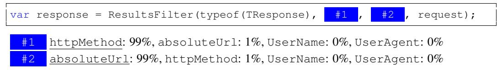
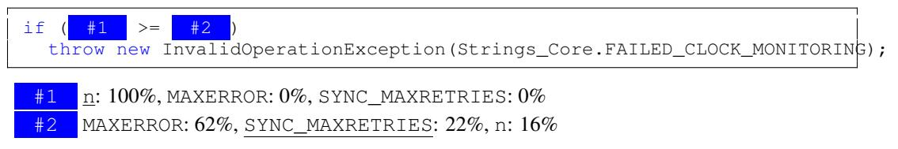

# LEARNING TO REPRESENT PROGRAMS WITH GRAPHS

Miltiadis Allamanis Microsoft Research Cambridge, UK miallama@microsoft.com Marc Brockschmidt Microsoft Research Cambridge, UK mabrocks@microsoft.com

Mahmoud Khademi<sup>∗</sup>

Simon Fraser University Burnaby, BC, Canada mkhademi@sfu.ca

### ABSTRACT

ソースコード（つまり、形式言語）に関する学習タスクは近年検討されているが、ほとんどの研究は自然言語手法の転用を試みており、コードが持つ既知のセマンティクスによる独自の機会を十分に活かしていない。たとえば、同じ変数や関数を離れた場所で使用することにより生じる長距離依存性がしばしば考慮されていない。我々は、コードの構文的および意味的構造の両方をグラフで表現し、グラフベースの深層学習手法を用いてプログラム構造上で推論することを学習することを提案する。

本研究では、ソースコードからグラフを構築する方法および、大規模なグラフに対してGated Graph Neural Networksの学習をスケールさせる方法を提示する。提案手法を二つのタスクで評価した。VARNAMINGタスクでは、ネットワークが変数の利用状況からその名前を予測しようとするものであり、VARMISUSEタスクでは、ネットワークが特定のプログラム位置で使用すべき正しい変数を選択するように推論するものである。より構造的でないプログラム表現を用いる手法との比較により、既知の構造をモデル化することの利点が示され、本手法のモデルが有意義な変数名を推定し、多くの場合でVARMISUSEタスクを解決できることが示唆された。さらに、我々のテストにより、VARMISUSEが成熟したオープンソースプロジェクトにおける複数のバグを特定できることが示された。

### 1 INTRODUCTION

大規模なソースコードリポジトリとスケーラブルな機械学習手法の登場は、「ビッグコード」、すなわち既存のソースコードから一般化する大部分が教師なしの手法によってソフトウェアエンジニアを支援するという発想に自然につながるものである[（Allamanis et al., 2017）](#page-8-0)。現時点において、ソースコードに関する既存のディープラーニングモデルは、その浅いテキスト構造、例えばトークン列[（Hindle](#page-9-0) [et al., 2012;](#page-9-0) [Raychev et al., 2014;](#page-9-1) [Allamanis et al., 2016）](#page-8-1)、構文木[（Maddison & Tarlow, 2014;](#page-9-2) [Bielik et al., 2016）](#page-9-3)、あるいは変数からなる平坦な依存ネットワーク[（Raychev et al., 2015）](#page-9-4)などとして捉えている。このようなモデルでは、ソースコードが持つ豊かで明確に定義されたセマンティクスを活かす機会が失われている。本研究ではこれを緩和するために、ソースコード中の追加の情報源としてデータフローと型階層を含める手法をとる。具体的には、プログラムをグラフとしてエンコードし、各エッジが構文的関係（例えば「トークンの前後」）とともにセマンティックな関係（「変数が最後に使用／書き込みされた箇所」「引数の対応する仮引数の名前がstreamである」など）も表現するのである。我々の主な着想は、これらセマンティクスを構造化入力として機械学習モデルに明示的に与えることで、必要な訓練データ量・モデル容量・訓練体制に対する要求を低減させ、現状の最先端モデルでは解決困難な課題にも対応可能とする点にある。

我々は、プログラムのより多くのセマンティック構造を公開する利点を示すために2つのタスクを検討する。まず、VARNAMINGタスク[\(Allamanis et al., 2014;](#page-8-2) [Raychev et al., 2015\)](#page-9-4)を考察する。このタスクでは、あるソースコードが与えられたときに、「正しい」変数名をサブトークンの列として推測する必要がある。これは変数がどのように使われているかをある程度理解する必要があり、すなわちコードの行を越えた推論が求められる。

<sup>∗</sup>Microsoft Research（ケンブリッジ、英国）でのインターンとして行った仕事である。

```
var clazz=classTypes["Root"].Single() as JsonCodeGenerator.ClassType;
Assert.NotNull(clazz);
var first=classTypes["RecClass"].Single() as JsonCodeGenerator.ClassType;
Assert.NotNull( clazz );
Assert.Equal("string", first.Properties["Name"].Name);
Assert.False(clazz.Properties["Name"].IsArray);
```
Figure 1: RavenDBというオープンソースC#プロジェクトで検出されたバグのスニペットである。コードはやや簡略化されている。我々のモデルは、ハイライト（黄色）された箇所で使用されている変数が誤っていることを正しく検出している。本来、firstがそのスロットに置かれるべきだった。この問題は報告され、[PR 4138.](https://github.com/ravendb/ravendb/pull/4138) において修正された。

ソースファイル内で離れている。次に、変数誤用予測タスク（VARMISUSE）を導入する。このタスクでは、ネットワークがプログラム内の特定の位置でどの変数を使用すべきかを推論することを目的とする。タスクを説明するために、[Figure 1](#page-1-0)は我々のモデルが有名なオープンソースプロジェクトで検出したバグのやや単純化したコード断片を示す。具体的には、clazzという変数の代わりに、ハイライトされた黄色の箇所ではfirstという変数を利用すべきであった。既存の静的解析手法ではこのような問題を検出できないが、ソフトウェアエンジニアは経験から容易にこれを誤りと認識できる。

これらのタスクで高い精度を達成するためには、プログラムのセマンティクスの表現を学習する必要がある。両方のタスクにおいて、変数の*意味的*役割（*例えば*、「これはカウンタか？」「これはファイル名か？」）を学習する必要がある。さらに、VARMISUSEの場合、変数の使用セマンティクス（*例えば*、「ここではファイル名が必要である」）を学習することが要求される。この「空欄埋め要素」タスクは、Word2Vec [\(Mikolov et al., 2013\)](#page-9-5) や GLoVe [\(Pennington et al., 2014\)](#page-9-6) など自然言語単語の分散表現を学習する手法と関連している。しかし、より豊かな構造、例えばデータフロー情報などから学習することができる。本研究はプログラム表現の学習に向けた一歩であり、コード補完（「これが探している変数である」）や、より高度なバグ発見（「このオブジェクトを使用する前にロックするべきである」）など、他の幅広いタスクにおいて有用になると期待している。

要約すると、我々の貢献は以下の通りである。（i）VARMISUSEタスクを、ソースコードの機械学習モデリングにおける課題として定義し、これにはプログラムの（ある種の）セマンティクスの習得が必要となる（*cf.* [section 3](#page-2-0)）。（ii）コードのグラフ構造をモデリングし、それらのグラフ上でプログラム表現を学習することにより、VARNAMINGおよびVARMISUSEタスクを解決するためのディープラーニングモデルを提示する（*cf.* [section 4](#page-2-1)）。（iii）我々のモデルを、実世界のソースコード290万行から成る大規模データセットで評価し、最良のモデルがVARNAMINGタスクで32.9%、VARMISUSEタスクで85.5%の精度を達成し、より単純なベースラインを上回ることを示した（*cf.* [section 5](#page-5-0)）。（iv）VARMISUSEの実用的な重要性について、成熟したオープンソースソフトウェアプロジェクトで発見したいくつかのバグを要約することで実証した（*cf.* [subsection 5.3](#page-7-0)）。グラフニューラルネットワークの実装（より単純なタスク上で）は<https://github.com/Microsoft/gated-graph-neural-network-samples>で入手可能であり、データセットは<https://aka.ms/iclr18-prog-graphs-dataset>で公開されている。

## 2 RELATED WORK

我々の研究は、ソースコード成果物に対して機械学習を用いるという近年の分野に基づいている。例えば、コードをトークンの列としてモデル化する研究もあれば、コードの構文木構造をモデル化する研究もある。コードの言語モデルに関するすべての研究において、変数やメソッド識別子の予測がこのタスクにおける最大の課題の一つであることが判明している。

我々の研究に最も近いのは、[Allamanis et al.](#page-8-4) [\(2015\)](#page-8-4)の研究であり、彼らは変数の全ての使用例を用いて分散表現を学習し、その名前を予測している。しかし、彼らはデータフロー情報を利用しておらず、我々の知る限り、それを利用するモデルは存在しない。[Raychev et al.](#page-9-4) [\(2015\)](#page-9-4) および [Bichsel et al.](#page-9-8) [\(2016\)](#page-9-8)は、条件付き確率場を用いて、変数、AST要素、型の間の様々な関係をモデル化し、変数名や型の予測（あるいはAndroidアプリの難読化解除）を行っているが、データフローそのものは明示的に考慮していない。これらの研究では、すべての変数使用例が予め決定的に知られている（コードは完全で変更されないため）、[Allamanis et al.](#page-8-2) [\(2014;](#page-8-2) [2015\)](#page-8-4)と同様である。

我々の研究は、スケッチを用いたプログラム合成[\(Solar-Lezama, 2008\)](#page-9-9)や自動コード移植[\(Barr et al., 2015\)](#page-8-5)に関する研究と遠縁の関係にある。ただし、これらの手法はギャップを埋めるために仕様（例えば、入力-出力例やテストスイート）のセットを必要とし、ビッグコードから学習した統計情報は利用しない。これらの手法は我々の手法と相補的であると考えられる。我々は仕様を一切必要とせず、コードから一般的な変数利用パターンを学習することによって、統計的にギャップを埋めることを学習しているからである。

グラフ上のニューラルネットワークは、多様な深層学習手法をグラフ構造の入力に適応したものである。これらは、リンク予測や分類、自然言語処理における意味役割付与など、一連の応用で利用されている。ソースコードとある程度関連するものとしては、定理証明における前提選択のために数学的な式のグラフベース表現を学習する研究が挙げられる。

### <span id="page-2-0"></span>3 THE VARMISUSE TASK

コード内の変数誤用を検出することは、プログラムのセマンティクスを理解し推論することを必要とするタスクである。このタスクをうまくこなすには、プログラム要素の役割や機能を推測し、それらがどのように関係しているかを理解する必要がある。例えば、Fig. [1,](#page-1-0)のようなプログラムが与えられた場合、clazzのマークされた使用が誤りであり、firstが使われるべきであることを自動的に検出することが求められる。このタスクは標準的なコード補完タスクに似ているが、変数識別子のみに注目し、ほぼ完成したプログラムを対象とする点で、その範囲と目的において大きく異なっている。

タスクの説明  
ソースコードファイルを、トークン t<sup>0</sup> から t<sup>N</sup> = T までの列と見なす。このうち、いくつかのトークン tλ<sup>0</sup>、tλ<sup>1</sup> などは変数である。さらに、V<sup>t</sup> ⊂ V は t の位置でスコープ内にある型が正しい変数の集合、すなわち t で使用してもコンパイラエラーが発生しない変数の集合を指す。予測したい正しい変数使用箇所のトークン tok<sup>λ</sup> を「スロット」と呼ぶ。各スロット tλ について、t<sup>0</sup> . . . tλ−<sup>1</sup> および tλ+1, . . . , t<sup>N</sup> が与えられたとき、Vt<sup>λ</sup> の中から正しく t<sup>λ</sup> を選択するタスクを定義する。学習および評価の目的では、正解となる解は単にグラウンドトゥルースと一致するものでよいが、実際にはメモリ上で同じ値を指す変数が複数存在する場合など、いくつかの割り当てが正しいと見なされることもある点に注意する必要がある。

### <span id="page-2-1"></span>4 MODEL: PROGRAMS AS GRAPHS

このセクションでは、プログラムのソースコードを*プログラムグラフ*へ変換し、それらの上で表現を学習する方法について議論する。このプログラムグラフは、プログラムのテキストだけでなく、標準的なコンパイラツールを用いて得られるセマンティック情報も符号化している。

Gated Graph Neural Networks  
本研究はGated Graph Neural Networks [\(Li et al.,](#page-9-11) [2015\)](#page-9-11) (GGNN) に基づいており、ここでその概要を述べる。グラフ G = (V, E, X) は、ノードの集合 V、ノード特徴量 X、および有向エッジ集合 E = (E1, ... , EK) から構成される。ここで K はエッジタイプの数である。各 v ∈ V には、そのノードの特徴量を表す実数値ベクトル x (v) ∈ R <sup>D</sup> を付与する（例えば、そのノードの文字列ラベルの埋め込み）。

各ノード v には状態ベクトル h(v) を関連付けており、このベクトルはノードラベル x(v) から初期化される。状態ベクトルと特徴ベクトルのサイズは通常同じであるが、ノード特徴量のパディングによってより大きい状態ベクトルを用いることも可能である。グラフ全体で情報を伝播させるため、タイプ k の「メッセージ」が各 v からその隣接ノードに送信される。各メッセージは現在の状態ベクトルから m(v)<sup>k</sup> = f<sup>k</sup>(h(v)) として計算される。ここで、f<sup>k</sup> は任意の関数でよいが、本手法では線形層を選択する。グラフ内のすべてのエッジに対するメッセージを同時に計算することで、すべての状態を同時に更新することができる。特に、ノード v の新しい状態は、すべての流入メッセージを集約することで計算される。すなわち、m˜(v) = g({m(u)<sup>k</sup> | u から v へのタイプ k のエッジが存在する }) である。g は集約関数であり、要素ごとの総和として実装する。集約メッセージ m˜(v) およびノード v の現在の状態ベクトル h(v) が与えられたとき、次時刻の状態 h'<sup>0</sup>(v) は h'<sup>0</sup>(v) = GRU(m˜(v), h(v)) により計算する。ただし、GRU はゲート付きリカレントユニット (GRU) のリカレントセル関数である [\(Cho et al., 2014\)](#page-9-18)。

<span id="page-3-1"></span>


(a) 図[1,](#page-1-0)の2行目の簡略化された構文グラフである。青の丸みを帯びたボックスは構文ノード、黒の長方形ボックスは構文トークン、青いエッジはChildエッジ、二重黒エッジはNextTokenエッジである。

(b) データフローエッジについて説明する。(x <sup>1</sup>,y <sup>2</sup>) = Foo(); while (x <sup>3</sup> > 0) x <sup>4</sup> = x <sup>5</sup> + y 6（明確化のため添え字を追加）、赤の点線はLastUseエッジ、緑の破線はLastWriteエッジ、点破線の紫はComputedFromエッジである。

図2: プログラム表現で使用されるグラフエッジの例である。

上記の方程式で定義されたダイナミクスを、一定のタイムステップ数だけ繰り返す。その後、最後のタイムステップでの状態ベクトルをノード表現として用いる。[1](#page-3-0)

プログラムグラフ  
プログラムのソースコードをグラフとして表現し、異なるエッジタイプを用いて異なるトークン間の構文的および意味的関係をモデル化する。プログラムグラフの骨格は、プログラムの抽象構文木（AST）であり、これは*構文ノード*（プログラミング言語の文法における非終端記号に対応する）と*構文トークン*（終端記号に対応する）から構成される。構文ノードにはプログラムの文法から得られる非終端記号の名称をラベル付けし、構文トークンにはそれが表す文字列をラベルとして付与する。ASTに従い、ノード同士を接続するためにChildエッジを用いる。これは構文ノードの子に順序を与えないため、追加でNextTokenエッジを用いて各構文トークンをその後続トークンに接続している。その例をFig. [2a.](#page-3-1)に示す。

プログラム内の制御およびデータの流れを把握するために、変数に対応する構文トークンの異なる使用および更新を接続する追加のエッジを追加する。こうしたトークンvについて、DR(v)はその変数が最後に使用された可能性のある構文トークンの集合とする。この集合には複数のノードが含まれる場合がある（例えば、両方の分岐で使用された後に変数を利用する条件分岐の場合など）し、プログラムコード内で後続する構文トークンまでも含まれうる（ループの場合など）。同様に、D<sup>W</sup>(v)は、その変数が最後に書き込まれた構文トークンの集合とする。これらを用いて、LastRead（それぞれLastWrite）エッジをvからDR(v)（それぞれD<sup>W</sup>(v)）の全要素へ接続して追加する。さらに、代入v = exprが観測されるたびに、expr内に現れるすべての変数トークンとvとをComputedFromエッジで接続する。このようなセマンティックエッジの例を図[2b.](#page-3-1)に示す。

同じ変数のすべての使用箇所をLastLexicalUseエッジで連鎖させるようにグラフを拡張する（データフローとは無関係、つまり if (...) { ... v ...} else { ... v ...} の場合、vの2つの出現箇所を接続する）。また、ReturnsToエッジを用いてreturnトークンをメソッド宣言に接続する（これにより、その名前や型への「ショートカット」が作成される）。[Rice et al.](#page-9-19) [\(2017\)](#page-9-19) に着想を得て、メソッド呼び出し内の引数を、それらが一致する仮引数にFormalArgNameエッジで接続する。つまり、呼び出し Foo(bar) とメソッド宣言 Foo(InputStream stream) を観測した場合、barトークンをstreamトークンに接続する。最後に、変数に対応するすべてのトークンを、その変数を利用する囲われたガード式にGuardedByおよびGuarded-ByNegationエッジで接続する。例えば、if (x > y) { ... x ...} else { ... y ...} において、xから（同様にyからはGuardedByNegationエッジで）x > yに対応するASTノードへGuardedByエッジを追加する。

最後に、すべての種類のエッジに対して、それぞれの逆向きエッジ（隣接行列を転置することで得られる）を導入する。これにより、エッジとエッジタイプの数が2倍になる。逆向きエッジは、GGNN全体で情報をより速く伝播させるのに役立ち、モデルの表現力を高める。

<span id="page-3-0"></span><sup>1</sup>Graph Convolutional Networks（GCN）[\(Kipf & Welling, 2016;](#page-9-13) [Schlichtkrull et al., 2017\)](#page-9-20)は、GGNNsのより単純な代替となるものである。これは、状態更新にゲート付きリカレントユニットを用いず、1つのGGNN層ごとに伝播ステップ数を1に固定した場合のGGNNsの特殊ケースに相当する。その代わり、複数の層を用いる。我々の実験においては、GCNsはGGNNsよりも汎化性能が劣っていた。

変数型情報の活用  
我々は静的型付け言語を想定しており、ソースコードがコンパイル可能であると仮定する。そのため、各変数には（既知の）型 τ (v) が存在する。この型情報を利用するため、既知の型に対する学習可能な埋め込み関数 r(τ ) を定義し、加えて未知あるいは未表現の型すべてに対して "UNKTYPE" を定義する。また、多くのオブジェクト指向言語で利用可能な豊富な型階層も活用する。このために、変数の型 τ (v) をそのスーパータイプの集合、すなわち τ ∗ (v) = {τ : τ (v) が型 τ を実装する} ∪ {τ (v)} に写像する。次に、変数 v の型表現 r ∗ (v) を {r(τ ) : τ ∈ τ ∗ (v)} の要素ごとの最大値として計算する。ここで最大値を選択するのは、部分順序関係（型格など）を表現する自然なプーリング操作であるためである。τ ∗ (v) 内のすべての型を使用することで、共通のスーパータイプやインターフェイスを実装する未知の型にも一般化できる。例えば、List<K> には複数の具象型（List<int> や List<string> など）が存在する。しかし、これらの型は共通のインターフェイス（IList）を実装し、共通の特性を持つ。学習時には τ ∗ (v) の非空部分集合をランダムに選択し、これにより型格内のすべての既知型の学習を保証する。これはドロップアウト機構のように機能し、型格におけるすべての型の良い表現を学習することを可能にする。

初期ノード表現  
初期ノード状態を計算するために、トークンのテキスト表現およびその型に関する情報を組み合わせる。具体的には、トークンを表すノード名をcamelCaseおよびpascal_caseでサブトークンに分割する（例えば、classTypesはclassとtypesという2つのサブトークンに分割される）。その後、全てのサブトークンの埋め込みを平均化し、ノード名の埋め込みを取得する。最後に、前述の方法で計算された型表現r ∗ (v)をノード名表現と連結し、線形層に通すことで、グラフ内の各ノードの初期表現を得る。

VARNAMINGのためのプログラムグラフ  
与えられたプログラムと既存の変数vに対して、上述したようにプログラムグラフを構築し、対応する全ての変数トークン中の変数名を特殊な<SLOT>トークンで置き換える。名前を予測するために、上述したように学習可能なトークン埋め込みと型埋め込みの連結によって計算した初期ノードラベルを用い、GGNN伝播を8タイムステップ実行する。その後、全<SLOT>トークンに対する表現を平均化することで変数使用表現を計算する。この表現を1層GRUの初期状態として用いることで、目的の名前をサブトークンの列として予測する（例えば、inputStreamBufferという名前は[input, stream, buffer]という列として扱う）。このgraph2seqアーキテクチャは、最尤目的関数を用いて学習される。[section 5](#page-5-0)では、正確な名前を予測する精度と、そのサブトークンを予測する際のF1スコアを報告している。

VARMISUSEのためのプログラムグラフ  
プログラムグラフでVARMISUSEをモデル化するためには、グラフを修正する必要がある。まず、使用される変数を予測したいスロットtに対して*コンテキスト表現* c(t)を計算するために、tの位置に新しいノードv<SLOT>を挿入し、この時点で「穴」を表現する。そして、選択される変数に依存しないすべての適用可能なエッジ（すなわち、LastUse、LastWrite、LastLexicalUse、およびGuardedByエッジ以外のすべて）を用いて、残りのグラフに接続する。次に、ターゲットスロットにおける各候補変数vの*使用表現* u(t, v)を計算するには、すべてのv∈Vtについて「候補」ノードvt,vを挿入し、その変数がこのスロットで使用される場合に挿入されるであろうLastUse、LastWrite、およびLastLexicalUseエッジを追加することでグラフに接続する。これらの各候補ノードは、スコープ内での変数の仮説的な配置を表現している。

初期ノード表現に、候補ノード vt,v に対して1に設定された追加ビットを連結し、GGNNの伝播を8ステップ実行する。[2](#page-4-0) このとき、コンテキスト表現および使用法表現はノードの最終状態となる。すなわち、c(t) ＝ h(v<SLOT>) および u(t, v) ＝ h(vt,v) である。最終的に、その場所での正しい変数使用法は arg max<sup>v</sup> W[c(t), u(t, v)] として計算される。ここで、Wはc(t)とu(t, v)の連結を利用する線形層である。学習にはmax-margin目的関数を用いる。

#### 4.1 IMPLEMENTATION

大規模かつ多様なグラフ集合にGGNNsを使用するには、ある程度のエンジニアリング作業が必要となる。なぜなら、多様な形状が存在する場合、効率的なバッチ処理が困難であるためである。重要な観察点として、大規模なグラフは通常非常にスパースであり、そのためエッジの表現を隣接リストとすれば、通常メモリ消費量を削減する上で有利になる。本件に関しては、スパーステンソルを用いることで容易に実装可能である。

<span id="page-4-0"></span><sup>2</sup>我々は、より少ないステップでは十分な結果が得られず、逆に伝播ステップを増やしても大きな効果が得られないことを発見した。

表現により、現代のGPUの並列性を効率的に活用できる大規模なバッチサイズが可能になる。もう一つの重要な洞察点は、複数のグラフから成るバッチを、多くの非連結成分を持つ一つの大きなグラフとして表現することである。これにはノードの識別子がユニークであるように適切な前処理を行うだけでよい。この手法はバッチの構築がややCPU集約的となるため、我々は別スレッドでミニバッチを準備するのが有用だと分かった。我々のTensorFlow実装は、グラフの平均ノード数2,228（中央値936）および平均エッジ数8,350（中央値3,274）、GGNNアンローリング回数8、全20種のエッジタイプ（元の10種のエッジタイプごとに正方向および逆方向）、隠れ層サイズ64において、NVidia GeForce GTX Titan X一枚上でトレーニング時に1秒あたり55グラフ、テスト時に1秒あたり219グラフのスケーリングを実現している。GGNNのエッジタイプ数は実行時間に比例して影響する。例えば、我々のアブレーションスタディで最も一般的な2種のエッジタイプ（NextToken、Child）のみを用いた場合、同じハイパーパラメータ設定でトレーニング時に1秒あたり105グラフ、テスト時に1秒あたり419グラフを達成する。GGNNの（汎用的な）実装は、より単純なデモタスクを用いて公開している。

### <span id="page-5-0"></span>5 EVALUATION

Dataset  
VARMISUSEタスクのために、GitHub上のオープンソースC#プロジェクトからデータセットを収集した。プロジェクトの選定には、GitHubでスター数の多い（非フォークの）プロジェクトを選んだ。その後、Roslynを使用して完全に（容易に）コンパイルできないプロジェクトを除外した。これは、コード内の正確な型情報（外部ライブラリに存在する型も含む）を抽出するためにコンパイルが必要だからである。最終的なデータセットには、さまざまな分野（コンパイラ、データベースなど）の29プロジェクトが含まれており、約290万行の非空コード行が含まれている。完全な表は[Appendix D.](#page-15-0)に示している。

変数の誤用を検出するタスクのために、すべてのプロジェクトからデータを収集し、すべての変数使用箇所を選択し、変数宣言を除外し、少なくとも一つの型互換な代替変数がスコープ内に存在する箇所のみを対象とする。このタスクは、当該箇所にもともと存在していた正しい変数を推論することである。したがって、構成上、少なくとも一つの型的に正しい代替変数が存在しており、すなわちそれを選択しても型チェック時にエラーは発生しない。我々のテストデータセットにおいては、各スロットにつき平均3.8個の型的に正しい代替変数（中央値3、σ = 2.6）が存在する。

我々のデータセットから、2つのプロジェクトを開発セットとして選択した。残りのプロジェクトの中から、UNSEENPROJTEST用に3つのプロジェクトを選択し、全く未知の構造や型を持つプロジェクトに対するテストを可能にした。残りの23プロジェクトは、訓練／検証／テストセットに60-10-30の比率で分割し、ファイル単位（すなわち、1つのソースファイルからのすべての例は同じセットに入る）で分割した。このようにして得られたテストセットをSEENPROJTESTと呼ぶ。

VARMISUSEのベースラインとして、2つの双方向RNNに基づくベースラインを考慮する。ローカルモデル（LOC）は、ターゲット位置の前後のトークンに対して実行される単純な2層の双方向GRUである。このベースラインにおいては、c(t)はRNNによって計算されたスロット表現に設定され、各変数の使用文脈u(t, v)は、GGNNにおける初期ノードラベルと同様の方法で計算される、変数名と型の埋め込みである。このベースラインにより、このタスクにおいて使用文脈情報がどれほど重要かを評価できる。フラットデータフローモデル（AVGBIRNN）はLOCの拡張であり、使用表現u(t, v)は、それぞれの使用箇所の前後トークンに対して別の2層双方向RNNを実行し、変数トークンvで計算された表現を平均化することで求められる。ローカルコンテキストc(t)はLOCと同一である。AVGBIRNNは、すべての変数使用に対して平均化するため、長距離依存関係への対応が向上しており、すでにいくつかの構造情報を考慮した、著しく強力なベースラインである。両モデルとも、c(t)<sup>T</sup>u(t, v)を最大化する変数を選択する。

VARNAMINGにおいては、LOCをAVGLBLに置き換える。AVGLBLは各変数使用時の左4個および右4個のコンテキストトークンに対してログ双線形モデルを用い、これらのコンテキスト表現を平均化する方式である（これは[Allamanis et al.](#page-8-4) [\(2015\)](#page-8-4) のモデルに対応する）。また、VARNAMING上でAVGBIRNNの評価も行い、これは本質的にログ双線形コンテキストモデルを双方向RNNに置き換えたものである。

|              | SEENPROJTEST |        |          |              | UNSEENPROJTEST |        |          |              |
|--------------|--------------|--------|----------|--------------|----------------|--------|----------|--------------|
|              | Loc          | AVGLBL | AVGBIRNN | GGNN         | Loc            | AVGLBL | AVGBIRNN | GGNN         |
| VARMISUSE    |              |        |          |              |                |        |          |              |
| Accuracy (%) | 50.0         | —      | 73.7     | <b>85.5</b>  | 28.9           | —      | 60.2     | <b>78.2</b>  |
| PR AUC       | 0.788        | —      | 0.941    | <b>0.980</b> | 0.611          | —      | 0.895    | <b>0.958</b> |
| VARNAMING    |              |        |          |              |                |        |          |              |
| Accuracy (%) | —            | 36.1   | 42.9     | <b>53.6</b>  | —              | 22.7   | 23.4     | <b>44.0</b>  |
| F1 (%)       | —            | 44.0   | 50.1     | <b>65.8</b>  | —              | 30.6   | 32.0     | <b>62.0</b>  |

<span id="page-6-1"></span>表1：モデルの評価結果である。SEENPROJTESTは、トレーニングセット内にファイルを持つプロジェクトを含むテストセットを指す。UNSEENPROJTESTは、トレーニングデータにファイルを含まないプロジェクトを指す。結果は2回の実行の平均である。

<span id="page-6-3"></span>

| Table 2: GGNNモデルのSEENPROJTESTにおける2つのタスクのアブレーションスタディ。 |  |  |  |  |
|-------------------------------------------------------------------------------|--|--|--|--|
|-------------------------------------------------------------------------------|--|--|--|--|

| アブレーションの説明                                   | 正確度 (%)   |           |
|-------------------------------------------------|--------------|-----------|
|                                                 | VARMISUSE    | VARNAMING |
| 標準モデル（表1で報告）                            | 85.5         | 53.6      |
| NextToken、Child、LastUse、LastWrite エッジのみ    | 80.6         | 31.2      |
| セマンティックエッジのみ（NextToken、Child以外すべて）| 78.4         | 52.9      |
| シンタックスエッジのみ（NextToken、Child）           | 55.3         | 34.3      |
| ノードラベル：サブトークンの代わりにトークン           | 85.6         | 34.5      |
| ノードラベル：無効化                                   | 84.3         | 31.8      |

### 5.1 QUANTITATIVE EVALUATION

[Table 1](#page-6-1)は、両タスクにおけるモデルの評価結果を示している。[4](#page-6-2) LOCはほとんど情報を捉えていないため、相対的に成績が悪い。AVGLBLおよびAVGBIRNNは多くの変数使用箇所から情報を取得しているが、問題の豊かな構造を明示的に符号化していないため、依然としてGGNNに大きく水をあけられている。パフォーマンスの差はVARMISUSEの方が大きい。なぜなら、この設定ではコードの構造と意味がはるかに重要であるからだ。

新しいプロジェクトへの一般化  
異なる分野に属する多様なソースコードプロジェクト全体で一般化することは、機械学習における重要な課題である。我々は、UNSEENPROJTESTセットを用いて評価を繰り返す。このセットは、訓練セットにファイルが存在しないプロジェクトに由来している。[Table 1](#page-6-1)の右側に示されているように、本モデルは依然として良好な性能を達成しているが、SEENPROJTESTと比較するとわずかに低い。この理由は、UNSEENPROJTESTでは型ラティスのほとんどが未知であるためであり、これは予想された結果である。

我々は、訓練済みモデルを未知のプロジェクト（すなわち、ドメイン）に適用する際の主要な問題は、その型階層が不明であり、使用される語彙（例えば、変数名、メソッド名、クラス名など）が大きく異なる可能性があるという事実であると考えている。

Ablation Study  
我々のモデルにおけるいくつかの設計選択の効果を調べるため、追加実験を実施し、その結果を[Table 2.](#page-6-3)に示す。まず、プログラムグラフで使用するエッジを変更した。モデルを構文情報に限定すると、両タスクで性能に大きな影響があることが分かった。一方で、意味的エッジに限定すると、主にVARMISUSEの性能に影響するようだ。同様に、ComputedFrom、FormalArgName、ReturnsToエッジはVARMISUSEにおいてはわずかな効果しかないが、VARNAMINGでは性能を大きく向上させる。ノードラベル表現に関する実験からも明らかなように、構文ノードやトークン名はVARMISUSEにはほとんど影響しないが、VARNAMINGには大きな影響を与えるのは当然である。

#### 5.2 QUALITATIVE EVALUATION

[Figure 3](#page-7-1)は、GGNNがサンプルテストスニペットに対して行った予測を示している。このスニペットは、ルートフォルダーへと段階的に降りていきながらグローバルディレクティブファイルを再帰的に探索する。正しい変数の使用法について推論することは、人間にとっても難しいが、GGNNはその変数を正しく予測している。

<span id="page-6-0"></span><sup>3</sup><http://roslyn.io>

<span id="page-6-2"></span><sup>4</sup> Sect. [A](#page-10-0) には、さらにVARMISUSEタスクにおけるGGNNモデルのROC曲線およびPrecision-Recall曲線も示されている。

<span id="page-7-1"></span>

Figure 3: ServiceStackプロジェクトのSEENPROJTESTセット内のスニペットにおけるスロットに対するVARMISUSEの予測を示す図である。追加の可視化結果については[Appendix B.](#page-10-1)を参照のこと。下線が引かれているトークンが正しいトークンである。モデルは各スロットで複数の文字列変数の中から選択しなければならず、それらはすべて何らかの経路を表している。GGNNは、変数同士が複雑に相互作用する方法を推論しながら、13スロット中11で正しい変数の使用を正確に予測した。

```
public ArraySegment<byte> ReadBytes(int length){
   int size = Math.Min(length, _len - _pos);
   var buffer = EnsureTempBuffer( length );
   var used = Read(buffer, 0, size);
```
Figure 4: RavenDBオープンソースプロジェクトで発見されたバグ（黄色）である。コードは不要にバッファのサイズをsizeではなくlengthとすることを保証している（ここで我々のモデルはsizeが正しい変数であると予測している）。

2か所（スロット1と8）を除くすべての箇所での使用状況である。ソフトウェアエンジニアがコードを書いている際、ある変数を別の変数の代わりに誤って使用してしまうことは想像に難くない。すべての変数が文字列変数であるため、型エラーは発生しない。図[3](#page-7-1)の確率が示すように、ほとんどの潜在的な変数の誤使用はモデルによって検出され、ソフトウェアエンジニアにとって有益な警告となる可能性がある。コメント付きの追加サンプルは[Appendix B.](#page-10-1)で確認できる。

さらに、[Appendix C](#page-14-0) には、GGNNの使用表現 u(t, v) のコサイン類似度によって類似した表現を持つコードスニペットのペアの例が示されている。読者は、ネットワークが意味的に類似した変数使用をまとめて学習していることに気付くだろう。例えば、変数の使用前にnullチェックを行う場合、異なるコード区間においても類似した分散表現が得られる（[Appendix C](#page-14-0) のサンプル1）。

#### <span id="page-7-0"></span>5.3 DISCOVERED VARIABLE MISUSE BUGS

我々は、VARMISUSEモデルを用いてRavenDB（ドキュメントデータベース）およびRoslyn（MicrosoftのC#コンパイラフレームワーク）におけるバグの可能性が高い箇所を特定した。そのために、両プロジェクトにおいてモデルがグラウンドトゥルースと異なる変数を選択することに最も自信を持っていた上位500箇所のサンプルを手動でレビューし、各プロジェクトで三つずつバグを発見した。

Figs. [1,](#page-1-0)[4](#page-7-2)[,5](#page-8-7)はRavenDBで発見された問題を示している。Fig. [1](#page-1-0)におけるバグはコピーペーストにより引き起こされた可能性があり、従来の手法では容易に検出できない。コンパイラはこの点について*警告を出さない*のである。

```
if (IsValidBackup(backupFilename) == false) {
 output("Error:"+ backupLocation +" doesn't look like a valid backup");
 throw new InvalidOperationException(
     backupLocation + " doesn't look like a valid backup");
```
Figure 5: RavenDBオープンソースプロジェクトで見つかったバグ（黄色）。backupFilenameがIsValidBackupによって無効であると判定されているにもかかわらず、ユーザーにはbackupLocationが無効であると通知されている。

未使用の変数（firstは使用されているため該当しない）であり、事実上、他のテストをテストするようなテストを書く者はほとんどいない。Fig. [4](#page-7-2) は、重大ではないものの、メモリ消費の増加につながる可能性のある問題を示している。Fig. [5](#page-8-7) は、情報量の少ないエラーメッセージから生じる別の問題を示している。我々はこの他に3件のバグを[Roylyn](http://roslyn.io)の開発者に非公開で報告しており、その間に該当の問題は修正された（cf. <https://github.com/dotnet/roslyn/pull/23437>）。報告したバグの一つは、特定のRoslyn機能を使用した際にVisual Studioがクラッシュする可能性があった。

広くリリースされ、テストされたコードにこれらの問題が見つかるという事実は、本モデルがソフトウェア開発プロセスにおいて有用であり、従来のプログラム解析ツールを補完できることを示唆している。例えば、一つの使用シナリオとしては、VARMISUSEモデルが異常と特定した箇所にコードレビューを誘導することや、テストやコストのかかるコード解析作業の重点を絞るための事前情報として活用することが考えられる。

### 6 DISCUSSION & CONCLUSIONS

ソースコードは、プログラミング言語研究などの他の分野では十分に理解され、研究されてきたが、ディープラーニングにとっては比較的新しい領域である。ソースコードは、その（局所的な）セマンティクスが明確に定義されており、よく知られた効率的なプログラム解析を利用することで豊富な追加情報を抽出できるため、テキストデータや知覚データと比べて新たな機会を提供する。一方で、このような構造化された情報の豊富さを統合することは興味深い課題となる。我々のVARMISUSE課題は、コード補完などのより単純な課題を超えて、こうした新たな機会を明らかにするものだ。本課題は、型システムが提供する標準的な情報を確率的に洗練させることを要求するため、ソースコードの「意味」を学習するという中核的な課題に対する最初の指標であると考えている。

### REFERENCES

- <span id="page-8-6"></span>Martín Abadi、Ashish Agarwal、Paul Barham、Eugene Brevdo、Zhifeng Chen、Craig Citro、Greg S Corrado、Andy Davis、Jeffrey Dean、Matthieu Devin、他. Tensorflow: Large-scale machine learning on heterogeneous distributed systems. *arXiv preprint arXiv:1603.04467*, 2016年。
- <span id="page-8-2"></span>Miltiadis Allamanis、Earl T Barr、Christian Bird、Charles Suttonによる。自然なコーディング規約を学習するというものである。*Foundations of Software Engineering (FSE)*、2014年に発表された。
- <span id="page-8-4"></span>Miltiadis Allamanis、Earl T Barr、Christian Bird、Charles Suttonによる。「正確なメソッド名およびクラス名の提案」という論文である。*Foundations of Software Engineering (FSE)*、2015年に掲載されている。
- <span id="page-8-1"></span>Miltiadis Allamanis、Hao Peng、Charles Suttonによる「A convolutional attention network for extreme summarization of source code」。*International Conference on Machine Learning (ICML)*において発表。ページ2091–2100、2016年。
- <span id="page-8-0"></span>Miltiadis Allamanis、Earl T Barr、Premkumar Devanbu、Charles Suttonによる論文。「A survey of machine learning for big code and naturalness」。*arXiv preprint arXiv:1709.06182*、2017年。
- <span id="page-8-5"></span>Earl T Barr、Mark Harman、Yue Jia、Alexandru Marginean、および Justyna Petke。自動化されたソフトウェア移植について述べる。*International Symposium on Software Testing and Analysis (ISSTA)*、2015年。
- <span id="page-8-8"></span>Al Bessey、Ken Block、Ben Chelf、Andy Chou、Bryan Fulton、Seth Hallem、Charles Henri-Gros、Asya Kamsky、Scott McPeak、Dawson Engler. 数十億行のコードの後で: 静的解析を用いて現実世界のバグを発見する方法について述べている。*Communications of the ACM*, 53(2):66–75, 2010年。
- <span id="page-8-3"></span>Avishkar Bhoopchand、Tim Rocktäschel、Earl Barr、および Sebastian Riedelによる論文である。スパースポインタネットワークを用いたPythonコードサジェストの学習について述べている。*arXiv preprint arXiv:1611.08307*, 2016.
- <span id="page-9-8"></span>Benjamin Bichsel、Veselin Raychev、Petar Tsankov、およびMartin Vechev。「Statistical deobfuscation of android applications」。*Conference on Computer and Communications Security (CCS)*、2016年に発表された。
- <span id="page-9-3"></span>Pavol Bielik、Veselin Raychev、およびMartin Vechev。PHOG: コードの確率モデルである。*International Conference on Machine Learning (ICML)*、2016年。
- <span id="page-9-18"></span>Kyunghyun Cho、Bart van Merriënboer、Dzmitry Bahdanau、およびYoshua Bengio。「ニューラル機械翻訳の特性について：エンコーダ・デコーダ手法」。*Syntax, Semantics and Structure in Statistical Translation*, 2014年。
- <span id="page-9-12"></span>Michaël Defferrard、Xavier Bresson、Pierre Vandergheynst。グラフ上での高速な局所スペクトルフィルタリングによる畳み込みニューラルネットワークについて述べている。*Neural Information Processing Systems (NIPS)*、pp. 3844–3852、2016年。
- <span id="page-9-14"></span>Justin Gilmer、Samuel S. Schoenholz、Patrick F. Riley、Oriol Vinyals、およびGeorge E. Dahlによる論文「Neural message passing for quantum chemistry」。*arXiv preprint arXiv:1704.01212*, 2017年である。
- <span id="page-9-10"></span>Marco Gori、Gabriele Monfardini、Franco Scarselliによる「グラフ領域での学習のための新しいモデル」である。*IEEE International Joint Conference Neural Networks (IJCNN)*にて発表された。IEEE、2005年。
- <span id="page-9-15"></span>Aditya Grover と Jure Leskovec による node2vec: ネットワークのためのスケーラブルな特徴学習である。*International Conference on Knowledge Discovery and Data Mining (SIGKDD)* において発表され、ページ855–864、ACM、2016年。
- <span id="page-9-0"></span>Abram Hindle、Earl T Barr、Zhendong Su、Mark Gabel、Premkumar Devanbuによる「ソフトウェアの自然さについて」である。*International Conference on Software Engineering (ICSE)*、2012年に発表された。
- <span id="page-9-13"></span>Thomas N Kipf と Max Welling. グラフ畳み込みネットワークによる半教師あり分類である。*arXiv preprint arXiv:1609.02907*, 2016.
- <span id="page-9-11"></span>Yujia Li、Daniel Tarlow、Marc Brockschmidt、およびRichard Zemel。「Gated graph sequence neural networks」。*International Conference on Learning Representations (ICLR)*、2015年。
- <span id="page-9-2"></span>Chris J Maddison と Daniel Tarlowによる「Structured generative models of natural source code」。*International Conference on Machine Learning (ICML)*、2014年に発表されたものである。
- <span id="page-9-16"></span>Diego MarcheggianiとIvan Titov。文の符号化にグラフ畳み込みネットワークを用いた意味役割付与。*ACL*、2017年。
- <span id="page-9-5"></span>Tomas Mikolov、Ilya Sutskever、Kai Chen、Greg S Corrado、およびJeff Dean。単語およびフレーズの分散表現とその合成性について。*Neural Information Processing Systems (NIPS)*、2013年。
- <span id="page-9-6"></span>Jeffrey Pennington、Richard Socher、およびChristopher D Manningによる「GloVe: Global vectors for word representation」である。*EMNLP*、2014年に掲載された。
- <span id="page-9-1"></span>Veselin Raychev、Martin Vechev、およびEran Yahavによる。統計的言語モデルによるコード補完である。*Programming Languages Design and Implementation (PLDI)* にて発表。pp. 419–428、2014年。
- <span id="page-9-4"></span>Veselin Raychev、Martin Vechev、Andreas Krauseによる「Predicting program properties from Big Code」。*Principles of Programming Languages (POPL)*、2015年である。
- <span id="page-9-7"></span>Veselin Raychev、Pavol Bielik、およびMartin Vechev。決定木を用いたコードの確率的モデルである。*Object-Oriented Programming, Systems, Languages, and Applications (OOPSLA)*, 2016にて発表された。
- <span id="page-9-19"></span>Andrew Rice、Edward Aftandilian、Ciera Jaspan、Emily Johnston、Michael Pradel、Yulissa Arroyo-Paredesによる「Detecting argument selection defects」。“*Proceedings of the ACM on Programming Languages*”、1(OOPSLA):104、2017年である。
- <span id="page-9-20"></span>Michael Schlichtkrull、Thomas N. Kipf、Peter Bloem、Rianne van den Berg、Ivan Titov、およびMax Welling。グラフ畳み込みネットワークを用いた関係データのモデリングである。*arXiv preprint arXiv:1703.06103*, 2017。

<span id="page-9-9"></span>Armando Solar-Lezama. *Program synthesis by sketching*. カリフォルニア大学バークレー校、2008年。

<span id="page-9-17"></span>Mingzhe Wang、Yihe Tang、Jian Wang、および Jia Dengによる「Premise selection for theorem proving by deep graph embedding」。*Advances in Neural Information Processing Systems*において、2783–2793ページ、2017年。

<span id="page-10-2"></span>

図6：VARMISUSEにおけるGGNNモデルの適合率-再現率曲線およびROC曲線である。y軸が50%から始まっていることに注意されたい。

表3: 型が正しく、スコープ内にある候補変数の数ごとのVARMISUSEにおけるGGNNモデルの性能を示す。本表では、サブトークンを用いたGGNNモデル全体の性能を算出している。

| 候補者数                      | 2    | 3    | 4    | 5    | 6 または 7 | 8以上 |
|--------------------------------|------|------|------|------|--------|------|
| SEENPROJTEST における正解率 (%)   | 91.6 | 84.5 | 81.8 | 78.6 | 75.1   | 77.5 |
| UNSEENPROJTEST における正解率 (%) | 85.7 | 77.1 | 75.7 | 69.0 | 71.5   | 62.4 |

### <span id="page-10-0"></span>A PERFORMANCE CURVES

[Figure 6](#page-10-2)はGGNNモデルのROC曲線およびprecision-recall曲線を示している。読者が観察できるように、偽陽性率を10%に設定した場合、SEENPROJTESTでは真陽性率[5](#page-10-3)が73%、unseen testでは69%となる。このことから、このモデルは高い精度設定で実用的に使用でき、許容可能な性能を発揮すると示唆される。

### <span id="page-10-1"></span>B VARMISUSE PREDICTION SAMPLES

以下に、SEENPROJTESTプロジェクトからのサンプルと、モデルの性能に関するコメントを示す。コードのコメントや書式が組版の都合で変更されている場合がある。正解の選択肢は下線が引かれている。

#### Sample 1


| #1 | 開始位置: 97%から、 | 終了位置: 3%まで |
|----|--------------------|--------------|
|----|--------------------|--------------|

#2 ポート：100%、開始時：0%、終了時：0%

#3 終了時点: 100%、開始時点: 0%、ポート: 0%

#4ポート：100%、開始時：0%、終了時：0%

- #5ポート：100%、開始時：0%、終了時：0%
- #6ポート：100%、開始時：0%、終了時：0%

. モデルはループ内のすべての変数を正確に予測している。

<span id="page-10-3"></span><sup>5</sup>10%の偽陽性率は業界で広く受け入れられており、30%が最大許容限度である[\(Bessey](#page-8-8) [et al., 2010\)](#page-8-8)。


#3 パス: 76%、名前: 16%、DIR_PATH: 8%

. 文字列変数は混同されず、その意味的役割は正しく推論される。

サンプル3

```
[global::System.Diagnostics.DebuggerNonUserCodeAttribute]
public void MergeFrom(pb::CodedInputStream input) {
 uint tag;
 while ((tag = input.ReadTag()) != 0) {
   switch(tag) {
    default:
      input.SkipLastField();
      break;
    case 10: {
       #1 .AddEntriesFrom(input, _repeated_payload_codec);
      break;
    }
   }
 }
}
```
#1 ペイロード：66%、payload\_：44%

. このモデルは、エイリアス、すなわち同じメモリ位置を指す変数によってよく混乱する。この例では、どちらの選択をしても同一の挙動となる。

サンプル4


#1 \_gate：99%、\_observers：1% #2 \_isDisposed：90%、\_isStopped：8%、HasObservers：2%

. ReturnsToエッジは、他では不可能であった変数の予測を助けることができる。

```
/// <summary>
/// Notifies all subscribed observers about the exception.
/// </summary>
/// <param name="error">The exception to send to all observers.</param>
public override void OnError(Exception error)
{
   if ( #1 == null)
      throw new ArgumentNullException(nameof( #2 ));
   var os = default(IObserver<T>[]);
   lock ( #3 )
   {
      CheckDisposed();
      if (! #4 )
      {
         os = _observers.Data;
         _observers = ImmutableList<IObserver<T>>.Empty;
          #5 = true;
          #6 = #7 ;
      }
   }
   if (os != null)
   {
      foreach (var o in os)
      {
         o.OnError( #8 );
      }
   }
}
```

| #1 エラー: 93%、_exception: 7%                          |
|--------------------------------------------------------|
| #2 エラー: 98%、_exception: 2%                          |
| #3 _gate: 100%、_observers: 0%                         |
| #4 _isStopped: 86%、_isDisposed: 13%、HasObservers: 1% |
| #5 _isStopped: 91%、_isDisposed: 9%、HasObservers: 0%  |
| #6 _exception: 100%、エラー: 0%                         |
| #7 エラー: 98%、_exception: 2%                          |
| #8 _exception: 99%、エラー: 1%                          |

. モデルは、最後のスロット以外のすべてのスロットから正しい変数を予測する。最後のスロットについて推論するには、クラスファイル全体にわたるコードの手続き間の理解が必要である。


#4 プローブ：98%、削除要求：2% #5 応答：98%、メッセージ：2%

. 本モデルは、スロット#3の用法を除くすべての用法を正しく予測している。このコード断片について推論するには、コードの意図に関する追加の意味情報が必要である。

#### Sample 7



. モデルは、文字列パラメータを正しいものとして選択する方法を知っている。なぜなら、それらを仮引数名と照合しているからである。

#### Sample 8



. モデルが条件文について推論するのは難しい、特にスロット #2 のような珍しい定数が含まれている場合はなおさらである。

### <span id="page-14-0"></span>C NEAREST NEIGHBOR OF GGNN USAGE REPRESENTATIONS

ここでは、学習された表現u(t, v)のコサイン類似度に基づく最近傍のペアを示す。それぞれのスロットtは濃い青色で示され、vのすべての使用箇所は黄色（*すなわち* variableName ）で示される。これは良い例と悪い例を示すために手作業で選ばれた例のセットである。それぞれのペアの後に簡単な説明が続く。

#### Sample 1


```
if ( unobservableExceptionHanler != null)
      return false;
   unobservableExceptionHanler = handler;
}
...
```
・ヌルであるかどうかをチェックされるスロットは、同様の表現を持つ。

#### Sample 2

```
...
public IActorRef ResolveActorRef(ActorPath actorPath ){
 if(HasAddress( actorPath .Address))
   return _local.ResolveActorRef(RootGuardian, actorPath .ElementsWithUid);
 ...
...
```

```
...
ActorPath actorPath ;
if (TryParseCachedPath(path, out actorPath)) {
   if (HasAddress( actorPath .Address)){
      if ( actorPath .ToStringWithoutAddress().Equals("/"))
         return RootGuarding;
      ...
   }
   ...
}
...
```
・同様のAPIプロトコルに従うスロットは、類似した表現を持つ。関数HasAddressはローカル関数であり、testset内でのみ確認できる点に注意されたい。

```
...
foreach(var filter in configuration.Filters){
   GlobalJobFilter.Filters.Add( filter );
}
...
```

```
...
public void Count_ReturnsNumberOfElements(){
   _collection.Add( _filterInstance );
   Assert.Equal(1, _collection.Count);
}
...
```
・コレクションのようなオブジェクトに要素を追加することで、同様の表現が得られる。

### <span id="page-15-0"></span>D DATASET

収集したデータセットおよびその特性は[Table 4.](#page-15-1)に記載してある。プロジェクトの集合である完全なデータセットおよびその解析済みJSONはオンラインで公開される予定である。

<span id="page-15-1"></span>Table 4: 本データセットにおけるプロジェクト一覧である。アルファベット順に並べてある。kLOCは、空行を除いたC#コードの行数を表している。Devと記載されたプロジェクトは開発セットとして使用された。†が付いたプロジェクトはテスト専用データセットに含まれている。それ以外のプロジェクトは訓練・検証・テストに分割されている。本データセットには合計で約2.9MLOCが含まれている。

| Name              | Git SHA  | kLOCs | Slots | Vars  | Description                                    |
|-------------------|----------|-------|-------|-------|------------------------------------------------|
| Akka.NET          | 719335a1 | 240   | 51.3k | 51.2k | アクターベースの並行分散フレームワークである。 |
| AutoMapper        | 2ca7c2b5 | 46    | 3.7k  | 10.7k | オブジェクト間マッピングライブラリである。 |
| BenchmarkDotNet   | 1670ca34 | 28    | 5.1k  | 6.1k  | ベンチマーク計測用ライブラリである。          |
| BotBuilder        | 190117c3 | 44    | 6.4k  | 8.7k  | ボット構築用SDKである。                        |
| choco             | 93985688 | 36    | 3.8k  | 5.2k  | Windows用パッケージ管理ツールである。         |
| commandline†      | 09677b16 | 11    | 1.1k  | 2.3k  | コマンドラインパーサーである。                 |
| CommonMark.NETDev | f3d54530 | 14    | 2.6k  | 1.4k  | Markdownパーサーである。                       |
| Dapper            | 931c700d | 18    | 3.3k  | 4.7k  | オブジェクトマッパーライブラリである。         |
| EntityFramework   | fa0b7ec8 | 263   | 33.4k | 39.3k | オブジェクト・リレーショナルマッパーである。   |
| Hangfire          | ffc4912f | 33    | 3.6k  | 6.1k  | バックグラウンドジョブ処理用ライブラリである。 |
| Humanizer†        | cc11a77e | 27    | 2.4k  | 4.4k  | 文字列操作・フォーマット整形用ライブラリである。|
| Lean†             | f574bfd7 | 190   | 26.4k | 28.3k | アルゴリズム取引エンジンである。               |
| Nancy             | 72e1f614 | 70    | 7.5k  | 15.7  | HTTPサービス用フレームワークである。           |
| Newtonsoft.Json   | 6057d9b8 | 123   | 14.9k | 16.1k | JSON用ライブラリである。                       |
| Ninject           | 7006297f | 13    | 0.7k  | 2.1k  | コードインジェクション用ライブラリである。     |
| NLog              | 643e326a | 75    | 8.3k  | 11.0k | ログ出力用ライブラリである。                   |
| Opserver          | 51b032e7 | 24    | 3.7k  | 4.5k  | 監視システムである。                           |
| OptiKey           | 7d35c718 | 34    | 6.1k  | 3.9k  | 支援技術向けのオンスクリーンキーボードである。 |
| orleans           | e0d6a150 | 300   | 30.7k | 35.6k | 分散型バーチャルアクターモデルである。         |
| Polly             | 0afdbc32 | 32    | 3.8k  | 9.1k  | レジリエンスと一時的障害処理用ライブラリである。|
| quartznet         | b33e6f86 | 49    | 9.6k  | 9.8k  | スケジューラーである。                         |
| ravendbDev        | 55230922 | 647   | 78.0k | 82.7k | ドキュメント指向データベースである。           |
| RestSharp         | 70de357b | 20    | 4.0k  | 4.5k  | RESTおよびHTTP APIクライアントライブラリである。|
| Rx.NET            | 2d146fe5 | 180   | 14.0k | 21.9k | リアクティブプログラミング用拡張ライブラリである。|
| scriptcs          | f3cc8bcb | 18    | 2.7k  | 4.3k  | C#用テキストエディタである。                   |
| ServiceStack      | 6d59da75 | 231   | 38.0k | 46.2k | Webフレームワークである。                      |
| ShareX            | 718dd711 | 125   | 22.3k | 18.1k | 共有用アプリケーションである。                 |
| SignalR           | fa88089e | 53    | 6.5k  | 10.5k | プッシュ通知フレームワークである。             |
| Wox               | cdaf6272 | 13    | 2.0k  | 2.1k  | アプリケーションランチャーである。             |

本研究のため、GPLライセンスのプロジェクトを除く大部分のデータを公開した。データは<https://aka.ms/iclr18-prog-graphs-dataset>で入手可能である。一部のプロジェクトをデータから除外しているため、以下に公開データセット上で3回の実行平均による結果を報告する。

|                | Accuracy (%) | PR AUC |
|----------------|--------------|--------|
| SEENPROJTEST   | 84.0         | 0.976  |
| UNSEENPROJTEST | 74.1         | 0.934  |
