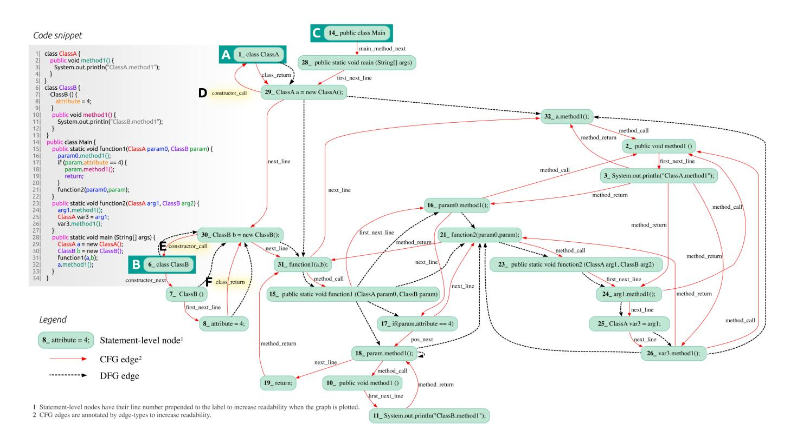

# *COMEX*: A Tool for Generating Customized Source Code Representations

Debeshee Das∗§ 、Noble Saji Mathews∗§ 、Alex Mathai† 、

Srikanth Tamilselvam† 、Kranthi Sedamaki∗ 、Sridhar Chimalakonda∗ および Atul Kumar†

∗ インド工科大学ティルパティ校、インド

† IBM Research, India

{debesheedas, elbonleon, alexmathai98, srikanthtamilselvam, skranthi4444, sridhar.chimalakonda, atulkumar}@gmail.com

*Abstract*—ソースコードの効果的な表現を学習することは、あらゆる機械学習によるソフトウェア工学（ML4SE）システムにとって極めて重要である。自然言語処理から着想を得て、*Codex*や*CodeGen*のような大規模言語モデル（LLM）は、コードを汎用的なテキスト列として扱い、大規模なコードデータコーパスで学習することで、いくつかのソフトウェア工学（SE）タスクで最先端の性能を達成している。しかし、自然言語とは異なり、有効なソースコードはプログラミング言語の基盤となる文法によって厳格な構造とパターンに従う。現行のLLMはコードを単なるトークン列として扱い、このソースコード特有の性質を活用しておらず、Control Flow Graph（CFG）、Data Flow Graph（DFG）、Abstract Syntax Tree（AST）などのコードビューから抽出可能なコードの重要な構造的・意味的特性を見落としている。不幸にも、あらゆるプログラミング言語ごとにコードビューを生成し統合するプロセスは煩雑かつ時間がかかる。この障壁を克服するために、本稿ではツール**COMEX**を提案する―これは、研究者や開発者が機械学習（ML）モデルによる様々なSEタスク向けに利用可能な複数のコードビューを作成・結合できるフレームワークである。本ツールの主な特徴は次のとおりである：(i) ソースコードを直接扱える（コンパイル可能である必要はない）、(ii) 現在JavaとC#をサポートする、(iii) メソッドレベルのスニペットとプログラムレベルのスニペットの両方を、手続き内・手続き間解析の両分析を利用して解析できる、(iv) 広く利用されるインクリメンタルパーサで40以上の言語をサポートする*tree-sitter*の上に構築されており、他言語への拡張が容易である。本ツールのような使いやすいコードビュー生成・カスタマイズ機能が、ソースコードの表現学習手法およびML4SEの研究を促進すると確信する。本ツールのデモンストレーションは[https://youtu.be/GER6U87FVbU.](https://youtu.be/GER6U87FVbU) で見ることができる。

*索引語*—表現学習、静的解析

## I. INTRODUCTION

ソースコード表現学習とは、ソースコードに埋め込まれている有用な構文的および意味的情報を効果的に捉える作業である[\[1\]](#page-3-0)。これは、*コード分類、バグ予測、コードクローン検出*や*コード要約*など、様々なSEタスクのためのMLパイプラインの基盤となるものである。したがって、重要な情報の損失を最小限に抑えつつ、MLモデルで使用するためにソースコードを表現することは、活発な研究分野である[\[2\]](#page-3-1)。ここで重要なのは、ソースコードは自然言語とは異なり、明確な構造とパターンに従い、通常は厳格な基礎文法に準拠している点である。ゆえに、ソースコードの表現を作成する際には、この独自の構造的側面からの情報を反映させることが重要である。この課題に対処するため、GraphCodeBERT[\[3\]](#page-3-2)やGREAT[\[4\]](#page-3-3)を含む多くの研究が、コードビューを活用してソースコード表現を学習する方法を探求してきた。しかしながら、複数のプログラミング言語に対応するコードビューを生成し、それらを様々なSEタスク向けにカスタマイズするプロセスは、多くの場合、時間のかかる作業である。

ほとんどの既存ツールは、(a) 完全にコンパイル可能なコードの解析を前提としており、不完全またはコンパイル不可能なソースコードには対応していない、(b) 単一言語専用である、(c) 手続き内解析（intra-procedural）と手続き間解析（inter-procedural）の両方をサポートできない、という課題がある。これらの問題に対処するため、COMEXというフレームワークを提案する。本フレームワークは、(a) ソースコードを直接利用し、複数のコードビューを生成・統合できる、(b) JavaおよびC#をサポートし（他言語への対応も計画されている）、(c) 手続き内解析・手続き間解析の両方を用いることでメソッドレベルおよびプログラムレベルの断片に対応できる、という特徴がある。また、単一のパーサーパッケージ（*tree-sitter*[1](#page-0-0) ）に基づいているため、追加の依存関係なしに新しい言語への拡張が可能である。

今日現在、最先端のモデルの多く（*CodeGen* [\[5\]](#page-3-4) や *Codex* [\[6\]](#page-3-5) など）は、ソースコードを自由に流れるテキストのように扱っている。この仮定は必要なデータ前処理を簡素化するのに役立つ一方で、コードの多くの構造的側面を失ってしまう。近年、*NSG* [\[7\]](#page-3-6) のような研究により、コード構造を活用する利点が示されている。*NSG* は構文木を用いた弱い教師あり学習によって、構文的に正しい完全なメソッド本体を生成する。この手法を用いることで、比較的小規模なモデル（6300万パラメータ）でも *Codex*（120億パラメータ）といったLLMを上回る性能を発揮できることを、彼らの結果が示している。同様の分野の研究を促進するため、本パッケージによってコードビューの統合と活用を容易にし、ソースコード表現の学習に取り組む研究者の参入障壁を下げることができたと考えている。

## II. RELATED WORK

いくつかのML4SEの研究は、AST［\[8\]\](#page-3-7)、CFG［\[9\]\](#page-3-8)、DFG［\[3\]\](#page-3-2)といったコードビューや、それらの組み合わせ（CDFG［\[10\]\](#page-3-9)）を利用して、より優れたコード表現を学習し、下流のSEタスクにおける性能向上を目指している［\[3\]\](#page-3-2)。しかしながら、このようなビューを生成するために利用可能なツールのほとんどは、特定の1つの言語に特化している。*SOOT*［\[11\]\](#page-3-10)はJava向けの有名な静的解析ツールであるが、入力として与えられるJavaコードがコンパイル可能であり、かつすべての定義が揃っている必要がある。しかし、多くの既存の研究用データセットは、ほとんどがスニペットが不完全なメソッドレベルのデータセットである。

§著者は同等に貢献している

1<https://tree-sitter.github.io/tree-sitter/>

図1．COMEXのアーキテクチャ

および定義[\[12\]](#page-3-11), [\[13\]](#page-3-12)。*python graphs*[\[14\]](#page-3-13)は、Pythonのプログラムグラフを生成するためのフレームワークであり、様々な典型的コードビューからの情報を組み合わせた複合的な「プログラムグラフ」を提供するが、COMEXがサポートしているような典型的コードビューの組み合わせ、削減、カスタマイズの柔軟性はユーザーに提供していない。*Joern*は、しばしばコードの中間グラフ表現のソースとして利用されるオープンソースの静的解析ツールであり、Java、Python、C、C++等をサポートし、カスタマイズや統合、他言語への容易な拡張手段なしにコードビューを提供する。相互手続き的な制御フロー・データフロー解析やインタラクティブな探索・可視化のサポートは限定的である[2](#page-1-0) 。COMEXはこれらの制限を克服し、コンパイル不可のコードであっても、関数レベルおよびプログラムレベルの双方で静的コード解析によるコードビュー生成をサポートし、ビューの即時合成や新たな言語拡張を追加の言語固有パーサ依存性なしで容易に行えるようにしている。

## III. THE COMEX PACKAGE

COMEXはオープンソース化されており[3](#page-1-1)、Pythonパッケージとしても提供されている[4](#page-1-2)。さらに、ユーザーが入力コードスニペット、出力フォーマットタイプ（dot、json、png）、および必要なカスタマイズや異なるコードビューの組み合わせを簡単に指定できるコマンドラインインターフェースも公開している。COMEXの概要はFig. [1.](#page-1-3)に示されている。図から分かるように、COMEXはコードスニペットとユーザー定義によって開始する。

4<https://pypi.org/project/comex/>

設定を入力として受け取る。そのスニペットは*tree-sitter*パーサーを通して具体構文木（CST）を生成する。その後、CSTを処理することで拡張されたシンボルテーブルが作成され、これら両方を合わせてCFGを生成する。CFGを用いて到達定義解析（RDA）を実装し、DFGを生成する。CFGとDFGについては、関数内解析だけでなく関数間解析も実装している点に注意が必要である。以下では、COMEXを通じて利用可能にしているさまざまなコードビューの詳細について説明する。

## *A. Abstract Syntax Tree*

*tree-sitter*によって提供されるCSTノードの一部をフィルタリングすることでASTを生成する。セミコロン（;）や中括弧（{,}）のような自明なノードは除外し、一方で*field access*や*method invocation*のような自明でないノードは保持する。また、ASTに対して以下のようなカスタマイズも提供している。(i) *collapsed AST* および (ii) *minimized AST* である。*「collapsed AST」* とは、同じ変数が出現するすべての箇所を一つのノードに集約したASTである。これに対し、*「minimized AST」* では、コード表現の目的に応じて特定のノード型を*「ブラックリスト」*に指定できる。このようなカスタマイズの根拠は、重要な情報を失うことなく、より小さなASTを提供することである。これによりASTノード数が減少し、グラフサイズも小さくなるため、Graph Neural Network (GNN) [\[20\]](#page-3-16) を用いたソースコード表現学習の計算上の困難さが緩和される。

## *B. Control-Flow Graph*

*文単位の制御フロー* - *tree-sitter* で生成されたCSTおよび強化されたシンボルテーブルを用いて、CFGコードビューの作成を進める。典型的なCFGは、各ブロックが命令の集合である基本ブロックのネットワークで構成されている。

2[https://galois.com/blog/2022/08/mate-interactive-program-analysis-with](https://galois.com/blog/2022/08/mate-interactive-program-analysis-with-code-property-graphs/)[code-property-graphs/](https://galois.com/blog/2022/08/mate-interactive-program-analysis-with-code-property-graphs/)

3<https://github.com/IBM/tree-sitter-codeviews>

図2. 複数の関数を含むコードスニペットに対して、COMEXが生成した文レベルのCFG+DFGであり、手続き間の制御フローおよびデータフローを示している。

中間的な制御ジャンプなしに順次実行される。したがって、CFGの構築は通常2段階のプロセスであり、最初に基本ブロックを特定し、その後、ブロック間の制御フローエッジを決定する。しかし、COMEXにおいては、文ごとの制御フローをマッピングする文レベルのCFGを生成することを選択している。これは、一部の機械学習ベースの手法や、([§III-C\)](#page-2-0)で詳述するDFGの生成に有用である。JavaおよびC#のCFGは、いずれも制御フローの文レベルでの近似である。

*手続き間の制御フロー* - クラス定義、オブジェクト参照の宣言、抽象化および継承の仕様、メソッドおよびコンストラクタのシグネチャやオーバーロードをすべて静的に解析することによって、手続き間の制御フローをサポートしている。図[2](#page-2-1)は、*Main*クラス（C）とは別に、二つのクラス定義である*ClassA*（A）および*ClassB*（B）を含むコードスニペットを示している。CFGのエッジは赤でハイライトされている。この図は、オブジェクト生成時に、クラス定義に制御フローがどのように変化するかを、「コンストラクタ呼び出し」エッジD（29 → 1）およびE（30 → 6）を通じて表している。ClassBには明示的なコンストラクタが用意されているため、インスタンス化箇所へ戻る前にコンストラクタを経由して制御が流れ、「クラスリターン」エッジF（8 → 30）によって戻ることになる。メソッドやコンストラクタのオーバーロードがある場合には、関数シグネチャを比較して制御フローのエッジを決定する。オブジェクト参照に対してメソッドが呼び出される場合、それらは該当するクラス内の関数シグネチャと利用可能な静的参照を照合することで対応する定義とリンクされる。ネストされた関数呼び出しについても、関数呼び出しとその定義の静的に取得可能なすべてのシグネチャを追跡し、対応付けることで対応している。

## *C. Data-Flow Graph*

([§III-B\)](#page-1-4)で生成されたCFGを用いて、データフロー解析を実施し、DFGコードビューを作成する。データフロー解析における基本的な手法の一つは*Reaching Definition Analysis (RDA)*であり、これはあるプログラムポイントに到達する可能性のある定義、すなわちその時点で変数の値に影響を及ぼす可能性のある定義の集合を特定することである。この情報を用いて文レベルのDFGが生成される。RDAに基づく実装を用いることで、GraphCodeBERT [\[3\]](#page-3-2)が用いるデータフロー抽出ロジックに見られた、手続き間解析の欠如、スコープ情報の誤った取り扱い、ループを介したデータフロー処理の問題といった多くの重大な欠点に対処できることが確認できた。ただし、RDAに基づく解析は本質的により計算コストが高いことに注意する必要がある。

メソッドレベルの解析に加え、*二相RDA*によるプログラムレベルDFGも標準でサポートしている。第一段階では各メソッドに対して通常のRDAアルゴリズムを適用し、続いて手続き間の制御フローも考慮に入れたRDAの再度のイテレーションを行う。この実装により、メソッド呼び出しを介してパラメータとして渡される変数への変更を追跡することが可能である。これは非プリミティブ型データに対してのみ実施される。なぜなら、JavaやC#においてプリミティブ型データは値渡しとなるためである。本格的なエイリアス解析は、全ての可能なエイリアス関係を正確に決定することが難しく、計算コストも高い。そのため、本システムではプログラム内のメモリ参照を近似的に扱う部分的なエイリアス解析手法をサポートしている。また、「LastDef」と「LastUse」という二つの追加データフロー関係も提供している。「LastDef」を有効にすると、変数の再定義間や宣言と定義間にエッジが追加される。同様に、「LastUse」は変数の現在の使用箇所と直前に読み取られたプログラムポイントをリンクする。これらの関係により、主にグローバル変数を使用し、メソッド本体内で定義されていないメソッドレベルのスニペットに対して、より多くのエッジを追加することが可能となる。

## *D. Combinations and Customizations*

*コードビュー*の生成に加えて、COMEXは複数のコードビューを*結合およびカスタマイズ*し、単一のグラフとして統合することもできる。例えば、CFGとDFGの組み合わせでは、2つのコードビューを個別に生成し、図[2.](#page-2-1)に示すようにノードごとの一意な識別子に基づいてそれらを結合するのである。さらに、1つのパーサーパッケージのみを使用しているため、全言語にわたってシームレスに機能する単一モジュール（*CombinedDriver*）によってこの機能を実装できている。COMEXは現在、15種類を超える*カスタマイズされた*表現を生成することが可能である[5](#page-3-17)。

## IV. DISCUSSION AND LIMITATIONS

COMEXは、MLベースのSEタスクのベンチマークとして一般的に使用されている大規模データセット（CodeNet [\[21\]](#page-3-18)、CodeSearchNet [\[12\]](#page-3-11)、および[\[22\]](#page-3-19)）上で得られるコードビューを生成・検証することで、ロバスト性をテストした。これら多くのデータポイントは定義が欠落しておりコンパイル不可であるが、構文エラーがなければコードビューの生成には成功している。しかし、非コンパイル可能な入力コードスニペットもサポートしているため、通常はコンパイル可能なコードでのみ機能する非常に正確なエイリアス解析を提供することはできない。その代わり、部分的なエイリアス解析を提供している。前述のデータセットの中で、C#のデータポイントを含むのは[\[22\]](#page-3-19)のみであるため、Javaコードビューの実装の方がC#実装よりもロバストであると期待している。

## V. CONCLUSION AND FUTURE WORK

ソースコード表現学習の研究においては、コードを通常の自然言語テキストとして扱うだけでなく、制御フローやデータフロー、読取・書込依存関係など、コード特有の性質を活用した注目すべき研究が多数存在する。これに関連し、COMEXはこの分野の研究者や開発者が、新しい表現学習手法のためにコードビューから構造情報を抽出・カスタマイズすることを可能にすると考えている。COMEXはさらなるコードビューやその組み合わせへの拡張を可能とするフレームワークを提供しており、またPythonやC++のような他の多くの主要言語への容易な拡張もできるため、ML4SEおよび効果的なソースコード表現学習の研究を促進することができる。

## REFERENCES

[1] M. Allamanis, M. Brockschmidt, and M. Khademi,「グラフを用いてプログラムを表現することを学習する」*arXiv preprint arXiv:1711.00740*, 2017年。

- [2] M. Allamanis, E. T. Barr, P. Devanbu, and C. Sutton, "A survey of machine learning for big code and naturalness," *ACM Comput. Surv.*, vol. 51, no. 4, jul 2018. [Online]. Available: <https://doi.org/10.1145/3212695>
- [3] D. Guo, S. Ren, S. Lu, Z. Feng, D. Tang, S. Liu, L. Zhou, N. Duan, A. Svyatkovskiy, S. Fu *et al.*, "Graphcodebert: Pre-training code representations with data flow," *arXiv preprint arXiv:2009.08366*, 2020.
- [4] V. J. Hellendoorn、P. Maniatis、R. Singh、C. Sutton、D. Bieber, "Global relational models of source code," 2020. [オンライン]. 利用可能: <https://openreview.net/forum?id=B1lnbRNtwr>
- [5] E. Nijkamp、B. Pang、H. Hayashi、L. Tu、H. Wang、Y. Zhou、S. Savarese、C. Xiongによる「Codegen: 複数ターンのプログラム合成を備えたコード向けのオープンな大規模言語モデル」、2023年。
- [6] M. Chen, J. Tworek, H. Jun *et al.*, "Evaluating large language models trained on code," 2021年。
- [7] R. Mukherjee、Y. Wen、D. Chaudhari、T. W. Reps、S. Chaudhuri、およびC. Jermaine, "Neural program generation modulo static analysis," 2021年。
- [8] D. Johnson、H. Larochelle、および D. Tarlow、「有限状態オートマトン層によるグラフ構造の学習」、*Advances in Neural Information Processing Systems*、vol. 33、pp. 3082–3093、2020年。
- [9] D. Bieber, R. Goel, D. Zheng, H. Larochelle, and D. Tarlow, "外部リソース記述を用いてプログラムの実行を学習し実行時エラーを静的に予測する," 2022年。
- [10] S. Vasudevan, W. J. Jiang, D. Bieber, R. Singh, C. R. Ho, C. Sutton *et al.*, "Learning semantic representations to verify hardware designs," *Advances in Neural Information Processing Systems*, vol. 34, pp. 23 491– 23 504, 2021.
- [11] R. Vallee-Rai, P. Co, E. Gagnon, L. Hendren, P. Lam, および V. Sundaresan, 『Soot - a java bytecode optimization framework』、*Proceedings of the 1999 Conference of the Centre for Advanced Studies on Collaborative Research*、CASCON '99、IBM Press、1999年、p. 13。
- [12] H. Husain、H.-H. Wu、T. Gazit、M. Allamanis、M. Brockschmidt、「Codesearchnet challenge: Evaluating the state of semantic code search」、2019年。[オンライン]。入手先: <https://arxiv.org/abs/1909.09436>
- [13] J. Svajlenko、J. F. Islam、I. Keivanloo、C. K. Roy、およびM. M. Mia、「プロジェクト間コードクローンのためのビッグデータでキュレートされたベンチマークに向けて」、*2014 IEEE International Conference on Software Maintenance and Evolution*にて。IEEE、2014年、pp. 476–480。
- [14] D. Bieber, K. Shi, P. Maniatis, C. Sutton, V. Hellendoorn, D. Johnson, and D. Tarlow, "A library for representing python programs as graphs for machine learning," *arXiv preprint arXiv:2208.07461*, 2022.
- [15] Y. Zhou, S. Liu, J. Siow, X. Du, and Y. Liu, "Devign: Effective vulnerability identification by learning comprehensive program semantics via graph neural networks," *Advances in neural information processing systems*, vol. 32, 2019.
- [16] B. Alsulami、E. Dauber、R. Harang、S. Mancoridis、およびR. Greenstadt、「Long Short-Term Memoryベースのネットワークを用いたソースコード著者識別」、*Computer Security–ESORICS 2017: 22nd European Symposium on Research in Computer Security, Oslo, Norway, September 11-15, 2017, Proceedings, Part I 22*。Springer、2017年、pp. 65–82。
- [17] Z. Li, D. Zou, S. Xu, H. Jin, H. Qi, and J. Hu, "Vulpecker: an automated vulnerability detection system based on code similarity analysis," in *Proceedings of the 32nd annual conference on computer security applications*, 2016, pp. 201–213.
- [18] E. Dauber, A. Caliskan, R. Harang, and R. Greenstadt, 「Git blame who? stylistic authorship attribution of small, incomplete source code fragments」, *Proceedings of the 40th International Conference on Software Engineering: Companion Proceeedings*, 2018, pp. 356–357 に掲載されている。
- [19] A. Machiry、N. Redini、E. Camellini、C. Kruegel、G. Vigna、「Spider: Enabling fast patch propagation in related software repositories」、*2020 IEEE Symposium on Security and Privacy (SP)*にて発表。IEEE、2020年、pp. 1562–1579。
- [20] T. Long, Y. Xie, X. Chen, W. Zhang, Q. Cao, and Y. Yu, 「プログラミング言語処理のためのマルチビューグラフ表現：アルゴリズム検出に関する調査」*arXiv preprint arXiv:2202.12481*, 2022年。
- [21] IBM、「Project codenet」、[https://developer.ibm.com/data/](https://developer.ibm.com/data/project-codenet/) [project-codenet/,](https://developer.ibm.com/data/project-codenet/) 2021、アクセス日: 2022-06-10。
- [22] A. T. Nguyen, T. T. Nguyen, and T. N. Nguyen, 「ソースコードのためのマルチフェーズ統計的マイグレーションに対する分割統治手法」, in *2015 30th IEEE/ACM International Conference on Automated Software Engineering (ASE)*, 2015, pp. 585–596.

5リポジトリ内の[List-Of-Views.pdf](https://github.com/IBM/tree-sitter-codeviews/blob/main/List_Of_Views.pdf)を参照されたい。完全なリストが記載されている。
