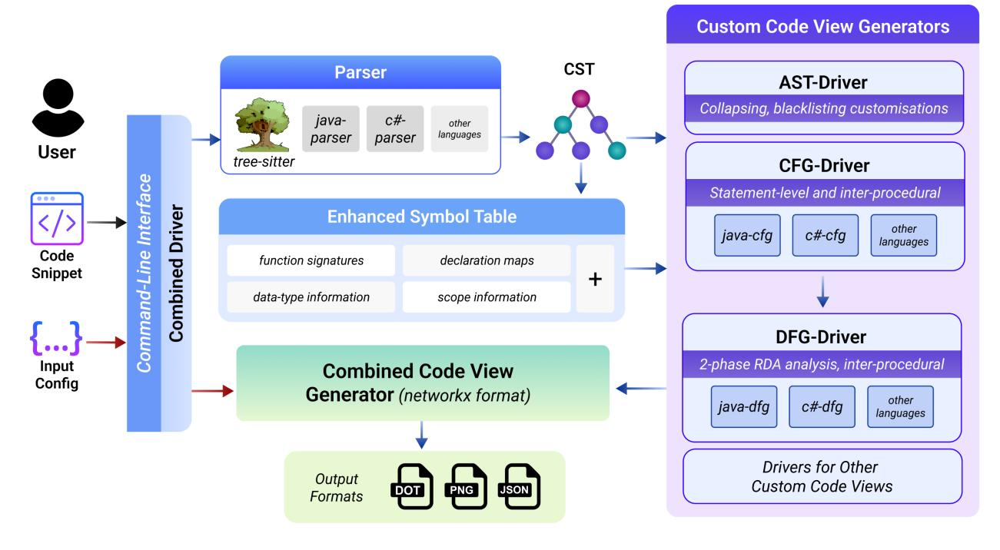
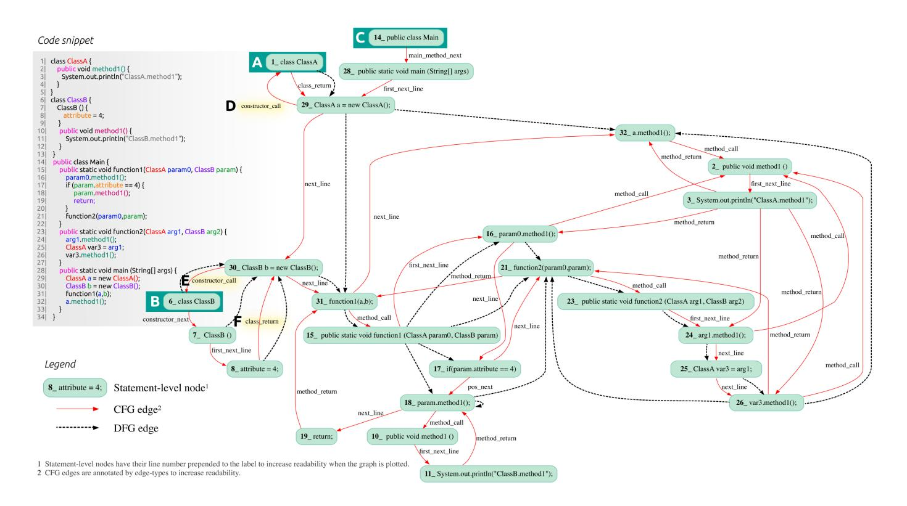

# *COMEX*: A Tool for Generating Customized Source Code Representations

Debeshee Das∗§ , Noble Saji Mathews∗§ , Alex Mathai† ,

Srikanth Tamilselvam† , Kranthi Sedamaki∗ , Sridhar Chimalakonda∗ and Atul Kumar†

∗ Indian Institute of Technology Tirupati, India

† IBM Research, India

{debesheedas, elbonleon, alexmathai98, srikanthtamilselvam, skranthi4444, sridhar.chimalakonda, atulkumar}@gmail.com

*Abstract*—Learning effective representations of source code is critical for any Machine Learning for Software Engineering (ML4SE) system. Inspired by natural language processing, large language models (LLMs) like *Codex* and *CodeGen* treat code as generic sequences of text and are trained on huge corpora of code data, achieving state of the art performance on several software engineering (SE) tasks. However, valid source code, unlike natural language, follows a strict structure and pattern governed by the underlying grammar of the programming language. Current LLMs do not exploit this property of the source code as they treat code like a sequence of tokens and overlook key structural and semantic properties of code that can be extracted from code-views like the Control Flow Graph (CFG), Data Flow Graph (DFG), Abstract Syntax Tree (AST), etc. Unfortunately, the process of generating and integrating code-views for every programming language is cumbersome and time consuming. To overcome this barrier, we propose our tool **COMEX** - a framework that allows researchers and developers to create and combine multiple codeviews which can be used by machine learning (ML) models for various SE tasks. Some salient features of our tool are: (i) it works directly on source code (which need not be compilable), (ii) it currently supports Java and C#, (iii) it can analyze both methodlevel snippets and program-level snippets by using both intraprocedural and inter-procedural analysis, and (iv) it is easily extendable to other languages as it is built on *tree-sitter* - a widely used incremental parser that supports over 40 languages. We believe this easy-to-use code-view generation and customization tool will give impetus to research in source code representation learning methods and ML4SE. The demonstration of our tool can be found at [https://youtu.be/GER6U87FVbU.](https://youtu.be/GER6U87FVbU)

*Index Terms*—Representation Learning, Static Analysis

## I. INTRODUCTION

Source code representation learning is the task of effectively capturing useful syntactic and semantic information embedded in source code [\[1\]](#page-3-0). It forms the backbone of ML pipelines for various SE tasks such as *code classification, bug prediction, code clone detection* and *code summarization*. Therefore, representing source code for use in ML models, with minimal loss of important information is an active research area [\[2\]](#page-3-1). It is important to note that source code is different from natural language as it follows an unambiguous structure and pattern, usually adhering to a strict underlying grammar. Hence, while creating representations for source code, it is important to infuse information from this unique structural aspect. To address this, many works including GraphCodeBERT [\[3\]](#page-3-2) and GREAT [\[4\]](#page-3-3) have explored leveraging code-views as a means to learn source code representations. Unfortunately, the process of generating code-views for multiple programming languages and customizing them for various SE tasks is often a time consuming process.

Most available tools are (a) positioned for analysis on compiled or compilable code (and not incomplete or uncompilable source code), (b) are specific for a single language, and (c) are not able to support both intra-procedural and inter-procedural analysis. To address these concerns, we propose COMEX - a framework that (a) works directly on source code to generate and combine multiple code-views, (b) supports Java and C# (with planned support for other languages) and (c) works for both method-level and program-level snippets using intraprocedural and inter-procedural analysis. Since it is based on a single parser package (*tree-sitter*[1](#page-0-0) ), it can be extended to new languages without additional dependencies.

As of today, most state-of-the-art models like *CodeGen* [\[5\]](#page-3-4) and *Codex* [\[6\]](#page-3-5) treat source code like free flowing text. Though this assumption helps simplify the required data preprocessing, it loses out on many structural aspects of code. Recently, works like *NSG* [\[7\]](#page-3-6) have shown the benefits of using code structure. *NSG* leverages weak supervision using a syntax tree to generate full-length syntactically valid method bodies. Their results showcase that using this technique, even a small model (63 million parameters) can outperform LLMs like *Codex* (12 billion parameters). To fuel research on similar grounds, we hope that with this package, we have lowered the entry barrier for researchers to easily integrate and leverage code-views while learning source code representations.

## II. RELATED WORK

Several ML4SE works leverage code-views such as the AST [\[8\]](#page-3-7), the CFG [\[9\]](#page-3-8), the DFG [\[3\]](#page-3-2), and their combinations (CDFG [\[10\]](#page-3-9)), to learn better code representations and improve performance on downstream SE tasks [\[3\]](#page-3-2). Unfortunately, most available tools that create such views are specific to a single language. *SOOT* [\[11\]](#page-3-10), a popular static analysis tool for Java, requires the input Java code to be compilable and for all definitions to be available. But many existing research datasets are mostly method-level datasets with incomplete snippets

§Authors have contributed equally

1<https://tree-sitter.github.io/tree-sitter/>

Fig. 1. Architecture of COMEX

and definitions [\[12\]](#page-3-11), [\[13\]](#page-3-12). Although *python graphs* [\[14\]](#page-3-13), a framework for generating program graphs for Python, provides a composite "program graph" with combined information from various typical code-views, it does not provide users the flexibility to combine, reduce or customize the typical code-views as supported by COMEX. *Joern* is an open-source static analysis tool often used as a source for intermediate graph representations of code [\[15\]](#page-3-14)–[\[19\]](#page-3-15) with support for Java, Python, C, C++, etc., providing code-views without a means to customize, combine, or easily extend to other languages. It has limited support for inter-procedural control-flow and data-flow analysis, and for interactive exploration and visualization[2](#page-1-0) . COMEX overcomes these limitations by providing support for generation of code-views through static code analysis even for non-compilable code both at function and program level, supporting out-of-the-box composition of views and easy extension to new languages without introducing further language-specific parser dependencies.

## III. THE COMEX PACKAGE

COMEX is open-sourced[3](#page-1-1) and also made available as a Python package[4](#page-1-2) . Additionally, we have exposed a commandline-interface that allows users to conveniently specify the input code-snippet, output format types (dot,json,png) and any required customizations or combinations of different codeviews. An overview of COMEX is depicted in Fig. [1.](#page-1-3) As can be seen, COMEX starts with a code snippet and user-defined

4<https://pypi.org/project/comex/>

configuration as input. The snippet is then passed through a *tree-sitter* parser to generate a concrete syntax tree (CST). An enhanced symbol table is created by processing the CST, and both of these together are used to create a CFG. Using the CFG, we implement reaching definition analysis (RDA) to generate the DFG. It is important to note that for CFG and DFG we implement both intra-procedural and inter-procedural analysis. In what follows, we elaborate on the details of the different code-views that we make available through COMEX.

## *A. Abstract Syntax Tree*

We generate an AST by filtering some of the CST nodes provided by *tree-sitter*. Trivial nodes such as semicolons (;) and braces ({,}) are dropped, while non-trivial nodes such as *field access* or *method invocation* are retained. We also provide customizations for the AST like (i) a *collapsed AST* and (ii) a *minimized AST*. A *'collapsed AST'* is one where all occurrences of the same variable are collapsed into one node. Whereas, in a *'minimized AST'*, certain node types can be *'blacklisted'* based on the purpose of the code representation. The rationale behind these customizations is to provide smaller ASTs without losing out on critical information. This results in fewer AST nodes, thus reducing graph sizes which helps make Graph Neural Network (GNN) [\[20\]](#page-3-16) approaches to source code representation learning computationally tractable.

## *B. Control-Flow Graph*

*Statement-level control-flow* - Using the *tree-sitter* generated CST and the enhanced symbol table, we proceed to create our CFG code-view. A typical CFG consists of a network of basic blocks, where each block is a set of instructions that

2[https://galois.com/blog/2022/08/mate-interactive-program-analysis-with](https://galois.com/blog/2022/08/mate-interactive-program-analysis-with-code-property-graphs/)[code-property-graphs/](https://galois.com/blog/2022/08/mate-interactive-program-analysis-with-code-property-graphs/)

3<https://github.com/IBM/tree-sitter-codeviews>

Fig. 2. Statement-level CFG+DFG generated by COMEX for a code snippet with multiple functions showing inter-procedural control-flow and data-flow

execute sequentially with no intermediate control jump. Hence, constructing a CFG is usually a two-step process, where we first identify the basic blocks and then determine the controlflow edges between them. However, in COMEX, we choose to produce a statement-level CFG that maps the controlflow between statements (and not blocks). This is useful for certain ML-based approaches and for generating the DFG as elaborated in ([§III-C\)](#page-2-0). The CFG for both Java and C# is a statement-level approximation of control-flow.

*Inter-procedural control-flow* - We support inter-procedural control-flow by statically analyzing all class definitions, object reference declarations, abstraction and inheritance specifications, method and constructor signatures and overloading. Fig. [2](#page-2-1) shows a code snippet with two class definitions, *ClassA* (A) and *ClassB* (B), apart from the *Main* class (C). The CFG edges are highlighted in red. The diagram depicts the change of control-flow during object instantiation to the corresponding class definition via "constructor call" edges D (29 → 1) and E (30 → 6). As an explicit constructor is available for ClassB, the control flows through the constructor before returning to the site of instantiation via the "class return" edge F (8 → 30) . In case of method or constructor overloading, the function signatures are compared to determine the control-flow edges. When methods are called on object references, they are linked with the corresponding definition by matching the function signatures and available static references within the corresponding class. Nested function calls are also handled by tracking and mapping back all statically available signatures of function calls and their definitions.

## *C. Data-Flow Graph*

Using the CFG generated in ([§III-B\)](#page-1-4), we perform data-flow analysis to create our DFG code-view. One of the fundamental techniques in data-flow analysis is *Reaching Definition Analysis (RDA)* where we identify the set of definitions that may reach a program point, i.e., the definitions that may affect the value of a variable at that point. A statementlevel DFG is then generated using this information. Using the RDA-based implementation addresses many of the significant drawbacks that we found in the data-flow extraction logic used by GraphCodeBERT [\[3\]](#page-3-2) such as lack of inter-procedural analysis, incorrect handling of scope information as well as data-flow thorough loops. It should be noted that the RDAbased analysis is inherently more computationally expensive.

In addition to method level analysis, we also support an outof-the-box program-level DFG via a *two-phase RDA*. The first phase is the typical RDA algorithm for each method, followed by another iteration of RDA that also takes into consideration the inter-procedural control-flow. This implementation helps track changes made to variables that are passed as parameters via method invocations. This is only performed for non-primitive data-types since primitive data-types are passed by value in Java and C#. A full-blown alias analysis, which precisely determines all possible aliasing relationships can be challenging and computationally expensive. We hence support a partial alias analysis technique that approximates the possible memory references in a program. We also provide two additional data-flow relations - "LastDef" and "LastUse". Enabling "LastDef" results in edges that link between redefinitions of variables as well as edges between declarations and definitions of variables. Similarly, "LastUse" links the current use of a variable to the last program point where it was read. These relationships help add more edges in those method-level snippets that mainly use global variables which are not defined in the method body.

## *D. Combinations and Customizations*

In addition to *generating* code-views, COMEX can also *combine and customize* multiple code-views into a single graph. For example, a combination of CFG and DFG would generate the two code-views separately and then combine them based on unique node identifiers as shown in Fig. [2.](#page-2-1) Additionally, as we used just one parser package, we are able to implement this feature using a single module (*CombinedDriver*) that works seamlessly across all languages. COMEX is currently capable of generating over 15 different *customized* representations[5](#page-3-17) .

## IV. DISCUSSION AND LIMITATIONS

COMEX was tested for robustness by generating and validating the code-views obtained on the large datasets popularly used for benchmarking ML-based SE tasks (CodeNet [\[21\]](#page-3-18), CodeSearchNet [\[12\]](#page-3-11) and [\[22\]](#page-3-19)). Many of these datapoints have missing definitions and are not compilable, but their codeviews were successfully generated as long as they were free of syntax errors. However, we are unable to provide a very accurate alias analysis that usually works only for compilable code because we support non-compilable input code snippets. Instead we provide a partial alias analysis. Among the aforementioned datasets, only [\[22\]](#page-3-19) has C# datapoints which is why we expect our implementation of Java code-views to be more robust than our C# implementation.

## V. CONCLUSION AND FUTURE WORK

In source code representation learning research, there are many notable works that exploit code-specific properties like control-flow, data-flow, read-write dependencies, etc., in addition to treating code as regular natural language text. To this end, we believe that COMEX will enable researchers and developers in this domain to extract and customize structural information from code-views for new methods of representation learning. COMEX provides a framework which can be extended to support more code-views and their combinations and can be easily extended to many other popular languages like Python and C++ which can spur research in ML4SE and effective source code representation learning.

## REFERENCES

[1] M. Allamanis, M. Brockschmidt, and M. Khademi, "Learning to represent programs with graphs," *arXiv preprint arXiv:1711.00740*, 2017.

- [2] M. Allamanis, E. T. Barr, P. Devanbu, and C. Sutton, "A survey of machine learning for big code and naturalness," *ACM Comput. Surv.*, vol. 51, no. 4, jul 2018. [Online]. Available: <https://doi.org/10.1145/3212695>
- [3] D. Guo, S. Ren, S. Lu, Z. Feng, D. Tang, S. Liu, L. Zhou, N. Duan, A. Svyatkovskiy, S. Fu *et al.*, "Graphcodebert: Pre-training code representations with data flow," *arXiv preprint arXiv:2009.08366*, 2020.
- [4] V. J. Hellendoorn, P. Maniatis, R. Singh, C. Sutton, and D. Bieber, "Global relational models of source code," 2020. [Online]. Available: <https://openreview.net/forum?id=B1lnbRNtwr>
- [5] E. Nijkamp, B. Pang, H. Hayashi, L. Tu, H. Wang, Y. Zhou, S. Savarese, and C. Xiong, "Codegen: An open large language model for code with multi-turn program synthesis," 2023.
- [6] M. Chen, J. Tworek, H. Jun *et al.*, "Evaluating large language models trained on code," 2021.
- [7] R. Mukherjee, Y. Wen, D. Chaudhari, T. W. Reps, S. Chaudhuri, and C. Jermaine, "Neural program generation modulo static analysis," 2021.
- [8] D. Johnson, H. Larochelle, and D. Tarlow, "Learning graph structure with a finite-state automaton layer," *Advances in Neural Information Processing Systems*, vol. 33, pp. 3082–3093, 2020.
- [9] D. Bieber, R. Goel, D. Zheng, H. Larochelle, and D. Tarlow, "Static prediction of runtime errors by learning to execute programs with external resource descriptions," 2022.
- [10] S. Vasudevan, W. J. Jiang, D. Bieber, R. Singh, C. R. Ho, C. Sutton *et al.*, "Learning semantic representations to verify hardware designs," *Advances in Neural Information Processing Systems*, vol. 34, pp. 23 491– 23 504, 2021.
- [11] R. Vallee-Rai, P. Co, E. Gagnon, L. Hendren, P. Lam, and V. Sundaresan, ´ "Soot - a java bytecode optimization framework," in *Proceedings of the 1999 Conference of the Centre for Advanced Studies on Collaborative Research*, ser. CASCON '99. IBM Press, 1999, p. 13.
- [12] H. Husain, H.-H. Wu, T. Gazit, M. Allamanis, and M. Brockschmidt, "Codesearchnet challenge: Evaluating the state of semantic code search," 2019. [Online]. Available:<https://arxiv.org/abs/1909.09436>
- [13] J. Svajlenko, J. F. Islam, I. Keivanloo, C. K. Roy, and M. M. Mia, "Towards a big data curated benchmark of inter-project code clones," in *2014 IEEE International Conference on Software Maintenance and Evolution*. IEEE, 2014, pp. 476–480.
- [14] D. Bieber, K. Shi, P. Maniatis, C. Sutton, V. Hellendoorn, D. Johnson, and D. Tarlow, "A library for representing python programs as graphs for machine learning," *arXiv preprint arXiv:2208.07461*, 2022.
- [15] Y. Zhou, S. Liu, J. Siow, X. Du, and Y. Liu, "Devign: Effective vulnerability identification by learning comprehensive program semantics via graph neural networks," *Advances in neural information processing systems*, vol. 32, 2019.
- [16] B. Alsulami, E. Dauber, R. Harang, S. Mancoridis, and R. Greenstadt, "Source code authorship attribution using long short-term memory based networks," in *Computer Security–ESORICS 2017: 22nd European Symposium on Research in Computer Security, Oslo, Norway, September 11-15, 2017, Proceedings, Part I 22*. Springer, 2017, pp. 65–82.
- [17] Z. Li, D. Zou, S. Xu, H. Jin, H. Qi, and J. Hu, "Vulpecker: an automated vulnerability detection system based on code similarity analysis," in *Proceedings of the 32nd annual conference on computer security applications*, 2016, pp. 201–213.
- [18] E. Dauber, A. Caliskan, R. Harang, and R. Greenstadt, "Git blame who? stylistic authorship attribution of small, incomplete source code fragments," in *Proceedings of the 40th International Conference on Software Engineering: Companion Proceeedings*, 2018, pp. 356–357.
- [19] A. Machiry, N. Redini, E. Camellini, C. Kruegel, and G. Vigna, "Spider: Enabling fast patch propagation in related software repositories," in *2020 IEEE Symposium on Security and Privacy (SP)*. IEEE, 2020, pp. 1562– 1579.
- [20] T. Long, Y. Xie, X. Chen, W. Zhang, Q. Cao, and Y. Yu, "Multi-view graph representation for programming language processing: An investigation into algorithm detection," *arXiv preprint arXiv:2202.12481*, 2022.
- [21] IBM, "Project codenet," [https://developer.ibm.com/data/](https://developer.ibm.com/data/project-codenet/) [project-codenet/,](https://developer.ibm.com/data/project-codenet/) 2021, accessed: 2022-06-10.
- [22] A. T. Nguyen, T. T. Nguyen, and T. N. Nguyen, "Divide-and-conquer approach for multi-phase statistical migration for source code (t)," in *2015 30th IEEE/ACM International Conference on Automated Software Engineering (ASE)*, 2015, pp. 585–596.

5Please refer to [List-Of-Views.pdf](https://github.com/IBM/tree-sitter-codeviews/blob/main/List_Of_Views.pdf) in the repository for a complete list